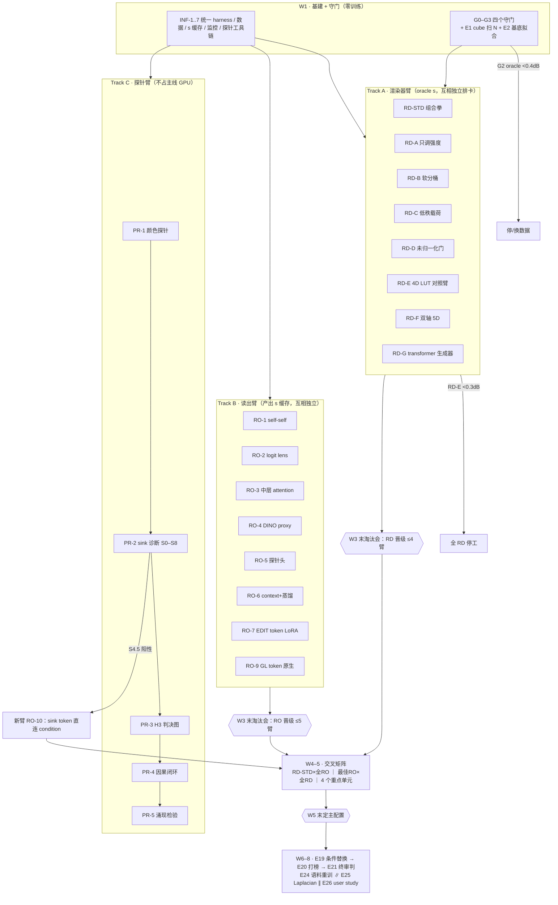

# 实验总案 v3：双创新点 · 多臂并行 · 排期（2026-08-02）

> 取代 `DECISION_TREE_2026-07-31.md` 的单主线结构（该文档保留作 gate 判据参考）。方法细节与文献判据见 `PLAN_v2_local-retouch_2026-07-31.md`；论文全集见 `SURVEY_papers_2026-07-31.md`；**实现档案 `IMPL_DOSSIER_*.md` 由第 9 轮调研生成后回填**（本文标 ⟦档案⟧ 处）。
> 前提：训练资源充足（按 ≥16 卡并行编排）。原则从"单主线+止损"改为：**设计空间摊开成并行臂 → 统一 harness 计分 → 每周淘汰会**。

---

## 0. 两个核心创新点与实验总览

| | 创新点 ① 统一读出 | 创新点 ② 语义轴渲染器 |
|---|---|---|
| 主张 | VLM 表征里同时有 what（颜色）与 where（空间），现有 3-latent 读出口太窄；换一个"第 L 层 → 色彩条件 + 空间基 + 基底权重"的宽读出口 | 色彩变换的查表定义域加一根语义轴 s：GLUT 高斯升 4D + 掩膜基底生产 s；空间可变但参数仍是 LUT 量级、可烘焙导出 |
| 实验臂 | 读出臂 RO-0..RO-9 + 探针臂 PR-1..PR-5 | 渲染器臂 RD-STD..RD-H + 基底臂 MB-1..MB-5 |
| 科学支撑 | probe-vs-behavior gap（H1/H2/H3） | 容量阶梯 + 塌陷数学（H4/H5） |
| 决定性消融 | E21（D-7 蒸馏 init vs 随机 init） | 三档轴消融（无 s / 自学 s / VLM s） |

**多臂并行的关键解耦机制（INF-5）**：每个读出臂把 s 场**离线导出成缓存**（32×32，约 2KB/图）。渲染器臂训练时只读缓存、零 VLM 成本 → 读出臂 × 渲染器臂可以完全独立排卡，交叉组合只是换一个缓存目录。

---

## 1. 共享基础设施（W1 建完，所有臂插拔）

| 编号 | 内容 | 说明 |
|---|---|---|
| INF-1 | **统一评测 harness** | 输入接口 `(render_fn, s_source)`；输出：masked PSNR 三分（掩膜内/**边界带预注册 ±3 px**（k∈{1,3,8} 留附录消融）/外）、ΔE00、LPIPS、**Δ_const / Δ_shuffle**（每行必带）、烘焙一致性（四面体插值回读）、配对 bootstrap CI。跑完自动进总榜。 |
| INF-2 | 构造数据生成器 | L0–L7 八级 ×（幅度 4 档 × 羽化 4 档 × 面积 4 档），每级 ≥2000 张；几何/语义/全局三族；GT 掩膜全保留。参数见 PLAN §3。 |
| INF-3 | 4000-cube 语料 + Stage-0 金标准 | E1 的产出：N\*、逐 cube 金标准参数、k-means 锚点、参数边缘分布。**实现**：colour-science `read_LUT_IridasCube`（R 变最快、reshape order='F'）+ AceTone `convert_luts.py` 统一 32³（**其 apply_lut 有 BGR 翻转约定，先对拍 identity**）；Hald 按 GLUT 协议 128³ 训 / 留出色测（**颜色空间 split 非图像 split**）；ImageMagick `-hald-clut` 对拍验行序（DOSSIER §4.3） |
| INF-4 | FiveK/PPR10K 管线 + Δ_ceil 分层 | FiveK 用 Zeng 官方 480p 成品包（GoogleDrive 含 split txt；**PSNR 必须 round×255 后算**）；PPR10K 只下 360p tif+masks（91GB+56MB），指标必须走官方 `calculate_metrics.m`（**训练权重 5/1 与评测权重 1/0.5 两处口径不同勿混**）；差分分层切局部/全局子集（PLAN §4.1；DOSSIER §4.1–4.2） |
| INF-5 | **s 缓存服务** | 每臂一个目录：`s_cache/{arm}/{img_id}_{instr_hash}.npy` + 元数据（层号/归一化参数）。含 oracle 目录（GT 掩膜）。 |
| INF-6 | 监控面板 | M1–M9 全量（PLAN §3），tensorboard 模板，红线自动报警。 |
| INF-7 | 探针工具链 | 选型定稿：探针+MDL **自实现**（~50 行，配方抄 Hewitt/Voita）；擦除用 **concept-erasure（LEACE）**、steering 用 **repeng**（ControlModel 就地改结构——**先采集后包装**）、全链路干预用 **nnsight**（TransformerLens 零 VLM 支持）、tuned lens 需自写 VLM 训练循环（纯文本 lens 在视觉 token 上不可信）。安装清单见 DOSSIER §六 |

---

## 2. 创新点 ①：读出臂（RO）与探针臂（PR）

### 2.1 读出臂 RO-0..RO-9

每臂交付三样：**s 缓存目录 + 质量报告（AUC、跨图刻度方差、符号检查）+ 接入 RD-STD 后的 L2 成绩**。统一在构造集 L1/L4 + 200 图指令三元组（G1 协议）上打分。

| 臂 | 方案 | 训练 | 要验证的问题 | 数据 | 改动/实现 | 晋级判据 | 淘汰去向 |
|---|---|---|---|---|---|---|---|
| **RO-0** | oracle（GT 掩膜） | 无 | 上界参照 + 隔离渲染器容量 | INF-2 | 无 | 永不淘汰（永久对照） | — |
| **RO-1** | self-self 三算子（SCLIP/NACLIP/ClearCLIP）+ 伪影三件套 + guided filter | 零 | 零训练读出的天花板在哪？三种改法哪家强？ | L1 图 + GT 掩膜 | **最快路径 GEM：`pip install gem_torch`（pin open_clip≤2.24）6 行出第一张图**；SCLIP 改 `clip/model.py::custom_attn`（CSA 仅末层）、NACLIP 改 `set_params`（kkᵀ+高斯邻域偏置，40 行可独立搬）、ClearCLIP/ProxyCLIP 自带 demo.py（vendored open_clip 须置 sys.path 最前）；**符号 sanity check；禁逐图归一化**；收尾 FeatUp('maskclip', use_norm=False)/LoftUp + `kornia.guided_blur`（eps 1e-4~1e-2 归一化域）（DOSSIER §5.1） | AUC≥0.80 | AUC<0.75 → RO-4 |
| **RO-2** | logit lens 概率场 | 零 | 词表概率能否给出**跨图绝对刻度**（R2 最干净解）？ | 同上 + 200 同语义图 | `lm_head(language_model.norm(h_l))`——**必须先过 RMSNorm**；tie 逐 config 核（2.5-VL-3B tied / 7B untied / Qwen3-VL-8B untied）；**Qwen3-VL 的 deepstack [8,16,24] 层视觉二次注入会使 lens 读数突变，解释时必须标注**；视觉 token 定位用 id 151652/151653/151655（DOSSIER §5.3） | 刻度标准差<0.15 且 AUC≥0.70 | → RO-5 |
| **RO-3** | LMM 中层 text→image attention 全层全头扫描 | 零 | 哪一层哪些头有空间场？pre-softmax 能否绕开 sink？ | 200 张构造样本 | prefill 缓存全层全头；**pre-softmax logit**；top-k 可学凸组合。**FA 互斥**：新版 transformers 下 FA2/SDPA 遇 output_attentions 只 warning 返回 None **不回退**——必须 `attn_implementation="eager"` 加载或分析步 `set_attn_implementation("eager")`；视觉塔 forward **明文丢弃权重**，要在 `visual.blocks[i].attn` 挂 hook 用 q,k 自重算（处理 window attention 的 cu_seqlens 与 fullatt_block_indexes [7,15,23,31]）（DOSSIER §5.4） | 融合 AUC≥0.75 且最佳层在中层 | 最佳层在末两层 → 弃（读到的是答案聚合） |
| **RO-4** | DINO proxy（ProxyCLIP/Trident 档） | 零 | 边界质量是不是瓶颈？外挂 DINO 值不值一次前向？ | 同 RO-1 | RO-1 之上加 DINOv2/v3 相似度替换 attention | 比 RO-1 AUC +≥0.02 且 in-mask +≥0.1dB | 回退 RO-1 省算力 |
| **RO-5** | 轻量探针头（1×1 conv 1–4K 参 / v1 66–262K） | 训探针 | 学习式读出的性价比；三档监督（GT/蒸馏/端到端）哪档够？ | 构造集 + RO-8 伪标签 | 最优层 hidden→conv 头；输出限 [0,1] | 留出类别 AUC≥0.70 且 L2−L1≤2dB | 端到端后 s 方差<0.05 → 加 R-10 扰动 loss |
| **RO-6** | context encoder + VLM 蒸馏 init（D-7，**最强 baseline**） | 训 encoder 0.1–1M | VLM 读出对 PSNR 到底有没有贡献（决定性消融 E21 的载体） | 全部 | conv encoder 出 c(x)；`s=α·s_VLM+(1−α)c`；s_VLM 读缓存 | 与 RO-5 打平或更好 | **随机 init 差<0.1dB → 全项目卖点改可控性** |
| **RO-7** | `<EDIT>` token + LoRA + soft logit mask | LoRA 4–8M | 微调能否把上限再抬一截？ | 构造集少量 | 扩词表 + L 层相似度可学凸组合（MasP 式） | AUC 超 RO-1 最优 +0.03 | 砍掉（微调没带来信息） |
| **RO-8** | 指令差分 relevance map（离线伪标签厂） | 零（离线贵） | "该被改多少"的同构信号能否当监督源？ | 构造集全量 | InstructPix2Pix 带/空指令去噪差；**警告：IP2P 的 CLIP 方向过滤 0.2 阈值会误杀微弱色彩编辑**，质量门改 SSIM/DINOv2 下限剔除（DOSSIER §4.4） | AUC≥0.80 | <0.80（不如免费的 RO-1）→ 弃 |
| **RO-9** | **GL token 原生读出**（我们的 special token，最初的发现） | 零 | SFT 涌现的注意力经伪影修复后能否直接用？与 RO-1/RO-3 谁强？ | G1 协议三元组 + L1 | GL token→image token attention，D-0 三件套修复，pre-softmax | 与 RO-1 打平即有故事（emergent 一节）；更强则升主线 | 弱于 RO-1 → 降级为 analysis，不进方法 |

**读出臂内部横评实验**（全臂就位后一次跑）：
- **RO-X1 有名词/无名词分离**（原 P4）：无名词半集上 RO-9/RO-3（VLM 系）vs RO-1/RO-4（CLIP 系）的结构性分离——VLM 不可替代性的证明实验。
- **RO-X2 归一化四档 A/B**（原 E13）：逐图 min-max / 逐图分位 / 全局 CDF / 可训单调映射，对每个晋级臂各跑一遍（归一化方式是臂的属性，不是全局常量）。
- **RO-X3 SasP/MasP 插件对照**：READ/UGround 接到 RD-STD 上当外部 baseline。接入成本已核：SasP = `model/READ.py` 两函数 ~150 行零参数不依赖 SAM（超参在源码 837-839/764 行注释里切换）；MasP = 裸 einsum 点积 + min-max 上采样，`tools/simi_loss.py` 可零改动给任何读出图打分。**红线：UGround 的 PPM RL 选层是死代码（mode2/3/4 提前 return mode1），官方自己也用 --mode=1，勿实现 RL 部分**；接 Qwen 时 patch 网格动态算，勿抄 LISA 的 24×24/255 pad 硬编码（DOSSIER §5.2/5.3）。

### 2.2 探针臂 PR-1..PR-5（科学支撑，不占主线 GPU）

| 臂 | 内容 | 要验证 | 判据（预注册） |
|---|---|---|---|
| PR-1 | 颜色探针逐层扫描（配对 delta；A1–A4 + 命门 A5/A6；C1–C5 对照；行为五档） | H1 | selectivity≥0.25、R²≥0.60、行为 MAE≥2×、A5/A6 对 C5 ≥20% |
| PR-2 | sink/读出诊断 S0–S8（含 S4 四组替换、**S4.5 sink token 色度探针**、S6 latent 数量 sweep 1/4/16/64） | H1 的机制归因 | 见 PLAN §3；S4.5 阳性 → sink token 直接接 condition 端（新臂 RO-10） |
| PR-3 | 空间探针逐层 + H3 判决图 | H2/H3 | 两峰层距 ≤1/4 深度 |
| PR-4 | 因果闭环：INLP + steering 剂量反应（对象=**整段 image token**） | 探针结论的因果性 | Spearman≥0.9 单调 |
| PR-5 | pre/post-SFT 对照 + 指令条件性（同图 4 指令）——**涌现主张的正式检验** | RO-9 的 emergent 叙事 | SFT 后显著优于 base 且随指令变 |

---

## 3. 创新点 ②：渲染器臂（RD）与基底臂（MB）

### 3.1 渲染器臂（全部在 **RO-0 oracle 缓存**下训练打分——先比容量，再换真 s）

| 臂 | 方案 | 要验证的问题 | 改动 | 参数量 | 晋级判据 | 淘汰去向 |
|---|---|---|---|---|---|---|
| **RD-STD** | R-1+R-2+R-3+R-7+R-10 组合（主方案） | 组合拳能否爬完 L0–L7？ | 载荷零初始化门控 + μ_s 锚定 + 多样性 hinge + GECO + 掩膜监督 | ≈2.5K | L 阶梯全过 + Δ_shuffle≥3dB | L1 弱→RD-B；L4 弱→MB 几何头 |
| **RD-A** | R-5 magnitude-only | **核心科学问题：s 要改变换方向还是只改强度？** | DoRA 分解，s 只调幅值 | +1.5K | 与 RD-STD 差<0.5dB → 换用（更省更稳可解释） | R-1 高>2dB=方向必须随 s 变（结论本身可发表） |
| **RD-B** | R-8 软分桶多基底 | 取消塌陷通道（而非拉锯）能多赚几个 dB？ | B=6 软基 π_b(s)，s 只进分子 | 2316 | L1–L4 比 RD-STD +≥1dB | 载荷两两距离<5% → 问题在 R2/R3 |
| **RD-C** | R-4 低秩载荷 K∈{1,3,5} | s 依赖需要几阶自由度？ | B 样条基载荷分解 | 1.1–2.6K | K 增益曲线拐点 | 增益<0.3dB → 秩不是瓶颈 |
| **RD-D** | R-6 未归一化 s 门 | 公式级"对消不可能"值不值 0.3dB 的代价？ | 分母只含 RGB | 780 | L0 掉幅<0.6dB | 回退完整归一化 |
| **RD-E** | R-11 四线性 4D LUT 对照臂 | s 轴信息量的干净读数（归因） | 17³×5 + TV | 73.7K | **<0.3dB → 全 RD 停工，转 RO/数据** | — |
| **RD-F** | 双轴 5D (s_geo, s_sem) + 2×2 全协方差 | 区域码碰撞（L6）是否值得第二根轴？ | 基底双路 + 协方差块 | +~10% | L6 从 FAIL 变 PASS 且单轴 oracle 差距≥1.5dB | 不达 → 单轴定稿 |
| **RD-G** | transformer 生成器 G-Lite→G-Base（vs CGLUT-MLP 生成器） | 生成器容量值多少 dB？无加固自由回归行不行？ | PLAN §1.4 全套；输出头零初始化 | 5M/15M | 比 MLP 生成器 ΔE00 p50 降≥15% 且方差比>0.6 | MLP 已达天花板 90% → 停，预算转 s 轴 |
| **RD-H** | bilateral grid + 语义 guide（plan-B，InstantRetouch 形态） | 若高斯系全败，网格系能否兜底？ | 低分辨率仿射网格，guide=s | ~InstantRetouch 量级 | 仅在 RD-STD/B 判死后启动 | — |
| **RD-I** | N × 曲线扫描 | 图像域上 N∈{16,32,64} × 1D 曲线开关 | — | — | 附录消融 | — |

**渲染器臂内部横评**：T5 频率扫描（每臂跑，s 轴模态数需求可能不同）、T3 退化验证（每个晋级臂必过）、E22 烘焙预算（每个晋级臂必过——**烘焙一致性是一等指标**）、E23 负控制。

### 3.2 基底臂 MB-1..MB-5（s 生产端，离线 L-BFGS 为主，极便宜）

| 臂 | 内容 | 要验证 | 判据 |
|---|---|---|---|
| MB-1 | 单轴 14 维基底（主）：5 几何 Legendre + 2 range + 6 语义 + ψ=3tanh(q/3) + w 规范分解 | 四类掩膜画不画得出 | 线性/径向≥0.97；环形带通 0.9 vs 单调 0.4（**核心证据图**）；语义≥0.85 |
| MB-2 | 双轴（配 RD-F） | 交集与重叠掩膜 | L6 类拟合显著改善 |
| MB-3 | 三次基 flag | 三次到底买不买得到东西（文献真空，可独立成节） | soft-IoU 边际 |
| MB-4 | 语义基来源三选：文本投影+adapter / VLM token k 维投影 / DINO 通道 | 谁的基跨图身份最稳、渲染最好 | 基身份漂移 + 下游 in-mask |
| MB-5 | guided filter 位置：k 基通道 vs 最终 s；上采样器三档（GF/JAFAR/FeatUp） | 边界质量修在哪一层最省 | 边界带 PSNR 回收 |

### 3.3 交叉矩阵（W4 起）

不做全交叉（9×9），用锚定设计：
1. **固定 RD-STD，扫全部晋级 RO**（≤9 行）——读出臂的最终排名以此为准（L2 成绩）。
2. **固定最佳 RO，扫全部晋级 RD**（≤8 行）——渲染器排名在真 s 下复核（oracle 下的排名可能翻转）。
3. 重点交叉单元（预算内加测）：RO-9×RD-STD（emergent 故事线）、RO-6×RD-B（PSNR 冲榜线）、RO-5×RD-F（双轴上限线）、RO-3×RD-A（最便宜组合线）。

---

## 4. 端到端与打榜（联合阶段）

| 编号 | 实验 | 说明 |
|---|---|---|
| E19 | CGLUT 条件源替换（Proj(VLM emb) + Shared-Geometry/Full-Generation 混合档） | 未见指令泛化 vs 最近邻检索 |
| E20 | PPR10K HRP+GLC / FiveK 局部子集打榜 | 配对 CI。**协议变更：iRetouch 451 对确认不可得**（无仓库无 HF，issue 索要无回复）——不再对齐它的数据，改为**复刻它的指标实现**（fidelity=灰度+histmatch 后 SSIM/CW-SSIM/DISTS/GMSD；GPT-4o SC/PQ 走 Step1X-Edit 协议）跑在我方评测集上；外部基准补 **AceTone-Bench-Transfer（HF: Vivre/AceTone-Bench-Transfer）与 PST50（HF: zrgong/PST50）**，两者公开可下 |
| E21 | D-7 决定性消融（在 RO-6 上执行） | PSNR 叙事的最终审判 |
| E24 | D 层语料合成 + 主模型重训 | 部件已核齐（DOSSIER §4.4）：指令层抄 IP2P 700 条种子三元组格式 + 开源 LLM 扩展；schema 用 AnyEdit（含 color_alter/tone 类型）；掩膜层搬 UltraEdit 链（GroundingDINO 0.3/0.25 → SAM ViT-H → 三重质检）；**图对层是我方优势——参数化变换在掩膜内确定性施加，像素级完美 GT，跳过生成模型**（可直接用 Harmonizer filter.py / RSFNet render() 原语）；质量门弃 CLIP 方向分（误杀微弱色彩编辑）改 SSIM/DINOv2 下限；风格语料模板抄 Hist2Style 数值配方（LLM 风格库 → FLUX.1 Kontext 批量 → VGG19 cos>0.5）；现成补充：OmniEdit-1.2M attribute 子集、AnyEdit color_alter、MagicBrush 人工掩膜 |
| E25 | Laplacian 高频支线 | 与全部 RD 臂正交，独立排卡 |
| E26 | user study + VLM-as-judge 可信度校验 | 可控性指标包 |

---

## 5. 总图（多臂版）

---

## 6. 排期（8 周，≥16 卡）

| 周 | Track A 渲染器 | Track B 读出 | Track C 探针 | Track D 数据/评测 | 里程碑（周五淘汰会） |
|---|---|---|---|---|---|
| **W1** | **A0 从零复现 GLUT（2–3 天，对齐 45.5 dB，先全局+残差分支）**；G0/G3 核对与玩具验证；E1 cube 扫 N（8 卡）；输出头 CI | G1 可辨识性；RO-1（GEM 当天出图）/RO-2/RO-3/RO-9 零训练臂开跑（2 卡） | PR-1 数据构造（配对 delta 生成） | INF-1..7 全部建完（FiveK 480p 包 + PPR10K 360p 下载先行，91GB）；E2 基底拟合（CPU/1 卡） | **A0 对齐 45.5±0.3 dB**（不达标查行序/残差分支）；三个数出齐（Δ_ceil/MLP 探针/朴素 Δ_shuffle）；N\* 定；G1–G3 判定 |
| **W2** | RD-STD + RD-E 对照臂过 L0–L7（4 卡）；T5 频率扫描 | RO-1..RO-4、RO-9 全部出 s 缓存与 AUC 榜；RO-X2 归一化四档 | PR-1 逐层扫描跑完 | Δ_ceil 分层脚本跑 FiveK/PPR10K | **RD-E gate**；零训练读出榜首确定；H1 初判 |
| **W3** | RD-A/B/C/D/F 并行（各 2 卡）；T3/E23 每臂 | RO-5/RO-6 训练（各 1 卡）；RO-8 伪标签厂离线 | PR-2 sink 诊断 S0–S8；PR-3 H3 图 | E22 烘焙预算；PPR10K 掩膜管线验收 | **双淘汰会：RD 晋级 ≤4，RO 晋级 ≤5**；R-1 vs R-5 结论；S4.5 是否开 RO-10 |
| **W4** | 交叉矩阵第 1 轮：RD-STD × 全部晋级 RO（每格 1 卡） | RO-7 LoRA；RO-X1 有名词/无名词；RO-X3 SasP/MasP 对照 | PR-4 因果闭环 | E14 局部子集冻结版本 | 读出臂最终排名（按 L2）；VLM 不可替代性判定 |
| **W5** | 交叉矩阵第 2 轮：最佳 RO × 全部晋级 RD + 4 个重点单元 | 晋级臂精调 | PR-5 涌现检验（pre/post-SFT） | E24 语料合成管线试产 | **主配置定稿**；emergent 叙事去留 |
| **W6** | E19 条件源替换；主配置上真实数据 | RO-10（若开） | 探针结果写作 | E24 语料量产 | 全局任务掉幅 ≤2dB 验收；未见指令泛化判定 |
| **W7** | E20 打榜（FiveK 局部子集/PPR10K/iRetouch 协议）；E25 Laplacian 支线 | — | — | E26 user study 发放 | **E21 终审判**（PSNR vs 可控性叙事二选一） |
| **W8** | 全消融表回填（§5 主表+附录）；失败臂的负结果整理（R-1 vs R-5、三次基、双轴——负结果也是章节） | — | — | user study 回收分析 | 论文素材冻结 |

**排卡估算**：W3 峰值 = RD 5 臂×2 + RO 2 臂×1 + 探针 1 + 机动 2 ≈ **14–15 卡**；W4–5 交叉矩阵每格单卡短跑（构造集小模型，单格 <1 天）。cube/基底/探针臂几乎不占卡。

**淘汰会规则**：每臂带着统一 harness 的榜单来；判据用各臂表里的预注册数字；被淘汰的臂**保留负结果记录**（R-1 vs R-5、三次基、双轴这三个负结果本身是论文章节）。

---

## 7. 实现档案回填完成（全文见 `IMPL_DOSSIER_2026-08-02.md`），四条改变计划的事实

1. **GLUT 官方仓库是空壳**（CVC-Color/glut 零提交，README 6 字节；mv-lab/GLUT 是检索引擎编造的）。→ **W1 新增任务 A0：从零复现 GLUT**，规格书已抄全（DOSSIER §二：全部公式/超参/初始化/矛盾裁决）。对齐锚点 **GLUT-32@75-LUT ≈ 45.47 dB / ΔE00 0.41**；**复现优先级第一的部件是全局+残差分支**（消融显示去掉直接 −4.93 dB）；工程模板用同组 namedcurves 脚手架（换 models/ 与 data/ 即可）；训练顺序：先只开 L_rec 对齐 45.5，再加 L_hc/R_sparse/hard-mining（合计只值 +0.4 dB，不达标别恋战）。两处论文矛盾的实现决定：Cholesky 对角采 log/exp（init=log 0.15）、opacity 用 raw+clamp（init=1.0 反证 sigmoid 不可行）。
2. **iRetouch 451 对不可得** → E20 协议已改（复刻指标跑自家集 + AceTone-Bench-Transfer/PST50 两个公开外部基准）。
3. **4D LUT 官方代码 context 被置零**（issue 无答复），论文数值按仓库不可复现 → **RD-E 对照臂改用 SA-LUT 的 `clut4d.py` + quadrilinear_cpp 自实现**（参数化 num_context_bins，最干净；CUDA 扩展不支持 batch 内异 LUT，per-sample 循环）。SA-LUT 自身训练数据未发布，只能借结构。
4. **AceTone 的 VQ-VAE 权重就在仓库里**（acetone-vqvae-d64.pt，vq.py 仅依赖 torch 可单文件搬走）→ 质疑 D 的三路 condition 消融之 (a)（离散 token 头）接入成本降为当天；注意其 apply_lut 的 BGR 翻转约定。

其余回填均已就地写入各臂表格（INF-3/4/7、RO-1/2/3/8、RO-X3、E20、E24）。**检索卫生**：本轮又抓到 6 个编造仓库链接（DOSSIER §七末），本档案之外的任何新 URL 必须打开核实后再用。

---

## Changelog

- **2026-08-03（W1 batch-1 首轮结果驱动）**：① G1 判据修订——初版"反义=方向词取反（同区域）"实现走样，ρ_opp 高是"s 只编码 where"的预期行为而非失败；主判据改为**区域对立**（指向不同区域的指令对，ρ_region_opp<0.3），方向对立降级为对照组（详见 DATA_ASSIGNMENT §3.1 G1 行）。② E1b 预注册预测被推翻：线性基底达 E1 门需 r≈384（预测 32–64），能量口径严重低估感知维度；**E1 的 N\* 读数升级为关键判决**——若高斯 N=32 达门（冒烟子样 p90=0.95 已接近），则"非线性基元 vs 线性基底 ≈12× 容量效率"本身成为论文素材。③ F5 bgr gate 放行，RD-G Stage-1 解锁。④ INF 基建就绪宣告（B1/B2/B3 全 CLOSED）。
- **2026-08-03 深夜（G1 中途审阅驱动）**：① RO-9 晋级判据增加**shuffle 前置判别**——shufctrl 批（跨图打乱指令的 ρ 对照）必跑，缺席则不能排除"s 不依赖指令"，方向对立 ρ 高的正向解读不成立。② G1 补充批协议：每源复用已缓存 syn_a 场、只加 1 条异区域指令（~300 前向）；task_type×winner_confidence 分层必报。③ G1 判定顺延（共卡实测吞吐 40–60s/样本，ETA 8–12h）；层选择待主判据数据。④ 中途体检：ρ_Y=0.247 →「s 非亮度马甲」PASS。

- **2026-08-04（G1 终判驱动的 RO 重排）**：Gate D1 **FAIL**——ρ_region_opp 0.884（n_below_0.3=0/214）、shuffle 对照 0.895 反超同义 0.842，`<retouch_light>` canonical 读出是**指令无关的主体显著场**。**RO 臂优先级改为**：第一梯队 RO-1(self-self) → RO-3(全层全头扫描) → RO-2(logit lens) → RO-5(探针头)；**RO-9 降为待判**（早期层 AUC 判别中：L0 ρ_region_opp=0.045 但需 AUC 区分"随指令变"与"纯噪声"）；RO-6/7/8 顺延。**注意：被证伪的是读法不是假设**——H2（VLM 里有 where）未证伪，G2 的 7.97 dB 局部信号与读出方式无关，渲染器线不受影响。同时更正表述纪律：判据"PASS"必须区分**未触发死刑**与**获得正面证据**（ρ_Y 属前者）。
