# ICLR 2026 投稿准备报告：Instruction-Guided Local Retouching

**版本**：2026-08-16  
**范围**：`where` / `what` 双分支、公开评测与后训练计划

---

## 第 1 页：我们要解决什么问题

### 任务

我们希望模型根据一张图片和一句自然语言指令，完成**局部颜色与色调精修**。

例如：

> “把右侧的草地稍微压暗，并降低绿色饱和度。”

模型需要同时解决两个问题：

1. **Where：哪里要改？**  
   找到指令真正指向的区域，并判断不同位置需要多强的编辑。

2. **What：怎么改？**  
   理解“压暗”“降低绿色饱和度”具体对应什么颜色变化。

最终输出为：

\[
\hat I=(1-\alpha)\odot I+\alpha\odot f(I),
\]

其中：

- \(\alpha\) 表示**哪里需要编辑，以及编辑强度**；
- \(f\) 表示**具体执行什么颜色变化**。

模型推理时只输入**图像和文字**。掩膜、几何参数和 LUT 只在训练或评测阶段使用。

---

### 这个工作的核心问题

现有 VLM 可以理解“天空”“草地”“人物”等语义，也可以生成修图计划，但我们真正关心的是更细的问题：

> **模型能不能把一句自然语言准确地变成“在什么地方，执行什么颜色变化”？**

因此，我们将任务拆成：

```text
image + instruction
        |
        v
       VLM
    /       \
 where      what
哪里改？    怎么改？
    \       /
     \     /
      final image
```

---

### 当前结果可以概括成两句话

**Where：已经能找到大部分编辑区域，但复杂几何区域和候选选择仍不稳定。**

当前最好候选可以达到 **0.807 IoU**，但实际选择结果约为 **0.79**。这说明模型并不是完全找不到正确区域，而是还不能稳定地把正确候选选出来。

**What：已经能从 VLM 表征中读出颜色编辑信息。**

当前模型在全局颜色编辑测试上的 DeltaE00 为 **4.73**，明显好于风格检索基线的 **6.16**，说明模型预测的不是一个固定的“平均修图”，而是在根据文字改变颜色函数。

---

### 当前工作的三个目标

1. 让 `where` 稳定找到正确区域；
2. 让 `what` 稳定生成正确颜色变化；
3. 将两者组合，验证模型能否做到：

> **只在正确的位置，执行正确的编辑。**

<div style="page-break-after: always;"></div>

# 第 2 页：整体框架

## 模型怎么工作

```text
image I + instruction q
          |
          v
 frozen Qwen3-VL-4B + task SFT
          |
    +-----+---------------------+
    |                           |
<seg_where>                 <seg_color>
    |                           |
    v                           v
where: alpha               what: f_theta
哪里编辑？                  如何改颜色？
    |                           |
    +-------------+-------------+
                  |
                  v
        I_hat = (1-alpha)I + alpha f_theta(I)
```

整个框架的重点不是增加一个新的图像编辑器，而是让 VLM 学会把语言中的两个信息分别读出来：

- **范围信息**：这句话说的是哪里；
- **动作信息**：这句话要求怎么改。

---

## Where 分支

`where` 输出的不是简单二值 Mask，而是一个连续场：

\[
\alpha\in[0,1]^{H\times W}.
\]

它可以表示：

- 一个物体；
- 一片区域；
- 一条斜向带状区域；
- 从某个方向逐渐减弱的编辑；
- 一个具有软边界的区域。

当前主要使用 special token 写入结合语言侧 LoRA 的方式预测这些区域。

---

## What 分支

`what` 负责预测颜色函数。

当前使用 48 个 3D 色域高斯构成的 GLUT。每个高斯包含颜色中心、形状、透明度和局部仿射，再加一个全局仿射，总计：

\[
22N+12=1068
\]

个参数。

`<seg_color>` 对应的 VLM 表征：

\[
z\in\mathbb{R}^{2560}
\]

经过解码器后预测这 1068 个 GLUT 参数。

GLUT 本身不是本工作的贡献。这里真正要验证的是：

> **VLM 的表示中是否包含足够的信息，可以根据文字决定一个细粒度的颜色函数。**

---

## 和已有工作的区别

| 工作 | 主要解决什么 | 是否根据当前指令预测局部范围 |
|---|---|---:|
| VeraRetouch | 语言驱动的全局照片精修 | 否 |
| AceTone | 指令条件的全局颜色分级 | 否 |
| JarvisArt / JarvisEvo | 调用工具完成照片编辑 | 有局部操作描述 |
| GLUT / CGLUT | 表达全局颜色映射 | 否 |
| PPR10K / RSFNet | 人像或区域特异自动修图 | 否 |
| **本工作** | 根据自然语言同时决定“哪里改”和“怎么改” | **是** |

因此，我们真正希望解决的是：

> **语言中的范围和动作能否被绑定到一次具体的局部精修中。**

<div style="page-break-after: always;"></div>

# 第 3 页：Where——到底哪里需要改？

## 要解决的问题

`where` 最简单的理解就是：

> **给模型一句修图指令，它能不能找出真正应该被修改的区域？**

这比普通语义分割更难。

例如：

> “降低天空的亮度。”

只需要理解“天空”这个语义目标。

但：

> “只压暗左上方的天空。”

除了知道天空在哪里，还要理解“左上方”。

进一步：

> “沿画面对角线压暗一条区域。”

这里甚至不一定对应具体物体，而是在描述一个几何范围。

所以 `where` 不只是回答“图中是什么”，还需要理解：

> **这句话到底限定了什么编辑范围。**

---

## 目前结果

当前结果中最重要的现象是：

| 设置 | top-k IoU |
|---|---:|
| 当前 M0 | **0.79095** |
| ST，两个 seed | 0.7739 / 0.7659 |
| K=8 当前选择结果 | 0.7571 |
| K=8 中最好的候选 | **0.8072** |

这里最值得关注的不是某一个 decoder 的绝对数字，而是：

> **8 个候选区域中已经存在 IoU 0.8072 的结果，但当前选择器只能输出 0.7571。**

两者相差约：

\[
0.8072-0.7571\approx0.050.
\]

这说明目前 `where` 的主要问题之一已经比较明确：

> **模型能够生成更好的区域，但还不能可靠地判断哪个候选才是正确答案。**

---

## 哪些情况做得好，哪些情况做得差

目前可以比较稳定处理：

- radial；
- linear；
- 一部分 semantic 区域。

当前最明显的失败类型是：

- **band，特别是斜向 band。**

模型有时会把一条斜向带状区域预测成：

- 靠近主体的区域；
- radial 形状；
- 接近均匀的区域。

因此，band 退化是一个明确的 `where` 问题，而不是 `what` 问题。

---

## 当前结论

`where` 现在已经不是“完全不会找区域”的阶段。

更准确的描述是：

> **模型已经具备基本的指令空间理解能力，但复杂几何范围仍然不稳定，同时候选选择存在明显损失。**

下一阶段最重要的不是继续无限增加新的 segmentation decoder，而是优先回答两个问题：

1. 能否把 best-of-K 的 0.807 信息真正选出来；
2. 能否解决 band 等复杂几何区域的系统性失败。

<div style="page-break-after: always;"></div>

# 第 4 页：Where 的可视化结果


## 图 1：一个典型的 band 失败案例

GT 是一条明确的斜向带状区域。

但 ST_LANG、SEGSAM 和 MATTE 都更倾向于把编辑区域放到图像中的主体附近，而没有恢复出正确的几何形状。

这个样例的 fresh replay IoU 为：

| 方法 | IoU |
|---|---:|
| ST_LANG | 0.268 |
| SEGSAM | 0.295 |
| MATTE | 0.367 |

这些数字只用于单例可视化诊断，不替代正式 board。

---

## 我们已经试过什么

我们已经在同一 `V_where` 设置下测试或迁移过：

- LISA / SEG token → SAM decoder；
- SAM / SAM2 decoder；
- Mask2Former；
- K-Net；
- DETR / Mask2Former 多 query；
- PointRend；
- LIIF；
- ViTMatte；
- CondInst。

正式结果包括：

| 路线 | V_where top-k IoU |
|---|---:|
| ST | **0.7739 / 0.7659** |
| ST_LANG | 0.7455 |
| SEGSAM | 0.7208 |
| MATTE | 0.7005 |
| SAMDEC | 0.6938 |
| LIIF | 0.6418 |
| PRND | 0.1717 |
| CONDINST | 0.1692 |

随机 top-k 地板约为 **0.2254**，因此 PRND 和 CONDINST 实际已经退化。

---

## 这些实验说明了什么

目前没有证据表明：

> 换成一个更复杂、更经典的 segmentation decoder，就会自然解决这个问题。

相反，当前 special-token 读出仍然是最有竞争力的路线之一。

更重要的是：

> **best-of-K 已经达到 0.8072。**

因此当前优先级应该从：

> “还能换什么 decoder？”

转向：

> “为什么正确候选已经生成出来，却没有被选中？”

---

## 指标上的一个限制

目前 headline 使用的是 matched-area top-k IoU。

简单来说：

> 我们先使用 GT 的区域面积决定要选多少个预测像素，再计算 IoU。

它适合作为内部诊断，因为可以把“区域位置是否正确”和“面积预测是否正确”暂时分开。

但它使用了 GT 面积，因此不能作为最终对外主指标。

投稿前必须增加：

- 固定阈值指标；
- 不使用 GT 面积的范围指标。

<div style="page-break-after: always;"></div>

# 第 5 页：What——具体应该怎么改？

## 要解决的问题

当我们已经知道哪里需要编辑之后，下一个问题是：

> **模型能不能理解这句话要求什么颜色变化？**

例如：

- “稍微变冷”；
- “降低绿色饱和度”；
- “压低高光”；
- “做成低饱和复古风格”；
- “提高亮度，但尽量保持色相”。

这些描述最后都必须变成一个具体的颜色函数。

所以 `what` 的目标不是生成一段修图文字，而是：

> **根据语言真正预测出能够执行这次编辑的颜色变换。**

---

## 当前先解决一个更简单的问题

目前 `what` 还没有直接和 `where` 联合测试。

我们先把 \(\alpha=1\)，让整张图都接受颜色函数。

这样可以单独回答：

> **如果暂时不考虑编辑范围，what 本身能不能正确预测颜色变化？**

---

## 当前完成结果

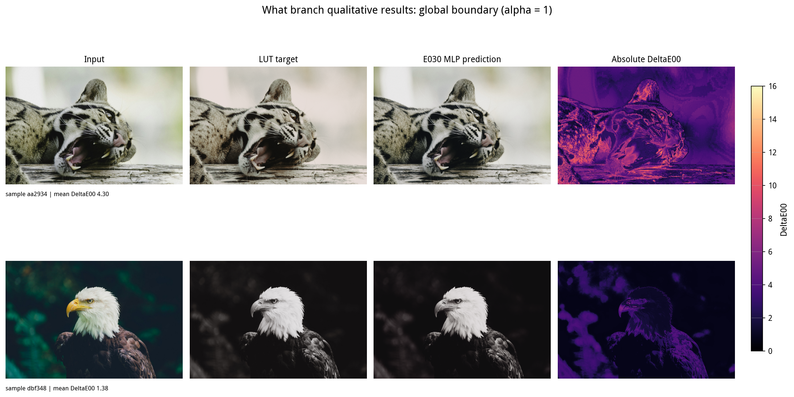

当前 `E030_P4_MLP` 的结果为：

| 方法 | DeltaE00 ↓ |
|---|---:|
| 不编辑 / Identity | 8.2926 |
| 训练库平均 LUT | 7.6323 |
| 按风格桶检索 | 6.1553 |
| **当前模型 E030** | **4.7338** |
| **独立 seed** | **4.6254** |
| LUT library oracle | 0.8253 |

相对风格桶检索，当前模型改善约：

\[
6.1553-4.7338=1.4215.
\]

Wilcoxon：

\[
p=3.5\times10^{-28}.
\]

PSNR 为 **28.0184**。

---

## 结果说明了什么

最重要的结论不是“4.73 已经足够好”，而是：

> **VLM 表征中确实存在可以用来决定颜色编辑的信息。**

如果模型完全没有利用文字或图像条件，它很容易退化成：

- 一个固定 LUT；
- 一个平均 LUT；
- 根据风格类别简单检索一个 LUT。

但当前结果明显超过这些简单基线。

同时，shuffle 等三类文字负控制都会引起输出变化，这进一步说明模型不是完全忽略语言条件。

---

## 还不能说明什么

目前这些结果都来自：

\[
\alpha=1
\]

的全局 style 样本。

所以它只能证明：

> **what 分支可以工作。**

还不能证明：

> **完整的局部指令修图已经工作。**

最终仍然必须把 `where` 和 `what` 合起来测试。

<div style="page-break-after: always;"></div>

# 第 6 页：What 目前还在解决什么问题

## 早期训练暴露出的主要问题

`what` 早期实验中出现过几个非常明确的问题。

### 1. 模型可能看似在训练，实际没有使用条件

早期 CARRIER：

**DeltaE00 = 7.895**

甚至没有超过训练库平均 LUT：

**7.6323**

IDGATE 更差：

**10.149**

这说明：

> **模型能够正常 forward，并不代表它真正学会了根据条件改变颜色函数。**

---

### 2. Loss 比例曾严重失衡

旧 hue/chroma 项没有正确归一化。

结果：

\[
10L_{hc}
\]

实际约为 reconstruction loss 的 **325 倍**。

因此后续删除了这一失衡项，当前使用更简单、稳定的函数值 L1 作为主要监督。

---

### 3. 条件网络发生过完全塌缩

旧条件 MLP 的 ReLU 死亡率：

- step 0：0.469
- step 1300：**1.000**

最终所有输入产生几乎完全相同的输出。

另外，硬 clamp 会让饱和值上的梯度直接变成 0，也会阻碍训练。

---

## 当前 E031 在跑什么

新的训练设置从旧的：

\[
32\times256=8192
\]

色/step，扩大到：

\[
256\times8192=2,097,152
\]

色/step。

因此 E031 的运行中曲线不能直接和 E030 的最终 board 横向比较。

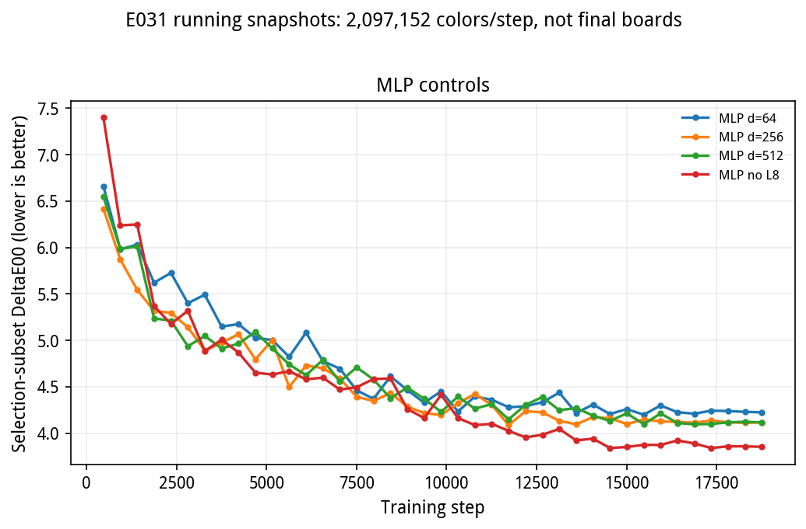

当前运行中的 MLP 路线包括：

- `E031_MLP_LR1E3`
- `E031_MLP_CD256_L3`
- `E031_MLP_CD512_L3`
- `E031_MLP_NOL8_L3`

当前 selection subset 快照约在 **4.1–4.3**。

这些只是训练稳定性观察，不是正式结果。

---

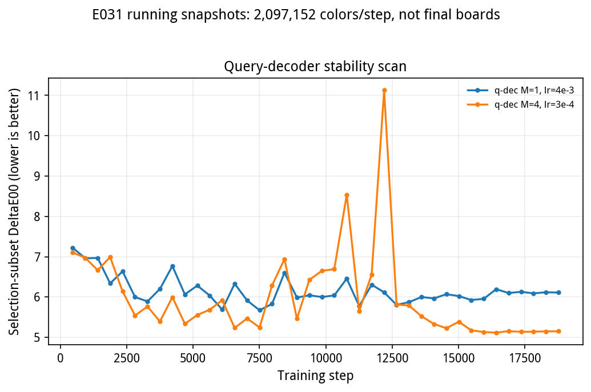

Query decoder 当前仍然存在明显稳定性问题。

一个非常关键的发现是：

> 当 memory row = 1 时，cross-attention 实际退化成只有一个 key，attention 不再真正根据 query 进行选择。

因此不能根据这个实验得出：

> “MLP 优于 Transformer。”

真正非退化的 attention 版本：

- memory=2 曾在约 step 5699 NaN；
- memory=4 降低学习率后仍在训练；
- 当前还没有一条完整、稳定的非退化 attention 结果。

---

## 当前 What 的结论

现在已经能够确定：

> **简单 MLP 可以稳定地从 VLM 表征预测有效 GLUT。**

但还不能确定：

> **MLP 是否是最好的结构。**

因为非退化 attention 路线还没有稳定完成。

下一阶段首先需要把 E031 和 GLUT oracle 实验完整收齐，再决定结构。

<div style="page-break-after: always;"></div>

# 第 7 页：最终应该怎么评测？

## 不能只看“图像好不好看”

这个任务最大的评测问题是：

> 一个模型即使完全不理解指令，也可能学会输出一个“平均来说更好看”的修图结果。

因此，只看整图：

- PSNR；
- SSIM；
- DeltaE；

并不能证明模型真的理解了指令。

最终评测必须回答三个问题。

---

## 1. Where：改对地方了吗？

给定：

> “压暗左侧天空。”

就应该检查预测编辑范围和真实范围是否一致。

这是空间定位能力。

---

## 2. What：改对了吗？其他地方有没有被误改？

除了目标区域本身，还要同时检查：

- 目标区域是否变成正确颜色；
- 非目标区域是否保持不变。

一个模型如果把整张图全部压暗，即使目标区域变对了，也不能算成功。

---

## 3. Instruction Following：换一句话，结果会不会真的变？

这是目前最重要的反事实测试。

例如同一张图：

### 原指令

> 降低天空的饱和度。

### 改范围

> 降低草地的饱和度。

### 改动作

> 提高天空的饱和度。

一个真正理解指令的模型必须产生明显不同的结果。

如果三句话得到几乎一样的编辑，就说明模型实际上没有理解语言。

---

## 公开数据怎么使用

FiveK 和 PPR10K 等公开数据通常只有：

```text
before image -> after image
```

没有：

- LUT 真值；
- 自然语言指令；
- 局部范围真值。

因此不能直接把它们称为 instruction-following benchmark。

我们的计划是先从 before/after 对中恢复一个颜色变换：

```text
before / after pair
        |
        +--> fit GLUT
        |
        +--> fit conventional 3D LUT
        |
        +--> construct instruction
        |
        +--> construct counterfactual instructions
```

对于每个图像对，拟合：

\[
\min_{\theta_i}
\|f_{\theta_i}(I_i^{in})-I_i^{out}\|_1.
\]

同时拟合标准 33³ 3D LUT 作为独立对照。

---

## 使用公开数据前必须通过三道检查

### 1. 颜色变换是否真的能被 LUT 表示

如果 before/after 主要来自局部 dodge/burn 等空间操作，一个全局 GLUT 无法正确拟合。

这种样本不能强行作为 `what` GT。

---

### 2. 数据是否和训练来源重合

PPR10K 与已有 MMArt/PPR 来源存在潜在重合风险。

完成污染检查前，不报告正式公开评测数字。

---

### 3. 有指令就必须有反事实

如果我们给公开图像自动生成自然语言指令，就必须同时构造：

- shuffle；
- irrelevant words；
- fixed phrase；
- antonym；
- subject-swap。

否则不能证明结果来自真正的语言理解。

<div style="page-break-after: always;"></div>

# 第 8 页：Where + What 最终要得到什么结果

## 最终完整任务

假设输入：

> “把右侧草地稍微压暗，并降低绿色饱和度。”

一个成功的模型必须同时满足：

### 1. 位置正确

只修改：

> **右侧草地**

而不是：

- 左侧草地；
- 整片草地；
- 天空；
- 整张图。

### 2. 编辑正确

目标区域需要：

- 变暗；
- 绿色饱和度降低。

不能只是随便改变颜色。

### 3. 其他地方保持不变

例如：

- 天空；
- 建筑；
- 人物；

应该尽可能保持原状。

---

## 后训练为什么要联合优化

当前：

- `what` 主要优化 LUT 函数值 L1；
- `where` 主要优化 \(32\times48\) 网格 BCE。

它们都还没有直接针对最终编辑图像优化。

因此下一阶段计划进行监督式联合微调：

\[
\mathcal L=
1.0\mathcal L_{fn}
+
0.5\|\hat I-I^*\|_1
+
0.1\,\mathrm{LPIPS}(\hat I,I^*).
\]

其中：

- \(\mathcal L_{fn}\)：保证颜色函数本身正确；
- 图像 L1：保证最终像素接近目标；
- LPIPS：补充感知质量。

这里的权重只是后训练起点，不是固定结论，后续需要做消融。

---

## 为什么不能只优化最终图像

如果只追求：

- PSNR 更高；
- LPIPS 更低；
- 图片更好看；

模型可能学会一个平均意义上的“自动修图”。

因此每个后训练 checkpoint 都必须重新检查：

- `where` 是否仍然受指令控制；
- `what` 是否仍然受文字控制；
- 更换范围后结果是否变化；
- 更换动作后结果是否变化；
- shuffle / antonym 等负控制是否仍然有效。

如果图像指标变好了，但语言控制变弱了，这应该被记录为：

> **条件性退化。**

而不是简单称为“模型提升”。

---

## 最终论文真正需要展示的结果

最终最好用非常直接的方式展示：

```text
输入图像
   +
不同指令
   ↓
不同 where
   +
不同 what
   ↓
不同的局部编辑结果
```

并且清楚回答：

> **它改对地方了吗？**

> **它改成想要的样子了吗？**

> **其他地方有没有被破坏？**

<div style="page-break-after: always;"></div>

# 第 9 页：接下来最重要的事情

## 1. 先解决 Where 的候选选择问题

目前最明确的信号是：

- 当前选择结果：0.7571
- best-of-K：0.8072

已经存在约 **0.050** 的可利用空间。

因此近期最高优先级不是继续尝试大量新 decoder，而是：

> **让模型把已经生成出来的正确候选选出来。**

同时完成：

`ST_LANG_CONT@3500 vs M0`

在这个实验完成之前，不能声称当前 query 路线已经随训练规模稳定提升。

---

## 2. 明确解决 band 失败

band 已经是非常清楚的失败家族。

当前需要回答：

> 为什么模型面对斜向、非主体中心的几何区域时，容易回到主体或 radial 区域？

这比继续报告平均 IoU 更有研究价值。

---

## 3. 收齐 What 主干实验

当前需要完成：

- E031 MLP；
- 条件维度消融；
- L8 数据消融；
- 非退化 attention；
- GLUT oracle；
- 独立 seed；
- 完整文字负控制。

在这些实验完成之前，只能说：

> **MLP 当前稳定有效。**

不能说：

> **MLP 优于 Transformer。**

---

## 4. 建立真正的公开评测

公开 benchmark 最重要的不是数据规模，而是能不能验证：

1. **哪里改；**
2. **怎么改；**
3. **换指令以后结果是否跟着改变。**

FiveK / PPR10K 的 before-after 数据只能作为构造起点，不能直接当成 instruction-following GT。

---

## 5. 最后才做 Where + What 联合后训练

当两个分支分别稳定后，再做完整局部精修。

最终目标应该非常简单：

> **模型根据一句自然语言，只在正确的位置执行正确的颜色编辑。**

---

# 当前投稿风险

目前有几个问题必须继续保留在内部清单中。

### Where

- 当前 headline top-k IoU 使用 GT 面积；
- 固定阈值 / non-oracle 指标还没有补齐；
- 当前 ST 0.7739 没有超过 M0 0.79095；
- band 是明确失败类型；
- selector 和 best-of-K 仍有约 0.050 gap。

### What

- E031 新色批还没有完整正式结果；
- E030 的 4.7338 不能直接和 E031 运行中曲线比较；
- 非退化 attention 尚无稳定完整 run；
- 当前不能得出 MLP / Transformer 的结构优劣结论。

### Public benchmark

- FiveK / PPR10K 没有 LUT GT；
- 没有自然语言指令；
- 没有局部范围 GT；
- PPR10K 仍有待处理的数据重合风险。

因此当前最合适的论文状态不是：

> “完整系统已经解决局部指令修图。”

而是：

> **Where 和 What 两个关键能力都已经出现明确的正向结果，现在正在解决各自最后的稳定性问题，并进入联合验证阶段。**

---

# 一句话版本

如果只用一句话概括目前这个工作：

> **我们希望让 VLM 不只是“看懂图片、说出修图计划”，而是真正把一句自然语言变成“在哪里改、怎么改”，最终完成可控的局部照片精修。**

当前结果表明：

> **Where 已经能找到大部分正确区域，但复杂几何和候选选择仍不稳定；What 已经能从 VLM 表征中预测有效的颜色函数，下一步的核心是让两者稳定组合起来。**

---

# 可视化补页

## W1：radial 正例

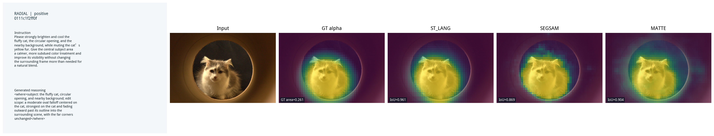

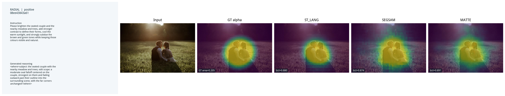

两例 ST_LANG / SEGSAM / MATTE IoU 分别为：

- `0.961 / 0.869 / 0.904`
- `0.880 / 0.874 / 0.891`

说明当前 `where` 并不是普遍失效。在一些规则区域上，模型已经可以得到非常准确的空间结果。

---

## W2：band 的成功和失败

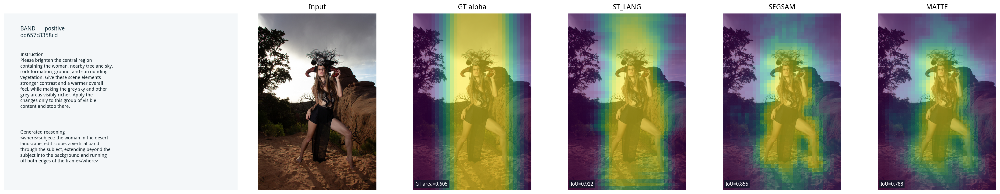

该正例为：

`0.922 / 0.855 / 0.788`

而正文 band 反例为：

`0.268 / 0.295 / 0.367`

两者放在一起更能说明问题：

> **band 不是完全不会，而是不稳定。**

这也是后续值得重点分析的问题。

---

## W3：linear

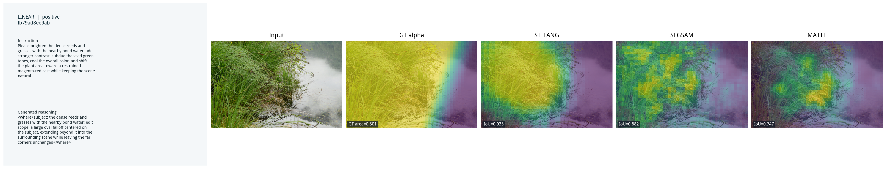

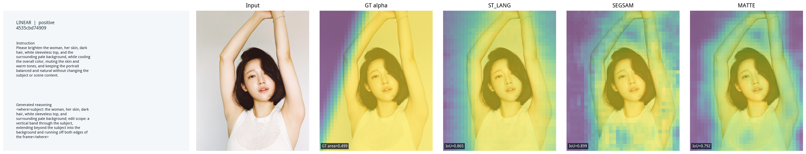

分别为：

- `0.935 / 0.882 / 0.747`
- `0.865 / 0.899 / 0.792`

说明较宽、规则的线性范围已经可以较好恢复。

---

## W4：semantic

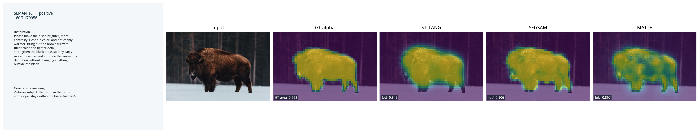

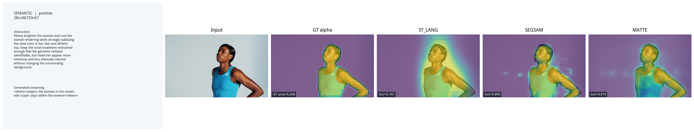

分别为：

- `0.849 / 0.906 / 0.897`
- `0.741 / 0.895 / 0.810`

SEGSAM / MATTE 在部分语义边界上更强，而 ST_LANG 在一些几何范围上更强。

这说明不同读出方式存在一定互补性，但当前还没有一个方法在所有类型上都稳定最优。

---

# What 可视化

## C1：暗调与冷灰

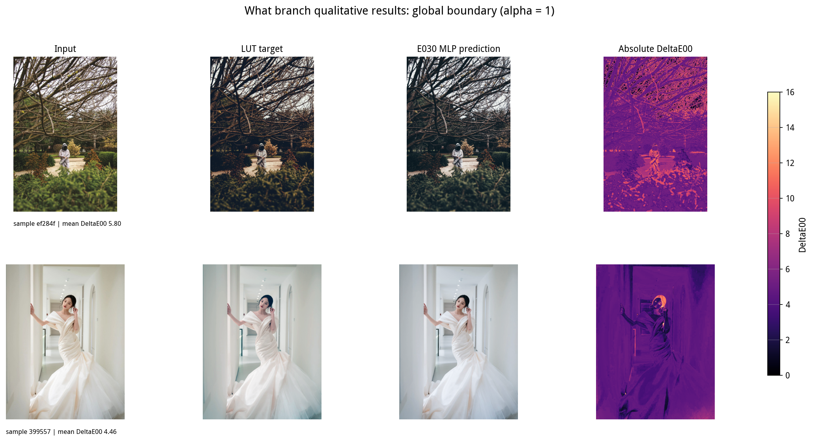

## C2：冷绿与青橙

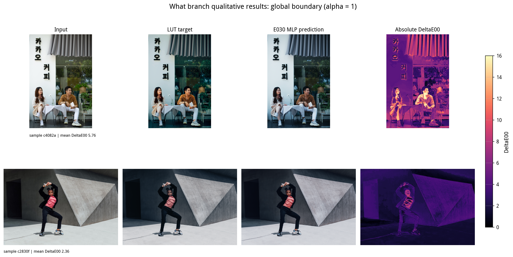

## C3：复古压彩与近单色


## C4：银黑白与高键冷调

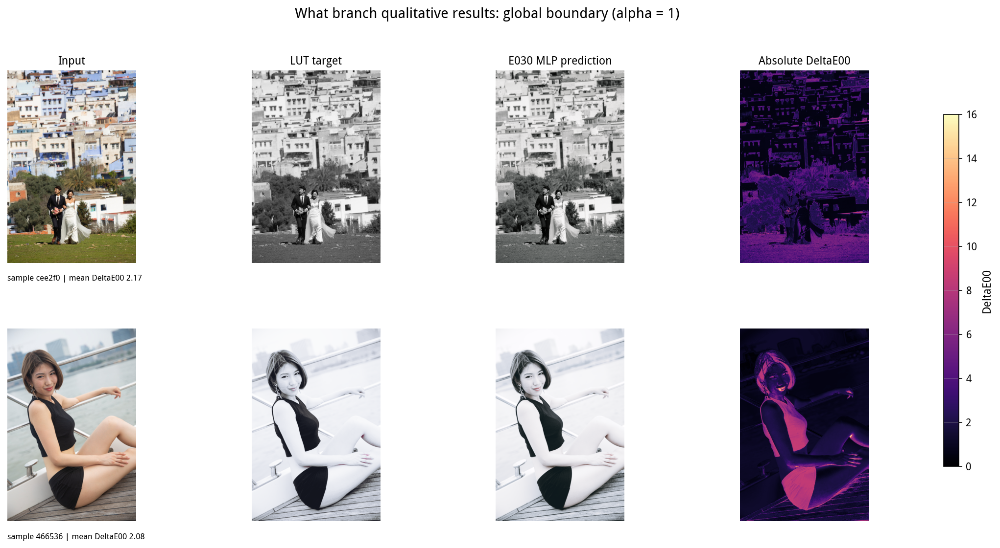

这些样例全部是：

\[
\alpha=1
\]

的全局 style 样本。

它们只用于回答：

> **what 能不能预测正确颜色变化？**

不能用来证明局部编辑已经成功。

---

# E031 训练状态

## MLP


## Query decoder


这些曲线只是运行中的 selection-subset 快照，用于判断：

- 训练是否稳定；
- 哪些结构值得继续跑；
- 哪些 run 已经发生退化。

它们不作为论文正式结果。

---

# 复现与结果纪律

- `where` 当前 PPT 图由 `visualize_where_selected_rows.py` 重新推理生成；
- 样本选择、instruction、`<where>`、权重和逐例结果保存在对应 `manifest.json`；
- `what` 全局样例由 `visualize_what_global.py` 生成；
- E031 曲线由 `visualize_what_progress.py` 从运行日志生成；
- 正式数字仍以完整 validation board 为准；
- 运行中曲线不替代正式结果；
- 任何出现 `L_rec=null` 或 NaN 的 run 不允许发布为有效结果。