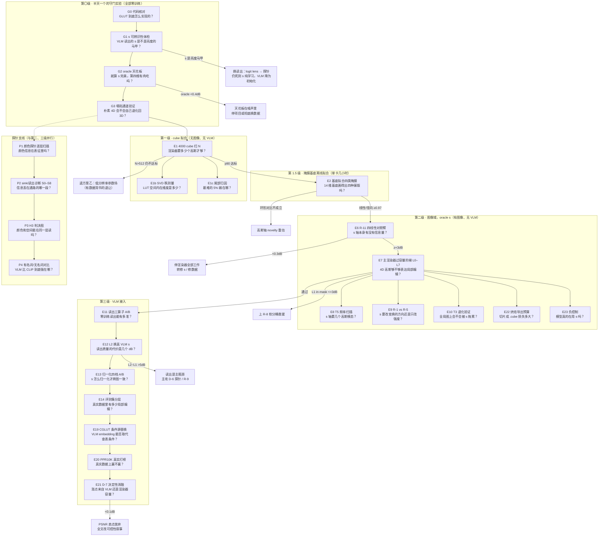

# 实验决策树（2026-07-31）

> 配套文档：`PLAN_v2_local-retouch_2026-07-31.md`（方案细节）、`SURVEY_papers_2026-07-31.md`（579 篇论文汇编）。
> 每个节点 = 一个实验 = 一个要回答的问题。**箭头上的字 = 实验结果**。原则：便宜的实验先跑，每个实验的失败都有明确去向，绝不出现"训了两周才发现方向错了"。

---

## 一、总图

---

## 二、节点卡片（每张卡：问题 / 数据 / 改动 / 做法 / 判据与去向）

### 第〇级：守门实验（每个半天，零训练）

---

**G0 · 代码核对**
- **要回答的问题**：GLUT 的实现细节到底是什么样的？（三处论文与项目页互相矛盾，必须以代码为准）
- **数据**：不需要数据，只读 GLUT 官方代码。
- **改动**：无，纯核对。
- **通俗解释**：后面一半的防塌陷设计取决于"权重有没有除以总和（归一化分母）"这一行代码。有分母，就存在一条"模型偷懒退化回 3D"的暗道，必须全套封堵；没有分母，暗道不存在，可以省一周工作量。同时核对初始化：如果高斯的仿射是恒等、全局兜底也是恒等，输出就是输入的 2 倍——这是个会直接训炸的低级坑。
- **产出**：三个是/否结论，写进设计文档。无所谓通过失败。

---

**G1 · s 可辨识性体检**
- **要回答的问题**：从 VLM 里读出来的那张"该改哪儿"的图（s 场），是真的随指令变化的语义信号，还是只是把图片亮度换了个皮？
- **数据**：200–500 张普通照片，每张配 3 条指令（2 条意思相同的改写 + 1 条意思相反的）。
- **改动**：无，冻结 VLM 跑推理，导出 token 注意力做成逐像素 s 图。
- **通俗解释**：如果"提亮天空"和"把天空调亮些"给出的两张 s 图都对不上（相关性低），说明这个信号连自己都不稳定，后面全白搭。更阴险的陷阱是：s 图可能只是亮度图的翻版——而 3D LUT 本来就"看得见"亮度，那样第四维就没带来任何新信息。
- **判据**：同义相关 ρ_syn>0.7 且反义相关 ρ_opp<0.3 且与亮度相关 |ρ_Y|<0.5 → 过。**|ρ_Y|>0.8 = s 是亮度马甲** → 换读出方式（先 logit lens，再探针头）；还不行 → s 改成纯学习产物，VLM 降级为初始化来源。

---

**G2 · oracle 天花板**
- **要回答的问题**：假设 s 完美无缺（直接用真掩膜），第四维最多能赚几个 dB？
- **数据**：构造的局部编辑样本（真掩膜已知）+ FiveK/PPR10K 真实对。
- **改动**：无训练。两种算法：① 解析法——按 (颜色, s) 分箱算条件方差，直接得出任何逐点算子的误差下界；② 实验法——把现有 3D GLUT 复制 3 份按真掩膜查表。对照组：单张 3D、用亮度冒充 s 的伪 4D。
- **通俗解释**：先量天花板再装修。如果连"上帝视角的 s"都只能多赚 0.4 dB，那无论读出做得多好都是白忙——整个第四维的价值上限已经量出来了。
- **判据**：构造集 Δ_ceil ≥ 8 dB 且真实 oracle ≥ 1.0 dB → 过。**< 0.4 dB → 停项目或彻底重造数据**（转 D 层合成语料）。

---

**G3 · 塌陷通道验证**
- **要回答的问题**：不加任何保护，朴素的 4D 高斯会不会自己退化回 3D（模型学会无视 s）？
- **数据**：几百对构造样本。
- **改动**：极小的 GLUT-4D 玩具版（32 个高斯），纯重建损失训 1 小时。
- **通俗解释**：理论分析说存在一条"零代价逃逸通道"：每个高斯把 s 方向的宽度撑到无穷大，归一化一除，s 就被精确抵消——loss 一点不涨，梯度下降默认会走这条路。花 1 小时看看它是不是真的走：盯两个数，s 方向宽度是否单调膨胀、改动 s 输出是否越来越无动于衷。
- **判据**：σ_s 不发散且 s-sensitivity 不趋零 → 松口气。**证实塌陷 → R-2（锚定）+R-3（多样性）从第一天就必须上**，朴素版全部作废。

---

### 第一级：cube 拟合（无图像、无 VLM）

---

**E1 · 4000 个 cube 扫 N**
- **要回答的问题**：要把 4000 个真实专业 LUT 拟合到人眼不可察（ΔE<2），需要多少个高斯？
- **数据**：手上的 4000 个 .cube 文件（统一重采样 33³，剔除近恒等的）。先用 400 个分层子集（胶片/电影/人像/分离色调/漂白）扫全部 N，再全量验证。
- **改动**：只用渲染器本体（无网络）：对每个 LUT 直接用 Adam 优化那 ~800 个高斯参数。**必须带密度控制**——每 500 步把"死掉"的高斯搬到误差最大的色域区。
- **通俗解释**：这是整个项目性价比最高的实验，也是文献空白（没人报过跨 LUT 的误差分位数，都只报均值）。关键是看**最差的 5%**而不是平均：平均好看不代表电影级 LUT 能被表达。不做密度控制的话，32 个高斯常常只有 15–20 个在干活，你会把"优化器偷懒"误诊成"容量不够"然后盲目加大 N。
- **判据**：N\*=最小的满足 p90<1.0 且 p99<2.0 的 N（预期 32–64）。**N>512 仍不达标 → 退"低分辨率参数场"方案（方案乙），且退得有数据背书**。副产品：金标准参数、锚点、参数分布——后面每一级都要用。

**E1b · SVD 秩测量**（1 天，并行）：4000 个 LUT 展平成大矩阵做截断 SVD，画"秩→重建误差"曲线。回答"条件向量要多宽"（预测 32–64 维）。

**E1c · 尾部归因**：把最差 5% 的 LUT 分类。如果输在硬裁剪/色调分离这类**锐转折**，加高斯没用（平滑函数拟合不了断崖）——A/B 测 `N=32` vs `N=32+一条 51 参数的单调曲线` vs `N=64`，预期曲线赢（前人证据：47K 带曲线的模型打赢 593K 纯 LUT）。

---

### 第 1.5 级：掩膜基底离线拟合

---

**E2 · 14 维基底拟合四类掩膜**
- **要回答的问题**：我们设计的"10 来个数字的配方"（位置基+亮度基+语义基的加权），到底画不画得出修图师常用的四种蒙版（线性渐变/径向/束状/语义）？
- **数据**：每类 200 张 512² 的 GT 掩膜：线性渐变、径向椭圆、束状楔形、**环形（专项）**、语义五类（SAM 在 FiveK 上切 sky/skin/foliage/water/architecture）、全局常数。
- **改动**：不训主网络。固定基底 φ（Legendre 正交化 + 语义通道对位置基残差正交化），对每张掩膜用 L-BFGS 直接优化那十几个权重，损失 soft-IoU。**单调读出和带通读出各跑一遍**。
- **通俗解释**：在花钱训练之前，先用最笨的优化器验证"这个表示画得出来吗"。最重要的一对数字是**环形掩膜**：单调读出应该画不出（≤0.40），带通读出应该画得出（≥0.90）——这对数字就是"s 当查表坐标轴而不是混合权重"这个核心主张的量化证据，直接放进论文当图。束状掩膜拿 0.55–0.70 是**预期结果不是 bug**（数学上二次型只能给对顶的双楔形），量化后写进 limitation。
- **判据**：线性/径向 ≥0.97（达不到=实现有 bug，查正交化）；语义 ≥0.85（不够 → k 从 6 加到 8）。**环形对比不成立 → "s 是坐标轴"的 novelty 主张要重估**。附赠三条零成本消融：基底砍到 [1,x,y]（=复现 Exposure 前作）、二次 vs 三次、几何/亮度/语义基各自的边际贡献。

---

### 第二级：图像域，oracle s（有图像、无 VLM）

---

**E6 · R-11 四线性 4D LUT 对照臂**
- **要回答的问题**：先不谈高斯——把 s 简单粗暴地当第 4 根格子轴（17³×5 的四维查表），局部样本上能赚多少？
- **数据**：构造集 L0–L4。
- **改动**：独立小实验，不动主渲染器：一张 4D 表 + 四线性插值 + 沿 s 的平滑正则。
- **通俗解释**：这是归因实验：把"s 轴有没有信息"和"高斯参数化好不好"拆开。这个对照臂天生没有归一化，免疫塌陷，所以它的数字是 s 轴信息量的干净读数。
- **判据**：in-mask ≥+3dB → s 有肉，继续。**<0.3dB → 立即停止渲染器侧全部工作**——问题不在渲染器，在 s 或数据。

---

**E7 · 主渲染器过容量阶梯 L0–L7**
- **要回答的问题**：第一版渲染器组合（R-1 零初始化门控 + R-2 锚定 + R-3 多样性 + R-7 自动配权 + R-10 掩膜监督）能不能把八级阶梯爬完？
- **数据**：构造集八级：L0 全局 / L1 二值语义 / L2（留给 VLM）/ L3 软掩膜 / L4 几何渐变 / L5 错配负控制 / L6 重叠双掩膜 / L7 同色横切——**s 直接用真掩膜喂**，把"渲染器行不行"和"读出准不准"彻底分开。
- **改动**：CGLUT 的载荷调制处加 R-1（输出层全零初始化，第 0 步逐位等于原版 GLUT）；高斯 s 坐标锚死在 6 个格点、宽度用 sigmoid 限幅（R-2）；加参数空间多样性 hinge（R-3）。
- **通俗解释**：像考驾照一样一级级考。注意两个反直觉：① **几何渐变（L4）比语义掩膜（L1）更难**——语义掩膜在 s 轴上只是"两坨"，几何渐变是连续斜坡，需要 3–5 个模态才接得平；② **L5–L7 必须失败**——尤其 L7（掩膜边界横切同色区域），能通过说明模型偷到了像素坐标，是 bug 不是能力。全程盯两个免费探针：把 s 跨图打乱后掉不掉分（Δ_shuffle，掉不到 0.3dB=模型根本没用 s，一票否决）、σ_s 是否贴上界。
- **判据**：L0 与 3D 差<0.05dB；L1/L3/L4 距天花板<2dB 且 L1 in-mask 比同规模 3D 高 ≥8dB；L5–L7 按预期失败。**L1 弱 → 上 R-8 软分桶救援；L4 弱 → 加解析几何头**。

**E8 · T5 频率扫描**：掩膜换成 sin(ω·ξ) 扫频率，找拟合 PSNR 的截止频率——**把"s 轴放几个高斯"从调参变成测量**。
**E9 · R-1 vs R-5 同预算对照**（核心科学问题）：R-5 限制 s 只调强度不调方向。差<0.5dB → 选更省更稳的 R-5，且得到结论"真实修图的局部性主要是强度局部性"；R-1 高>2dB → 方向必须随 s 变。两个结果都有发表价值。
**E10 · T3 退化验证**：100% 全局数据训练，与无 s 基线差 ±0.05dB 且 Δ_shuffle≈0 → "能优雅退化为全图"这条硬要求正式验收。
**E22 · 烘焙导出预算**：切 2/3/5/9 片 → 重采样 33³ → 导出 .cube → **用四面体插值回读**（宿主软件的算法，不是我们训练时的算法）→ 损失拆四项上报。ΔE<2 过；ΔE>4 或要 17 片才够 → "可导出"改口为运行时插件交付。
**E23 · 负控制**：随机 s / 打乱 s / 亮度 s / 加噪 s。随机 s 掉点<0.1dB = s 轴是装饰品，回 G3 的塌陷问题。

---

### 第三级：VLM 接入

---

**E11 · 读出三算子 A/B**
- **要回答的问题**：不训练任何东西，从视觉塔里能读出多准的 s？三种自注意力改造（SCLIP/NACLIP/ClearCLIP）哪家强？
- **数据**：构造集 L1 的图 + GT 掩膜（算 AUC 用）。
- **改动**：无训练。视觉塔最后一个 attention 换成 self-self 形式；前置伪影三件套（test-time register 兜高范数 token、异常 token 插值、周期伪影检查）；读出后用引导滤波上采样到全分辨率。
- **通俗解释**：三个坑必须避开：① 原始注意力可能给出"反的"图（前景冷背景热），先做符号检查；② **绝对不做逐图 min-max 归一化**——每张图各自拉伸就毁掉了跨图可比性，这正是我们要解决的问题本身；③ 32×32 的粗网格直接放大到 4K 会在物体边界出锯齿，引导滤波（零参数）先兜住。
- **判据**：s-vs-GT AUC ≥0.80 → 接入；<0.75 → 上 D-4（借 DINO 的注意力）；再不行 → D-6 轻量探针头。

---

**E12 · L2 档：换真 VLM s**
- **要回答的问题**：把 oracle 掩膜换成真实读出的 s，掉几个 dB？（这个差值就是"读出质量的代价"，也是论文必报的诚实数字）
- **数据**：与 L1 完全相同的样本，只换 s 来源。
- **判据**：L2−L1 ≤3dB → 可接受；**>5dB → 读出是主瓶颈**，第二周主攻探针头（D-6）和跨图重标定（R-9），渲染器侧先冻结。

**E13 · 归一化四档 A/B**：逐图 min-max / 逐图分位 / **全局 CDF（训练集估一次冻结）** / 全局共享可训单调映射。看"同指令不同图的掩膜内 s 中位数方差"降不降 30%。四档无差别 → s 根本没承载可跨图对齐的信息，回 G1 的结论。
**E14 · 评测集分层**：用"最优全局 3D 查表的条件均值"算每张图的 3D 天花板，再配 oracle s 算 4D 天花板，**取差分**（不是残差！残差高可能只是噪声/锐化/JPEG，要加空间聚集性 Moran's I 和模糊重算两个过滤器）。FiveK 差分中位数预测 <0.3dB——若如此，这个数字本身就是"现有 benchmark 测不出局部能力"的定量证据，主战场移到构造集+PPR10K。
**E19 · CGLUT 条件源替换**：把可学风格查表 E 换成 `Proj(VLM embedding)`（一个 Linear，下游一字不改）；RGB 几何跨指令共享、载荷全生成（GLUT 论文只试过两个极端，这个中间档是干净增量）。验收：原全局任务掉幅 ≤2dB，且**未见过的指令**上显著优于"最近邻已见指令"（否则 VLM embedding 只是在做检索）。
**E20 · PPR10K 真实打榜**：报人像区加权 PSNR（HRP）+ 组一致性（GLC，顺便当跨图刻度的免费报警器），配对 ΔPSNR + bootstrap CI。≥+0.3dB 且 CI 不跨 0 → 赢；<0.2dB → 回构造集主战场并在论文里诚实说明。
**E21 · D-7 决定性消融**（最后的审判）：学习式 context encoder 用随机初始化 vs 用 VLM 读出蒸馏初始化，其他全同。**差 <0.1dB = VLM 读出对 PSNR 无贡献**，论文卖点从 PSNR 全面改成可控性/可解释性/零样本指令泛化（可控性指标：指令跟随分、pointing game、同义指令一致性）。

---

### 探针支线（与第二、三级并行，不占主线 GPU）

---

**P1 · 颜色探针逐层扫描**
- **要回答的问题**：VLM 的内部表征里到底有没有"这张图色温偏了多少、曝光差多少"这类连续的颜色物理量？（模型嘴上说不准 ≠ 脑子里没有）
- **数据**：FiveK RAW 施加**已知扰动的配对样本**（探两版之差，把"夕阳本来就偏暖"这类先验差分掉）；A5/A6 两个命门属性要用带真值光源的 Cube+/NUS-8。
- **改动**：无训练主模型。在每一层（视觉塔每块/connector/LLM 每层/control latent/sink token 各一路）挂 Ridge 线性探针，回归 ΔCCT（mired）/ΔWB/ΔEV/Δ对比度 + **肤色记忆色偏差 / 灰世界陷阱光源**。
- **通俗解释**：前四个量（色温/白平衡/曝光/对比度）其实像素直方图就能算——探针在这些量上赢了不算本事，必须配"像素统计基线 C5"。**真正的命门是后两个**：大面积单色场景里猜光源（灰世界假设崩溃）、肤色相对记忆色的偏移——这些必须"认得出内容"才算得对，是证明 VLM 特征有增量的唯一战场。行为侧要给足五档问法（含 CoT 和 logit 期望读出），免得被说 prompt 没调好。
- **判据**（预注册，先写死再看测试集）：探针 selectivity≥0.25 且 R²≥0.60；行为误差 ≥2× 探针误差；A5/A6 对像素基线提升 ≥20%。**探针≈行为 → 颜色腿删掉，只留空间腿，方法不受影响**；LoRA 2k 图就能抹平 → 措辞只能写"通路训练不足"，禁写"表征坍缩"。

**P2 · sink/读出诊断 S0–S8**（顺序不可换）：S0 读出上限闸门 → S1 token 范数（决定性判据：极值跨图恒定=固定偏置非信息）→ S2 注意力质量 → S3 跨图平均图分诊（规则网格→位置伪影；高范数落背景→register 病）→ **S4 因果验证禁止只用置零**（必须配跨图替换/均值/噪声三组对照——置零会把"占位符"误判成"信息载体"，前人实测置零 −36.6pp 而替换只 ±1pp）→ **S4.5 sink token 单独探颜色**（如果全局色彩信息恰好存在 sink 里，直接把 sink token 接到渲染器条件端——从"有道理"到"可发表"的最短路径）→ S5 逐层曲线（中层达峰后下跌=读出通路丢信息的直接证据）→ **S6 control latent 容量检查（最可能的真凶）**：latent 数量 1/4/16/64 扫一遍画"预算 vs 可达 ΔE"——4 个就饱和说明瓶颈不在带宽在优化 → S7 模态竞争 → S8 位置衰减。
**P3 · H3 判决图**：颜色探针曲线和空间探针曲线画同一张图，两个峰落在同一层（相差 ≤1/4 深度）→ "统一读出层"成立，一张图讲完"现有读出口取错了地方"；不重合 → 双层读出，故事弱一档但方法不变。
**P4 · 有名词/无名词对比**：指令一半带名词（"提亮天空"）一半不带（"更通透""胶片感"）。三种 s（GL token / CLIP patch-text / GEM）各跑。**无名词那半 CLIP 按机制必然崩**（没有名词可算相似度）——GL token 若仍给出有结构的场，"VLM 不可替代"就是被证明的而不是被声称的；不崩 → 退回"VLM 负责决定基底权重 w"这条论证。

---

## 三、使用说明

1. **顺序**：G0→G1→G2→G3 四个守门半天一个，两天出结论；E1 与 E2 可并行；探针支线 P1–P4 全程不占主线 GPU，随时插空跑。
2. **三个止损点**（触发即转向，不恋战）：E6 <0.3dB（停渲染器）、G2 <0.4dB（停项目/换数据）、E21 <0.1dB（弃 PSNR 叙事改可控性）。
3. **每个实验的失败都有信息量**：第一级失败=表示不行（没浪费 GPU）；第二级失败=4D 化不行（与 VLM 无关，渲染器结论可单独发）；第三级失败=读出不行（渲染器+度量仍然成立）。
4. 全部判据数字的出处与文献依据见 `PLAN_v2_local-retouch_2026-07-31.md` §2–§6。
