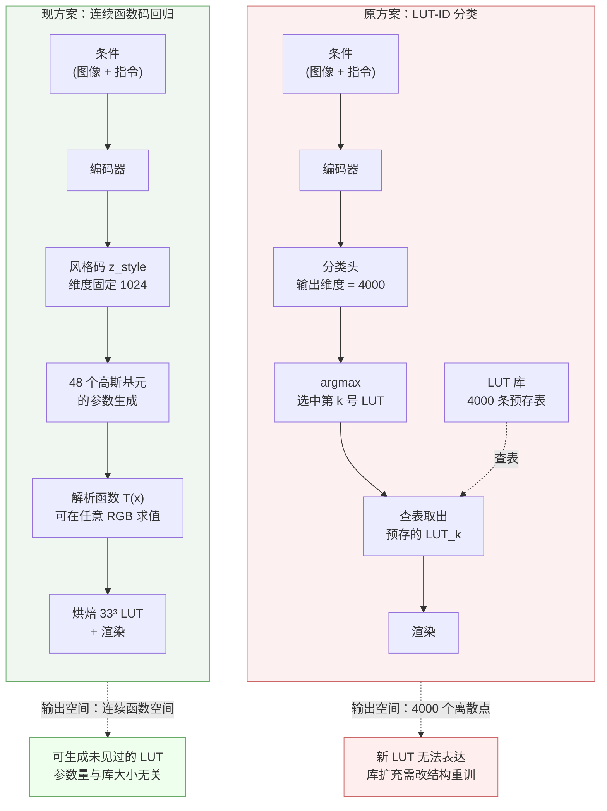

# 两周进展汇报（2026-07-22 → 2026-08-05）

---

## 1. 研究出发点

局部修图的第一步是确定「改哪块区域」。当前的做法是额外运行一个分割模型（SAM3 或 GroundingDINO + SAM），这意味着每张图都要付出一次额外的大模型前向。而我们的推理管线本身已经包含一次 VLM 前向，该前向天然产生 token 到 image patch 的注意力分布。**如果这一注意力分布可以直接用作定位信号，区域定位就是零边际成本的。** 本报告围绕这一假设展开，并在评估任何候选读出方式时统一施加三条部署约束：复用同一次 VLM 前向、不引入第二个模型、单次前向即可获得（不允许等待完整生成，不允许二次前向）。

两周的工作分为三条线：验证注意力能否提供定位信息、验证它能否按指令定位、以及厘清渲染器一端的容量边界。


## 3. 数据构建

**面向局部修图的成对数据构建。** 训练读出模块与渲染器都需要「原图—目标图—区域掩膜—指令」四元组，而公开数据集不提供带区域标注的专业修图对。为此我们构建了一套以 LUT preset 为渲染引擎的数据生产管线：对每张源图采样 8 个互异的 preset 分别渲染，用 OneAlign 对 8 个候选做美学排序选出赢家，再由 gpt-5.6-luna 依据「原图—赢家图」对写出结构化推理文本。两周内完成 global 线 4 个 build（各 25,000 组，整图调色）与 local 线 6 个 build（各 17,000 组，局部区域调色），落地 SFT 行 173k（train 169,260 / eval 3,320），覆盖源图 33,662 张与 preset 3,522 个，且跨 build 实测不存在「同图同 LUT」的重复样本。

数据的质量边界需要明确说明：赢家是 8 个候选中的**相对**最优而非绝对最优；当前两名的美学分差小于阈值时该组直接弃权，弃权率 15%；另有 33% 的行被标为低置信。因此本数据集的美学天花板受 preset 库本身的覆盖范围限制。

> **图 1**（需自绘）数据生产流程与一组真实样本。左：源图 → 8 候选渲染 → IAA 排序 → 标注 → 落盘的完整链路。右：一组真实样本的原图、8 个候选缩略图、赢家图与区域掩膜。

---

## 4. 定位信息的廉价读出

### 4.1 现有读出方式的推理成本

**廉价读出方式的需求。** 从 VLM 注意力中提取定位信息，此前采用的是共模消除读法：将当前 token 的注意力图减去整段输出序列所有 token 的平均注意力图，以剥离与语义无关的共模成分。该读法在定位质量上有效，但它有一个在部署上致命的性质——**共模项的定义要求先获得完整的输出序列**。这意味着推理时必须等待模型生成结束才能得到掩膜，而修图管线需要的是在读到指令后立刻拿到区域。同类问题也出现在其他候选读法上：区域对立差分需要额外构造一条语义相反的指令并再跑一次前向，而推理时用户只提供一条指令；外挂 CLIP 稠密读出则直接违背了「不引入第二个模型」的初衷。

因此本节的问题被明确为：**在只允许一次前向、不允许等待生成、不允许外挂模型的前提下，能否找到一种可用的定位读出。** 最朴素的候选是直接使用 raw attention，即 token 对 image patch 的原始注意力，不做任何后处理。

### 4.2 原始注意力的可视化失效与其成因

**raw attention 的失效排查。** 直接可视化 raw attention 的结果初看是完全失败的：如图 2(b) 第 2 列所示，整幅热力图呈均匀的低值状态，唯一可辨认的是画幅一角的孤立高值区，主体位置没有任何可见响应。这一现象此前被解读为「原始注意力被 attention sink 主导、必须做共模消除才能解锁定位信息」，也正是共模消除读法被采用的原因。

但该解读与另一项观察矛盾：同一批 raw attention 场按秩次计算的定位 AUC 达到 0.74–0.78，显著高于置换零模型的 0.499。也就是说，**评分认为场里有信号，而图上看不到**。这一矛盾促使我们排查评分与可视化两条路径的差异，结果定位到图像预处理环节。

模型的预处理使用 `expand2square`，将非方形输入补边为正方形后再切分为 16×16 网格。如图 2(a) 的统计，非方形源图上平均约有 5.3 个网格落在纯黑的补边区域内，而这些补边格吃掉了 image 侧注意力质量的 **53%–74%**（光照 token 68.8%、色温 token 53.4%、颜色混合 token 74.4%），**93.0%** 的源其全局最大值落在补边格中。与此同时，有效区内部的最大格仅占 2.7%（光照）至 4.1%（色温）的质量——**有效区域内部并不存在主导性的 sink**。

两条路径的差异由此得到解释：定位评分只在有效格上计算，补边格从未进入评分；而可视化的 min-max 归一化以全图最大值为分母，该分母恰好来自补边格。补边格的量级压制了其余所有格，使有效区内的真实结构在色标上被压平至不可见。**可视化与评分观察的是画面中两块互不相交的区域。**

图 2(b) 的单变量消融验证了这一解释：第 2 列为原始着色，第 3 列仅修正网格对齐（补边区被裁出视野但仍参与色标统计），二者均为一片均匀低值；第 4 列仅将色标的统计范围改为有效格，**主体轮廓立即显现**，且与最右列的真值掩膜在空间上对应。场本身在三列之间没有任何改动。

> **图 2(a)** 补边格的注意力质量占比统计。横轴为补边格所占 image 侧注意力质量的比例，纵轴为源图计数。数据为 194 个验证源。模型预处理为 `expand2square` 补边后切 16×16 网格，非方形源图平均约 5.3 格落在补边区。


> **图 2(b)** 单变量消融：色标来源对可视化的影响。9 个 effect-blind 选出的验证源逐行展示，列依次为原图、原始着色、仅修正网格对齐、**仅将色标改为取自有效格**、秩次着色、共模消除档、真值掩膜。模型为 0.5B VLM（语言塔 493,953,280 参数 / 视觉塔 125,109,260 参数，24 层 / 14 注意力头 / 256 个 image token，网格 16×16），bf16，eager 导出注意力，**零训练、零后处理**。读取 token 为 `<retouch_color&temp>`（另有光照 token 版本）。真值为 SAM3 主体软掩膜。n=194，前向 856 次。


### 4.3 原始注意力本身即具备定位能力

**排除补边格后的定量评估。** 上一节表明失效来自可视化环节而非注意力本身。在排除补边格后重新评估，raw attention 的定位能力可以直接确认：主体定位 AUC 为 **0.784**（光照 token）与 **0.736**（色温 token），同支撑置换零模型为 0.499；三个 retouch token（光照 / 色温 / 颜色混合）之间彼此可区分，可分性 0.824，说明它们并非读出同一张图。

这一结果的意义在于，**共模消除并非获取定位信息的必要条件**。此前认为「必须消除共模」的判断，来源于被补边格污染的可视化，而非注意力分布本身的性质。进一步的对照支持了这一点：共模消除档的定位 AUC 为 0.695，**低于**未经处理的 raw attention。共模消除在剥离补边共模的同时，也扰动了有效格内部的相对排序。

由此，第 4.1 节提出的问题得到肯定回答：**在单次前向、无外挂模型、无需等待生成的约束下，raw attention 本身就是一个可用的定位读出。** 相应的工程要求是：读出阶段必须显式排除补边格，可视化的色标必须取自有效格。

### 4.4 各读出方式在部署约束下的横向比较

**读出方式的部署可行性对照。** 为使方案选择有据，我们在同一批源、同一份掩膜、同一套评分实现上对四种读出做配对比较，并逐一核对部署约束。

结果见表 1 与图 3。定位分数最高的两条——同头区域对立差分（0.927）与外挂 CLIP（0.961）——**均不可部署**，原因如 3.1 节所述。共模消除既不满足单次前向约束，分数也低于 raw attention。**唯一同时满足三条约束的是 raw attention。**

作为严格的内部基线，我们同时构造了一个完全不使用图像信息、仅按到画幅中心距离生成的零参数几何场。未经处理的 raw attention 在覆盖类指标上尚未跑赢该基线，仅在**边界结构**上明显占优（grid 级边界 F1 0.667 对 0.548）。

**但只要在 raw attention 之上叠加一层轻量的聚合修正，这个差距就被跨过了。** §5.2 中那组修正（保留注意力头维度、更换聚合算子，权重由 5 折 source-level 交叉验证在 fit 折估计）产出的场，在两条正式判据上都显著跑赢几何基线：soft-IoU 0.377 对 0.301（Δ +0.074），grid 级边界 F1 0.846 对 0.606（Δ +0.240），p 均 ≤ 1.2e-12。**该修正仍然只需一次前向，不外挂模型，不等待生成——三条部署约束全部满足。**

这界定了下一阶段的工作方向：**以 raw attention 为基础，叠加一个轻量的可训练修正头**。区域对立差分场的表现作为该修正头的上界参考，而非方案本身。需要强调的是，跨过几何基线的只是「找主体」这一项；同一份修正后的场在指令条件判据上仍然失败（0.5042），这正是第 5 节要处理的问题。

**表 1** 四种读出方式的定位精度与部署可行性

| 读出方式 | 主体定位 | 复用同一前向 | 不外挂模型 | 单次前向可得 |
|---|---|---|---|---|
| **raw attention（排除补边格）** | **0.784** | ✓ | ✓ | ✓ |
| 共模消除 | 0.695 | ✓ | ✓ | ✗ 需等生成完 |
| 同头区域对立差分 | **0.927** | ✓ | ✓ | ✗ 需二次前向 |
| 外挂 CLIP 稠密读出 | **0.961** | ✗ | ✗ | ✓ |

> **图 3** 各读出方式与几何基线的配对比较（森林图）。横轴为相对基线的配对差值，误差棒为 95% 置信区间，右侧标注 Wilcoxon 检验 p 值与胜出源比例。所有读出均在同一批 194 源上从落盘场重算，使用同一份 SAM3 掩膜与同一套 AUC 实现，不引用各原实验报告中的转述数字。基线为零参数几何中心场 `-√((y-7.5)² + (x-7.5)²)`，无自由参数。


---

## 5. 指令条件下的定位

### 5.1 零训练读出是否跟随指令

**同图对立指令下的注意力分析。** 修图任务需要的不是「画面中最显著的物体」，而是「用户指定的那块区域」——说「提亮天空」时应聚焦天空，说「提亮地面」时应聚焦地面。第 4 节确认了注意力能找到主体，但这不蕴含它能按指令切换区域。为了直接判别这一点，我们设计了同图对立指令实验：对同一张图分别给出两条指向相反区域的指令，若注意力真的受指令调制，则两次读出的空间场应当互不相关。预注册判据为两场的相关系数低于 0.3。

实验结果是明确的否定。在 214 组样本上，两条相反指令下的注意力场相关系数中位为 0.884，**没有任何一组达到预注册判据**。图 4 展示了典型情形：同一张图在两条语义相反的指令下，读出的空间场几乎完全重合，热区位置与形状均无可见差异。这说明零训练条件下，special token 的注意力由图像内容主导，与指令文本基本无关。

> **图 4** 同图对立指令下的注意力场。列依次为：输入、指令 A 的场、指令 B 的场、指令 A 的目标区域、指令 B 的目标区域。此例中指令 A 点名红衣女子、指令 B 点名背景，**两张场几乎逐格重合**（热区都压在人物头部一带），而右侧两列的目标区域完全相反。
> **数据与口径**：214 组「同图 + 两条指向相反区域的指令」，另配 60 组跨图打乱指令作为对照；模型与图 2 相同，冻结、零训练。全批 n=210 的场间相关系数中位 0.8830、p10 为 0.712，**0/210 达到 <0.30 的预注册判据**；按实际出图链路（masked-smooth → 有效格联合 min-max）计算的最大逐格差中位仅 0.179，其中仅 10 源超过 0.35。色标只取有效格、补边格不参与统计，叠图使用 `grid_to_img` 严格逆映射——单格脉冲往返自检显示该映射 160/160 命中，而直接 resize 只有 48/160，即 70% 的格落错位置。选源 effect-blind：取 RO-9c 已冻结的 `figure_picks.json` 原顺序，仅按版式剔除长宽比 >1.8 的源，取前 3 例；本图与图 5 用同一批源，两页可直接对读。


> **图 4(附)** 全批相关系数最低的一档（ρ=0.765）。即便指令 B 换成「上半部」这类纯空间词，场依旧不动。


### 5.2 三种修正方式的效果

**注意力读出的修正实验。** 上述失败存在三种可能的解释：读取的层不对、跨注意力头的聚合方式抹平了信号、或注意力被 attention sink 主导。我们对三者分别做了修正实验：逐层扫描全部 24 层；保留注意力头维度并替换聚合算子；以及按已有文献的做法消除共模。

结果分两面，且第二面比预期更极端。

**定位质量确实被修好了。** 图 5(a)(b) 中，第 3 列是修正前的读出场，第 4 列是修正后：热区从糊在头顶一带的弥散团块，变为贴着人物轮廓走。全批（n=212）配对统计为 soft-IoU **0.147 → 0.377**（Δ +0.223，p=1.3e-29，胜率 87.7%）、grid 级边界 F1 **0.532 → 0.846**（Δ +0.306，p=5.1e-24，胜率 82.5%），**两条判据都显著跑赢零参数几何中心先验**（Δ 分别为 +0.074 与 +0.240，p ≤ 1.2e-12）。

**但指令依赖不仅没有被修好，反而更差了。** 图 5 的第 5 列是同一读出在对立指令下的场——与第 4 列几乎无法区分。定量上，修正前两条对立指令的场间相关系数中位为 0.8765，**修正后升至 0.9967**，最大逐格差中位由 0.164 降至 0.060，212 个源中没有一个达到 <0.30 的判据。也就是说，**这四处修正在提升定位质量的同时，让读出变得更加纯粹地只看图像。** 指令条件判据同步失败（0.5042）。

逐层扫描同样没有任何一层达到判据。消除共模使两场的相关系数从 0.884 降至 0.439，但同批次的噪声地板同步降至 0.445，净分离度仅 +0.001，即该操作并未带来任何真实的指令区分能力。**三种修正均能改善定位质量，但都无法带来指令依赖。**

> **图 5(a)** 修正前后的读出场对比。列依次为：输入、真值掩膜、修正前的场、修正后的场、修正后在对立指令下的场。修正前热区糊在头顶一带，修正后贴着人物轮廓走；而第 5 列换成对立指令后几乎不动。实验在 214 个源（有效 212）上重跑完整读出流程，保留注意力头维度与全部 24 层。增量以 5 折 source-level 交叉验证估计，聚合权重仅在 fit 折上估计，报告数字取自 hold-out 折。所用配置为受限档 `{qq, top3, best1, aff}`，该档的逐源场由已落盘逐头栈零 GPU 重算得到，与原报告逐位一致（定位 AUC 0.9200、指令条件 0.5042）。色标与对齐口径同图 4。


> **图 5(b)** 第二例。修正前亮在上方空白区，修正后精确落到花束（可与第 2 列真值直接对读）；对立指令下仍不动。


> **图 5(c)** 「修好了定位、仍分不清该修谁」的典型。修正后读出收拢到人物与伞，而真值区域只含人物。


### 5.3 端到端训练后指令的作用

**训练后模型的指令消融分析。** 前两节的结论均基于零训练读出。一个自然的问题是：如果用带指令的数据完整训练一个模型，它是否会学会使用指令？为回答这一点，我们在 local 线全量数据上训练了一个端到端模型（VLM + LoRA，空间头输出掩膜、参数头输出渲染参数），然后在评测时做条件消融：将真实指令替换为另一个样本的指令，或替换为一句对所有图像完全相同的中性句。

图 6 直接给出了答案，且答案分成截然不同的两半。

**其一，指令没有改变「改哪里」。** 图 6 第 6–8 列并排放着真值掩膜与两档条件下的预测掩膜——三者位置几乎一致。量化地看，20 例上三档预测掩膜的逐图相关中位达到 **0.963**。这解释了为什么三档的定位分数几乎相同（0.9469 / 0.9499 / 0.9481）：**模型的空间输出基本不依赖指令内容。**

**其二，指令改变了「改多狠」。** 每个渲染格下方的 Δ 图（输出 − 输入，全图共用常量增益）显示，只有真实指令那一档存在明显的色块，另两档接近平灰。对应到指标上，真实指令带来掩膜 soft-IoU 提升 0.097、掩膜内 PSNR 提升 2.2 dB、颜色方差比由 0.06 升至 0.317。

因此本节的结论是：**指令没有改「改哪」，改的是「改多狠」。** 而后者的绝对水平仍不足——颜色方差比 0.317 远低于 0.6 的非坍缩阈值，ΔE00 为 3.56 而目标为 1.5。

两点必须随结论说明。**其一，这一效应的幅度差异要看 Δ 图才明显**：并排的渲染大图上只有 L2、L5 两行肉眼可直接区分，其余四行三档看起来接近，因此 Δ 图是本页的必要组成而非装饰。**其二，存在反例**：按 effect-blind 规则选出的 6 行中 5 行方向一致，**L6 行方向相反**（打乱指令一档的幅度反而更大，0.47 对 0.07）；在完整的 20 例上统计为 **17/20** 真实指令一档幅度最高。该反例按规则保留在图中，未做替换。

**表 2** 端到端训练模型的条件消融（n=4,225）

| 输入条件 | 掩膜 soft-IoU | 掩膜内 PSNR | ΔE00 | 颜色方差比 |
|---|---|---|---|---|
| 图 + 真实指令 | **0.605** | **22.59** | **3.560** | **0.317** |
| 图 + 另一样本的指令 | 0.508 | 20.41 | 4.011 | 0.067 |
| 图 + 全体相同的中性句 | 0.509 | 20.29 | 3.995 | 0.063 |

> **图 6** 三档条件输入下的真实渲染结果。6 个源，L1–L6 各 1 例。列依次为：输入、目标、真实指令→渲染、别的样本的指令→渲染、全体相同中性句→渲染、真值掩膜、真实指令→预测掩膜、中性句→预测掩膜；每个渲染格下方为该档的 Δ 图（输出 − 输入，全图共用常量增益 ×3.3，由目标列 p90 定标，**无逐图归一化**），每格标注 soft-IoU / ΔE00 / Δ 幅度比。**选源为 effect-blind**：沿用 `config_a` 于 2026-08-04 已冻结的 20 例可视化清单（按 uid 的 sha256 排序、层内保证 source 不重复），再按 `(level, source_id, uid)` 序每层取第 1 例，脚本内无任何按效果分支。三档条件按代码语义标注而非目录名：「别的样本的指令」为 `condition_fixed_shuffle`（`data.py:109-121` 确定性错位、跨 source 不同但 preset 相同），「全体相同中性句」为 `condition_image_only`（`train.py:115`，对所有图逐字相同的 `"Retouch the requested region of this image."`）。训练池 37,370 条，整页统计口径为完整评测池 n=4,225。推理输入严格为原图与指令，目标图与真值掩膜仅用于对照列与指标计算，脚本内有 assert 保证。


> **图 6(b)** 同一源的 Δ 图（输出 − 输入，全图共用常量增益 ×3.3，由目标列 p90 定标，**无逐图归一化**）。5 列依次为目标幅度、真实指令、别的样本的指令、全体相同中性句、以及三者的并排。**只有真实指令那一档存在明显色块，另两档接近平灰**——这是「改多狠」这一半的直接证据。


> **图 6(c)** 反例（L6）。该源上打乱指令一档的幅度反而更大（0.47 对 0.07）。按 effect-blind 规则保留，未做替换；完整 20 例上的统计为 17/20 真实指令一档幅度最高。


> **图 7** 同一组条件消融的指标对比（三面板）。纵轴自 0 起且未截断。模型为 0.5B VLM + LoRA（rank 32），256 个 16×16 canvas query，读取 L11/L17/L23 三层，384 维 connector（8 头、FFN 1536、zero-init residual），空间头输出 16×16 卷积 logits，参数头输出 48 个 4D 高斯基元。注：`config_a` 的 checkpoint 使用旧模块命名，加载路径与另两臂不同，但两者在结构上逐层等价（同 QueryDecoder、同 zero-init 输出头、空间头同构）；这是同架构的不同模块命名，不是同一份代码路径。


### 5.4 指令信号存在于何处

**发问位置的全层全头扫描。** 第 5.1–5.3 节表明指令信息未被 special token 的注意力捕获，但这不等于该信息不存在于模型内部。为在不预设层、不预设 token 的前提下穷尽搜索，我们导出了全部 2,688 种候选读出（2 种读法 × 4 个 query 池 × 24 层 × 14 头），并用同一套判据逐一评分。

结果是决定性的，且可归因到单一变量。如表 3 与图 8 所示，**在同一层、同一个注意力头（L11H5）上，仅将发问的 token 从 special token 换成指令文本 token，差分场 AUC 从 0.4991 跃升至 0.9298**，前者的族错误率 p 为 1.0（完全不显著），后者为 0.000。图 9 的逐案例结果与此一致，五个源全部同向，无一例外。图 10 的全层全头热力图进一步显示：用指令文本发问时 L11H5 处出现一个明显亮点，而用 special token 发问时整幅图是冷的。

需要注意口径区分：`gl` 池在全部 336 个注意力头中的最优值为 0.5839（差分场口径，argmax 位于 L8H9），与表 3 中同层同头的对照不是同一件事。此外，训练一个「图像 × 指令」双线性小头可达 0.917，打乱指令后回落至 0.54，从另一个方向印证同一结论。

**表 3** 同层同头（L11H5）下不同发问位置的差分场 AUC

| 发问位置 | 差分场 AUC | 族错误率 p |
|---|---|---|
| special token | **0.4991** | 1.0 |
| **指令文本 token** | **0.9298** | 0.000 |
| 同区域零对比度对照 | 0.5220 | — |

> **图 8** 发问位置对照。灰柱为同区域零对比度对照，两条水平参考线分别为随机基线 0.5 与置换零分布 95% 分位 0.8416。橙色框内单列全池上限以避免口径混淆。扫描共 2,688 种读出，prefill-only 前向 1,708 次，峰值显存 1.46 GB。


> **图 9** 逐案例的发问位置对照（5 个源）。每行依次为输入、special token 读出场、指令文本 token 读出场、真值。选源直接复用已冻结的 effect-blind 采样清单，未按效果挑选。逐源 AUC：0.189→0.927、0.657→0.972、0.573→0.959、0.380→0.904、0.262→0.990。


> **图 10** 24 层 × 14 头 × 8 面板的差分场 AUC 热力图。真值为 SAM3 主体掩膜。`pre/instr` 面板在 L11H5 处有单一亮点，`pre/gl` 面板全场冷。


**本节小结**：零训练的免费读出不跟随指令，但训练一个小头可以。这与第 4.4 节确定的方案方向一致。

---

## 6. 高精度掩膜的预测方式

### 6.1 直接预测像素的结构性限制

**稠密空间头的边缘质量分析。** 一个直接的做法是让模型的空间头输出低分辨率掩膜 logits，再上采样到渲染分辨率。我们在 local 全量数据上训练了这一方案，并检查其输出的边缘质量。

从分数上看这一方案并不差（定位 AUC 0.947、soft-IoU 0.605，均高于后文的基系数方案）。但图 11 显示了它的结构性问题：当真值是清晰的人物剪影时，预测输出是一团竖直方向的模糊斑块；当真值是斜向分割时，预测几乎退化为一张平灰图。原因在于空间头只输出 16×16 的 logits，需双线性上采 8 倍才能达到 128×128，**边缘分辨率因此成为与训练程度无关的硬上限**。此外该方案不稳定：更换 query 变体后颜色方差比降至 8.7e-4，接近完全坍缩，该臂在 2650/6000 步被中止。图 12 进一步显示，同一张图在切换 A/B 两条指令时预测掩膜几乎不动，与第 5 节的结论一致。

> **图 11** 稠密空间头的边缘退化。5 行样本 × 7 列，依次为输入、目标、A 臂渲染、B 臂渲染、真值区域、A 臂预测区域、B 臂预测区域。空间头输出 16×16 掩膜 logits，双线性上采至 128×128。第 3 行真值为清晰人物剪影，第 4 行为斜向分割。


> **图 12** 指令切换下的掩膜稳定性。3 个 L6 源 × 两条对立指令，共 6 行 × 5 列，依次为输入（含指令原文）、目标区域、同图另一候选区域、预测掩膜、叠加图。标题标注普通 AUC 0.958 与目标条件 AUC 0.569。


### 6.2 改为预测一组基系数

**基系数表示的动机。** 修图任务实际需要的掩膜——天空、地面、人物、中心主体、渐变过渡区——并非任意形状的像素集合，而是低维且高度结构化的。基于这一观察，我们将模型的输出从逐像素 logits 改为一组全局系数：空间场由解析基函数与图像基函数的线性组合给出，模型只需预测十余个标量。这样做的关键收益是**分辨率的来源发生了改变**——不再依赖上采样，而是由解析基函数与原图 guidance 共同提供。

图 13 展示了实际使用的 14 个基函数。前 6 个是几何项，中间两个是亮度与饱和度，后 6 个是 VLM 语义投影。图 14 展示了系数如何加权组合成最终空间场。

> **图 13** 14 个基函数本体（16×16 分辨率）。逐张标题为 `00 1 / 01 x / 02 y / 03 P2(x) / 04 P2(y) / 05 xy / 06 L / 07 S / 08 e1 … 13 e6`。前 6 张为解析几何项，`L`/`S` 为图像亮度与饱和度结构，`e1..e6` 为 VLM 视觉 token 的 6 维语义投影。


> **图 13(b)** 6 个 VLM 语义基（`e1..e6`）。与 (a) 的解析基对比可见，语义基呈块状噪点结构。


> **图 14** 系数与基函数的加权组合过程。每行一个样本，各列为 `基ᵢ × wᵢ` 的加权贡献图，列标题标注该样本的实测系数值，同一样本内共享色标。


### 6.3 基系数表示的表达上限

**离线拟合的表达力上界测量。** 在训练任何模型之前，需要先确认这组基的表达上限：若系数取到最优，它能表达多少种掩膜。这决定了整条路线的天花板。为此我们做了一个纯离线实验，完全不涉及神经网络：对 996 张掩膜逐张用多起点 L-BFGS 拟合基系数，六种沿 s 轴的读出各跑一遍，共 6,217 次拟合。

结果见表 4。线性渐变与径向椭圆族的 soft-IoU 分别为 0.987 与 0.986，真实语义掩膜为 0.873。更重要的是薄环族的结果：单调读出的中位 soft-IoU 仅 0.342，而带通读出达到 0.975。图 15 直观展示了这一差异——单调读出把薄环画成了实心圆盘，因为沿单调轴无法同时压低环内与环外。**这说明 s 是一根坐标轴而非透明度通道**，是「第四维」这一设计的核心证据。

审稿人对此的自然质疑是：0.975 可能来自一个自由挑选的读出函数，而渲染器实际使用的 s 轴是受约束的（12 个固定中心、σ 有界、跨基元归一化），未必能合成该平顶。图 16 回答了这一质疑：受约束的 M=12 轴同样达到 0.9754，相对自由读出的掉幅为 −0.000；几何-only 控制组更达到 0.990，反超自由读出的 0.977。

两处限定需随主结论一并说明。其一，薄环判据仅在**中位数**口径成立：单调读出在大环上存在第二支解，实测最大 0.5956，20% 的环超过 0.40 门。其二，语义族的 14 个基中有一个锚是「画面主体」，而拟合目标正是主体候选掩膜，目前尚无去掉该锚的负对照，0.873 中有多少来自循环尚未拆开。

**表 4** 基系数表示在各掩膜族上的拟合上限（soft-IoU 中位）

| 掩膜族 | soft-IoU |
|---|---|
| 线性渐变 | **0.987** |
| 径向椭圆 | **0.986** |
| 真实语义 | **0.873** ※ |
| 薄环 · 单调读出 | **0.342** ※※ |
| 薄环 · 带通读出 | **0.975** |

※ 语义基中含「画面主体」锚，与拟合目标同源，尚缺负对照。
※※ 中位口径；大环上存在第二支解，max 0.5956，20% 的环超过 0.40 门。

> **图 15** 薄环族在单调与带通读出下的拟合对比。数据为 996 张掩膜（线性 / 径向椭圆 / 薄环 / 束状楔形各 200 + 全局常数 20 + 真实语义 176）。方法为**不训练网络**的多起点 L-BFGS 拟合，stride-2 拟合、全分辨率评测（该近似的中位代价 ≤5.2e-4，比判据余量小两个数量级），六种读出各跑一遍，共 6,217 次拟合。上半为四组散点与中位线，含两条门线；下半依次为目标环、带通拟合、单调拟合、拟合出的 s 场。


> **图 15(b)** 全族统计（纯图表）。四组散点与中位线，含两条判据门线：单调读出 `≤0.40`、带通读出 `≥0.90`。


> **图 16** 六种读出的并排对比，含渲染器实际使用的受约束 s 轴。左块为 14 维基底，右块为 geometry-only 控制组。受约束 M=12 轴（12 个固定中心、σ ∈ [0.025, 0.30] 有界、跨基元归一化）达到 0.975。下半为同一个环在五种读出下的渲染结果。


> **图 16(b)** 六种读出的全族统计（纯图表）。左块为 14 维基底，右块为 geometry-only 控制组；受约束 M=12 轴达到 0.975，几何-only 控制组的受约束档 0.990 反超自由读出的 0.977。


> **图 17** 真实语义掩膜的拟合结果（成功例）。3 行 × 3 列，依次为图像、目标掩膜、拟合结果。


> **图 18** 真实语义掩膜的尾部失败（p10 = 0.736，min = 0.457）。失败模式为多个互不相连的小实例与细碎边界，是该方法当前的主要局限。


### 6.4 模型能否预测出好的系数

**基构成的对照实验。** 上一节确认了表达上限，接下来的问题是模型能否学到好的系数。我们特别关心 VLM 语义特征是否带来增益，因此设计了一组严格对照：两个臂使用完全相同的随机种子、样本顺序、batch 大小与训练步数，**唯一变量是基的构成**——一个仅含几何项与亮度饱和度（8 维），另一个额外加入 VLM 视觉 token 的 6 维语义投影（14 维）。

**平均而言语义基是负收益，但这个结论有一个明确的分层结构。** 在完整评测池（4,225 条）上，加入语义基后各项指标下降：定位 AUC 由 0.915 降至 0.866，soft-IoU 由 0.528 降至 0.503（表 5）。在一个 effect-blind 的预注册子集（539 条）上配对比较，中位 soft-IoU 为 0.375 对 0.370，配对 Δ = **−0.0068**，`VLM14` 胜率 42%，Wilcoxon p = 5.2e-04，方向与完整池一致。

但按**真值掩膜的形状复杂度**四分位分桶后，配对 Δ 依次为 −0.009 / −0.014 / −0.009 / **+0.015**，`VLM14` 胜率依次为 36% / 32% / 38% / **63%**。**语义基只在轮廓最复杂的那一档转正。** 图 19 展示的正是该档的典型情形：`Geo8` 输出一个把背景一并圈入的大椭圆，`VLM14` 则收紧到动物身体上（soft-IoU 0.302 → 0.367，IoU@k 0.473 → 0.655）。因此正确的表述是：**语义基平均更差，但在轮廓复杂的样本上确实带来了增益**——它并非无效，而是在简单形状上被低频几何项压过。

图 20 的系数热图给出了「被压过」的直接证据：纯几何臂的大权重集中在常数项、`y`、`P2(x)`、`P2(y)` 四项（如 `P2(x) = −0.84`、`y = +0.75`），而**亮度与饱和度两列的系数全部落在 ±0.06 以内**；加语义臂的 6 个语义基系数同样全部落在 ±0.12 以内。

**一处实现层面的错位可能是更直接的原因。** 在核查两臂的坐标对齐时发现：`VLM14` 的 8 个解析基取自 `source_rgb` **等比压扁成方形**后的 16×16 网格，而 6 个语义基取自 VLM 的 256 个 image token，后者覆盖的是 **`expand2square` 补边后的方形**——**两组基住在不同的坐标系里，而模型将它们直接线性相加**。实测在有补边的源上，语义基在补边索引格上的幅度是有效格的 1.06–1.27 倍（并未被自然压制），其绝对贡献占比 0.22–0.41，接近均匀期望。也就是说，**约 25–38% 的语义基内容来自纯黑边 token，却被摆放到画幅内部的位置上**。这是一个可被便宜地验证与修复的实现问题，而非容量问题；在修复之前，「6 维语义基太少太脏」这一诊断只能作为部分解释。

**表 5** 基构成的对照实验（同 seed、同样本顺序、同 6,000 步，唯一变量为基）

| 基构成 | 定位 AUC | soft-IoU | ΔE00 |
|---|---|---|---|
| `Geo8`：几何 5 项 + 常数 + 亮度 + 饱和度 | **0.915** | **0.528** | **3.743** |
| `VLM14`：上述 + 6 维 VLM 语义投影 | 0.866 | 0.503 | 3.775 |

> **图 19** 两种基构成的逐源对比（单行版式，一页一源）。列依次为：输入、真值掩膜、raw attention 参照、`Geo8` 预测场、`VLM14` 预测场、二者差分。此例为 L6 斑马群，GT 形状复杂度 3.48、连通块 5 个，`Geo8` soft-IoU 0.302、`VLM14` 0.367（IoU@k 0.473 → 0.655）。
> **读图**：`Geo8` 输出单个平滑椭圆团——这是低阶解析基的天花板；`VLM14` 呈横向多峰结构，跟随斑马群的实际排布。四张单行图上这一规律一致：`VLM14` 一律带多瓣结构并贴着主体走（L4 舞者分出上身与裙摆两团、L1 花束分出左上与中部两瓣、L3 攀登者出现纵向条带）。
> **口径**：第 4、5 列共用同一把固定绝对色标 `[0,1]`，**无任何逐图归一化**——旧版图两臂各自归一化，正是差异被抹掉的原因。第 3 列的密度分母只取有效格，补边格不参与色标统计（此例 96/256 格、占注意力质量 56%，在该列的 16×16 缩略图中以白色打叉标出；主图中补边区已被逆映射裁出画面）。低分辨率场叠回原图使用两条不同的严格逆映射：两臂的网格覆盖「等比压扁的方形」，raw attention 的网格覆盖「`expand2square` 补边后的方形」，二者分别处理不可混用；直接 resize 会把画幅的 25–38% 盖上补边格的值。
> **选源**（effect-blind、预注册）：val 池（两臂训练与 checkpoint 选择全程未见）∩ RO-9c 已冻结的 214 源批 → 539 条候选 / 169 源；要求 GT 面积 ∈ [5%, 45%] 且最大连通块 ≥ 40%；按 GT 形状复杂度降序、L1–L6 各取第 1 例且源不重复。


> **图 19(附)** 反例：攀登者（L3）。Δ soft-IoU 为 −0.008，但差分列显示 17% 的像素 `|Δ| > 0.2`——语义基「改了很多但没改对」。该源无补边格，可作为坐标对齐口径的干净对照。


> **图 20** 两臂的系数热图。左表 8 列（`1, x, y, P2(x), P2(y), xy, L, S`，共享色标 ±0.827），右表 14 列（多 `e1..e6`，共享色标 ±0.560），逐格标注实测数值。


### 6.5 改进方案

基于 6.4 的诊断，下一版做五项修改，按优先级排列。

**其一，修正坐标系错位。** 语义基与解析基必须落在同一个坐标系中：或令语义 token 先经过与解析基相同的等比压扁映射，或在投影前把补边 token 显式 mask 掉。这是当前最便宜、最可能有效的一项——它修复的是实现错误而非模型容量，且有明确的验证方式（修复后补边索引格上的语义基幅度应显著下降）。

**其二**，视觉特征改从 merger 之前提取（1024 维，H/16 × W/16）——依据是图像特征在进入 LLM 之前对目标词的判别力为 0.829，而进入 LLM 后被逐层抹除。

**其三**，语义基由 6 维扩展至 64 维。6.4 显示语义基在复杂轮廓上已有正收益，扩容的目的是让这一收益覆盖更多分档。

**其四**，64 个语义通道先对 `[1, geo5, L, S]` 做最小二乘残差化，禁止语义基学习坐标与亮度信息，避免与几何项争夺同一批解释方向。

**其五**，先在低分辨率将 71 维基组合为**单个标量场**，再对该标量做边缘感知 guided upsample；不允许先上采 64 个通道再组合，否则等价于回到稠密图预测。

> **图 21**（需自绘）改进方案的结构流程：merger 前特征 → 64 维投影 → 对几何项残差化 → 与 geo5/L/S 拼接为 71 维 → 与预测系数点积得标量场 → 边缘感知 guided upsample → 沿 s 轴的 readout。

---

## 7. 渲染器的容量边界

### 7.1 为什么需要四维 LUT

**三维 LUT 的硬约束。** 一张 3D LUT 本质是一本查色表：给定一个 RGB 值，查出它应变成什么颜色。它的硬约束是——**同一个输入颜色只能映射到同一个输出颜色**。这个约束与模型大小无关：无论用多大的网络去拟合，只要输出形态是 3D LUT，同色必同变换。

局部修图恰好经常违反这一约束。图 22 中，前景花瓣的黄与背景整片花田的黄在 RGB 空间中几乎是同一个值，但目标要求前者变奶白、后者保持不变——**3D LUT 在原理上做不到**。图中第 5 格是三维算子能达到的最优重建的残差，它铺满了整个背景花田；第 6 格是加入空间轴后的残差，几乎全黑。作为对照，图 23 是同为向日葵、但花朵长在纯蓝天上的情形：此时目标区域在 RGB 空间自成一簇，三维算子靠颜色即可精确寻址，两个残差几乎一致。

**这个差距有多大。** 我们用零训练的解析方法直接测量它的上界：把每张图的像素按颜色分箱（33³ 起，支持度不足逐级并到 17³、9³），每箱用最小二乘解出该箱的最优仿射变换——这给出的就是**任何 3D LUT 在这张图上的性能天花板**；再把掩膜值切成 8 个分位桶、每桶各自建一套颜色分箱（即 N 张 3D LUT 按空间轴查表，正是 4D LUT 的可实现形态），得到四维天花板。两者之差即为空间轴能带来的增益上界。

之所以用解析而非训练来回答这个问题：训练结果混杂了架构、优化与数据量等因素，若结果不佳则无法区分「数据里没有信号」与「模型没训好」；而这里要做的是一个**停工判据**（增益 < 0.4 dB 则整条渲染器线停工），必须与模型无关。此外由于 3D 是 4D 的特例，增益非负由构造保证，不会出现「优化失败导致四维反而更差」的噪声。

在 local 线全部 6 个 build 上，该增益中位为 **+8.04 dB**（预注册判据 1.0 dB，停工线 0.4 dB）。方法本身是否虚高由一道零点对照回答：在真·整图调色的数据上套用完全相同的估计器（该情形下空间轴按定义不应有任何增益），实测仅 **+0.04 dB**。

> **图 22** 三维算子不足的典型情形。六联图，依次为输入、目标、三维天花板重建、四维天花板重建、三维残差（×5）、四维残差（×5）。此例前景向日葵由黄变奶白，而背景整片花田是同一种黄，三维残差铺满花田与天空。标题标注 `Δ_ceil = 16.47 dB`，PSNR 由 22.76 提升至 39.23。测量为零训练解析上界，估计器为逐箱最小二乘仿射。


> **图 23** 三维算子已足够的对照情形。同为向日葵由黄变粉，但花朵长在纯蓝天上、在 RGB 空间自成一簇，三维算子靠颜色即可精确寻址。第 5、6 格残差几乎一致。标题标注 `Δ_ceil = 0.19 dB`。


> **图 24** 三档数据上 Δ_ceil 的分布对比：构造集难度阶梯、真实 local 数据、整图调色 global 对照。


### 7.2 参数生成端的结构选择

**被测系统与被测变量。** 渲染器本身只有 1,116 个参数，真正决定容量分配的是「把条件映射为这 1,116 个参数」的那个网络。整条链路为：

```
条件 (I_in, after) 128×128×6
  → 共享 tokenizer（220,736 参数）→ 64 个 patch token + 1 个 style code
  → ★ 生成器 ★                      ← 六个臂唯一不同的部分
  → 零初始化输出头（单个 Linear）
  → GLUT 渲染核心 N=48：23×48 + 12 = 1,116 个数
  → 渲染图
```

- **输入**：原图与目标图的堆叠 `128×128×6`。注意这是渲染器阶段的输入形态，用于隔离出「参数生成」这一段能力；正式系统中该条件由 VLM 侧提供，`I_tar` 不进入推理路径。
- **输出**：1,116 个渲染器参数，逐项含义为每个高斯基元的中心（3）、协方差 Cholesky（6）、opacity（1）、existence（1）、残差仿射（9）、偏置（3），共 23 维 × 48 个基元，加全局仿射与偏置的 12 维。
- **被固定的部分**：tokenizer 与渲染核心在六臂上逐位相同，渲染核心与现成实现的最大绝对差为 2.98e-7。
- **被测变量**：中间的生成器。

**基线模型。** 基线取自 CGLUT 的参数生成器形状（论文中的 "Large" 配置）：一个 64 维的条件 code 经 3 层共享 Linear encoder，再由逐参数类的独立 head 输出，宽度 128，共 251,292 参数。**这条基线是我们自己在同一套数据与判据上重跑的**，不引用原论文数字，以避免跨语料不可比。

**训练了哪些模型。** 六个臂（表 7）。除基线外，`mlp_wide` 是把基线加宽到与中等 transformer 同量级的**参数量对齐对照**，用于把「结构更强」与「参数更多」分开；`gtiny/glite/gbase` 是三个容量档的 transformer；`gbase_free` 是把输出头的全部约束去掉的自由回归对照。全部六臂同数据、同训练步数、同判据。

**结果。** 主表采用**五臂等步骤（step 4000）口径**，这是原实验报告规定的对外引用口径。在未见 LUT 上，生成器由 0.25 M 的 MLP 换成 14.06 M 的 transformer 后，ΔE00 中位由 9.388 降至 5.854（−37.6%）。

**真正回答「结构还是参数量」的是那条参数量对齐的对照。** `mlp_wide`（4.93 M）与 `glite`（4.45 M）参数量相当，而在未见 LUT 上前者为 8.875、后者为 6.042——**同等参数预算下，transformer 结构好 31.9%**。这说明收益来自结构而非参数规模：把同样的参数花在加深加宽 MLP 上，与花在 transformer 上，买到的容量差了三成以上。

图 25 给出了这一差距的视觉形式。目标图左侧云层是明显的暖黄，MLP 只做了整体压暗压冷、黄色完全没有出现，而 transformer 做出了黄天冷山；两列的图像差达到 6.88，占该样本整个编辑幅度（9.59）的 72%。在另两个样本（暗调琥珀金、玫瑰粉调）上同样可见 transformer 更接近目标配色。

图 26 是同一组对照的补充视角。`mlp` 与 `mlp_wide` 在三个样本上的图像差为 2.32 / 2.42 / 10.26，其中两张肉眼不可区分、停在相同的失败模式上——**加宽带来的画面变化远小于换结构带来的变化**。而图 26(c) 显示，在 transformer 内部继续增加容量（1.56 M → 14.06 M）能带来方向明确的改善：小档的金色偏橄榄发闷，大档饱和纯净（cube ΔE00 19.43 → 10.50）。

表 7 同时暴露一个待答问题：`mlp` 几乎不存在泛化间隙（未见源 9.579 / 未见 LUT 9.388），而 `gbase` 的间隙达到 **+50.8%**（3.882 / 5.854）。若改用各臂自己的最佳 checkpoint，该间隙进一步扩大到 **+96%**（2.67 / 5.23）。这说明容量带来的收益中有相当一部分是记住了训练集里的 preset。

**表 7** 生成器结构对照（ΔE00 中位，五臂等步骤 step 4000）

| 臂 | 生成器结构 | 参数量 | 未见源 | 未见 LUT | 角色 |
|---|---|---:|---:|---:|---|
| `mlp` | CGLUT 形状：64 维 code + 3 层共享 Linear encoder + 逐类 head，width 128 | 0.25 M | 9.579 | 9.388 | 基线 |
| `mlp_wide` | 同结构，加宽至 transformer 量级 | 4.93 M | 8.174 | 8.875 | **参数量对齐对照** |
| `gtiny` | d=192, L=2, cross@{1,2}, routing@{1,2} | 1.56 M | 5.968 | 6.532 | 容量低端 |
| `glite` | d=256, L=4, cross@{1,3}, routing@{2,3,4} | 4.45 M | 4.676 | **6.042** | 与 `mlp_wide` 对位 |
| `gbase` | d=384, L=6, cross@{1,3,5}, routing@{3,4,6} | 14.06 M | **3.882** | **5.854** | 主方案 |

> **口径说明**：`gtiny` 因训练期的显存事故只有 step 4000 的 checkpoint，其余四臂训至 step 8000。上表为五臂等步骤的公平对照。若按各臂自己的最佳 checkpoint 读取（`gtiny`@4000 + 其余@8000），未见 LUT 上依次为 9.05 / 8.42 / 6.53 / 5.53 / 5.23，结论方向一致而幅度更大。**下方三组配图使用的是各臂最佳 checkpoint**——仓库中不存在其余四臂的 step-4000 权重，无法出等步骤版本的图。另有约束消融臂 `gbase_free`（去掉输出头全部约束，未见 LUT 8.97），未列入主表。

transformer 侧的设计为：48 个 primitive query 加 1 个 global query；K/V 侧为 patch token 加 4 个 register token；learnable Fourier 位置编码仅加在 key 上；ModLN 每子层独立参数、由 style code 驱动；energy routing 带熵下界。输出头采用受约束参数化：`mu = anchor + r·tanh(z)`、`sigma = 0.02 + 0.48·sigmoid(z)`（禁用裸 exp）、`M = I + 0.1z`、`G = 0.1z`（**初始为 0 而非 I**，否则零初始化时 `f(x) = 2x`）。零初始化下 33³ 全格点的最大 ΔE00 为 8.87e-5，恒等性成立；33³ 烘焙回读误差近零，轻量可交付的形态得以保持。

**下一阶段的两种生成范式。** 上述六臂都属于「每个样本生成全部参数」的范式。下一阶段将在同一容量等级的 48-slot backend 上正式比较两种范式（详见 §2.6）：

| 范式 | 每样本生成什么 | 跨样本共享什么 | 预期取舍 |
|---|---|---|---|
| **Full Generation（FG48）** | 全部 48 个基元的 23 维参数 + 全局 12 维 = 1,116 个数 | 仅 backbone | 逐风格表达容量更高 |
| **Shared Geometry（SB48）** | 每基元 14 维（opacity/existence/仿射/偏置）+ 全局 12 维 | backbone **与 48 组高斯几何 `μ_i, Σ_i`** | 跨风格连续性更强，容量可能受限 |

两者的 Transformer 深度、宽度与 query 数相同，通过调整 decoder head 的 bottleneck 使总可训练参数量相差不超过 2%，从而把差异归因于「是否共享几何」而非骨干容量。

> **图 25** 跨范式对比：MLP 与 transformer 的渲染结果。列依次为输入、目标、`mlp`、`gbase`。目标图左侧云层为暖黄，MLP 只做了整体压暗压冷、黄色未出现，transformer 做出黄天冷山。样本取自**未见 LUT** 池（该池更能反映真实泛化能力：`gbase` 在未见源上 3.882、未见 LUT 上 5.854）。选源 effect-blind：同一批 1024 行 harness 结果，按纯数据属性 `lut_de_ident` 升序取 p25/p50/p75 最近秩，LUT 与源组互不重复；三组图共用同一批样本。训练数据为 60 万真实渲染对，优化器 AdamW β(0.9,0.95)、wd 0.05、lr 4e-4、warmup 2000 步、梯度裁剪 1.0、bf16、condition dropout 0.15；损失为 `L_cube`(1.0) + 每 tap 辅助损失(0.2) + `L_prior`(0.01) + 路由熵下界。


> **图 25(附)** 跨范式对比的第二例：**暗调琥珀金**（暖褐木屏前的象牙婚纱 → 暗部压近黑、高饱和金）。编辑幅度分位 p95.5。


> **图 25(附 2)** 第三例：**玫瑰粉调**（大红金戏服 + 青绿屏风 → 红转柔玫瑰粉、金转玫瑰金）。编辑幅度分位 p94.8。


> **图 26(a)** MLP 内部的加宽对照：`mlp`（0.25 M）与 `mlp_wide`（4.93 M）。两列肉眼不可区分，停在相同的失败模式上——都没有把大红金转成目标的玫瑰粉，图像差 2.32（占该样本编辑幅度的 12%）。三个样本中有两个是这种情形。


> **图 26(b)** 同一对照的第二种情形：两臂出现分叉，`mlp` 停在暖褐、`mlp_wide` 把暗部推成墨绿青灰，图像差 10.26。但两者都未达到目标要求的高饱和琥珀金。


> **图 26(c)** transformer 的容量对比：`gtiny`（1.56 M）与 `gbase`（14.06 M）。小档的金色偏橄榄且发闷，大档饱和纯净（cube ΔE00 19.43 → 10.50）。三个样本上两档差异全部可见，其中两个方向明确正确。选用两档而非三档，是因为三档并排时「哪一级台阶失效」随样本而变——部分样本上分不开「小→中」，另一些分不开「中→大」，每张都能挑出一对相邻列无法区分。中档 `glite` 的数字见表 7。


> **图 26(附)** 容量对比的第二例（分离色调：冷灰巷口 → 陶土暖亮部 + 翠绿暗部）。cube ΔE00 8.00 → 5.13，方向同样正确。


> **图 27**（需自绘）六臂结构对比：共享的 tokenizer 与渲染核心，以及作为唯一变量的生成器；并标出 FG48 与 SB48 的差异位置。

### 7.3 颜色输出形式的修改

**这不只是换了一个损失函数，而是换掉了模型的输出空间。** 原设计把颜色预测建模为「从 3,500–4,000 个已知 LUT 中选一个」的分类问题。在这一形态下，模型的输出层维度等于 LUT 库的大小，因此库每扩充一次就要改网络结构并重训；更根本的是，**它在原理上无法产出训练集中不存在的 LUT**——分类器的值域就是那 4,000 个离散选项。

改动后，模型输出的是一个**连续的函数码**：把 LUT 在固定 17³ 网格上的作用展平，用固定随机投影压缩到 1024 维作为监督目标。输出层维度与 LUT 库大小无关，模型学的是「如何生成一条色彩变换曲线」而非「选哪一条」。两种形态的差别如下：



配套的三项修改是：主损失由 RGB 重建改为**直接监督 LUT 函数本身**（`L_func`，在 uniform 与 natural 各 1024 个查询点上计算）；CIEDE2000 由主损失降级为 checkpoint 选择指标，避免其分段梯度主导训练；新增风格码防坍缩项与 **33³ 烘焙一致性项**——后者使约束作用在交付形态上，而非只保证解析形式好看。完整损失见 §2.6。

需要说明的是，「结构上支持 4000 个以上 LUT」只是输出形态带来的性质，实际泛化能力必须由 LUT-ID 不相交的测试集证明，不能仅凭结构宣称。

图 28 顺带回答了另一个自然的疑问——「既然要连续表示，为何不用低秩线性基而要用高斯基元」：秩–误差曲线在预注册的 32–64 窗口内不存在任何肘部，p90 直到 r = 384 才压至 1.0 以下。

> **图 28** LUT 库的秩–误差曲线（log-log）。横轴为截断 SVD 的秩（1–512），纵轴为跨 LUT 的 per-LUT 平均 ΔE00 分位（p50/p90/p99）。灰色阴影为预注册的拐点窗 32–64，两条水平线为 `p90 < 1.0` 与 `p99 < 2.0` 判据。矩阵为 3,522 个生产 preset 的 33³ LUT 展平。注：本图未含留出字典的泛化曲线，审阅已点名要求补充。


---

## 8. 下一阶段

### 8.1 三阶段分离训练

**梯度冲突假说的检验设计。** 第 5.3 节观察到，where 与 what 联合训练时预测颜色的方差仅为真实方差的 0.317，远低于 0.6 的非坍缩阈值。一个直接的假说是空间 query 与颜色 query 在共享参数上产生梯度冲突。为检验该假说，下一阶段将训练拆为三个串行阶段：Base SFT 先学习「先输出 where 段、再输出 color 段」的两段式文本；冻结后训练空间 query；再次冻结后训练颜色 query。三个阶段之间不共享 query bank、不共享输出头、互不反向传播。另设两组控制臂——完全不提供 where 信息的下界与提供真值 where 的上界——以使 where 的贡献可归因。

> **图 29**（需自绘）三阶段的冻结边界与信息流。

### 8.2 基座规模的验证

**容量假说的检验。** 第 5 节的全部结论均在 0.5B 模型上得到。一个尚未排除的解释是：0.5B 的容量不足以将指令语义与空间位置绑定，模型因而退化到最省力的解——图像驱动的主体分割。下一阶段将基座换为 Qwen3-VL-4B-Instruct，重跑同一组判别实验（同图对立指令、条件消融、三条负对照）。若 4B 上出现指令跟随，则容量假说成立，方案不变而扩大规模；若 4B 上依然不跟随，则问题在架构而非容量，读出侧需要重新设计。

读出侧同时推进第 4.4 节确定的方案：原始注意力叠加轻量修正头，以区域对立差分场的 0.927 为上界参考。

**表 8** 下一阶段的实验矩阵（29 个完整训练臂）

| 阶段 | 臂数 | 待回答的问题 |
|---|---:|---|
| Base SFT | 1 | 两段式输出能否学会 |
| basis 校准 | 4 | 共享投影器的收益来源 |
| Where | 8 | 4 种结构 × 2 种读出 |
| What 主矩阵 | 8 | 4 种 Where→What 接口 × 2 种生成器 |
| 控制臂 | 4 | 无 where 下界 2 个 + oracle where 上界 2 个 |
| 稳定性复跑 | 4 | 种子敏感性 |

预注册判据包含三条专门针对本阶段教训的门槛：打乱指令后 IoU 必须下降 ≥0.20；必须使用模型自身生成的推理文本评测，且与 teacher forcing 的差距 ≤0.05；退化为整图调色时掩膜必须 ≥0.98。评测集三分互斥，另预留一个训练中完全未出现的 LUT 集合。

> **图 30**（需自绘）三阶段排期与实验矩阵。

---

## 9. 结论与边界

**已确认**：真实局部修图数据中存在 8.04 dB 的空间条件信号；渲染器容量充足且可烘焙为标准 LUT 交付；冻结 VLM 的原始注意力已具备主体定位能力并满足全部部署约束；零训练读出不跟随指令，而训练一个小头可以（同层同头 0.4991 → 0.9298）；修图掩膜可由一组基表示，表达上限已量化。

**未确认**：端到端链路尚未跑通；上述读出结论全部基于 0.5B 模型，跨规模泛化性未验证；多区域重叠编辑、未见 LUT 泛化、真实用户偏好均未测量。

**已知缺口**：有 s 轴的第二阶段生成器实验无任何数据；容量阶梯实验全程缺少 ΔE00 指标；低秩泛化口径的复算脚本缺失；Base SFT 阶段尚无数值判据阈值；端到端实验未做同图反事实对照，其 shuffle 增益不可解读为指令依赖。

---

## 附录 · 备询图表

> **图 A1** LUT 库的奇异谱与累计能量。左为奇异谱（log-log），右为累计能量占比：r=1 即达 0.946，r≈11 达 0.99。用于说明能量口径会严重低估感知维度。


> **图 A2** 低秩重建的失败案例（r=48）。3×3，依次为原始 hald、重建结果、ΔE00 图。失败例（平均 ΔE00 9.76/9.48/8.75）均为极端风格化 look——近单色、双色调、硬色阶分离；成功例（0.55–0.57）均为平滑饱和的彩虹渐变。


> **图 A3** 与原论文容量曲线的对照。中间面板：横轴为基元数 N（log2，8→128），纵轴为 PSNR，三条近乎平行的曲线分别为本语料 64³ 生产 preset、400 个 33³ 生产 preset、以及原论文语料，红点线为论文锚点 45.47。结论是曲线形状（模型类）一致，整体电平（语料难度）相差 3–4 dB。


> **图 A4** 语料难度回归。三联散点，共用纵轴为实测 PSNR，横轴分别为仿射可近似度（r = +0.81）、曲率均值（r = −0.70）、Lipschitz p999（r = −0.66）。橙色五角星为原论文自述来源家族的回归位置，红十字为其实测值。


> **图 A5** 输出头约束的量化价值。中间面板为 6 条梯度范数曲线（对数轴），分为两簇、相差 2–3 个数量级，是损失项单位失配的图形证据。左面板为 6 个臂的 ΔPSNR 柱状图。右面板显示无 opacity 坍缩。


