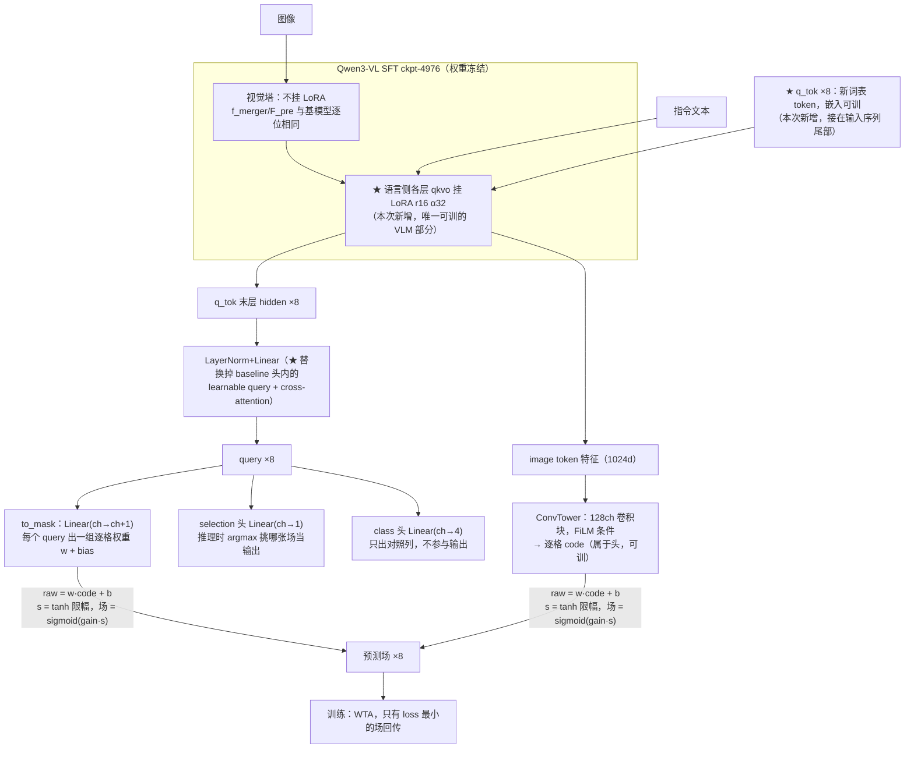

# 实验：in-context query token + 语言侧 LoRA（ST_LANG）

## 1. 任务

本实验测试：把统一场头的 query 来源从头内部换到 VLM 内部——8 个新词表 token 跟着图和指令一起过 VLM，末层 hidden 直接当 query；同时给 VLM 语言侧挂 LoRA，让写 query 的一方可训。

- **参考工作**（实施前已打开原文核实）：
  - LISA（arXiv 2308.00692）：`<SEG>` token 的末层 hidden 直接出掩码嵌入——query token 读出形态的来源
  - LoRA（arXiv 2106.09685）：冻结底座上挂低秩旁路——语言侧可训的实现方式
  - EoMT（arXiv 2503.19108）：query 直接进 transformer 编码器，不要外挂 decoder——「query 进 VLM」的旁证
- **测试什么方法**：读出位置（外桥 → in-context）与写入方训练（冻结 → 语言侧 LoRA）两个结构因子。
- **解决什么问题**：baseline 里 VLM 全程冻结，query 在头内部、只能在外面读特征；不知道让 query 进 VLM 里走一遍推理、并让语言侧可训，指标会怎么变。

## 2. 模型图（baseline 代码不动）



★ = 本次改动挂点。baseline（外桥形态）：q_tok/LoRA/Linear 三处都不存在，query 是头内 8 个 learnable 向量，对 `<where>` token 序列做 cross-attention；该 cross-attention 在本形态中剥离。

## 3. 改动怎么接进来（逐条可确认）

| 项 | 内容 |
|---|---|
| 改哪里 ① | 词表 resize 追加 8 个 token（原行冻结，新 8 行可训，bf16 存储无 fp32 副本）；q_tok 末层 hidden 过一层 Linear 直接当头的 query；头内原 learnable query + cross-attention 剥离；pooled FiLM 的 query 行剥离（防两条通路串扰） |
| 改哪里 ② | 语言侧每层 q_proj/k_proj/v_proj/o_proj 挂 LoRA(r16, α32)；视觉塔不挂 |
| 梯度 | 经无梯度旁路（`__wrapped__`）+ 梯度检查点穿过 VLM |
| 不变 | loss 全部七项及权重、优化器、1200 步、K=8 场数、selection/class 头形状、sim-norm 常量（用 base 模型拟合，LoRA B=0 时等价，不重拟合） |
| 初始化 | q_embed = 词表均值 + 0.02 噪声（seed 20260812）；LoRA A 高斯、B 全零 ⇒ step0 的 VLM 输出与冻结模型逐位相同 |
| 入口 | `run_uniq4b_arm.py --arm UNIQ --uniq4-qtok 8`（uniq4b.LangQueryTokVLM，语言侧 LoRA 内建）；与 baseline 的差异只在此入口 |

## 4. 结果（做完补，消融行全填这里）

```
baseline（外桥 K8，VLM 全冻结）      ：top-k IoU = 0.74950
换 in-context query token（MQ）      ：0.73200，配对 Δ −0.0035（p=0.170）
再 +语言侧 LoRA（ST_LANG）           ：0.74550，vs MQ 配对 Δ均值 +0.0078 / Δ中位 +0.0023（p=0.0615）

消融行：
  LoRA 改全目标·语言+视觉（ST）     ：0.77390，vs MQ +0.0171（p=0.0101）
  语言 LoRA 挂回外桥（不换读出）     ：0.72930，vs baseline −0.0054（p=0.0015）
  种子 20260810 改 20260813（ST 形态）：0.76590，vs 原种子 +0.0009（p=0.859）
  rank 16 改 32                      ：0.74600，vs ST_LANG Δ均值 −0.0049 / Δ中位 −0.0021（p=0.1615）
  qtok 8 改 16                       ：0.74060，vs ST_LANG Δ均值 −0.0081 / Δ中位 −0.0093（p=0.0013）
  micro batch 4 改 16（同种子同步数）：0.73737，vs ST_LANG Δ均值 −0.0092 / Δ中位 −0.0048（p=0.0131）
  micro batch 4 改 32（同种子同步数）：0.72924，vs ST_LANG Δ均值 −0.0176 / Δ中位 −0.0215（p<0.0001）
  种子 20260810 改 20260814（mb16）  ：0.73916，vs mb16 对照臂 Δ均值 +0.0014（p=0.9039）；vs mb4 seed1 Δ均值 −0.0079（p=0.0667）

（口径：headline = hard_iou 列 = 面积匹配 top-k IoU，mode=generated，winner_confidence=normal，n=224，配对 Wilcoxon。）
```
