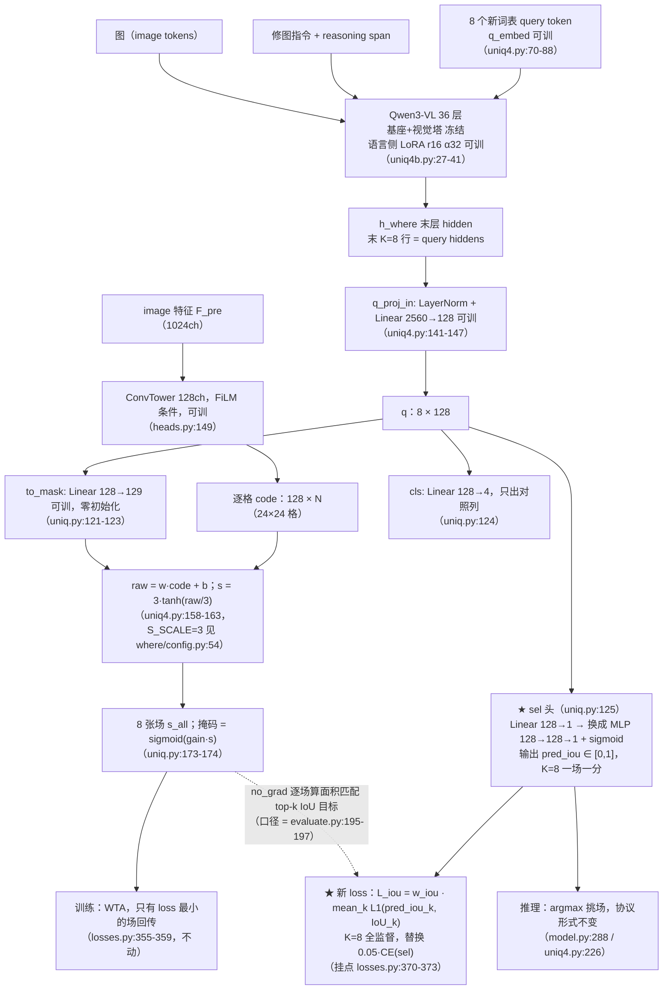

# 实验：IoU 回归选择头（EPR-012）

状态：提案（待 grill-me + 用户定稿）。baseline = ST_LANG 形态（在跑）。
本文引用的外部行号以 2026-08-13 打开的 GitHub main 分支快照为准（下载存档见文末来源清单）。

## 1. 任务

本实验测试：把 UNIQ 的 sel 选择头从「Linear(128→1) + 0.05·CE 向赢家序号蒸馏」换成
「3 层 MLP(128→128→1) + sigmoid 的质量回归头，对全部 K=8 张场回归各自真实
面积匹配 top-k IoU 的 L1 损失（supervise_all_iou）」，场路径与其余六项 loss 一律不动。

- 参考工作（全部已打开原始文件核实）：
  - **Segment Anything (SAM)**，arXiv 2304.02643，
    `segment_anything/modeling/mask_decoder.py`：iou_token（L49）+
    `iou_prediction_head = MLP(transformer_dim, iou_head_hidden_dim, num_mask_tokens, iou_head_depth)`
    （L67-69；默认 depth=3 / hidden=256 / 输出 4 个候选一人一分，L22-25、L50），forward 出分在 L147；
    MLP 类 L154-176（`sigmoid_output` 默认 False，SAM v1 的 IoU 头**不带** sigmoid）。
    论文 §A Losses 原文："The IoU prediction head is trained with mean-square-error loss between
    the IoU prediction and the predicted mask's IoU with the ground truth mask. It is added to the
    mask loss with a constant scaling factor of 1.0."；mask loss 为 focal:dice = 20:1；
    多候选时 "only backpropagate from the lowest loss"（WTA）。
  - **SAM 2**，arXiv 2408.00714，`training/loss_fns.py`：
    `iou_loss`（L93-123）——真实 IoU 用 `logits > 0` 二值化后算 `area_i / clamp(area_u, min=1.0)`
    （L111-115），`use_l1_loss=True` 时 L1、否则 MSE（L117-120）；
    WTA 分支 L267-282——focal+dice 加权组合 argmin 选赢家（L269-273），mask/dice 只回传赢家
    （L275-276），`supervise_all_iou=True` 时 IoU loss 对全部候选取 mean（L279-280），否则只算赢家
    （L282，代码注释注明后者是 "to be consistent w/ SAM"）；无目标样本用 `target_obj` 把
    loss_iou 门控置零（L288-291）。
  - **SAM 2 训练配置**，`sam2/configs/sam2.1_training/sam2.1_hiera_b+_MOSE_finetune.yaml`：
    `iou_prediction_use_sigmoid: True`（L159）；loss 权重 `loss_mask: 20 / loss_dice: 1 /
    loss_iou: 1 / loss_class: 1`，`supervise_all_iou: true`，`iou_use_l1_loss: true`（L284-290）。
  - **SAM 2 stability 兜底**，`sam2/modeling/sam/mask_decoder.py`：
    默认参数 `dynamic_multimask_stability_delta=0.05`、`dynamic_multimask_stability_thresh=0.98`
    （L28-29）；stability = `area(logits > +0.05) / area(logits > -0.05)`（L247-257）；
    仅推理时启用（`not self.training`，L149-150）；主输出 stability < 0.98 时回退到
    预测 IoU 最高的多候选输出（L259-295）。
- 测试什么方法：给每张候选场配一个稠密的连续质量监督（真实 top-k IoU 回归），
  代替只有赢家序号的 one-hot 分类蒸馏，推理仍是 argmax 挑场、协议形式不变。
- 解决什么问题（只陈述已测事实）：
  - 选择缺口：best-of-K = 0.807，按 sel argmax 选出 = 0.757（Δ = 0.050）；
    K 8→16 配对 −0.0076。
  - 现行监督（`q3vl/whereb/amort/losses.py:370-373`）是
    `CE(sel_logits, 赢家序号)`：每步只产生一个 one-hot 目标，7 个输家场各自
    「有多好」的连续值不进入 sel 头的监督信号。
  - eval 侧已逐样本记录逐场 top-k IoU（`q3vl/whereb/amort/evaluate.py:195-197`
    的 `uniq_query_ious`）与 `uniq_sel_is_best`（evaluate.py:206），本提案的训练目标
    与该列算法逐位同口径。

## 2. 模型图（baseline 代码不动，★ 为本次改动挂点）

冻结/可训清单：Qwen3-VL 基座与视觉塔冻结（`uniq4.py:67` 关 embedding 梯度；视觉 LoRA 一根不注入，
`uniq4b.py:29` 正则显式排除 visual 并在 L34-36 断言）；可训 = q_embed（`uniq4.py:77-78`）、
语言侧 LoRA（`uniq4b.py:27-38`）、头侧全部（ConvTower / FiLM 条件 / q_proj_in / to_mask /
cls / sel / gain，优化器收全部 `requires_grad` 参数，`trainer.py:227-237`）。

## 3. 改动怎么接进来（逐条可确认）

| 项 | 内容 |
|---|---|
| 改哪里 | ① **增加了 IoU 回归头模块**：在 `q3vl/whereb/amort/uniq.py:125`（`UniQHead.__init__` 的 `self.sel = nn.Linear(ch, 1)`）把 sel 头换成 3 层 MLP（Linear 128→128 + ReLU ×2 + Linear 128→1）末端过 sigmoid，逐 query 出一个 [0,1] 分数；MLP 形制照抄 SAM `mask_decoder.py:154-176` 的 MLP 类（含 `sigmoid_output` 开关）。`UniQ4Head`（`uniq4.py:134`）继承该 `__init__`，一个挂点同时覆盖两个头形态；forward 的输出键名 `sel_logits` 不改（`uniq.py:171`、`uniq4.py:165`），argmax 消费端零改动。② **模块的监督目标处**：`q3vl/whereb/amort/losses.py:312-378`（`uniq_wta_loss`）的 sel 分支（L370-373）由 `CE(sel_logits, 赢家序号 j)` 换成 L1 回归——在 `torch.no_grad()` 下逐场算目标 `IoU_k = hard_iou(topk_mask(mask_of(s_all[k]), k_area), topk_mask(gt, k_area))`，`k_area = gt_area_k(gt)`（函数即 `q3vl/whereb/metrics.py:127-139 / 142-144 / 200-207`，与 headline 判据、与 `evaluate.py:195-197` 的 `uniq_query_ious` 三处同口径；对 SAM2 `logits>0` 二值化口径【loss_fns.py:111-115】的 **NOVEL 适配**，理由：本战役判据红线规定面积匹配 top-k，训练目标与判据同口径则 eval 的 `uniq_sel_is_best` 列直接读得出该头学没学到位）。③ **新增了 loss** `L_iou = w_iou · mean_{k=1..8} |pred_iou_k − IoU_k|`：K=8 全监督（SAM2 `supervise_all_iou` 的 mean 形式，loss_fns.py:279-280），**替换** `0.05·CE(sel)`；`LossWeights` 增加字段 `uniq_iou`（挂在 `losses.py:91` 的 `uniq_sel` 旁，默认 0.0）；per-step 统计增加 `uniq_iou_mae`（挂在 `losses.py:374-377` 的 stats 块），`aggregate` 自动把 `L_uniq_iou` 写进 steps.jsonl（`losses.py:394-397`），这就是「判据接了线」的运行时证据；`setup()` 落盘的 `loss_weights` 自动带上新字段（`trainer.py:252`）。 |
| 不变（明确列出没动的部分） | 场路径全部：ConvTower（`heads.py:149`）、to_mask 及其零初始化（`uniq.py:121-123`）、tanh 限幅与 gain（`uniq.py:126, 167, 173-174`）、K=8 与 query token 机制（`uniq4.py:50-131`）、语言侧 LoRA（`uniq4b.py:20-45`）。WTA 赢家选取与回传（`losses.py:355-361`）。其余六项 loss 及权重：1.0·BCE + 0.1·SDF + 0.05·面积带(τ=0.15) + 0.2·空场(p=0.15) + 0.3·配对分离 + 0.05·CE(cls)（`losses.py:63-74, 90` 与 `run_amort_arm.py:198`）。fake 样本分支：`uniq_wta_loss` 在 L346-353 提前返回，本来就不带 sel 监督，L_iou 同样不计（机制上与 SAM2 的 `target_obj` 门控【loss_fns.py:288-291】同型，无需新代码）。推理协议：argmax 挑一场（`model.py:288`、`uniq4.py:226`；sigmoid 单调，对 [0,1] 分数取 argmax 与对 logits 取 argmax 是同一条选择规则）。优化器/调度/步数：AdamW lr 3e-4、wd 0.01、warmup 3%、cosine、mb4→有效 32、1200 步（`trainer.py:42-48, 227-239`，`run_amort_arm.py:87-94`）。eval 全套（`evaluate.py`，`uniq_query_ious`/`uniq_sel_is_best`/`uniq_best_iou` 列已存在，就是本实验的读出列）。checkpoint 选择仍走 quick-eval 硬门 + `local_soft_iou_median`（`trainer.py:442-456`），**IoU 值只作 sel 头的回归目标（no_grad 常数、top-k/hard_iou 本身不可导），场损失七项照旧，IoU 不进场的优化目标**；L_iou 经 q 回传的耦合结构与 baseline 的 CE(sel) 经 q 回传相同，不是新增通路。 |
| 初始化（step0 与 baseline 等价性） | 场输出 `s_all`、cls_logits、七项场 loss：**逐位等价**（to_mask/tower/q_proj_in/queries 一律没动）。sel 输出：**不逐位等价也无法逐位对齐**——baseline 的 `nn.Linear(128,1)` 是默认随机初始化（`uniq.py:125` 无 `zeros_`），换成 MLP 后参数形状不同；两者 step0 的 argmax 选择同样由随机初始化权重决定。headline 数字在 step0 因此可能差在「随机选择挑了哪张零初始化恒等场」上——而 to_mask 零初始化使 step0 的 8 张场全为 0.5 常数场（`uniq.py:87-90` 的零初始化纪律），选哪张结果相同。 |
| 新增超参与建议默认值（数字来源逐个注明） | `iou_head_depth = 3`（SAM `mask_decoder.py:24` 默认值）；`iou_head_hidden = 128`（SAM 默认 256 = 其 token 维【mask_decoder.py:24-25】，本头 query 维 ch=128，按「hidden = token 维」同款取法缩到 128，数值本身为适配）；`sigmoid 输出 = True`（SAM2 yaml L159 `iou_prediction_use_sigmoid: True`，接进 `mask_decoder.py:92-98` 的 `sigmoid_output`）；`回归形式 = L1`（SAM2 yaml L290 `iou_use_l1_loss: true`，实现 loss_fns.py:117-118）；`supervise_all_iou = True`（SAM2 yaml L289，实现 loss_fns.py:279-280）；`w_iou = 0.05`（沿用本仓库被替换项 `uniq_sel` 的位置权重，`run_amort_arm.py:200` 默认 0.05；SAM 论文 §A 的 1.0 与 SAM2 yaml L287 的 1 进消融行）；stability 兜底（可选，默认关）：`delta = 0.05`、`thresh = 0.98`（SAM2 `mask_decoder.py:28-29`），logits 取 `gain·s`（本头掩码即 `sigmoid(gain·s)`，`uniq.py:173-174`）；SAM2 的回退对象是「单掩码 token → 多掩码 token」，本头无单/多之分，改为「主选场 stability < 0.98 时回退到 pred_iou 次高场」，**NOVEL 适配**，理由：候选集结构不同，机制（低稳定性时信 IoU 头）保持原样。 |
| 入口（旗标；关掉 = baseline 逐位一致） | 挂在 `q3vl/whereb/scripts/run_amort_arm.py` 的 UNIQ 旗标区（L189-200，`run_uniq4b_arm.py:59-61` 原样透传）：`--uniq-iou-head`（开 = sel 头换 MLP+sigmoid 且 `uniq_sel→0`、`uniq_iou→--uniq-iou-weight`，接线处即 L449-451 的 `_kw` 组装；**关 = 不进任何新分支，构图与 loss 逐位回到 baseline**）；`--uniq-iou-weight`（float，默认 0.05）；`--uniq-iou-winner-only`（消融：只监督赢家，SAM v1 口径【loss_fns.py:282 及 L277-278 注释】）；`--uniq-iou-mse`（消融：L1→MSE）；`--uniq-iou-keep-ce`（消融：保留 0.05·CE(sel) 与 L_iou 并联；CE 作用在 MLP 的 pre-sigmoid 标量上，L1 作用在 sigmoid 后）；`--uniq-iou-stability`（消融：推理时 stability 兜底，仅 eval 生效，同 SAM2 `not self.training` 门【mask_decoder.py:149-150】）。所有旗标写进 run_config / `uniq4b_setup.json`（`run_uniq4b_arm.py:44-55` 已有 sha256 冻结机制）。 |

判据（预注册，随 baseline 冻结）：V_where local 400，normal-only headline（`.contexts.*.headline_normal_only`），
面积匹配 top-k soft-IoU 三列全套（soft-IoU + grid 级边界 F1 + 中心先验列），臂间逐样本配对 + Wilcoxon；
UNIQ 专属读出列 `uniq_sel_is_best` / best-of-K 与 selected 的差（`evaluate.py:201-210`，已接线）。

## 4. 结果（做完补，消融行全填这里）

（口径：headline = 面积匹配 top-k IoU，generated + normal-only，n=224，配对 Wilcoxon。
本臂 mb16；mb 同档基线 = ST_LANG_MB16 对照臂 0.73737；mb4 原基线 = 0.74550，其诊断列 best-of-K 0.807 / sel_is_best 0.091。）

baseline（ST_LANG mb16 对照臂）：top-k IoU = 0.73737

+IoU 回归选择头（mb16）：0.74507；vs mb16 对照 Δ均值 +0.0066 / Δ中位 +0.0055（p=0.0028）；vs mb4 基线 Δ均值 −0.0027（p=0.6205）；sel_is_best_frac 0.071；best-of-K 0.75851（缺口 0.0134）

消融行：

- L1 vs MSE 回归：___
- supervise_all_iou（8 张全监督）vs 仅赢家监督（SAM v1 口径）：仅赢家 0.74359；vs 全监督主臂 Δ均值 −0.0004（p=0.7772）；vs mb16 对照 +0.0062（p=0.0109）；sel_is_best_frac 0.107
- loss 权重 0.05 vs 1.0（相对 BCE=1.0）：___
- +stability score 兜底 vs 纯 argmax：___
- 保留原 CE(sel) 蒸馏与 IoU 回归并联 vs 完全替换：___

---

来源清单（本提案引用的外部行号均出自当日打开的下述原始文件）：

- https://raw.githubusercontent.com/facebookresearch/segment-anything/main/segment_anything/modeling/mask_decoder.py
- https://ar5iv.labs.arxiv.org/html/2304.02643 （§A Losses 原文核实 MSE / 20:1 / lowest-loss WTA / 权重 1.0）
- https://raw.githubusercontent.com/facebookresearch/sam2/main/training/loss_fns.py
- https://raw.githubusercontent.com/facebookresearch/sam2/main/sam2/modeling/sam/mask_decoder.py
- https://raw.githubusercontent.com/facebookresearch/sam2/main/sam2/configs/sam2.1_training/sam2.1_hiera_b%2B_MOSE_finetune.yaml
