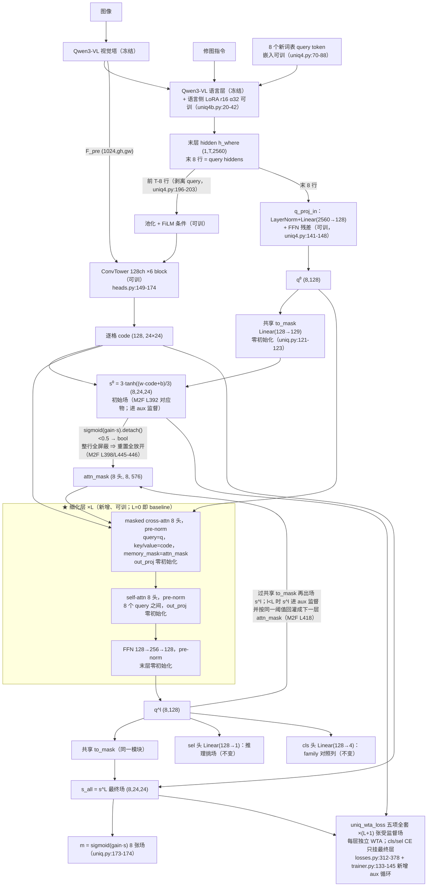

# 实验：Masked cross-attention 细化层

EPR-013 · baseline = ST_LANG（8 query token + 语言侧 LoRA，run_uniq4b_arm 入口）· 2026-08-13

## 1. 任务

本实验测试：在 query 与逐格 code 的单次点积之间插入 1–2 层 masked cross-attention 细化层
（query 先出一张场 → 场限制注意范围 → query 带着限制看图 → 再出场），V_where local 400
normal-only 的面积匹配 top-k soft-IoU 配对 Δ（Wilcoxon p）怎么变。

- 参考工作（全部已于 2026-08-13 打开原仓库核实，行号按当日 main/master 分支）：
  - **Mask2Former**（Masked-attention Mask Transformer for Universal Image Segmentation,
    arXiv:2112.01527，repo `facebookresearch/Mask2Former`）
    - `mask2former/modeling/transformer_decoder/mask2former_transformer_decoder.py`：
      L392 第 0 层前先用 learnable query 出第一张 mask 当初始 attn_mask；L396–416 每层顺序 =
      masked cross-attn（L400–405，`memory_mask=attn_mask`）→ self-attn（L407–411）→ FFN
      （L414–416）；L398 全空行重置
      `attn_mask[torch.where(attn_mask.sum(-1) == attn_mask.shape[-1])] = False`；
      L433–448 `forward_prediction_heads`：L442 双线性插值到 attn 分辨率、L445
      `(attn_mask.sigmoid()… < 0.5).bool()` 并按 num_heads 复制、L446 `.detach()`、L444 注释
      明确 bool 语义 True = 不许 attend；L418 每层重出预测与新 attn_mask；L427–429 + L451–461
      除最后一层外全部进 `aux_outputs`；L349–355 `dec_layers = DEC_LAYERS - 1`，注释写明
      「aux loss 数 = decoder 层数 + 1」（learnable query 的第 0 张预测也受监督）；
      层内部 CrossAttentionLayer L75–135 / SelfAttentionLayer L17–72 / FFNLayer L138–178，
      post-norm 默认（residual 后 LayerNorm），pre-norm 变体自带（`forward_pre`
      L52–62 / L112–124 / L169–173），dropout 构造处写死 0.0（L289/L298/L307）。
    - `mask2former/modeling/criterion.py`：L239–245 deep supervision——每个 aux 层重新做一次
      Hungarian 匹配再算同一套 loss，项名加 `_{i}` 后缀（L244）。
    - `mask2former/maskformer_model.py`：L118–125 `weight_dict` 逐层全权重复制
      （`aux_weight_dict.update({k + f"_{i}": v …})`，不打折）。
    - `configs/coco/panoptic-segmentation/maskformer2_R50_bs16_50ep.yaml`：L22
      `DEEP_SUPERVISION: True`；L23–26 权重 NO_OBJECT 0.1 / CLASS 2.0 / MASK 5.0 / DICE 5.0；
      L27 HIDDEN_DIM 256；L29 NHEADS 8；L30 DROPOUT 0.0；L31 DIM_FEEDFORWARD 2048；L33
      `PRE_NORM: False`；L36 `DEC_LAYERS: 10`（= 9 decoder 层 + 1 张 learnable-query 预测）。
  - **EoMT**（Your ViT is Secretly an Image Segmentation Model, arXiv:2503.19108，repo
    `tue-mps/eomt`）
    - `models/eomt.py`：L24 `num_blocks=4`；L33 `attn_mask_probs` buffer 初始全 1；L121–148
      `_attn_mask`：L140 阈值 `interpolated > 0`（logits>0，True=允许——与 M2F 语义相反，
      L112 `masked_fill(~mask, -inf)`）；L71–82 `_disable_attn_mask`：prob<1 时按每样本每
      query 的 Bernoulli(1-prob) 把该 query 的 mask 整行放开；L165–179 最后 num_blocks 个
      block 逐块出中间预测（L175–177）并逐块重算 attn_mask（L179），全部中间预测受监督。
    - `training/lightning_module.py`：L199–209 `mask_annealing`：step<start 返回 1.0、
      ≥final 返回 0.0、其间 `(1-progress)^poly_power`；L211–224 每个 train batch 结束逐块
      更新 `attn_mask_probs`。退火到 0 后推理完全不用 masked attention、零开销。
    - `training/mask_classification_panoptic.py`：L33 `poly_power=0.9`；L35–38 权重
      no_object 0.1 / mask 5.0 / dice 5.0 / class 2.0。
    - `configs/dinov2/coco/panoptic/eomt_large_640.yaml`：L12–14 退火起止步
      start [14782, 29564, 44346, 59128] / end [29564, 44346, 59128, 73910]，即 4 个 block
      按总步数 T 的 0.2/0.4/0.6/0.8·T 起、0.4/0.6/0.8/1.0·T 止错峰关闭。
- 测试什么方法：把 Mask2Former 的「预测场回灌成 attention mask + 逐层深监督」decoder 层
  （单尺度、1–2 层）接到现有 UniQ4Head 的 q_proj_in 之后、to_mask 之前，EoMT 式 mask
  annealing 作消融臂。
- 解决什么问题：当前 `raw = w·code + b` 是单次点积（uniq4.py:158–159），query 过完 LLM 后与
  像素 code 零交互、零迭代，没有任何「预测→限制注意→再预测」的细化步。已测数字：K 8→16
  配对 −0.0076；选择缺口 best-of-K 0.807 vs sel 选出 0.757。Mask2Former 谱系 100-query 配方
  里迭代回灌 + 逐层监督是标配（上列 L392–448 与 DEEP_SUPERVISION 即其实现）。

## 2. 模型图（baseline 代码不动）

★ = 本实验唯一改动挂点：细化层插在 q_proj_in（LayerNorm+Linear(2560→128)+FFN 残差）之后、
共享 to_mask 之前；`n_refine_layers=0` 时整条 ★ 支路不构造，即 baseline。

冻结/可训：Qwen3-VL 主干冻结；可训 = query token 嵌入、语言侧 LoRA、ConvTower+FiLM、
q_proj_in、to_mask/cls/sel/gain（以上全是 baseline 原有），新增可训 = 细化层 ×L +
可学 query_pos (8,128)。场回灌 = 每张受监督场 s^l 经 `sigmoid(gain·s).detach() < 0.5`
转 bool、整行全屏蔽重置后，作下一层 cross-attn 的 memory_mask。

## 3. 改动怎么接进来（逐条可确认）

| 行 | 内容 |
|---|---|
| 改哪里（file:line + 三段式） | ① `q3vl/whereb/amort/uniq4.py:134-148`（UniQ4Head.__init__）——增加了 L 层细化模块（每层 = masked cross-attn + self-attn + FFN）与可学 query_pos (8,128)；在构造函数末尾追加（不动既有子模块的构造顺序，既有模块的初始化随机流不变）；加了 `n_refine_layers` 构造参数。② `q3vl/whereb/amort/uniq4.py:150-165`（UniQ4Head.forward）——增加了「初始场 s⁰ → 逐层 masked cross-attn 细化 → 每层过共享 to_mask 出中间场」的循环；在 L157 `q = self._query_states(...)` 与 L158 `wb = self.to_mask(q)` 之间；加了返回字典键 `"s_all_aux"`（长度 L 的受监督中间场列表，s⁰ 在内、最终场不在内，对应 M2F L451-461 aux = 除最后一层外全部）。③ `q3vl/whereb/amort/trainer.py:133-145`（compute_micro_batch 的 `if "uniq" in out:` 分支）——增加了逐层 aux loss；在主 `uniq_wta_loss` 调用之后；加了对 `u.get("s_all_aux", [])` 的循环，每张中间场再调一次 `uniq_wta_loss`（`cls_logits=None, sel_logits=None`），total 直接相加、terms 以 `_aux{i}` 后缀并入（命名对应 criterion.py L244 的 `k + f"_{i}"`）。④ `q3vl/whereb/amort/uniq4.py:46-47`（VARIANT4）与 `uniq4.py:179-183`（AmortModelV4 构造 UniQ4Head 处）——`n_refine_layers`、`refine_anneal` 进 VARIANT4 并传入 UniQ4Head。⑤ `q3vl/whereb/scripts/run_uniq4b_arm.py:17-29`——增加 `--uniq4-refine-layers`（default 0）与 `--uniq4-refine-anneal` 旗标；在 argparse 与 `VARIANT4.update` 处；`run_uniq4b_arm.py:41-55` 的 `uniq4b_setup.json` 增记两个新旗标与 sha256。⑥（仅消融臂）`trainer.py:377-383` 优化器步进之后——增加 attn_mask_probs 回写：`if hasattr(self.model, "geo") and hasattr(self.model.geo, "attn_mask_probs")` 则按退火调度更新（EoMT lightning_module.py L211-224 的对应物）；默认臂不启用、该 hook 无操作。 |
| 细化层内部结构 | 逐层顺序 = masked cross-attn → self-attn → FFN（M2F decoder L399-416 的顺序，注释原文 "attention: cross-attention first"）。masked cross-attn：`nn.MultiheadAttention(128, num_heads=8)`（NHEADS=8 来自 M2F yaml L29；head_dim=128/8=16），query = q + query_pos（M2F L404 `query_pos=query_embed` 的对应物；query_pos 为可学 (8,128)，seeded 初始化沿 uniq.py:106-108 形式），key/value = 逐格 code 转置成 (N=gh·gw, 128)（单尺度，无 M2F 的 3 尺度轮转 L397；无 memory 侧位置编码——M2F L404 的 `pos=pos[level_index]` 是坐标注入，S5.6 禁坐标通道进头，此处显式偏离并标注），`memory_mask` = 回灌 attn_mask。self-attn：`nn.MultiheadAttention(128, 8)`，8 个 query 之间，无 mask（M2F L407-411 tgt_mask=None）。FFN：Linear(128→256)+GELU+Linear(256→128)（倍率 2× 沿本仓库 uniq.py:115 现有 head FFN 惯例；M2F 参考值 2048=8×256，yaml L31）。norm 位置：三个子层全用 pre-norm（LayerNorm 在残差支路入口，M2F 自带的 forward_pre 变体 L52-62/L112-124/L169-173；M2F COCO 默认 PRE_NORM=False，此处选 pre 是为了 step0 等价——见「初始化」行——标注为对参考默认值的偏离）。dropout=0.0（M2F 构造处写死，L289/L298/L307）。不加 M2F L434 的 decoder_norm（baseline 的 to_mask 直接吃 q，插一个 norm 就破坏 step0 等价）。每层约 0.2M 参数（cross-attn 4·128² + self-attn 4·128² + FFN 2·128·256）。 |
| 全空行重置的实现（空场样本硬要求） | 本任务 p=0.15 假指令样本 GT 全零，训练目标就是把 8 张场全压负（losses.py:344-353 fake 分支对全 K 收空场项），s<0 全格 ⇒ mask 全 <0.5 ⇒ 该 query 的 attn_mask 整行全 True（全屏蔽）是**常态而非病态**；不重置则该行 softmax 全 -inf 出 NaN，trainer.py:346-360 按 non-finite 跳步、>50 次杀臂。实现（M2F L398 等价形式）：`block = (mask_of(s_prev).detach() < 0.5)` 得 (K,N) bool，True=屏蔽（语义与 detach 对齐 M2F L444-446）；`block[block.all(dim=-1)] = False` 整行全屏蔽 ⇒ 重置为全放开；然后 `block.unsqueeze(0).expand(8, K, N)` 复制到 8 头交给 `nn.MultiheadAttention` 的 3D attn_mask。两个实现注意点：(a) 重置必须在 expand **之前**做——expand 是 view，之后原地写会写穿共享存储；M2F 在 (B·h,Q,HW) 上重置（L398），本头 batch=1、逐头复制，先重置后 expand 等价。(b) 阈值取自 `mask_of(s).detach()`，mask 分支不回传梯度（M2F L446）。fresh init 时 to_mask 零初始化 ⇒ s⁰ 全零 ⇒ sigmoid=0.5，`0.5<0.5=False` ⇒ 第 0 层全放开，无退化启动问题。 |
| 逐层 aux loss 怎么挂进现有 WTA 口径 | 受监督场共 L+1 张：s⁰（初始场）+ 每层输出场，最后一层为主监督（对应 M2F「aux 数 = decoder 层数 + 1」，decoder from_config L349-355 注释 + L392/L418/L451-461）。每张中间场独立跑一遍现有 `uniq_wta_loss`（losses.py:312-378）的五项 mask loss（1.0·BCE + 0.1·SDF + 0.05·面积带 + 0.2·空场 + 0.3·配对分离），权重不打折（maskformer_model.py L118-125 逐层全权重复制 weight_dict）；WTA winner 每层独立重算 argmin（对应 criterion.py L240-241 每个 aux 层重新做 Hungarian 匹配）；fake 样本每层都对全 K 收空场项（losses.py:344-353 分支原样复用）。0.05·CE(cls) 与 0.05·CE(sel) 只挂最终层（材料口径：aux 只复制 mask loss 全套；cls/sel 头读最终 q，sel 蒸馏目标 = 最终层 winner）——这是对 M2F 的收窄（M2F aux 每层带 class CE，weight_dict 含 `loss_ce_{i}`），非新机制。SDF 的 phi 逐样本只算一次（trainer.py:124-132 的 sdf_cache 原样复用，L+1 张场共享同一 phi_sdf）。aggregate（losses.py:381-409）不改：aux 项经 terms 的 `_aux{i}` 后缀自动进 `L_*` 列，total 已含 aux（每步 loss 标度升为约 (L+1)×，与 M2F 同型，steps.jsonl 里可见）。 |
| 不变 | ConvTower 与 FiLM（heads.py:149-174）；to_mask/cls/sel/gain（uniq.py:121-126；**每层复用同一个 to_mask 出中间场**，不新建 per-layer 头）；q_proj_in（uniq4.py:141-148）；QueryTokVLM/LangQueryTokVLM 全部 token 与 LoRA 机械（uniq4.py:50-131, uniq4b.py:20-45）；pooled-FiLM 路径剥离 query token（uniq4.py:196-203）；推理 sel 选场（uniq4.py:225-228，用最终场）；K=8；WTA 五项权重（losses.py:60-91）；训练配方 AdamW 3e-4 / wd 0.01 / warmup 3% / cosine / mb4 有效 32 / 1200 步；数据 train split、render_mode=local、exclude_low、n=42,752、fake_prob=0.15；评测口径 V_where local 400 normal-only、面积匹配 top-k soft-IoU、配对 Wilcoxon。 |
| 初始化（step0 等价） | 零初始化三处：每层 cross-attn 的 out_proj、self-attn 的 out_proj、FFN 末层 Linear（权重与 bias 全零）——与本仓库既有零初始化纪律同款（uniq.py:112-118 对 xattn.out_proj 与 ffn 末层置零）。配合 pre-norm（残差支路 = q + 零输出分支），每层输出恒等于输入 ⇒ q^L ≡ q⁰ ⇒ 最终场、cls、sel 与 baseline 在同权重下逐数值相等，**step0 前向严格等价 baseline**；这正是选 pre-norm 而非 M2F 默认 post-norm 的原因（post-norm 的 `LayerNorm(q+0) ≠ q`，零门控救不回恒等）。query_pos 可学、随机初始化（seeded，沿 uniq.py:106-108 形式）不破坏等价：它只进被零门控的注意分支的输入。新模块在 __init__ 末尾构造，既有模块的构造顺序与初始化随机流不变。 |
| 新增超参与默认值 | ① `n_refine_layers`：默认 1，消融 2（本头 24×24 单尺度；M2F 的 9 层 = 3 尺度 × 3 轮，yaml L36；EoMT num_blocks=4，eomt.py L24）。② 注意头数 8（M2F yaml L29）。③ FFN 隐层 256 = 2×ch（uniq.py:115 仓库惯例；M2F 参考 8×，yaml L31）。④ dropout 0.0（M2F L289/L298/L307 + yaml L30）。⑤ 回灌阈值：默认 M2F 式 `sigmoid(gain·s) < 0.5` 置屏蔽（M2F L445）。机械事实：gain>0 时 `sigmoid(gain·s)<0.5 ⇔ s<0 ⇔ raw<0`（sigmoid 单调、tanh 保号），与 EoMT 式 `raw > 0` 放开（eomt.py L140）在本头是同一判据，两者仅在 gain 学成负值时才分岔；消融行按「对 mask_of(s) 取 sigmoid 0.5」vs「对 raw 取 0」两个代码路径落地并在 config 记录 gain 终值。⑥ mask annealing（消融臂）：`attn_mask_probs` buffer 初始全 1（eomt.py L33）；调度 `(1-progress)^0.9`（lightning_module.py L199-209，poly_power=0.9 取自 mask_classification_panoptic.py L33）；起止步按 EoMT COCO 配方的等距形式缩放——EoMT 4 block 起于 0.2/0.4/0.6/0.8·T、止于 0.4/0.6/0.8/1.0·T（eomt_large_640.yaml L13-14），一般化为 start_i=(i+1)/(L+1)·T、end_i=(i+2)/(L+1)·T（L=2、T=1200 ⇒ start [400,800]、end [800,1200]；L=1 ⇒ start [600]、end [1200]），此缩放为对参考配方的比例移植、标注为适配；实现 = 每样本每 query 的 Bernoulli(1-prob) 整行放开（eomt.py L71-82）；prob 退到 0 后推理完全不用 masked attention（EoMT 论文机制，零推理开销）。退火与全空行重置**并存**：退火只按概率放开部分行，未被抽中的行仍可能整行全屏蔽。 |
| 入口旗标 | `--uniq4-refine-layers INT`（default **0** = 不构造细化层 = baseline，逐字节同一前向路径）；`--uniq4-refine-anneal`（default off；仅在 refine-layers>0 时有效）。两旗标经 run_uniq4b_arm.py 的 VARIANT4.update 进 UniQ4Head 构造，并写入 `config/uniq4b_setup.json`（含 uniq4.py 与 wrapper 的 sha256，沿 run_uniq4b_arm.py:41-55 现行做法）。 |

## 4. 结果（做完补，消融行全填这里）

（口径：headline = 面积匹配 top-k IoU，generated + normal-only，n=224，配对 Wilcoxon。
本臂 mb16；mb 同档基线 = ST_LANG_MB16 对照臂 0.73737；mb4 原基线 = 0.74550。）

baseline（ST_LANG mb16 对照臂）：top-k IoU = 0.73737

+细化层 1 层（mb16）：0.74372；vs mb16 对照 Δ均值 −0.0019 / Δ中位 +0.0056（p=0.0710）；vs mb4 基线 Δ均值 −0.0112 / Δ中位 0.0000（p=0.1005）

消融行：

| 消融 | top-k IoU | 配对 Δ | p |
|---|---|---|---|
| 细化层数 1 vs 2 | ___ | ___ | ___ |
| EoMT 式 mask annealing（训练脚手架，推理关掉）vs 永久 masked attention | ___ | ___ | ___ |
| 去掉逐层 aux 监督 | ___ | ___ | ___ |
| 回灌阈值 sigmoid 0.5（Mask2Former）vs logits>0（EoMT） | ___ | ___ | ___ |
| 去掉层内 self-attn（只留 cross-attn+FFN） | ___ | ___ | ___ |
