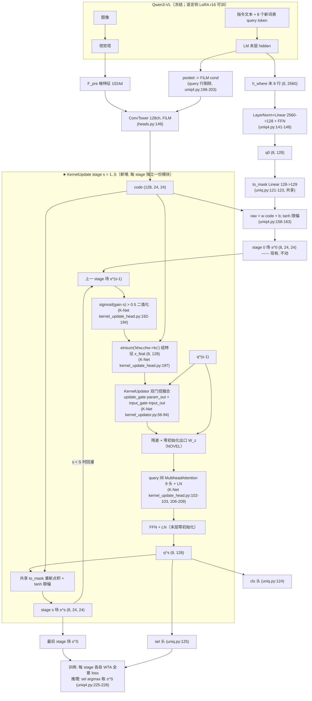

# 实验：K-Net 式门控核更新迭代

EPR-014 · 2026-08-13 · baseline = ST_LANG（uniq4b 形态，在跑）· 指标沿用实验总表：
面积匹配 top-k soft-IoU，V_where local 400，normal-only，配对 Wilcoxon；
数据 train split，local，exclude_low，n=42,752。判据冻结于本提案批准时。

## 1. 任务

本实验测试：在现有「8 query 一次点积出 8 张场」之后插入 2–3 个 K-Net 式核更新
stage——把上一轮的场二值化后回灌聚合成每个 query 的组特征，经 input_gate/update_gate
双门控融合更新 query，再过 query 间 MultiheadAttention 与 FFN，用更新后的 query
重新点积出场——推理取最后一个 stage 的场。

- 参考工作：K-Net: Towards Unified Image Segmentation，arXiv 2106.14855（NeurIPS
  2021，Zhang/Pang/Chen/Loy）；官方仓库 github.com/ZwwWayne/K-Net，
  commit `5e50ee58957dce972f51096804ff69171c2f072e`（以下行号全部对应此 commit，
  文件均已打开核实）：
  - `knet/det/kernel_update_head.py`：L185-197 组特征装配（L192 sigmoid、
    L193-194 `> hard_mask_thr` 硬阈值二值化、L197 `einsum('bnhw,bchw->bnc')` 求和
    聚合）；L102-103 kernel 间 `MultiheadAttention`（8 头）；L203 调 KernelUpdator；
    L206-216 attention+FFN；L228 + L246-259 `fc_mask` 投影后逐样本 `F.conv2d` 出新
    mask（配置 `conv_kernel_size=1`，即逐 kernel 1×1 卷积 = 逐 query 点积）；
    L36/L85 `hard_mask_thr=0.5`；L153-170 `init_weights`（xavier）。
  - `knet/kernel_updator.py`：L36-42 `dynamic_layer`/`input_layer`/`input_gate`/
    `update_gate` 四个 Linear；L46-49 四个 LayerNorm；L56-94 forward（门控公式逐项
    见第 3 节表）。
  - `knet/det/kernel_iter_head.py`：L177-231 训练时逐 stage 循环、每 stage 独立
    全套 loss × `stage_loss_weights`（L217-225）；L181 上一 stage 的 mask 不 detach
    直接喂下一 stage（二值化本身无梯度）；L247-253 推理循环、取最后 stage；
    L114-116 `recursive=True` 才跨 stage 共享 head（默认 False，即每 stage 独立）。
  - `configs/det/_base_/models/knet_s3_r50_fpn.py`：L1-3 `num_stages=3`、
    `num_proposals=100`、`conv_kernel_size=1`；L69 `stage_loss_weights=[1]*3`；
    L90-97 KernelUpdator in=feat=out=256；L98-109 每 stage loss = CE(mask) 1.0 +
    Dice 4.0 + Focal(cls) 2.0；L114-118 匈牙利 cost cls 2.0 / dice 4.0 / mask 1.0；
    L57-65 初始 kernel head 另有 Focal 1.0 + CE 1.0 + Dice 4.0。
  - `configs/det/_base_/schedules/schedule_1x.py`：L3-16 AdamW lr 1e-4、wd 0.05、
    grad clip max_norm=1、12 epoch step [8,11]、warmup linear 1000 iter ratio 0.001。
- 测试什么方法：K-Net 的「mask 回灌分组 + 双门控核更新 + kernel 间 attention +
  重新点积」迭代头，接在现有点积读出（stage 0，不动）之后。
- 解决什么问题：当前 query 在点积前一次成型（`uniq4.py:144-148` 之后不再更新），
  8 个 query 之间全程零通信；已测数字：K 8→16 配对 −0.0076；选择缺口
  best-of-K 0.807 vs selected 0.757。

## 2. 模型图（baseline 代码不动）

## 3. 改动怎么接进来（逐条可确认）

| 项 | 内容 |
|---|---|
| 改哪里 | 新建 `q3vl/whereb/amort/uniq5.py`：增加了 `KernelUpdate` 迭代模块，模块挂在 `UniQ4Head.forward` 的点积输出之后（`q3vl/whereb/amort/uniq4.py:150-165`；stage 0 = 该 forward 原样产出的 `s_all`，不动），添加了「场→二值化→聚合→门控更新 query→query 间 attention→FFN→共享 to_mask 重新点积」的 S 轮循环；`UniQ5Head` 子类化 `UniQ4Head`，输出 dict 增加了 `s_all_stages`（长度 S+1 的逐 stage 场列表），`s_all`/`cls_logits`/`sel_logits` 改指最后 stage 的场与 query——`forward_geo`（`uniq4.py:222-228`）与 eval 消费（`evaluate.py:189-207` 读 `u["s_all"]`）因此一行不用改。 |
| KernelUpdate 模块内部结构 | 逐项公式（K=8，C=128；K-Net 行号见括注，`knet/kernel_updator.py` 简写 KU，`knet/det/kernel_update_head.py` 简写 KUH）：(1) 二值化 `b_k = 1[sigmoid(gain·s_k) > 0.5]`（KUH L192-194，`hard_mask_thr=0.5` KUH L36/L85）；(2) 组特征 `x_feat[k] = Σ_hw b_k(hw)·code(:,hw)`，`einsum('khw,chw->kc')`，求和不归一（KUH L197）；(3) `param_in, param_out = split(W_dyn · x_feat)`，`W_dyn` = Linear 128→256（KU L36-37, L59-63）；(4) `input_in, input_out = split(W_in · q_old)`，`W_in` = Linear 128→256（KU L38-40, L65-68）；(5) `gate_feats = input_in ⊙ param_in`（KU L70）；(6) `input_gate = sigmoid(LN(W_ig · gate_feats))`，`update_gate = sigmoid(LN(W_ug · gate_feats))`（KU L41-42, L74-78）；(7) `param_out ← LN(param_out)`，`input_out ← LN(input_out)`（KU L79-80）；(8) `features = update_gate ⊙ param_out + input_gate ⊙ input_out`——update_gate 管来自场内像素证据的新组特征、input_gate 管旧 query，融合而非替换（KU L87-88）；(9) `q_upd = ReLU(LN(W_fc · features))`（KU L90-92）；(10) 残差回接 `q ← q_old + W_z · q_upd`（NOVEL，见「初始化」行）；(11) query 间 `nn.MultiheadAttention(128, 8 头)` + LN，序列维 = 8 个 query（KUH L102-103, L206-209）；(12) FFN（Linear 128→256→128，本包现款形状 `uniq.py:115-116`）+ LN（KUH L121-128, L214-216）；(13) 共享 `to_mask`（Linear 128→129，`uniq.py:121`）重新点积 + tanh 限幅出 `s^s`——对应 K-Net `fc_mask` + 逐 kernel 1×1 `F.conv2d`（KUH L228, L246-259；配置 `conv_kernel_size=1` 时二者逐元素等价）。模块每 stage 独立一份参数（K-Net `recursive=False` 默认，`kernel_iter_head.py:114-116`）。 |
| 空场样本的组特征处理 | 组特征用 K-Net 原式求和聚合（KUH L197）：二值化后全零的场给出 `x_feat = 0` 向量——求和形式无除法、无 NaN，K-Net 原代码对空 mask 即如此定义，不加特判。三处全零场景逐一交代：(a) 假指令样本（GT 全零）：场被 empty 项压向全零 → 回灌组特征为 0，`W_dyn·0 = bias`，更新退化为门控后的旧 query 自更新；(b) step 0：`to_mask` 零初始化 → raw=0 → `sigmoid(gain·0)=0.5`，`> 0.5` 取严格大于（KUH L193）为 False → 全部 query 组特征恰为 0；(c) 训练中某 query 场整体低于阈值：同 (a) 机制，该 query 本轮只吃自更新与 attention 通道。stage 间不 detach（K-Net `kernel_iter_head.py:181` 同款）；硬阈值本身无梯度，上一 stage 的场只经二值化进入下一 stage，梯度不经此路回传。 |
| 逐 stage 监督怎么挂 | 挂点 = `q3vl/whereb/amort/trainer.py:133-145` 的 UNIQ 分支：现在对 `u["s_all"]` 调一次 `uniq_wta_loss`（`losses.py:312-378`），改为对 `u["s_all_stages"]` 的每个 stage 各调一次、按 `stage_loss_weights`（默认全 1，K-Net `configs/det/_base_/models/knet_s3_r50_fpn.py:69` 同款）加权求和——对应 K-Net 训练循环每 stage 独立全套 loss（`kernel_iter_head.py:217-225`）。每 stage 复制现有全套：1.0·BCE + 0.1·SDF + 0.05·面积带 + 0.3·配对分离，WTA 逐 stage 各自选 winner；cls/sel 两个 CE（0.05/0.05）逐 stage 用该 stage 自己的 query 与 winner 作目标（K-Net 每 stage 有独立 cls loss），推理侧 sel 只读最后 stage。假指令样本逐 stage 走 `uniq_wta_loss` 的 is_fake 分支（`losses.py:346-353`）：每 stage 对全部 K 张场收 0.2·empty 项。运行时断言：eval 启动时校验逐 stage loss 项（`L_bce` 等按 stage 前缀）出现在 steps.jsonl 首行，防「定义了没接线」。 |
| 不变 | ConvTower 与 FiLM 通路（`heads.py:149`，`uniq4.py:196-203` 的 query 行剔除）；QueryTokVLM/LangQueryTokVLM 与 LoRA r16（`uniq4.py:50-131`，`uniq4b.py:20-45`）；K=8、query 初始成型路径 `_query_states`（`uniq4.py:144-148`）；`to_mask`/`cls`/`sel` 头的定义与零初始化（`uniq.py:121-125`）；`mask_of = sigmoid(gain·s)`（`uniq.py:173-174`）与 S_SCALE tanh 限幅（`q3vl/where/config.py:54`）；WTA 口径与五项 loss 权重（`losses.py:60-91`）；`forward_geo` 的 sel-argmax 消费（`uniq4.py:225-228`）；trainer 的优化器/调度/步数配置（`trainer.py:40-79`：AdamW 3e-4、wd 0.01、warmup 3%、cosine、mb4 有效 32、1200 步，与 baseline 步数匹配）；eval 全链路（`evaluate.py`）。 |
| 初始化 | step0 与 baseline 逐位等价的具体做法（NOVEL，偏离 K-Net 的替换式更新 + xavier 初始化 KUH L153-170；理由：任务卡要求 num_stages>0 时 step0 场输出 = baseline，且本包有零初始化纪律先例 `uniq.py:112-118, 122-123`）：每个 stage 的三个子件出口全部零初始化——(a) KernelUpdator 以残差接入 `q ← q_old + W_z·q_upd`，`W_z`（Linear 128→128）权重与偏置置零；(b) query 间 MHA 的 `out_proj` 置零（`uniq.py:112-113` 同款）；(c) FFN 末层置零（`uniq.py:117-118` 同款）。于是 step0 有 `q^s ≡ q^0` 对所有 s，共享 `to_mask` 下 `s^s ≡ s^0` = baseline 场，最后 stage 的 cls/sel 输入也与 baseline 相同。另把 `input_gate`/`update_gate` 两个 Linear 的权重与偏置置零：`gate_feats` 任意时两门输出 `sigmoid(LN(0)) = sigmoid(0) = 0.5`，即两门从中性 0.5/0.5 起步（数值事实：LN 零输入过零 β 输出 0）。逐 stage 监督使 step0 总 loss 为 baseline 的 (S+1) 倍（同一张场收 S+1 遍），stage_loss_weights 保持 K-Net 的全 1 不做归一。 |
| 新增超参与默认值 | `num_stages=3`（K-Net `knet_s3_r50_fpn.py:1`；消融 1/2/3）；`hard_mask_thr=0.5`（KUH L36/L85）；KernelUpdator `in_channels=feat_channels=out_channels=128`（等宽取法照 K-Net 配置 in=feat=out=256 `knet_s3_r50_fpn.py:92-94`，数值换成本头 ch=128）；query 间 MHA `num_heads=8`、dropout 0.0（KUH L24/L30，配置 L76-82）；FFN 隐层 2×ch=256（本包现款 `uniq.py:115`，NOVEL——K-Net 用 2048，按 256/2048 比例缩到本头宽度）；`stage_loss_weights=[1]*num_stages`（`knet_s3_r50_fpn.py:69`）；`to_mask` 各 stage 共享（NOVEL，K-Net 每 stage 独立 `fc_mask`；消融行有独立版）；回灌 = 硬阈值二值化（K-Net 原样，消融行有软回灌）。优化器/调度不随 K-Net 走，沿用实验总表（差异备案：K-Net 用 AdamW 1e-4/wd 0.05/step[8,11]，本臂 3e-4/0.01/cosine 1200 步）。 |
| 入口旗标 | 新建 `q3vl/whereb/scripts/run_uniq5_arm.py`，照 `run_uniq4b_arm.py:16-61` 的 wrapper 模式（seam 安装 + config 目录写 setup json + sha256 冻结），新增 `--uniq5-stages INT`（默认 0）、`--uniq5-hard-thr FLOAT`（默认 0.5）、`--uniq5-soft-feedback`（消融用）、`--uniq5-per-stage-to-mask`（消融用）。`--uniq5-stages 0` = 不构造任何新模块、forward 走原 `UniQ4Head` 路径 = baseline 逐字节等价；与 baseline 的逐字差异仅此一组旗标。交付物路径 `experiments/prs/EPR-014_knet-kernel-update/`。 |

## 4. 结果（做完补，消融行全填这里）

（口径：headline = 面积匹配 top-k IoU，generated + normal-only，n=224，配对 Wilcoxon。
本臂 mb16；mb 同档基线 = ST_LANG_MB16 对照臂 0.73737；mb4 原基线 = 0.74550。）

baseline（ST_LANG mb16 对照臂）：top-k IoU = 0.73737

+核更新迭代（num_stages=2，mb16）：0.74468；vs mb16 对照 Δ均值 −0.0014 / Δ中位 0.0000（p=0.9554）；vs mb4 基线 Δ均值 −0.0107 / Δ中位 −0.0042（p=0.0318）

消融行（超参 / 去掉子件，不另立提案）：
- stage 数 1：指标变动是 ___（配对 p = ___）
- stage 数 2：指标变动是 ___（配对 p = ___）
- stage 数 3：指标变动是 ___（配对 p = ___）
- 去掉 query 间 MultiheadAttention（只留门控更新）：结果是 ___（配对 p = ___）
- 软回灌（sigmoid 场直接加权）vs 硬阈值二值化回灌：结果是 ___（配对 p = ___）
- 去掉逐 stage 监督（只监督最后 stage）：结果是 ___（配对 p = ___）
- to_mask 各 stage 共享 vs 独立：结果是 ___（配对 p = ___）
