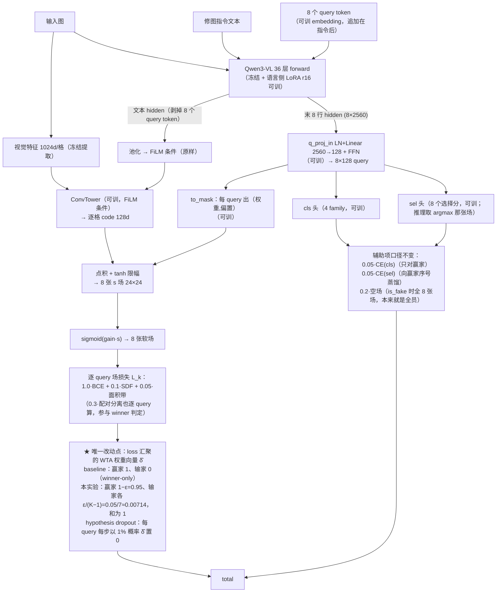

# 实验：Relaxed WTA（输家也拿小份梯度）

EPR-015 · 2026-08-13 · baseline = ST_LANG 形态（EPR-011 ln 线，在跑）
指标/数据/优化器沿用实验总表口径，不在此重复：面积匹配 top-k soft-IoU，V_where local 400，
normal-only，配对 Wilcoxon；train split，local，exclude_low，n=42,752；AdamW 3e-4、1200 步、
mb4 有效 32。

## 1. 任务

本实验测试：把 UNIQ 头的硬 WTA loss 汇聚（赢家权重 1、7 个输家权重 0）换成 MHP 的松弛
Kronecker delta 加权（赢家 1−ε，输家各 ε/(K−1)），并加 1% hypothesis dropout，其余结构与
loss 口径全部不动。

- 参考工作：Learning in an Uncertain World: Representing Ambiguity Through Multiple
  Hypotheses（MHP），arXiv 1612.00197，ICCV 2017。核实方式：已打开 ar5iv 全文
  （https://ar5iv.labs.arxiv.org/html/1612.00197）逐条核对——
  - §3.3 Eq.12 松弛 Kronecker delta：δ̂(a) = 1−ε（a 为最近假设时），否则 ε/(M−1)；原文
    「A label y is now assigned to the closest hypothesis f^k_θ(x) with a weight of 1−ε and
    with ε/(M−1) to all remaining hypotheses.」
  - §4 开头原话：「In all experiments we set the association relaxation to ε=0.05.」
  - §3.3 原话：「Additionally, we adapt the concept from [33] to drop out full predictions
    with some low probability (1% in our experiments).」
  - 官方代码：再次检索并打开作者 GitHub（github.com/chrirupp，5 个仓库逐一看过）均无
    MHP 实现——**无官方代码，全部数字来自论文原文**，无 repo 路径可引。
- 测试什么方法：松弛 WTA 的梯度分配——每步除 argmin 赢家外，K−1 个输家场也按
  ε/(K−1) 拿到小份拟合梯度；外加论文同节的 hypothesis dropout（1% 概率整体丢弃某个
  query 的该步预测权重）。
- 解决什么问题：现行 uniq_wta_loss（q3vl/whereb/amort/losses.py:359-360）是硬 WTA，
  每步只有 1/8 的 query 拿到 mask 梯度，输家场从不被拉向 GT；已测事实（EPR-011
  RESULT.md）：best-of-K 0.8072 > sel 头选出 0.757，选择缺口 0.05 量级——sel 头在推理时
  要从这些从未被修剪过的输家场里排序。

## 2. 模型图（baseline 代码不动）

结构完全不变；★ 是唯一改动点：loss 汇聚处的 WTA 权重向量 δ̂。

## 3. 改动怎么接进来（逐条可确认）

| 项 | 内容 |
|---|---|
| 改哪里 | 只改 losses.py 的 uniq_wta_loss 一处汇聚。三段式：(a) 现状——losses.py:355-358 逐 query 算 per[k]（amort_sample_loss，含 bce/sdf/area/sep），losses.py:359 `j = int(torch.stack([p.total.detach() for p in per]).argmin())` 判赢家，losses.py:360 `total = per[j].total` winner-only 回传；(b) 改成——:360 那一行换成 δ̂ 加权求和：`fit_k = per[k].total − w.sep * per[k].terms["sep"]`，`total = Σ_k δ̂_k · fit_k + w.sep * per[j].terms["sep"]`；(c) δ̂ 定义——δ̂_j = 1−ε，未被 dropout 的输家各 ε/(M_kept−1)，被 dropout 的 query δ̂=0（MHP Eq.12）。winner 判定行（:359）一字不动，仍是 detach 后对含 sep 的完整 per[k].total 取 argmin。 |
| 松弛作用域（逐 loss 项） | 现行代码里**参与 winner 判定**的项 = per[k].total 内的 bce、sdf、area、sep（curv/mono 本臂权重 0，losses.py:291-294 直接为 zero）；**在 winner 之外全局算**的项 = fake（is_fake 分支）、uniq_cls、uniq_sel（eik 在 trainer.py:115-118,153-155 全局加，本臂权重 0）。松弛只作用于 **{bce 1.0, sdf 0.1, area 0.05}**——这三项是 MHP Eq.12 中逐假设拟合损失 L(f^k_θ(x), y) 的对应物。保持原口径的：**sep 0.3**——逐 query 算、仍参与 winner 判定，但只回传赢家那份（上行公式里单列 `w.sep*per[j].terms["sep"]`）；理由：sep 是对 partner GT 的对比 hinge，MHP Eq.12 的 L 没有对应物，把它塞进 δ̂ 是 NOVEL 扩展而非参考机制，且会给全部 8 张场加同向的「拉向 gt_own / 推离 gt_partner」力（张力见下行）。**fake 0.2**——is_fake 分支（losses.py:346-353）本来就对全部 K 张场收 empty_mask，无 winner 概念，不动。**uniq_cls 0.05**（losses.py:365-369，只对 cls_logits[j] 收 CE；family 标签属于样本不属于 query）与 **uniq_sel 0.05**（losses.py:370-373，向赢家序号 j 蒸馏）——均不动。 |
| hypothesis dropout 的实现 | 在 uniq_wta_loss 内、构造 δ̂ 处（losses.py:359 与 :360 之间）：仅当 hdrop>0 时抽 `keep = torch.rand(n_q) >= hdrop`（每 query 独立，p=0.01），winner 在 kept 集合内取 argmin，dropped query 的 δ̂ 置 0，ε 质量摊给 kept 输家（ε/(M_kept−1)），全部被 drop 时该样本回退为不 dropout。论文 §3.3 只写「以低概率（1%）丢弃整个预测」；「winner 在 kept 内取 / ε 按 kept 摊 / 全 drop 回退」三个细节论文未给，为本实现决定，标 **NOVEL**。hdrop=0 时不执行任何 RNG 抽取——RNG 流与 baseline 逐位一致（N1 教训：多消耗一次 RNG 会静默改变后续随机序列）。 |
| 与配对分离 loss、sel 蒸馏的张力记录 | (1) 配对分离：ε>0 使 8 张场同时收到指向同一 gt_own 的拟合梯度，方向上与「多假设各自分工」相反，也与 0.3·sep 维持的场间区分构成张力；MHP 的处理是把 ε 压小（全实验统一 0.05）；本提案把 sep 排除在 δ̂ 之外并把「sep 0.3 vs 0.15 × ε」组合网格列进消融，专门量这对张力。(2) sel 蒸馏：输家拿梯度后，逐步 argmin 的赢家序号分布可能随训练改变，sel 头的蒸馏目标随之变化；现有逐步 stats `uniq_winner`、`uniq_sel_correct`（losses.py:374-377，落 steps.jsonl）原样保留，出板时按此核对赢家分布与 sel 命中率随步数的变化；headline 口径不变（仍取 sel 头选出的场）。 |
| 不变 | 全部模块结构（LangQueryTokVLM / UniQ4Head / ConvTower / to_mask / cls / sel，uniq4.py、uniq4b.py、uniq.py 零改动）；K=8；winner 判定行（losses.py:359）；is_fake 分支；loss 权重 1.0/0.1/0.05/0.2/0.3/0.05/0.05；优化器与步数（AdamW 3e-4、1200 步、mb4 有效 32）；数据与切分；评测与 headline 口径；trainer.py 调用点（trainer.py:139-145）签名不变——新超参经 LossWeights 传入，compute_micro_batch / AmortTrainer 零改动；非 UNIQ 臂（amort_sample_loss 路径）零影响。 |
| 等价性（ε=0 且 dropout=0 逐 bit 等于 baseline） | 实现上在 uniq_wta_loss 内短路：`if w.uniq_eps == 0.0 and w.uniq_hdrop == 0.0:` 走**原样保留的** `total = per[j].total` 行（不走加权求和表达式——`fit_j + w.sep*sep_j` 这种「减了再加」浮点上不逐 bit 等于 per[j].total，短路分支才保证逐 bit），且不消耗任何 RNG。验证方法：同 seed、同数据、`--max-steps 20` 跑 A（旧代码）/B（新代码 ε=0, hdrop=0）两遍，diff steps.jsonl 逐行相同（loss/grad_norm/uniq_winner 字段逐字节一致），checkpoint state_dict 逐张量 bitwise 相等；该 A/B 记录随交付落盘。 |
| 新增超参与默认值 | LossWeights（losses.py:60-94 dataclass）新增两个字段：`uniq_eps: float = 0.0`、`uniq_hdrop: float = 0.0`（默认 0 = 现行硬 WTA，旧命令行为逐字不变）。实验臂取 ε=0.05（论文 §4：「In all experiments we set the association relaxation to ε=0.05」）、hdrop=0.01（论文 §3.3：「1% in our experiments」）。to_dict() 自动带出新字段 → setup()["loss_weights"]（trainer.py:252）与 checkpoint 存档（trainer.py:438）自动落盘，无需另接线。 |
| 入口旗标 | run_amort_arm.py 的 UNIQ 旗标区（run_amort_arm.py:188-201）新增 `--uniq-eps`（默认 0.0）与 `--uniq-hdrop`（默认 0.0），在 `args.arm == "UNIQ"` 分支（run_amort_arm.py:449-451）随 uniq_cls/uniq_sel 一并写进 LossWeights kwargs。run_uniq4b_arm.py（q3vl/whereb/scripts/run_uniq4b_arm.py:59-61）把 rest 透传给 run_amort_arm，**不需要改**。复现命令与 baseline 的逐字差异 = 在 ST_LANG 命令末尾追加 `--uniq-eps 0.05 --uniq-hdrop 0.01`。 |

## 4. 结果（做完补，消融行全填这里）

（口径：headline = 面积匹配 top-k IoU，generated + normal-only，n=224，配对 Wilcoxon。
本臂 mb16；mb 同档基线 = ST_LANG_MB16 对照臂 0.73737；mb4 原基线 = 0.74550。）

baseline（ST_LANG mb16 对照臂）：top-k IoU = 0.73737
+Relaxed WTA（ε=0.05，dropout 1%，mb16）：0.74824；vs mb16 对照 Δ均值 +0.0045 / Δ中位 +0.0084（p=0.0292）；vs mb4 基线 Δ均值 −0.0047（p=0.5255）
机制列（每臂随板出）：best-of-K = 0.76023；sel_is_best = 0.089

消融行（超参 / 去掉子件，不另立提案）：
- ε ∈ {0.01, 0.05, 0.1}：___
- ± hypothesis dropout 1%：___
- 配对分离权重 0.3 vs 0.15（与 ε 的组合网格）：___
- 松弛只作用于 BCE 项 vs 作用于全部 mask 拟合项（BCE+SDF+面积带）：___
