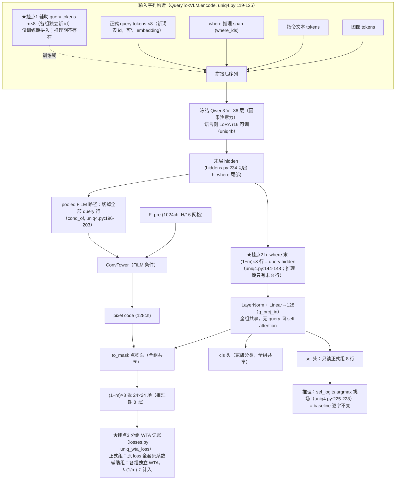

# 实验：训练期一对多辅助 query 组

EPR-016 · 2026-08-13 · baseline = ST_LANG 形态（uniq4b.LangQueryTokVLM + UniQ4Head，K=8，语言侧 LoRA r16）

## 1. 任务

本实验测试：训练期在 8 个正式 query token 之外多拼 m 组 × 8 个辅助 query token（头部参数全组共享、
每组独立做 WTA、辅助 loss 乘 λ 记账），推理期辅助 token 一个不拼、选择协议逐字不变，是否改变
V_where local 400 normal-only 的面积匹配 top-k soft-IoU（配对 Wilcoxon）。

- 参考工作（均已打开原始来源核实，2026-08-13）：
  - **DETRs with Hybrid Matching (H-DETR)**，arXiv 2207.13080，repo `HDETR/H-Deformable-DETR`：
    - `engine.py` 函数 `train_hybrid`：GT `boxes`/`labels` 各 `repeat(k_one2many)` 后对 one2many 输出跑
      **同一个 criterion**，每项 loss 乘 `lambda_one2many` 并以 `_one2many` 后缀并入总 loss dict——
      两支 loss 系数集完全相同；
    - `models/deformable_detr.py`：`num_queries = num_queries_one2one + num_queries_one2many`
      （300+1500 并联进同一 decoder）；`self_attn_mask` 从全 False 起，
      `[num_one2one:, 0:num_one2one] = True` 屏蔽 one2many→one2one，另一行按仓库原样为
      `[0:num_one2one, num_queries_one2many:] = True`（列索引写的是 `num_queries_one2many`，照实记录）；
      输出按位置切两套：`outputs_class[:, 0:num_one2one]` 与 `outputs_class[:, num_one2one:]`；
    - 发布 config `configs/two_stage/deformable-detr-hybrid-branch/36eps/
      r50_hybrid_branch_lambda1_group6_t1500_deformable_detr_plus_iterative_bbox_refinement_plus_plus_two_stage.sh`
      （及同目录 r101/dp0_mqs_lft 变体）：文件名即记 **λ=1.0、k=6、t=1500**。
  - **Group DETR: Fast DETR Training with Group-Wise One-to-Many Assignment**，arXiv 2207.13085
    （ICCV 2023）：公式 6——K 组 query 分别过 **参数共享** 的 decoder/predictor；公式 7——
    `L = (1/K)·Σ_{k=1..K} L_k`，**组间取平均**，组内各自一对一匹配；主实验 K=11，图 9 显示 mAP
    随组数增加在 **K=11 饱和**；推理「only needs one group of queries without any architecture
    modification」。官方仓库 `Atten4Vis/GroupDETR` **已核实为空仓**（仅 README，TODO 写着
    "Release code and models"），代码细节以 H-DETR 仓库为准，数字以论文原文为准。
- 测试什么方法：训练期扩充 query 供给（每个 GT 的正样本从 1 个变成 1+m 个），推理期原样丢弃辅助组
  ——H-DETR/Group DETR 的一对多训练思路移植到本头的分组 WTA 记账上。
- 解决什么问题（已测事实）：本头 WTA 每步只有 1/8 query 拿到 mask 梯度（`losses.py`
  `uniq_wta_loss`：K 个候选场只取 argmin 者的 total，其余 7 个无 mask 梯度）；直接把 K 从 8 加到 16
  （推理选择协议同变）实测配对 **−0.0076**，即单纯加 K 不解决正样本稀疏。

## 2. 模型图（baseline 代码不动）

★ = 改动挂点。**推理路径 = baseline 逐字不变**：eval 走 `@torch.no_grad`（`evaluate.py:92`）+
`model.eval()`，`encode` 落入 no-grad 分支只追加正式 8 个 query id，辅助 token 根本不进序列；
sel 头只读正式组 8 行，argmax 挑场协议与 baseline 完全一致。

## 3. 改动怎么接进来（逐条可确认）

| 项 | 内容 |
|---|---|
| 改哪里（三段式） | **(a) 输入构造**：`q3vl/whereb/amort/uniq4.py:63-68` 词表扩容处 `resize_token_embeddings(base_vocab + K)` 改为 `base_vocab + K + m*K`，辅助 id = 正式 id 之后的 m×K 个新 id（各组独立 id）；`uniq4.py:119-125` `QueryTokVLM.encode` 现把 `where_ids` 改写为 `+ q_ids`——沿用同一处已有的门控谓词（`uniq4.py:122` `self._grad_on and torch.is_grad_enabled()`）：grad 分支追加 `q_ids + aux_ids`，no-grad 分支（eval 板、训练前 norm 拟合回路）只追加 `q_ids`；`hiddens.py:170`（prompt_ids+where_ids 拼序列）与 `hiddens.py:234`（`h_where = hidden[i, n_p:n_p+n_w]`）不改一字，h_where 自动把 (1+m)×8 行 query hidden 带在尾部。**(b) hidden 切分**：`uniq4.py:144-148` `UniQ4Head._query_states` 现取 `h_where[0, -self.n_queries:, :]`——改为训练态取末 `(1+m)*K` 行、eval 态取末 `K` 行（按 `self.training` 分支）；`uniq4.py:141-142` q_proj_in 与 `uniq.py:114-118` q_norm/ffn 逐行独立作用，全组共享零新参；`uniq4.py:150-165` forward 中 `to_mask`/`cls` 作用于全部行，`s_all` reshape 为 (行数, gh, gw)，`sel` 只作用于**正式组前 K 行**（`sel_logits` 形状保持 (K,)）；`uniq4.py:196-203` `cond_of` 的泄漏防护现切掉末 `self._k` 行——训练态改切 `(1+m)*K` 行；`uniq4.py:217-219` 的 h_where 行数断言按当前态所需行数改写。**(c) 分组 WTA**：`losses.py:312-378` `uniq_wta_loss` 现对 K 行取 per-query loss（355-358）→ argmin winner（359）→ 只回传 winner total；改为把 s_all 按组切成 1+m 段各跑同一套 WTA，`total = total_正式 + λ·(1/m)·Σ_g total_辅助g`（组内 winner 机制、五项 loss 及系数与正式组逐字相同——H-DETR train_hybrid 两支同一 criterion 同一系数集）；调用点 `trainer.py:133-145` 传入组数；各辅助项以 `L_*_aux` 键进 terms，`losses.py:381-409` aggregate 自动落每步日志。 |
| 组间隔离怎么实现 | H-DETR 需要 `self_attn_mask` 是因为 one2one/one2many query 在 decoder self-attention 里会互读。本头 query 间**没有任何 self-attention**（`_query_states` 里 q_proj_in/ffn 均逐行独立），头侧无需任何屏蔽。VLM 内部是**因果注意力**：辅助 token 排在正式 token 之后，正式 8 个 token 的 hidden 与后面拼不拼辅助 token **逐位相同**（`hiddens.py` 模块 docstring 第 2 点已实证同一性质：where 位 hidden 与其后是否跟 `<color>` 段 bit-identical）——即正式组免费获得单向隔离，不需要也无法做 H-DETR 那种双向屏蔽；辅助组能读到正式组（因果方向允许），这一点与 H-DETR 的双向隔离不同，照实记录。loss 侧隔离 = 分组独立 WTA + 辅助组不进 sel-CE。 |
| 辅助组吃哪些 loss 项（逐项） | BCE ✔、SDF ✔、面积带 ✔、配对分离(sep) ✔——组内 winner 五项全套原系数（H-DETR 两支同 criterion 同系数）；空场(fake) ✔ 默认进（is_fake 时与正式组同理**全组所有 query 一起充**，`losses.py:347-353` 的既有口径；带/不带为消融行）；cls-CE ✔（各辅助组 winner 的家族 CE，`w.uniq_cls` 同值）；**sel-CE ✘**——sel 头是推理选择协议的一部分，只在正式组 8 行上定义与训练（辅助行推理期不存在，不可被选）。 |
| 成本记账方法 | 序列每前向加长 m×8 个 token（36 层注意力/MLP 全过）。测法（不拍数字）：同数据同 seed 同 mb4/有效 32，m=0 与 m∈{1,2,5} 各跑 **20 个优化步**；step time 取 `steps.jsonl` 相邻行 `elapsed_s` 差分的中位数（`trainer.py:385-388` 已逐步落）；峰值显存 = 起跑前 `torch.cuda.reset_peak_memory_stats()`、20 步后记 `torch.cuda.max_memory_allocated()`；平均序列长度直接读 `EncodeResult.meta["seq_len"]`（`hiddens.py:237` 已带）一并落盘。梯度检查点已开（`uniq4.py:108-113`），激活显存增长为亚线性，以实测为准。 |
| 不变（推理路径逐字不变的证据） | ① eval 全链 `@torch.no_grad`（`evaluate.py:92-99` `evaluate_context` + `model.eval()`）→ `AmortModelV4.train(False)` 把 `_grad_on` 置 False（`uniq4.py:190-194`）→ `encode` 走 no-grad 分支（`uniq4.py:124-125`），辅助 id 不拼入，eval 输入 token 序列与 baseline 逐 id 相同；② 推理前向里 query 行数 = 8，`sel_logits` 只来自正式 8 行，`uniq4.py:225-228` 的 argmax 挑场代码不改一字；③ 训练前 norm 拟合回路同走 no-grad 分支（`uniq4.py:117` canary 注释所指路径），norm 常量在 baseline 序列上拟合；④ 唯一 checkpoint 级差异 = 新增 `aux_embed` 参数与 embedding 表多出的 m×8 冻结行——辅助 embedding 作为**独立 Parameter**（不并进 `q_embed`），baseline 的全部 state_dict 键与形状原样保留，m=0 消费方可直接加载。 |
| 初始化（辅助 token embedding） | 与正式组同配方（`uniq4.py:70-78`）：base 词表 embedding 均值 + 0.02·randn，CPU Generator 固定种子（正式组 20260812；辅助组用独立固定种子，落 run_config），bf16 存储（用户裁定无 fp32 master copy）；写入走既有 forward hook（`uniq4.py:80-88`，`ids >= base_vocab` 分支改为索引 [q_embed; aux_embed] 拼接表）；embedding 表 resize 出的行本体保持 `requires_grad_(False)`（`uniq4.py:66-67`）。 |
| 新增超参与默认值 | `m`（辅助组数）默认 **2**（消融 {1,2,5}；Group DETR 图 9 到 K=11 饱和、H-DETR k=6，均为检测任务口径，此处 m 为本任务待测量）；`λ` 默认 **1.0**——出处 = H-DETR 发布 config 文件名 `r50_hybrid_branch_lambda1_group6_t1500_...sh` 的 `lambda1`；辅助项组间取平均（`λ·(1/m)·Σ`）——出处 = Group DETR 公式 7 的 1/K 平均（使 m 消融不改变辅助 loss 总量级，标注 NOVEL 组合：λ 取 H-DETR、组间平均取 Group DETR）；辅助 embedding 种子 1 个。其余训练超参（AdamW 3e-4、1200 步、mb4 有效 32、loss 系数 1.0/0.1/0.05/0.2(p=0.15)/0.3/0.05/0.05）与 baseline 完全相同。 |
| 入口旗标 | `q3vl/whereb/scripts/run_uniq4b_arm.py:17-20` 现有 `--uniq4-qtok/--uniq4-lora-r` 处新增 `--uniq4-aux-groups`（=m，默认 0）与 `--uniq4-aux-lambda`（默认 1.0）；**m=0 = baseline**：不扩词表、不建 aux_embed、encode 两分支同为只追加 q_ids、loss 走原单组路径，代码路径与 ST_LANG 逐字一致；m、λ、辅助种子写进 `config/uniq4b_setup.json`（`run_uniq4b_arm.py:44-55` 既有 sha256 冻结记录处）。 |

## 4. 结果（做完补，消融行全填这里）

baseline（ST_LANG，在跑）：top-k IoU = ___

+辅助 query 组（m=2, λ=1.0）：指标变动是 ___（配对 p = ___）

消融行：

| 消融 | top-k IoU | Δ vs baseline | 配对 p |
|---|---|---|---|
| 辅助组数 m=1 | ___ | ___ | ___ |
| 辅助组数 m=2（主行） | ___ | ___ | ___ |
| 辅助组数 m=5 | ___ | ___ | ___ |
| λ=0.5（m 同主行） | ___ | ___ | ___ |
| λ=1.0（=主行） | ___ | ___ | ___ |
| 辅助组带空场 loss（=默认） | ___ | ___ | ___ |
| 辅助组不带空场 loss | ___ | ___ | ___ |
| 辅助组 token 独立 embedding（=默认） | ___ | ___ | ___ |
| 辅助组 token 与正式组共享 embedding | ___ | ___ | ___ |

成本记账（20 步测法，做完补）：

| 臂 | step time 中位数 (s) | 峰值显存 (GiB) | 平均 seq_len |
|---|---|---|---|
| m=0 | ___ | ___ | ___ |
| m=1 | ___ | ___ | ___ |
| m=2 | ___ | ___ | ___ |
| m=5 | ___ | ___ | ___ |
