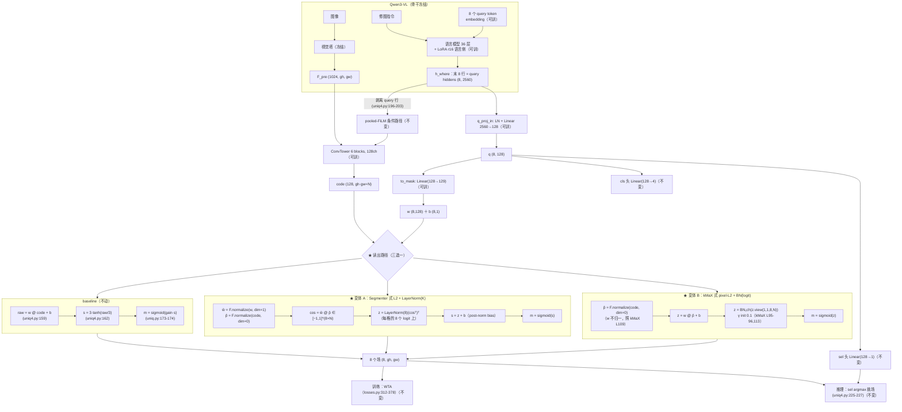

# 实验：读出归一化（EPR-017 · 余弦点积 + 跨 query logit 归一，替手工温度）

状态：提案（待 grill + 用户定稿）。baseline = ST_LANG 形态（EPR-011 UNIQ 头 + uniq4b
语言侧 LoRA 臂），baseline 代码不动，改动以新文件 + 旗标接入。

## 1. 任务

本实验测试：把 UNIQ 读出路径的裸点积 `raw = w·code + b` 换成 L2 归一化点积 +
跨 query logit 归一化（可学习 γ/β 接管现有 tanh+gain 两级手工温度），其余一切不动。

- 参考工作（均已于 2026-08-13 打开原仓库文件核实，行号取自 master/main HEAD）：
  - **Segmenter: Transformer for Semantic Segmentation**（arXiv:2105.05633，
    rstrudel/segmenter `segm/model/decoder.py`）：`scale = d_model ** -0.5`（L57）；
    `proj_patch` / `proj_classes` 均为 `scale * randn(d_model, d_model)`（L67-68）；
    `mask_norm = nn.LayerNorm(n_cls)`（L71）；patch / class 特征各自
    `x / x.norm(dim=-1, keepdim=True)` 双侧 L2（L95-96）；点积
    `masks = patches @ cls_seg_feat.transpose(1, 2)`（L98）；跨类归一
    `masks = self.mask_norm(masks)`（L99，作用在每个位置的 n_cls 个 logit 上）。
  - **kMaX-DeepLab: k-means Mask Transformer**（arXiv:2207.04044，
    bytedance/kmax-deeplab
    `kmax_deeplab/modeling/transformer_decoder/kmax_transformer_decoder.py`；该文件
    L81 注释自链 google-research/deeplab2 `model/kmax_deeplab.py#L32`）：pixel 侧
    `pixel_space_normalized_feature = F.normalize(pixel_space_feature, p=2, dim=1)`
    （L105，仅 pixel 单侧）；mask kernel 走 `ConvBN`（含 BN，L91、L109，query 侧不做
    L2）；点积 `mask_logits = einsum('bchw,bcn->bnhw', ...)`（L110-111）；logit 归一
    `_pixel_space_mask_batch_norm = get_norm('syncbn', channels=1)`、
    `nn.init.constant_(weight, 0.1)`（L95-96），施加于
    `mask_logits.unsqueeze(dim=1)` 即单通道全局 BN（L113）——可学习 γ/β 充当全局
    温度/偏移；训练期 k-means 硬分配 `clustering_result.max(1).detach()` → scatter
    one-hot（L198-204，消融行 5 的来源）。
- 测试什么方法：query 权重 w 与逐格 code 双侧（或仅 pixel 侧）L2 归一化后点积，
  再对读出 logit 做跨 query 归一化——变体 A 为 Segmenter 式 `LayerNorm(K)`（每格
  的 K=8 个 logit 上），变体 B 为 kMaX 式单通道 BN（全体 logit 上）。
- 解决什么问题：当前读出是裸点积 `raw = wb[:, :-1] @ pix + wb[:, -1:]`
  （`q3vl/whereb/amort/uniq4.py:159`），无归一化；幅值由两级手工机制管：
  `s = S_SCALE·tanh(raw/S_SCALE)`（uniq4.py:162，`S_SCALE = 3.0`，
  `q3vl/where/config.py:54`）+ `m = sigmoid(gain·s)`（`q3vl/whereb/amort/uniq.py:173-174`，
  gain 为可学习标量，init 2.0，uniq.py:97,126）。同构的「query 权重 × 逐格特征」
  点积 mask 读出，在 Segmenter 里配了双侧 L2 + 跨类 LayerNorm（decoder.py L95-99），
  在 kMaX 里配了 pixel 侧 L2 + logit 单通道 BN（L105、L113）。
- **口径警告（硬性）**：本任务输出是 24×24 逐格独立的连续软衰减场，loss 主项是
  BCE_soft（`q3vl/whereb/amort/losses.py:124-134`），判据是面积匹配 top-k soft-IoU；
  与 Segmenter 的跨类 softmax CE（每格恰属一类的竞争语义）不同构。本提案**只搬
  归一化部件，不引入 softmax 竞争**；跨 query 硬竞争单列消融行 5。

## 2. 模型图（baseline 代码不动）

★ = 本次改动挂点：`to_mask` 输出 → `sigmoid` 之间的读出路径。三条读出分支中，
baseline 分支保持逐字不动；变体 A/B 由旗标选择（见 §3 入口行）。

## 3. 改动怎么接进来（逐条可确认）

| 项 | 内容 |
|---|---|
| 改哪里（三段式） | 增加了读出归一化模块，在 `UniQ4Head.forward` 的 to_mask 输出与 sigmoid 之间（活代码路径：`q3vl/whereb/amort/uniq4.py:158-163` 的 raw→tanh 段 + `q3vl/whereb/amort/uniq.py:173-174` 的 `mask_of`；父类同构段 uniq.py:165-167 不在活路径上）添加了「L2 归一化点积 + 跨 query logit 归一（LN(K) 或单通道 BN）」，新增 loss = 无。实现为新文件 `uniq5.py`（继承 `UniQ4Head`，仅覆写 `forward` 读出段与 `mask_of`）+ 薄 wrapper `run_uniq5_arm.py`（照 `uniq4b.py:20-45` / `run_uniq4b_arm.py:31-39` 的縫合模式），baseline 文件零改动。 |
| 变体 A 确切公式（逐步张量操作） | 输入：`q (8,128)`；`wb = to_mask(q) → (8,129)`；`w = wb[:, :128]`，`b = wb[:, 128:]`（uniq4.py:158-159 原拆分不变）。① `ŵ = F.normalize(w, p=2, dim=1)`，`p̂ = F.normalize(pix, p=2, dim=0)`（pix 为 `(128, N)` 的逐格 code，uniq4.py:153；对应 Segmenter decoder.py L95-96 双侧 L2）；② `cos = ŵ @ p̂ → (8, N)`，每元素 ∈ [−1,1]（对应 L98）；③ `z = mask_norm(cos.transpose(0,1)).transpose(0,1)`，`mask_norm = nn.LayerNorm(8)`——在每个格子的 8 个 query logit 上归一（对应 L71+L99）；④ `s = z + b`（post-norm bias，默认档，见 bias 行）；⑤ `s_all = s.reshape(8, gh, gw)`；`mask_of(s) = sigmoid(s)`（tanh 与 gain 默认移除，见 tanh+gain 行）。 |
| 变体 B 确切公式（逐步张量操作） | ①′ `p̂ = F.normalize(pix, p=2, dim=0)`（仅 pixel 侧，对应 kMaX L105；w 不做 L2，对应 kMaX L109 kernel 侧无 normalize）；②′ `z = w @ p̂ + b`（pre-norm bias，默认档）；③′ `z = bn(z.reshape(1, 1, 8, N)).reshape(8, N)`，`bn = nn.BatchNorm2d(1)`，`γ` init 0.1、`β` init 0（对应 kMaX L95-96 单通道 syncbn + L113 unsqueeze 施加；单卡逐样本前向下用普通 BN，统计跨 8×N 个 logit，见空场行）；④′ `s_all = z.reshape(8, gh, gw)`；`mask_of(s) = sigmoid(s)`。**标注 deviation**：kMaX 的 kernel 路径本身还带一层 ConvBN（L91、L109），本变体不复制（`to_mask` 保持单 Linear），此为对源实现的删减，记录在案。 |
| bias b 在余弦化后的处理 | baseline 的 b 是逐 query 标量加到全场（uniq4.py:159 的 `+ wb[:, -1:]`）。余弦化剥离了 w 的幅值，b 的相对量级不再与 `‖w‖` 同步；且 LN(K) 对每格减跨 query 均值——b 若加在 LN 之前，其跨 query 共同分量被减均值消掉，剩余偏差再被逐格 σ（数据依赖）重缩放，b 不再是干净的逐 query 全局偏移。处理：三档旗标 `--uniq-readout-bias {pre,post,off}`；变体 A 默认 `post`（LN 之后加，保留逐 query 全局偏移自由度，空场行依赖它），变体 B 默认 `pre`（BN 只减全局标量，b 的逐 query 结构保留）；`pre`/`off` 进消融行 4。 |
| 空场样本在跨 query 归一化下的机制分析与处理方案 | 训练里空场来自 fake 样本（p=0.15 外来指令），empty-mask 项同时压**全部 8 个 query** 的场（losses.py:341-353，`terms["fake"] = empty_mask(mask_of(s_all))`）。**LayerNorm(8) 对全零/近零输入的数学行为**（`nn.LayerNorm` ε=1e-5）：(a) 每格 8 个 logit 完全相等（如全零）时分子 `v−μ` 恰为 0，ε 防除零，输出恒等于 β——不会重新拉开，8 个场退化为常数场 β_k；(b) 8 个 logit 近似相等、跨 query 标准差 σ 满足 σ² ≫ ε（σ ≳ 3.2e-3）时，差异被重缩放到单位方差（放大 1/σ 倍）——「一致压低」的构型其残余差异被放大回来；(c) 恒等式：每格 `Σ_k (o_k − β_k)/γ_k = 0`，即 LN 的数据依赖部分在任何输入下都不能让 8 个 logit 在同一格同时为负——空场输出只能由输入无关参数（β_k 与 post-norm 的 b_k）承载，而这组参数同样平移每个真实样本的场。**BN 变体的对照事实**：BN 减的是全局标量 μ/σ（跨 8×N），逐格跨 query 差异原样保留；全零输入 → 常数场 `(0−μ)/σ·γ + β`，可整体为负——联合压低自由度保留在数据路径里。BN 的 train/eval 差异：本仓库训练是逐样本前向（trainer.py:99-111 循环），训练期 batch 统计 = 单样本 8×N logit 的统计，eval 用 running 统计（momentum 取 PyTorch 默认 0.1）。**处理方案**：① 变体 A 强制 `bias=post`，把空场自由度交给 b_k（输入无关、逐 query）；② 训练日志新增两列逐步落盘：fake 样本 `pred_area`（已有，losses.py:351-353）与逐格跨 query logit std 的中位数（LN 放大行为的直接观测量）；③ BN 变体把 running mean/var 随 checkpoint 落盘；④ 消融行 4 的 `off` 档给出「无 b 时空场全靠 β」的对照数字。 |
| tanh+gain 去留 | 变体默认**移除两级**：tanh 限幅（uniq4.py:162）与可学习 gain（uniq.py:97,126、mask_of uniq.py:173-174），温度/幅度由归一化层的可学习参数接管——变体 A 为逐 query 的 γ_k/β_k（LN elementwise affine），变体 B 为全局 γ/β（kMaX 的显式设计，γ init 0.1 即初始全局温度 0.1，L95-96）。旗标 `--uniq-readout-keep-tanh-gain` 可把两级叠加回归一化之后（消融行 3）。`mask_of` 是全路径唯一的 sigmoid 咽喉——训练 WTA（trainer.py:141 传 `model.geo.mask_of`）、推理挑场（uniq4.py:227,234）、评测（evaluate.py:196）都经它，故在 head 内覆写一处即全路径一致。 |
| 不变 | `to_mask` Linear(128→129) 的形状与挂点（uniq.py:121）；ConvTower（heads.py:149-174）；pooled-FiLM 条件路径与 query 行剥离（uniq4.py:196-203）；`q_proj_in`/FFN（uniq4.py:141-148）；8 query token + 语言侧 LoRA r16（uniq4b.py:20-43，run_uniq4b_arm.py:18-20）；WTA 与全部 loss 权重（1.0 BCE + 0.1 SDF + 0.05 面积带(τ=0.15) + 0.2 空场(p=0.15) + 0.3 配对分离(margin 0.05) + 0.05 CE(cls) + 0.05 CE(sel)；losses.py:64-91、run_amort_arm.py:198-200,450-451）；cls/sel 头（uniq.py:124-125）与 sel-argmax 推理（uniq4.py:225-227）；AdamW lr 3e-4、wd 0.01、warmup 3%、cosine（trainer.py:43-46,227-239、run_amort_arm.py:89）；1200 步、有效批 32（run_amort_arm.py:88,92；本臂微批 4，任务卡口径）；数据（train split，local，exclude_low，n=42,752）与评测（V_where local 400，normal-only，面积匹配 top-k soft-IoU，配对 Wilcoxon）；checkpoint 选择纪律（quick eval 硬门 + headline 选优，永不 val loss，trainer.py:442-456）。 |
| step0 非等价的如实标注与对照方案 | **无零初始化等价路径，如实标注。** baseline 靠 `to_mask` 零初始化（uniq.py:122-123）得 step0 全场 raw=0 → mask 恒 0.5。余弦化下零初始化不可保留：`F.normalize` 在零向量处按 `x / max(‖x‖, 1e-12)` 计算，零点邻域的雅可比量级 ~1/eps = 1e12，首步梯度被该点主导；故 `to_mask` 权重改按 Segmenter 的 `d^-0.5` 尺度随机初始化（`128^-0.5 · randn`，decoder.py L57,67-68 的读出投影初始化），bias 列仍置零。由此 step0 输出是非常数场（随机方向的余弦经 LN/BN 重缩放），与 baseline 的 0.5 常数场不同；且 LN/BN 改变整个训练过程的 logit 幅值分布，不存在「初始化成 baseline 等价函数」的构造。**对照方案**：变体臂与 baseline 同数据、同切分、同种子、同 1200 步（步数匹配，U4）从头训练，headline 为同一 V_where local 400 normal-only 集上的配对 Wilcoxon；不做任何热启动/续训比较。 |
| 新增超参与默认值（来源行号） | ① `--uniq-readout-norm {none, ln, bn}`，默认 `none`；`ln` = `nn.LayerNorm(8)`，γ=1、β=0（Segmenter decoder.py L71 用 PyTorch 默认 affine 初始化）；`bn` = 单通道 BN，γ init 0.1、β=0（kMaX L95-96），momentum 0.1（PyTorch 默认；kMaX 用 syncbn，本臂单卡逐样本前向，如实记录差异）。② `--uniq-readout-l2 {none, both, pixel}`，默认 `none`；`both` 对应 Segmenter L95-96，`pixel` 对应 kMaX L105。③ `--uniq-readout-bias {pre, post, off}`，默认 `pre`（= baseline 位置，uniq4.py:159）；变体 A 用 `post`。④ `--uniq-readout-keep-tanh-gain`（bool，默认关；开 = tanh(uniq4.py:162)+gain(uniq.py:126) 叠加在归一化后）。⑤ `to_mask` 权重初始化 scale `128^-0.5`（Segmenter decoder.py L57,67-68），仅在 `--uniq-readout-l2 ≠ none` 时启用，否则维持零初始化。⑥ 消融行 5 专用：`--uniq-readout-hard-wta`（bool，默认关；开 = 训练期对每格 8 个 logit 取 argmax、detach 后 scatter one-hot 作竞争信号，kMaX L198-204 的搬运，仅训练期，推理不动）。 |
| 入口旗标（全关 = baseline） | 全部新旗标取默认（`--uniq-readout-norm none --uniq-readout-l2 none --uniq-readout-bias pre`，其余关）时，`run_uniq5_arm.py` 的前向与 ST_LANG baseline（`run_uniq4b_arm.py --uniq4-qtok 8 --uniq4-lora --uniq4-lora-r 16 --arm UNIQ ...`）逐字一致（零初始化保持、tanh+gain 保持、无归一化分支）。变体 A = baseline 命令 + `--uniq-readout-l2 both --uniq-readout-norm ln --uniq-readout-bias post`；变体 B = baseline 命令 + `--uniq-readout-l2 pixel --uniq-readout-norm bn --uniq-readout-bias pre`。wrapper 照 uniq4b 模式把旗标与两个文件的 sha256 写进 `config/`（run_uniq4b_arm.py:45-55 的落盘形制）。 |

## 4. 结果（做完补，消融行全填这里）

指标口径：V_where local 400，normal-only，面积匹配 top-k soft-IoU，配对 Wilcoxon；
checkpoint 按既有纪律选（quick eval 硬门 + headline 选优）。

- baseline（ST_LANG，在跑）：top-k soft-IoU = ___
- +读出归一化（变体 A：L2+LN(K)）：指标变动是 ___（配对 p = ___）
- +读出归一化（变体 B：pixel L2+BN(logit)）：指标变动是 ___（配对 p = ___）

消融行（不另立提案，全填这里）：

| 消融行 | 结果 |
|---|---|
| 1. 仅双侧 L2（无跨 query 归一） | 指标变动是 ___（配对 p = ___） |
| 2. L2+LayerNorm(K)（Segmenter 式）vs L2+BatchNorm(logit)（kMaX 式）直接配对 | Δ = ___（配对 p = ___） |
| 3. 去掉 tanh+gain vs 保留（与新归一化叠加） | 指标变动是 ___（配对 p = ___） |
| 4. 点积 bias b：pre / post / off | ___ / ___ / ___ |
| 5. 跨 query 硬 argmax 竞争（kMaX one-hot 分配，仅训练期）on/off | 指标变动是 ___（配对 p = ___） |

（fake 样本 pred_area、逐格跨 query logit std 两列监控数字随各行一并落盘。）
