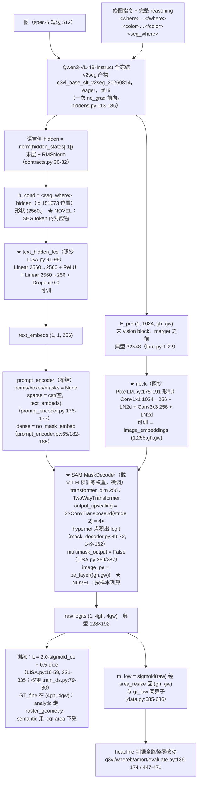

# 实验：把 LISA 的 [SEG]-token → SAM mask decoder 分割头忠实移植到冻结 Qwen3-VL 特征上（EPR-018）

状态：提案（待 grill-me + 用户定稿）。

本提案的模型、loss、优化器**忠实移植自 LISA**（arXiv 2308.00692，dvlab-research/LISA）。凡是能照抄
的一律照抄原文与原仓库 config，行号见文末来源清单；凡是本仓库条件下无法照抄的，逐条标 **NOVEL**
并给理由。外部行号以 2026-08-14 当日 curl 打开的 GitHub main 分支 raw 文件为准，本仓库行号以当前
工作区为准、写作当日逐一打开确认。

**红线解除注记**：本战役原有「IoU 与 dice 永不作 mask 优化目标」纪律（`q3vl/whereb/amort/losses.py:9-11`）
按用户 2026-08-14 指示对本批提案解除，dice 按参考工作原权重忠实保留。

---

## 1. 任务

一句话：**冻结的 Qwen3-VL 出特征，LISA 的分割头原样搬过来，看 headline 数字是多少。**

### 1.1 参考工作与被移植的机制

LISA 的机制是三步：

1. 语言模型吐一个 `[SEG]` token，取它**最后一层的 hidden**（`model/LISA.py:187` 定位、`:249-250` 取值）；
2. 这个 hidden 过一个两层 MLP（`text_hidden_fcs`，`model/LISA.py:91-98`）投影到 256 维；
3. 投影结果**直接 cat 进 SAM prompt encoder 的 sparse_embeddings**（`model/segment_anything/modeling/prompt_encoder.py:176-177`），
   和 SAM 预训练的 mask decoder 一起出像素 logit（`model/LISA.py:269-288`）。

训什么冻什么（LISA 原文）：SAM 整体 `requires_grad=False`，`train_mask_decoder=True`（默认，`train_ds.py:96`）
时**只**放开 `mask_decoder`（`model/LISA.py:82-87`）；`text_hidden_fcs` 可训（`model/LISA.py:99-101`）；
prompt encoder 不训；CLIP 视觉塔与 mm_projector 冻结（`train_ds.py:167-170`）；LLM 上 LoRA r=8 α=16
dropout 0.05，target `q_proj,v_proj`（`train_ds.py:40, 81-83`），并把 `lm_head`/`embed_tokens` 也放开
（`train_ds.py:219-228`）。

### 1.2 本仓库条件下的三处 NOVEL 映射（无法照搬处）

- **图像编码器换掉**：LISA 用 SAM ViT-H 图像编码器（1024×1024 输入 → 256×64×64，`model/LISA.py:81`，
  `train_ds.py:38`）。本仓库的图像侧是冻结的 Qwen3-VL：`F_pre = (gh, gw, 1024)`，取最后一个 vision block、
  merger 之前（`q3vl/where/fpre.py:1-22`，`q3vl/whereb/amort/data.py:296` 的 `feat` 字段形状 `(1,1024,gh,gw)`），
  典型 32×48。中间用 **PixelLM 的 `image_feature_neck`** 形制（`model/PixelLM.py:175-191`：
  `Conv1x1(embed→256, bias=False) + LayerNorm2d + Conv3x3(256, pad 1, bias=False) + LayerNorm2d`）
  把 1024 通道映到 decoder 期望的 256 通道。理由：本战役约束 Qwen3-VL 冻结，不引入第二个 632M 的图像塔；
  「VLM 自家 grid 特征 + neck 直接充当 SAM image embedding」有 PixelLM 的先例（`model/PixelLM.py:244-249`
  的 `vision_tower_for_mask=True` 分支）。
- **conditioning 向量换掉**：LISA 的 `[SEG]` 是新增词表 token，靠自回归生成出来。本臂的对应物 =
  base SFT v2seg 的受监督 special token **`<seg_where>`（id 151673）位置上的 hidden**，单条
  `(2560,)` 向量进 `text_hidden_fcs`；层与归一化按 `q3vl/whereb/contracts.py:30-32`
  （`SEGMENT_HIDDEN_LAYER = -1` / `SEGMENT_HIDDEN_FINAL_NORM = True`），口径全文见 §1.2.1。
  2560 恰好就是 LISA `text_hidden_fcs` 的 `in_dim = config.hidden_size`，
  投影层可以一字不改地照抄。
- **文本自回归 CE 去掉**：LISA 总 loss 含 `ce_loss_weight · model_output.loss`（`model/LISA.py:307-308`）。
  本臂没有文本生成分支、基座按战役约束冻结，该项无对应物，**NOVEL 去除**；同理去掉只为该项服务的
  LoRA / `lm_head` / `embed_tokens` 三处可训（`train_ds.py:219-228`）。

### 1.2.1 语言条件读出

语言条件向量 `h_cond` = base SFT v2seg 模型输出中 **`<seg_where>` token 位置的 hidden**：

```
h_cond = norm(hidden_states[-1]) 在 <seg_where> token 位置上的那一行，形状 (2560,)
```

层与归一化按 `q3vl/whereb/contracts.py:30-32`（`SEGMENT_HIDDEN_LAYER = -1` /
`SEGMENT_HIDDEN_FINAL_NORM = True`），维度 2560。

**v2seg 规格**：assistant 输出形制为
`<where>…</where><color>…</color><seg_where><seg_color><|im_end|>\n`，两个 seg token **受监督**；
`<seg_where>` id 151673、`<seg_color>` id 151674，两者追加在词表末尾
（`q3vl/train/constants.py:22-23`；四个 tag token `<where>` 151669 / `</where>` 151670 /
`<color>` 151671 / `</color>` 151672 见 `q3vl/train/constants.py:11-14`，字面 id 记在
`q3vl/whereb/attnread.py:62-64`）；产物目录 `/home/bc/data/runs/q3vl_base_sft_v2seg_20260814`。

**接入要点**：
(a) 前向序列喂到 `<seg_where>`——序列 = prompt + 完整 reasoning（where span + color span +
`<seg_where>`），读出切片取 `<seg_where>` 所在的**单个位置**（下标在拼接时记录，不做搜索式定位）。
挂点：序列构造 `q3vl/whereb/hiddens.py:170`、切片 `q3vl/whereb/hiddens.py:234`。仍是一次
`no_grad` 前向同时出 `F_pre` 与语言侧 hidden。
(b) 基座 = v2seg 产物 `/home/bc/data/runs/q3vl_base_sft_v2seg_20260814`；genwhere 生成缓存按该
checkpoint 重生成（缓存 schema 逐条记 `checkpoint` 字段，`q3vl/whereb/gencontext.py:122, 168`）。

**依赖项（写死）**：v2seg 训练产物落盘 **且** genwhere 缓存按 v2seg 重生成完成之前，**本臂不可
开跑**（2026-08-14 当日 `ls /home/bc/data/runs/` 未见 `q3vl_base_sft_v2seg_20260814`）。
v2seg 未就绪时的起跑档见 §3.4 待决策 D-7。

**本臂的条件消费点**：`text_hidden_fcs`（照抄 `model/LISA.py:91-98`）的输入 = `h_cond`
（单条 2560 维向量），下游 `text_embeds (1,1,256)` 与 `sparse_embeddings` 的注入形制照抄。

**`<seg_color>`**：归 what 分支使用，**本批六臂不消费**（见 §3.4 待决策 D-8）。

读出方式的其余档（`<where>` span 池化、`</where>` / `</color>` / `<|im_end|>` 位置、可学习
query token、K > 1 的多 seg token）在 §4 读出方式消融组统一出数。

### 1.3 数据

- 训练：`sft2seg-20260804` 的 train 切分，`render_mode == "local"`，`exclude_low=True`，**n = 42752**
  （`q3vl/whereb/scripts/run_amort_arm.py:343-355`）。切分为 sha1 规则族，无 ad-hoc。
- 评测：V_where local **400**；出板时再按 `sha1(sample_id) % 2` 拆 selection / holdout 两半
  （`q3vl/whereb/scripts/run_amort_arm.py:624-636`）。
- 像素 GT 两个来源：
  - `.cgt.png`：短边 1024 的 soft alpha，`load()` 返回 `(h,w)` float32 ∈[0,1]（`q3vl/where/maskdata.py:180-190`）；
  - `raster_geometry(mask_type, geometry, height, width)`：任意分辨率解析渲染，
    radial/band = `circulargradient`、linear = `gradient`，末尾 `alpha*alpha*(3-2*alpha)` smoothstep
    （`dataset_build/src/construct/canonical_masks.py:90-123`）。semantic 族无解析参数，只能走 `.cgt`。
  - 只读镜像 `maskviews`（短边 512 `.maskhi.png`）在 `/mnt/nfs-ro/bc/data/datasets/where_a-20260805/maskviews/`。

### 1.4 指标对照行（**不是**本实验的结构 baseline，只是同一判据下的既有数字）

| 行 | normal-only headline top-k IoU |
|---|---|
| ST_LANG（失败基线，其部件不进本方案） | 0.77390 |
| M0 | 0.79095 |
| center prior | 0.5088 |
| 随机地板 | 0.2582 |
| oracle | 0.9737 |
| 用户可用线 | 0.85 |

### 1.5 判据（冻结不换，与既有各臂逐字相同）

V_where local 400，**normal-only** headline（`.contexts.*.headline_normal_only`，
`q3vl/whereb/amort/evaluate.py:447-471`，n = 224），**面积匹配 top-k IoU 中位数**
（`q3vl/whereb/amort/evaluate.py:139-143` 的 `gt_area_k` + `topk_mask` + `hard_iou`）。三列套装缺一不可：
soft-IoU（minmax 形式，`q3vl/whereb/metrics.py:88-105`）+ grid 级边界 F1（`tol_cells = 1`，
`q3vl/whereb/metrics.py:209-241`，`q3vl/whereb/config.py:265`）+ 中心先验列
（`q3vl/whereb/metrics.py:147-166`，配对 Δ 在 `q3vl/whereb/amort/evaluate.py:408-411`）。形状类指标并排
随机 top-k 地板 `a/(2−a)`。配对 sign-flip permutation 1e4（`q3vl/whereb/metrics.py:244-290`）。
按 family（radial/band/linear/semantic）与 area 分层报（`q3vl/whereb/amort/evaluate.py:419-444`）。
M3 guard 列 `corr_center_minus_corr_gt`（`q3vl/whereb/amort/evaluate.py:413-416`）每板必带。
**AUC 不产出。** 与对照行 1200 步步数匹配（`q3vl/whereb/scripts/run_amort_arm.py:110`）。
运行时断言：`assert_criteria_ran`（`q3vl/whereb/amort/evaluate.py:313-345`，调用点
`q3vl/whereb/amort/evaluate.py:620-621`）。

---

## 2. 模型图



冻结/可训清单（对照 LISA 逐项）：

| 模块 | LISA | 本臂 |
|---|---|---|
| 图像编码器 | SAM ViT-H，冻结（LISA.py:82-83） | Qwen3-VL 视觉塔，冻结（`hiddens.py` 内 `requires_grad_(False)` + `no_grad`） |
| 语言模型 | LoRA r=8 + lm_head + embed_tokens 可训（train_ds.py:219-228） | 全冻结（**NOVEL**，见 §1.2） |
| `text_hidden_fcs` | 可训（LISA.py:99-101） | 可训（照抄） |
| neck | 无（SAM 编码器自带） | 可训（**NOVEL**，PixelLM 形制） |
| `prompt_encoder` | 冻结（LISA.py:82-83 之后只放开 mask_decoder） | 冻结（照抄） |
| `mask_decoder` | 可训（LISA.py:85-87） | 可训（照抄） |

---

## 3. 改动怎么接进来

| 项 | 内容 |
|---|---|
| **改哪里** | ① **新增一个 arm `"SEGSAM"`**：`ARMS`（`q3vl/whereb/amort/model.py:30`，现为 `("P1","P3prime","SHAPE3","UNIQ")`）加一项，`AmortModel.__init__` 的 arm 分派（`q3vl/whereb/amort/model.py:118-134`）加一个分支构造新头。②&nbsp;**新文件 `q3vl/whereb/amort/segsam.py`**，内含 `SegSamHead(nn.Module)`：`text_hidden_fcs`（照抄 LISA.py:91-98）+ `neck`（照抄 PixelLM.py:175-191 形制，入通道 1024）+ vendored 的 SAM `PromptEncoder`/`MaskDecoder`/`TwoWayTransformer`/`LayerNorm2d`/`MLP`/`PositionEmbeddingRandom`（结构照抄 `model/segment_anything/modeling/*`）。头的输入接口 = `forward_geo` 已有的 `feat`（F_pre，`q3vl/whereb/amort/model.py:225`）与语言侧 hidden 形参（`q3vl/whereb/amort/model.py:236`，本臂只取其中 `<seg_where>` 位置的一行 = `h_cond`，见 §1.2.1 与本表 ⑩）；`extra`（sim/center/geom 通道）与 `cond`（CondEncoder 池化向量）**不进本头**——LISA 的 image embedding 只来自图像编码器，无额外通道。启动命令带 `--no-sim-field`（`run_amort_arm.py:121`）、`--no-film`（`:123`）、`--no-semantic-head`（`:205`），并在构造后对 `self.cond` 调 `requires_grad_(False)`，可训参数清单落盘核对。③&nbsp;**四族走同一个 decoder**：`--no-semantic-head` 使 `model.sem is None`，路由判断（`q3vl/whereb/amort/trainer.py:101`、`q3vl/whereb/amort/evaluate.py:124`）自然把 semantic 族也送进 `forward_geo`——与 LISA 单头吃全部数据集同款。④&nbsp;**`image_pe` 按样本现算**：不能用 `get_dense_pe()`（它固定返回 `image_embedding_size`，`prompt_encoder.py:67-76`），改为 `pe_layer((gh, gw))`，`pe_layer` 的高斯矩阵是 buffer、冻结。⑤&nbsp;**预训练权重载入**：从 SAM ViT-H checkpoint 里只取 `mask_decoder.*` 与 `prompt_encoder.*` 两个子树（约 4M 参数），632M 的 `image_encoder.*` 不载；载入的 key 清单与 missing/unexpected 清单落盘进 run config。⑥&nbsp;**新增 fine GT**：`AmortSampleInputs`（`q3vl/whereb/amort/data.py:293-314`）增字段 `gt_fine (4gh, 4gw)`，构造点挂在 `gt_low` 旁（`q3vl/whereb/amort/data.py:684-686`）。dispatch 按 family 写死并断言：radial/band/linear 且 `ConstructGeomStore` 命中 → `raster_geometry(mask_type, geometry, 4gh, 4gw)`（`dataset_build/src/construct/canonical_masks.py:90-123`）；semantic 族或 geometry miss → `mask_target_hi()`（`.cgt`，`q3vl/where/maskdata.py:180-190`）以 `area_resize` 降到 `(4gh, 4gw)`。两路来源计数进 per-step stat；全零 GT 计数并排除、打印，禁静默。⑦&nbsp;**loss 分支**：`q3vl/whereb/amort/losses.py` 增 `lisa_mask_loss(logits_fine, gt_fine, num_masks)`，`sigmoid_ce_loss` 与 `dice_loss` 逐字照抄 `model/LISA.py:42-59` 与 `:16-38`（含 `scale=1000`、`eps=1e-6`、`flatten(1,2)`、`/(num_masks+1e-8)`）；`q3vl/whereb/amort/trainer.py:113-169` 的分派处加一条 `if "segsam" in out:` 分支，走这个 loss，**不**走五项场 loss。⑧&nbsp;**m_low 降采样**：头在 `out["m_low"]` 里返回 `area_resize(sigmoid(raw), (gh, gw))`，与 GT 侧 `gt_low = area_resize(gt_hi, (gh,gw))`（`q3vl/whereb/amort/data.py:685-686`）**同一个算子**；形状断言（`q3vl/whereb/amort/trainer.py:119-123`）与 headline 判据全路径（`q3vl/whereb/amort/evaluate.py:136-174`）零改动。`out["segsam"] = {"logits_fine": ...}` 供 loss 与诊断列消费。⑨&nbsp;**运行时断言接线**：`assert_criteria_ran` 的 `required` 表（`q3vl/whereb/amort/evaluate.py:331`，现为 `{"SHAPE3": ["shape_residual"], "UNIQ": ["uniq_best"]}`）加 `"SEGSAM": ["segsam_fine"]`，`segsam_fine` 为 fine 网格诊断列（soft-IoU + top-k IoU + 边界 F1 tol=4 + 同支持的中心先验与随机地板），聚合挂 `criteria_columns`（`q3vl/whereb/amort/evaluate.py:558-573` 同款写法）；`steps.jsonl` 首行必须已带 `L_bce_lisa` 与 `L_dice_lisa` 两列，缺列拒绝出板。⑩&nbsp;**读出接缝（§1.2.1）**：`q3vl/whereb/hiddens.py:170` 的序列构造喂完整 reasoning 到 `<seg_where>` 为止、`q3vl/whereb/hiddens.py:234` 的切片取 `<seg_where>` 单个位置，两处由一个读出旗标统一分派；基座路径与 genwhere 缓存取 v2seg 档。旗标（默认值 = 主臂口径）：`--readout seg_where`（choices：`seg_where` / `where_span_pool` / `where_close` / `color_close` / `im_end` / `qtok`，对应 §4 读出方式消融组的 ⑨-1 / ⑥ / ⑦-a / ⑦-b / ⑧）、`--readout-qtok K`（默认 0；`--readout qtok` 时取 1 / 4 / 8，机制照 `q3vl/whereb/amort/uniq4.py:76`/`:79`/`:113`/`:148`）、`--readout-nseg K`（默认 1；K>1 需对应 SFT 变体重训，占位）。旗标值、`<seg_where>` 的解析下标、基座 checkpoint 路径与 genwhere 缓存的 `checkpoint` 字段一并写进 `run_setup.json` 并随源码 sha256 冻结；启动时断言「缓存的 `checkpoint` 字段 == 本次基座路径」，不一致即拒绝开训。 |
| **不变（明确列出没动的部分）** | 基座：Qwen3-VL-4B-Instruct，eager attention，bf16，全冻结，一次 `no_grad` 前向出 `F_pre` + 语言侧 hidden（`q3vl/whereb/hiddens.py:113-186`）；基座 checkpoint 与 genwhere 缓存取 v2seg 档、`hiddens.py` 的序列构造与切片按 §1.2.1 的读出口径接线。数据管线：`sft2seg-20260804`、`render_mode=="local"`、`exclude_low=True`、train n=42752、V_where local 400、sha1 规则族切分与 selection/holdout 半分（`q3vl/whereb/scripts/run_amort_arm.py:343-355, 624-636`）；`winner_confidence=="low"` 不进主训。评测：headline 判据全套、三负控制（shuffled / fixed_phrase / foreign）、swap、antonym（`q3vl/whereb/amort/evaluate.py:145-174, 452-472`）、area/family 分层（`:419-444`）、`corr_center_minus_corr_gt` guard 列（`:413-416`）、normal-only 口径（`:447-471`）——**一行不动**。checkpoint 选择 = quick-eval 硬门 + headline 选优，永不读 val loss（`q3vl/whereb/scripts/run_amort_arm.py:812-841`）。红线核对：AUC 不产出；无逐图 min-max（`area_resize` 与 `PositionEmbeddingRandom` 都是与图像内容无关的确定性映射）；IoU 不作优化目标（dice 按用户 2026-08-14 指示忠实移植，见文首红线解除注记）。 |
| **初始化（step0 状态）** | 按参考工作：`text_hidden_fcs` 与 `neck` 用 PyTorch 默认随机初始化——LISA 的 `text_hidden_fcs` 无零初始化（`model/LISA.py:91-98`），PixelLM 的 neck 同（`model/PixelLM.py:175-191`）；`mask_decoder` 与 `prompt_encoder` 载 SAM ViT-H 预训练权重。**不要求与任何既有臂 step0 逐位等价**：本臂是独立结构，零初始化会直接删掉「预训练分割先验」这个实验变量。step0 的 board 数字（预训练 decoder 吃随机 neck 特征 + 随机投影 prompt 的输出）随 run 落盘作背景列，**不作任何判据**。可训参数总量与逐模块清单在 step0 打印并落 run config。<br>**预注册违规（DELTA §5.6）诚实登记**：本臂的 `image_pe` 走 SAM 的 `PositionEmbeddingRandom`（把归一化 `(x, y)` 过一个随机高斯投影再取 `sin/cos`，`prompt_encoder.py:189` 类定义、`:171-205` 前向），这是**坐标通道 / 位置编码**，DELTA §5.6 明文禁止（禁令与 E3 的实测记在 `q3vl/whereb/amort/heads.py:15-21`：corr(输出, 中心先验) 0.64 > corr(输出, GT) 0.47）。照 EPR-011 Fourier 臂先例，本臂以**预注册违规**处理、不因该禁令改结构；执行线 = 每板必带的 `corr_center_minus_corr_gt` 列（`q3vl/whereb/amort/evaluate.py:413-416` / `:465-467`）：该列 > 0 即中心先验病复活，§5.6 立、本结构死。 |
| **忠实移植的超参（原文数值 + 出处，逐项）** | 见下方 §3.1 / §3.2 两张表。 |
| **入口（新旗标 / arm 名；不选 = 不影响现有任何臂）** | 新 wrapper `q3vl/whereb/scripts/run_segsam_arm.py`，委托 `run_amort_arm --arm SEGSAM --no-sim-field --no-film --no-semantic-head`。旗标：`--segsam-weights PATH`（SAM ViT-H checkpoint，只取 `mask_decoder.*`/`prompt_encoder.*` 子树）；`--segsam-scratch`（消融：不载预训练权重）；`--segsam-frozen-decoder`（消融：`train_mask_decoder=False`，只训 neck + `text_hidden_fcs`）；`--segsam-dice-weight FLOAT`（默认 0.5 = LISA 原值；消融 0.0）；`--segsam-gt {raster,png}`（默认 raster；png = 全四族统一 `.cgt` area 下采）；`--segsam-sup {native,cgt}`（默认 native = decoder 原生 4×(gh,gw)；cgt = 插值到 `.cgt` 原生分辨率后算 loss，对应 LISA 的 `postprocess_masks` 链）。所有旗标进 `run_setup.json` 并随源码 sha256 冻结记录。**现有 P1 / P3prime / SHAPE3 / UNIQ 四个臂的构图、loss、判据不受本改动影响**（新 arm 名 + 新文件，旧分支一行不改）。显存粗估：新增可训参数约 4M（decoder）+ 0.3M（neck）+ 7M（`text_hidden_fcs` 的 2560×2560）+ 优化器态 < 0.2GB；fine 场 128×192 fp32 约 0.1MB/样本。两卡 65GB 共存规则内，同卡禁双训练臂照旧。 |

### 3.1 忠实移植：结构与 loss

| 项 | LISA 原文数值 / 形式 | 出处 | 本臂 |
|---|---|---|---|
| 图像编码器 | SAM ViT-H，`image_size` 1024，输出 256×64×64，全冻结 | `model/LISA.py:81-83`；`train_ds.py:38` | **NOVEL 替换**：冻结 Qwen3-VL `F_pre (1,1024,gh,gw)` + neck |
| neck | LISA 无；PixelLM `image_feature_neck` = `Conv2d(embed,256,k=1,bias=False)` + `LayerNorm2d(256)` + `Conv2d(256,256,k=3,pad=1,bias=False)` + `LayerNorm2d(256)` | `PixelLM.py:175-191` | 形制照抄，`embed = 1024`（**NOVEL** 适配：PixelLM 从 VLM hidden 降到 256，本臂从 F_pre 的 1024 降到 256） |
| prompt 向量来源 | 词表新增 `[SEG]`，`seg_token_idx` 定位，取 `output_hidden_states[-1]` 对应行 | `model/LISA.py:140, 187, 249-250` | **NOVEL 映射**：`h_cond` = base SFT v2seg 的受监督 special token `<seg_where>`（id 151673）位置上的末层 + RMSNorm hidden，`(2560,)`（§1.2.1） |
| 投影头 `text_hidden_fcs` | `Linear(in_dim, in_dim)` → `ReLU(inplace=True)` → `Linear(in_dim, out_dim)` → `Dropout(0.0)`；`in_dim = config.hidden_size`，`out_dim = 256` | `model/LISA.py:91-98`；`train_ds.py:92`（`--out_dim` 默认 256） | **逐字照抄**，`in_dim = 2560`（Qwen3-VL-4B hidden，恰与 `h_cond` 的 2560 一致） |
| prompt 注入 | `points=None, boxes=None, masks=None, text_embeds=pred[i].unsqueeze(1)`；`sparse_embeddings = cat([sparse_embeddings, text_embeds], dim=1)` | `model/LISA.py:275-280`；`prompt_encoder.py:176-177` | 照抄 |
| dense prompt | `no_mask_embed.weight.reshape(1,-1,1,1).expand(...)` | `prompt_encoder.py:65, 182-185` | 照抄，冻结 |
| `image_pe` | `get_dense_pe()` = `pe_layer(image_embedding_size).unsqueeze(0)`，固定 64×64；`pe_layer = PositionEmbeddingRandom(embed_dim // 2)` | `prompt_encoder.py:43, 67-76`；类定义 `:189` | **NOVEL**：改为 `pe_layer((gh, gw))` 按样本现算。理由：本臂 image embedding 是 (gh,gw)，固定 64×64 的 PE 尺寸对不上 |
| mask decoder | `transformer_dim=256`，`num_multimask_outputs=3`，`iou_head_depth=3`，`iou_head_hidden_dim=256`；`iou_token` + `num_mask_tokens = 4`；`output_upscaling` = `ConvTranspose2d(256,64,k=2,s=2)` + `LayerNorm2d` + `ConvTranspose2d(64,32,k=2,s=2)`（共 4×）；hypernet MLP 与上采特征点积出 mask | `mask_decoder.py:20-25, 49-72, 149-162` | **结构照抄** |
| `multimask_output` | `False` | `model/LISA.py:269, 287` | 照抄（用单 mask token） |
| 输出后处理 | `postprocess_masks`：interpolate 到 1024 → 裁 padding → interpolate 到原图尺寸 | `model/LISA.py:289-293` | **NOVEL 去除**（主臂）：该链只为撤销 SAM 的 1024 方形 letterbox，本臂 F_pre 已在图像自身长宽比网格上，无 padding 可裁；监督落在 decoder 原生 4×(gh,gw)。`--segsam-sup cgt` 消融行给回插值到 `.cgt` 原生分辨率的写法 |
| 文本 CE | `ce_loss_weight = 1.0`；`ce_loss = model_output.loss * ce_loss_weight` | `train_ds.py:78`；`model/LISA.py:307-308` | **NOVEL 去除**：本臂无文本生成分支，基座冻结 |
| mask BCE | `bce_loss_weight = 2.0`；`sigmoid_ce_loss` = `F.binary_cross_entropy_with_logits(inputs, targets, reduction="none").flatten(1,2).mean(1).sum() / (num_masks + 1e-8)` | `train_ds.py:80`；`model/LISA.py:42-59, 321-324, 331` | **逐字照抄，权重 2.0** |
| mask dice | `dice_loss_weight = 0.5`；`inputs = inputs.sigmoid()`，`flatten(1,2)`，`scale=1000`，`eps=1e-6`，`numerator = 2*(inputs/scale*targets).sum(-1)`，`denominator = (inputs/scale).sum(-1) + (targets/scale).sum(-1)`，`loss = 1 - (numerator+eps)/(denominator+eps)`，`loss.sum()/(num_masks+1e-8)` | `train_ds.py:79`；`model/LISA.py:16-38, 325-328, 332` | **逐字照抄，权重 0.5**（按用户 2026-08-14 指示忠实移植，本战役 dice 红线对本提案解除） |
| 总 loss | `loss = ce_loss + bce_loss_weight·bce + dice_loss_weight·dice` | `model/LISA.py:331-335` | `L = 2.0·sigmoid_ce + 0.5·dice`（去掉 ce 项） |
| `num_masks` | 每样本 GT mask 数累加，`mask_*_loss / (num_masks + 1e-8)` | `model/LISA.py:329-332` | 本臂每样本 1 个 mask → `num_masks` = 该 micro-batch 的样本数 |
| GT 值域 | 二值：`masks_list[0].int()`，预测阈值 `pred_masks[0] > 0` | `train_ds.py:551-552` | **NOVEL 注记**：本仓库 GT 是 soft alpha ∈[0,1]（`.cgt` 与 `raster_geometry` 的 smoothstep）。两个 loss 的公式对 soft target 均有定义，**公式一字不改**，只是 target 不再是 {0,1} |
| `is_fake` 样本（foreign 指令，`fake_prob = 0.15`，`q3vl/whereb/amort/losses.py:74`；掷签 `q3vl/whereb/amort/trainer.py:383`） | LISA 无对应物：其训练集每条样本都有非空 GT mask | — | **NOVEL 政策（写死）**：本臂不建现役七项栈，故不走 `empty_mask` 项（`q3vl/whereb/amort/losses.py:286-291`）；改为把 fake 样本的 `gt_fine` 目标张量**整张置零**，再照本臂原式算 `2.0·sigmoid_ce + 0.5·dice`，**不排除、不加权、不改公式**。数值行为写明：(i) `sigmoid_ce` 在 target ≡ 0 上就是 `−log(1 − sigmoid(z))` 的格均值，有定义，梯度把 logit 推向负；(ii) `dice`（`model/LISA.py:16-38`）在 target ≡ 0 上 `numerator = 2·Σ(p/1000 · 0) = 0`、`denominator = Σ(p/1000) + 0`，`loss = 1 − (0 + 1e-6)/(Σ(p/1000) + 1e-6)`，随预测前景面积从 0（预测全空 → loss ≈ 0）单调升到 ≈ 1（预测大面积），`eps = 1e-6` 同时出现在分子分母，**不产生 NaN、不产生除零**。fake 样本数与其 `L_bce_lisa` / `L_dice_lisa` 分开计数落 `steps.jsonl`。备选（把 fake 样本排除出本臂 loss 并计数）见 D-6 |
| gIoU / cIoU 评测 | `giou`（union==0 记 1.0）、`ciou`（累计交/累计并），阈值 `logit > 0` | `train_ds.py:552-566, 573-575` | **不采**：本战役判据冻结为面积匹配 top-k IoU + 三列套装，不换 |

### 3.2 忠实移植：优化器

| 项 | LISA 原文数值 | 出处 | 本臂 |
|---|---|---|---|
| 优化器类型 | `AdamW`（DeepSpeed `ds_config["optimizer"]["type"]`） | `train_ds.py:271-278` | 照抄 `torch.optim.AdamW` |
| 学习率 | `3e-4`（`--lr` 默认 0.0003） | `train_ds.py:77, 274` | 照抄 `3e-4`（与仓库 `AmortTrainConfig.learning_rate` 默认同值，`q3vl/whereb/amort/trainer.py:43`） |
| weight decay | `0.0` | `train_ds.py:275` | 照抄 `0.0`。**注**：仓库默认是 `0.01`（`q3vl/whereb/amort/trainer.py:44`），本臂需 per-arm 覆盖（见 D-3） |
| betas | `(0.9, 0.95)`（`--beta1 0.9`，`--beta2 0.95`） | `train_ds.py:85-86, 276` | 照抄 `(0.9, 0.95)`。**注**：torch AdamW 默认 `(0.9, 0.999)`，本臂需显式传（见 D-3） |
| scheduler | DeepSpeed `WarmupDecayLR`：`warmup_min_lr 0` → `warmup_max_lr = lr` 线性升，`warmup_num_steps 100`，之后线性降到 0；`total_num_steps = epochs(10) × steps_per_epoch(500) = 5000` | `train_ds.py:279-287, 65-66` | **NOVEL 等比缩放到 1200 步档**：warmup = 1200 × (100 / 5000) = **24 步**线性升 3e-4，其后 1176 步**线性**降到 0。**注**：仓库 `make_scheduler`（`q3vl/where/calibrate.py:126-145`）目前 `kind != "cosine"` 时 warmup 后恒定，需要加一档 `"linear"`（见 D-4） |
| grad clip | `1.0` | `train_ds.py:295` | 照抄（仓库 `max_grad_norm` 默认已是 1.0，`q3vl/whereb/amort/trainer.py:47`） |
| 精度 | `bf16`（`--precision` 默认 "bf16"） | `train_ds.py:31-37`；`ds_config` `:292-294` | 照抄 bf16 |
| 有效 batch | `batch_size 2/卡 × grad_accumulation_steps 10 × world_size` | `train_ds.py:69-73, 236-239` | **NOVEL**：本臂 32（仓库 `--effective-batch` 默认，`q3vl/whereb/scripts/run_amort_arm.py:106`）。理由：与本批全部对照行的步数/批量档对齐 |
| 总步数 | 5000 | `train_ds.py:65-66` | **NOVEL**：1200（本批统一步数档，`q3vl/whereb/scripts/run_amort_arm.py:110`） |
| ZeRO | stage 2，`contiguous_gradients` / `overlap_comm` / `reduce_scatter` | `train_ds.py:296-301` | **NOVEL 去除**：单卡单进程 |
| LoRA | r=8，α=16，dropout 0.05，target `q_proj,v_proj` | `train_ds.py:40, 81-83, 206-214` | **NOVEL 去除**（见 §1.2） |
| 随机种子 | 原文未在 `train_ds.py` 暴露 seed 参数 | — | 本臂 20260810（仓库默认，`q3vl/whereb/amort/trainer.py:55`） |

### 3.3 SAM 预训练权重

- 官方 checkpoint URL（`facebookresearch/segment-anything` README 当日打开核实，L112）：
  `https://dl.fbaipublicfiles.com/segment_anything/sam_vit_h_4b8939.pth`（`default` / `vit_h`）。
- LISA 通过 `--vision_pretrained`（默认占位串 `PATH_TO_SAM_ViT-H`，`train_ds.py:91`）传给
  `build_sam_vit_h`（`model/LISA.py:13, 81`）。
- 本臂只从该 checkpoint 取 `mask_decoder.*` 与 `prompt_encoder.*` 两个子树，`image_encoder.*` 不载。
- **本地缓存路径待用户确认**：当前盘上 `/home/bc/data` 与 `/home/bc/VeraRetouch` 下无 `sam_vit*.pth`，
  Python 环境亦未安装 `segment_anything` 包（见 D-2）。

### 3.4 待决策注记（保守默认已选，不静默拍板）

| 编号 | 事项 | 保守默认 | 需用户拍板的点 |
|---|---|---|---|
| D-1 | `[SEG]` 的对应物 | `h_cond` = `<seg_where>`（id 151673）位置的 hidden（§1.2.1） | 该 token 由 base SFT v2seg 自带、受监督，头这一侧不需要 `resize_token_embeddings`，与「基座冻结」不冲突。其余读出档（span 池化 / `</where>` / `</color>` / `<\|im_end\|>` / 可学习 query / K>1 的多 seg token）全部落在 §4 读出方式消融组 ⑥–⑨，本行不另设备选 |
| D-2 | SAM ViT-H checkpoint 落盘位置 | 无默认 | 盘上现无该文件、环境无 `segment_anything` 包；下载到哪个目录、是否允许联网下载，请指定 |
| D-3 | `weight_decay=0.0` 与 `betas=(0.9,0.95)` | 按 LISA 原值 | 仓库 `AmortTrainConfig`（`q3vl/whereb/amort/trainer.py:42-55`）无 `betas` 字段、`weight_decay` 默认 0.01；需要加两个 per-arm 覆盖入口 |
| D-4 | linear-decay scheduler | 按 LISA 原形（线性降到 0） | `q3vl/where/calibrate.py:126-145` 现只有 cosine 与「warmup 后恒定」两档，需要加 `"linear"` |
| D-5 | 监督分辨率 | decoder 原生 4×(gh,gw) | LISA 原文在 `postprocess_masks` 后的原图分辨率上算 loss；已作为 `--segsam-sup cgt` 消融行列出，若用户要求以「原文分辨率」为主臂则两者对调 |
| D-6 | `is_fake`（foreign 指令）样本在本臂 loss 下的处理 | 目标张量置全零、照 `2.0·sigmoid_ce + 0.5·dice` 原式算，不排除（见 §3.1 末行） | LISA 从不在空 GT 上训，无原文可抄。备选一：把 fake 样本整体排除出本臂 loss 并计数（等价于本臂只在真 GT 上训，foreign 负控制退化为纯评测项）；备选二：保留现役 `empty_mask` 项（`q3vl/whereb/amort/losses.py:286-291`）作为第三项与移植 loss 并存（会往忠实配方里加一项非 LISA 的 loss）。三者都不是 LISA 原文，请拍板 |
| D-7 | v2seg 依赖排期：v2seg 未就绪时本臂怎么起跑 | **等 v2seg**——v2seg 产物落盘 + genwhere 缓存按 v2seg 重生成两件都完成后才开跑本臂（§1.2.1「依赖项」已写死） | 备选 = 先用 §4 读出方式消融组 ⑦-c 的 `<\|im_end\|>` 档（checkpoint-4976 + 现有 genwhere 缓存即可跑）起跑一条，v2seg 到位后再按同 seed / 同步数跑主臂的 `<seg_where>` 档。代价：两条跑的基座不同，两者之间不构成逐样本配对比较，各自只能与本臂自己的对照列比。是否先起跑、以及先跑哪一档，请拍板 |
| D-8 | `<seg_color>`（id 151674）的归属 | **归 what 分支使用，本批六臂一律不消费**：本臂的 `h_cond` 只取 `<seg_where>` 一个位置，`<seg_color>` 的 hidden 既不进头、也不进任何 loss 与诊断列 | 需确认：(i) 是否要加一条「`h_cond = concat(<seg_where>, <seg_color>)`（5120 维，`text_hidden_fcs` 的 `in_dim` 随之翻倍，不再是照抄的 `config.hidden_size`）」的读出消融行；(ii) what 分支若改动 `<seg_color>` 的位置或监督方式，会连带改动 §1.2.1 接入要点 (a) 的序列构造长度。未拍板前按「不消费」继续 |

---

## 4. 结果（做完补，消融行全填这里）

口径：headline = 面积匹配 top-k IoU 中位数，generated + normal-only，n = 224，
配对 sign-flip permutation 1e4。指标对照行：ST_LANG 0.77390 / M0 0.79095 / center prior 0.5088 /
随机地板 0.2582 / oracle 0.9737 / 用户线 0.85。

主臂（LISA 忠实配方 @1200 步）：

- headline normal-only top-k IoU = ___
- soft-IoU（minmax）= ___
- grid 边界 F1（tol=1）= ___
- 中心先验列 = ___（配对 Δ = ___，p = ___）
- 随机地板 a/(2−a) = ___
- `corr_center_minus_corr_gt` = ___（Δ = ___，p = ___）
- family 分层 headline：radial ___ / band ___ / linear ___ / semantic ___
- area 分层 headline：___
- 三负控制配对差分：Δ_shuffled = ___ / Δ_fixed_phrase = ___ / Δ_foreign = ___
- fine 网格诊断列（4gh×4gw，不进 headline）：soft-IoU ___ / top-k IoU ___ / 边界 F1(tol=4) ___
- 训练侧：`L_bce_lisa` 末值 ___ / `L_dice_lisa` 末值 ___

消融行（全部是对忠实配方的偏离；每行给 headline、配对 Δ 与 p，并各自带 Δ_const / Δ_shuffle）：

| 偏离项 | 旗标 | headline | 配对 Δ | p | Δ_const | Δ_shuffle |
|---|---|---|---|---|---|---|
| ① GT 渲染源：raster → png（全四族 `.cgt` area 下采） | `--segsam-gt png` | ___ | ___ | ___ | ___ | ___ |
| ② 去 dice（0.5 → 0.0，只留 2.0·BCE） | `--segsam-dice-weight 0.0` | ___ | ___ | ___ | ___ | ___ |
| ③ decoder 冻结（只训 neck + `text_hidden_fcs`） | `--segsam-frozen-decoder` | ___ | ___ | ___ | ___ | ___ |
| ④ 去预训练权重（同结构随机初始化） | `--segsam-scratch` | ___ | ___ | ___ | ___ | ___ |
| ⑤ 监督分辨率：4×(gh,gw) → `.cgt` 原生（LISA `postprocess_masks` 式） | `--segsam-sup cgt` | ___ | ___ | ___ | ___ | ___ |

叠加式读法：基线 = ①raster GT + ②dice 0.5 + ③decoder 微调 + ④预训练权重 + ⑤原生分辨率监督；
每行只改一项，其余保持忠实配方。

**读出方式消融组**——骨干
固定取本臂**当前结果最好的模型形态**（其余结构、loss、优化器、步数全部保持该形态不动），
**只改「语言条件从哪里读」这一处**；每行同样给 headline、配对 Δ 与 p，并各自带
Δ_const / Δ_shuffle。

| 行 | 读出口径 | 旗标 | 起跑依赖 | headline | 配对 Δ | p | Δ_const | Δ_shuffle |
|---|---|---|---|---|---|---|---|---|
| ⑥ | `<where>` span 池化：含 `<where>` / `</where>` 两个标签 token 的 T 行 mean-pool（前向序列喂到 `</where>` 为止，切片取该段 T 行；span 边界按 `q3vl/whereb/context.py:224-232` 的 `extract_segment`，切到第一个 `</where>` 并含该标签） | `--readout where_span_pool` | 口径本身不依赖 v2seg（checkpoint-4976 上即可跑）；与主臂配对比较时在同一基座上跑 | ___ | ___ | ___ | ___ | ___ |
| ⑦-a | special token 位置档：`</where>`（id 151670）单 token hidden | `--readout where_close` | **不依赖 v2seg**——该 token 在 checkpoint-4976 的输出里已存在 | ___ | ___ | ___ | ___ | ___ |
| ⑦-b | special token 位置档：`</color>`（id 151672）单 token hidden | `--readout color_close` | 同上（checkpoint-4976 输出末尾依次是 `</where>` → color span → `</color>` → `<\|im_end\|>`） | ___ | ___ | ___ | ___ | ___ |
| ⑦-c | special token 位置档：`<\|im_end\|>`（id 151645，受监督）单 token hidden | `--readout im_end` | 同上 | ___ | ___ | ___ | ___ | ___ |
| ⑧-1 | 可学习 query token 读出，`K_q = 1`（uniq4 词表扩展 + embedding forward hook，`q3vl/whereb/amort/uniq4.py:76` / `:79` / `:113`；query id **追加在完整输出之后**，追加写法同 `uniq4.py:148` 的 `where_ids + q_ids`） | `--readout qtok --readout-qtok 1` | 机制不依赖 v2seg（词表扩展 + hook 与基座版本无关） | ___ | ___ | ___ | ___ | ___ |
| ⑧-4 | 同上，`K_q = 4` | `--readout qtok --readout-qtok 4` | 同上 | ___ | ___ | ___ | ___ | ___ |
| ⑧-8 | 同上，`K_q = 8` | `--readout qtok --readout-qtok 8` | 同上 | ___ | ___ | ___ | ___ | ___ |
| ⑨-1 | special token 数量档：where 读出 token `K = 1`（= 主臂默认，单个 `<seg_where>`） | `--readout seg_where --readout-nseg 1` | v2seg | ___ | ___ | ___ | ___ | ___ |
| ⑨-2 | 同上，`K = 2` | `--readout seg_where --readout-nseg 2` | **需对应 SFT 变体重训**（v2seg 只监督 1 个 `<seg_where>`），**占位不排期** | ___ | ___ | ___ | ___ | ___ |
| ⑨-4 | 同上，`K = 4` | `--readout seg_where --readout-nseg 4` | 同上，**占位不排期** | ___ | ___ | ___ | ___ | ___ |

叠加式读法：本组的基线行 = ⑨-1（主臂默认读出，单个 `<seg_where>`）；换成 ⑥ 的 span 池化，
指标变动是 ___；换成 ⑦-a / ⑦-b / ⑦-c 三个 special token 位置，分别是 ___ / ___ / ___；
换成 ⑧ 的可学习 query，`K_q` = 1 / 4 / 8 分别是 ___ / ___ / ___；把 where 读出 token 数从
1 加到 2 / 4，分别是 ___ / ___。**多条向量的聚合形制**（⑧ 的 `K_q > 1`、⑨ 的 `K > 1`）无原文
可抄：保守默认 = 每条各自过同一个 `text_hidden_fcs` 后 cat 成多条 `text_embeds`，仍按
`prompt_encoder.py:176-177` 的写法进 `sparse_embeddings`（LISA 原式对 `text_embeds` 就是 cat），
**属 NOVEL、随本组一并请用户拍板**，未拍板前按此默认写进 `run_setup.json`。

---

来源清单（外部行号均出自 2026-08-14 当日 curl 打开的下述 raw 文件，逐行核对）：

- https://raw.githubusercontent.com/dvlab-research/LISA/main/model/LISA.py
- https://raw.githubusercontent.com/dvlab-research/LISA/main/train_ds.py
- https://raw.githubusercontent.com/dvlab-research/LISA/main/model/segment_anything/modeling/mask_decoder.py
- https://raw.githubusercontent.com/dvlab-research/LISA/main/model/segment_anything/modeling/prompt_encoder.py
- https://raw.githubusercontent.com/MaverickRen/PixelLM/main/model/PixelLM.py
- https://raw.githubusercontent.com/facebookresearch/segment-anything/main/README.md
  （L112 ViT-H checkpoint URL）
- arXiv abs 页当日打开、`citation_title` meta 逐字核对：
  2308.00692 = "LISA: Reasoning Segmentation via Large Language Model"；
  2304.02643 = "Segment Anything"

本仓库 file:line（写作当日逐一打开确认）：
`q3vl/where/fpre.py:1-22`、`q3vl/where/maskdata.py:180-190`、`q3vl/where/calibrate.py:126-145`、
`q3vl/train/constants.py:11-14, 22-23`、
`q3vl/whereb/contracts.py:29-32`、`q3vl/whereb/config.py:265`、`q3vl/whereb/hiddens.py:113-186`、
`q3vl/whereb/hiddens.py:170, 234`（读出接缝两处）、`q3vl/whereb/context.py:224-232`、
`q3vl/whereb/attnread.py:62-64`、`q3vl/whereb/gencontext.py:122, 168`、
`q3vl/whereb/amort/uniq4.py:76, 79, 113, 148`、
`q3vl/whereb/metrics.py:88-105, 127-166, 200-241, 244-290`、
`q3vl/whereb/amort/model.py:30, 118-134, 223-236`、
`q3vl/whereb/amort/data.py:293-314, 684-686`、
`q3vl/whereb/amort/losses.py:9-11`、
`q3vl/whereb/amort/trainer.py:42-55, 101-123, 271-283`、
`q3vl/whereb/amort/evaluate.py:124, 136-174, 313-345, 408-416, 419-444, 447-471, 558-573, 620-621`、
`q3vl/whereb/scripts/run_amort_arm.py:106, 110, 121, 123, 205, 343-355, 422-427, 624-636, 812-841`、
`dataset_build/src/construct/canonical_masks.py:90-123`
