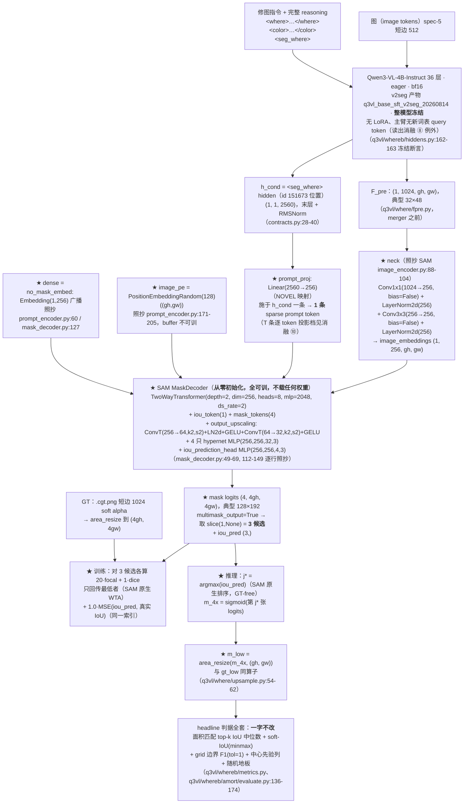

# 实验：SAM 分割头忠实移植（从零训）+ 像素分辨率监督（EPR-019）

状态：提案（待 grill-me + 用户定稿）。

**本提案没有结构基线。** ST_LANG（ConvTower + FiLM + CondEncoder + UNIQ K=8 + WTA + 七项 loss +
语言侧 LoRA r16）是**失败基线**（headline 0.77390），它的部件——ConvTower、hypernet 低秩改形、
`S_SCALE` 的 `3·tanh(·/3)`、`gain` 门、五项场 loss + cls + sel 共七项——**一律不进本方案**；
0.77390 只作为 §4 结果表里的一个**指标对照行**存在。

模型方案 = **冻结 Qwen3-VL 特征 + SAM 分割头的忠实移植**：头结构、loss 组成与权重、
头超参、优化器参数，一律照抄 SAM 原文与原仓库；训什么、冻什么照搬。**dice 与 focal 按原文
保留**（标注：按用户 2026-08-14 指示，本批提案解除本战役"dice/IoU 禁入 loss"红线对忠实移植
的约束；IoU 仍不作为**场**的直接优化目标——SAM 的 IoU 头回归的是 no-grad 的候选质量标量）。
无法照搬之处逐条标 **NOVEL** 并给理由。

**与 EPR-018 的分工**：EPR-018 = **载入预训练** SAM mask decoder 权重（LISA/Sa2VA 式
seg-token 驱动）；EPR-019 = **不载任何权重，从零训**同一套 SAM 结构 + SAM 自己的训练配方。
两臂的差 = 预训练先验值多少；两臂的和 = "SAM 这套东西在本数据上行不行"。

外部行号以 2026-08-14 当日 `curl` 打开的 raw 文件为准（清单见文末）；SAM 论文原句以当日打开的
ar5iv HTML 全文为准；本仓库 file:line 以当日工作区为准，逐个打开确认。

---

## 1. 任务

### 数据

- 训练：`sft2seg-20260804` train 切分，`render_mode == "local"`，`exclude_low=True`，
  **n = 42752**（`q3vl/whereb/scripts/run_amort_arm.py:343-350`）。
- 评测：`V_where` local **n = 400**（同上 L345/L350），按 `sha1(sample_id) % 2` 分
  selection 半 / holdout 半（`q3vl/whereb/scripts/run_amort_arm.py:627-636`）。
- headline 口径：`normal-only`（`winner_confidence == "normal"`），**n = 224**
  （`q3vl/whereb/amort/evaluate.py:452-468`）。
- 输入特征：`F_pre = (gh, gw, 1024)` —— 最后一个 vision block、merger 之前
  （`q3vl/where/fpre.py`；`grid = H/16`，`q3vl/where/fpre.py:45-49`；spec-5 短边 512 下典型
  `32×48`）。语言特征 `h_cond = norm(hidden_states[-1])` 在 **`<seg_where>` token 位置**上的
  那一行，`(2560,)`（`q3vl/whereb/contracts.py:28-40` 的 `SEGMENT_HIDDEN_LAYER=-1` /
  `SEGMENT_HIDDEN_FINAL_NORM=True`；口径全文见本节「语言条件读出」）。两者由同一次冻结
  前向产出（`q3vl/whereb/hiddens.py:113-186`，`EncodeResult.f_pre` / 语言侧 hidden）。
- 像素 GT：`.cgt.png`（短边 1024 soft alpha，`q3vl/where/maskdata.py:180-190` 的
  `MaskStore.load` 返回 `uint8/255` 的 `(h,w)` float32）。本臂把它 area 下采到 `(4gh, 4gw)`。

### 测试什么方法（通俗三段）

**第一段——现在的读出长什么样。** 现役 ST_LANG 头把图像特征过一座 6 块的卷积塔压到 128 通道，
再让 8 个文本条件 query 各自和这 128 维特征逐格点积，出 8 张 `32×48` 的场，监督也在 `32×48`
上算（`q3vl/whereb/amort/data.py:685-686` 把 GT area 下采到 `(gh,gw)`）。每格覆盖原图 16 像素。

**第二段——参考工作的分割头长什么样。** SAM 的做法完全不同：图像特征先过一个 neck 统一到
256 通道，提示（点/框/文本）作为 sparse token 与 4 个 mask token + 1 个 IoU token 拼在一起，
过 2 层 two-way transformer（token↔image 双向 cross-attention），出来的 image token 序列 reshape
回二维后过**两级 ConvTranspose 做 4 倍上采**，每个 mask token 各自过一只 hypernet MLP 得到一条
32 维权重，与上采后的 32 通道嵌入点积出 mask。同时 IoU token 过一只 MLP 预测每个候选与真值的
IoU，用来在推理时给候选排序。训练时 3 个候选各算一遍 focal+dice，**只回传损失最低的那个**。

**第三段——本实验做什么。** 把上面整套 SAM 分割头（two-way transformer + output_upscaling +
per-token hypernet + iou_token + iou_prediction_head + 3 候选 multimask）**原样搬过来、从零初始化
训练**，图像侧喂冻结 Qwen3-VL 的 `F_pre`（过 SAM 自己的 neck 降到 256 通道），提示侧喂冻结
Qwen3-VL 的 `h_cond`（`<seg_where>` 位置的单条 2560 维向量）投影成 **1 条** sparse prompt
token。loss 用 SAM 自己的 focal:dice = 20:1 +
IoU 头 MSE（权重 1.0）+ lowest-loss WTA；优化器参数照抄 SAM 论文 §A。监督分辨率 = decoder 的
原生 4× 输出（典型 `128×192`）。预测 mask 按 `area` 回降到 `(gh, gw)` 之后进**完全未改动**的
headline 判据，保证与 0.77390 同口径可比。

### 语言条件读出

语言条件向量 `h_cond` = base SFT v2seg 模型输出中 **`<seg_where>` token 位置的 hidden**：

```
h_cond = norm(hidden_states[-1]) 在 <seg_where> token 位置上的那一行，形状 (2560,)
```

层与归一化按 `q3vl/whereb/contracts.py:30-32`（`SEGMENT_HIDDEN_LAYER = -1` /
`SEGMENT_HIDDEN_FINAL_NORM = True`），维度 2560。

**v2seg 规格**：assistant 输出形制为
`<where>…</where><color>…</color><seg_where><seg_color><|im_end|>\n`，两个 seg token **受监督**；
`<seg_where>` id 151673、`<seg_color>` id 151674，两者追加在词表末尾
（`q3vl/train/constants.py:22-23`；四个 tag token `<where>` 151669 / `</where>` 151670 /
`<color>` 151671 / `</color>` 151672 见 `q3vl/train/constants.py:11-14`，字面 id 记在
`q3vl/whereb/attnread.py:62-64`）；产物目录 `/home/bc/data/runs/q3vl_base_sft_v2seg_20260814`。

**接入要点**：
(a) 前向序列喂到 `<seg_where>`——序列 = prompt + 完整 reasoning（where span + color span +
`<seg_where>`），读出切片取 `<seg_where>` 所在的**单个位置**（下标在拼接时记录，不做搜索式定位）。
挂点：序列构造 `q3vl/whereb/hiddens.py:170`、切片 `q3vl/whereb/hiddens.py:234`。仍是一次
`no_grad` 前向同时出 `F_pre` 与语言侧 hidden。
(b) 基座 = v2seg 产物 `/home/bc/data/runs/q3vl_base_sft_v2seg_20260814`；genwhere 生成缓存按该
checkpoint 重生成（缓存 schema 逐条记 `checkpoint` 字段，`q3vl/whereb/gencontext.py:122, 168`）。

**依赖项（写死）**：v2seg 训练产物落盘 **且** genwhere 缓存按 v2seg 重生成完成之前，**本臂不可
开跑**（2026-08-14 当日 `ls /home/bc/data/runs/` 未见 `q3vl_base_sft_v2seg_20260814`）。
v2seg 未就绪时的起跑档见 NOTES 9。

**本臂的条件消费点**：sparse prompt = `h_cond` 一条 2560 维向量过 `prompt_proj(2560→256)` 得
**1 条** token，按 `mask_decoder.py:121-123` 直接 cat 在 output token 之后。sparse prompt 数
= 1，SAM §A「we only predict a single mask when more than one prompt is given」的规则不触发
（见 NOTES 7）。

**`<seg_color>`**：归 what 分支使用，**本批六臂不消费**（见 NOTES 10）。

读出方式的其余档（`<where>` span 池化、`</where>` / `</color>` / `<|im_end|>` 位置、可学习
query token、K > 1 的多 seg token、T 条 sparse prompt）在 §4 读出方式消融组统一出数。

### 参考工作（当日逐个打开原始文件核实）

- **Segment Anything (SAM)**，arXiv **2304.02643**，github `facebookresearch/segment-anything`。
  - `segment_anything/modeling/mask_decoder.py`
    - L49-51：`iou_token = nn.Embedding(1, transformer_dim)`；
      `num_mask_tokens = num_multimask_outputs + 1`；`mask_tokens = nn.Embedding(4, 256)`。
    - L53-59：`output_upscaling = Sequential(ConvTranspose2d(C, C//4, k=2, s=2),
      LayerNorm2d(C//4), activation(), ConvTranspose2d(C//4, C//8, k=2, s=2), activation())`；
      `activation` 默认 `nn.GELU`（L23）；C=256 时 **256→64→32**，共 4× 上采。
    - L60-65：`output_hypernetworks_mlps = ModuleList([MLP(C, C, C//8, 3) for i in
      range(num_mask_tokens)])` —— **每个 mask token 一只**独立 MLP（4 只）。
    - L67-69：`iou_prediction_head = MLP(C, iou_head_hidden_dim=256, num_mask_tokens=4,
      iou_head_depth=3)`（默认值在 L24-25）。
    - L102-107：`multimask_output=True → mask_slice = slice(1, None)`（3 个候选）；
      `False → slice(0, 1)`（单候选，即论文说的"第四个 output token"，在代码里是索引 0）。
    - L121-123：`tokens = cat([cat([iou_token.weight, mask_tokens.weight]), sparse_prompt], dim=1)`
      —— **提示 token 就是直接拼在 output token 后面的普通 256 维 token**。
    - L126-128：`src = repeat_interleave(image_embeddings) + dense_prompt_embeddings`；
      `pos_src = repeat_interleave(image_pe)`。
    - L132-134：`hs, src = transformer(src, pos_src, tokens)`；`iou_token_out = hs[:,0,:]`；
      `mask_tokens_out = hs[:, 1:1+4, :]`。
    - L137-138：`src.transpose(1,2).view(b,c,h,w)` → `output_upscaling`。
    - L139-144：逐 token 过各自 hypernet → `hyper_in`；
      **L144 `masks = (hyper_in @ upscaled_embedding.view(b, c, h*w)).view(b, -1, h, w)`**。
    - L147：`iou_pred = iou_prediction_head(iou_token_out)`。
    - L154-176：`MLP(input, hidden, output, num_layers, sigmoid_output=False)`，中间层 ReLU。
  - `segment_anything/modeling/common.py` L31-43：`LayerNorm2d` = 逐空间位置沿 channel 维
    归一（ConvNeXt/detectron2 式，可学习 `weight`/`bias`，eps 1e-6），**不是** `GroupNorm(1,C)`。
  - `segment_anything/modeling/image_encoder.py` L88-104：**SAM 自己的 neck** =
    `Conv2d(embed_dim, 256, k=1, bias=False) + LayerNorm2d(256) +
    Conv2d(256, 256, k=3, padding=1, bias=False) + LayerNorm2d(256)`。
  - `segment_anything/modeling/transformer.py` L16-60：`TwoWayTransformer(depth, embedding_dim,
    num_heads, mlp_dim, activation=nn.ReLU, attention_downsample_rate=2)`；L45-55 每层
    `TwoWayAttentionBlock(skip_first_layer_pe=(i==0))`；L57-60 末尾一层
    `final_attn_token_to_image` + `norm_final_attn`。L109-117：block 内 `mlp_dim=2048`、
    `activation=nn.ReLU`、`attention_downsample_rate=2`。
  - `segment_anything/modeling/prompt_encoder.py` L43：`pe_layer = PositionEmbeddingRandom(
    embed_dim // 2)`；L60：`no_mask_embed = nn.Embedding(1, embed_dim)`（无 mask 提示时的
    dense 默认）；L62-72 `get_dense_pe()` 按 `image_embedding_size` 出 PE；
    L171-205 `PositionEmbeddingRandom`：buffer `positional_encoding_gaussian_matrix =
    scale * randn(2, num_pos_feats)`（**不可训**），`forward((h,w))` 对**任意** `(h,w)` 现算
    `cat([sin, cos])` 的 `C×H×W` 位置编码。
  - `segment_anything/build_sam.py` L62-98：`prompt_embed_dim = 256`；
    `MaskDecoder(num_multimask_outputs=3, transformer=TwoWayTransformer(depth=2,
    embedding_dim=256, mlp_dim=2048, num_heads=8), transformer_dim=256, iou_head_depth=3,
    iou_head_hidden_dim=256)`。L27-34 `build_sam_vit_l` 的 `encoder_embed_dim = 1024`
    —— **与本仓库 `F_pre` 的 1024 通道同数**，所以 neck 的入通道是照抄而非适配。
  - **论文 §A（ar5iv 全文当日打开）原句**：
    - 结构："The transformer uses an embedding dimension of 256. The transformer MLP blocks have
      a large internal dimension of 2048 … we reduce the channel dimension of the queries, keys,
      and values by 2× to 128 … All attention layers use 8 heads."
      "The transposed convolutions used to upscale the output image embedding are 2×2, stride 2
      with output channel dimensions of 64 and 32 and have GELU activations. They are separated
      by layer normalization."
    - 多候选："By default we predict three masks … During training, we compute the loss …
      between the ground truth and each of the predicted masks, but **only backpropagate from
      the lowest loss** … we add a small head (operating on an additional output token) that
      estimates the IoU between each predicted mask and the object it covers."
    - **Losses**："We supervise mask prediction with a linear combination of focal loss [65] and
      dice loss [73] in a **20:1 ratio of focal loss to dice loss**, following [20, 14]. Unlike
      [20, 14], we observe that **auxiliary deep supervision after each decoder layer is
      unhelpful**. The IoU prediction head is trained with **mean-square-error loss** between the
      IoU prediction and the predicted mask's IoU with the ground truth mask. It is added to the
      mask loss with a **constant scaling factor of 1.0**."
      （[65] = Lin et al., *Focal loss for dense object detection*, ICCV 2017；
      [73] = Milletari et al., *V-Net*, 3DV 2016；[20] = MaskFormer, NeurIPS 2021；
      [14] = DETR, ECCV 2020 —— 四条参考文献编号均在 ar5iv 参考文献表当日核对。）
    - **Training recipe**："We use the AdamW [68] optimizer (β₁ = 0.9, β₂ = 0.999) and a linear
      learning rate warmup [42] for 250 iterations and a step-wise learning rate decay schedule.
      The initial learning rate (lr), after warmup, is **8e-4**. We train for **90k iterations**
      (∼2 SA-1B epochs) and decrease the lr by a factor of 10 at **60k** iterations and again at
      **86666** iterations. The batch size is **256 images**. To regularize SAM, we set weight
      decay (wd) to **0.1** and apply drop path [53] (dp) with a rate of **0.4**. We use a
      layer-wise learning rate decay [5] (ld) of **0.8**. **No data augmentation is applied.**
      We initialize SAM from an MAE [47] pre-trained ViT-H."
- **SAM 2 官方训练代码**（`facebookresearch/sam2`）—— SAM v1 的发布是推理版，训练 loss 代码
  未随 v1 发布；v2 的官方实现给出 SAM 系 loss 的可执行形式，用来钉住 SAM 原文没写出的常数：
  - `training/loss_fns.py` L20-49 `dice_loss`：`inputs.sigmoid()` → `numerator = 2·Σ(p·t)`，
    `denominator = Σp + Σt`，`loss = 1 − (numerator + 1)/(denominator + 1)`（**平滑项 +1**）。
  - L52-90 `sigmoid_focal_loss`：**`alpha = 0.25`（L56）、`gamma = 2`（L57）**；
    `ce = BCEWithLogits(inputs, targets, reduction="none")`；`p_t = p·t + (1−p)(1−t)`；
    `loss = ce · (1 − p_t)^γ`；`alpha_t = α·t + (1−α)(1−t)`；空间维取 `mean`（L89）。
  - L93-123 `iou_loss`：`pred_mask = logits > 0`，`gt_mask = targets > 0`，
    `actual_iou = area_i / clamp(area_u, min=1.0)`；`use_l1_loss=False` 时走
    **`F.mse_loss(pred_ious, actual_ious)`**（L120）——即 SAM v1 原文的 MSE。
  - L267-282 WTA：`loss_combo = focal·w_mask + dice·w_dice`；`best_loss_inds = argmin(loss_combo)`；
    IoU loss 也**只在最低损失索引上取**，注释原文 `"to be consistent w/ SAM"`（L277-278）。
  - `sam2/configs/sam2.1_training/sam2.1_hiera_b+_MOSE_finetune.yaml` L284-288：
    `weight_dict: loss_mask: 20, loss_dice: 1, loss_iou: 1` —— **20:1:1，与 SAM 原文一致**。

### 解决什么问题（只陈述已测事实，不作解释）

- 现行监督与读出都在 `(gh,gw)`：`q3vl/whereb/amort/data.py:685-686`
  （`gt_hi = s.mask_target_hi().float()` → `gt_low = area_resize(gt_hi[None,None], (gh,gw))`），
  典型 `32×48`，每格 16 像素。
- 指标对照行（**不是本臂的结构 baseline**，只是同判据下已有的数字）：
  ST_LANG headline **0.77390**（失败基线；种子复现 0.76590）、M0 **0.79095**、
  center prior **0.5088**、随机 top-k 地板 **0.2582**、oracle **0.9737**、用户可用线 **0.85**。

---

## 2. 模型

### 模型图（★ = 本次新增；灰 = 冻结，一字不改）



### 模型伪代码

```python
# 冻结：整个 Qwen3-VL。可训：以下全部（从零初始化）。
neck        = Sequential(Conv2d(1024,256,1,bias=False), LayerNorm2d(256),
                         Conv2d(256,256,3,padding=1,bias=False), LayerNorm2d(256))  # SAM neck
prompt_proj = Linear(2560, 256)                                                     # NOVEL
pe_layer    = PositionEmbeddingRandom(128)          # buffer randn(2,128)，不可训
no_mask_embed = Embedding(1, 256)
decoder     = MaskDecoder(transformer_dim=256,
                          transformer=TwoWayTransformer(depth=2, embedding_dim=256,
                                                        num_heads=8, mlp_dim=2048),
                          num_multimask_outputs=3, activation=GELU,
                          iou_head_depth=3, iou_head_hidden_dim=256)

def forward(F_pre, h_cond, gh, gw):
    img  = neck(F_pre)                                   # (1,256,gh,gw)
    pe   = pe_layer((gh, gw)).unsqueeze(0)               # (1,256,gh,gw)
    spr  = prompt_proj(h_cond)                           # (1,1,256)  h_cond = <seg_where> 位置
    dns  = no_mask_embed.weight.reshape(1,256,1,1).expand(1,256,gh,gw)
    logits, iou = decoder(image_embeddings=img, image_pe=pe,
                          sparse_prompt_embeddings=spr, dense_prompt_embeddings=dns,
                          multimask_output=True)         # (1,3,4gh,4gw), (1,3)
    return logits[0], iou[0]
```

### 冻结 / 可训清单

| 组件 | 状态 | 依据 |
|---|---|---|
| Qwen3-VL-4B-Instruct 全部（视觉塔 + 语言塔 + embedding） | **冻结** | SAM 的 image encoder 在其配方里是可训的；本战役的对应物是冻结基座（`q3vl/whereb/hiddens.py:162-163` 对全部参数 `requires_grad_(False)`），这是**训什么冻什么的唯一不可照搬处**，标 **NOVEL 排除**，理由：本战役全部实验的共同约束是基座冻结，放开基座会同时改掉与 0.77390 的可比性和显存预算 |
| neck / prompt_proj / no_mask_embed / MaskDecoder 全部 | **可训，从零初始化** | SAM 的 decoder 本身也是从零训（论文 §A 只对 image encoder 说 MAE 初始化）；本臂**不载任何 SAM 权重**（与 EPR-018 的分工） |
| `pe_layer.positional_encoding_gaussian_matrix` | **不可训 buffer** | `prompt_encoder.py:180-183` 是 `register_buffer` |
| SemanticHead、CondEncoder | **不构造 / 不训练** | 本臂四族（radial / band / linear / semantic）**全部走新 decoder**：启动带 `--no-semantic-head`（`q3vl/whereb/scripts/run_amort_arm.py:205`）使 `model.sem is None`，路由判断（`q3vl/whereb/amort/trainer.py:101`、`q3vl/whereb/amort/evaluate.py:124` 的 `if x.route_semantic and model.sem is not None:`）自然把 semantic 族也送进 `forward_geo`——与 SAM 单头吃全部数据集同款，也与 EPR-018 同口径。`CondEncoder`（`q3vl/whereb/amort/model.py:111` 现为无条件构造）**不进本头前向**，构造后对 `self.cond` 调 `requires_grad_(False)`、不进优化器，可训参数清单落盘核对；`SemanticHead` 自带 FiLM（`q3vl/whereb/amort/heads.py:416`），本臂既不建该头也不用 FiLM。备选（保留语义头旧路由）见 NOTES 5 |

新增可训参数量（按上列结构逐项算）：neck 852,992 + prompt_proj 655,616 + no_mask_embed 256 +
MaskDecoder ≈ 4,058,340（transformer 3,291,264 / output_upscaling 73,952 / 4 只 hypernet
559,232 / iou 头 132,612 / tokens 1,280）≈ **556 万**。激活增量：3 张 `128×192` logits +
32ch `128×192` 上采嵌入，每样本 < 4 MB；显存增量 < 1 GB，65 GB 共存规则内。

---

## 3. 数学公式与优化器 + 改动怎么接进来

### 3.1 损失函数（逐条照抄 SAM，不增不减）

对每个样本、每个候选 `k ∈ {0,1,2}`（`multimask_output=True` 的 3 个），令
`z_k ∈ R^{4gh×4gw}` 为 logits，`t ∈ [0,1]^{4gh×4gw}` 为 GT alpha，`N = 4gh·4gw`：

```
p_k      = sigmoid(z_k)
ce_k     = BCEWithLogits(z_k, t)                      # 逐格
p_t,k    = p_k·t + (1−p_k)·(1−t)
α_t      = α·t + (1−α)·(1−t)                          # α = 0.25
L_focal,k = (1/N) · Σ_cells [ α_t · ce_k · (1 − p_t,k)^γ ]        # γ = 2
L_dice,k  = 1 − (2·Σ(p_k·t) + 1) / (Σ p_k + Σ t + 1)

k*       = argmin_k [ 20·L_focal,k + 1·L_dice,k ]     # SAM 原生 WTA：只回传最低者
IoU_k*   = |{z_k*>0} ∩ {t>0.5}| / max(|{z_k*>0} ∪ {t>0.5}|, 1)    # no_grad 常量
L_iou    = ( iou_pred[k*] − IoU_k* )²                 # MSE

L        = 20·L_focal,k* + 1·L_dice,k* + 1.0·L_iou
```

无深监督项（SAM §A 原句："auxiliary deep supervision after each decoder layer is unhelpful"）。
无 SDF / 面积带 / 空掩码 / 配对分离 / cls / sel —— 那七项是 ST_LANG 的，按本次指示不进方案。

| 项 | 值 | 出处 |
|---|---|---|
| focal : dice | **20 : 1** | SAM 论文 §A Losses 原句；SAM2 `sam2.1_hiera_b+_MOSE_finetune.yaml:285-286` (`loss_mask: 20, loss_dice: 1`)；**dice 与 focal 按用户 2026-08-14 指示忠实移植**（本战役「dice/IoU 禁入 loss」红线对本批提案解除） |
| focal α | **0.25** | SAM 论文未给；SAM2 `training/loss_fns.py:56` 默认（SAM v1 训练码未发布，取官方后继实现）；**按用户 2026-08-14 指示忠实移植** |
| focal γ | **2** | 同上，`training/loss_fns.py:57`；**按用户 2026-08-14 指示忠实移植** |
| focal 归约 | 空间维 `mean` | `training/loss_fns.py:89`；**按用户 2026-08-14 指示忠实移植** |
| dice 平滑 | 分子分母各 **+1** | `training/loss_fns.py:46`；**dice 按用户 2026-08-14 指示忠实移植** |
| IoU 头 loss | **MSE**，常数权重 **1.0** | SAM 论文 §A 原句；SAM2 `loss_fns.py:120` 的 MSE 分支、cfg L287 `loss_iou: 1`；**IoU 头按用户 2026-08-14 指示忠实移植**（回归对象是 no-grad 的候选质量标量，不是场的直接优化目标） |
| 多候选回传 | 只回传 `20·focal + 1·dice` 最低的候选 | SAM 论文 §A 原句；`loss_fns.py:267-276` |
| IoU loss 取哪个索引 | 同一个最低损失索引（`supervise_all_iou=False`） | `loss_fns.py:277-282`，注释原文 `"to be consistent w/ SAM"` |
| 深监督 | **无** | SAM 论文 §A 原句 |
| GT 是 soft alpha 而非二值 | **NOVEL 说明**：上式的 focal（`BCEWithLogits` 接受软目标）与 dice（分子分母都是求和）对 `t ∈ [0,1]` 均有定义，公式一字不改即可用；唯一需要阈值的是 `IoU_k*` 的 GT 侧，取 **`t > 0.5`**（与 `q3vl/whereb/metrics.py:142-144` 的 `gt_area_k(threshold=0.5)` 同阈值），SAM2 原式是 `targets > 0`（二值 GT 下等价，soft alpha 下会把整条羽化带算成前景） |
| `is_fake` 样本（foreign 指令，p=0.15） | GT 全零，照上式算 focal + dice（dice 的 +1 平滑使空 GT 有定义，`IoU` 分母 clamp 到 1 → 目标 0） | **NOVEL 说明**：SAM 从不在空 GT 上训（§B 明言过滤覆盖 >90% 图幅的 mask，无空 mask 概念）；保留 fake 流是为了不动数据管线。备选（把 fake 样本排除出 SAM loss）记 NOTES 待决策 |

### 3.2 优化器参数（照抄 SAM 论文 §A Training recipe）

| 项 | SAM 原文值 | 本臂取值 | 说明 |
|---|---|---|---|
| 优化器 | AdamW，β₁=0.9，β₂=0.999 | **同** | 照抄（`torch.optim.AdamW` 默认 betas 即 (0.9, 0.999)，`q3vl/whereb/amort/trainer.py:271-281` 不传 betas 即取此值） |
| lr（warmup 后） | **8e-4** | **8e-4** | 照抄原文数值。**不**按 batch 线性缩放——缩放规则不在 §A 里，加了就是自造；linear-scaling 会给 `8e-4 × 32/256 = 1e-4`，记 NOTES 待决策 + 可选消融 |
| warmup | linear，**250 iter**（占 90k 的 0.2778%） | **比例保形 → 3 步**（`round(1200 × 0.002778)`） | **NOVEL 步数适配**，理由：1200 步档下照抄绝对 250 步 = 20.8% 的 warmup，schedule 形状与原文完全不同。备选（绝对 250 步）记 NOTES 待决策 |
| schedule | step-wise：×0.1 @ **60k**、@ **86666**（占 90k 的 66.67% / 96.30%） | **×0.1 @ 步 800、@ 步 1156** | 比例保形，**NOVEL 步数适配**。需在 `q3vl/where/calibrate.py:126-145` 的 `make_scheduler` 增一个 `kind="sam_step"` 分支（`kind="cosine"` 分支逐位不动） |
| weight decay | **0.1** | **0.1** | 照抄数值。归属仍用本仓库的 param-group 拆分（`dim>1` 组 wd=0.1，`dim<=1` 组 wd=0，`trainer.py:271-281`）；SAM 训练码未发布，无法核实其是否拆分——**NOVEL 说明**，记 NOTES |
| 总步数 | 90k iterations | **1200 步** | 与 ST_LANG 步数匹配（`run_amort_arm.py:110-112`），U4 步数匹配纪律 |
| batch size | **256 images** | **有效 batch 32**（micro 按排卡定） | 本战役统一值；显存与步数匹配约束 |
| drop path | **0.4** | **不移植（NOVEL 排除）** | §A 的 dp 是 image encoder 的正则（released code 全仓 `grep -i drop_path segment_anything/modeling/image_encoder.py` 无命中，训练版未发布）；本臂 image encoder 是冻结的 Qwen3-VL，无可施加对象 |
| layer-wise lr decay | **0.8** | **不移植（NOVEL 排除）** | 同上，逐层衰减只对可训的 image encoder 定义 |
| 数据增广 | **无** | **无** | 照抄；本仓库管线本来就无增广 |
| 初始化 | image encoder 从 MAE ViT-H；decoder 从零 | image encoder = 冻结的 v2seg 产物 `q3vl_base_sft_v2seg_20260814`；**decoder / neck / prompt_proj 全部从零** | decoder 从零与 SAM 一致；预训练 decoder 权重是 EPR-018 的变量 |
| 梯度裁剪 | §A **未提** | `max_grad_norm = 1.0`（`trainer.py` `AmortTrainConfig` 默认） | **偏离，诚实列出**：本仓库 trainer 硬编码；SAM2 官方配置用 `max_norm 0.1`（`sam2.1_hiera_b+_MOSE_finetune.yaml:244-247`），两者都不是 SAM v1 原文 |
| 精度 | §A 未提 | **bf16** | 本仓库统一（`trainer.py` `precision="bf16"`） |
| seed | — | **20260810** | 本仓库统一（`trainer.py:54`） |
| checkpoint 选择 | SAM 无此概念 | **quick-eval 硬门 + `local_soft_iou_median` 择优，永不读 val loss** | 本战役红线，不动（`trainer.py:492-506`） |

### 3.3 接入表（逐条可确认）

| 项 | 内容 |
|---|---|
| **改哪里** | ① **新增头模块**：新文件 **`q3vl/whereb/amort/samdec.py`**，内含 `LayerNorm2d`（照抄 SAM `common.py:31-43`）、`MLP`（照抄 `mask_decoder.py:154-176`；与本仓库既有 `SelMLP`（`q3vl/whereb/amort/uniq.py:84-104`）同形，但本臂**不 import UNIQ 任何东西**，避免把 ST_LANG 的模块图牵进来）、`Attention` / `TwoWayAttentionBlock` / `TwoWayTransformer`（照抄 `transformer.py`）、`MaskDecoder`（照抄 `mask_decoder.py:16-149`）、`PositionEmbeddingRandom`（照抄 `prompt_encoder.py:171-205`），外加 `SAMDecHead(nn.Module)` 把 neck / prompt_proj / no_mask_embed / decoder 装配起来。② **新增 arm 分支**：`q3vl/whereb/amort/model.py` 的 `AmortModel.__init__`（arm 分派在 **L118-132**）加 `elif arm == "SAMDEC": from .samdec import SAMDecHead; self.geo = SAMDecHead(in_dim=1024, text_dim=2560)`；`forward_geo`（**L223-238** 签名，UNIQ 分支在 **L280-305**）加一条 `if self.arm == "SAMDEC":` 分支：取语言侧 hidden 形参（已在 L236）中 `<seg_where>` 位置的那一行 = `h_cond` → `logits, iou = self.geo(feat, h_cond, grid_h, grid_w)` → `j = int(iou.argmax())` → `m_4x = torch.sigmoid(logits[j])` → `out = {"m_low": area_resize(m_4x[None,None], (grid_h, grid_w))[0,0], "samdec": {"logits": logits, "iou_pred": iou, "sel": j}}`。语言侧 hidden 为 `None`、或序列里找不到 `<seg_where>` 下标时 raise（与 UNIQ 分支 L283-288 同款保护）。③ **新增 GT 分辨率**：`AmortSampleInputs`（`q3vl/whereb/amort/data.py:294-314`）增字段 `gt_fine`，构造点挂在 **`data.py:685-686`** 旁：`gt_fine = area_resize(gt_hi[None,None], (4*gh, 4*gw))[0,0]`（**同一个 `area_resize`**，`q3vl/where/upsample.py:54-62`；`gt_low` 一行不动，headline 判据继续吃它）。`gt_hi` 链路一条不改（`.cgt.png` 短边 1024，`q3vl/where/maskdata.py:180-190`；published maskviews `.maskhi.png` 短边 512 是同链投影，只读挂载 `/mnt/nfs-ro/bc/data/datasets/where_a-20260805/maskviews/`）。④ **新增 loss**：`q3vl/whereb/amort/losses.py` 增 `sam_mask_loss(logits, iou_pred, gt_fine, w)` 实现 §3.1 全式；`LossWeights` 增 `sam_focal: float = 0.0` / `sam_dice: float = 0.0` / `sam_iou: float = 0.0` / `sam_focal_alpha: float = 0.25` / `sam_focal_gamma: float = 2.0`，**三个权重同时为 0 = 短路，现有各臂逐位不变**。挂点在 `q3vl/whereb/amort/trainer.py:112-170` 的分支链上加 `elif "samdec" in out:`，与 UNIQ 分支（L134-168）并列。⑤ **推理/评测回降**：`m_low` 已在 forward_geo 内回降到 `(gh,gw)`，`trainer.py:119-123` 的形状断言与 `q3vl/whereb/amort/evaluate.py:136-155` 的消费端**零改动**；`guide_hi` 路径（若开 `want_hi`）的 `F.interpolate` 起点换成 `m_4x`，算子不变。⑥ **新增读出列（诊断，不进 headline）**：per-sample 行加 `samdec_sel`（选中候选索引）、`samdec_iou_pred`（选中候选的预测 IoU）、`samdec_iou_mae`（\|iou_pred − 回降后真实 top-k IoU\|）、`samdec_best_of_3`（3 候选各自回降后 top-k IoU 的最大值）；board 聚合加 `criteria_columns.samdec_cand`。训练侧 per-step stats 加 `sup_cells`（= `gt_fine` 的格子数，4× 档 ≈ 16 倍）与 `L_focal` / `L_dice` / `L_iouhead`——`aggregate`（`losses.py:519-559`）自动写进 `steps.jsonl`。⑦ **运行时断言**：`assert_criteria_ran`（`q3vl/whereb/amort/evaluate.py:313-368`）的 `required` 表（**L331**）加 `"SAMDEC": ["samdec_cand"]`（该列 n=0 → 拒绝出板）；并在同函数内加 SAMDEC 专项检查：`steps.jsonl` 首行必须同时携带 `L_focal`、`L_dice`、`L_iouhead`、`sup_cells`，缺任一即 `AssertionError`——首行喂入已由 `_finish_board`（`run_amort_arm.py:710/734-742`）接好。「定义了没接线」已三次，不给第四次。⑧ **调度器**：`q3vl/where/calibrate.py:126-145` 的 `make_scheduler` 增 `kind == "sam_step"` 分支（warmup 后按 `step ≥ 0.6667·T` / `step ≥ 0.9630·T` 各乘 0.1）；`kind == "cosine"` 与 `else → 1.0` 两条既有路径逐位不动。⑨&nbsp;**读出接缝（§1「语言条件读出」）**：`q3vl/whereb/hiddens.py:170` 的序列构造喂完整 reasoning 到 `<seg_where>` 为止、`q3vl/whereb/hiddens.py:234` 的切片取 `<seg_where>` 单个位置，两处由一个读出旗标统一分派；基座路径与 genwhere 缓存取 v2seg 档。旗标（默认值 = 主臂口径）：`--readout seg_where`（choices：`seg_where` / `where_span_pool` / `where_close` / `color_close` / `im_end` / `qtok`，对应 §4 读出方式消融组 ⑨-1 / ⑥ / ⑦-a / ⑦-b / ⑧）、`--readout-qtok K`（默认 0；`qtok` 档取 1 / 4 / 8，机制照 `q3vl/whereb/amort/uniq4.py:76` / `:79` / `:113` / `:148`）、`--readout-nseg K`（默认 1；K>1 需对应 SFT 变体重训，占位）、`--samdec-prompt {one,span}`（默认 `one` = 1 条 sparse token；`span` = T 条逐 token 投影，消融行 ⑩）。旗标值、`<seg_where>` 的解析下标、基座 checkpoint 路径与 genwhere 缓存的 `checkpoint` 字段一并写进 `run_setup.json`（`amort_source_sha256` 冻结机制 L53-60 自动覆盖新文件）；启动时断言「缓存的 `checkpoint` 字段 == 本次基座路径」，不一致即拒绝开训。 |
| **不变（明确列出没动的部分）** | **冻结基座全套**：Qwen3-VL-4B-Instruct、eager attention、bf16、`FrozenVLM` 的 `requires_grad_(False)` + `model.eval()`（`q3vl/whereb/hiddens.py:162-163`）；`F_pre` 抽取（`q3vl/where/fpre.py`）与语言侧 hidden 的层/归一化契约（`q3vl/whereb/contracts.py:28-40`）；本臂**不注入任何 LoRA**（与 ST_LANG 的分岔点之一），**主臂不加任何新词表 token**（读出方式消融组 ⑧ 的可学习 query 档是唯一例外，走 uniq4 机制）。基座 checkpoint 与 genwhere 缓存取 v2seg 档、`hiddens.py:170` 的序列构造与 `:234` 的切片按 §1「语言条件读出」接线。**数据管线全套**：train local n=42752 / `exclude_low=True`（`run_amort_arm.py:343-350`）、V_where local 400 与 sha1 选择半/保留半（`run_amort_arm.py:627-636`）、context 混合与 `fake_prob=0.15` 的 foreign 指令流、shuffle/无关词/固定短语三负控制、partner 配对索引、`gt_hi` 的 `.cgt.png` 链、`gt_low` 的 `(gh,gw)` area 下采（`data.py:686` 原样保留）。**评测全套一字不改**：`evaluate_context`（`q3vl/whereb/amort/evaluate.py:94-178`）的每一列——`soft_iou`（minmax 形式，`metrics.py:88-105`）、`hard_iou`（面积匹配 top-k，`metrics.py:127-144` + `metrics.py:200-207`）、`grid_boundary_f1`（tol=1 cell，`metrics.py:209-241`，`GRID_BOUNDARY_TOL_CELLS = 1`，`q3vl/whereb/config.py:265`）、`center_prior_*` 三列（`q3vl/whereb/amort/evaluate.py:57-76`）、`random_floor = a/(2−a)`（`q3vl/whereb/amort/evaluate.py:78-81`）、`corr_pred_center` / `corr_pred_gt`；`summarise_rows` 的 `headline_normal_only`（`q3vl/whereb/amort/evaluate.py:452-468`）与 `delta_vs_center_prior` / `corr_center_minus_corr_gt`；area/family 分层（`q3vl/whereb/amort/evaluate.py:419-444`）；配对 sign-flip permutation 1e4（`metrics.py:244-290`）。**AUC 全战役禁用**；像素级 3px 边界 F1 禁作 criterion；禁逐图 min-max；checkpoint 选择禁 val loss。**语义头与路由**：`route_semantic` 的判定代码（`q3vl/whereb/amort/trainer.py:101`、`q3vl/whereb/amort/evaluate.py:124`）一字不改——改的只是启动旗标 `--no-semantic-head`（`q3vl/whereb/scripts/run_amort_arm.py:205`），使 `model.sem is None`，于是四族样本全部落到 `forward_geo` 走新 decoder；`SemanticHead` 与 `CondEncoder` 在本臂不构造 / 不训练（详见 §2「冻结 / 可训清单」末行）。**七项 ST_LANG loss 的默认权重不变**（bce 1.00 / sdf 0.10 / area 0.05 / fake 0.20 / sep 0.30 / uniq_cls 0 / uniq_sel 0，`losses.py:64-72`），本臂只是不在几何路上用它们。 |
| **初始化** | 全部按 **SAM 原实现的初始化方案**，即 PyTorch 各层默认初始化，**不做任何零初始化**（SAM `mask_decoder.py` / `transformer.py` / `image_encoder.py` 中无一处显式 `init`；`prompt_encoder.py:180-183` 的 PE 是 `scale·randn(2,128)` 的 buffer，`scale=1.0`）。**step0 状态**：3 张 `128×192` logits 是随机初始化的 neck + 随机 decoder 对冻结特征的输出，`sigmoid` 后是接近 0.5 但**空间上非常数**的场；回降到 `(gh,gw)` 后的 headline 数字是随机场的分数，**与 ST_LANG 的 step0 不等价、也不要求等价**——本臂不是在 ST_LANG 上加模块，是另一套头。可预注册的对齐面只有一条：**`--arm SAMDEC` 不选时，`AmortModel.__init__` 不进新分支、`samdec.py` 不被 import、`LossWeights` 的三个 `sam_*` 权重为 0 短路，现有 P1 / P3prime / SHAPE3 / UNIQ 四臂逐位一致**。step0 的 board 数字随 run 落盘作背景列，**不作任何判据**。 **预注册违规（S5.6）诚实登记**：`PositionEmbeddingRandom` 是坐标基（把归一化 `(x,y)` 过随机高斯投影再取 `sin/cos`，`prompt_encoder.py:185-205`），DELTA S5.6 禁坐标通道。照 EPR-011 Fourier 臂先例以**预注册违规**处理，执行线 = 每板必带的 `corr_center_minus_corr_gt` 列（`q3vl/whereb/amort/evaluate.py:465-467`）：中心先验病复活（该列 > 0）则 S5.6 立、本结构死。 |
| **入口（新 arm 名；不选 = 不影响现有任何臂）** | `q3vl/whereb/scripts/run_amort_arm.py:90-91` 的 `--arm` choices 增一个值：**`SAMDEC`**（现有四个值 `P1/P3prime/SHAPE3/UNIQ` 的行为逐位不变；本臂**不需要**任何 wrapper——它不改 VLM 侧，直接用 `hiddens.FrozenVLM`，不走 `run_uniq4b_arm.py` 的 seam）。启动命令固定带 `--no-semantic-head`（`run_amort_arm.py:205`）+ `--no-sim-field`（`:121`）+ `--no-film`（`:123`），使四族全部走新 decoder、`SemanticHead` 不构造、`CondEncoder` 冻结不训（见 §2「冻结 / 可训清单」末行）。配套旗标（全部只在 `--arm SAMDEC` 下读取，进 `run_setup.json` / `loss_preregistration.json`，`run_amort_arm.py:688-706`；`amort_source_sha256` 冻结机制 L53-60 自动覆盖新文件）：<br>• `--samdec-multimask {3,1}`（默认 **3** = `multimask_output=True`；1 = `False`，走 `mask_decoder.py:104-105` 的 `slice(0,1)`，消融行 ③）<br>• `--samdec-loss {focal_dice,focal,bce_dice,bce}`（默认 **focal_dice** = SAM 原配方；`focal` = 去 dice，消融行 ①；`bce_dice` = focal→BCE，消融行 ②）<br>• `--samdec-gt {png,raster}`（默认 **png** = 全四族统一 `.cgt.png` area 下采到 `(4gh,4gw)`；`raster` = analytic 三族改 `raster_geometry(mask_type, geometry, 4gh, 4gw)` 解析重渲染（`dataset_build/src/construct/canonical_masks.py:90-123`，radial/band → `circulargradient`、linear → `gradient`，末尾 `α²(3−2α)` smoothstep + `Flipped` 处理），semantic 族无解析参数只能保持 png 链，消融行 ④）<br>• `--samdec-iou-head / --no-samdec-iou-head`（默认 **on**；off = 不建 `iou_token` / `iou_prediction_head`、`L_iou` 项去掉、推理改用**候选 0** 而非 argmax，消融行 ⑤）<br>• `--samdec-lr`（默认 **8e-4**，SAM §A 原值）、`--samdec-wd`（默认 **0.1**）、`--samdec-sched`（默认 `sam_step`）<br>• `--samdec-focal-alpha`（默认 0.25）、`--samdec-focal-gamma`（默认 2.0）、`--samdec-w-focal`（默认 20）、`--samdec-w-dice`（默认 1）、`--samdec-w-iou`（默认 1.0）—— 一律 SAM 原值，列出来是为了让 `loss_preregistration.json` 里有它们的**记录**，不是给调的 |

### 3.4 判据（预注册，逐字，与冻结 baseline 同口径；本 EPR **一列不改**）

V_where local 400，**normal-only headline**（`.contexts.*.headline_normal_only`，
`q3vl/whereb/amort/evaluate.py:452-468`；**禁用顶层 pooled `.baselines`**），**n = 224**，
**面积匹配 top-k IoU 中位数**。三列套装缺一不可：**soft-IoU（minmax 形式，
`q3vl/whereb/metrics.py:88-105`）+ grid 级边界 F1（tol = 1 cell，`metrics.py:209-241`，
`q3vl/whereb/config.py:265`）+ 中心先验列（`q3vl/whereb/amort/evaluate.py:57-76`，同 grid 同 top-k 规则）**；
形状/覆盖类数字并排 **随机 top-k 地板 a/(2−a)**（`q3vl/whereb/amort/evaluate.py:78-81`）。
与对照行 1200 步**步数匹配**（`run_amort_arm.py:110-112`）；
逐样本配对 + **sign-flip permutation 1e4**（`metrics.py:244-290`）。
eval 启动时**运行时断言**判据函数被调用（`assert_criteria_ran`，`q3vl/whereb/amort/evaluate.py:313-368`；
本臂 `required = ["samdec_cand"]`，且 `steps.jsonl` 首行必须携带 `L_focal` / `L_dice` /
`L_iouhead` / `sup_cells`，缺列拒绝出板）。
**AUC 全战役禁用**；像素级 3px 边界 F1 禁作 criterion；禁逐图 min-max/softmax 归一化；
checkpoint 选择禁 val loss。

**预测 mask 回 `(gh,gw)` 的口径（写明）**：decoder 出的是 `(3, 4gh, 4gw)` logits；推理按
`argmax(iou_pred)` 选一个候选 `j*`，`m_4x = sigmoid(第 j* 张 logits)`，再
`m_low = area_resize(m_4x[None,None], (gh, gw))[0,0]` —— **与 `gt_low` 用的是同一个算子**
（`q3vl/where/upsample.py:54-62` 的 `area_resize`，下采时 `F.interpolate(mode="area")`），
调用点与 `q3vl/whereb/amort/data.py:685-686` 完全一致。`m_low` 进 `evaluate_context`
（`q3vl/whereb/amort/evaluate.py:136-155`）之后的每一行判据代码**一个字符都不改**，所以本臂的 headline 与
0.77390 是同一支尺子量出来的。

按 **family（radial / band / linear / semantic）分层报**；四族**全部走同一个新 decoder**
（`--no-semantic-head`），semantic 分层数字与几何三族并排列出、口径相同。

**上线前检查项（非判据）**：dataloader 吞吐压测（`gt_fine` 在 16 倍格数上的 area 下采，
n=42752，png 解码现行管线已有，无新增解码）；`sup_cells` 首行见证列在 `steps.jsonl` 出现；
`<where>` span 长度 T 的分布落盘（SAM 的 sparse prompt "rarely greater than 20"，本臂的 T 是
生成 span 的实际长度，超出该量级只是记录事实，不设截断）。

---

## 4. 结果（做完补，消融行全填这里）

口径：headline = 面积匹配 top-k IoU 中位数，generated + normal-only，**n = 224**，
逐样本配对 + sign-flip permutation 1e4。

**指标对照行（不是本臂的结构 baseline，只是同判据下的已有数字）**：
ST_LANG（失败基线）**0.77390**（种子复现 0.76590）/ M0 **0.79095** / center prior **0.5088** /
随机地板 **0.2582** / oracle **0.9737** / 用户可用线 **0.85**。

**主臂（SAM 头从零训 + SAM 配方 + 4× 像素监督，1200 步）**：

- headline top-k IoU 中位数 = `___`（配对 Δ vs center prior = `___`，p = `___`）
- soft-IoU(minmax) 中位数 = `___`
- grid 边界 F1(tol=1) 中位数 = `___`（center prior 边界 F1 = `___`）
- center prior top-k IoU 中位数 = `___` / 随机地板中位数 = `___`
- `corr_center_minus_corr_gt` = `___`（S5.6 执行线）
- 候选读出：`samdec_best_of_3` = `___` / `samdec_iou_mae` = `___` /
  选中候选索引分布 = `___`
- family 分层 headline：radial `___` / band `___` / linear `___` / semantic `___`
- 训练侧见证：`sup_cells` = `___` / `L_focal` = `___` / `L_dice` = `___` /
  `L_iouhead` = `___`

**消融行（全部是"对忠实配方的偏离"，主臂 = 忠实配方）**：

- ① **去 dice**（`20·focal` 单独，`--samdec-loss focal`）：headline = `___`
  （vs 主臂配对 Δ = `___`，p = `___`）；边界 F1 = `___`
- ② **focal → BCE**（`20·BCE + 1·dice`，`--samdec-loss bce_dice`）：headline = `___`
  （vs 主臂配对 Δ = `___`，p = `___`）
- ③ **候选数 3 → 1**（`multimask_output=False`，WTA 退化为单候选，
  `--samdec-multimask 1`）：headline = `___`（vs 主臂配对 Δ = `___`，p = `___`）；
  `samdec_best_of_3` 在该行不可用
- ④ **GT 源 png → raster**（analytic 三族 `raster_geometry` 在 `(4gh,4gw)` 解析重渲染，
  semantic 族保持 png，`--samdec-gt raster`）：headline = `___`
  （vs 主臂配对 Δ = `___`，p = `___`）；analytic 三族分层 = `___`
- ⑤ **去 IoU 头**（无 `iou_token` / `iou_prediction_head`，`L_iou` 去掉，推理取候选 0，
  `--no-samdec-iou-head`）：headline = `___`（vs 主臂配对 Δ = `___`，p = `___`）；
  `samdec_best_of_3` = `___`

**读出方式消融组**——骨干
固定取本臂**当前结果最好的模型形态**（其余结构、loss、优化器、步数全部保持该形态不动），
**只改「语言条件从哪里读」这一处**；每行同样给 headline、配对 Δ 与 p，并各自带
Δ_const / Δ_shuffle。

| 行 | 读出口径 | 旗标 | 起跑依赖 | headline | 配对 Δ | p | Δ_const | Δ_shuffle |
|---|---|---|---|---|---|---|---|---|
| ⑥ | `<where>` span 池化：含 `<where>` / `</where>` 两个标签 token 的 T 行 mean-pool（前向序列喂到 `</where>` 为止，切片取该段 T 行；span 边界按 `q3vl/whereb/context.py:224-232` 的 `extract_segment`，切到第一个 `</where>` 并含该标签） | `--readout where_span_pool` | 口径本身不依赖 v2seg（checkpoint-4976 上即可跑）；与主臂配对比较时在同一基座上跑 | ___ | ___ | ___ | ___ | ___ |
| ⑦-a | special token 位置档：`</where>`（id 151670）单 token hidden | `--readout where_close` | **不依赖 v2seg**——该 token 在 checkpoint-4976 的输出里已存在 | ___ | ___ | ___ | ___ | ___ |
| ⑦-b | special token 位置档：`</color>`（id 151672）单 token hidden | `--readout color_close` | 同上（checkpoint-4976 输出末尾依次是 `</where>` → color span → `</color>` → `<\|im_end\|>`） | ___ | ___ | ___ | ___ | ___ |
| ⑦-c | special token 位置档：`<\|im_end\|>`（id 151645，受监督）单 token hidden | `--readout im_end` | 同上 | ___ | ___ | ___ | ___ | ___ |
| ⑧-1 | 可学习 query token 读出，`K_q = 1`（uniq4 词表扩展 + embedding forward hook，`q3vl/whereb/amort/uniq4.py:76` / `:79` / `:113`；query id **追加在完整输出之后**，追加写法同 `uniq4.py:148` 的 `where_ids + q_ids`） | `--readout qtok --readout-qtok 1` | 机制不依赖 v2seg（词表扩展 + hook 与基座版本无关） | ___ | ___ | ___ | ___ | ___ |
| ⑧-4 | 同上，`K_q = 4` | `--readout qtok --readout-qtok 4` | 同上 | ___ | ___ | ___ | ___ | ___ |
| ⑧-8 | 同上，`K_q = 8` | `--readout qtok --readout-qtok 8` | 同上 | ___ | ___ | ___ | ___ | ___ |
| ⑨-1 | special token 数量档：where 读出 token `K = 1`（= 主臂默认，单个 `<seg_where>`） | `--readout seg_where --readout-nseg 1` | v2seg | ___ | ___ | ___ | ___ | ___ |
| ⑨-2 | 同上，`K = 2` | `--readout seg_where --readout-nseg 2` | **需对应 SFT 变体重训**（v2seg 只监督 1 个 `<seg_where>`），**占位不排期** | ___ | ___ | ___ | ___ | ___ |
| ⑨-4 | 同上，`K = 4` | `--readout seg_where --readout-nseg 4` | 同上，**占位不排期** | ___ | ___ | ___ | ___ | ___ |
| ⑩ | **sparse prompt 形制**：1 条（`h_cond` 投影）→ **T 条**（`<where>` span 的 T 个 token 各自过 `prompt_proj` 得 T 条 sparse prompt）；此时 prompt 数恒 > 1，SAM §A「more than one prompt → single mask」的规则触发，见 NOTES 7 | `--samdec-prompt span` | 同 ⑥ | ___ | ___ | ___ | ___ | ___ |

叠加式读法：本组的基线行 = ⑨-1（主臂默认读出，单个 `<seg_where>`，sparse prompt 1 条）；换成
⑥ 的 span 池化，指标变动是 ___；换成 ⑦-a / ⑦-b / ⑦-c 三个 special token 位置，分别是
___ / ___ / ___；换成 ⑧ 的可学习 query，`K_q` = 1 / 4 / 8 分别是 ___ / ___ / ___；把 where
读出 token 数从 1 加到 2 / 4，分别是 ___ / ___；把 sparse prompt 从 1 条改回 T 条（⑩）是 ___。
**多条向量的聚合形制**（⑧ 的 `K_q > 1`、⑨ 的 `K > 1`）无原文可抄：保守默认 = 每条各自过同一个
`prompt_proj` 得多条 sparse token，按 `mask_decoder.py:121-123` 的 cat 写法一并接在 output token
之后（与 ⑩ 的 T 条同一条码路），**属 NOVEL、随本组一并请用户拍板**，未拍板前按此默认写进
`run_setup.json`。

---

## NOTES（假设与待用户决策，保守默认已在上文写死，未静默拍板）

1. **lr 是否按 batch 缩放**。保守默认 = 照抄原文 `8e-4`（batch 256 → 本臂 32 未缩放）。
   备选 = linear scaling rule 给 `1e-4`。§A 未给缩放规则，两者都不是原文的直接陈述。
2. **warmup 步数**。保守默认 = 比例保形（250/90000 → 3 步）。备选 = 照抄绝对 250 步
   （占 1200 步的 20.8%）。
3. **weight decay 的 param-group 归属**。保守默认 = 本仓库既有拆分（`dim>1` 组 0.1、
   `dim<=1` 组 0）。SAM v1 训练码未发布，无法核实其是否对 norm/bias 免 decay。
4. **`is_fake` 空 GT 样本**。保守默认 = 保留在流里、照 SAM loss 算（dice 的 +1 平滑使其有定义）。
   备选 = 排除出 SAM loss 并计数。SAM 从不在空 GT 上训。
5. **语义头去留**。保守默认（本批六份提案统一口径）= **`--no-semantic-head`，四族全走 SAM
   decoder**：`model.sem is None` 时 `route_semantic` 样本自动落到 `forward_geo`
   （`q3vl/whereb/amort/trainer.py:101`、`q3vl/whereb/amort/evaluate.py:124`），`SemanticHead`
   与 `CondEncoder` 不构造 / 不训练。备选 = **保留语义头旧路由**（`SemanticHead` 及其原五项
   loss 照旧、语义路样本不经过新 decoder），其代价是几何 / 语义两套 loss 并存、headline Δ 为
   dilution-conservative 读法；两个口径下 headline 都是同一支尺子（`m_low` 进未改动的
   `evaluate_context`），差别在于 semantic 那 17.5% 的样本由哪个头产出。请拍板。
6. **`h_cond` → sparse prompt 的投影形制（NOVEL）**。保守默认 = 单层 `Linear(2560→256)` 施于
   `h_cond` 一条向量，得到 **1 条** token，按 `mask_decoder.py:121-123` 直接 cat 在 output token
   之后。理由：SAM 的 sparse prompt 就是"一条 256 维 token"，点提示是 embedding 查表 + PE 相加，
   没有多层投影；单层线性是"一条 token"的最小忠实类比。T 条逐 token 投影档见消融行 ⑩。
   备选（LISA/Sa2VA 的两层 `Linear+ReLU+Linear+Dropout`）是 EPR-018 的形制，放在那边测。
7. **SAM 自己的规则与 prompt 数的张力**。SAM 论文 §A 原句："we only
   predict a single mask when more than one prompt is given"。**主臂的 prompt 数
   = 1**（`h_cond` 一条），SAM 的这条规则不触发，3 候选 + lowest-loss WTA 的移植配方与之无冲突。
   **消融行 ⑩**（T 条 sparse prompt）会让 prompt 数恒 > 1，此时按 SAM 自己的规则应当走单候选，
   即 ⑩ 与 ③（`--samdec-multimask 1`）叠加才是 SAM 规则下的读法——⑩ 与 ③ 是否需要一条叠加行，
   请拍板；未拍板前只跑各自单改一项的行。
8. **梯度裁剪**。`max_grad_norm=1.0` 是本仓库 trainer 的硬编码默认，SAM §A 未提，
   SAM2 官方配置用 0.1。当前按仓库默认走。
9. **v2seg 依赖排期：v2seg 未就绪时本臂怎么起跑**。保守默认 = **等 v2seg**——v2seg 产物落盘 +
   genwhere 缓存按 v2seg 重生成两件都完成后才开跑本臂（§1「语言条件读出」的「依赖项」
   已写死）。备选 = 先用读出方式消融组 ⑦-c 的 `<|im_end|>` 档（checkpoint-4976 + 现有 genwhere
   缓存即可跑）起跑一条，v2seg 到位后再按同 seed / 同步数跑主臂的 `<seg_where>` 档；代价是
   两条跑的基座不同，之间不构成逐样本配对比较，各自只能与本臂自己的对照列比。是否先起跑、
   以及先跑哪一档，请拍板。
10. **`<seg_color>`（id 151674）的归属**。保守默认 = **归 what 分支使用，本批六臂一律不消费**：
    本臂的 `h_cond` 只取 `<seg_where>` 一个位置，`<seg_color>` 的 hidden 既不进 `prompt_proj`、
    也不进任何 loss 与诊断列。需确认：(i) 是否要加一条「sparse prompt = `<seg_where>` 与
    `<seg_color>` 各投影一条，共 2 条」的读出消融行；(ii) what 分支若改动 `<seg_color>` 的位置
    或监督方式，会连带改动接入要点 (a) 的序列构造长度。未拍板前按「不消费」继续。

---

## 来源清单（2026-08-14 当日 `curl` 打开的原始文件；arXiv 号已开原文核对）

- https://raw.githubusercontent.com/facebookresearch/segment-anything/main/segment_anything/modeling/mask_decoder.py
- https://raw.githubusercontent.com/facebookresearch/segment-anything/main/segment_anything/modeling/common.py
- https://raw.githubusercontent.com/facebookresearch/segment-anything/main/segment_anything/modeling/transformer.py
- https://raw.githubusercontent.com/facebookresearch/segment-anything/main/segment_anything/modeling/prompt_encoder.py
- https://raw.githubusercontent.com/facebookresearch/segment-anything/main/segment_anything/modeling/image_encoder.py
- https://raw.githubusercontent.com/facebookresearch/segment-anything/main/segment_anything/build_sam.py
- https://ar5iv.labs.arxiv.org/html/2304.02643 （Segment Anything 全文；§A "Losses" /
  "Training algorithm" / "Training recipe" 原句当日逐句核对，参考文献 [14]/[20]/[65]/[73] 编号
  在参考文献表中核对）
- https://raw.githubusercontent.com/facebookresearch/sam2/main/training/loss_fns.py
  （SAM v1 未发布训练码；此为官方后继实现，用于钉住 focal α/γ、dice 平滑项、IoU MSE 分支、
  lowest-loss WTA 的可执行形式）
- https://raw.githubusercontent.com/facebookresearch/sam2/main/sam2/configs/sam2.1_training/sam2.1_hiera_b%2B_MOSE_finetune.yaml
  （`loss_mask: 20 / loss_dice: 1 / loss_iou: 1`，与 SAM 原文 20:1 与 IoU 权重 1.0 一致）
- https://arxiv.org/abs/2304.02643 （Segment Anything，abs 页标题核对）
- 本仓库 file:line 全部于当日工作区逐个打开确认（读出接缝新增：
  `q3vl/whereb/hiddens.py:170, 234`、`q3vl/whereb/context.py:224-232`、
  `q3vl/whereb/contracts.py:30-32`、`q3vl/whereb/gencontext.py:122, 168`、
  `q3vl/train/constants.py:11-14, 22-23`、`q3vl/whereb/attnread.py:62-64`、
  `q3vl/whereb/amort/uniq4.py:76, 79, 113, 148`）；只读挂载
  `/mnt/nfs-ro/bc/data/datasets/where_a-20260805/maskviews/` 与旧基座
  `/home/bc/data/runs/q3vl_base_sft_20260804/checkpoint-4976` 均已 `ls` 确认存在；
  本臂要用的 v2seg 产物 `/home/bc/data/runs/q3vl_base_sft_v2seg_20260814`
  **2026-08-14 当日 `ls /home/bc/data/runs/` 尚未出现**（另一执行线在实施中，见 NOTES 9）
