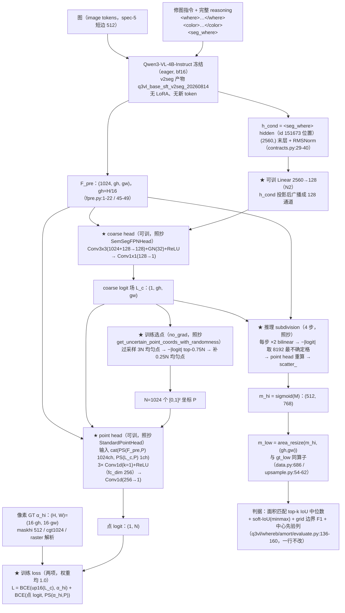

# 实验：PointRend 点采样分割头（EPR-020）

状态：提案（待用户定稿）。

本提案是**参考工作的忠实移植**：模型 = 冻结 Qwen3-VL 特征 + PointRend 全件（coarse head +
point head + 训练点采样 + 推理 subdivision），头结构、loss 组成、头超参、优化器一律照抄
原论文与 detectron2 原仓库；无法照搬处逐条标 **NOVEL** 并写理由。

**ST_LANG（ConvTower+FiLM+CondEncoder+UNIQ K=8+WTA+七项 loss+语言 LoRA r16 那一整套）
不是本提案被改动的 baseline，其部件一律不进本方案。** ST_LANG 的 0.77390 只作为 §4 结果表的
**指标对照行**出现。

外部行号以 2026-08-14 当日用 `curl` 拉下的 GitHub main 分支 raw 文件为准，逐个 `nl -ba` 核对
（URL 见文末来源清单）；本仓库行号以当前工作区（lens-exp 分支）为准，全部本次打开确认。

**红线注记（按用户 2026-08-14 指示）**：本战役「dice/IoU 禁入 loss」红线对本批提案解除，
参考工作用什么就忠实保留什么。本提案主臂照抄的 PointRend 点上 loss **本来就只有 BCE、没有
dice**（`point_head.py:73-75`）；dice 只出现在消融行②（Mask2Former 配方），已在该行标注。

---

## 1. 任务

本实验测试：把 where 分支的分割头整体换成 **PointRend**（arXiv 1912.08193，Kirillov / Wu /
He / Girshick；已打开 arXiv abs 页核实标题与作者），基座与判据不动。

- **数据**：train = local n=42752（sft2seg-20260804，`render_mode=="local"`，sha1 规则族切分）；
  eval = V_where local 400，headline 取 normal-only n=224。V_where/V_what/T_final 不进训练。
- **模型**：冻结 Qwen3-VL-4B-Instruct（v2seg 重训产物
  `/home/bc/data/runs/q3vl_base_sft_v2seg_20260814`，eager，bf16）出 `F_pre`（gh,gw,1024，最后
  vision block、merger 之前，`q3vl/where/fpre.py:1-22` 的协议 4.1；`grid_from_geometry` = H/16、
  W/16，`fpre.py:45-49`，典型 32×48）与 `h_cond`（`<seg_where>` token 位置的末层 + 最终 RMSNorm
  hidden，(2560,)，`q3vl/whereb/contracts.py:29-40` 的裁决 D-B2；口径全文见 §1.2）；
  这两个张量之上挂 PointRend 的 coarse head + point head，全部可训。
- **判据**：完全不动（§3 判据段），headline = 面积匹配 top-k IoU 中位数，normal-only。
- **指标对照行（不是结构 baseline，只用于把本臂的数字放到已有数字旁边）**：
  ST_LANG 0.77390（失败基线）、M0 0.79095、center prior 0.5088、随机地板 0.2582、
  oracle 0.9737、用户可用线 0.85。

### 1.1 忠实移植清单（照抄项 / NOVEL 项）

**照抄（原文数值 + 出处见 §3 超参表）**：coarse head 的卷积形制与初始化、point head 的 MLP
形制与初始化、`point_sample` 的 `2x−1` 坐标映射与 `align_corners=False`、训练选点
`get_uncertain_point_coords_with_randomness`（先采样后算不确定度）、TRAIN_NUM_POINTS /
OVERSAMPLE_RATIO / IMPORTANCE_SAMPLE_RATIO、点上 loss（二值 = `binary_cross_entropy_with_logits`）、
coarse head 自带的 dense loss（按 `SemSegFPNHead.losses` 的口径：先双线性升采到输入分辨率再算）、
推理 subdivision（每步 ×2 → 取最不确定的 num_points 格 → point head 重算 → `scatter_`）、
SUBDIVISION_NUM_POINTS、优化器 SGD/lr/momentum/wd/schedule。

**NOVEL（无法照搬，逐条给理由）**：

- **N1 细粒度特征源**：PointRend 用 FPN 的 `p2`（256 通道、stride 4，`Base-PointRend-Semantic-FPN.yaml:12`）。
  本处只有单尺度 `F_pre`（1024 通道、stride 16）。**不加投影层**——`StandardPointHead` 的通道数
  就是从 `input_shape.channels` 读的（`point_head.py:101`，`fc_dim_in = input_channels + num_classes`，
  L104），1024 落在其接口内，直接喂即可。
- **N2 语言条件注入**：PointRend 无文本输入。形制 = **`h_cond`（`<seg_where>` 位置的单条
  2560 维向量，§1.2）→ Linear(2560→128) → 广播成 128 个通道 → 与 F_pre 在通道维 concat 后进
  coarse head 的 3×3 conv**（不是点积、不是 FiLM）。point head 不额外接语言，它通过 `coarse_features` 通道看到
  指令——这正是 PointRend 自身的信息流（point head 的输入只有细粒度特征 + 粗预测，
  `point_head.py:124`）。
- **N3 coarse head 的 head_length**：`SemSegFPNHead` 用 `max(1, log2(stride) − log2(common_stride))`
  决定每个尺度的 conv 个数、并在 `stride != common_stride` 时逐次 ×2 上采
  （`detectron2/modeling/meta_arch/semantic_seg.py:193, 208-211`）。本处 coarse 场就出在 F_pre 网格上，
  即 stride == common_stride == 16，代进他们的公式得 head_length = max(1, 0) = 1、无上采样分支。
  这是把原公式代入本处 stride 的结果，不是另定的结构。
- **N4 SUBDIVISION_STEPS = 4**：语义配置写 2（`Base-PointRend-Semantic-FPN.yaml:14`），因为其 coarse
  场在 stride 4（`COMMON_STRIDE=4`，`defaults.py:413`），两次 ×2 恰好回到输入分辨率。本处 coarse
  场在 stride 16，回到像素 GT（spec-5 短边 512 = 16×32）需 4 次。保留其「细分到输入分辨率」的规则，
  数值随 stride 换算；字面值 2 与实例配置默认 5（`config.py:40`）列在决策注记。
- **N5 soft alpha 上的不确定度**：`−|logit|`（到 0.5 决策面的 L1 距离）本身**是 PointRend 自己的
  二值/类别无关分支**（`mask_head.py:43-49`，Mask2Former `criterion.py:85-87` 同式），不算新造；
  真正的适配点是：本处 GT 是连续 alpha（`.cgt` 的 smoothstep 过渡带，
  `dataset_build/src/construct/canonical_masks.py:120` 的 `α²(3−2α)`），所以 `sigmoid(logit)=0.5`
  的等值线与 GT 的 `α=0.5` 等值线不必重合。**不为此改公式**，原样保留 `−|logit|`。
- **N6 GT 点标签用双线性**：语义配置用 `mode="nearest"`（`semantic_seg.py:96`）是因为其 GT 是类别
  整数 id；本处 GT 是连续 alpha，按 Mask2Former 的同机制口径用**双线性** `point_sample`
  （`criterion.py:171-175`，点标签本来就是分数值、点上 sigmoid CE 直接收 float 目标）。
- **N7 基座冻结**：PointRend 的语义配置是 `FREEZE_AT: 0`（`Base-PointRend-Semantic-FPN.yaml:4-5`），
  即 backbone 全部可训。本处基座 Qwen3-VL 冻结、且不注入任何 LoRA——这是本战役的接口约定
  （§1「模型」行），不是对 PointRend 的调优。可训参数只有 coarse head + point head + N2 的投影。
- **N8 训练步数**：PointRend cityscapes 配置是 MAX_ITER 65000、STEPS (40000, 55000)
  （`pointrend_semantic_R_101_FPN_1x_cityscapes.yaml:17-18`）。本处 1200 步档（`--max-steps` 默认
  1200，`run_amort_arm.py:110`，U4 步数匹配）。**按里程碑占比换算**：0.6154 / 0.8462 → 738 / 1015 步；
  warmup 1000/65000 = 1.538% → 18 步（`WARMUP_FACTOR` 与 `WARMUP_METHOD` 照抄）。

### 1.2 语言条件读出

语言条件向量 `h_cond` = base SFT v2seg 模型输出中 **`<seg_where>` token 位置的 hidden**：

```
h_cond = norm(hidden_states[-1]) 在 <seg_where> token 位置上的那一行，形状 (2560,)
```

层与归一化按 `q3vl/whereb/contracts.py:30-32`（`SEGMENT_HIDDEN_LAYER = -1` /
`SEGMENT_HIDDEN_FINAL_NORM = True`），维度 2560。

**v2seg 规格**：assistant 输出形制为
`<where>…</where><color>…</color><seg_where><seg_color><|im_end|>\n`，两个 seg token **受监督**；
`<seg_where>` id 151673、`<seg_color>` id 151674，两者追加在词表末尾
（`q3vl/train/constants.py:22-23`；四个 tag token `<where>` 151669 / `</where>` 151670 /
`<color>` 151671 / `</color>` 151672 见 `q3vl/train/constants.py:11-14`，字面 id 记在
`q3vl/whereb/attnread.py:62-64`）；产物目录 `/home/bc/data/runs/q3vl_base_sft_v2seg_20260814`。

**接入要点**：
(a) 前向序列喂到 `<seg_where>`——序列 = prompt + 完整 reasoning（where span + color span +
`<seg_where>`），读出切片取 `<seg_where>` 所在的**单个位置**（下标在拼接时记录，不做搜索式定位）。
挂点：序列构造 `q3vl/whereb/hiddens.py:170`、切片 `q3vl/whereb/hiddens.py:234`。仍是一次
`no_grad` 前向同时出 `F_pre` 与语言侧 hidden。
(b) 基座 = v2seg 产物 `/home/bc/data/runs/q3vl_base_sft_v2seg_20260814`；genwhere 生成缓存按该
checkpoint 重生成（缓存 schema 逐条记 `checkpoint` 字段，`q3vl/whereb/gencontext.py:122, 168`）。

**依赖项（写死）**：v2seg 训练产物落盘 **且** genwhere 缓存按 v2seg 重生成完成之前，**本臂不可
开跑**（2026-08-14 当日 `ls /home/bc/data/runs/` 未见 `q3vl_base_sft_v2seg_20260814`）。
v2seg 未就绪时的起跑档见 §5 待决策 8。

**本臂的条件消费点**：N2 的语言条件 `c = h_cond`，其后 `Linear(2560→128)` → 广播成 128 通道 →
与 `F_pre` 在通道维 concat 进 coarse head 的 3×3 conv；point head 只通过 `coarse_features`
通道看到指令。

**`<seg_color>`**：归 what 分支使用，**本批六臂不消费**（见 §5 待决策 9）。

读出方式的其余档（`<where>` span 池化、`</where>` / `</color>` / `<|im_end|>` 位置、可学习
query token、K > 1 的多 seg token）在 §4 读出方式消融组统一出数。

---

## 2. 模型图与数学公式



### 2.1 数学公式（训练）

记 `F ∈ R^{1024×gh×gw}` = F_pre，`h_cond ∈ R^{2560}` = `<seg_where>` 位置的末层 + RMSNorm
hidden（§1.2），`α_hi ∈ [0,1]^{H×W}` = 像素 GT（H = 16·gh，W = 16·gw），`PS(·, P)` =
`point_sample`（`point_features.py:19-42`：`grid_sample(input, 2·P − 1, align_corners=False)`）。

条件与粗场：

```
c   = h_cond                                         ∈ R^2560          (§1.2 语言条件读出)
g   = W_c c + b_c                                    ∈ R^128           (N2)
Z   = ReLU( GroupNorm_32( Conv3x3( [F ; g⊗1_{gh×gw}] ) ) )   ∈ R^{128×gh×gw}
L_c = Conv1x1(Z)                                     ∈ R^{1×gh×gw}
```

训练选点（`no_grad`，照抄 `point_features.py:63-116`；`U(l) = −|l|` 照抄 `mask_head.py:49`）：

```
P_cand ~ U([0,1]²)^{⌊k·N⌋},  k = 3                     (OVERSAMPLE_RATIO)
l_cand = PS(L_c, P_cand)
P_imp  = P_cand[ top_{⌊β·N⌋} ( −|l_cand| ) ],  β = 0.75  (IMPORTANCE_SAMPLE_RATIO)
P_rnd  ~ U([0,1]²)^{N − ⌊β·N⌋}
P      = [P_imp ; P_rnd],  |P| = N = 1024
```

> 顺序不可换：先采样、再在**点 logit** 上算不确定度。两个 ±1 logit 的格点之间插值出的 0 logit
> 点其不确定度是 0；若先在粗图上算再采样，该点会被记成 −1（`point_features.py:92-98` 原注释）。

点头与两项 loss（`1_{,}` 为逐元素；`up16` = 双线性 ×16，照抄 `SemSegFPNHead.losses`
`semantic_seg.py:255-266` 的「先升采到输入分辨率再算 dense loss」口径）：

```
x_0   = [ PS(F, P) ; PS(L_c, P) ]                     ∈ R^{1025×N}
x_j   = ReLU( Conv1d_{k=1}(x_{j−1}) ),  j = 1..3,  out = 256
l_p   = Conv1d_{k=1}(x_3)                             ∈ R^{1×N}
a_p   = PS(α_hi, P)                                   ∈ R^{1×N}        (双线性, N6)

L_coarse = BCEwithLogits( up16(L_c), α_hi ).mean()                     (LOSS_WEIGHT 1.0)
L_point  = BCEwithLogits( l_p, a_p ).mean()                            (权重 1.0)
L        = L_coarse + L_point
```

主臂 loss 里**没有 dice、没有 IoU、没有 SDF/area/sep/fake/cls/sel**——PointRend 的语义配置就是
「coarse head 自己的 dense loss + 点上的一项 loss」两项（`semantic_seg.py:72, 102-104`），照搬。

**`is_fake`（foreign 指令）样本在本臂两项 loss 下的政策（写死，不静默）**：`fake_prob = 0.15`
（`q3vl/whereb/amort/losses.py:74`，掷签在 `q3vl/whereb/amort/trainer.py:383`）。本臂不建现役七项栈，
因此**不走** `empty_mask` 项（`q3vl/whereb/amort/losses.py:286-291`）。保守默认 = 把 fake 样本的
`α_hi` **整张置零**，再照上面两项 BCE 原式算，**不排除、不加权、不改公式**。数值行为逐条写明：
(a) 训练选点不受影响——`get_uncertain_point_coords_with_randomness` 的不确定度 `U(l) = −|l|`
（`point_features.py:88-116`、`mask_head.py:43-49`）**只读预测 logit、不读 GT**，全零 GT 下选点分布
与真 GT 样本同分布；(b) 点标签 `a_p = PS(α_hi, P) ≡ 0`，`BCEwithLogits(l_p, 0)` = `softplus(l_p)`
的点均值，有定义，梯度把点 logit 推向负；(c) dense 项 `BCEwithLogits(up16(L_c), 0)` 同理；
(d) 两项都没有除以 GT 面积的因子，故不存在空 GT 除零；(e) 推理 subdivision 与 GT 无关，不受影响。
fake 样本数与其 `L_coarse` / `L_point` 分开计数落 `steps.jsonl`。**这是 NOVEL 政策**：PointRend 的
语义配置 GT 是类别 id 图（`semantic_seg.py:96` 的 `mode="nearest"`），没有「空 GT」这一形态，
无原文可抄。备选（把 fake 样本排除出本臂两项 loss 并计数）见 §5 待决策 6。

### 2.2 数学公式（推理，subdivision）

照抄 `semantic_seg.py:106-134`（粗特征始终从**原始** `L_c` 采，不从升采后的 M 采）：

```
M ← L_c                                                     # (1, gh, gw)
repeat S = 4 次:                                            # N4
    M ← bilinear_×2(M)
    idx, P ← top_{8192} 最不确定格 of −|M|                   # get_uncertain_point_coords_on_grid
    l' ← PointHead( PS(F, P), PS(L_c, P) )
    M.reshape(1, HW).scatter_(1, idx, l')
m_hi  = sigmoid(M)                                          # (512, 768)
m_low = area_resize(m_hi[None,None], (gh, gw))[0,0]         # 进判据的量
```

`m_low` 的算子与 `gt_low` **同一个**：`gt_low = area_resize(gt_hi[None,None], (gh,gw))[0,0]`
（`q3vl/whereb/amort/data.py:686`），`area_resize` 在 `q3vl/where/upsample.py:54-62`（下采 = `mode="area"`）。
判据侧读的就是 `out["m_low"]`（`q3vl/whereb/amort/evaluate.py:136`），因此 evaluate 一行不用改。

推理不依赖 `guide_hi`：eval 路径 `want_hi=False`（`run_amort_arm.py:789, 850, 864`），像素分辨率
一律由 `(16·grid_h, 16·grid_w)` 算出，不从 luma guide 的形状推。

---

## 3. 改动怎么接进来（逐条可确认）

| 项 | 内容 |
|---|---|
| 改哪里 | ① **新文件 `q3vl/whereb/amort/pointrend.py`**（新头，全部可训）：`point_sample`（照抄 `point_features.py:19-42`）、`get_uncertain_point_coords_with_randomness`（照抄 `point_features.py:63-116`）、`get_uncertain_point_coords_on_grid`（照抄 `point_features.py:119-140+`）、`calculate_uncertainty = −|logit|`（照抄 `mask_head.py:43-49`）、`CoarseHead`（照抄 `SemSegFPNHead` 的单尺度形制：`Conv3x3(in→128, padding=1, bias=False)` + `GroupNorm(32,128)` + `ReLU` + `Conv1x1(128→1)`，`semantic_seg.py:196-215`；N2 的 `Linear(2560→128)` 在此文件内）、`StandardPointHead`（照抄 `point_head.py:94-129`）、`subdivision_infer`（照抄 `semantic_seg.py:106-134`）、`pointrend_losses`（两项 BCE，§2.1）。**不 import 任何 ST_LANG 部件**（`uniq*.py` / `heads.py` 的 ConvTower/FiLM/CondEncoder 一个都不进）。② **`q3vl/whereb/amort/model.py`**：`ARMS` 增加 `"PRND"`（当前 `model.py:30` = `("P1","P3prime","SHAPE3","UNIQ")`），`__init__` 增一个 `elif arm == "PRND": self.geo = PointRendHead(...)` 分支（`model.py:118-133` 一带），`forward_geo` 增一个 `if self.arm == "PRND":` 分支（`model.py:279` 一带的写法）：训练时返回 `{"prnd": {...}, "m_low": ...}`，推理时跑 subdivision 并把 `m_low = area_resize(sigmoid(M), (gh,gw))` 放进 `out`。**该分支不走 `CondEncoder`**——`h_cond` 由 `forward_geo` 已有的语言侧 hidden 形参（`model.py:236-237`）取 `<seg_where>` 位置的那一行得到（§1.2），pooled `cond` 在本臂不使用；`CondEncoder`（`q3vl/whereb/amort/model.py:111` 现为无条件构造）构造后对 `self.cond` 调 `requires_grad_(False)`、不进优化器，可训参数清单落盘核对。②′ **四族全部走新头（本批六份提案统一口径）**：启动命令固定带 `--no-semantic-head`（`q3vl/whereb/scripts/run_amort_arm.py:205`）+ `--no-sim-field`（`:121`）+ `--no-film`（`:123`）；`--no-semantic-head` 使 `model.sem is None`，路由判断（`q3vl/whereb/amort/trainer.py:101`、`q3vl/whereb/amort/evaluate.py:124` 的 `if x.route_semantic and model.sem is not None:`）自然把 **semantic 族样本也送进 `forward_geo`**，即 semantic 族与 radial/band/linear 三族同样进 PointRend 的 coarse head + point head 训练与评测；`SemanticHead`（自带 FiLM，`q3vl/whereb/amort/heads.py:416`）**不构造 / 不训练**。semantic 族的像素 GT 走 `--prnd-gt maskhi` 的既有 `.maskhi` 通路（无解析参数，与消融行③的 `analytic` 档同样回退 maskhi 并计数）。备选（保留语义头旧路由）见 §5 待决策 6。③ **`q3vl/whereb/amort/trainer.py`**：`compute_micro_batch` 在 `if "uniq" in out:`（`trainer.py:133`）之前加 `if "prnd" in out:` 分支，调 `pointrend_losses(...)` 得 `AmortLoss`（`losses.py:265`），`terms = {"coarse": ..., "point": ...}`；`AmortTrainer.__init__` 的优化器构造（`trainer.py:271-283`）按 `cfg.optimizer` 分派 SGD/AdamW（见超参表）。④ **数据侧（零新代码路径，只拨开关）**：`want_hi=True` 传给两个 `AmortBatchBuilder`（`run_amort_arm.py:510-527` 的 `common`，`data.py:336` 默认 False）与 `AmortTrainer`（`run_amort_arm.py:664-665`，`trainer.py:236` 默认 False）。`gt_hi` 管道**已存在**：`data.py:685` `s.mask_target_hi().float()`（`q3vl/whereb/data.py:102-117`，local 样本 = `.maskhi` 投影，spec-5 分辨率短边 512，`q3vl/where/maskdata.py:202-219`、`264-278`；maskviews 只读根 `/mnt/nfs-ro/bc/data/datasets/where_a-20260805/maskviews/`，`q3vl/where/config.py:225`），`data.py:702` 在 `want_hi=True` 时放进 `AmortSampleInputs.gt_hi`（字段 `data.py:306`）。⑤ **`q3vl/whereb/scripts/run_amort_arm.py`**：`--arm` 的 `choices` 加 `"PRND"`（`run_amort_arm.py:90-91`），新旗标区（见「入口」行）。⑥ **读出接缝（§1.2）**：`q3vl/whereb/hiddens.py:170` 的序列构造喂完整 reasoning 到 `<seg_where>` 为止、`q3vl/whereb/hiddens.py:234` 的切片取 `<seg_where>` 单个位置，两处由一个读出旗标统一分派；基座路径（`run_amort_arm.py:92-93, 99`）与 genwhere 缓存取 v2seg 档。旗标（默认值 = 主臂口径）：`--readout seg_where`（choices：`seg_where` / `where_span_pool` / `where_close` / `color_close` / `im_end` / `qtok`，对应 §4 读出方式消融组 ⑨-1 / ⑥ / ⑦-a / ⑦-b / ⑧）、`--readout-qtok K`（默认 0；`qtok` 档取 1 / 4 / 8，机制照 `q3vl/whereb/amort/uniq4.py:76` / `:79` / `:113` / `:148`）、`--readout-nseg K`（默认 1；K>1 需对应 SFT 变体重训，占位）。旗标值、`<seg_where>` 的解析下标、基座 checkpoint 路径与 genwhere 缓存的 `checkpoint` 字段一并写进 `run_setup.json`；启动时断言「缓存的 `checkpoint` 字段 == 本次基座路径」，不一致即拒绝开训。 |
| 不变（明确列出没动的部分） | **基座**：Qwen3-VL-4B-Instruct 冻结、eager、bf16、无 LoRA、主臂无新 token（读出方式消融组 ⑧ 的可学习 query 档是唯一例外，走 uniq4 机制）。基座 checkpoint 取 v2seg 产物 `/home/bc/data/runs/q3vl_base_sft_v2seg_20260814`（`run_amort_arm.py:92-93, 99` 的默认值）、genwhere 缓存按该 checkpoint 生成，`hiddens.py:170` 的序列构造与 `:234` 的切片按 §1.2 的读出口径接线。 **数据管线**：`AmortBatchBuilder` 的取样、上下文（teacher/generated 混合 0.5）、fake 掷签、shuffle/foreign 索引、sim 场、sha1 切分——只多拨一个 `want_hi`。**评测全套**：`q3vl/whereb/amort/evaluate.py` 一行不改（读 `out["m_low"]`，`q3vl/whereb/amort/evaluate.py:136`）；判据函数 `soft_iou_value`/`topk_mask`/`gt_area_k`/`hard_iou`/`grid_boundary_f1`/`center_prior_field`/`paired_delta`（`q3vl/whereb/metrics.py:88, 127, 142, 200, 209, 147, 244`）与 `random_floor`（`q3vl/whereb/amort/evaluate.py:78-81`）不动。**步数/批**：1200 步（`run_amort_arm.py:110`）、有效 batch 32 / micro 8（`run_amort_arm.py:105-106`）、seed 20260810（`run_amort_arm.py:115`）、bf16 autocast（`trainer.py:284-288`；点采样与 loss 在 `no_autocast` 的 fp32 下算，同 `model.py:289` 的既有做法）。**checkpoint 选择**：quick-eval 硬门 + `local_soft_iou_median`，永不读 val loss（`trainer.py:492-506`）。**语义路由的判定代码**：`if x.route_semantic and model.sem is not None:`（`q3vl/whereb/amort/trainer.py:101`、`q3vl/whereb/amort/evaluate.py:124`）一字不改。 |
| 初始化（step0 状态） | 全部照抄参考工作，**不要求与任何既有臂逐位等价**（本臂是新结构，不是既有臂的修改）。`CoarseHead` 的 3×3 conv 与 1×1 predictor：`c2_msra_fill`（`semantic_seg.py:206, 215`）。`StandardPointHead` 的 3 层 `Conv1d`：`c2_msra_fill`；末层 `predictor` 权重 `N(0, 0.001²)`、bias 0（`point_head.py:116-121`）。N2 的 `Linear(2560→128)`：`c2_xavier_fill`（与 PointRend 里 FC 层同款，`mask_head.py:118`）。**step0 数值**：point head 的 predictor 近零 → 点 logit ≈ 0 → 点上 `sigmoid ≈ 0.5`；coarse predictor 是 msra 填充**不是零初始化**（照抄；PointRend 没有零初始化 coarse predictor），所以 step0 的 coarse 场不是常数场——这条要记进 run_setup，不要事后当成 bug。**RNG 纪律（N1 教训）**：选点的 `torch.rand` 一律走独立 `torch.Generator`（seed = `cfg.seed + 314`，记录进 run_setup），绝不触碰全局 RNG 流——否则每步多消费一次全局 RNG，训练采样次序、fake 掷签全部漂移，与对照行的步数匹配比较作废。**对齐单测（提交前必须过）**：(a) 以像素中心坐标 `((u+0.5)/W, (v+0.5)/H)` 对 `α_hi` 做 `point_sample`，须逐位还原 `α_hi[v,u]`（验证 `2x−1` 映射 + `align_corners=False` 两处一致；错一处整场半格错位，32×48 上半格 = 8 px）；(b) 解析族样本：`raster_geometry` 在 (H,W) 渲染后于整格中心点采样，与 (gh,gw) 直接渲染的对应值之差在插值误差界内（验证 α_hi 与 coarse 场共享同一 [0,1]² 图域——spec-5 的 H = 16·gh、W = 16·gw 是整数倍，`fpre.py:45-49`，无 pad 缝，`trainer.py:90-97` 的 no-pad 断言先例）；(c) subdivision 4 步后 M 的形状恰为 (H, W)，不靠 resize 补齐。 |
| 入口（旗标；不选 = 不影响现有任何臂） | **`--arm PRND`**：`ARMS`/`choices` 新增一项；不选则 `pointrend.py` 根本不被 import，P1/P3prime/SHAPE3/UNIQ 四臂的代码路径、RNG 消费、显存全部逐位不变。旗标（默认值 = 忠实移植值）：**`--prnd-train-points`** 1024、**`--prnd-oversample`** 3.0、**`--prnd-importance`** 0.75、**`--prnd-fc-dim`** 256、**`--prnd-num-fc`** 3、**`--prnd-coarse-dim`** 128、**`--prnd-coarse-pred-each-layer`**（store_true，默认关 = 语义配置的 False）、**`--prnd-subdiv-steps`** 4、**`--prnd-subdiv-points`** 8192、**`--prnd-point-loss`** `bce`（choices: `bce` / `m2f`）、**`--prnd-gt`** `maskhi`（choices: `maskhi` / `cgt1024` / `analytic`）、**`--prnd-no-subdivision`**（store_true）、**`--prnd-optimizer`** `sgd`（choices: `sgd` / `adamw`）、**`--prnd-lr`** 0.01、**`--prnd-momentum`** 0.9、**`--prnd-wd`** 1e-4、**`--prnd-warmup-iters`** 18、**`--prnd-milestones`** `738,1015`、**`--prnd-gamma`** 0.1。**运行时断言（判据红线）**：`aggregate` 自动把 `L_coarse`/`L_point` 落进 steps.jsonl（`losses.py:539-542` 机制）；`assert_criteria_ran`（`q3vl/whereb/amort/evaluate.py:313-368`，`run_amort_arm.py:724, 740` 已接线）扩三条——**(0) `required` 表登记**：`q3vl/whereb/amort/evaluate.py:331` 的 `required` 字典（现为 `{"SHAPE3": ["shape_residual"], "UNIQ": ["uniq_best"]}`）**必须**加 `"PRND": ["prnd_point_readout"]`，只加 `--arm` choices 不加这一项 = 运行时断言对新 arm 变成空要求（本战役已三次栽在「定义了没接线」）。`prnd_point_readout` 为本臂预注册诊断聚合列，聚合口径与其余新臂同一套（`criteria_columns` 挂载，`q3vl/whereb/amort/evaluate.py:558-573` 同款写法），列内容 = 像素级 soft-IoU（minmax，`q3vl/whereb/metrics.py:88-105` 同式，pred 取 subdivision 的 `m_hi`）+ 面积匹配 top-k IoU + grid 边界 F1（tol=1）+ 同支撑面的中心先验列 + 随机 top-k 地板 `a/(2−a)`；`n = 0` 拒绝出板；(i) `--arm PRND` 而 steps.jsonl **第一行**没有 `L_point` 与 `L_coarse` 列 → 拒绝出板（「定义了没接线」已三次，第一行查、不等跑完）；(ii) 板上没有 `headline_normal_only`（`q3vl/whereb/amort/evaluate.py:454-468`）→ 拒绝出板。所有旗标进 `run_setup.json` 与 `loss_preregistration.json`（`run_amort_arm.py:688-706`），`loss_preregistration.json` 的 `form` 改写为 `L = 1.0*BCE(up16(coarse), alpha_hi) + 1.0*BCE(points, PS(alpha_hi))`，并显式记 `dice_in_loss: False`（主臂）/`True`（消融行②，附「按用户 2026-08-14 指示忠实移植 Mask2Former 配方」注记）。 |

### 3.1 忠实移植的 loss / 超参数表（原文数值 + 出处）

外部路径前缀：`d2` = `facebookresearch/detectron2`（`projects/PointRend/point_rend/` 下的文件直接写文件名）；
`m2f` = `facebookresearch/Mask2Former`。

| 项 | 原文数值 | 出处（文件:行） |
|---|---|---|
| coarse head 结构 | 每尺度 `Conv3x3(in→conv_dims, pad=1, bias=not norm, norm=GN, act=ReLU)`，末 `Conv2d(conv_dims→num_classes, k=1)` | d2 `detectron2/modeling/meta_arch/semantic_seg.py:196-215` |
| coarse head 名 | `COARSE_SEM_SEG_HEAD_NAME = "SemSegFPNHead"` | `config.py:48`；`configs/SemanticSegmentation/Base-PointRend-Semantic-FPN.yaml:16` |
| `SEM_SEG_HEAD.CONVS_DIM` | 128 | d2 `detectron2/config/defaults.py:411` |
| `SEM_SEG_HEAD.NORM` | `"GN"` = `nn.GroupNorm(32, channels)` | `defaults.py:415`；d2 `detectron2/layers/batch_norm.py:189` |
| `SEM_SEG_HEAD.COMMON_STRIDE` | 4 | `defaults.py:413` |
| `SEM_SEG_HEAD.LOSS_WEIGHT` | 1.0 | `defaults.py:416` |
| coarse dense loss 口径 | 先 `F.interpolate(pred, scale_factor=common_stride, mode="bilinear", align_corners=False)` **再**算 loss，`reduction="mean"`，乘 `loss_weight` | `semantic_seg.py:255-266` |
| coarse head 初始化 | `weight_init.c2_msra_fill(conv)`；predictor 同 | `semantic_seg.py:206, 215` |
| point head 结构 | `num_fc` 个 `Conv1d(k=1,s=1,p=0,bias=True)` + `F.relu`，末 `Conv1d(fc_dim_in→num_mask_classes, k=1)` | `point_head.py:106-114, 123-129` |
| point head 输入 | `torch.cat((fine_grained_features, coarse_features), dim=1)`；`fc_dim_in = input_channels + num_classes` | `point_head.py:124, 104` |
| `POINT_HEAD.FC_DIM` | 256 | `config.py:43`；`Base-PointRend-Semantic-FPN.yaml:10` |
| `POINT_HEAD.NUM_FC` | 3 | `config.py:44`；`Base-PointRend-Semantic-FPN.yaml:11` |
| `POINT_HEAD.COARSE_PRED_EACH_LAYER` | 语义配置 **False**；仓库默认（实例配置用）True | `Base-PointRend-Semantic-FPN.yaml:17`；`config.py:47` |
| point head 初始化 | fc 层 `c2_msra_fill`；predictor `nn.init.normal_(w, std=0.001)`、`bias=0` | `point_head.py:116-121` |
| `point_sample` | `F.grid_sample(input, 2.0*coords − 1.0, **kwargs)`，调用处一律 `align_corners=False` | `point_features.py:39`；调用 `semantic_seg.py:82, 86, 93-98` |
| 训练选点 | 均匀撒 `int(N*k)` 候选 → 点 logit 上算不确定度 → top `int(β*N)` → 补 `N − int(β*N)` 均匀点 | `point_features.py:88-116` |
| 「先采样再算不确定度」 | 原注释：先在粗图上算会把插值出的 0 logit 点错记成 −1 不确定度 | `point_features.py:92-98` |
| `TRAIN_NUM_POINTS` | 语义 base **1024**；cityscapes 覆写 2048；实例默认 `14*14`=196 | `Base-PointRend-Semantic-FPN.yaml:13`；`pointrend_semantic_R_101_FPN_1x_cityscapes.yaml:10`；`config.py:32` |
| `OVERSAMPLE_RATIO` | **3** | `config.py:35` |
| `IMPORTANCE_SAMPLE_RATIO` | **0.75** | `config.py:38` |
| 不确定度（二值/类别无关） | `−(torch.abs(gt_class_logits))` | `mask_head.py:43-49` |
| 点上 loss（二值） | `F.binary_cross_entropy_with_logits(mask_logits, gt.to(float32), weight=~ignores, reduction="mean")`（**无 dice**） | `point_head.py:73-75` |
| 点上观察量 | `point/accuracy`（`logits>0` 与 GT 的一致率） | `point_head.py:67-71` |
| `SUBDIVISION_STEPS` | 语义 base **2**；仓库默认 5 | `Base-PointRend-Semantic-FPN.yaml:14`；`config.py:40` |
| `SUBDIVISION_NUM_POINTS` | 语义 base **8192**；仓库默认 `28*28`=784 | `Base-PointRend-Semantic-FPN.yaml:15`；`config.py:42` |
| subdivision 推理 | `interpolate(scale_factor=2, bilinear, align_corners=False)` → `get_uncertain_point_coords_on_grid` → point head（粗特征从**原始** coarse 场采）→ `scatter_` | `semantic_seg.py:106-134`（粗特征 L122-124） |
| 优化器 | `torch.optim.SGD` | d2 `detectron2/solver/build.py:139` |
| `BASE_LR` | **0.01** | `pointrend_semantic_R_101_FPN_1x_cityscapes.yaml:16` |
| `MOMENTUM` | **0.9** | `defaults.py:534` |
| `NESTEROV` | False | `defaults.py:536` |
| `WEIGHT_DECAY` | **0.0001** | `defaults.py:538` |
| `WEIGHT_DECAY_NORM` | **0.0**（norm 层的仿射参数不加 wd） | `defaults.py:541` |
| `LR_SCHEDULER_NAME` | `WarmupMultiStepLR` | `defaults.py:526` |
| `GAMMA` | 0.1 | `defaults.py:543` |
| `STEPS` / `MAX_ITER` | (40000, 55000) / 65000 | cityscapes yaml `:17-18` |
| `WARMUP_FACTOR` / `WARMUP_ITERS` / `WARMUP_METHOD` | 1/1000 / 1000 / `"linear"` | `defaults.py:549-551` |
| `IMS_PER_BATCH` | 32 | cityscapes yaml `:19` |
| `CLIP_GRADIENTS.ENABLED` / `AMP.ENABLED` | False / False | `defaults.py:580, 595` |
| `BACKBONE.FREEZE_AT` | 0（全可训） | `Base-PointRend-Semantic-FPN.yaml:4-5` |

**第二参考（只进消融行②，不进主臂）—— Mask2Former（arXiv 2112.01527，Cheng/Misra/Schwing/Kirillov/Girdhar，已打开 arXiv abs 页核实）**：

| 项 | 原文数值 | 出处 |
|---|---|---|
| `TRAIN_NUM_POINTS` | `112*112` = **12544** | m2f `mask2former/config.py:108`；`configs/coco/instance-segmentation/maskformer2_R50_bs16_50ep.yaml:36` |
| `OVERSAMPLE_RATIO` / `IMPORTANCE_SAMPLE_RATIO` | 3.0 / 0.75 | m2f `config.py:111, 114` |
| `MASK_WEIGHT`（点上 sigmoid CE） | **5.0** | `maskformer2_R50_bs16_50ep.yaml:24` |
| `DICE_WEIGHT` | **5.0** | `maskformer2_R50_bs16_50ep.yaml:25` |
| 点上 CE 形式 | `binary_cross_entropy_with_logits(..., reduction="none").mean(1).sum()/num_masks` | m2f `mask2former/modeling/criterion.py:63-65` |
| dice 形式 | `p=sigmoid(l)`；`1 − (2·Σ(p·t) + 1)/(Σp + Σt + 1)`，`.sum()/num_masks` | m2f `criterion.py:35-40` |
| GT 点标签 | 双线性 `point_sample`（目标本来就是分数值） | m2f `criterion.py:171-175` |
| 不确定度 | `−|logit|` | m2f `criterion.py:73-87` |

### 3.2 判据（预注册，随对照行冻结，一个不换）

V_where local 400，generated，**normal-only headline**（`.contexts.*.headline_normal_only`，
`q3vl/whereb/amort/evaluate.py:452-468`；禁用顶层 pooled `.baselines`），n=224，
**面积匹配 top-k IoU 中位数**。三列套装缺一不可：soft-IoU（minmax 形式，`q3vl/whereb/config.py:163`）
+ grid 级边界 F1（tol = 1 cell，`q3vl/whereb/config.py:265`）+ 中心先验列（任何定位主张出示配对 Δ+p）。
随机 top-k 地板 `a/(2−a)`（`q3vl/whereb/amort/evaluate.py:78-81`）并排。与对照行做 **1200 步步数匹配**的逐样本配对 +
sign-flip permutation 1e4（`q3vl/whereb/metrics.py:244`）。**AUC 禁用**；像素级 3px 边界 F1 禁作判据。
按 family（radial/band/linear/semantic）与 area/mask_type 分层报。指令条件性：同图配对差分 +
三负控制（`shuffled` / `irrelevant_words` / `fixed_phrase`，`q3vl/whereb/config.py:269`，
`q3vl/whereb/amort/evaluate.py:521` 已产 `delta_vs_*`），**每个消融行必带 Δ_const 与 Δ_shuffle**。
eval 启动时 `assert_criteria_ran` 校验判据函数被调用（§3「入口」行的三条扩充：`required` 表
（`q3vl/whereb/amort/evaluate.py:331`）登记 `"PRND": ["prnd_point_readout"]` + steps.jsonl 首行
带 `L_point` / `L_coarse` + 板上带 `headline_normal_only`）。

**读出列（诊断，不进 headline，失败不得毁掉已落盘的 headline）**：(a) 像素级 soft-IoU（minmax，
同 `metrics.py:88-105` 公式，pred 取 subdivision 的 `m_hi`）；(b) GT 过渡带（0.05 < α < 0.95）内的
`|α_pred − α_gt|` 均值；(c) 训练侧每步 `L_point / L_coarse` 与 PointRend 的 `point/accuracy`
观察量（`point_head.py:67-71`）；(d) 每步实际参与 loss 的点数与被 importance 采中的点数。

**显存**：`PS(F_pre, P)` 在 N=1024 时 = 1024×1024 fp32 ≈ 4 MB/样本，micro-batch 8 ≈ 32 MB；
coarse dense loss 的 `up16(L_c)` = 512×768 fp32 ≈ 1.5 MB/样本；`gt_hi`（512 档）≈ 1.5 MB/样本；
subdivision 推理峰值 = 一张 512×768 fp32 场 + 8192 点。均不触动「已占 + 新任务峰值 < 65 GB」共存规则。

---

## 4. 结果（做完补，消融行全填这里）

（口径：headline = 面积匹配 top-k IoU 中位数，generated + normal-only，n=224，
配对 sign-flip permutation 1e4。全行 1200 步步数匹配。按 family 分层与三负控制随每行并报。）

**指标对照行（既有数字，不是本臂的结构 baseline）**：ST_LANG 0.77390 ｜ M0 0.79095 ｜
center prior 0.5088 ｜ 随机地板 0.2582 ｜ oracle 0.9737 ｜ 用户可用线 0.85

**主臂 · PointRend 忠实配方**（coarse head 128ch/GN32 + point head 256×3；N=1024，oversample 3.0，
importance 0.75，COARSE_PRED_EACH_LAYER=False；loss = BCE(up16 coarse) + BCE(points)，权重 1.0/1.0；
subdivision 4 步 × 8192 点；SGD lr 0.01 / momentum 0.9 / wd 1e-4 / WarmupMultiStepLR
(18, 738, 1015, γ=0.1)；GT = maskhi 512）：

top-k IoU = ___（vs center prior 配对 Δ = ___，p = ___）；soft-IoU = ___；grid 边界 F1 = ___；
随机地板 = ___；Δ_shuffle = ___；Δ_irrelevant = ___；Δ_fixed = ___

**消融行（对忠实配方的偏离，不另立提案；每行只列数字）**：

- ① 点数档位：N = 196（PointRend 实例配置默认 `14*14`，`config.py:32`）→ ___；
  N = 2048（PointRend cityscapes 覆写值，cityscapes yaml `:10`）→ ___
  （两行的 Δ_const / Δ_shuffle：___ / ___）
- ② 点上 loss 换 Mask2Former 配方（N = 12544，点上 `5.0·sigmoid_CE + 5.0·dice`，
  形式照抄 m2f `criterion.py:35-40, 63-65, 183-186`；**按用户 2026-08-14 指示忠实移植，
  本行含 dice**）→ ___（Δ_const / Δ_shuffle：___ / ___）
- ③ GT 源：`cgt1024`（`.cgt.png` 短边 1024，loader `q3vl/where/maskdata.py:180-190`，
  nfs-ro 只读分片）→ ___；`analytic`（radial/band/linear 用 `ConstructGeomStore`
  （`data.py:96-169`，sqlite = `q3vl/whereb/config.py:321`）的几何参数按
  `dataset_build/src/construct/canonical_masks.py:98-123` 的解析式直接在采样点 (x,y) 上求 α 精确值；
  **semantic 族无解析参数，回退 maskhi 并把回退计数写进 `facts()`**）→ ___
  （两行的 Δ_const / Δ_shuffle：___ / ___）
- ④ 去 subdivision（`--prnd-no-subdivision`：推理只出 coarse 场，`m_low = sigmoid(L_c)`，
  point head 只在训练时用）→ ___（Δ_const / Δ_shuffle：___ / ___）
- ⑤ 优化器换本仓库既有配方（AdamW lr 3e-4、wd 0.01 仅 dim>1、warmup 3%、cosine，
  `trainer.py:40-54, 271-283`），其余全部保持忠实配方 → ___（Δ_const / Δ_shuffle：___ / ___）

**读出方式消融组**——骨干
固定取本臂**当前结果最好的模型形态**（其余结构、loss、优化器、步数全部保持该形态不动），
**只改「语言条件从哪里读」这一处**（即 N2 的 `c` 从哪来）；每行同样给 headline、配对 Δ 与 p，
并各自带 Δ_const / Δ_shuffle。

| 行 | 读出口径 | 旗标 | 起跑依赖 | headline | 配对 Δ | p | Δ_const | Δ_shuffle |
|---|---|---|---|---|---|---|---|---|
| ⑥ | `<where>` span 池化：含 `<where>` / `</where>` 两个标签 token 的 T 行 mean-pool（前向序列喂到 `</where>` 为止，切片取该段 T 行；span 边界按 `q3vl/whereb/context.py:224-232` 的 `extract_segment`，切到第一个 `</where>` 并含该标签） | `--readout where_span_pool` | 口径本身不依赖 v2seg（checkpoint-4976 上即可跑）；与主臂配对比较时在同一基座上跑 | ___ | ___ | ___ | ___ | ___ |
| ⑦-a | special token 位置档：`</where>`（id 151670）单 token hidden | `--readout where_close` | **不依赖 v2seg**——该 token 在 checkpoint-4976 的输出里已存在 | ___ | ___ | ___ | ___ | ___ |
| ⑦-b | special token 位置档：`</color>`（id 151672）单 token hidden | `--readout color_close` | 同上（checkpoint-4976 输出末尾依次是 `</where>` → color span → `</color>` → `<\|im_end\|>`） | ___ | ___ | ___ | ___ | ___ |
| ⑦-c | special token 位置档：`<\|im_end\|>`（id 151645，受监督）单 token hidden | `--readout im_end` | 同上 | ___ | ___ | ___ | ___ | ___ |
| ⑧-1 | 可学习 query token 读出，`K_q = 1`（uniq4 词表扩展 + embedding forward hook，`q3vl/whereb/amort/uniq4.py:76` / `:79` / `:113`；query id **追加在完整输出之后**，追加写法同 `uniq4.py:148` 的 `where_ids + q_ids`） | `--readout qtok --readout-qtok 1` | 机制不依赖 v2seg（词表扩展 + hook 与基座版本无关） | ___ | ___ | ___ | ___ | ___ |
| ⑧-4 | 同上，`K_q = 4` | `--readout qtok --readout-qtok 4` | 同上 | ___ | ___ | ___ | ___ | ___ |
| ⑧-8 | 同上，`K_q = 8` | `--readout qtok --readout-qtok 8` | 同上 | ___ | ___ | ___ | ___ | ___ |
| ⑨-1 | special token 数量档：where 读出 token `K = 1`（= 主臂默认，单个 `<seg_where>`） | `--readout seg_where --readout-nseg 1` | v2seg | ___ | ___ | ___ | ___ | ___ |
| ⑨-2 | 同上，`K = 2` | `--readout seg_where --readout-nseg 2` | **需对应 SFT 变体重训**（v2seg 只监督 1 个 `<seg_where>`），**占位不排期** | ___ | ___ | ___ | ___ | ___ |
| ⑨-4 | 同上，`K = 4` | `--readout seg_where --readout-nseg 4` | 同上，**占位不排期** | ___ | ___ | ___ | ___ | ___ |

叠加式读法：本组的基线行 = ⑨-1（主臂默认读出，单个 `<seg_where>`）；换成 ⑥ 的 span 池化，
指标变动是 ___；换成 ⑦-a / ⑦-b / ⑦-c 三个 special token 位置，分别是 ___ / ___ / ___；
换成 ⑧ 的可学习 query，`K_q` = 1 / 4 / 8 分别是 ___ / ___ / ___；把 where 读出 token 数从
1 加到 2 / 4，分别是 ___ / ___。**多条向量的聚合形制**（⑧ 的 `K_q > 1`、⑨ 的 `K > 1`）无原文
可抄：保守默认 = 每条各自过同一个 `Linear(2560→128)`（N2 原式）后按条数取平均再广播，**属
NOVEL、随本组一并请用户拍板**，未拍板前按此默认写进 `run_setup.json`。

**读出列（诊断，随主臂并报）**：像素 soft-IoU = ___；过渡带 `|α_pred − α_gt|` 均值 = ___；
`L_point / L_coarse`（末 100 步均值）= ___；`point/accuracy`（末 100 步均值）= ___。

---

## 5. 待用户决策注记（保守默认已写进上文，未静默拍板）

1. **优化器换成 SGD 会让本臂与所有既有对照行差两个变量**（结构 + 优化器）。默认按用户指示忠实
   移植 SGD 配方，并把「换回仓库 AdamW 3e-4」放进消融行⑤，使两个变量可分离。若用户要求单变量，
   把⑤提为主臂、SGD 降为消融行即可。
2. **`SUBDIVISION_STEPS`**：默认 4（N4，保留「细分到输入分辨率」的规则）。字面照抄语义配置的 2
   会停在 128×192、照抄仓库默认 5 会超出像素 GT 分辨率到 1024×1536。若用户要字面值，改
   `--prnd-subdiv-steps` 即可，判据侧的 `area_resize` 口径不受影响。
3. **`COARSE_PRED_EACH_LAYER`**：默认 False（语义配置值，`Base-PointRend-Semantic-FPN.yaml:17`），
   而仓库默认（实例配置在用）是 True（`config.py:47`）。本臂的语言条件是经 coarse 通道进 point head
   的（N2），True 会让指令信号在 point head 的每一层重新进入。已留旗标，未擅自改默认。
4. **`TRAIN_NUM_POINTS` 主臂取 1024**（语义 base 值）。若用户认为本处 coarse 场只有 1536 格、
   点数应大于格数，2048 与 12544 已分别在消融行①②中。
5. **可训参数量约 2.2 M**（coarse conv (1024+128)×128×9 ≈ 1.33 M + GN 256 + Conv1x1 129 +
   N2 Linear 2560×128 ≈ 0.33 M + point head Conv1d 1025→256 ≈ 0.26 M + 2×256→256 ≈ 0.13 M +
   256→1 = 257）。若需与对照行做参数量匹配列，请指定匹配口径。
6. **`is_fake`（foreign 指令，p = 0.15）样本在本臂 loss 下的处理**。保守默认 = `α_hi` 置全零、
   照两项 BCE 原式算、不排除（§2.1 末段已写死数值行为）。备选一：把 fake 样本整体排除出本臂
   两项 loss 并计数（foreign 负控制退化为纯评测项）。备选二：保留现役 `empty_mask` 项
   （`q3vl/whereb/amort/losses.py:286-291`）作为第三项与移植 loss 并存（会往忠实配方里加一项
   非 PointRend 的 loss）。三者都不是 PointRend 原文，请拍板。
7. **语义头去留**。保守默认（本批六份提案统一口径）= `--no-semantic-head`，**四族全部走
   PointRend 头**，`SemanticHead` 与 `CondEncoder` 不构造 / 不训练（§3「改哪里 ②′」）。
   备选 = **保留语义头旧路由**（semantic 路由样本仍走既有 `SemanticHead` 与其原五项 loss，
   本臂只替换 geometry 路径），该备选下 headline 的 semantic 分层数字由旧头产出、Δ 为
   dilution-conservative 读法。请拍板。
8. **v2seg 依赖排期：v2seg 未就绪时本臂怎么起跑**。保守默认 = **等 v2seg**——v2seg 产物落盘 +
   genwhere 缓存按 v2seg 重生成两件都完成后才开跑本臂（§1.2 的「依赖项」已写死）。备选 = 先用
   §4 读出方式消融组 ⑦-c 的 `<|im_end|>` 档（checkpoint-4976 + 现有 genwhere 缓存即可跑）
   起跑一条，v2seg 到位后再按同 seed / 同步数跑主臂的 `<seg_where>` 档；代价是两条跑的基座
   不同，之间不构成逐样本配对比较，各自只能与本臂自己的对照列比。是否先起跑、以及先跑哪一档，
   请拍板。
9. **`<seg_color>`（id 151674）的归属**。保守默认 = **归 what 分支使用，本批六臂一律不消费**：
   本臂的 `c` 只取 `<seg_where>` 一个位置，`<seg_color>` 的 hidden 既不进 N2 的
   `Linear(2560→128)`、也不进 point head、不进任何 loss 与诊断列。需确认：(i) 是否要加一条
   「`c = concat(<seg_where>, <seg_color>)`（5120 维，N2 的投影入维随之翻倍）」的读出消融行；
   (ii) what 分支若改动 `<seg_color>` 的位置或监督方式，会连带改动 §1.2 接入要点 (a) 的序列构造长度。
   未拍板前按「不消费」继续。

---

来源清单（本提案引用的外部行号均出自 2026-08-14 当日 `curl` 拉取、`nl -ba` 逐行核对的下述 raw 文件；
arXiv 编号与标题在 abs 页核实）：

- https://arxiv.org/abs/1912.08193 — PointRend: Image Segmentation as Rendering（Kirillov, Wu, He, Girshick；v2, 2020-02-16）
- https://arxiv.org/abs/2112.01527 — Masked-attention Mask Transformer for Universal Image Segmentation（Cheng, Misra, Schwing, Kirillov, Girdhar）
- https://raw.githubusercontent.com/facebookresearch/detectron2/main/projects/PointRend/point_rend/point_features.py
- https://raw.githubusercontent.com/facebookresearch/detectron2/main/projects/PointRend/point_rend/point_head.py
- https://raw.githubusercontent.com/facebookresearch/detectron2/main/projects/PointRend/point_rend/mask_head.py
- https://raw.githubusercontent.com/facebookresearch/detectron2/main/projects/PointRend/point_rend/semantic_seg.py
- https://raw.githubusercontent.com/facebookresearch/detectron2/main/projects/PointRend/point_rend/config.py
- https://raw.githubusercontent.com/facebookresearch/detectron2/main/projects/PointRend/configs/SemanticSegmentation/Base-PointRend-Semantic-FPN.yaml
- https://raw.githubusercontent.com/facebookresearch/detectron2/main/projects/PointRend/configs/SemanticSegmentation/pointrend_semantic_R_101_FPN_1x_cityscapes.yaml
- https://raw.githubusercontent.com/facebookresearch/detectron2/main/projects/PointRend/configs/InstanceSegmentation/Base-PointRend-RCNN-FPN.yaml
- https://raw.githubusercontent.com/facebookresearch/detectron2/main/configs/Base-RCNN-FPN.yaml
- https://raw.githubusercontent.com/facebookresearch/detectron2/main/detectron2/config/defaults.py
- https://raw.githubusercontent.com/facebookresearch/detectron2/main/detectron2/modeling/meta_arch/semantic_seg.py
- https://raw.githubusercontent.com/facebookresearch/detectron2/main/detectron2/solver/build.py
- https://raw.githubusercontent.com/facebookresearch/detectron2/main/detectron2/layers/batch_norm.py
- https://raw.githubusercontent.com/facebookresearch/Mask2Former/main/mask2former/config.py
- https://raw.githubusercontent.com/facebookresearch/Mask2Former/main/mask2former/modeling/criterion.py
- https://raw.githubusercontent.com/facebookresearch/Mask2Former/main/configs/coco/instance-segmentation/maskformer2_R50_bs16_50ep.yaml

本仓库读出接缝相关 file:line（2026-08-14 当日工作区逐个打开确认）：
`q3vl/whereb/hiddens.py:170, 234`、`q3vl/whereb/context.py:224-232`、
`q3vl/whereb/contracts.py:30-32`、`q3vl/whereb/gencontext.py:122, 168`、
`q3vl/train/constants.py:11-14, 22-23`、`q3vl/whereb/attnread.py:62-64`、
`q3vl/whereb/amort/uniq4.py:76, 79, 113, 148`。
