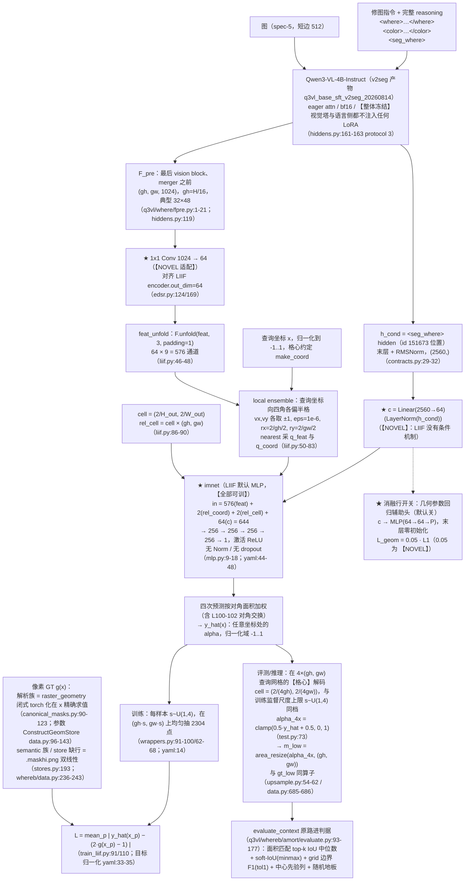

# 实验：LIIF 隐式坐标场头（EPR-021）

状态：提案（待用户定稿）。

**本提案没有结构基线。** ST_LANG（ConvTower + FiLM + CondEncoder + UNIQ K=8 + WTA + 七项 loss +
语言 LoRA r16）是**失败基线**，它的部件一件都不进本方案；`0.77390` 只在第 4 部分的**指标对照行**里
出现。本方案 = **冻结 Qwen3-VL 特征 + LIIF 全件忠实移植**：头结构、loss 组成与权重、头超参、优化器、
调度一律照抄原文与原仓库；训什么、冻什么照搬；无法照搬处逐条标 **NOVEL** 并写理由。用户 2026-08-14 指示：本批提案解除本
战役"dice/IoU 禁入 loss"红线对*移植配方*的约束——参考工作用什么 loss 就用什么（LIIF 用的是 L1，本臂
因此不引入 dice/IoU，见 §2 配方表 11 行）。

引用纪律：外部行号出自 2026-08-14 当日 `curl` 下载的 GitHub `main` 分支 raw 文件（URL 见文末来源清单），
`nl -ba` 逐行核对；本仓库行号以当前工作区（`lens-exp` 分支）为准，本次逐条打开确认。

---

## 1. 任务

大任务：局部精修。小任务：**where——改哪里**（what 分支不涉及）。

本实验测试：把 where 的 mask 从"(gh,gw) 离散格上的一张场"换成 **LIIF 的局部隐式图像函数**——给一个
连续坐标 x，取它附近的深度特征 + 相对坐标 + 查询像元尺寸，一个共享 MLP 直接吐出该坐标处的 alpha。
评测时在 4×(gh,gw) 查询网格的格心上解码，再用 `area_resize` 降回冻结的 (gh,gw)（与 `gt_low` 同算子），
得到一张 32×48 的场进判据，判据一列不换。

- **参考工作（本提案的忠实移植对象 = LIIF 全件）**：
  **Learning Continuous Image Representation with Local Implicit Image Function**，
  arXiv **2012.09161**（当日打开 abs 页核实：标题如上，作者 Yinbo Chen / Sifei Liu / Xiaolong Wang），
  官方实现 `github.com/yinboc/liif`。借鉴的具体机制（逐个已打开原始文件）：
  - `models/liif.py` L13-18：三个开关 `local_ensemble` / `feat_unfold` / `cell_decode`，默认全开；
  - L22-29：`imnet_in_dim = encoder.out_dim × 9(unfold) + 2(coord) + 2(cell)`；
  - L46-48：`feat_unfold` = `F.unfold(feat, 3, padding=1)`，把 3×3 邻域拼进通道；
  - L50-59：`local_ensemble` 时 `vx,vy ∈ {-1,1}`、`eps_shift=1e-6`、场半径 `rx=2/H/2`、`ry=2/W/2`；
  - L61-63 + `utils.py` L102-117 `make_coord`：坐标在 `[-1,1]`、**格心**约定（`v0+r+2r·arange`，
    `r=(v1-v0)/(2n)`），张量按 `(row, col)` 存、`grid_sample` 前 `.flip(-1)`（L74/L78）；
  - L69-83：把查询坐标向四个角各偏半格 → `nearest` 采特征与格心 → `rel_coord = coord − q_coord`
    再按 `feat.shape[-2:]` 放大；
  - L86-90：`cell_decode` 把 `rel_cell = cell × (H, W)` 拼进 MLP 输入；
  - L92-105：四次预测按**对角面积**加权，**L100-102 的两次对角交换不可漏**；
  - `models/mlp.py` L9-18：decoder 就是一串 `Linear + ReLU`，**没有任何 Norm、没有 dropout**，
    最后一层 `Linear(lastv, out_dim)`；
  - `configs/train-div2k/train_edsr-baseline-liif.yaml` L44-48：`imnet` 用 `mlp`，
    `hidden_list: [256,256,256,256]`（= 4 个 256 宽的隐层 + 1 个输出 Linear，共 5 个 Linear），
    `out_dim: 3`；L14/L30 `sample_q: 2304`；L15 `batch_size: 16`；L33-35 目标归一化
    `sub 0.5 / div 0.5`；L50-53 `adam lr 1.e-4`；L54-57 `epoch_max 1000` +
    `multi_step_lr milestones [200,400,600,800] gamma 0.5`；
  - `train_liif.py` L91/L110：loss = `nn.L1Loss()`（**只有这一项**）；L77-78 优化器收
    `model.parameters()`（encoder 与 imnet 一起训）；L114-116 `zero_grad/backward/step`，
    **无梯度裁剪、无 warmup、无 autocast**；L83/L157-158 `MultiStepLR` 每 epoch step 一次；
    L188-197 用 val PSNR 选 `epoch-best`；
  - `utils.py` L91-96 `make_optimizer`：`Adam(param_list, **args)`，args 只有 `lr`，
    **weight_decay 用 torch 默认 0**；
  - `datasets/wrappers.py` L91-100/L107/L116-121：每个样本抽 `s ~ U(scale_min=1, scale_max=4)`，
    L62-68 在全分辨率 GT 上均匀无放回抽 `sample_q` 个点，L70-72
    `cell = (2/H_out, 2/W_out)`；L123-131 `augment` = hflip/vflip/转置；
  - `test.py` L16-29 `batched_predict` 分块查询（`eval_bsize`），L73 `pred.clamp_(0, 1)`；
  - `models/edsr.py` L124/L169：`edsr-baseline` `no_upsampling=True` 时 `out_dim = n_feats = 64`。

- **测试什么方法**：mask 不再是 (gh,gw) 上的离散场，而是一个**任何分辨率都能查询的坐标函数**；
  训练监督直接落在随机抽的 2304 个连续坐标点上，GT 在该坐标精确求值；输出分辨率与 H/16 grid 解耦。

- **解决什么问题（只列已登记事实，不下判断）**：
  - 现行监督把 GT `area_resize` 到 (gh,gw) 再算格级 BCE（`q3vl/whereb/amort/data.py:685-686`），
    典型 32×48，每格约 16px。任务卡登记的两个当前问题：(1) 学出的 mask 边缘不清晰；
    (2) band/linear 的预测退化成 radial 形。
  - 构造侧 GT 本身就是坐标的闭式函数：`circulargradient`（radial/band）= 旋转椭圆距离 + smoothstep
    （`dataset_build/src/construct/canonical_masks.py:101-111`），`gradient`（linear）= 投影 + smoothstep
    （同文件 L112-117），smoothstep 与 `Flipped` 在 L120-122。`raster_geometry` 接受任意 `(height, width)`
    （L90-91），即 GT 可以在任意分辨率、任意坐标上解析求值。
  - **指标对照行（不是本方案的结构 baseline，仅供第 4 部分并排）**：ST_LANG 0.77390（失败基线）、
    M0 0.79095、center prior 0.5088、随机地板 0.2582、oracle 0.9737、用户可用线 0.85。

### 语言条件读出

语言条件向量 `h_cond` = base SFT v2seg 模型输出中 **`<seg_where>` token 位置的 hidden**：

```
h_cond = norm(hidden_states[-1]) 在 <seg_where> token 位置上的那一行，形状 (2560,)
```

层与归一化按 `q3vl/whereb/contracts.py:30-32`（`SEGMENT_HIDDEN_LAYER = -1` /
`SEGMENT_HIDDEN_FINAL_NORM = True`），维度 2560。

**v2seg 规格**：assistant 输出形制为
`<where>…</where><color>…</color><seg_where><seg_color><|im_end|>\n`，两个 seg token **受监督**；
`<seg_where>` id 151673、`<seg_color>` id 151674，两者追加在词表末尾
（`q3vl/train/constants.py:22-23`；四个 tag token `<where>` 151669 / `</where>` 151670 /
`<color>` 151671 / `</color>` 151672 见 `q3vl/train/constants.py:11-14`，字面 id 记在
`q3vl/whereb/attnread.py:62-64`）；产物目录 `/home/bc/data/runs/q3vl_base_sft_v2seg_20260814`。

**接入要点**：
(a) 前向序列喂到 `<seg_where>`——序列 = prompt + 完整 reasoning（where span + color span +
`<seg_where>`），读出切片取 `<seg_where>` 所在的**单个位置**（下标在拼接时记录，不做搜索式定位）。
挂点：序列构造 `q3vl/whereb/hiddens.py:170`、切片 `q3vl/whereb/hiddens.py:234`。仍是一次
`no_grad` 前向同时出 `F_pre` 与语言侧 hidden。
(b) 基座 = v2seg 产物 `/home/bc/data/runs/q3vl_base_sft_v2seg_20260814`；genwhere 生成缓存按该
checkpoint 重生成（缓存 schema 逐条记 `checkpoint` 字段，`q3vl/whereb/gencontext.py:122, 168`）。

**依赖项（写死）**：v2seg 训练产物落盘 **且** genwhere 缓存按 v2seg 重生成完成之前，**本臂不可
开跑**（2026-08-14 当日 `ls /home/bc/data/runs/` 未见 `q3vl_base_sft_v2seg_20260814`）。
v2seg 未就绪时的起跑档见待决策 (k)。

**本臂的条件消费点**：`LIIFHead` 的条件向量 = `h_cond` 过 `LayerNorm(2560) + Linear(2560→64)`，
得到的 64 维向量**逐点 concat 进 imnet 输入**，`imnet` 输入维 644（配方表第 8 行）。

**`<seg_color>`**：归 what 分支使用，**本批六臂不消费**（见待决策 (l)）。

读出方式的其余档（`<where>` span 池化、`</where>` / `</color>` / `<|im_end|>` 位置、可学习
query token、K > 1 的多 seg token）在 §4 读出方式消融组统一出数。

---

## 2. 模型图



**冻结 / 可训清单**

- **冻结**：Qwen3-VL 全部权重（视觉塔 24 个 block、merger、语言侧 36 层），一根 LoRA 都不注入。
  这与 LIIF 原配方不同（`train_liif.py:77-78` 把 encoder 一起训）——见配方表第 20 行，标 NOVEL。
- **可训（全部三件，共约 0.60M 参数）**：
  - `1x1 Conv 1024→64` 适配器：65,600
  - 条件投影 `LayerNorm(2560) + Linear(2560→64)`：169,024
  - `imnet` MLP `644→256→256→256→256→1`：362,753
  - （消融行开启时再加几何回归头，规模见 §3）

**数学公式（本臂的全部 loss）**

```
默认（忠实移植，L_geom 权重 = 0）：

    L = (1 / (B · Q)) · Σ_b Σ_p | ŷ_b(x_p) − ( 2·g_b(x_p) − 1 ) |          … L1，Q = 2304

    ŷ  = LIIF 解码器原始输出（不过 sigmoid，与 LIIF 一致）
    g  = GT alpha ∈ [0,1]；(2g−1) 即 LIIF 的 gt 归一化 sub 0.5 / div 0.5
    评测时 α = clamp(0.5·ŷ + 0.5, 0, 1)

消融行 ①（--geom-reg-weight > 0）额外加一项：

    L_total = L + 0.05 · L_geom
    L_geom  = mean_j | p̂_j − p_j |  (连续列，L1)  +  BCE( σ(f̂), Flipped )  (单列)
```

**`is_fake`（foreign 指令）样本在本臂 L1 下的政策（写死，不静默）**：`fake_prob = 0.15`
（`q3vl/whereb/amort/losses.py:74`，掷签在 `q3vl/whereb/amort/trainer.py:383`）。本臂不接现有七项栈，
因此**不走** `empty_mask` 项（`q3vl/whereb/amort/losses.py:286-291`）。保守默认 = 把 fake 样本的
GT 点值 **`g(x_p) ≡ 0`**，归一化后目标 `2g − 1 ≡ −1`，再照上式的 L1 原样算
（`L = mean_p |ŷ(x_p) − (−1)|`），**不排除、不加权、不改公式**。数值行为写明：目标是有限常数
−1，L1 对常数目标有定义、无除零、无 NaN，梯度把 `ŷ` 推向 −1（即 `α = clamp(0.5·ŷ+0.5, 0, 1) → 0`）；
点坐标采样与 `s ~ U(1,4)` 的抽取与 GT 无关（`wrappers.py` L62-68/L107），fake 样本的采样分布与真
GT 样本同分布。fake 样本数与其 `L_l1_pts` 分开计数落 `steps.jsonl`。**这是 NOVEL 政策**：LIIF 的
目标是 RGB 图像、没有「空目标」这一形态，无原文可抄。备选（把 fake 样本排除出本臂 L1 并计数）
见待决策 (j)。

**忠实移植配方表（原文/原仓库数值 + 出处 + 本臂取值）**

| # | 项 | LIIF 原值 | 出处（当日打开） | 本臂取值 | 照搬? |
|---|---|---|---|---|---|
| 1 | decoder 结构 | `hidden_list [256,256,256,256]` + 输出 Linear | yaml L44-48；mlp.py L9-18 | 同 | 照搬 |
| 2 | decoder 激活/归一化 | ReLU；**无 Norm、无 dropout** | mlp.py L14-17 | 同 | 照搬 |
| 3 | feat_unfold | `F.unfold(feat,3,padding=1)`，通道 ×9 | liif.py L46-48 | 同 | 照搬 |
| 4 | local ensemble | 四角偏半格 `vx,vy∈{-1,1}`、`eps_shift 1e-6`、`rx=2/H/2`、nearest 采样、对角面积加权 + L100-102 交换 | liif.py L50-105 | 同 | 照搬 |
| 5 | cell decode | `rel_cell = cell × (H,W)` 拼进输入 | liif.py L86-90；wrappers L70-72 | 同 | 照搬 |
| 6 | 坐标约定 | `[-1,1]` **格心**（`make_coord`）；`(row,col)` 序 + `.flip(-1)` | utils.py L102-117；liif.py L74/L78 | 同（评测在 4×(gh,gw) 查询网格的格心用此约定，不另立） | 照搬 |
| 7 | encoder 特征宽度 | `edsr-baseline` `out_dim = n_feats = 64` | edsr.py L124/L169 | **1x1 Conv 1024→64** | **NOVEL** |
| 8 | imnet 输入维 | `64×9 + 2 + 2 = 580` | liif.py L22-29 | `580 + 64(cond) = 644` | **NOVEL** |
| 9 | 输出维 | `out_dim: 3`（RGB） | yaml L47 | `1`（alpha） | **NOVEL** |
| 10 | 目标归一化 | `gt {sub:[0.5], div:[0.5]}` | yaml L33-35；train_liif.py L98-100/L109 | 同（alpha∈[0,1] → [-1,1]） | 照搬 |
| 11 | loss | `nn.L1Loss()`，**只有这一项** | train_liif.py L91/L110 | 同（不加 dice/IoU/BCE/SDF/area/sep） | 照搬 |
| 12 | 每样本采样点数 | `sample_q: 2304` | yaml L14/L30 | 2304 | 照搬 |
| 13 | 查询尺度采样 | `s ~ U(scale_min=1, scale_max=4)` | yaml L12；wrappers L91-98/L107 | 同：查询分辨率 `(round(gh·s), round(gw·s))` | 照搬 |
| 14 | 输入裁剪 | `inp_size: 48`（48×48 LR patch） | yaml L10；wrappers L116-121 | 不裁，整幅 (gh,gw) | **NOVEL** |
| 15 | 数据增强 | `augment: true`（hflip/vflip/转置） | yaml L13；wrappers L123-131 | 关 | **NOVEL** |
| 16 | 优化器 | `Adam(lr=1e-4)`；**wd=0（torch 默认）、无 warmup、无梯度裁剪** | yaml L50-53；utils.py L91-96；train_liif.py L114-116 | 同 | 照搬 |
| 17 | 调度 | `MultiStepLR milestones [200,400,600,800] / epoch_max 1000, gamma 0.5` | yaml L54-57；train_liif.py L83/L157-158 | 比例照搬（20/40/60/80%）→ 1200 步档 `[240,480,720,960]`，gamma 0.5 | **NOVEL 缩放** |
| 18 | batch | `batch_size: 16` | yaml L15 | effective batch **32** | **偏离**（理由：与对照行 1200 步 / 有效 batch 32 的步数匹配协议一致） |
| 19 | 精度 | fp32（脚本无 autocast） | train_liif.py 全文 | 头 fp32（冻结 VLM 仍 bf16 出特征） | 照搬 |
| 20 | 训什么 / 冻什么 | encoder + imnet **一起训** | train_liif.py L77-78 | encoder（Qwen3-VL）**冻结**，只训适配器 + cond + imnet | **NOVEL**（协议 3，hiddens.py:161-163） |
| 21 | checkpoint 选择 | val PSNR 最优 | train_liif.py L188-197 | quick-eval 硬门 + `local_soft_iou_median` | **偏离**（本战役红线：禁 val loss/禁 PSNR，trainer.py:492-506） |
| 22 | 推理 | `clamp_(0,1)`；`batched_predict` 分块 | test.py L16-29/L73 | 同 | 照搬 |

---

## 3. 改动怎么接进来（逐条可确认）

| 项 | 内容 |
|---|---|
| **改哪里** | ① **新增了一个头文件** `q3vl/whereb/amort/liifhead.py`，里面加了一个 `LIIFHead` 模块，模块内部按 `liif.py` L37-106 一比一实现 `query_alpha(coord, cell)`：先 `F.unfold(feat,3,padding=1)`（L46-48），再四角偏移 + `nearest` `grid_sample` 取 `q_feat` / `q_coord`（L69-80），算 `rel_coord` 并按 `feat.shape[-2:]` 放大（L81-83），拼 `rel_cell`（L86-90）与条件向量 `c`，过 `mlp.py` L9-18 形制的 MLP，最后按对角面积加权（L96-105，**含 L100-102 的两次交换**）。`c` 是**新增的条件注入**（LIIF 没有）：在 `LIIFHead.__init__` 里加了 `LayerNorm(2560) + Linear(2560→64)`，前向时对 `h_cond`（`<seg_where>` 位置的单条 2560 维向量，见 §1「语言条件读出」）投影，得到一个 64 维向量，**逐点 concat 进 MLP 输入**；null context（序列里没有 `<seg_where>`）时取全零。② **新头挂在 `AmortModel` 的 arm 分支**：`q3vl/whereb/amort/model.py:30` 的 `ARMS` 元组增加 `"LIIF"`；`model.py:118-133` 的 arm 分派链末尾增加 `elif arm == "LIIF": self.geo = LIIFHead(...)`；`model.py:223-238` 的 `forward_geo` 增加一个 `LIIF` 分支——**评测态**在 **4×(gh, gw) 查询网格**的格心（`make_coord` 约定，`utils.py` L102-117）解码、`cell = (2/(4gh), 2/(4gw))`、`clamp(0,1)`（`test.py` L73），得 `α_4x (4gh, 4gw)`，再 `m_low = area_resize(α_4x[None,None], (gh, gw))[0,0]` —— **与 `gt_low` 用的是同一个算子**（`q3vl/where/upsample.py:54-62` 的 `area_resize`，下采走 `mode="area"`；调用点与 `q3vl/whereb/amort/data.py:685-686` 完全一致），结果塞进现有的 `m_low` / `s_low` 键（评测器只读这两个键，`q3vl/whereb/amort/evaluate.py:136`）。**分辨率档的选定理由（写死）**：本臂训练监督的查询尺度是 `s ~ U(1, 4)`（yaml L12，配方表第 13 行），4×(gh,gw) 是该区间的上限档，读出落在训练监督覆盖的分辨率内；`--liif-scale-max` 改档时读出档随之改，并写进 `liif_setup.json`。原「在 `(gh,gw)` 格心直接解码」口径**降级为备选**，见待决策 (h)。**训练态**额外接受 `(coord, cell)` 并返回 `y_pts (Q,)`；分块查询按 `test.py` L16-29 的 `batched_predict` 形式，一块 ≤ 65536 点。③ **新增了采样与像素 GT**：`AmortBatchBuilder.build`（`q3vl/whereb/amort/data.py:645-722`）在 arm==LIIF 时为每个样本抽 `s ~ U(1,4)`（`wrappers.py` L107），在 `(round(gh·s), round(gw·s))` 的格心里**均匀无放回**抽 2304 个点（`wrappers.py` L62-68），并求 GT 点值：`circulargradient` / `gradient` 族把 `raster_geometry`（`canonical_masks.py:90-123`）逐行 torch 化在 `x_p` 精确求值（椭圆 L101-111、投影 L112-117、smoothstep L120、`Flipped` L121-122）；**linear 族还要乘 amount**——发布的 mask 是 `clip(raw × amount)`，`amount = min(1, 0.5/raw_mean)`（`canonical_masks.py:145-153` + `_asset` L168-171，`linear_target` 默认 0.5 见 L227），而 sqlite 只存 `effective_alpha_mean`（`data.py:136-143`），所以 amount 由闭式 raw 在一张参考格上重算（参考格分辨率见待决策 (f)）。几何参数走 `ConstructGeomStore`（`data.py:96-143`，`candidate_id` 键，sqlite `/home/bc/data/runs/where_b/construct_geometry.sqlite3`）。**semantic 族与 store 缺行样本**回退到 `.maskhi.png`（短边 512，`q3vl/whereb/stores.py:193`；`q3vl/whereb/data.py:236-243`）在 `x_p` 上做**双线性**读值（uint8 有 1/255 量化步，nearest 会出台阶）。**预检**：训练启动前抽 200 个解析族样本，把闭式渲染与 `.maskhi` 同分辨率比对，逐样本 `mean|diff| > 0.01` 的落回 png 路径并把计数写进 `facts()`。④ **新增了 loss**：`q3vl/whereb/amort/losses.py` 增加 `liif_l1_loss(y_pts, g_pts)`，就是 `mean |ŷ − (2g−1)|`（`train_liif.py` L91/L110 + yaml L33-35）；**它不接进现有七项栈**——LIIF 臂的总损失只有这一项，term 键名记 `l1_pts`，`aggregate`（`losses.py:519-547` L539-542）会自动把 `L_l1_pts` 写进 `steps.jsonl`。⑤ **改了优化器与调度**：`AmortTrainer.__init__`（`trainer.py:271-283`）在 arm==LIIF 时用 `torch.optim.Adam(params, lr=1e-4)`（**无 weight decay、无参数分组、无 warmup**，`utils.py` L91-96 + yaml L50-53），`max_grad_norm` 置 0（LIIF 无裁剪，`train_liif.py` L114-116）；`q3vl/where/calibrate.py:126-145` 的 `make_scheduler` 增加 `kind="multistep"` 分支（现只有 cosine 与常数），里程碑 `[240,480,720,960]`、gamma 0.5。⑥ **新增了几何参数回归辅助头（消融行 ①，默认关）**：见下方独立小节。⑦ **新增了运行时断言**：(a) 训练第一个 micro-batch 断言 `steps.jsonl` 首行含 `L_l1_pts`（镜像 `q3vl/whereb/amort/evaluate.py:348-367` 对 deep-supervision 列的首行检查口径），`--geom-reg-weight>0` 时同时断言含 `L_geom`，缺一即 `AssertionError`；(b) `assert_criteria_ran`（`q3vl/whereb/amort/evaluate.py:313-368`）的 `required` 表（`q3vl/whereb/amort/evaluate.py:331`，现为 `{"SHAPE3": ["shape_residual"], "UNIQ": ["uniq_best"]}`）增加 `"LIIF": ["liif_grid_decode"]`，即"本行的 `m_low` 确实由 LIIF 解码器在 4×(gh,gw) 查询网格格心解码后经 `area_resize` 降回 (gh,gw) 产出"的计数列，`n=0` 拒绝出板；开了几何头再追加 `"geom_reg_route"`。⑧ **四族全部走新头（本批六份提案统一口径）**：`run_liif_arm.py` 转交 `run_amort_arm` 的参数里固定带 `--no-semantic-head`（`q3vl/whereb/scripts/run_amort_arm.py:205`）+ `--no-sim-field`（`:121`）+ `--no-film`（`:123`）；`--no-semantic-head` 使 `model.sem is None`，路由判断（`q3vl/whereb/amort/trainer.py:101`、`q3vl/whereb/amort/evaluate.py:124` 的 `if x.route_semantic and model.sem is not None:`，两处代码一字不改）于是把 **semantic 族样本也送进 `forward_geo`**，即 semantic 族与 radial/band/linear 三族同样进 LIIF 头训练与评测；semantic 族的点 GT 走本行 ③ 已写明的 `.maskhi.png` 双线性通路（无解析参数）。`SemanticHead`（自带 FiLM，`q3vl/whereb/amort/heads.py:416`）**不构造 / 不训练**；`CondEncoder`（`q3vl/whereb/amort/model.py:111` 现为无条件构造）**不进本头前向**——本头的条件向量是自己的 `LayerNorm(2560) + Linear(2560→64)`，与 `CondEncoder` 无关——构造后对 `self.cond` 调 `requires_grad_(False)`、不进优化器，可训参数清单落盘核对。备选（保留语义头旧路由）见待决策 (i)。⑨ **读出接缝（§1「语言条件读出」）**：`q3vl/whereb/hiddens.py:170` 的序列构造喂完整 reasoning 到 `<seg_where>` 为止、`q3vl/whereb/hiddens.py:234` 的切片取 `<seg_where>` 单个位置，两处由一个读出旗标统一分派；基座路径与 genwhere 缓存取 v2seg 档。旗标（默认值 = 主臂口径）：`--readout seg_where`（choices：`seg_where` / `where_span_pool` / `where_close` / `color_close` / `im_end` / `qtok`，对应 §4 读出方式消融组 ⑭-1 / ⑪ / ⑫-a / ⑫-b / ⑬）、`--readout-qtok K`（默认 0；`qtok` 档取 1 / 4 / 8，机制照 `q3vl/whereb/amort/uniq4.py:76` / `:79` / `:113` / `:148`）、`--readout-nseg K`（默认 1；K>1 需对应 SFT 变体重训，占位）。旗标值、`<seg_where>` 的解析下标、基座 checkpoint 路径与 genwhere 缓存的 `checkpoint` 字段一并写进 `run_config` 与 `liif_setup.json`；启动时断言「缓存的 `checkpoint` 字段 == 本次基座路径」，不一致即拒绝开训。 |
| **不变（明确列出没动的部分）** | **判据与评测全套一列不加不减不改**：`evaluate_context`（`q3vl/whereb/amort/evaluate.py:93-177`）；面积匹配 top-k（`q3vl/whereb/metrics.py:127-144`，`TOPK_RULE="match_gt_area"` `config.py:263`）；soft-IoU minmax（`metrics.py:88-105`，`SOFT_IOU_KIND="minmax"` `config.py:163`）；grid 级边界 F1 tol=1 cell（`metrics.py:209-241`，`GRID_BOUNDARY_TOL_CELLS=1` `config.py:265`）；中心先验列（`metrics.py:147-165` + `q3vl/whereb/amort/evaluate.py:57-75`）；随机 top-k 地板 `a/(2−a)`（`q3vl/whereb/amort/evaluate.py:78-81`）；normal-only headline（`q3vl/whereb/amort/evaluate.py:447-471`）；配对 sign-flip permutation 1e4（`metrics.py:244-290`）；E3 处决列 `corr_center_minus_corr_gt`（`q3vl/whereb/amort/evaluate.py:413-416` / `465-467`）。**AUC 依旧禁用**。**冻结基座与特征管线**：`FrozenVLM`（`hiddens.py:132-190`）、`F_pre` 抽取（`q3vl/where/fpre.py`）、语言侧 hidden 的层与归一化约定（`contracts.py:29-32`）；基座 checkpoint 取 v2seg 产物 `/home/bc/data/runs/q3vl_base_sft_v2seg_20260814`、genwhere 缓存按该 checkpoint 生成，`hiddens.py:170` 的序列构造与 `:234` 的切片按 §1「语言条件读出」接线；`AmortBatchBuilder` 的图像/文本编码与 `context_for` 三负控制（`data.py:640-664`）、`family_labels`（`data.py:172-240`）、maskviews 只从 `/mnt/nfs-ro` 读。**现有臂一行不动**：P1 / P3prime / SHAPE3 / UNIQ 的模块、loss 权重（`losses.py:60-111`）、WTA、cls/sel 头全部原样；本臂不构造它们中的任何一个。**数据**：train local n=42752（sft2seg-20260804，`render_mode=="local"`，sha1 规则族切分）；eval V_where local 400；normal-only headline n=224；`winner_confidence=low` 不进主训与评测 GT。**步数**：1200 步，与对照行步数匹配（`trainer.py` `max_steps`，`run_amort_arm.py:110`）。**seed** 20260810（`trainer.py:54`）。 |
| **初始化（step0 是什么）** | 按 **LIIF 原实现**：`mlp.py` L9-18 对 `nn.Linear` **不做任何显式初始化**，全部走 PyTorch 默认（Kaiming-uniform + uniform bias）。1x1 适配器与条件投影同样走默认初始化。**本臂因此不做零初始化，也不要求与任何现有臂 step0 逐位等价**——它是一个新结构、从零训练的新臂，不 resume 任何 checkpoint，不需要能载入 ST_LANG 的 `state_dict`。step0 的输出：`ŷ` 是坐标与特征的一个随机函数，`α = clamp(0.5·ŷ+0.5, 0, 1)` 在 [0,1] 内随机起伏；这不是"恒 0.5"，也不与对照行的 step0 相同，第 4 部分的比较口径是**同 1200 步后的终点数字**，不是 step0。**唯一的零初始化例外**是几何回归辅助头的末层（见下），理由是它默认关、开时也不该在第 0 步扰动主 loss。频率/坐标基不训练（LIIF 的 `rel_coord`/`rel_cell` 是算出来的，不是参数）。 |
| **入口（旗标；不选 = 不影响现有任何臂）** | 新脚本 `q3vl/whereb/scripts/run_liif_arm.py`（形制照 `run_uniq4b_arm.py:29-144`：自己 `parse_known_args` 吃掉本臂旗标，把 `head_kwargs` 与 `liif_setup.json`（含 `liifhead.py` 与 wrapper 的 sha256）落进 `<out-root>/<run-name>/config/`，其余原样转交 `run_amort_arm.main(rest)`）。`run_amort_arm.py:90-91` 的 `--arm` choices 增加 `"LIIF"`。**arm 名是新的、文件是新的**，所以任何现有臂的复现命令、构图、loss 一个字节都不受影响。<br>旗标（默认值 = 忠实配方）：`--liif-sample-q 2304`（yaml L14）；`--liif-hidden 256,256,256,256`（yaml L48）；`--liif-feat-dim 64`（edsr.py L169）；`--liif-scale-max 4`（yaml L12）；`--liif-cond-dim 64`（NOVEL）；`--liif-no-local-ensemble` / `--liif-no-feat-unfold` / `--liif-no-cell-decode`（对应 liif.py L13-18 三开关，消融用）；`--liif-gt closed`（默认；`cgt` = 全走 `.maskhi` 双线性）；`--liif-loss l1`（默认；`bce` = 消融档）；`--liif-eval-bsize 65536`（test.py L16-29 分块）；`--geom-reg-weight 0.0`（消融行 ①，见下）。全部旗标写进 `run_config` 与 `liif_setup.json`。<br>**守卫列（预注册继承）**：LIIF 解码器把 `rel_coord` 与 `rel_cell` 当输入，属 DELTA §5.6 的坐标通道违例路径（`q3vl/whereb/amort/heads.py:15-21` 记录了该禁令及 E3 的实测：corr(输出,中心先验) 0.64 > corr(输出,GT) 0.47）。因此 EPR-011 arm A 登记的处决列 `corr_center_minus_corr_gt` 对本臂同样生效，**每块板必出**。 |

### 消融行 ① 必含：几何参数回归辅助头（用户指示，不另立提案）

**增加了什么**：一个小的几何参数回归分支。**在哪里加的**：`LIIFHead` 内部，接在条件向量 `c` 上
（LIIF 头没有 query 潜变量，`c` 是本头唯一的条件/查询侧潜表示）。**加了什么**：
`MLP(64 → 64 → P)`，ReLU，**末层 weight/bias 零初始化**；`P` 按 `mask_type` 分两组输出头。

- **入口**：`--geom-reg-weight`（float，默认 **0.0**；**0 = 分支根本不构造**，前向不进任何新分支，
  `liif_setup.json` 记 `geom_reg: null`）。
- **目标来源**：`ConstructGeomStore`（`q3vl/whereb/amort/data.py:96-143`，
  sqlite `/home/bc/data/runs/where_b/construct_geometry.sqlite3`，`candidate_id` 键，
  `row()` 返回 `geometry` 原始 dict）。
- **参数集（键名已打开 `canonical_masks.py:90-123` 核实）**：
  - `mask_type == "circulargradient"`（radial / band 两族共用此渲染分支）：
    `cx=(Left+Right)/2`、`cy=(Top+Bottom)/2`（L102-103）、`rx=|Right−Left|/2`、`ry=|Bottom−Top|/2`
    （L104-105）、`Angle`（L106）、`Feather`（L110）、`Flipped`（L121-122）。
  - `mask_type == "gradient"`（linear 族）：`ZeroX`、`ZeroY`、`FullX`、`FullY`（L113-114）、`Flipped`。
  - **semantic 族置零**（无解析参数），且不进 `L_geom` 的分母。
- **坐标/尺度口径**：所有坐标类参数按 `raster_geometry` 自己的归一化口径 `[0,1]`
  （`x = xx/width`、`y = yy/height`，L99-100），不再二次缩放；`Feather` 按 L110 的 `/100` 后口径。
- **角度编码**：`Angle` 用 `sin(2θ)/cos(2θ)` 两列回归（±180° 同形，L107-108 的旋转对 θ 与 θ+180°
  给出同一个椭圆）。
- **Flipped**：单独一列，`BCE(σ(f̂), Flipped)`（同形异参：L121-122 只是 `alpha ← 1−alpha`）。
- **近各向同性样本掩角度**：构造侧当 `natural_elongation < 1.15` 时角度直接
  `rng.uniform(-90, 90)`（`dataset_build/src/construct/subject_geom.py:99-100`），即该样本的
  `Angle` 是噪声、不可回归，其角度两列必须掩掉。**判定阈值待用户拍板**（见待决策 (c)）。
- **权重**：`L_geom = 0.05 · L1`（连续列）`+ BCE`（Flipped 列）；**0.05 这个数是 NOVEL**
  （LIIF 无辅助头，无原值可抄），理由：与主 L1 同量级下压两个数量级，先取一个不会淹掉主 loss 的档，
  真正的档位由本行的数字自己说话。
- **观察列**：
  - `headline`（口径与主行完全一致，normal-only n=224）；
  - **band/linear 路由列**：忠实 LIIF 配方**没有 cls 头**，所以按用户指示改由几何回归头替代，口径写死为两层：
    (i) `mask_type` 二分路由正确率——头输出一个 `gradient` vs `circulargradient` 的 logit，
        对 GT `mask_type` 算正确率（semantic 样本不计入）；
    (ii) circulargradient 内部的 band/radial 判读——band 的长轴是**常数**
        `BAND_AXIS_LEN = 1.6`（`subject_geom.py:22`，经 `_ellipse_geom` L74-75 写进 `Left/Right`
        → `rx = 1.6`），radial 的 `rx = extent_a × margin`，`margin ≤ MARGIN_MAX = 1.60`
        （`subject_geom.py:12`，L95），`extent_a` 是归一化坐标下的 0.98 分位（L65），
        因此用**预测的 `rx`** 卡一个阈值即可给出 band/radial 判读；**阈值待用户拍板**（待决策 (d)）。
    两层都出 4 格混淆计数（GT band/linear × 预测 band/linear），数字占位 `___`。

---

### 判据（预注册，随任务卡逐字冻结，本次不动）

V_where local 400，**normal-only headline**（读 `.contexts.*.headline_normal_only`，
n=224，`q3vl/whereb/amort/evaluate.py:454-468`；**禁用顶层 pooled `.baselines`**），指标 = **面积匹配 top-k IoU 中位数**。
三列套装缺一不可：**soft-IoU(minmax)** + **grid 级边界 F1(tol=1 cell)** + **中心先验列**；
并排**随机 top-k 地板 `a/(2−a)`**。逐样本配对 + **sign-flip permutation 1e4**。
与对照行 **1200 步步数匹配**。**AUC 禁用**。eval 启动时 `assert_criteria_ran`
（`q3vl/whereb/amort/evaluate.py:313-368`，`evaluate_arm` L620-621 调用）校验判据函数被调用；本臂在 `required`
里追加 `liif_grid_decode`（+ 开几何头时 `geom_reg_route`），`n=0` 拒绝出板。
按 family（radial / band / linear / semantic）分层报（`summarise_rows` 的 `strata.family`，
`q3vl/whereb/amort/evaluate.py:419-445`）。守卫列 `corr_center_minus_corr_gt` 每块板必出。

**预测场进判据的口径（写死）**：LIIF 解码器在 **4×(gh, gw) 查询网格的格心**出
`α_4x = clamp(0.5·ŷ + 0.5, 0, 1)`（`test.py` L73），判据入口用
`m_low = area_resize(α_4x[None,None], (gh, gw))[0,0]` —— **与 `gt_low` 完全同一个算子**
（`q3vl/whereb/amort/data.py:685-686` 对 `gt_hi` 用的就是 `area_resize(..., (gh, gw))`；
实现见 `q3vl/where/upsample.py:54-62`，下采走 `mode="area"`）。判据数字一律用这个未归一化的
`m_low` 原始场算；**禁逐图 min-max / softmax 归一化**。备选口径（在 `(gh, gw)` 格心直接单点
解码）见待决策 (h)。

**像素级诊断列（只作诊断，不进 headline；AUC 禁用；禁逐图 min-max）**：短边 512 满格分块解码后
(1) `pix_soft_iou_512` = soft-IoU minmax 对 `.maskhi.png`；(2) `pix_band_mae_512` = GT 过渡带
（`0.05 < gt < 0.95`）内的 MAE。两列各并排同支撑面的中心先验列与随机地板列。

---

## 4. 结果（做完补，消融行全填这里）

口径：headline = 面积匹配 top-k IoU 中位数，generated + **normal-only**，n=224，逐样本配对 +
sign-flip permutation 1e4；1200 步步数匹配。

**指标对照行（不是本方案的结构 baseline，只是并排的数字）**

| 对照行 | top-k IoU 中位数 |
|---|---|
| 随机 top-k 地板 `a/(2−a)` | 0.2582 |
| center prior | 0.5088 |
| ST_LANG @1200（失败基线） | 0.77390 |
| M0 | 0.79095 |
| oracle | 0.9737 |
| 用户可用线 | 0.85 |

**本结构（LIIF 忠实配方：unfold + local ensemble + cell decode，MLP 256×4，sample_q 2304，
s~U(1,4)，L1，Adam 1e-4，MultiStep [240,480,720,960] γ0.5，1200 步）**

- headline = `___`（对 ST_LANG 的配对 Δ = `___`，p = `___`）
- 三列：boundary F1 = `___` / center-prior 配对 Δ = `___`（p = `___`）/ 随机地板列 = `___`
- 守卫列 `corr_center_minus_corr_gt` = `___`
- family 分层 top-k 中位数：radial `___` / band `___` / linear `___` / semantic `___`
- 像素诊断列：`pix_soft_iou_512` = `___` / `pix_band_mae_512` = `___`

**消融行（对忠实配方的偏离，不另立提案）**

| # | 偏离项 | headline | 配对 Δ / p | 附带观察列 |
|---|---|---|---|---|
| ① | **+几何参数回归辅助头**（`--geom-reg-weight 0.05`） | `___` | `___` / `___` | mask_type 路由正确率 `___`；band/radial 判读混淆 GT-band→pred-band `___` / GT-band→pred-radial `___` / GT-linear→pred-linear `___` / GT-linear→pred-band `___` |
| ② | **去 local ensemble**（`--liif-no-local-ensemble`，liif.py L54-55 的 `[0]` 分支） | `___` | `___` / `___` | boundary F1 `___` |
| ③ | 采样点数 `sample_q` 2304 → 576 | `___` | `___` / `___` | — |
| ④ | 采样点数 `sample_q` 2304 → 9216 | `___` | `___` / `___` | — |
| ⑤ | GT 源 closed → 全 `.maskhi.png` 双线性（含解析族） | `___` | `___` / `___` | 预检落回计数 `___` |
| ⑥ | loss L1 → BCE（贴本任务 soft alpha；`α=σ(ŷ)`，`BCE_soft(α, g)`） | `___` | `___` / `___` | `pix_band_mae_512` `___` |
| ⑦ | 特征适配 1x1 Conv 1024→64 → F_pre 1024ch 直接进（imnet in_dim 9220） | `___` | `___` / `___` | 头参数量 `___` |
| ⑧ | 去 feat_unfold（`--liif-no-feat-unfold`，in_dim 64+2+2+64） | `___` | `___` / `___` | — |
| ⑨ | 去 cell decode（`--liif-no-cell-decode`） | `___` | `___` / `___` | — |
| ⑩ | 查询尺度 `s~U(1,4)` → `s~U(1,16)`（覆盖 `.maskhi` 短边 512 档） | `___` | `___` / `___` | `pix_soft_iou_512` `___` |

**读出方式消融组**——骨干
固定取本臂**当前结果最好的模型形态**（其余结构、loss、优化器、步数全部保持该形态不动），
**只改「语言条件从哪里读」这一处**（即 `c` 的入向量从哪来）；每行同样给 headline、配对 Δ 与 p，
并各自带 Δ_const / Δ_shuffle。

| 行 | 读出口径 | 旗标 | 起跑依赖 | headline | 配对 Δ | p | Δ_const | Δ_shuffle |
|---|---|---|---|---|---|---|---|---|
| ⑪ | `<where>` span 池化：含 `<where>` / `</where>` 两个标签 token 的 T 行 mean-pool（前向序列喂到 `</where>` 为止，切片取该段 T 行；span 边界按 `q3vl/whereb/context.py:224-232` 的 `extract_segment`，切到第一个 `</where>` 并含该标签） | `--readout where_span_pool` | 口径本身不依赖 v2seg（checkpoint-4976 上即可跑）；与主臂配对比较时在同一基座上跑 | ___ | ___ | ___ | ___ | ___ |
| ⑫-a | special token 位置档：`</where>`（id 151670）单 token hidden | `--readout where_close` | **不依赖 v2seg**——该 token 在 checkpoint-4976 的输出里已存在 | ___ | ___ | ___ | ___ | ___ |
| ⑫-b | special token 位置档：`</color>`（id 151672）单 token hidden | `--readout color_close` | 同上（checkpoint-4976 输出末尾依次是 `</where>` → color span → `</color>` → `<\|im_end\|>`） | ___ | ___ | ___ | ___ | ___ |
| ⑫-c | special token 位置档：`<\|im_end\|>`（id 151645，受监督）单 token hidden | `--readout im_end` | 同上 | ___ | ___ | ___ | ___ | ___ |
| ⑬-1 | 可学习 query token 读出，`K_q = 1`（uniq4 词表扩展 + embedding forward hook，`q3vl/whereb/amort/uniq4.py:76` / `:79` / `:113`；query id **追加在完整输出之后**，追加写法同 `uniq4.py:148` 的 `where_ids + q_ids`） | `--readout qtok --readout-qtok 1` | 机制不依赖 v2seg（词表扩展 + hook 与基座版本无关） | ___ | ___ | ___ | ___ | ___ |
| ⑬-4 | 同上，`K_q = 4` | `--readout qtok --readout-qtok 4` | 同上 | ___ | ___ | ___ | ___ | ___ |
| ⑬-8 | 同上，`K_q = 8` | `--readout qtok --readout-qtok 8` | 同上 | ___ | ___ | ___ | ___ | ___ |
| ⑭-1 | special token 数量档：where 读出 token `K = 1`（= 主臂默认，单个 `<seg_where>`） | `--readout seg_where --readout-nseg 1` | v2seg | ___ | ___ | ___ | ___ | ___ |
| ⑭-2 | 同上，`K = 2` | `--readout seg_where --readout-nseg 2` | **需对应 SFT 变体重训**（v2seg 只监督 1 个 `<seg_where>`），**占位不排期** | ___ | ___ | ___ | ___ | ___ |
| ⑭-4 | 同上，`K = 4` | `--readout seg_where --readout-nseg 4` | 同上，**占位不排期** | ___ | ___ | ___ | ___ | ___ |

叠加式读法：本组的基线行 = ⑭-1（主臂默认读出，单个 `<seg_where>`）；换成 ⑪ 的 span 池化，
指标变动是 ___；换成 ⑫-a / ⑫-b / ⑫-c 三个 special token 位置，分别是 ___ / ___ / ___；
换成 ⑬ 的可学习 query，`K_q` = 1 / 4 / 8 分别是 ___ / ___ / ___；把 where 读出 token 数从
1 加到 2 / 4，分别是 ___ / ___。**多条向量的聚合形制**（⑬ 的 `K_q > 1`、⑭ 的 `K > 1`）无原文
可抄：保守默认 = 每条各自过同一组 `LayerNorm(2560) + Linear(2560→64)` 后按条数取平均，
`imnet` 输入维仍是 644，**属 NOVEL、随本组一并请用户拍板**，未拍板前按此默认写进
`liif_setup.json`。

---

## 待用户决策注记（保守默认已写进上文，未静默拍板）

- **(a) 读出方式消融组的覆盖面**：主臂条件向量 = `h_cond`（`<seg_where>` 位置的单条 2560 维
  hidden，§1「语言条件读出」）；span 池化、三个 special token 位置、可学习 query、K > 1 的多
  seg token 四类档位在 §4 读出方式消融组 ⑪–⑭ 出数，**注意力池化未列入本批**。相关登记事实
  （不作结论，仅供决策）：`model.py:86-90` 记录了 B2 的读数——单一 pooled 向量路径下 GT
  reasoning 文本带来 <0.01 IoU。待拍板：是否把注意力池化补进读出方式消融组。
- **(b) 查询尺度上限**：忠实配方是 `s ~ U(1, 4)`（yaml L12），即训练查询分辨率最高到
  `(4gh, 4gw) ≈ 128×192`；`.maskhi` 是短边 512（`stores.py:193`），`.cgt` 是短边 1024
  （`maskdata.py:226`）。**保守默认 = 照搬 U(1,4)**，把 `U(1,16)` 放进消融行 ⑩。若用户要"像素分辨率
  监督"必须落到 512/1024，请指定，届时默认档改为该值并重跑对照。本项与 (h) 的读出孔径绑定：
  评测读出档固定跟随训练监督的尺度上限，改一个就要改另一个。
- **(c) 几何回归头的角度掩码阈值**：构造侧的门是 `natural_elongation < 1.15`
  （`subject_geom.py:99-100`），但训练侧只能看到 sqlite 里的几何参数，拿不到 `natural_elongation`；
  且 `MIN_ELONG = 1.35`（L16）会把 `natural_elongation < 1.35` 的样本统一钉在 `rx/ry == 1.35`
  （L97-98），所以 `rx/ry ≈ 1.35` 这一档同时混着"角度是噪声"（<1.15）和"角度有意义、±18° jitter"
  （1.15–1.35，L102-104）两类，从存下来的参数无法区分。**保守默认 = 对 `rx/ry ≤ 1.35 + 1e-3` 的
  circulargradient 样本掩掉角度两列**（宁可多掩），待拍板；另一个选项是回构造侧补导出
  `natural_elongation` 列。
- **(d) band/radial 判读阈值**：band 的 `rx` 是常数 `1.6`（`subject_geom.py:22` + L145），
  radial 的 `rx = extent_a × margin`，`margin ≤ 1.60`（L12/L95），`extent_a` 为归一化 0.98 分位
  （L65）。**保守默认 = 预测 `rx ≥ 1.2` 判 band**，待拍板；也可改为先在训练集上量 `rx` 的两峰分布
  再定阈值（需要一次只读扫描，不训练）。
- **(e) batch 16 vs 32**：LIIF 原值 16（yaml L15），本臂按步数匹配协议取 32。若用户要求严格照搬 16，
  1200 步的样本吞吐会减半，与对照行的步数匹配口径需要重新约定（等步数还是等样本数）。
- **(f) linear 族 amount 的重算参考格分辨率**：sqlite 只存 `effective_alpha_mean`
  （`data.py:136-143`），`amount = min(1, 0.5/raw_mean)` 必须由闭式 raw 自己算出 `raw_mean`
  （`canonical_masks.py:145-153`，`linear_target` 默认 0.5 见 L227）。**保守默认 = 在 256×256 参考格上
  取 raw 均值**，并把重算出的 `effective_mean` 与 sqlite 里的 `effective_alpha_mean` 对账，
  `|diff| > 0.01` 的样本落回 `.maskhi` 路径并计数。参考格分辨率待拍板。
- **(g) 优化器偏离的可比性**：本臂按 LIIF 用 `Adam(lr=1e-4, wd=0, 无 warmup, 无梯度裁剪)`，
  与对照行的 `AdamW(3e-4, wd=0.01, warmup 3%, cosine)` 不同。这是"忠实移植"指示的直接后果，
  已写进配方表 16/17 行；若用户要求对照行同优化器重跑，需另排一条对照臂。
- **(h) 评测读出的解码孔径**：**保守默认 = 在 4×(gh, gw) 查询网格的格心解码，再
  `area_resize` 回 `(gh, gw)`**（§2 mermaid 的 EV 节点、§3「改哪里 ②」、判据段「预测场进判据的
  口径」三处已写死）。选 4× 的理由：它是本臂训练监督尺度 `s ~ U(1, 4)`（yaml L12）的上限档，
  读出不外推到监督覆盖之外。**备选口径 = 在 `(gh, gw)` 格心直接单点解码**（`cell = (2/gh, 2/gw)`）。
  两者的**算子差异**：备选口径给出的是每个 (gh,gw) 格心处的**单点函数值**；
  默认口径给出的是该格所覆盖的 **16×16 像素块上的 area 均值的 4×4 子格近似**——`gt_low` 用的正是
  16×16 像素块的 area 均值（`gt_low = area_resize(gt_hi, (gh,gw))`，`q3vl/whereb/amort/data.py:685-686`），
  所以默认口径与判据 GT 是同一个算子，备选口径不是。若用户要求把读出提到 spec-5 像素格
  （`(16gh, 16gw)`，与 `gt_hi` 逐位同格）再 `area_resize`，需与 (b) 的查询尺度上限一起改，届时
  训练侧 `s` 的上限也要提到 16（即消融行 ⑩ 的档）。待拍板。
- **(i) 语义头去留**：**保守默认（本批六份提案统一口径）= `--no-semantic-head`，四族全部走
  LIIF 头**，`SemanticHead` 与 `CondEncoder` 不构造 / 不训练（§3「改哪里 ⑧」）。备选 = **保留
  语义头旧路由**（semantic 路由样本仍走既有 `SemanticHead` 与其原五项 loss，本臂只替换 geometry
  路径），该备选下 headline 的 semantic 分层数字由旧头产出、Δ 为 dilution-conservative 读法。
  待拍板。
- **(j) `is_fake`（foreign 指令，p = 0.15）样本在本臂 L1 下的处理**：保守默认 = GT 点值置全零、
  目标 `2g−1 ≡ −1`、照 L1 原式算、不排除（§2 已写死数值行为）。备选一：把 fake 样本整体排除出
  本臂 L1 并计数（foreign 负控制退化为纯评测项）。备选二：保留现役 `empty_mask` 项
  （`q3vl/whereb/amort/losses.py:286-291`）作为第二项与移植 loss 并存（会往忠实配方里加一项非
  LIIF 的 loss，与配方表第 11 行「只有 L1 这一项」冲突）。三者都不是 LIIF 原文，待拍板。
- **(k) v2seg 依赖排期：v2seg 未就绪时本臂怎么起跑**：保守默认 = **等 v2seg**——v2seg 产物落盘 +
  genwhere 缓存按 v2seg 重生成两件都完成后才开跑本臂（§1「语言条件读出」的「依赖项」
  已写死）。备选 = 先用 §4 读出方式消融组 ⑫-c 的 `<|im_end|>` 档（checkpoint-4976 + 现有
  genwhere 缓存即可跑）起跑一条，v2seg 到位后再按同 seed / 同步数跑主臂的 `<seg_where>` 档；
  代价是两条跑的基座不同，之间不构成逐样本配对比较，各自只能与本臂自己的对照列比。是否先
  起跑、以及先跑哪一档，待拍板。
- **(l) `<seg_color>`（id 151674）的归属**：保守默认 = **归 what 分支使用，本批六臂一律不消费**
  ——本臂的 `c` 只取 `<seg_where>` 一个位置，`<seg_color>` 的 hidden 既不进
  `LayerNorm(2560)+Linear(2560→64)`、也不进 `imnet`、不进任何 loss 与诊断列。需确认：
  (i) 是否要加一条「`c` 的入向量 = `concat(<seg_where>, <seg_color>)`（5120 维，条件投影入维
  随之翻倍，`imnet` 输入维仍 644）」的读出消融行；(ii) what 分支若改动 `<seg_color>` 的位置或
  监督方式，会连带改动接入要点 (a) 的序列构造长度。未拍板前按「不消费」继续。

---

来源清单（外部行号均出自 2026-08-14 当日 `curl` 下载的下述原始文件，`nl -ba` 逐行核对）：

- https://raw.githubusercontent.com/yinboc/liif/main/models/liif.py （110 行）
- https://raw.githubusercontent.com/yinboc/liif/main/models/mlp.py （23 行）
- https://raw.githubusercontent.com/yinboc/liif/main/models/edsr.py （197 行）
- https://raw.githubusercontent.com/yinboc/liif/main/train_liif.py （230 行）
- https://raw.githubusercontent.com/yinboc/liif/main/test.py
- https://raw.githubusercontent.com/yinboc/liif/main/utils.py （146 行）
- https://raw.githubusercontent.com/yinboc/liif/main/datasets/wrappers.py （208 行）
- https://raw.githubusercontent.com/yinboc/liif/main/configs/train-div2k/train_edsr-baseline-liif.yaml （60 行）
- https://arxiv.org/abs/2012.09161 （当日打开 abs 页：标题 "Learning Continuous Image
  Representation with Local Implicit Image Function"，作者 Yinbo Chen, Sifei Liu, Xiaolong Wang）

本仓库引用（`lens-exp` 分支工作区，本次逐条打开确认）：
`q3vl/where/fpre.py:1-21`、`q3vl/where/maskdata.py:180-190,222-278`、
`q3vl/where/calibrate.py:126-145`、`q3vl/whereb/contracts.py:29-32`、
`q3vl/whereb/hiddens.py:108-190`、`q3vl/whereb/hiddens.py:170,234`（读出接缝两处）、
`q3vl/whereb/context.py:224-232`、`q3vl/whereb/gencontext.py:122,168`、
`q3vl/train/constants.py:11-14, 22-23`、`q3vl/whereb/attnread.py:62-64`、
`q3vl/whereb/amort/uniq4.py:76,79,113,148`、`q3vl/whereb/config.py:163,263,265`、
`q3vl/whereb/data.py:96-117,233-250`、`q3vl/whereb/stores.py:193-201`、
`q3vl/whereb/metrics.py:88-105,127-165,209-241,244-290`、
`q3vl/whereb/amort/model.py:30,33-167,223-305`、`q3vl/whereb/amort/heads.py:15-21,149-174`、
`q3vl/whereb/amort/data.py:96-143,172-240,640-722`、
`q3vl/whereb/amort/losses.py:60-111,141-151,519-547`、
`q3vl/whereb/amort/trainer.py:40-60,145-170,265-290,485-506`、
`q3vl/whereb/amort/evaluate.py:57-81,93-177,313-368,413-445,447-471`、
`q3vl/whereb/scripts/run_amort_arm.py:88-118,470-520`、
`q3vl/whereb/scripts/run_uniq4b_arm.py:29-144`、
`dataset_build/src/construct/canonical_masks.py:90-123,145-153,156-175,227`、
`dataset_build/src/construct/subject_geom.py:11-24,55-113,116-167`。
