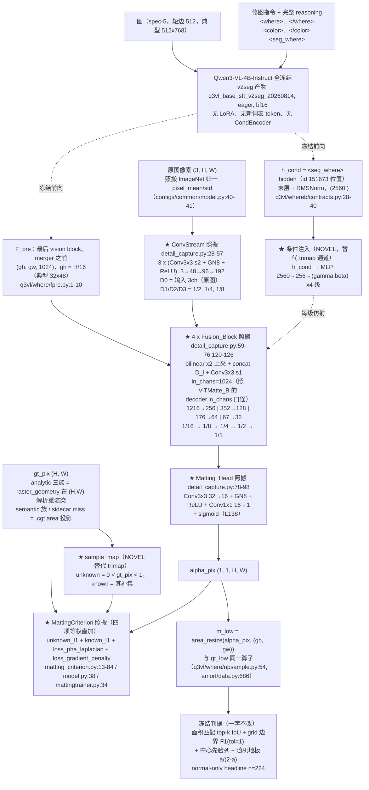

# 实验：ViTMatte 解码器忠实移植（冻结 Qwen3-VL 特征 + Detail_Capture 像素分辨率头）（EPR-022）

状态：提案（待 grill-me + 用户定稿）。

**本臂的模型方案 = ViTMatte 全件忠实移植**：头结构、loss 组成与权重、头超参、优化器一律照抄
原文与原仓库；训什么冻什么照搬。ST_LANG（ConvTower+FiLM+CondEncoder+UNIQ K=8+WTA+七项 grid
loss+语言侧 LoRA）**不是本方案的 baseline，也不作为被改动的对象**，其部件一概不进本臂模型；
它的 0.77390 只在 §4 结果表的「指标对照行」里作为同判据下的数字出现。

本文引用的外部行号以 2026-08-14 当日下载的 GitHub `hustvl/ViTMatte` main 分支 raw 文件为准
（下载清单见文末）；本仓库行号以当日工作区（lens-exp 分支）为准，逐个打开确认。

## 1. 任务

**这个实验要做的事，一句话**：把 ViTMatte 这套「1/16 的 ViT 特征 + 从原图逐级下采的细节流 →
逐级上采融合 → 出全分辨率 soft alpha」的解码器整件搬过来，ViT 的位置换成冻结 Qwen3-VL 的
`F_pre`，trimap 的位置换成语言条件 `h_cond`（`<seg_where>` hidden，§1「语言条件读出」），
其余（loss 四项、层规格、
优化器）全部照抄；预测出的像素 alpha 再用 area 算子降回 `(gh, gw)`，走完全不动的冻结判据。

**为什么是「移植」而不是「加一个分支」**：现行 where 分支的监督全部落在 grid 分辨率上
（GT 由 spec-5 hi 经 area-resize 到 `(gh, gw)`，`q3vl/whereb/amort/data.py:685-686`；grid 典型
32×48，一格对应 16×16 像素）。ViTMatte 是「冻结/预训练的 plain ViT 单尺度特征 + 轻量解码器
出全分辨率 alpha」这一形态里参数量最小、结构最简的公开实现，且其 ViT 特征的分辨率（stride 16）
与本仓库 `F_pre` 的 `H/16` 网格完全一致、4 级 ×2 上采恰好回到原图分辨率，因此可以整件搬运而不
需要改动分辨率安排。本实验的变量就是「这套配方在本任务的特征与条件下的数字」，所以能照抄的
一律照抄，只有无法照抄处才标 NOVEL 并给理由。

**数据、n、切分**：train = sft2seg-20260804 的 `render_mode == "local"`，n = 42752
（`q3vl/whereb/scripts/run_amort_arm.py:349`；`winner_confidence == "low"` 已排除，
`run_amort_arm.py:340`）；eval = V_where 的 local 子集 n = 400（`run_amort_arm.py:350`）；
headline 口径 normal-only n = 224（`.contexts.*.headline_normal_only`，
`q3vl/whereb/amort/evaluate.py:452-468`）。切分沿用 sha1 规则族，V_where / V_what / T_final
不进训练。

**忠实移植的对象（2026-08-14 打开原始 raw 文件逐行核实）**：

- **ViTMatte: Boosting Image Matting with Pretrained Plain Vision Transformers**（ICCV 2023），
  arXiv 2305.15272，`hustvl/ViTMatte`：
  - `modeling/decoder/detail_capture.py`：
    `Basic_Conv3x3`（L5-26）= `Conv2d(k=3, stride, padding=1, bias=False)` + `BatchNorm2d` +
    `ReLU(True)`（L17-19）；`ConvStream`（L28-57）默认 `in_chans=4`、`out_chans=[48, 96, 192]`
    （L34-35），逐级 stride=2，`out_dict['D0'] = x`（L51）即**输入张量本身**，`D1/D2/D3` =
    1/2、1/4、1/8；`Fusion_Block`（L59-76）= `F.interpolate(x, scale_factor=2, mode='bilinear',
    align_corners=False)`（L72）+ `torch.cat([D, F_up], dim=1)`（L73）+ `Basic_Conv3x3(stride=1)`
    （L69）；`Matting_Head`（L78-98）= `Conv2d(32→16, 3,1,1)` + `BatchNorm2d(16)` + `ReLU` +
    `Conv2d(16→1, 1,1,0)`（L88-93）；`Detail_Capture`（L100-139）默认 `in_chans=384`、
    `img_chans=4`、`fusion_out=[256,128,64,32]`（L106-109），融合块入通道
    `fus_channs[i] + conv_chans[-(i+1)]`（L123），forward 里第 i 块取 `D{len-i-1}`（L135），
    末端 `torch.sigmoid(self.matting_head(features))`（L138）。
  - `modeling/criterion/matting_criterion.py`：`loss_gradient_penalty`（L13-36）——
    `scale = sample_map.shape[0]*262144/torch.sum(sample_map)`（L18）、Sobel x 核
    `[[-1,0,1],[-2,0,2],[-1,0,1]]`（L21）、Sobel y 核 `[[-1,-2,-1],[0,0,0],[1,2,1]]`（L26）、
    `F.conv2d(..., padding=1)`（L22-28）、loss = x/y 两路 `l1_loss(Δpred·map, Δgt·map)·scale`
    **加** `0.01·mean(|Δpred·map|)·scale` 两项稀疏项（L31-34）；`loss_pha_laplacian`（L38-42）；
    `unknown_l1_loss`（L44-50）= `l1_loss(pred·map, gt·map)·scale`，同一 262144 归一（L46）；
    `known_l1_loss`（L52-63）= 在 `sample_map==0` 的补集上同式，且 `sum==0` 时 `scale=0`
    （L56-59）；`forward`（L66-73）按名字派发，三项吃 `sample_map`、laplacian 不吃；
    `laplacian_loss`（L77-84）`max_levels=5`、层权 `2**level`、`loss / max_levels`；
    高斯核 `[1,4,6,4,1]` 外积 /256（L98-106）、`downsample`（L116-119）、`upsample`（L121-126，
    `out[:, :, ::2, ::2] = img*4`）、`crop_to_even_size`（L128-132）。
  - `modeling/meta_arch/vitmatte.py`：`forward`（L38-53）——`features = backbone(images)`、
    `outputs = decoder(features, images)`（L41-42），即**解码器吃的 `images` 与骨干吃的是同一个
    4 通道张量**；训练时 `trimap = images[:, 3:4]`、`sample_map[trimap==0.5] = 1`（L46-48）；
    `preprocess_inputs`（L57-86）先 `(images - pixel_mean)/pixel_std`（L63）再
    `torch.cat((images, trimap), dim=1)`（L70），并把 H/W 补到 32 的倍数（L73-79）。
  - `configs/common/model.py`：`criterion.losses = ['unknown_l1_loss', 'known_l1_loss',
    'loss_pha_laplacian', 'loss_gradient_penalty']`（L38）；`pixel_mean = [123.675/255,
    116.280/255, 103.530/255]`、`pixel_std = [58.395/255, 57.120/255, 57.375/255]`（L40-41）；
    `size_divisibility=32`（L43）；`backbone.img_size=512`、`patch_size=16`、`embed_dim=384`
    （L11-14）。
  - `engine/mattingtrainer.py`：`losses = sum(loss_dict.values())`（L34）——**四项等权直加**；
    `with autocast()`（L28，fp16，无 enabled 开关）。
  - `configs/common/optimizer.py`：`optimizer = model_zoo.get_config("common/optim.py").AdamW`
    （L24），`lr_factor_func = partial(get_vit_lr_decay_rate, num_layers=12, lr_decay_rate=0.65)`
    （L25，`get_vit_lr_decay_rate` L4-21：**只对 `name.startswith("backbone")` 生效**，其余参数
    layer_id = num_layers+1 → 因子 `0.65**0 = 1.0`），`overrides = {"pos_embed": {"weight_decay":
    0.0}}`（L26）。
  - detectron2 `configs/common/optim.py`（`facebookresearch/detectron2` main）L18-28：
    `AdamW(lr=1e-4, betas=(0.9, 0.999), weight_decay=0.1)`，`get_default_optimizer_params(
    base_lr="${..lr}", weight_decay_norm=0.0)`。
  - `configs/ViTMatte_S_100ep.py`：`optimizer.lr = 5e-4`（L11）；
    `lr_multiplier.scheduler.values = [1.0, 0.1, 0.05]`（L12）、
    `milestones = [int(43100/16/2*30), int(43100/16/2*90)]`（L13）=
    **训练总步数的 30% 与 90%**；`train.max_iter = int(43100/16/2*100) = 134687`（L8）；
    `lr_multiplier.warmup_length = 250 / train.max_iter`（L15）≈ 0.001856；
    `dataloader.train.batch_size = 16`（L20）。`configs/ViTMatte_B_100ep.py` L7-9 把
    `backbone.embed_dim`、`num_heads` 与 **`model.decoder.in_chans` 一起改成 768** ——
    「解码器入通道 = 骨干特征通道」是原仓库自己的配置口径。
  - `configs/common/scheduler.py` L5-12：`WarmupParamScheduler(MultiStepParamScheduler(...),
    warmup_length=..., warmup_factor=0.001)`。
  - `configs/common/train.py` L4-5：`max_iter=90000`、`amp=dict(enabled=False)`
    （与 `mattingtrainer.py:28` 无条件 autocast 冲突，原仓库如此，如实记录）。
- **像素诊断读出列的口径来源**（只借口径，不进 headline、不进 loss）：
  **Matting Anything（MAM）**，arXiv 2306.05399，`SHI-Labs/Matting-Anything`
  `evaluation/metrics.py`：`BatchSAD` L169-174（`|Δ|/255` 求和 `/1000`）、`BatchMAD` L176-181、
  `BatchMSE` L183-188、`BatchGradient` L190-203（高斯一阶导滤波后梯度幅值差的平方，
  构造参数 `grad_sigma=1.4` 在 `BatchMetric.__init__` L91）、`BatchConnectivity` L205-235
  （`conn_step=0.1`、`conn_theta=0.15`，L91-92；每 batch 开 `Pool(B)`，L216）。

### 语言条件读出

语言条件向量 `h_cond` = base SFT v2seg 模型输出中 **`<seg_where>` token 位置的 hidden**：

```
h_cond = norm(hidden_states[-1]) 在 <seg_where> token 位置上的那一行，形状 (2560,)
```

层与归一化按 `q3vl/whereb/contracts.py:30-32`（`SEGMENT_HIDDEN_LAYER = -1` /
`SEGMENT_HIDDEN_FINAL_NORM = True`），维度 2560。

**v2seg 规格**：assistant 输出形制为
`<where>…</where><color>…</color><seg_where><seg_color><|im_end|>\n`，两个 seg token **受监督**；
`<seg_where>` id 151673、`<seg_color>` id 151674，两者追加在词表末尾
（`q3vl/train/constants.py:22-23`；四个 tag token `<where>` 151669 / `</where>` 151670 /
`<color>` 151671 / `</color>` 151672 见 `q3vl/train/constants.py:11-14`，字面 id 记在
`q3vl/whereb/attnread.py:62-64`）；产物目录 `/home/bc/data/runs/q3vl_base_sft_v2seg_20260814`。

**接入要点**：
(a) 前向序列喂到 `<seg_where>`——序列 = prompt + 完整 reasoning（where span + color span +
`<seg_where>`），读出切片取 `<seg_where>` 所在的**单个位置**（下标在拼接时记录，不做搜索式定位）。
挂点：序列构造 `q3vl/whereb/hiddens.py:170`、切片 `q3vl/whereb/hiddens.py:234`。仍是一次
`no_grad` 前向同时出 `F_pre` 与语言侧 hidden。
(b) 基座 = v2seg 产物 `/home/bc/data/runs/q3vl_base_sft_v2seg_20260814`；genwhere 生成缓存按该
checkpoint 重生成（缓存 schema 逐条记 `checkpoint` 字段，`q3vl/whereb/gencontext.py:122, 168`）。

**依赖项（写死）**：v2seg 训练产物落盘 **且** genwhere 缓存按 v2seg 重生成完成之前，**本臂不可
开跑**（2026-08-14 当日 `ls /home/bc/data/runs/` 未见 `q3vl_base_sft_v2seg_20260814`）。
v2seg 未就绪时的起跑档见文末待决策 D-11。

**本臂的条件消费点**：FiLM 的条件入向量 = `h_cond`，其后
`Linear(2560,256) + ReLU + Linear(256, 2·(256+128+64+32))` → 每个 Fusion 块输出后逐通道
`x·(1+γ_c) + β_c`，FiLM MLP 末层零初始化（step0 = 恒等仿射）。

**`<seg_color>`**：归 what 分支使用，**本批六臂不消费**（见文末待决策 D-12）。

读出方式的其余档（`<where>` span 池化、`</where>` / `</color>` / `<|im_end|>` 位置、可学习
query token、K > 1 的多 seg token）在 §4 读出方式消融组统一出数。

**指标对照行**（同判据下已有的数字，**不是**本臂的结构 baseline）：ST_LANG 0.77390（失败基线）、
M0 0.79095、center prior 0.5088、随机地板 0.2582、oracle 0.9737、用户可用线 0.85。

## 2. 模型图（★ = 本臂新建；虚线 = 冻结）



冻结/可训清单：Qwen3-VL 基座、视觉塔、语言侧**全部冻结**（`FrozenVLM.__init__` 对每个参数
`requires_grad_(False)`，`q3vl/whereb/hiddens.py:161-162`）——照搬 ViTMatte「骨干出特征、
解码器全训」的形制，唯一差别是 ViTMatte 的骨干参与训练（带 0.65 逐层 lr 衰减），本臂骨干
彻底冻结，故该 lr 分组不适用（见 §3 移植对照表）。可训 = DetailCapture 全件 + 条件 FiLM MLP。
参数量（按上表通道数手算）：ConvStream 约 0.21M（1296 + 41472 + 165888 + GN）+ 4 个 Fusion 卷积
约 3.33M（1216·256·9 + 352·128·9 + 176·64·9 + 67·32·9）+ Matting_Head 约 4.6K + FiLM MLP
约 0.90M（2560·256 + 256·960）≈ **4.4M**。

## 3. 改动怎么接进来（逐条可确认）

| 项 | 内容 |
|---|---|
| 改哪里 | ① **新文件 `q3vl/whereb/amort/matte.py`**：`Basic_Conv3x3` / `ConvStream` / `Fusion_Block` / `Matting_Head` / `Detail_Capture` 逐层照抄 `detail_capture.py` L5-139（通道表、stride、padding、`bias=False`、`ReLU(True)`、`scale_factor=2` 的 `bilinear/align_corners=False`、concat 顺序 `[D, F_up]`、`D{len-i-1}` 的取用顺序、末端 sigmoid 全部原样）。三处 NOVEL 适配：**(a) BatchNorm2d → GroupNorm(8, C)**（`detail_capture.py` L18/L90）——本管线是**逐样本前向**（`q3vl/whereb/amort/trainer.py:90-97` 的 docstring：H/16 网格在 400 个样本里有 13 种形状，padded batch 会把一张图的 pad 卷进另一张，因此不 pad、逐样本算），BN 的 batch 统计退化为单样本统计、且训练用 batch 统计 / 推理用 running stats 两套口径，`bias=False + BN` 的偏置也随之失配；GroupNorm8 是仓库既有约定（`q3vl/whereb/amort/heads.py:133,164,422`）。BN 原样进消融行。**(b) `img_chans` 4 → 3**：ViTMatte 第 4 通道是 trimap（`vitmatte.py:70`），本任务无 trimap，删除该通道；连带 `conv_chans = [3, 48, 96, 192]`，末级 Fusion 入通道 64+3 = 67。**(c) 条件注入**：ViTMatte 无文本条件，无原文可抄——形制 = **FiLM 仿射**：`h_cond`（`<seg_where>` 位置的单条 2560 维向量，§1「语言条件读出」）→ `Linear(2560,256) + ReLU + Linear(256, 2·(256+128+64+32))` → 每个 Fusion 块输出后逐通道 `x·(1+γ_c) + β_c`。concat 广播形制（条件向量投影到 16ch 平铺，接在 ConvStream 输入的 3ch 之后 = 19ch）进消融行。**该 FiLM 形制无原文出处、需用户确认，见文末待决策 D-10。**② **`in_chans` 设 1024**：`Detail_Capture(in_chans=…)` 是原仓库自己的配置旋钮，`configs/ViTMatte_B_100ep.py:9` 就是把它从 384 改成骨干的 768，因此「设成 `F_pre` 的 1024」属**照搬其配置口径**，不需要 1×1 降维适配器（第一块 Fusion 入通道 1024+192 = 1216）。③ **新 arm `MATTE`**：`AmortModel.__init__` 的 arm 分派（`q3vl/whereb/amort/model.py:118-131`）加一支 `elif arm == "MATTE": self.geo = MatteHead(...)`；`forward_geo`（`model.py:248-307` 的同层）加一支返回 `{"m_low": …, "alpha_pix": …, "params": {}}`。该臂**不消费** `phi_dir`/`sim`/`center`/`geom`/`cond`（`CondEncoder` 在 `q3vl/whereb/amort/model.py:111` 是无条件构造，本臂**不进其前向**、构造后对 `self.cond` 调 `requires_grad_(False)` 使其不进优化器，并在 `facts()` 里记 `cond_encoder_unused: true`；本臂的条件通路是自己的 FiLM MLP，与 `CondEncoder` 无关）。③′ **四族全部走新头（本批六份提案统一口径）**：启动命令固定带 `--no-semantic-head`（`q3vl/whereb/scripts/run_amort_arm.py:205`）+ `--no-sim-field`（`:121`）+ `--no-film`（`:123`）；`--no-semantic-head` 使 `model.sem is None`，路由判断（`q3vl/whereb/amort/trainer.py:101`、`q3vl/whereb/amort/evaluate.py:124` 的 `if x.route_semantic and model.sem is not None:`，两处代码一字不改）于是把 **semantic 族样本也送进 `forward_geo`**，即 semantic 族与 radial/band/linear 三族同样进 Detail_Capture 头训练与评测；semantic 族的 `gt_pix` 走本行 ④ 已写明的 `.cgt` area 投影通路（构造上不声明 geometry）。`SemanticHead`（自带 FiLM，`q3vl/whereb/amort/heads.py:416`）与 `CondEncoder` **不构造 / 不训练**（`SemanticHead` 由 `--no-semantic-head` 直接不建；`CondEncoder` 按上句冻结不训、不进前向），可训参数清单落盘核对。备选（保留语义头旧路由）见文末待决策 D-7。④ **像素 GT 与像素图**：`AmortSampleInputs`（`q3vl/whereb/amort/data.py:293-314`）新增 `gt_pix`、`img_pix` 两个字段。`img_pix` = `s.image_tensor()`（`q3vl/whereb/data.py:119-124`）在 `data.py:669` 已解码，零额外 IO，按 `pixel_mean/pixel_std`（`configs/common/model.py:40-41`）归一后进 ConvStream。`gt_pix` 分族取：**analytic 三族（radial/band/linear）** = `raster_geometry(mask_type, geometry, H, W)`（`dataset_build/src/construct/canonical_masks.py:90-123`，纯 numpy 归一化坐标 + smoothstep `α²(3−2α)`（L120）+ `Flipped` 反相（L121-122），分辨率无关解析式）在 spec-5 分辨率精确重渲染，零重采样误差；geometry 参数取自 `ConstructGeomStore`（`q3vl/whereb/amort/data.py:96-169`，sqlite 路径 `q3vl/whereb/config.py:321` `CONSTRUCT_GEOM_DB`）；slot→mask_type 映射按构造侧（`dataset_build/src/construct/subject_geom.py:106,142,199`）：radial/band → `circulargradient`，linear → `gradient`；**linear 族重算 amount**——`.cgt` 存的是 `effective = clip(raw·amount)`，`amount = 1.0 if raw_mean ≤ 0.5 else 0.5/raw_mean`（`canonical_masks.py:145-153` `linear_strength` + `_asset` L168-171），`raw_mean` 由重渲染场自身算出，确定性重现。**semantic 族**（构造上不声明 geometry，`q3vl/whereb/amort/geomparse.py:351-353`）与 sidecar miss 样本回退 `.cgt` 路径：`mask_target_hi()`（`q3vl/whereb/data.py:102-117`）即 `.cgt.png`（短边 1024，`q3vl/where/maskdata.py:180-190`，`MASK_SUFFIX` = `q3vl/where/config.py:197`）经 `mask_views` 的 area 投影到 `(out_h, out_w)`（`q3vl/where/maskdata.py:202-219`，`q3vl/whereb/data.py:245-249`）；maskviews 分片 `.maskhi.png`（同为 `(out_h, out_w)`，形状不符即 raise，`q3vl/whereb/data.py:237-241`；读目录 `MASKVIEW_READ_DIR` = `q3vl/where/config.py:225` → `/mnt/nfs-ro/bc/data/datasets/where_a-20260805/maskviews/`，只读走 nfs-ro）是同一 GT 的等价读法，作 IO 备选。**落地断言（预注册，沿用现有机制）**：训练启动前抽 n=200，analytic 族重渲染场 area-resize 回 `.cgt` 分辨率后 mean-abs 差 ≤ 0.02，超阈值样本逐个回退 `.cgt` 路径并把计数写进 `builder.facts()`（阈值 0.02 为 NOVEL 默认值，无原文出处；见文末待决策 D-9）。⑤ **新 criterion**（新文件 `q3vl/whereb/amort/matte_loss.py`，与 `losses.py` 的七项 grid loss 完全隔离，不改 `LossWeights`）：`unknown_l1_loss` / `known_l1_loss` / `loss_pha_laplacian` / `loss_gradient_penalty` 与 `laplacian_loss` 及其高斯金字塔工具函数逐行照抄 `matting_criterion.py` L13-132，四项**等权直加**（`configs/common/model.py:38` + `engine/mattingtrainer.py:34`），**0.01 的梯度稀疏项（L33-34）与 262144 归一常数（L18/L46/L59）原样保留**。两处 NOVEL 适配：**(a) `sample_map` 无 trimap**——ViTMatte 由 `trimap == 0.5` 取 unknown（`vitmatte.py:46-48`），本任务用 GT 自身的软带作 pseudo-trimap：`sample_map = ((gt_pix > 0) & (gt_pix < 1)).float()`，known 区仍按原实现取其补集（`matting_criterion.py:53-54`）；**(b) `unknown_l1_loss` 补零保护**——原实现只有 `known_l1_loss` 在 `sum == 0` 时置 `scale = 0`（L56-59），`unknown_l1_loss`（L46）没有同款保护，本数据可能出现无软带的全硬 GT，照 L56-59 的写法给 `unknown_l1_loss` 加同一个保护。**(c) `is_fake`（foreign 指令）样本的政策（写死，不静默）**——`fake_prob = 0.15`（`q3vl/whereb/amort/losses.py:74`，掷签在 `q3vl/whereb/amort/trainer.py:383`）；本臂的 criterion 与 `losses.py` 的七项栈完全隔离，因此**不走** `empty_mask` 项（`q3vl/whereb/amort/losses.py:286-291`）。保守默认 = 把 fake 样本的 `gt_pix` **整张置零**，再照四项原式算，**不排除、不加权、不改公式**，其数值行为逐项写明：`gt_pix ≡ 0` ⇒ `sample_map = ((gt_pix > 0) & (gt_pix < 1)) ≡ 0` ⇒ (i) `unknown_l1_loss` 的 `scale`（`matting_criterion.py:46`）分母 `torch.sum(sample_map) = 0`，由本行 (b) 新加的 `sum == 0 → scale = 0` 保护置零，该项恒为 0；(ii) `loss_gradient_penalty` 的 `scale`（`matting_criterion.py:18`）分母**同样为 0**——原实现在这里也没有保护，故本臂把 (b) 的同一个 `sum == 0 → scale = 0` 保护**一并施于 `loss_gradient_penalty`**（这是本臂第二处零保护，与 (b) 同源、同写法，标 NOVEL）；(iii) `known_l1_loss` 的 `sample_map == 0` 补集此时是全图、`sum != 0`，照原式在 `gt ≡ 0` 上算，有定义；(iv) `loss_pha_laplacian` 不吃 `sample_map`（`matting_criterion.py:66-73` 的派发），在 `gt ≡ 0` 上照原式算高斯金字塔 L1，有定义。fake 样本数与其四项分开计数落 `steps.jsonl`。**这是 NOVEL 政策**：ViTMatte 的训练数据每张都有 trimap 与非空前景，没有「空 GT」这一形态，无原文可抄。备选（把 fake 样本整体排除出本臂 criterion 并计数）见文末待决策 D-8。**红线自查：四项均为 L1 / 梯度 L1 / 拉普拉斯金字塔 L1，无 IoU、无 dice；本参考实现本身不含 dice。**（用户 2026-08-14 指示：本参考的 loss 全套忠实移植。）⑥ **trainer 分支**：`compute_micro_batch`（`q3vl/whereb/amort/trainer.py:83-200`）在 `if "uniq" in out:` 之前加一支 `if "alpha_pix" in out:`，调用新 criterion，把四项写进 `sl.total` / `sl.terms`（键名 `L_unknown_l1` / `L_known_l1` / `L_pha_laplacian` / `L_gradient_penalty`），经 `aggregate`（`q3vl/whereb/amort/losses.py:519-559`）自动落进 `steps.jsonl` —— 运行时断言的证据（见判据段）。既有的 `m_low.shape == (grid_h, grid_w)` 断言（`trainer.py:118-122`）对本臂同样生效。⑦ **scheduler 新增 multistep 分支**：`make_scheduler`（`q3vl/where/calibrate.py:126-145`）当前只有 cosine 与「warmup 后恒 1.0」两支，照搬 ViTMatte 需要 `MultiStepParamScheduler(values=[1.0, 0.1, 0.05])` + 按比例的 30%/90% 里程碑，加一个 `kind == "multistep"` 分支（既有两支不动）。⑧ **读出接缝（§1「语言条件读出」）**：`q3vl/whereb/hiddens.py:170` 的序列构造喂完整 reasoning 到 `<seg_where>` 为止、`q3vl/whereb/hiddens.py:234` 的切片取 `<seg_where>` 单个位置，两处由一个读出旗标统一分派；基座路径与 genwhere 缓存取 v2seg 档。旗标（默认值 = 主臂口径）：`--readout seg_where`（choices：`seg_where` / `where_span_pool` / `where_close` / `color_close` / `im_end` / `qtok`，对应 §4 读出方式消融组 ④-1 / ① / ②-a / ②-b / ③）、`--readout-qtok K`（默认 0；`qtok` 档取 1 / 4 / 8，机制照 `q3vl/whereb/amort/uniq4.py:76` / `:79` / `:113` / `:148`）、`--readout-nseg K`（默认 1；K>1 需对应 SFT 变体重训，占位）。旗标值、`<seg_where>` 的解析下标、基座 checkpoint 路径与 genwhere 缓存的 `checkpoint` 字段一并写进 `run_config` 与 `config/loss_preregistration.json`（`run_amort_arm.py:690`）；启动时断言「缓存的 `checkpoint` 字段 == 本次基座路径」，不一致即拒绝开训。 |
| 不变（明确列出没动的部分） | **基座**：Qwen3-VL-4B-Instruct、eager attention、bf16、全参数冻结（`q3vl/whereb/hiddens.py:161-162`），无 LoRA、主臂无新词表 token（读出方式消融组 ③ 的可学习 query 档是唯一例外，走 uniq4 机制）。**特征管线**：`FrozenVLM.encode`（`q3vl/whereb/hiddens.py:113-186`）、`F_pre` 的 `(gh, gw, 1024)` 契约与最后 vision block / merger 之前的取点（`q3vl/where/fpre.py:1-10, 85-127`）、语言侧 hidden 的 `SEGMENT_HIDDEN_LAYER = -1` + `SEGMENT_HIDDEN_FINAL_NORM = True`（`q3vl/whereb/contracts.py:28-40`）；基座 checkpoint 与 genwhere 缓存取 v2seg 档、`hiddens.py:170` 的序列构造与 `:234` 的切片按 §1「语言条件读出」接线。**数据**：train local n=42752 / eval V_where local 400、`winner_confidence == "low"` 排除（`run_amort_arm.py:340,349-350`）、sha1 切分规则族、quick-eval 半区（`run_amort_arm.py:627-636`）。**评测 GT 不换**：headline 用的 `gt_low` 仍是 `.cgt` 经 `area_resize` 到 `(gh, gw)`（`q3vl/whereb/amort/data.py:685-686`），与 `--matte-gt-source` 无关——GT 源旗标只影响训练侧的 `gt_pix`。**判据全套不换**：`evaluate_context` 的 grid 列（`q3vl/whereb/amort/evaluate.py:94-179`）、normal-only headline（`q3vl/whereb/amort/evaluate.py:452-468`）、面积匹配 top-k（`q3vl/whereb/metrics.py:127-144`）、grid 边界 F1 tol=1（`metrics.py:209-241`，`GRID_BOUNDARY_TOL_CELLS` = `q3vl/whereb/config.py:265`）、中心先验（`metrics.py:147-165`、`q3vl/whereb/amort/evaluate.py:57-75`）、随机地板 `a/(2−a)`（`q3vl/whereb/amort/evaluate.py:78-81`）、sign-flip permutation 1e4（`metrics.py:244-290`）。checkpoint 选择照旧「quick-eval 三门全过 + `local_soft_iou_median` 取大」，永不读 val loss（`q3vl/whereb/amort/trainer.py:492-506`）。**其他臂**：P1 / P3prime / SHAPE3 / UNIQ 的代码路径一行不改，`--arm MATTE` 不选 = 不进任何新分支。 |
| 移植对照表（原文数值 + 出处 + 本臂取值） | **头结构** — ConvStream 通道 `[48,96,192]`（`detail_capture.py:35`）→ 照搬；ConvStream 深度 3 级 stride2（L43-48）→ 照搬；Fusion 通道 `[256,128,64,32]`（L109）→ 照搬；Fusion 上采 bilinear ×2 / `align_corners=False`（L72）→ 照搬；concat 顺序 `[D, F_up]`（L73）→ 照搬；Matting_Head `32→16(3×3)→1(1×1)`（L88-93）→ 照搬；末端 sigmoid（L138）→ 照搬；`in_chans`（L106，`ViTMatte_B_100ep.py:9` 改 768）→ **1024**（同一配置旋钮）；`img_chans=4`（L107）→ **3（NOVEL，无 trimap）**；`BatchNorm2d`（L18/L90）→ **GroupNorm(8,C)（NOVEL，逐样本前向）**；文本条件 → **FiLM，入向量 = `h_cond`（`<seg_where>` 位置的单条 hidden，§1「语言条件读出」）（NOVEL，原文无此项）**。**loss** — 四项组成（`configs/common/model.py:38`）→ 照搬；四项权重 = 等权直加（`mattingtrainer.py:34`）→ 照搬 1.0/1.0/1.0/1.0；`262144` 归一常数（`matting_criterion.py:18,46,59`）→ **照搬字面值 262144**（原文 crop 为 512×512，本臂输入典型 512×768，字面值保留）；Sobel 核（L21,L26）→ 照搬；梯度稀疏系数 `0.01`（L33-34）→ 照搬；laplacian `max_levels=5`、层权 `2**level`、`/max_levels`（L77-84）→ 照搬；高斯核 `[1,4,6,4,1]²/256`（L98-106）→ 照搬；`crop_to_even_size`（L128-132）→ 照搬（512/768 为 32 倍数，前 5 级无裁剪）；`sample_map` 来源 `trimap==0.5`（`vitmatte.py:47-48`）→ **`0 < gt_pix < 1`（NOVEL）**；`unknown_l1` 零保护 → **照 `known_l1_loss` L56-59 补（NOVEL）**。**优化器** — 类型 AdamW（`configs/common/optimizer.py:24` → detectron2 `common/optim.py:18`）→ 照搬（仓库 `trainer.py:271` 已是 `torch.optim.AdamW`）；`lr = 5e-4`（`ViTMatte_S_100ep.py:11`）→ **照搬 5e-4**（仓库既有默认 3e-4 不用）；`betas = (0.9, 0.999)`（detectron2 `optim.py:26`）→ 照搬（= torch 默认，仓库未改）；`weight_decay = 0.1`（detectron2 `optim.py:27`）→ **照搬 0.1**（仓库既有默认 0.01 不用）；`weight_decay_norm = 0.0`（detectron2 `optim.py:23`）→ 照搬（仓库 `trainer.py:275-280` 的 `dim ≤ 1` 组 `weight_decay = 0.0` 即同口径）；backbone 逐层 lr 衰减 0.65（`configs/common/optimizer.py:25`）→ **不适用，骨干全冻结**；解码器 lr 因子（`get_vit_lr_decay_rate` 对非 backbone 名返回 `0.65**0 = 1.0`，L15-21）→ 照搬 1.0（全解码器同一 lr）；`pos_embed` wd override（L26）→ **不适用，无骨干参数**。**schedule** — MultiStep `values=[1.0, 0.1, 0.05]`（`ViTMatte_S_100ep.py:12`）→ 照搬；里程碑 30% / 90% 总步数（L13 与 L8 之比）→ **照比例适配到 1200 步 = 第 360 / 1080 步**；`warmup_factor = 0.001`（`configs/common/scheduler.py:11`）→ 照搬起点；`warmup_length = 250/134687 ≈ 0.1856%`（L15 与 L8 之比）→ **照比例适配 = `round(1200 × 0.001856) = 2` 步**（绝对 250 步 = 1200 的 20.8%，两种口径不可兼得，取比例口径；见文末「待用户决策注记」D-1）。**其余** — 总步数 `int(43100/16/2*100) = 134687`（L8）→ **适配为本战役的 1200 步档**（与指标对照行步数匹配，U4）；batch 16（L20）→ **沿用仓库 `effective_batch = 32`**（`run_amort_arm.py:106`），以保证与指标对照行同一「1200 步 × 32」样本口径；输入归一 `pixel_mean/std`（`model.py:40-41`）→ 照搬（施于 ConvStream 输入）；`size_divisibility = 32`（L43）→ 天然满足（spec-5 短边 512）；混合精度 fp16 autocast（`mattingtrainer.py:28`，与 `train.py:5` 的 `amp.enabled=False` 自相矛盾）→ **用仓库 bf16**（`trainer.py:284-288`）；梯度裁剪 → 原 config **未声明**该项（`configs/common/train.py` L1-16 无 `clip_gradients`），故不构成「明确关闭」，沿用仓库 `max_grad_norm = 1.0`（`trainer.py:47`）；训练期数据增广（`configs/common/dataloader.py:9-17` 的 `DataGenerator(phase='train')`）→ **不移植**，数据管线不动。 |
| 初始化（step0 状态） | 按 ViTMatte 原实现：`Detail_Capture` 全件**没有任何自定义 init**（`detail_capture.py` L1-139 无 `init_weights` / `trunc_normal_` / 零初始化），一律 PyTorch 默认（`Conv2d` = Kaiming-uniform、`GroupNorm` = weight 1 / bias 0），本臂照搬。因此 **step0 的 `alpha_pix` 是一张接近常数 0.5 的随机场**，其经 `area_resize` 降回 `(gh, gw)` 的 `m_low` 在判据上应落在随机地板量级附近；本臂**不做**「与某个既有臂 step0 逐位等价」的设计（该要求与忠实移植冲突：ViTMatte 的 Matting_Head 末层不是零初始化）。唯一 NOVEL 初始化 = 条件 FiLM MLP 的末层零初始化（weight 与 bias 全零，配合 `x·(1+γ)+β` 的写法 → step0 恒等仿射），理由：ViTMatte 无条件分支、无原文可抄，令 step0 精确等于「无条件 ViTMatte」这一可名状的状态；仓库零初始化纪律见 `q3vl/whereb/amort/heads.py:235,270,378`。构造顺序：新模块在 `AmortModel` 既有子模块全部构造完之后建（沿用 `q3vl/whereb/amort/uniq4.py:244` 的 "constructed LAST" 纪律），既有参数的 init RNG 流不动。 |
| 入口（旗标；不选 = 不影响现有任何臂） | `--arm MATTE` 加进 `run_amort_arm.py:90-91` 的 `choices`（现为 `["P1","P3prime","SHAPE3","UNIQ"]`）；本臂专属旗标挂在旗标区末尾、`_kw` 组装处（`run_amort_arm.py:481-509`）随 arm 透传：`--matte-cond {film,concat}`（默认 `film`）；`--matte-res {1.0,0.5}`（默认 `1.0` = 4 个 Fusion 到全分辨率；`0.5` = 3 个 Fusion 到 1/2 后即出 head，NOVEL——ViTMatte 固定全分辨率）；`--matte-gt-source {render,cgt}`（默认 `render` = analytic 三族解析重渲染；`cgt` = 全族走 `.cgt` area 投影；**只影响训练 GT，不影响评测 GT**）；`--matte-losses`（默认 `unknown_l1,known_l1,lap,grad` 四项全开，照搬 `configs/common/model.py:38` 的名单顺序；消融行传子集）；`--matte-norm {gn8,bn}`（默认 `gn8`）。优化器侧本臂的默认覆盖：`--lr 5e-4`、`--weight-decay 0.1`、`--scheduler multistep`（三者均为「照搬 ViTMatte」，写进 run_config）。全部旗标与四项 loss 名单写进 `config/loss_preregistration.json`（`run_amort_arm.py:690`），源码 sha256 冻结机制照旧（`run_amort_arm.py:41,54-60`）。**`--arm MATTE` 不选时，本次改动只新增文件与一支 `elif`，P1/P3prime/SHAPE3/UNIQ 的构图、loss、评测路径逐位不变。** |

判据（预注册，逐字，随判据冻结）：V_where local 400，normal-only headline
（`.contexts.*.headline_normal_only`，`q3vl/whereb/amort/evaluate.py:452-468`，n = 224），
面积匹配 top-k IoU 中位数；三列套装（soft-IoU minmax + grid 级边界 F1 tol=1 + 中心先验列）
+ 随机 top-k 地板 `a/(2−a)`；与指标对照行 1200 步步数匹配，逐样本配对 + sign-flip
permutation 1e4（`q3vl/whereb/metrics.py:244-290`）；AUC 一律不出现。

**预测场进判据的口径**：`m_low = area_resize(alpha_pix[None, None], (gh, gw))[0, 0]`
（`q3vl/where/upsample.py:54`）——与 `gt_low` 完全相同的算子与调用形式
（`q3vl/whereb/amort/data.py:686`），不做逐图 min-max、不做 softmax、不做双线性。
`m_low.shape == (grid_h, grid_w)` 由 `q3vl/whereb/amort/trainer.py:118-122` 的既有断言把关。

像素级读出列（**只作诊断，不进 headline，不进 loss，不作 checkpoint 选优**）：
pix soft-IoU（在 spec-5 分辨率上，`soft_iou_value` 同式，`q3vl/whereb/metrics.py:88-106`）、
Grad（σ = 1.4，MAM `evaluation/metrics.py:190-203` 口径）、SAD（MAM `metrics.py:169-174` 口径，
全图；随幅面线性膨胀、且与文献的 unknown-区口径不可比，绝不横向引用论文表数字）。
每条像素诊断列并排给出中心先验场与随机 top-k 场在同口径下的对照数字，**对照数字先出、列才启用**。
Conn 不进任何列（前景物体设计 + 每 batch 开 `multiprocessing.Pool`，MAM `metrics.py:205-235`）。
按 family（radial / band / linear / semantic）与 area 分层报。

运行时断言（三条，缺一即 AssertionError）：
(a) `assert_criteria_ran`（`q3vl/whereb/amort/evaluate.py:313-368`）的 `required` 表
（`q3vl/whereb/amort/evaluate.py:331`，现为 `{"SHAPE3": ["shape_residual"], "UNIQ": ["uniq_best"]}`）
为本臂登记 `"MATTE": ["pix_readout"]`——board 携带 0 值即拒绝出板；
(b) `steps.jsonl` **首行**必须同时带 `L_unknown_l1`、`L_known_l1`、`L_pha_laplacian`、
`L_gradient_penalty` 四列（沿用 `deep_supervision_tags` 同款首行机制，
`q3vl/whereb/amort/evaluate.py:288-310` + `run_amort_arm.py:70-85,724-742`）；
(c) `builder.facts()` 必须带 `gt_pix_source` 计数（render / cgt 两栏）与
analytic 重渲染抽检（n = 200，mean-abs 差 ≤ 0.02）的通过/回退计数，缺项即拒绝开训。

## 4. 结果（做完补，消融行全填这里）

（口径：headline = 面积匹配 top-k IoU 中位数，generated + normal-only，n = 224，
配对 sign-flip permutation 1e4。像素诊断列只列数字，不进 headline。）

**指标对照行**（同判据下的既有数字，非本臂的结构 baseline）：
ST_LANG 0.77390 ｜ M0 0.79095 ｜ center prior 0.5088 ｜ 随机地板 0.2582 ｜
oracle 0.9737 ｜ 用户可用线 0.85。

忠实配方主臂（ViTMatte 全件移植：in_chans 1024、GN8、img_chans 3、FiLM 条件、
四项 loss 等权、AdamW lr 5e-4 wd 0.1、multistep [1.0, 0.1, 0.05] @ 30%/90%、
1200 步、GT = render、res 1.0）：___

（headline ___；Δ vs ST_LANG 对照行 ___（p = ___）；Δ vs 中心先验 ___（p = ___）；
边界 F1 ___（中心先验 ___）；随机地板 ___；
像素诊断列：pix soft-IoU ___ / Grad ___ / SAD ___
（中心先验 ___ / ___ / ___；随机 top-k ___ / ___ / ___）；
per-family headline：radial ___ / band ___ / linear ___ / semantic ___）

消融行（全部写成「对忠实配方的偏离」，叠加式：忠实配方 = A；改动一项，指标变动是 ___）：

- 忠实配方 A（四项 loss）；**去掉 `loss_gradient_penalty` 与 `loss_pha_laplacian`**
  （只留 `unknown_l1 + known_l1`）：___
- 忠实配方 A（detail 分辨率 1.0，4 个 Fusion 到 512 短边）；**降到 0.5**
  （3 个 Fusion 到 1/2 即出 head）：___
- 忠实配方 A（训练 GT = analytic 三族解析重渲染）；**换成全族 `.cgt` area 投影**：___
- 忠实配方 A（条件注入 = FiLM 仿射）；**换成 concat 广播**（条件向量投影 16ch 平铺进
  ConvStream 输入，3ch → 19ch）：___
- 忠实配方 A（GroupNorm(8, C)）；**换回原文 BatchNorm2d**：___

**读出方式消融组**——骨干
固定取本臂**当前结果最好的模型形态**（其余结构、loss、优化器、步数全部保持该形态不动），
**只改「语言条件从哪里读」这一处**（即 FiLM 的入向量从哪来）；每行同样给 headline、配对 Δ 与
p，并各自带 Δ_const / Δ_shuffle。

| 行 | 读出口径 | 旗标 | 起跑依赖 | headline | 配对 Δ | p | Δ_const | Δ_shuffle |
|---|---|---|---|---|---|---|---|---|
| ① | `<where>` span 池化：含 `<where>` / `</where>` 两个标签 token 的 T 行 mask-mean 池化（前向序列喂到 `</where>` 为止，切片取该段 T 行；span 边界按 `q3vl/whereb/context.py:224-232` 的 `extract_segment`，切到第一个 `</where>` 并含该标签） | `--readout where_span_pool` | 口径本身不依赖 v2seg（checkpoint-4976 上即可跑）；与主臂配对比较时在同一基座上跑 | ___ | ___ | ___ | ___ | ___ |
| ②-a | special token 位置档：`</where>`（id 151670）单 token hidden | `--readout where_close` | **不依赖 v2seg**——该 token 在 checkpoint-4976 的输出里已存在 | ___ | ___ | ___ | ___ | ___ |
| ②-b | special token 位置档：`</color>`（id 151672）单 token hidden | `--readout color_close` | 同上（checkpoint-4976 输出末尾依次是 `</where>` → color span → `</color>` → `<\|im_end\|>`） | ___ | ___ | ___ | ___ | ___ |
| ②-c | special token 位置档：`<\|im_end\|>`（id 151645，受监督）单 token hidden | `--readout im_end` | 同上 | ___ | ___ | ___ | ___ | ___ |
| ③-1 | 可学习 query token 读出，`K_q = 1`（uniq4 词表扩展 + embedding forward hook，`q3vl/whereb/amort/uniq4.py:76` / `:79` / `:113`；query id **追加在完整输出之后**，追加写法同 `uniq4.py:148` 的 `where_ids + q_ids`） | `--readout qtok --readout-qtok 1` | 机制不依赖 v2seg（词表扩展 + hook 与基座版本无关） | ___ | ___ | ___ | ___ | ___ |
| ③-4 | 同上，`K_q = 4` | `--readout qtok --readout-qtok 4` | 同上 | ___ | ___ | ___ | ___ | ___ |
| ③-8 | 同上，`K_q = 8` | `--readout qtok --readout-qtok 8` | 同上 | ___ | ___ | ___ | ___ | ___ |
| ④-1 | special token 数量档：where 读出 token `K = 1`（= 主臂默认，单个 `<seg_where>`） | `--readout seg_where --readout-nseg 1` | v2seg | ___ | ___ | ___ | ___ | ___ |
| ④-2 | 同上，`K = 2` | `--readout seg_where --readout-nseg 2` | **需对应 SFT 变体重训**（v2seg 只监督 1 个 `<seg_where>`），**占位不排期** | ___ | ___ | ___ | ___ | ___ |
| ④-4 | 同上，`K = 4` | `--readout seg_where --readout-nseg 4` | 同上，**占位不排期** | ___ | ___ | ___ | ___ | ___ |

叠加式读法：本组的基线行 = ④-1（主臂默认读出，单个 `<seg_where>`）；换成 ① 的 span 池化，
指标变动是 ___；换成 ②-a / ②-b / ②-c 三个 special token 位置，分别是 ___ / ___ / ___；
换成 ③ 的可学习 query，`K_q` = 1 / 4 / 8 分别是 ___ / ___ / ___；把 where 读出 token 数从
1 加到 2 / 4，分别是 ___ / ___。**多条向量的聚合形制**（③ 的 `K_q > 1`、④ 的 `K > 1`）无原文
可抄：保守默认 = 每条各自过同一个 `Linear(2560,256)` 后按条数取平均，再走 FiLM MLP 的后半段，
**属 NOVEL、随本组一并请用户拍板**，未拍板前按此默认写进 `run_config`。

---

## 待用户决策注记（保守默认已写进上文，未静默拍板）

| 编号 | 事项 | 保守默认（已写死） | 需用户拍板的点 |
|---|---|---|---|
| D-1 | warmup 口径 | **比例保形 = 2 步**（`round(1200 × 250/134687)`，`ViTMatte_S_100ep.py:15` 与 `:8` 之比 ≈ 0.1856%） | 备选 = **照抄绝对 250 步**（= 1200 步的 20.8%，schedule 形状与原文完全不同）。两种口径不可兼得；「照抄数值」与「照抄形状」在 1200 步档下冲突，请指定优先哪一个 |
| D-2 | `262144` 归一常数 | **照搬字面值 262144**（`matting_criterion.py:18, 46, 59`，三处同值） | 原文的 crop 是 512×512（= 262144），本臂输入典型 512×768（= 393216）。备选 = 把常数改成本样本的 `H·W`（即恢复「归一到一张图」的原意）。字面值保留会让本臂的三项 loss 相对原文缩放 262144/393216 ≈ 0.667 倍；改成 `H·W` 则数值不再是原文字面值。请拍板 |
| D-3 | batch | **32**（仓库 `effective_batch`，`run_amort_arm.py:106`；与指标对照行同「1200 步 × 32」样本口径） | ViTMatte 原值 16（`ViTMatte_S_100ep.py:20`）。备选 = 严格照搬 16，此时 1200 步的样本吞吐减半，与对照行的步数匹配口径需重新约定（等步数还是等样本数）。lr 是否随之缩放一并见 D-5 |
| D-4 | 梯度裁剪 | **沿用仓库 `max_grad_norm = 1.0`**（`q3vl/whereb/amort/trainer.py:47`） | ViTMatte 的 `configs/common/train.py` L1-16 **未声明** `clip_gradients`，因此「原文关闭裁剪」不是明文，只是未声明。备选 = 忠实读法「原配方不裁剪」，本臂 `max_grad_norm = 0`。请拍板 |
| D-5 | `lr = 5e-4` / `wd = 0.1` 与对照行的差异声明 | **照搬 ViTMatte 原值**（`ViTMatte_S_100ep.py:11` 的 5e-4、detectron2 `common/optim.py:27` 的 0.1） | 指标对照行用的是仓库默认 `lr = 3e-4` / `wd = 0.01`（`q3vl/whereb/amort/trainer.py:43-44`）。**声明**：本臂与对照行因此在「结构 + 优化器」两个变量上同时不同，headline 差值不可归因到单一变量。备选 = 另排一条「本臂结构 + 仓库优化器（3e-4 / 0.01 / cosine）」的对照臂使两个变量可分离。请拍板是否排这条臂 |
| D-6 | `multistep` 调度分支 | **给 `make_scheduler`（`q3vl/where/calibrate.py:126-145`）加 `kind == "multistep"` 一支**（`values = [1.0, 0.1, 0.05]`，里程碑 = 总步数的 30% / 90% = 第 360 / 1080 步，`warmup_factor = 0.001`），既有 `cosine` 与「warmup 后恒 1.0」两支逐位不动 | 这是对**共享文件**的改动（EPR-018 的 D-4、EPR-021 的第 ⑤ 项也各自要往同一个 `make_scheduler` 加分支）。请拍板由谁先落地、分支命名如何统一，避免三份提案各加一个同义分支 |
| D-7 | 语义头旧路由 / `CondEncoder` | **`--no-semantic-head`，四族全部走 Detail_Capture 头**；`SemanticHead` 不构造，`CondEncoder`（`q3vl/whereb/amort/model.py:111` 无条件构造）不进前向、构造后 `requires_grad_(False)` 不进优化器（§3「改哪里 ③′」） | 备选一 = **保留语义头旧路由**（semantic 路由样本仍走既有 `SemanticHead` 与其原五项 loss，本臂只替换 geometry 路径），该备选下 semantic 分层数字由旧头产出、headline Δ 为 dilution-conservative 读法。备选二 = 给 `AmortModel.__init__` 加一个构造开关让 `CondEncoder` **真正不构造**（当前只能构造后冻结）。请拍板 |
| D-8 | `is_fake`（foreign 指令，p = 0.15）样本在本臂 criterion 下的处理 | **`gt_pix` 置全零、照四项原式算、不排除**，并把 (b) 的 `sum == 0 → scale = 0` 保护同时施于 `unknown_l1_loss` 与 `loss_gradient_penalty`（§3「改哪里 ⑤(c)」已写死数值行为） | 备选一 = 把 fake 样本整体排除出本臂 criterion 并计数（foreign 负控制退化为纯评测项）。备选二 = 保留现役 `empty_mask` 项（`q3vl/whereb/amort/losses.py:286-291`）作为第五项与移植的四项并存（会往忠实配方里加一项非 ViTMatte 的 loss，破坏「四项等权直加」）。三者都不是 ViTMatte 原文，请拍板 |
| D-9 | analytic 重渲染抽检阈值 | **mean-abs 差 ≤ 0.02**（n = 200），超阈值样本逐个回退 `.cgt` 路径并计数进 `builder.facts()` | 0.02 是 **NOVEL 默认值，无原文出处**，也无本仓库既有先例。备选 = 先做一次只读扫描量出 analytic 重渲染与 `.cgt` 的实际差分布再定阈值（不训练，一次性）。请拍板阈值或是否先扫描 |
| D-10 | 条件注入 FiLM 的形制确认 | **FiLM 仿射**：入向量 = `h_cond`（`<seg_where>` 位置的单条 2560 维 hidden，§1「语言条件读出」）→ `Linear(2560,256) + ReLU + Linear(256, 2·(256+128+64+32))` → 每个 Fusion 块输出后逐通道 `x·(1+γ_c) + β_c`；末层零初始化（step0 = 恒等仿射 = 无条件 ViTMatte） | ViTMatte **无文本条件分支，此形制无原文可抄，整条是 NOVEL**。需要确认的具体点：(i) 入向量的其余读出档在 §4 读出方式消融组 ①–④ 出数（span 池化 / 三个 special token 位置 / 可学习 query / K>1），**注意力池化未列入本批**；(ii) 施加位置（4 个 Fusion 块输出后 vs 只在最深一级 vs ConvStream 输入端）；(iii) 通道数 256 的中间层宽度；(iv) 是否改用 concat 广播形制（已作为消融行列出）。**未拍板前按上列默认继续，并在 `run_config` 里逐项记录。** |
| D-11 | v2seg 依赖排期：v2seg 未就绪时本臂怎么起跑 | **等 v2seg**——v2seg 产物落盘 + genwhere 缓存按 v2seg 重生成两件都完成后才开跑本臂（§1「语言条件读出」的「依赖项」已写死） | 备选 = 先用 §4 读出方式消融组 ②-c 的 `<\|im_end\|>` 档（checkpoint-4976 + 现有 genwhere 缓存即可跑）起跑一条，v2seg 到位后再按同 seed / 同步数跑主臂的 `<seg_where>` 档。代价：两条跑的基座不同，之间不构成逐样本配对比较，各自只能与本臂自己的对照列比。是否先起跑、以及先跑哪一档，请拍板 |
| D-12 | `<seg_color>`（id 151674）的归属 | **归 what 分支使用，本批六臂一律不消费**：本臂的 FiLM 只吃 `<seg_where>` 一个位置，`<seg_color>` 的 hidden 既不进 FiLM MLP、也不进 ConvStream、不进任何 loss 与诊断列 | 需确认：(i) 是否要加一条「FiLM 入向量 = `concat(<seg_where>, <seg_color>)`（5120 维，FiLM MLP 首层入维随之翻倍）」的读出消融行；(ii) what 分支若改动 `<seg_color>` 的位置或监督方式，会连带改动 §1 接入要点 (a) 的序列构造长度。未拍板前按「不消费」继续 |

---

来源清单（本提案引用的外部行号均出自 2026-08-14 当日下载的下述原始文件）：

- https://raw.githubusercontent.com/hustvl/ViTMatte/main/modeling/decoder/detail_capture.py
- https://raw.githubusercontent.com/hustvl/ViTMatte/main/modeling/criterion/matting_criterion.py
- https://raw.githubusercontent.com/hustvl/ViTMatte/main/modeling/meta_arch/vitmatte.py
- https://raw.githubusercontent.com/hustvl/ViTMatte/main/configs/common/model.py
- https://raw.githubusercontent.com/hustvl/ViTMatte/main/configs/common/optimizer.py
- https://raw.githubusercontent.com/hustvl/ViTMatte/main/configs/common/scheduler.py
- https://raw.githubusercontent.com/hustvl/ViTMatte/main/configs/common/train.py
- https://raw.githubusercontent.com/hustvl/ViTMatte/main/configs/common/dataloader.py
- https://raw.githubusercontent.com/hustvl/ViTMatte/main/configs/ViTMatte_S_100ep.py
- https://raw.githubusercontent.com/hustvl/ViTMatte/main/configs/ViTMatte_B_100ep.py
- https://raw.githubusercontent.com/hustvl/ViTMatte/main/engine/mattingtrainer.py
- https://raw.githubusercontent.com/facebookresearch/detectron2/main/configs/common/optim.py
  （ViTMatte `configs/common/optimizer.py:24` 引用的 `common/optim.py` AdamW 默认值出处）
- https://raw.githubusercontent.com/SHI-Labs/Matting-Anything/main/evaluation/metrics.py
  （只借 SAD / Grad 诊断列口径）
- arXiv 标题页核实：https://arxiv.org/abs/2305.15272 （ViTMatte）、
  https://arxiv.org/abs/2306.05399 （Matting Anything）

本仓库读出接缝相关 file:line（2026-08-14 当日工作区逐个打开确认）：
`q3vl/whereb/hiddens.py:170, 234`、`q3vl/whereb/context.py:224-232`、
`q3vl/whereb/contracts.py:30-32`、`q3vl/whereb/gencontext.py:122, 168`、
`q3vl/train/constants.py:11-14, 22-23`、`q3vl/whereb/attnread.py:62-64`、
`q3vl/whereb/amort/uniq4.py:76, 79, 113, 148`；v2seg 产物目录
`/home/bc/data/runs/q3vl_base_sft_v2seg_20260814` 当日 `ls /home/bc/data/runs/` 尚未出现
（另一执行线在实施中，见 D-11）。
