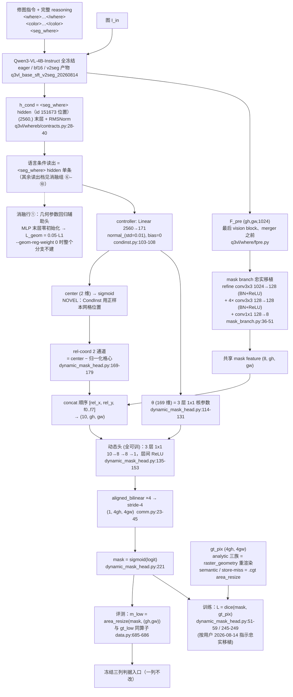

# 实验：CondInst 条件卷积分割头忠实移植（EPR-023）

状态：提案（待 grill-me + 用户定稿）。

**本提案没有结构基线。** ST_LANG（ConvTower + FiLM + CondEncoder + UNIQ K=8 query + WTA +
七项 loss + 语言 LoRA r16）是**失败基线**，它的任何部件都不进本方案；`0.77390` 这个数字只出现在
§4 结果表的**指标对照行**里，用来让新臂的 headline 有个同口径的参照数，不表示本臂是在它上面
改的。本臂是「冻结 Qwen3-VL 特征 + CondInst 全件忠实移植」的一次独立结构实验。

忠实移植的含义（本批提案的统一口径）：**头结构、loss 组成与权重、头超参、优化器一律照抄原文
与原仓库；训什么、冻什么照搬**；照搬不了的地方逐条标 **NOVEL** 并给理由。按用户 2026-08-14
指示，本批提案**解除**「dice/IoU 禁入 loss」这条战役红线对移植配方的约束——CondInst 的 mask
损失就是 dice，本臂原样保留（下文每处出现均标注：按用户 2026-08-14 指示忠实移植）。

外部行号以 2026-08-14 当日打开的 GitHub master/main 分支 raw 文件为准（来源清单见文末）；本仓库
行号以当日工作区为准，全部逐个打开核对过。

## 1. 任务

**这个实验要测什么。** 把 CondInst 的整套实例分割头搬到冻结 Qwen3-VL 的视觉特征上，用语言条件
`h_cond`（`<seg_where>` hidden，§1「语言条件读出」）代替 CondInst 里由检测器给出的实例条件，
看这套「共享 8 通道 mask feature + 相对
坐标通道 + 每实例动态生成的 3 层 1×1 卷积核」在本任务的冻结判据上出什么数。

**为什么选 CondInst 而不是自己拼一个。** 本任务的形态是「一张图 + 一句指令 → 一张 soft mask」，
CondInst 是「一张图 + 一个实例条件向量 → 一张 mask」，条件生成卷积核这一层结构可以一比一对上；
它的头非常小（3 层、每层 8 通道、共 169 个参数，论文摘要原话 "3 conv. layers, each having only
8 channels"，arXiv 2003.05664 摘要页 2026-08-14 打开核实），全部参数由 controller 生成，没有需要
和现役头对齐的隐式约定。

**任务卡登记的两个现象（只作调研动机，不作结论）：** mask 边缘不清晰；band/linear 预测退化为
radial。CondInst 的 rel-coord 通道让动态头第 0 层的输入里显式含有相对坐标
（`dynamic_mask_head.py:169-179`），本仓库 `.cgt` 的 band/linear 是坐标仿射量的 smoothstep、
radial 是坐标二次型的 smoothstep（`dataset_build/src/construct/canonical_masks.py:101-119`）。
这两件事被并列写在这里是选题理由，**不是任何机制主张**，数字出来前不下判断。

参考工作（全部已打开原始文件核实，行号见文末来源清单）：

- **CondInst**，arXiv 2003.05664（*Conditional Convolutions for Instance Segmentation*，
  Tian / Shen / Chen，arxiv.org/abs 页面核实标题与作者），官方实现 `aim-uofa/AdelaiDet`：
  - `adet/modeling/condinst/mask_branch.py`：多尺度输入各过一个 3×3 `conv_block` refine 到
    `channels` 通道（L36-41）、按 `aligned_bilinear` 对齐后**相加**融合（L70-84）、再过
    `num_convs` 个 3×3 `conv_block` 塔、末端 `nn.Conv2d(channels, num_outputs, 1)` 压成共享
    mask feature（L43-51）。所有实例共用这一张场。
  - `adet/config/defaults.py`：`MASK_OUT_STRIDE = 4`（L228）、`MASK_HEAD.CHANNELS = 8`（L238）、
    `MASK_HEAD.NUM_LAYERS = 3`（L239）、`MASK_HEAD.DISABLE_REL_COORDS = False`（L241）、
    `MASK_BRANCH.OUT_CHANNELS = 8`（L244）、`MASK_BRANCH.IN_FEATURES = ["p3","p4","p5"]`（L245）、
    `MASK_BRANCH.CHANNELS = 128`（L246）、`MASK_BRANCH.NORM = "BN"`（L247）、
    `MASK_BRANCH.NUM_CONVS = 4`（L248）、`MASK_BRANCH.SEMANTIC_LOSS_ON = False`（L249）；
    `FCOS.SIZES_OF_INTEREST = [64,128,256,512]`（L57）。
  - `adet/modeling/condinst/dynamic_mask_head.py`：`weight_nums/bias_nums` 构造——第 0 层
    `(in_channels+2)*channels` + `channels` bias（rel-coord 打开时，L116-121）、末层 `channels*1`
    + 1 bias（L122-124）、中间层 `channels*channels` + `channels` bias（L125-127），
    `num_gen_params = sum(weight_nums)+sum(bias_nums)`（L131）；`parse_dynamic_params` 把参数
    向量按这些段拆成逐层 `(out,in,1,1)` 卷积核（L62-87）；`mask_heads_forward` 用
    `groups=num_insts` 的单次 `F.conv2d(stride=1, padding=0)` 并行跑全部实例、层间 ReLU、
    末层无激活（L135-153）；rel-coords = 实例位置 − `compute_locations` 网格、除以该实例
    FPN 层的 `sizes_of_interest`、**concat 在 mask feature 之前**（L169-179）；动态卷积在
    `mask_feat_stride` 上做完，再 `aligned_bilinear(mask_feat_stride/mask_out_stride)` 上采到
    监督分辨率（L190-196）；训练时 `mask_scores = mask_logits.sigmoid()`（L221），全监督分支
    `loss_mask = dice_coefficient(mask_scores, gt_bitmasks).mean()`（L245-249），
    `dice_coefficient` 定义 `1 - 2·Σ(x·t)/(Σx² + Σt² + 1e-5)`（L51-59）；没有匹配到实例时
    输出恒零 dummy loss（L210-216）。
  - `adet/modeling/condinst/condinst.py`：`controller = nn.Conv2d(in_channels,
    mask_head.num_gen_params, kernel_size=3, stride=1, padding=1)`（L103-106），
    `normal_(weight, std=0.01)` + `constant_(bias, 0)`（L107-108）；总 loss 是
    `sem_losses + proposal_losses + mask_losses` 直接相加、**mask 项无额外权重系数**（L161-165）；
    GT bitmask 在 `mask_out_stride` 上**点采样**（`start = stride // 2`，
    `bitmask[start::stride, start::stride]`，L252 / L260-265）。
  - `adet/utils/comm.py`：`aligned_bilinear`（L23-45，replicate pad + `align_corners=True`
    插值 + 半格偏移裁剪）；`compute_locations`（L48-61，格心 = `arange(0, n*stride, stride) +
    stride//2`）。
  - `adet/layers/conv_with_kaiming_uniform.py`：`conv_block` 的卷积权重 `kaiming_uniform_(a=1)`、
    `bias=(norm is None)`、norm 存在时接 norm 再接 `ReLU(inplace=True)`（L23-47）。
  - `configs/CondInst/Base-CondInst.yaml`：`SOLVER.IMS_PER_BATCH 16`、`BASE_LR 0.01`、
    `STEPS (60000, 80000)`、`MAX_ITER 90000`。
  - `detectron2/config/defaults.py`（Base-CondInst 未覆盖的项从这里继承）：
    `LR_SCHEDULER_NAME "WarmupMultiStepLR"`（L526）、`MOMENTUM 0.9`（L534）、`NESTEROV False`
    （L536）、`WEIGHT_DECAY 0.0001`（L538）、`WEIGHT_DECAY_NORM 0.0`（L541）、`GAMMA 0.1`
    （L543）、`WARMUP_FACTOR 1/1000`（L549）、`WARMUP_ITERS 1000`（L550）、`WARMUP_METHOD
    "linear"`（L551）、`WEIGHT_DECAY_BIAS None`（L577，即随 `WEIGHT_DECAY`）、
    `CLIP_GRADIENTS.ENABLED False`（L580）、`AMP.ENABLED False`（L595）。

指标对照行（**不是结构基线**，只是同口径的参照数，口径见 §3 判据段）：

| 对照行 | headline（normal-only top-k IoU 中位数） |
|---|---|
| ST_LANG（失败基线） | 0.77390 |
| M0 | 0.79095 |
| center prior | 0.5088 |
| 随机 top-k 地板 | 0.2582 |
| oracle | 0.9737 |
| 用户可用线 | 0.85 |

### 语言条件读出

语言条件向量 `h_cond` = base SFT v2seg 模型输出中 **`<seg_where>` token 位置的 hidden**：

```
h_cond = norm(hidden_states[-1]) 在 <seg_where> token 位置上的那一行，形状 (2560,)
```

层与归一化按 `q3vl/whereb/contracts.py:30-32`（`SEGMENT_HIDDEN_LAYER = -1` /
`SEGMENT_HIDDEN_FINAL_NORM = True`），维度 2560。

**v2seg 规格**：assistant 输出形制为
`<where>…</where><color>…</color><seg_where><seg_color><|im_end|>\n`，两个 seg token **受监督**；
`<seg_where>` id 151673、`<seg_color>` id 151674，两者追加在词表末尾
（`q3vl/train/constants.py:22-23`；四个 tag token `<where>` 151669 / `</where>` 151670 /
`<color>` 151671 / `</color>` 151672 见 `q3vl/train/constants.py:11-14`，字面 id 记在
`q3vl/whereb/attnread.py:62-64`）；产物目录 `/home/bc/data/runs/q3vl_base_sft_v2seg_20260814`。

**接入要点**：
(a) 前向序列喂到 `<seg_where>`——序列 = prompt + 完整 reasoning（where span + color span +
`<seg_where>`），读出切片取 `<seg_where>` 所在的**单个位置**（下标在拼接时记录，不做搜索式定位）。
挂点：序列构造 `q3vl/whereb/hiddens.py:170`、切片 `q3vl/whereb/hiddens.py:234`。仍是一次
`no_grad` 前向同时出 `F_pre` 与语言侧 hidden。
(b) 基座 = v2seg 产物 `/home/bc/data/runs/q3vl_base_sft_v2seg_20260814`；genwhere 生成缓存按该
checkpoint 重生成（缓存 schema 逐条记 `checkpoint` 字段，`q3vl/whereb/gencontext.py:122, 168`）。

**依赖项（写死）**：v2seg 训练产物落盘 **且** genwhere 缓存按 v2seg 重生成完成之前，**本臂不可
开跑**（2026-08-14 当日 `ls /home/bc/data/runs/` 未见 `q3vl_base_sft_v2seg_20260814`）。
v2seg 未就绪时的起跑档见待决策 D-7。

**本臂的条件消费点**：controller 的输入 = `h_cond`，`Linear(2560 → 171)`，初始化
`normal_(std=0.01) + constant_(bias, 0)`（`condinst.py:107-108`）。几何参数回归辅助头
（消融行 ①）吃 controller 的同一个 `h_cond`。

**`<seg_color>`**：归 what 分支使用，**本批六臂不消费**（见待决策 D-8）。

读出方式的其余档（`<where>` span 池化、`</where>` / `</color>` / `<|im_end|>` 位置、可学习
query token、K > 1 的多 seg token、可学习 query 对 `<where>` span 的 cross-attention 读出）在
§4 读出方式消融组统一出数。

## 2. 模型图



冻结/可训清单：Qwen3-VL 基座（视觉塔 + 语言塔 + merger）**全部冻结**，`FrozenVLM.__init__`
对全部参数 `requires_grad_(False)` 并 `model.eval()`（`q3vl/whereb/hiddens.py:161-163`）；
**语言侧不注入 LoRA**（ST_LANG 的 LoRA 是失败基线部件，不进本臂）。可训 = mask branch
（refine + tower + 1×1）+ controller。这与 CondInst 的「backbone ImageNet 预训练权重参与
微调」不同——**NOVEL，理由：本战役数据纪律要求基座冻结，且 F_pre 在 Base-SFT 下与基座权重
一致（`q3vl/where/fpre.py` 模块头 L18-21）**。

## 3. 改动怎么接进来（逐条可确认）

### 数据

- **train**：`sft2seg-20260804`，`render_mode == "local"`，**n = 42752**，sha1 规则族切分。
- **eval**：V_where local **400**；generated 语境；headline **normal-only n = 224**。
- V_where / V_what / T_final 永不进训练；`winner_confidence == "low"` 不进主训与评测 GT。
- 数据管线本身**一行不改**：`AmortBatchBuilder`（`q3vl/whereb/amort/data.py:317`）、语境协议、
  shuffle / foreign / fixed_phrase 三负控制、切分规则全部沿用。
- 新增的只有一个 GT 张量 `gt_pix`（见「改哪里 ④」），挂在现有 `AmortSampleInputs`
  （`q3vl/whereb/amort/data.py:293-314`）的 `gt_low` / `gt_hi` 旁边，不动这两个已有字段。

### 模型（伪代码）

```
# ---- 冻结前向（无梯度）----
F_pre  = QwenVL.vision(I_in)          # (gh, gw, 1024)，H/16，典型 32x48
h_all  = QwenVL.lm(I_in, text)        # 完整 reasoning 的末层 + RMSNorm hidden
h_cond = h_all[idx_seg_where]         # (2560,)，<seg_where> 位置（§1 语言条件读出）

# ---- mask branch（CondInst mask_branch.py:36-51 照搬，单尺度）----
x         = conv3x3_BN_ReLU(F_pre, 1024 -> 128)          # refine（原文对 p3/p4/p5 各一个）
for i in 1..4: x = conv3x3_BN_ReLU(x, 128 -> 128)        # NUM_CONVS = 4
mask_feat = conv1x1(x, 128 -> 8)                          # OUT_CHANNELS = 8, (8, gh, gw)

# ---- controller（CondInst condinst.py:103-108 照搬，输入 = 语言条件向量）----
c      = h_cond                                           # (2560,)，§1 语言条件读出
out    = Linear(2560 -> 169 + 2)(c)
theta  = out[:169]                                        # 动态核参数
center = sigmoid(out[169:171])                            # (cx, cy) ∈ [0,1]^2

# ---- rel-coord（CondInst dynamic_mask_head.py:169-179 照搬，归一化口径改单尺度）----
loc    = normalized_grid(gh, gw)                          # 格心 (j+0.5)/gw, (i+0.5)/gh
rel    = center.view(2,1,1) - loc                         # (2, gh, gw)，值域 [-1,1]
inp    = concat([rel, mask_feat], dim=0)                  # (10, gh, gw)，rel 在前

# ---- 动态头（dynamic_mask_head.py:62-87 / 135-153 照搬）----
W, B   = parse_dynamic_params(theta, channels=8,
                              weight_nums=[80, 64, 8], bias_nums=[8, 8, 1])
z = inp
for i in 0..2:
    z = conv2d(z, W[i], B[i], stride=1, padding=0)        # 1x1
    if i < 2: z = relu(z)
logit  = aligned_bilinear(z, factor=4)                    # (1, 4gh, 4gw)，stride 16 -> 4
m_pix  = sigmoid(logit)

# ---- 评测读出（判据入口，口径与 gt_low 完全一致）----
m_low  = area_resize(m_pix[None,None], (gh, gw))[0,0]     # q3vl/where/upsample.py:54-62
```

`num_gen_params` 复算（`dynamic_mask_head.py:114-131` 的构造式，`in_channels = 8`、
`channels = 8`、`num_layers = 3`、rel-coord 打开）：
weights = `(8+2)*8` + `8*8` + `8*1` = 80 + 64 + 8 = **152**；biases = 8 + 8 + 1 = **17**；
合计 **169**，与论文摘要的「3 层 8 通道」小头一致。关掉 rel-coord（消融行③，
`DISABLE_REL_COORDS` 口径，`defaults.py:241`）时第 0 层变 `8*8`，合计 **153**。
controller 输出维度 = 169 + 2（center）= **171**。

### 数学公式（loss）

**主臂只有一项 loss**，就是 CondInst 全监督分支的 mask 项：

```
L = dice(m_pix, gt_pix)
  = 1 - 2 * Σ(m_pix · gt_pix) / ( Σ m_pix² + Σ gt_pix² + 1e-5 )
```

出处 `adet/modeling/condinst/dynamic_mask_head.py:51-59`（`dice_coefficient`）与 L245-249
（`loss_mask = dice_coefficient(mask_scores, gt_bitmasks).mean()`）；权重 **1.0**——
`condinst.py:161-165` 把 mask loss 直接 `losses.update` 进总和，没有系数。
**按用户 2026-08-14 指示忠实移植：dice 保留为优化目标**（本战役原有的「dice/IoU 禁入 loss」
红线对本批提案解除）。

移植时被**去掉**的 loss 项（NOVEL，逐条给理由）：

| 原文 loss 项 | 出处 | 本臂处理 | 理由 |
|---|---|---|---|
| FCOS 分类（focal） | `fcos_outputs.py`（经 `proposal_losses`，condinst.py:154-163） | **去除** | 无检测任务：一图一 mask，没有候选框分类问题 |
| FCOS centerness（BCE） | 同上 | **去除** | 同上，无正负样本分配 |
| FCOS 回归（IoU/GIoU box） | 同上 | **去除** | 同上，无框 |
| mask branch 语义辅助 focal | `mask_branch.py:130-136` | **去除** | 原文默认就是关的（`SEMANTIC_LOSS_ON = False`，defaults.py:249），照搬默认 |
| BoxInst 的 projection / pairwise | `dynamic_mask_head.py:8-48 / 223-244` | **去除** | 原文默认关（`BOXINST.ENABLED = False`，defaults.py:255），本任务是全监督 |

foreign 样本（数据管线里 p=0.15 的无关指令样本）的处理**也是照搬**：CondInst 在没有匹配到
实例时输出的是恒零 dummy loss（`dynamic_mask_head.py:210-216`），对应到本臂 = foreign 样本
不贡献任何 loss、不回传梯度。**这不是新设计，是原实现的同一分支**。

soft 目标说明（NOVEL，只说事实不下结论）：CondInst 的 `gt_bitmasks` 是 0/1 二值；本任务
`.cgt` 是 soft alpha ∈ [0,1]。`dice_coefficient` 的写法（分母用 `x²` 与 `target²`）对 soft
target 可直接计算，公式一字不改。

### 优化器（照抄 CondInst / detectron2，步数等比缩放）

| 项 | 原值 | 出处 | 本臂取值 |
|---|---|---|---|
| optimizer | SGD | detectron2 `build_optimizer` 默认 | SGD |
| momentum | 0.9 | `detectron2/config/defaults.py:534` | 0.9 |
| nesterov | False | `defaults.py:536` | False |
| base lr | 0.01 | `configs/CondInst/Base-CondInst.yaml` `SOLVER.BASE_LR` | 0.01 |
| weight decay | 1e-4 | `defaults.py:538` | 1e-4 |
| weight decay (norm 层) | 0.0 | `defaults.py:541` | 0.0 |
| weight decay (bias) | 随 WEIGHT_DECAY = 1e-4 | `defaults.py:577` | 1e-4 |
| scheduler | WarmupMultiStepLR | `defaults.py:526` | WarmupMultiStepLR |
| gamma | 0.1 | `defaults.py:543` | 0.1 |
| milestones | (60000, 80000) / MAX_ITER 90000 | `Base-CondInst.yaml` | **等比缩放到 1200 步档：(800, 1067)** |
| warmup | linear，1000 iters，factor 1/1000 | `defaults.py:549-551` | **等比缩放：13 步，factor 1/1000，linear** |
| grad clip | 关闭 | `defaults.py:580` | 关闭（本仓库 `trainer.py:47` 的 `max_grad_norm=1.0` 需在本臂置 0） |
| AMP | 关闭 | `defaults.py:595` | 头侧 fp32；冻结基座前向仍 bf16（不参与优化） |
| batch | IMS_PER_BATCH 16 | `Base-CondInst.yaml` | **32**（本仓库 effective batch，步数匹配口径；lr 不做线性缩放，见待决策 D-2） |
| 总步数 | 90000 | `Base-CondInst.yaml` `MAX_ITER` | **1200**（与对照行步数匹配） |
| seed | — | — | 20260810（本仓库 `trainer.py:54`） |

缩放算式（写死，便于复核）：`800 = round(1200 × 60000/90000)`、`1067 = round(1200 × 80000/90000)`、
`13 = round(1200 × 1000/90000)`。

### 接入表

| 项 | 内容 |
|---|---|
| 改哪里 | ① **新文件 `q3vl/whereb/amort/condinst.py`**：`MaskBranch`（`nn.Sequential`：`Conv2d(1024,128,3,p=1)+BN+ReLU` → 4×`Conv2d(128,128,3,p=1)+BN+ReLU` → `Conv2d(128,8,1)`，照 `mask_branch.py:36-51`；单尺度所以只有一个 refine、没有 L70-84 的跨层相加）、`Controller`（`Linear(2560, 171)`，照 `condinst.py:103-108` 的初始化）、`parse_dynamic_params` / `mask_heads_forward` / `aligned_bilinear` / `compute_locations`（分别照抄 `dynamic_mask_head.py:62-87`、L135-153、`comm.py:23-45`、L48-61；`compute_locations` 的格心 `+stride//2` 约定改写成归一化 `(i+0.5)/n`，等价）、`CondInstHead.forward(F_pre, h_cond) -> {"m_low", "m_pix", "logit"}`。② **新特征接口挂点**：`F_pre` 由现有 `AmortSampleInputs.feat`（`(1,1024,gh,gw)`，`q3vl/whereb/amort/data.py:296`）直接喂 mask branch，**不经过 ConvTower / FiLM / `_extra` 并联通道**（那三件是 ST_LANG 的，本臂不建）；语言侧 hidden 由现有 `AmortSampleInputs.cond_h` / `cond_mask`（`data.py:299-300`）承载，controller 只吃其中 `<seg_where>` 位置的那一行（= `h_cond`，§1「语言条件读出」；该位置的下标随 `cond_h` 一起由 builder 记录），**不经过 `CondEncoder`**（`q3vl/whereb/amort/heads.py:61-89`，同上）。③ **新 arm 名 `CONDINST`**：`q3vl/whereb/scripts/run_amort_arm.py:90-91` 的 `--arm choices` 加一项；`AmortModel.forward_geo`（`q3vl/whereb/amort/model.py:223-238`）加一条 `elif self.arm == "CONDINST"` 分支，返回 `{"m_low": (gh,gw), "m_pix": (4gh,4gw), "logit": ...}`；`facts()`（`model.py:366-394`）加 `condinst` 段记录全部头超参。④ **像素 GT 供给**：`AmortBatchBuilder`（`data.py:317`）新增 `gt_pix` 字段；analytic 三族用 `raster_geometry(mask_type, geometry, 4*gh, 4*gw)`（`dataset_build/src/construct/canonical_masks.py:90-123`），`geometry` 取自 `ConstructGeomStore.row(candidate_id)["geometry"]`（`data.py:96-169`，sidecar `/home/bc/data/runs/where_b/construct_geometry.sqlite3`，2026-08-14 打开核实：816,000 行，`slot_mode ∈ {radial, band, linear, semantic}` 各 204,000，前三族 `geometry` **全非空**、semantic **全为空**）；`slot_mode` → `mask_type` 映射 radial/band → `"circulargradient"`、linear → `"gradient"`（`dataset_build/src/construct/subject_geom.py:106/142/199`）；semantic 与 store-miss 样本回退 `area_resize(gt_hi, (4gh,4gw))`（`gt_hi` = `.cgt` 投影，`data.py:685`），**回退计数进 facts 作守卫列**。⑤ **训练接线**：`q3vl/whereb/amort/trainer.py:98-135` 的逐样本 loss 循环加 `if arm == "CONDINST": loss = dice(out["m_pix"], x.gt_pix)`（foreign 样本按 `dynamic_mask_head.py:210-216` 走恒零项）；`trainer.py:119-123` 的 `m_low` 形状断言原样保留（本臂返回的 `m_low` 就是 `(gh,gw)`，断言不放宽）。⑥ **优化器接线**：`trainer.py:271-281` 现在是硬编码 AdamW + `dim>1 / dim<=1` 两组 wd，本臂需 `--optimizer sgd` 分支 + detectron2 口径的参数分组（**norm 层 wd=0，其余含 bias 一律 1e-4**，`defaults.py:538/541/577`）；`make_scheduler`（`trainer.py:283`）加 `multistep` 档（milestones + gamma 0.1 + linear warmup）。⑦ **判据入册**：`q3vl/whereb/amort/evaluate.py:331` 的 `required` 字典（现为 `{"SHAPE3": ["shape_residual"], "UNIQ": ["uniq_best"]}`）加 **`"CONDINST": ["condinst_pix_readout"]`**，否则 `assert_criteria_ran` 对新 arm 是空要求、等于没接线（本战役已三次栽在「定义了没接线」）。`condinst_pix_readout` 为本臂预注册诊断聚合列，命名与聚合口径与本批其余新臂同一套（挂 `criteria_columns`，`q3vl/whereb/amort/evaluate.py:558-573` 同款写法），列内容 = 在头的原生 stride-4 场 `m_pix (4gh, 4gw)` 上算的 soft-IoU（minmax，`q3vl/whereb/metrics.py:88-105` 同式）+ 面积匹配 top-k IoU + grid 边界 F1（tol=1）+ 同支撑面的中心先验列 + 随机 top-k 地板 `a/(2−a)`；`n = 0` 拒绝出板。开 `--geom-reg-weight > 0` 时再追加 `"geom_reg_route"`（几何回归头的路由计数列，与 EPR-021 同款）。另加首行见证：`steps.jsonl` **第一行**必须带 `L_dice`（开辅助头时同时带 `L_geom`），缺列拒绝出板。⑧ **四族全部走新头（本批六份提案统一口径）**：启动命令固定带 `--no-semantic-head`（`q3vl/whereb/scripts/run_amort_arm.py:205`）+ `--no-sim-field`（`:121`）+ `--no-film`（`:123`）；`--no-semantic-head` 使 `model.sem is None`，路由判断（`q3vl/whereb/amort/trainer.py:101`、`q3vl/whereb/amort/evaluate.py:124` 的 `if x.route_semantic and model.sem is not None:`，两处代码一字不改）于是把 **semantic 族样本也送进 `forward_geo`**，即 semantic 族与 radial/band/linear 三族同样进 CondInst 头训练与评测；semantic 族的 `gt_pix` 走本行 ④ 已写明的 `area_resize(gt_hi, (4gh, 4gw))` 回退通路（sqlite 中 `geometry` 全为空）。`SemanticHead`（自带 FiLM，`q3vl/whereb/amort/heads.py:416`）与 `CondEncoder`（`q3vl/whereb/amort/model.py:111` 现为无条件构造）**不构造 / 不训练**：`SemanticHead` 由 `--no-semantic-head` 直接不建；`CondEncoder` 不进本头前向（controller 直接吃 `cond_h`/`cond_mask`），构造后对 `self.cond` 调 `requires_grad_(False)`、不进优化器，可训参数清单落盘核对。备选（保留语义头旧路由）见待决策 D-6。⑨ **读出接缝（§1「语言条件读出」）**：`q3vl/whereb/hiddens.py:170` 的序列构造喂完整 reasoning 到 `<seg_where>` 为止、`q3vl/whereb/hiddens.py:234` 的切片取 `<seg_where>` 单个位置，两处由一个读出旗标统一分派；基座路径与 genwhere 缓存取 v2seg 档。旗标（默认值 = 主臂口径）：`--readout seg_where`（choices：`seg_where` / `where_span_pool` / `where_close` / `color_close` / `im_end` / `qtok` / `xattn`，对应 §4 读出方式消融组 ⑨-1 / ⑥ / ⑦-a / ⑦-b / ⑧ / ⑩；`--condinst-ctrl {seg,pool,query}` 是其别名，分别映到 `seg_where` / `where_span_pool` / `xattn`）、`--readout-qtok K`（默认 0；`qtok` 档取 1 / 4 / 8，机制照 `q3vl/whereb/amort/uniq4.py:76` / `:79` / `:113` / `:148`）、`--readout-nseg K`（默认 1；K>1 需对应 SFT 变体重训，占位）。旗标值、`<seg_where>` 的解析下标、基座 checkpoint 路径与 genwhere 缓存的 `checkpoint` 字段一并写进 `config/condinst_setup.json`；启动时断言「缓存的 `checkpoint` 字段 == 本次基座路径」，不一致即拒绝开训。 |
| 不变（明确列出没动的部分） | 基座：Qwen3-VL-4B-Instruct，eager attention、bf16、全参数冻结（`q3vl/whereb/hiddens.py:161-163`）；特征契约：`F_pre` 定义与 unshuffle（`q3vl/where/fpre.py`）、语言侧 hidden 的层与 RMSNorm 口径（`q3vl/whereb/contracts.py:28-40`）、特征管线 `q3vl/whereb/hiddens.py:113-186`；基座 checkpoint 与 genwhere 缓存取 v2seg 档、`hiddens.py:170` 的序列构造与 `:234` 的切片按 §1「语言条件读出」接线。数据：切分、n、语境协议、shuffle / foreign / fixed_phrase 三负控制、`winner_confidence` 过滤（`q3vl/whereb/amort/data.py`）。评测：`evaluate_context` 的每一列（`q3vl/whereb/amort/evaluate.py:136-174`）、`headline_normal_only`（`q3vl/whereb/amort/evaluate.py:452-468`）、`paired_delta` sign-flip permutation n_perm=10000（`q3vl/whereb/metrics.py:244-290`）、`assert_criteria_ran`（`q3vl/whereb/amort/evaluate.py:313-345`）、checkpoint 选择（quick-eval 硬门 + `local_soft_iou_median`，`trainer.py:492`，**禁 val loss**）。ST_LANG 的全部部件（ConvTower / FiLM / CondEncoder / K=8 query / WTA / 七项 loss / 语言 LoRA / cls 头 / sel 头 / `to_mask`）在本臂**一个都不建、一个都不进 forward**。 |
| 初始化 | mask branch 的每个 3×3 卷积：`kaiming_uniform_(weight, a=1)`、有 BN 所以 `bias=False`（`conv_with_kaiming_uniform.py:23-38`）；末端 `Conv2d(128,8,1)` 是裸 `nn.Conv2d`，用 PyTorch 默认初始化（`mask_branch.py:48-50` 原样，不加零初始化）。controller `Linear(2560,171)`：`normal_(weight, std=0.01)` + `constant_(bias, 0)`（`condinst.py:107-108`）。BN 用 PyTorch 默认（weight=1, bias=0）。**step0 状态**：controller 权重 std=0.01、bias=0 → θ 近零但非零；动态头第 0 层输出近零 → ReLU 后近零 → 末层输出近零 → `sigmoid ≈ 0.5`，即 step0 的 `m_pix` 是一张接近 0.5 的近常数场，`m_low` 同。**本臂不要求与任何既有臂 step0 逐位等价**（没有结构基线可对齐），只要求 step0 状态可复算、写进 `run_setup`。 |
| 新增超参与建议默认值 | `mask_branch_channels = 128`（defaults.py:246）、`mask_branch_num_convs = 4`（L248）、`mask_branch_norm = "BN"`（L247）、`mask_branch_out_channels = 8`（L244）、`mask_head_channels = 8`（L238）、`mask_head_num_layers = 3`（L239）、`disable_rel_coords = False`（L241）、`mask_out_stride = 4`（L228）。上采样倍数 = `feat_stride / mask_out_stride` = 16 / 4 = **4**（本任务 `F_pre` 是 stride 16；CondInst 的 mask feature 在 p3 = stride 8、倍数为 2——**输出 stride 对齐到 4，输入 stride 不同，这是单尺度替换的直接后果，NOVEL 标注见下表**）。GT 重采样算子 = `area_resize`（`q3vl/where/upsample.py:54-62`）。显存粗估：mask branch 在 (gh,gw)=32×48 上跑 128 通道 fp32 ≈ 0.8MB/样本，动态头输入 (10,32,48) ≈ 0.06MB/样本，stride-4 logit (1,128,192) ≈ 0.1MB/样本；新参数 ≈ 1024·128·9 + 4·128·128·9 + 128·8 + 2560·171 ≈ 1.77M + 0.44M ≈ **2.2M**。远低于 65GB 共存线。 |
| 入口（旗标；不选 = 不影响现有任何臂） | `--arm CONDINST`（`q3vl/whereb/scripts/run_amort_arm.py:90-91` 新增 choice；不选则整条分支不构造、现有 P1 / P3prime / SHAPE3 / UNIQ 逐位不动）。头超参旗标：`--condinst-mask-out-stride`（默认 4）、`--condinst-head-channels`（默认 8）、`--condinst-head-layers`（默认 3）、`--condinst-no-rel-coords`（默认关 = `DISABLE_REL_COORDS False`）、`--condinst-ctrl {seg,pool,query}`（**默认 `seg`** = `h_cond`；`pool` / `query` 两档见 §4 读出方式消融组 ⑥ / ⑩，与本表「改哪里 ⑨」的 `--readout` 是同一个旋钮的别名）、`--condinst-gt {raster,cgt}`（默认 `raster`）、`--condinst-mask-loss {dice,bce}`（默认 `dice`）、`--condinst-center-sup`（默认关）。辅助头旗标：`--geom-reg-weight FLOAT`（**默认 0.0；0 = 分支不建、参数不创建、loss 里没有这一项**）。优化器旗标：`--optimizer {adamw,sgd}`（本臂 `sgd`）、`--scheduler {cosine,multistep}`（本臂 `multistep`）、`--lr-milestones 800,1067`、`--lr-gamma 0.1`、`--warmup-iters 13`、`--max-grad-norm 0`。全部旗标 + `condinst.py` 的 sha256 写进 `config/condinst_setup.json`（照 `run_uniq4b_arm.py:104-137` 的冻结记录形制）。 |

### 忠实移植 / NOVEL 对照表（照搬不了的地方在这里，一条不漏）

| 部件 | CondInst 原样 | 本臂 | 标记 + 理由 |
|---|---|---|---|
| mask branch 结构 | refine + 4 conv 塔 + 1×1 出 8ch | 同 | 忠实（`mask_branch.py:36-51`） |
| mask branch 输入 | FPN 三尺度 p3/p4/p5 相加融合（L70-84） | 单尺度 `F_pre`（stride 16），只有一个 refine，无跨层相加 | **NOVEL**：冻结基座只暴露一个 `F_pre` 张量（`q3vl/where/fpre.py`），没有 FPN；构造多尺度需要改基座前向 = 破坏冻结 |
| 动态头结构 / 参数拆分 / groups 卷积 | 3 层 1×1，8 通道，169 参数 | 同 | 忠实（`dynamic_mask_head.py:62-87 / 114-153`） |
| rel-coord 通道 | 2 通道，concat 在 mask feature **之前** | 同 | 忠实（`dynamic_mask_head.py:177-179`） |
| rel-coord 的「实例中心」 | 被分配到该实例的 FCOS **正样本网格位置**（`compute_locations`，comm.py:48-61），不是可学参数，**也没有任何中心损失** | controller 同源输出的 2 维 `sigmoid` 中心，**主臂不加中心监督** | **NOVEL**（结构）+ **忠实**（监督）：无检测器就没有正样本位置可取，中心必须从条件向量出；「不显式监督中心」这一点与原文一致，显式质心监督放消融行 |
| rel-coord 归一化 | 除以该实例 FPN 层的 `sizes_of_interest`（[64,128,256,512,1024]，defaults.py:57 + L104） | 归一化图幅口径（格心 `(i+0.5)/n`，rel ∈ [−1,1]） | **NOVEL**：单尺度没有 per-level soi 可取 |
| controller | `Conv2d(256, 169, 3, p=1)` 逐位置出参数，按正样本位置取（condinst.py:103-106） | `Linear(2560, 171)` 作用在 `h_cond`（`<seg_where>` 位置的单条 hidden，§1「语言条件读出」）上 | **NOVEL**：一图一 mask，没有位置可选；单层线性是原文单层卷积的最近对应物（**不引入 MLP、不引入 LoRA**）。其余入向量档（span 均值池化、可学 query 对 span 做 cross-attention 读出）在 §4 读出方式消融组 ⑥ 与 ⑩ 出数 |
| controller 初始化 | `normal_(std=0.01)` + bias 0 | 同 | 忠实（`condinst.py:107-108`） |
| 上采样 | `aligned_bilinear(mask_feat_stride / mask_out_stride)`，即 8/4 = 2 | 同函数，倍数 16/4 = **4** | **NOVEL（倍数）+ 忠实（算子与输出 stride）**：输入特征 stride 不同 |
| mask loss | dice，权重 1.0 | 同 | **忠实（按用户 2026-08-14 指示保留 dice 为优化目标）** |
| GT 采样口径 | 二值 bitmask **点采样** `[start::stride]`，`start = stride//2`（condinst.py:252/260-265） | analytic 三族在目标分辨率**解析重渲染**；semantic / store-miss 用 `area_resize` | **NOVEL**：`.cgt` 是 soft smoothstep 而非二值多边形，点采样会丢渐变带；解析重渲染完全绕开重采样。GT 源两档进消融行④ |
| backbone 训练 | ImageNet 预训练 R-50 参与微调 | 全冻结，不训 | **NOVEL**：战役数据纪律 |
| FCOS 三项 loss | cls focal + centerness + box | 全部去除 | **NOVEL**：无检测任务（理由见上表） |
| BoxInst / 语义辅助 loss | 默认关 | 关 | 忠实（defaults.py:249/255） |

### 消融行必含项①：几何参数回归辅助头（规格）

接入表入口旗标 `--geom-reg-weight FLOAT`，**默认 0.0；为 0 时分支不建、参数不创建、loss 里
不出现这一项**。规格：

- **输入**：controller 的同一个输入表示（`h_cond` = `<seg_where>` 位置的单条 hidden，2560 维；
  §1「语言条件读出」）。
- **结构**：`Linear(2560, 256) + ReLU + Linear(256, D_out)`，**末层权重与 bias 零初始化**
  （本仓库零初始化纪律）。
- **目标来源**：`ConstructGeomStore`（`q3vl/whereb/amort/data.py:96-169`），
  `row(candidate_id)["geometry"]`。
- **参数集按 mask_type**（键名 2026-08-14 打开 `dataset_build/src/construct/canonical_masks.py:90-123`
  核实，只取 `raster_geometry` **实际消费**的键，`Roundness` / `Midpoint` 存在于 sqlite 但
  渲染器不读，不进回归目标）：
  - `circulargradient`（radial / band）：中心 `cx=(Left+Right)/2`、`cy=(Top+Bottom)/2`
    （L102-103），两半径 `rx=|Right−Left|/2`、`ry=|Bottom−Top|/2`（L104-105），`Angle`（L106），
    `Feather/100`（L110 的 `max(value("Feather",50.0)/100.0, 0.05)`），`Flipped`（L121）。
  - `gradient`（linear）：`ZeroX` / `ZeroY` / `FullX` / `FullY`（L113-114），`Flipped`（L121）。
- **坐标口径**：`raster_geometry` 用 `x = xx/width`、`y = yy/height`（L98-100），所以 sqlite 里
  的坐标参数已经是归一化图幅分数，回归目标**直接取原值、不再归一化**。注意实测取值可以出
  **[0,1] 之外**（band 样本实测 `Left = −1.1007`、`Right = 2.0993`、`Bottom = 1.0913`），
  所以坐标输出头**不得**加 sigmoid / clamp。
- **角度编码**：`sin(2θ)` / `cos(2θ)` 两列（±180° 同形）。
- **`Flipped`**：单独一列 BCE（同形异参）。
- **semantic 族**：sqlite 中 `geometry` 全为空（2026-08-14 核实：204,000 行全 NULL），
  **L_geom 对 semantic 样本整项置零**，并计数进守卫列。
- **近各向同性样本的角度分量掩掉**：构造侧当 `natural_elongation < 1.15` 时角度取
  `rng.uniform(-90.0, 90.0)`（`dataset_build/src/construct/subject_geom.py:99-100`），即角度
  与形状无关。训练时可观测的代理量是 sqlite 里的 `max(rx,ry)/min(rx,ry)`。
  **判定阈值待用户拍板（见待决策 D-1），未拍板前不实现该掩码、并在守卫列记录未掩码。**
- **损失**：`L_geom = 0.05 · L1(pred, target)`（`Flipped` 那一列用 BCE），总 loss
  `L = dice(m_pix, gt_pix) + 0.05 · L_geom_terms`。**0.05 这个权重标 NOVEL**，理由：CondInst
  没有几何回归头，无原值可抄；0.05 与本仓库既有辅助项量级同档，作为保守起点。
- **路由**：辅助头同时输出一个 3 类 logit（`circulargradient` / `gradient` / `semantic`）决定
  用哪套参数集；**路由正确率**（argmax vs 构造侧 `slot_mode`）就是本臂的 family 判别读出列
  ——忠实配方里没有 cls 头，`uniq_cls_confusion` 那类列在本臂不存在，family 判别口径由这个
  路由正确率替代。
- **观察列**（不进 headline，只观察）：路由正确率（总体 + 按 band / linear / radial / semantic
  分层）、各参数分量的 L1 中位数、`Flipped` 准确率。

## 判据（预注册，逐字冻结，与既有实验完全一致）

- 数据：V_where local **400**，generated 语境，**headline normal-only n=224**，取
  `.contexts.*.headline_normal_only`（`q3vl/whereb/amort/evaluate.py:452-468`），
  **禁用顶层 pooled `.baselines`**。
- headline 指标：**面积匹配 top-k IoU 中位数**（`hard_iou(topk_mask(m, k), topk_mask(gt, k))`，
  `k = gt_area_k(gt)`；`q3vl/whereb/metrics.py:127-145 / 200-207`）。
- 三列套装缺一不可（`q3vl/whereb/amort/evaluate.py:136-174` 已在每行）：
  ① soft-IoU（**min/max 形式**，`q3vl/whereb/metrics.py:88-105`）
  ② grid 级边界 F1（**tol_cells=1**，`q3vl/whereb/metrics.py:209-242`；**像素级 3px 禁用**）
  ③ **中心先验列**（`center_prior_hard_iou` / `center_prior_soft_iou` /
  `center_prior_boundary_f1`），任何定位主张必须出示配对 Δ + p。
- 随机 top-k 地板 `a/(2−a)`（`q3vl/whereb/amort/evaluate.py:78-82`）每行并排。
- 配对检验：逐样本配对 + **sign-flip permutation，n_perm = 10000**
  （`q3vl/whereb/metrics.py:244-290`）。
- 指令条件性：同图配对差分 + shuffle / 无关词（foreign）/ 固定短语三负控制，每个消融行
  必带 `Δ_const` 与 `Δ_shuffle`。
- 弊列：`corr_center_minus_corr_gt`（`q3vl/whereb/amort/evaluate.py:465-467`）每板必出。
- **AUC 全战役禁用。**
- 按 family（radial / band / linear / semantic）与 area 分层报。
- 运行时断言：`assert_criteria_ran`（`q3vl/whereb/amort/evaluate.py:313-345`）；
  `required` 字典（`q3vl/whereb/amort/evaluate.py:331`）**必须**登记
  **`"CONDINST": ["condinst_pix_readout"]`**（开 `--geom-reg-weight > 0` 时追加
  `"geom_reg_route"`），列定义见 §3 接入表「改哪里 ⑦」；该列 `n = 0` 即拒绝出板。
  另加 `steps.jsonl` **首行**必须带 `L_dice`（开辅助头时同时带 `L_geom`），缺列拒绝出板。
- **预注册违规（DELTA §5.6）诚实登记**：本臂的动态头第 0 层输入里显式含 **rel-coord 两通道**
  （`center − 归一化格心`，`dynamic_mask_head.py:169-179`，concat 在 mask feature 之前），
  这是**坐标通道**，DELTA §5.6 明文禁止（禁令与 E3 的实测记在
  `q3vl/whereb/amort/heads.py:15-21`：corr(输出, 中心先验) 0.64 > corr(输出, GT) 0.47）。
  照 EPR-011 arm A 的先例，本臂以**预注册违规**处理、不因该禁令改结构（去掉 rel-coord 的读法
  已作为消融行③单独列出）；执行线 = 每板必出的 `corr_center_minus_corr_gt` 列
  （`q3vl/whereb/amort/evaluate.py:465-467`）：该列 > 0 即中心先验病复活，§5.6 立、本结构死。
- 步数匹配：1200 步（U4）。checkpoint 选择：quick eval 硬门 + `local_soft_iou_median`
  （`q3vl/whereb/amort/trainer.py:492`），**禁 val loss**。

**预测 mask 回 `(gh,gw)` 的口径（写死）**：头在 stride-4 上出 `m_pix = sigmoid(logit)`，形状
`(4gh, 4gw)`；判据入口用
`m_low = area_resize(m_pix[None,None], (gh, gw))[0,0]`
——**与 `gt_low` 完全同一个算子**（`q3vl/whereb/amort/data.py:685-686` 对 `gt_hi` 用的就是
`area_resize(..., (gh, gw))`；实现见 `q3vl/where/upsample.py:54-62`，下采时走 `mode="area"`）。
判据数字一律用这个未归一化的 `m_low` 原始场算；**禁逐图 min-max / softmax 归一化**。

## 4. 结果（做完补，消融行全填这里）

口径：headline = 面积匹配 top-k IoU 中位数，generated + normal-only，**n = 224**，逐样本配对
sign-flip permutation 1e4；每行并排：Δ vs center prior、grid 边界 F1（tol=1）、soft-IoU
（min/max）、随机地板、Δ_shuffle、Δ_const；按 family 四层分层报。

指标对照行（**非结构基线**）：ST_LANG 0.77390 ｜ M0 0.79095 ｜ center prior 0.5088 ｜
随机地板 0.2582 ｜ oracle 0.9737 ｜ 可用线 0.85。

**忠实配方（CondInst 全件 @1200 步）**：top-k IoU = ___（配对 p = ___）；
soft-IoU = ___；grid 边界 F1 = ___；Δ vs center prior = ___（p = ___）；
随机地板 = ___；Δ_shuffle = ___；Δ_const = ___；
分层 radial / band / linear / semantic = ___ / ___ / ___ / ___；
GT 回退计数（semantic + store-miss）= ___。

消融行（**每一行都是「对忠实配方的偏离」**，超参/子件不另立提案）：

- ① 忠实配方 **+ 几何参数回归辅助头**（`--geom-reg-weight 0.05`）：___（配对 p = ___）；
  路由正确率 总体 / band / linear = ___ / ___ / ___；
  band 分层 headline = ___；linear 分层 headline = ___；
  各分量 L1 中位数（中心 / 半径 / 角度 sin2θ,cos2θ / Feather / Flipped-BCE）= ___；
  角度掩码是否生效 = ___（见待决策 D-1）
- ② **dice → BCE**（`--condinst-mask-loss bce`，与战役旧纪律对照）：___（配对 p = ___）
- ③ **去掉 rel-coord 通道**（`--condinst-no-rel-coords`，`DISABLE_REL_COORDS` 口径；
  动态头参数 169 → 153）：___（配对 p = ___）
- ④ **GT 源 raster → cgt**（`--condinst-gt cgt`，解析重渲染换 `.cgt` area-resize）：
  ___（配对 p = ___）；store-miss 回退计数 = ___
- ⑤ **controller 入向量的另两档**（`--condinst-ctrl pool` = `<where>` span 均值池化；
  `--condinst-ctrl query` = 可学 query 对 `<where>` span 做 cross-attention 读出）：
  数字见下方读出方式消融组 ⑥ 与 ⑩（同一口径、同一次跑），**本行只保留指针，不重复出数。**

**读出方式消融组**——骨干
固定取本臂**当前结果最好的模型形态**（其余结构、loss、优化器、步数全部保持该形态不动），
**只改「语言条件从哪里读」这一处**（即 controller 的入向量从哪来）；每行同样给 headline、
配对 Δ 与 p，并各自带 Δ_const / Δ_shuffle。

| 行 | 读出口径 | 旗标 | 起跑依赖 | headline | 配对 Δ | p | Δ_const | Δ_shuffle |
|---|---|---|---|---|---|---|---|---|
| ⑥ | `<where>` span 池化：含 `<where>` / `</where>` 两个标签 token 的 T 行 mean-pool（前向序列喂到 `</where>` 为止，切片取该段 T 行；span 边界按 `q3vl/whereb/context.py:224-232` 的 `extract_segment`，切到第一个 `</where>` 并含该标签） | `--readout where_span_pool`（= `--condinst-ctrl pool`） | 口径本身不依赖 v2seg（checkpoint-4976 上即可跑）；与主臂配对比较时在同一基座上跑 | ___ | ___ | ___ | ___ | ___ |
| ⑦-a | special token 位置档：`</where>`（id 151670）单 token hidden | `--readout where_close` | **不依赖 v2seg**——该 token 在 checkpoint-4976 的输出里已存在 | ___ | ___ | ___ | ___ | ___ |
| ⑦-b | special token 位置档：`</color>`（id 151672）单 token hidden | `--readout color_close` | 同上（checkpoint-4976 输出末尾依次是 `</where>` → color span → `</color>` → `<\|im_end\|>`） | ___ | ___ | ___ | ___ | ___ |
| ⑦-c | special token 位置档：`<\|im_end\|>`（id 151645，受监督）单 token hidden | `--readout im_end` | 同上 | ___ | ___ | ___ | ___ | ___ |
| ⑧-1 | 可学习 query token 读出，`K_q = 1`（uniq4 词表扩展 + embedding forward hook，`q3vl/whereb/amort/uniq4.py:76` / `:79` / `:113`；query id **追加在完整输出之后**，追加写法同 `uniq4.py:148` 的 `where_ids + q_ids`） | `--readout qtok --readout-qtok 1` | 机制不依赖 v2seg（词表扩展 + hook 与基座版本无关） | ___ | ___ | ___ | ___ | ___ |
| ⑧-4 | 同上，`K_q = 4` | `--readout qtok --readout-qtok 4` | 同上 | ___ | ___ | ___ | ___ | ___ |
| ⑧-8 | 同上，`K_q = 8` | `--readout qtok --readout-qtok 8` | 同上 | ___ | ___ | ___ | ___ | ___ |
| ⑨-1 | special token 数量档：where 读出 token `K = 1`（= 主臂默认，单个 `<seg_where>`） | `--readout seg_where --readout-nseg 1` | v2seg | ___ | ___ | ___ | ___ | ___ |
| ⑨-2 | 同上，`K = 2` | `--readout seg_where --readout-nseg 2` | **需对应 SFT 变体重训**（v2seg 只监督 1 个 `<seg_where>`），**占位不排期** | ___ | ___ | ___ | ___ | ___ |
| ⑨-4 | 同上，`K = 4` | `--readout seg_where --readout-nseg 4` | 同上，**占位不排期** | ___ | ___ | ___ | ___ | ___ |
| ⑩ | 可学习 query 对 `<where>` span 做 **cross-attention 读出**：1 个可学 query 向量对该 span 的 T 行做单头 cross-attention（query 可学、key/value = span 的 T 行 hidden），输出一条 2560 维向量进 controller | `--readout xattn`（= `--condinst-ctrl query`） | 同 ⑥（不依赖 v2seg，checkpoint-4976 上即可跑） | ___ | ___ | ___ | ___ | ___ |

叠加式读法：本组的基线行 = ⑨-1（主臂默认读出，单个 `<seg_where>`）；换成 ⑥ 的 span 池化，
指标变动是 ___；换成 ⑦-a / ⑦-b / ⑦-c 三个 special token 位置，分别是 ___ / ___ / ___；
换成 ⑧ 的可学习 query token，`K_q` = 1 / 4 / 8 分别是 ___ / ___ / ___；把 where 读出 token 数从
1 加到 2 / 4，分别是 ___ / ___；换成 ⑩ 的 cross-attention 读出是 ___。**多条向量的聚合形制**（⑧ 的 `K_q > 1`、⑨ 的 `K > 1`）无原文
可抄：保守默认 = 每条各自过同一个 `Linear(2560 → 171)` 后按条数取平均（controller 只出一套
θ 与一个 center，动态头形制与 169 参数不变），**属 NOVEL、随本组一并请用户拍板**，未拍板前
按此默认写进 `condinst_setup.json`。

---

## 待用户决策（NOTES；未拍板处按下述保守默认继续，不静默拍板）

- **D-1（阻塞消融行①的一个分量）**：近各向同性样本的角度分量掩码阈值。构造侧的判据是
  PCA 的 `natural_elongation < 1.15`（`dataset_build/src/construct/subject_geom.py:99-100`），
  但训练时拿不到构造侧的 PCA，只能用 sqlite 里椭圆参数的比值 `max(rx,ry)/min(rx,ry)` 作代理。
  **需要用户拍板这个代理阈值。** 保守默认：**不实现掩码**（全部角度分量都参与 L1），并在守卫
  列显式记录「角度掩码未启用」，避免用一个没被批准的阈值悄悄改变目标。
- **D-2**：batch 与 lr 的关系。CondInst 原配方是 `IMS_PER_BATCH 16` + `BASE_LR 0.01`；本臂沿用
  本仓库的 effective batch 32（步数匹配口径要求）。线性缩放规则会给 lr 0.02。
  保守默认：**照抄 0.01 不缩放**（「优化器照抄」优先），差异记进 `run_setup`。
- **D-3**：精度。detectron2 默认 `AMP.ENABLED False`（fp32 训练），本仓库训练循环是 bf16
  autocast。保守默认：**头侧 fp32**（与原配方一致），冻结基座前向仍 bf16（它不参与优化，
  且 `F_pre` 契约本来就是在 bf16 基座下定义的）。
- **D-4**：`trainer.py` 现在硬编码 AdamW 和 `dim>1 / dim<=1` 的 wd 分组
  （`q3vl/whereb/amort/trainer.py:271-281`），与 detectron2 的「norm 层 wd=0、bias 随
  WEIGHT_DECAY」分组不同。保守默认：**在本臂分支里按 detectron2 口径重建参数分组**，
  不改其它臂走的原分组代码路径。
- **D-5**：本臂 arm 名 `CONDINST` 需要同时登记到 `--arm choices`
  （`q3vl/whereb/scripts/run_amort_arm.py:91`）与 `assert_criteria_ran` 的 `required` 字典
  （`q3vl/whereb/amort/evaluate.py:331`）。只加前者会让运行时断言对新 arm 变成空要求
  ——即本战役已发生三次的「定义了没接线」。保守默认：**两处一起加，缺一即 blocker**；
  `required` 登记的**列名已写死**为 `"CONDINST": ["condinst_pix_readout"]`（开
  `--geom-reg-weight > 0` 时追加 `"geom_reg_route"`），列定义见 §3 接入表「改哪里 ⑦」，
  命名与聚合口径与本批其余新臂（EPR-018 `segsam_fine` / EPR-019 `samdec_cand` /
  EPR-020 `prnd_point_readout` / EPR-021 `liif_grid_decode` / EPR-022 `pix_readout`）同一套。
  待拍板的只有列名本身是否需要与其余五臂改用统一前缀。
- **D-6**：语义头去留。保守默认（本批六份提案统一口径）= `--no-semantic-head`，**四族全部走
  CondInst 头**，`SemanticHead` 与 `CondEncoder` 不构造 / 不训练（§3 接入表「改哪里 ⑧」）。
  备选一 = **保留语义头旧路由**（semantic 路由样本仍走既有 `SemanticHead` 与其原五项 loss，
  本臂只替换 geometry 路径），该备选下 semantic 分层数字由旧头产出、headline Δ 为
  dilution-conservative 读法。备选二 = 给 `AmortModel.__init__` 加一个构造开关让 `CondEncoder`
  **真正不构造**（当前 `q3vl/whereb/amort/model.py:111` 是无条件构造，只能构造后冻结）。请拍板。
- **D-7**：v2seg 依赖排期——v2seg 未就绪时本臂怎么起跑。保守默认 = **等 v2seg**：v2seg 产物落盘
  + genwhere 缓存按 v2seg 重生成两件都完成后才开跑本臂（§1「语言条件读出」的「依赖项」
  已写死）。备选 = 先用 §4 读出方式消融组 ⑦-c 的 `<|im_end|>` 档（checkpoint-4976 + 现有
  genwhere 缓存即可跑）起跑一条，v2seg 到位后再按同 seed / 同步数跑主臂的 `<seg_where>` 档；
  代价是两条跑的基座不同，之间不构成逐样本配对比较，各自只能与本臂自己的对照列比。
  是否先起跑、以及先跑哪一档，请拍板。
- **D-8**：`<seg_color>`（id 151674）的归属。保守默认 = **归 what 分支使用，本批六臂一律不
  消费**：本臂的 controller 与几何回归辅助头都只吃 `<seg_where>` 一个位置，`<seg_color>` 的
  hidden 既不进 `Linear(2560 → 171)`、也不进 mask branch、不进任何 loss 与诊断列。需确认：
  (i) 是否要加一条「controller 入向量 = `concat(<seg_where>, <seg_color>)`（5120 维，
  `Linear` 入维随之翻倍，输出仍 171）」的读出消融行；(ii) what 分支若改动 `<seg_color>` 的
  位置或监督方式，会连带改动 §1 接入要点 (a) 的序列构造长度。未拍板前按「不消费」继续。

---

来源清单（本提案引用的外部行号均出自 2026-08-14 当日打开的下述原始文件；arXiv 标题、作者与
摘要文字经 arxiv.org/abs 页面核实）：

- https://arxiv.org/abs/2003.05664 — *Conditional Convolutions for Instance Segmentation*
  （Tian, Zhi; Shen, Chunhua; Chen, Hao；citation_date 2020/03/12）
- https://raw.githubusercontent.com/aim-uofa/AdelaiDet/master/adet/modeling/condinst/dynamic_mask_head.py
- https://raw.githubusercontent.com/aim-uofa/AdelaiDet/master/adet/modeling/condinst/condinst.py
- https://raw.githubusercontent.com/aim-uofa/AdelaiDet/master/adet/modeling/condinst/mask_branch.py
- https://raw.githubusercontent.com/aim-uofa/AdelaiDet/master/adet/config/defaults.py
- https://raw.githubusercontent.com/aim-uofa/AdelaiDet/master/adet/utils/comm.py
- https://raw.githubusercontent.com/aim-uofa/AdelaiDet/master/adet/layers/conv_with_kaiming_uniform.py
- https://raw.githubusercontent.com/aim-uofa/AdelaiDet/master/configs/CondInst/Base-CondInst.yaml
- https://raw.githubusercontent.com/aim-uofa/AdelaiDet/master/configs/CondInst/MS_R_50_1x.yaml
- https://raw.githubusercontent.com/facebookresearch/detectron2/main/detectron2/config/defaults.py

本仓库引用（当日工作区，逐个 `Read` 打开确认）：
`q3vl/where/fpre.py`、`q3vl/where/maskdata.py:1-20/180-190`、`q3vl/where/upsample.py:54-62`、
`q3vl/whereb/contracts.py:28-40`、`q3vl/whereb/hiddens.py:113-186`、
`q3vl/whereb/hiddens.py:170/234`（读出接缝两处）、`q3vl/whereb/context.py:224-232`、
`q3vl/whereb/gencontext.py:122/168`、`q3vl/train/constants.py:11-14, 22-23`、
`q3vl/whereb/attnread.py:62-64`、`q3vl/whereb/amort/uniq4.py:76/79/113/148`、
`q3vl/whereb/metrics.py:88-105/127-145/200-242/244-290`、
`q3vl/whereb/amort/data.py:96-169/293-314/317/408-459/675-706`、
`q3vl/whereb/amort/evaluate.py:78-82/136-174/313-345/452-468/545-575/615-621`、
`q3vl/whereb/amort/model.py:223-238/366-394`、
`q3vl/whereb/amort/trainer.py:41-72/89-135/271-283/492`、
`q3vl/whereb/amort/heads.py:61-89/149-174`、
`q3vl/whereb/scripts/run_amort_arm.py:90-91/422-440`、
`q3vl/whereb/scripts/run_uniq4b_arm.py:104-137`、
`dataset_build/src/construct/canonical_masks.py:90-123`、
`dataset_build/src/construct/subject_geom.py:99-100/106/142/199`、
`/home/bc/data/runs/where_b/construct_geometry.sqlite3`（223MB，816,000 行，schema 与
`slot_mode` 计数当日 sqlite 只读查询核实）。
