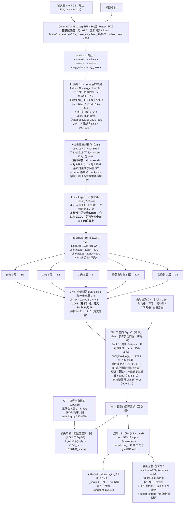

# 实验：指令条件 CGLUT 载体臂 —— `<seg_color>` 单向量 → GLUT 参数生成器（EPR-024）

状态：提案（待 grill-me + 用户定稿）。

**本提案是 what 侧的新建实现。** 仓库内已有的 what 侧代码（`q3vl/what/`、`model/glut_repro/`、
`gpu_render/`）与任何 what 侧实验记录/结论按用户 2026-08-14 判定为污染源，本提案**一行未读、
一处未引用**；接入点只写「需要什么」。可引用的在仓库内接口只有 where 侧本周新建的
`q3vl/whereb/readout.py` 与 EPR-018..023 六份提案，以及 `dataset_build/` 的数据生成侧代码与
`q3vl/train/constants.py`。

**本臂做的那一个结构改动**：把 CGLUT 的条件「每 LUT 一个可学习查表 embedding `e_ℓ ∈ R^64`」
换成「冻结 VLM 在 `<seg_color>`（id 151674）位置的末层 hidden 经一层投影」，**生成器结构、
损失组成与权重、采点协议、优化器参数一字不改**；**GLUT 前向按官方 demo 参考实现口径
（双裁，见跨臂冻结口径块），跨臂一致**。

外部行号/数值以 2026-08-15 当日用 `curl` 打开的原始文件为准（清单见文末）；本仓库 file:line 与
数据事实以当日工作区与只读挂载逐条 `jq`/`python` 数出（命令与数字见 §1.2）。

---

## 跨臂冻结口径（EPR-024 ~ EPR-029 六份逐字一致；2026-08-15 主 agent 裁定）

> 本块在六份提案里**逐字相同**。正文任何一处与本块冲突，**以本块为准**。
> 表内实测数字均为本轮（2026-08-15）在只读挂载 / 工作区现场跑出，命令与出处逐条列在右列。

| 项 | 冻结值 | 依据 |
|---|---|---|
| **训练集** | `split == "train"` 且 `winner_confidence == "normal"`，**n = 93934**（style 51182 / local 42752） | 战役数据纪律「`winner_confidence=low` 不进主训与评测 GT」。本轮实测 `/mnt/nfs-ro/bc/data/datasets/sft2seg-20260804/splits/train.index.jsonl`：159215 = normal **93934** + low **65281** |
| **每步批组织** | **B = 32 样本 × Q = 256 色点 = 8192 色 / 步** | CGLUT 的**色** batch 8192 口径不变（GLUT App A.1 原句 "CGLUT is trained for 40 epochs with a batch size of 8192"），本块只固定 (B, Q) 拆分。裁定理由（形式事实）：同一步内每条 LUT 被采到的色点数从 128 变成 256（翻倍），同时一步内出现的不同 LUT 条数从 64 变成 32（减半）。`B=64 × Q=128` 降为 **EPR-024 的一条消融行**，其余五臂不再各出一次 |
| **步 / epoch** | `ceil(93934 / 32)` = **2936** | 算术（本轮 `python3` 复算） |
| **总步数** | 2936 × **40 epoch** = **117,440** | 40 epoch 照抄 GLUT App A.1；这是 U4 步数匹配的公共基准，六份全部行都对齐到它 |
| **GLUT 前向 clamp** | **双裁**；旗标 `--clamp {two,one}`，**默认 `two`**：全局分支 `Gx+g` 先单独 clamp（`glut_editor.html:574-579`），末端 `local + global` 整体再 clamp（`:606-610`） | 官方 demo 是**唯一可执行的官方参考实现**，且内嵌 **7 份训练好的 GLUT-32 权重**（`glut_editor.html:429` 的 `const EMBEDDED_MODELS`；本轮 JSON 解析：7 个模型，每个的 `cholesky_diag` 长度 = 32），实现可逐点对拍；论文 Eq.5 只写末端 clamp，**未排除**中间 clamp。「论文单裁」（`--clamp one`）降为**共用消融行**，只在 **EPR-024 §4** 出一次，其余五臂引用该行 |
| **`L_hc` 在 `C→0` 处** | `h = (a, b) / max(C, ε_C)`，**且**整项乘硬 mask `1[C ≥ ε_C]`，`ε_C = 1e-3`；被 mask 的点数每步落盘 `n_hc_masked` | GLUT Eq.7 未给保护，该处理属 **NOVEL 数值**。六份统一取本档。「不 mask、只加 ε」降为 **EPR-024 的一条消融行**（`--no-hc-mask`），其余五臂不再各出一次 |
| **headline 图像形成式** | **`Î_i = (1 − α_i) ⊙ I_i + α_i ⊙ f̂_i(I_i)`**，六份统一 | 判据 §B 逐字。跨臂配对 Δ 必须在**同一个量**上算；任何臂的其他形成式一律降为**诊断列**，并在列名旁写明与 headline 的差异 |
| **where 分支输出的消费口径** | 场来源统一为 where 臂的 **`m_pix`**；重采样算子统一为 `q3vl/where/upsample.py:54-62` 的 `area_resize`（下采 `mode="area"`、上采 `bilinear`），各臂采到自己载体需要的分辨率并把该分辨率写进 `run_config`、在 §E 表脚逐行印出。判据 §E 的三分层掩码**一律用 GT α 在短边 512 上算**，与场来源无关 | 三套口径（短边 512 / `m_low (gh,gw)` / 未指定）会让 §E 的四行在不同尺度上算、跨臂不可比。分层掩码固定在 GT α / 短边 512，保证 `E_in / E_band / E_out` 六份同尺 |
| **新建包落点** | 全部落在 **`q3vl/whatb/`**（镜像 where 侧 `q3vl/whereb/` 的「本周新建、可信」命名）。共同依赖——GLUT Eq.1-5 前向、CGLUT 生成器、CIELab / ΔE00、判据函数——**只写一份**，六臂共用；各臂自己的新模块放 `q3vl/whatb/<epr 名>/` 子包 | 避免出现两份并行的 GLUT 前向实现（口径必然漂移）。`q3vl/what2/` 这一命名作废 |
| **预注册判据键名** | `headline_normal_only`, `B0_identity`, `B1_libmean`, `B2_librandom`, `B3_bucket_retrieval`, `B4_oracle`, `N1_shuffle_delta`, `N1_shuffle_M`, `N2_irrelevant_delta`, `N2_irrelevant_M`, `N3_const_delta`, `N3_const_M` | 统一为 EPR-024 一套并补齐三负控制（原先四套写法）。键名不统一时，任一处拼写差异会让该列**静默缺席**而 `assert_criteria_ran` 仍然通过 |
| **`<seg_color>` 的 color span 编码** | 在本 EPR 的新命名空间里**自带一份实现**，**不 import `q3vl/what/` 的任何模块**；配启动断言（下方逐字） | `q3vl/whereb/readout.py:475-476` 的 `ReadoutBuilder.needs_color` 对 `("color_close", "im_end", "seg_where", "qtok")` 返回 True，`:478-487` 的 `color_ids_from_text` 在 **`:484`** 执行 `from q3vl.what.context import encode_color_span`。`q3vl/what/` 是本轮判定的污染源树，六份**一行未读、不 import** |

**`<seg_color>` 读出的启动断言（六份逐字一致）**：入口在建 dataloader **之前**，用本次基座
`checkpoint-4976` 的 tokenizer，对本 split 随机抽 **256** 条样本的 `color` 文本 `t` 逐条执行

```
ids_self = <本 EPR 自带的 color span 编码>(tok, t)     # 新命名空间，无 q3vl.what 导入
ids_ref  = tok(f"<color>{t}</color>", add_special_tokens=False).input_ids
assert len(ids_self) == len(ids_ref)                   # 先断长度
assert all(a == b for a, b in zip(ids_self, ids_ref))  # 再逐位断 token id
```

任一条不等即 `AssertionError`、拒绝开训；抽样条数与不等条数写进 `run_setup.json`。
该断言**只调用 tokenizer**，不 import 污染源树里的任何符号。

**B3 桶级检索基线（列名 `B3_bucket_retrieval`，六份逐字一致）**

- **定义**：对评测样本取其 **record 自带的 `minor`**，在 **train 里同 `minor` 桶的 lut_id 池**中
  **均匀随机取一条** `ℓ'`，预测 `f̂ = L_{ℓ'}`；R = 8 次重复，报 mean ± std，与 arm **同样本配对**。
- **不使用 `tools/data_splits/splits_presets.csv`**。本轮实测该 CSV：3522 条，`major` 由
  `minor.rsplit("_", 1)[0]` **机械**得来（**0 例外**）⇒ `"{major} / {minor}"` 只有 **77** 个不同字符串，
  单串最多被 **363** 个 lut_id 共用；且该 CSV 的 `major` 与 record 自带的 `major` 在抽样 800 条里
  **706 条不一致**。
- **定义依据（必须原样写进 RESULT 的方法节）**：**1-of-77 的桶只能给出桶判定，给不出 lut_id 的
  argmax**，所以本列**按定义是桶级下界，不是精确检索**；任何关于「检索这条路能到哪」的上界
  一律看 **B4 oracle**，不看 B3。
- **桶池实测（本轮遍历 `/mnt/nfs-ro/bc/data/datasets/sft2seg-20260804/records/shards/shard-00000.tar`
  的全部 162,359 条 record）**：record 自带 `major` **10** 类；train 的 `minor` **77** 类、
  `(major, minor)` **85** 对；record 的 `major == minor.rsplit("_",1)[0]` 只在
  **17,176 / 162,359** 条成立。train 的 77 个 minor 桶，lut_id 池大小 **min 1 / 中位 17 / max 285**，
  合计 **3149**。V_what normal-only 567 条的 `minor` **全部**被 train 桶覆盖，GT lut_id **全部**落在
  对应桶池内，桶内均匀取一条命中 GT lut_id 的期望比例 = **0.108**（61.38 / 567）；
  T_lut_unseen normal-only 252 条的 `minor` 也全部被覆盖，但 GT lut_id 落在 train 桶池内的条数
  **构造性为 0**（该 split 的 lut_id 与 train 交集为 0）。
- **另一个标签事实（写进方法节；三负控制会连带替换它）**：`instruction` 是英文句子里内嵌一个
  **中文风格名**（例：`"Please apply the 明亮活力彩 style across the photograph, …"`）。本轮抽
  train 前 6000 条：**6000/6000** 条含该中文风格名，抽样内 **1382** 个不同风格名，其中 **173** 个
  跨多个 `minor`。它与 record 的 77 个 `minor`、10 个 `major` 是**三套互不相同**的标签词表。

---

## 1. 任务

### 1.1 一句话

把 CGLUT（GLUT arXiv:2605.19889 §3.2）的条件输入从**闭集可学查表** `e_ℓ = E[ℓ]`
换成**冻结 VLM 给出的、开放集的、同时依赖图像的** 2560 维向量
`z = norm(h^{(-1)})[pos(<seg_color>)]`，其余（生成器 3 层共享编码器 + 5 个参数头、
GLUT Eq.1–5 前向、`L_rec + 10·L_hc + 0.001·R_sparse`、Adam / cosine 1e-3 / 40 epoch /
色 batch 8192 / 0.1× lr / 硬样本挖掘 epoch 5→20 比例 10%→40%）**照抄原文**。

### 1.2 数据（本轮从只读挂载实测，命令与数字全列）

索引：`/mnt/nfs-ro/bc/data/datasets/sft2seg-20260804/splits/*.index.jsonl`。
计数命令（当日执行）：

```
wc -l *.index.jsonl
jq -r '[.task_type,.winner_confidence] | @tsv' <split>.index.jsonl | sort | uniq -c
jq -r .lut_id <split>.index.jsonl | sort -u | wc -l
jq -r .source_image_id <split>.index.jsonl | sort -u | wc -l
comm -12 <(jq -r .lut_id train.index.jsonl|sort -u) <(jq -r .lut_id T_lut_unseen.index.jsonl|sort -u) | wc -l
```

| 集合 | n | style | local | normal | low | normal-only n | normal-only style / local | uniq lut_id | uniq source |
|---|---|---|---|---|---|---|---|---|---|
| **V_what**（唯一选型集） | 897 | 489 | 408 | 567 | 330 | **567** | 321 / 246 | 531 | 163 |
| T_final（终测，LUT 见过） | 918 | 494 | 424 | 533 | 385 | 533 | 317 / 216 | 577 | 201 |
| **T_lut_unseen**（终测，LUT-id 不相交） | 433 | 235 | 198 | 252 | 181 | **252** | 144 / 108 | 259 | 212 |
| train | 159215 | 83671 | 75544 | 93934 | 65281 | — | — | 3149 | 27104 |
| V_where（where 侧，本臂不用） | 896 | — | — | — | — | — | — | — | — |

- `train ∩ T_lut_unseen` 的 lut_id 交集 = **0**（当日 `comm -12` 输出 0）。
  `train ∩ T_final` = **577**（= T_final 全部 lut_id）、`train ∩ V_what` = **531**（= V_what 全部）。
- 同图配对可用量（当日 python 数出）：V_what normal-only 567 条落在 **138** 个 source 上，其中
  **120** 个 source ≥2 条样本（最多 12、中位 4）；T_lut_unseen normal-only 252 条落在 157 个
  source 上，只有 **67** 个 ≥2 条（最多 6、中位 1）。
- preset 库：`tools/data_splits/splits_presets.csv` 共 **3522** 行（train 3172 / val 175 / test 175），
  **40** 个 major、**77** 个 minor。
- LUT bank：`/var/cache/veradata/preset_bank_full/`（`databuild.prod-*.toml` 的 `presets.bank_dir`），
  `luts_meta.json` **4051** 条（`.cube` 4000 / `.3dl` 51），`luts.npz` 同名 4051 个数组。
  上表四个 split 的全部 lut_id（3149 / 531 / 577 / 259）在 bank 中**命中率 100%**。
  **全部 4051 条的 `dmin=(0,0,0)`、`dmax=(1,1,1)`**（单一 domain，归一化为恒等）。
- LUT 格点尺寸（从 npz 成员的 `.npy` 头逐个读 shape，不解压数据）：

  | grid | 16 | 17 | 21 | 25 | 32 | 33 | 40 | 64 | 65 |
  |---|---|---|---|---|---|---|---|---|---|
  | bank 4051 | 18 | 127 | 2 | 55 | 2832 | 560 | 5 | 400 | 52 |
  | train 3149 | 15 | 96 | 2 | 29 | 2222 | 415 | 5 | 327 | 38 |
  | V_what 531 | 4 | 22 | 0 | 6 | 385 | 92 | 1 | 15 | 6 |
  | T_lut_unseen 259 | 2 | 14 | 0 | 3 | 174 | 23 | 0 | 37 | 6 |

- GT α 资产：`/mnt/nfs-ro/bc/data/datasets/where_a-20260805/maskviews/<split>/`，
  `manifest.json` 的 `sample_count` = train **75544** / V_what **408** / T_final **424** /
  T_lut_unseen **198** / V_where 400 —— 与各 split 的 local 条数逐位相等，即**每条 local 样本
  都有 α**。每样本三个成员：`.maskhi.png`（当日抽检一条：512×640、mode `L`，即短边 512）、
  `.masklow.npy`、`.maskmeta.json`（含 `mask_raw_shape` = 短边 1024 的 `.cgt.png` 原图形状、
  `mask_stats.mean` = 该样本的 ᾱ、`region`）。style 样本无 mask 成员，α ≡ 1。
- 切分纪律：V_what 是**唯一选型集**；T_final / T_lut_unseen 每个 arm 只跑一次；
  `winner_confidence == "low"` 不进主训与评测 GT。

### 1.3 数据的生成律（本仓库代码事实，不是假设）

`dataset_build/src/construct/rendering.py:301-313`（当日打开）：

```
mask is None            -> output = edited                                  # task_type = style（全局）
mask is not None        -> mixed  = before*(1-alpha) + edited*alpha
                           output = where(alpha==0, before, where(alpha==1, edited, mixed))
edited = _apply_lut(before, preset)                                         # rendering.py:390-405
```

`_apply_lut`（`rendering.py:390-405`）：`grid, dmin, dmax = self._lut_loader.load(preset.path)` →
`volume = torch.from_numpy(grid).permute(3,0,1,2)[None]` → `coords = ((before - dmin)/span).clamp(0,1)`
→ `points = (coords.permute(0,2,3,1)*2-1)[:,None]` → `F.grid_sample(..., mode="bilinear",
padding_mode="border", align_corners=True)`，返回诊断 `{"lut_size": grid.shape[0],
"axis_order": "bgr"}`。CPU 三线性 oracle 在 `rendering.py:77-109`（`apply_lut_cpu_oracle`，
注释原文 "Test-only trilinear oracle for standard .cube B/G/R storage order"）。

即目标的空间变化色彩变换恰为

$$\boxed{\;F^\ast(x,p)=(1-\alpha(p))\,x+\alpha(p)\,L_\ell(x)\;}\tag{GT}$$

style 样本 $\alpha\equiv1$。$F^\ast$ 在色彩变换空间里是以 $\{\mathrm{id},\,L_\ell\}$ 为端点的
**线段**上的取点。α 的渲染来源：解析三族由 `dataset_build/src/construct/canonical_masks.py:90-123`
的 `raster_geometry`（`circulargradient` / `gradient`，末尾 `α²(3−2α)` smoothstep + `Flipped` 取反）；
`.cgt.png` 的落盘在 `rendering.py:431-437`（`clip(effective_alpha*255+0.5,0,255).astype(uint8)`，mode `L`）。

### 1.4 条件读出（`<seg_color>`）

```
z = norm(hidden_states[-1]) 在 <seg_color> token 位置上的那一行，形状 (2560,)
```

层与归一化按 `q3vl/whereb/contracts.py:30-32`（`SEGMENT_HIDDEN_LAYER = -1` /
`SEGMENT_HIDDEN_FINAL_NORM = True`；该文件 :35-40 的 `SEGMENT_HIDDEN_RULING` 原文写明
"Stage-What must import SEGMENT_HIDDEN_LAYER / SEGMENT_HIDDEN_FINAL_NORM from
q3vl.whereb.contracts rather than declaring its own"）。

v2seg 规格：assistant 输出形制 `<where>…</where><color>…</color><seg_where><seg_color><|im_end|>\n`，
两个 seg token 受监督；id 见 `q3vl/train/constants.py:11-14, 22-23`（`<where>` 151669 /
`</where>` 151670 / `<color>` 151671 / `</color>` 151672 / `<seg_where>` 151673 /
`<seg_color>` **151674**），字面表在 `q3vl/whereb/readout.py:104-110`（`KNOWN_IDS`，其
:107 = `SEG_WHERE_TOK: 151673, SEG_COLOR_TOK: 151674`）。

基座：`/home/bc/data/runs/q3vl_base_sft_v2seg_20260814/checkpoint-4976`
（当日 `ls` 确认存在；同目录另有 checkpoint-2488/3500/4000/4500）。

读出接缝已由 where 侧建成并可复用：`q3vl/whereb/readout.py` 的 `ReadoutSpec`（:118-160）、
`build_reply`（:256-363，按 kind 拼 reply token 序列并**在拼接时记录读出下标**，不做事后搜索）、
`verify_plan`（:365-394，运行时断言「记录的下标上确实是它声称的那个 token id」）、
`readout_vector`（:417-425）。**但该模块现有六档 kind 里没有 `seg_color`**：
`READOUT_KINDS`（:90-92）= `("seg_where","where_span_pool","where_close","color_close","im_end","qtok")`，
`READOUT_NEEDS_V2SEG`（:97）= `{"seg_where"}`。本臂需要新增两档，见 §3.6 接入表 ①。

### 1.5 测试什么方法（通俗三段）

**第一段——CGLUT 现在的条件长什么样。** CGLUT 手里有 L 条已知 LUT（L ∈ {7, 75, 225}），
给每条 LUT 分配一个可学习的 64 维向量 `e_ℓ`，这些向量存在一张 `L×64` 的表里，跟着训练一起更新
（学习率是生成器的 0.1 倍）。要哪条 LUT 就查哪一行，把这 64 维喂进一个小 MLP，MLP 一次性吐出
32 个三维高斯的全部参数；像素侧只跑高斯混合，跟条件完全解耦。要「混两种风格」就把两行向量按
α 线性插值再喂进同一个生成器。

**第二段——本项目的条件长什么样。** 本项目没有「第 ℓ 条 LUT」这个索引可查：输入是一句自然语言
修图指令加一张图，先过一个**冻结**的 Qwen3-VL-4B v2seg SFT 让它生成 reasoning，然后读它输出末尾
`<seg_color>` 这一个 token 在最后一层（过完 RMSNorm）的 hidden，2560 维。这个向量：不可训、
开放集（不是 1..L 的索引）、而且**同一条指令换一张图会给出不同的向量**（它同时依赖图像）。
CGLUT 全文没有 held-out 风格实验（它的 held-out 是**颜色**——训练采 128³ 均匀色、其余色留评测），
生成器输入维也从没超过 64。

**第三段——本实验做什么。** 在 `e_ℓ` 的那个位置上，换成 `π(z) = Linear(LayerNorm(z))`，
`z` 是上面那条 2560 维向量，输出维 d 取 CGLUT 原值 64（另设 256 与 32 两个对照行）。
**除此之外一律照抄**：3 层共享编码器（128 隐单元，Small 版 64）+ 5 个参数头
（μ/Σ/o/全局 各 2 层线性、局部色彩头 3 层线性、中间层一律 ReLU、全局头固定输出 12）；
前向照 GLUT Eq.1–5，Σ 的 Cholesky 对角过 Softplus、非对角原样，o 过 sigmoid，ε=1e-6，
PDF 走对数域，det 退化返单位阵，最后 clamp；监督全在**函数值空间**
（`L_rec = ‖f(x)−y‖₁`，y = 这个样本自己那条 `.cube/.3dl` 在 x 处的三线性取值），
`+10·L_hc + 0.001·R_sparse`；采点 128³ 均匀训练色、其余色留评测；Adam + cosine 1e-3、40 epoch、
色 batch 8192、投影与共享几何 0.1× lr、硬样本挖掘 epoch 5→20 比例 10%→40%。
第四级损失（`+λ_img·L_img`，用 GT α 做可微合成）是给后续 P2/P3 臂铺的工程前置，λ_img 扫 {0, 0.1, 1}。

同时，本臂负责把**全部平凡基线列（B0–B6）与三负控制（N1–N3）**第一次接线跑通，
并在 **T_lut_unseen**（259 个 lut_id 与 train 交集 0）上给出相对 **B4 oracle 库内最优**的配对 Δ。

### 1.6 参考工作（2026-08-15 当日逐条打开原始来源核实）

- **GLUT / CGLUT**，arXiv **2605.19889**（`arxiv.org/html/2605.19889v1`，当日 438,746 字节）。
  以下全部为当日从该 HTML 抽出的原文串：
  - §3.1 参数化："we use a Cholesky parameterization Σᵢ = Lᵢ Lᵢᵀ, where Lᵢ is lower triangular with
    **positive diagonal entries enforced via Softplus activation**. Each covariance requires
    **6 learnable parameters**."；不透明度 `oᵢ ∈ [0,1]`；局部 `Mᵢ ∈ R^{3×3}`、`bᵢ ∈ R³`。
  - §3.1 Eq.2–5（原文串）：`wᵢ(x) = pᵢ(x)oᵢ / (Σⱼ pⱼ(x)oⱼ + ε)`，"This formulation yields a
    **soft partition** of the RGB space"；`fᵢ(x) = Mᵢx + bᵢ`(3)；`f_global(x) = Gx + g`(4)；
    `f(x) = Σᵢ wᵢ(x) fᵢ(x) + f_global(x)`(5)；"The value of ŷ = f(x) is **clamped to [0,1]³**"。
  - §3.1 Eq.6–8：`L_rec = ‖ŷ − y‖₁`(6)；CIELab `C = √(a²+b²)`、`h = (a/C, b/C)`、
    `L_hc = C·(1 − ⟨ĥ, h⟩)`(7)，原文自述 "prioritizes hue accuracy in highly saturated regions
    while maintaining tolerance in low-saturation areas"；
    `R_sparse = −(1/N)Σᵢ[oᵢlog(oᵢ+ε) + (1−oᵢ)log(1−oᵢ+ε)]`(8)；
    `L_total = L_rec + λ_hc L_hc + λ_sparse R_sparse`。
  - §3.2 CGLUT 原文："Instead of learning independent Gaussian parameters for each LUT
    **in a direct one-hot fashion**, we condition the transformation on a learnable embedding"；
    混合口径 `e^α_{l1l2} = (1−α)e_{l1} + α e_{l2}`；Shared Geometry = `{μᵢ, Σᵢ}` 跨风格共享、
    `{o, M, b, G, g}` 仍由条件生成。
  - §4.2："For a GLUT model with N Gaussian primitives, the total parameter count is **22N+12**.
    In a typical configuration with N=32, the model consists of only **716** parameters."
  - 附录 A.1（训练）：Adam、单卡 RTX 4090、"cosine annealing learning rate schedule, starting from
    10⁻³ over the entire training duration"；"GLUT is trained for 20 epochs with a batch size of
    1024, while **CGLUT is trained for 40 epochs with a batch size of 8192**"；
    `λ_hc = 10`、`λ_sparse = 0.001`；"we apply a **lower learning rate (0.1× the base rate) to the
    style embeddings and shared geometry parameters**, while the generator (shared feature encoder
    and parameter heads) uses the base learning rate of 10⁻³"；`ε = 10⁻⁶`（Eq.2 与 Eq.8）；
    硬样本挖掘 "from **epoch 5 to 20**, the mining ratio of samples with the highest L₁ errors is
    linearly increased from **10% to 40%**"；初始化 "means … uniformly on a regular grid covering
    the RGB cube [0,1]³"、"Covariances are initialized isotropically with a scale of **σ = 0.15**
    via **logarithmic Cholesky parameters**"（与 §3.1 的 Softplus 措辞不一致，由官方 demo 裁定，见下）、
    "Opacities are initially set to **1.0**"、"affine color transforms are initialized as identity
    matrices with zero bias"。
  - 附录 A.1（采点）："We uniformly sample the full 8-bit RGB space to construct a **128³ training
    set, reserving the remaining colors for evaluation** to verify that the model learns a
    continuous representation."
  - 附录 A.2（CGLUT 架构，原文逐句）："Given a **64-dimensional** style embedding, a shared
    encoder, consisting of **three linear layers with 128 (64 for “small” setup) hidden units
    each** … the head responsible for mean values μ comprises **two linear layers** … the output
    dimension is **3N** … For the specific case of the global affine transform … the corresponding
    head outputs **12** parameters (9 for the matrix and 3 for the bias). All the parameter heads
    have the same structure as the mean head with two linear layers, **except for the local color
    head, which has three linear layers** … All intermediate layers are interleaved with **ReLU**."
  - 附录 B.3 Table 7（100 张 MIT5K 上的混合，α ∈ {0, 0.2, 0.4, 0.6, 0.8, 1}）PSNR：
    CGLUT-32L (Full) **48.67 / 35.44 / 31.16 / 31.33 / 34.64 / 47.95**；
    CGLUT-32L (Shared Geo.) **47.36 / 38.46 / 34.67 / 34.47 / 37.60 / 46.18**；
    ENNELUT(L₂) 48.29 / 33.50 / 30.29 / 30.62 / 34.35 / 47.56；正文原句
    "**no additional constraints were applied to optimize blending during the training of all
    models**; thus, these results reflect the inherent blending capabilities"。
  - 附录 B.4.1 Table 9（基元数消融，GLUT-32 / 75-LUT Hald，单次运行）：
    `8 37.01 1.068 2.119 188 | 16 41.50 0.636 1.223 364 | 32 45.47 0.414 0.770 716 |
    64 48.42 0.310 0.560 1,420 | 128 50.31 0.2629 0.4636 2,828`。
    **格点里没有 48，全文无 N=48 的任何配置或数字**（当日在该 HTML 全文检索确认）。
  - §2 对本条线的定位原句："We instead **assume provided LUTs** and propose a continuous,
    structured formulation that efficiently encodes them"。
- **GLUT 官方交互 demo（唯一可核实、可执行的官方实现，GitHub 仓库无代码）**：
  `https://color.cvc.uab.cat/assets/html/glut_editor.html`（当日 HTTP 200，
  **157,922 字节 / 1,217 行**，sha256 `863bb1cb…47c2`）。
  **TLS 说明**：该站点只发端实体证书、**不发中间证书**（`openssl s_client` 显示
  `depth=0 CN=*.cvc.uab.es`，签发者 `GEANT TLS RSA 1`，链不完整），默认 CA 库直接
  `unable to get local issuer certificate` ⇒ `curl` 返回 000。本轮按 AIA 取回中间证书
  `http://crt.harica.gr/HARICA-GEANT-TLS-R1.cer`（HTTP 200，1,545 B）并入 CA bundle 后
  **完整校验通过**取回，**不是 `-k` 跳过校验**，站点也从未下线。
  另：该页 `:429` 的 `const EMBEDDED_MODELS` 内嵌 **7 份训练好的 GLUT-32 权重**
  （本轮 JSON 解析：7 个模型，键为 `positions / cholesky_diag / cholesky_off /
  opacities_logit / color_matrices / color_biases / global_matrix / global_bias /
  log_2pi / eye_3x3`，每个 `cholesky_diag` 长度 = **32**），因此 demo 的前向可与本实现
  逐点对拍 —— 这是 clamp 口径以 demo 为准的依据。当日逐行打印核对：
  - `:441` `this.epsilon = 1e-6;`
  - `:446-449` `softplus(x) { if (x > 20) return x; return Math.log(1 + Math.exp(x)); }`
  - `:457-465` `buildCholeskyMatrix`：
    `[[softplus(diag[0]),0,0],[off[0],softplus(diag[1]),0],[off[1],off[2],softplus(diag[2])]]`
    —— **对角过 Softplus、非对角原样**（裁定附录 A.1 的 "logarithmic Cholesky" 措辞）
  - `:496` `if (Math.abs(det) < this.epsilon) return [[1,0,0],[0,1,0],[0,0,1]];`（精度矩阵退化返单位阵）
  - `:520-522` `cov[i][i] += this.epsilon;`（Σ = LLᵀ 之后的对角抖动）
  - `:527` `this.opacities.push(this.sigmoid(this.params.opacities_logit[g][0]));`
  - `:544-545` `const logPdf = -0.5*(mahalSq + this.logDets[gaussIdx] + 3*this.log2pi); return Math.exp(logPdf);`
  - `:565` `return influences.map(w => w / (weightSum + this.epsilon));`
  - `:574-579` **全局分支先单独裁剪**：`rgbGlobal = [clamp(G·rgb+g)_r, _g, _b]`，在与局部项相加**之前**
  - `:596-604` `if (this.residual) result = rgbGlobal + localTransform; else result = localTransform;`
  - `:606-610` 最终 `clamp(result, 0, 1)`（**总共裁两次**；论文 Eq.4/Eq.5 只有最后那次）
- **LISA**，arXiv **2308.00692**（`arxiv.org/html/2308.00692v3`）。§4.1 原文：
  "we extract the LLM **last-layer embedding h̃_seg corresponding to the `<SEG>` token** and apply
  an **MLP projection layer γ** to obtain h_seg … h_seg and f are fed to the decoder F_dec"；
  Abstract/Fig.3 的 "embedding-as-mask" 范式。**借鉴的具体机制** = 单个 special token 的末层
  hidden → 一层投影 → 下游头。
- **本仓库同款接缝**：`experiments/prs/EPR-018_seg-token-sam-decoder/PROPOSAL.md` §1.2.1
  （`h_cond = norm(hidden_states[-1])` 在 `<seg_where>` 位置上的那一行，(2560,)；
  接入要点 (a) 序列喂到该 token 为止、下标在拼接时记录不做搜索；(b) 基座 = v2seg 产物、
  genwhere 缓存按该 checkpoint 重生成并逐条记 `checkpoint` 字段）。该文件 §3.4 待决策 D-8 原文：
  `<seg_color>`「归 what 分支使用，本批六臂一律不消费」——**本臂即该 token 的消费方**。
- **VeraRetouch**，arXiv **2604.27375**（`arxiv.org/html/2604.27375`）。§3.3 原文：
  三个 retouch special token "their **last hidden layer features** are fed into the **MLP Retouch
  Adaptor**"；Domain Align Pretraining 原句 "The retouch tokens generated by the Multi-Modal LLM
  exhibit a **substantial distribution mismatch** with the pre-trained control latents … directly
  feeding control latents produced by Multi-Modal LLM into Retouch Renderer results in a **severe
  degradation** in the quality of the retouched images. To address this issue, we design a simple
  **Retouch Adaptor (three-layer bottleneck MLP)**"（Fig.5 图注同义）。
  **与本臂的结构差**：该文的 VLM **可训**（RSFT 阶段训 Multi-Modal LLM），本臂基座全冻结。
- **NILUT / CNILUT**，arXiv **2306.11920**（`arxiv.org/html/2306.11920v3`）。§3 Eq.6
  `L = Σᵢ ‖Φ(xᵢ) − φ(xᵢ)‖₁`，X 为完整 RGB 集合（原文 "≈16 million elements … 256³"）；
  Eq.8 `Ψ: R^{3+m} → R³`，`z = [I, c]`，`c ∈ R^m` 为 **one-hot** 风格条件——本臂 D5/D1 的对照口径。
- **Neural Preset**，arXiv **2303.13511**（`arxiv.org/html/2303.13511v2`）。Table 4 原文串：
  `k 2 4 8 16 32 | Style Similarity 0.128 0.510 0.636 0.746 0.769 | Content Similarity
  0.765 0.823 0.781 0.771 0.764`，正文 "we use k = 16"；§3.1 Eq.1 `T^(k×k) = E(Ĩ)`
  —— `k=16` ⇒ 参数维 **256**，即本臂 d=256 对照行的出处。
- **本仓库 file:line**（当日逐个打开）：`q3vl/whereb/readout.py:6, 90-97, 104-110, 118-160,
  256-363, 365-394, 396-425, 430-534, 593-616`；`q3vl/whereb/contracts.py:30-40`；
  `q3vl/whereb/gencontext.py:115-125, 163-172`（`build_record` 的 `checkpoint: str` 形参与
  落盘记录里的 `"checkpoint": checkpoint` 字段）；`q3vl/train/constants.py:11-14, 22-30`；
  `dataset_build/src/construct/rendering.py:70-109, 295-320, 380-410, 431-437`；
  `dataset_build/src/construct/canonical_masks.py:86-125`；`q3vl/where/maskdata.py:175-192`。

### 1.7 解决什么问题（只陈述已核实事实）

- **φ 与 G 的第一次落地**。P1 问题里的条件映射 `φ(c,I) = π(z_color(c,I))` 与参数生成器
  `G_ϑ: R^d → Θ` 在本仓库此前没有任何实现；本臂是这两个对象的第一条可跑管线。
- **CGLUT 的条件与本项目的条件在四个形式属性上不同**（均为原文事实）：
  (i) CGLUT 的 `e_ℓ` **可训**（且 0.1× lr，附录 A.1），本项目的 `z` 由冻结网络给出、不可训；
  (ii) CGLUT 的条件索引取自**闭集** `ℓ ∈ {1..L}`，L ∈ {7, 75, 225}（§4.2），本项目开放集；
  (iii) CGLUT 的条件**不依赖图像**，本项目的 `z` 同时依赖指令与图像；
  (iv) CGLUT **全文无 held-out 风格实验**（附录 A.1 的 held-out 是**颜色**与自然图像）。
- **生成器输入维**：CGLUT 全文的生成器输入维固定为 64（附录 A.2），把 2560 维接进去需要一层投影，
  该做法原文未述。
- **N=48 无论文出处**：Table 9 的格点是 {8,16,32,64,128}，48 不在其中；`22×48+12 = 1068`
  是按 §4.2 公式的**算术外推**，不是论文报告过的数字。本臂因此**强制并排 N=32 行**
  （716 参，唯一有已发表 CGLUT 数字可对表）。
- **T_lut_unseen 是本仓库内唯一 LUT-id 与 train 不相交的评测集**（当日 `comm -12` = 0），
  它给的是「条件换成开放集之后，在训练从未见过的 LUT 上」的配对数字。
- **判据侧的空缺**：GLUT/CGLUT 的指标全是重建类（PSNR / ΔE00 / ΔE76 / SSIM / LPIPS），
  没有平凡基线列、没有同图配对差分、没有指令条件性三负控制。本臂把 §3.7 的 B0–B6 与 N1–N3
  全套接线并出数，这一套是后续 P2/P3 臂共用的底板。

### 1.8 本提案在设计空间中的位置（每格给出处）

| 轴 | 本臂取值 | 出处 / 标注 |
|---|---|---|
| D1 条件读出 | **单 special token 末层 hidden → 一层投影**（`<seg_color>` id 151674） | LISA §4.1；本仓库同款接缝 EPR-018 §1.2.1、`q3vl/whereb/readout.py:6` |
| D2 条件维度 d | **64**（主）；256 与 32 并排对照行 | 64 = CGLUT §3.2/A.2 原值；256 = Neural Preset `k=16 ⇒ k×k=256`（Table 4）；32 = 本轮库 PCA 实测（90% 方差 15 维，见 §3.7-C）附近的整数档（**NOVEL 取值**） |
| D3 生成器结构 | **CGLUT 共享 3 层 MLP + 5 个参数专属头**，一字不改 | GLUT §3.2 + 附录 A.2 |
| D4 哪些参数随条件变 | **Full Generation（全 22N+12）** | CGLUT 默认（§3.2）。Shared Geometry（13N+12）与「仿射-only（12N+12）」不在本臂，留后续 |
| D5 监督空间 | **函数值空间（GLUT 原生）**；第四级加图像空间 `L_img`（λ_img ∈ {0, 0.1, 1}） | GLUT §3.1 Eq.6-8 + 附录 A.1；第四级为 P2/P3 的前置工程（**NOVEL 加项**，λ_img=0 行 = 纯原生口径） |
| D6 恒等锚定 / 值域 | **不加任何恒等锚定 / 残差 / 零初始化**（CGLUT 原生：附录 A.1 的 identity 初始化只针对单条 GLUT 直接优化的参数，生成器输出头的初始化原文未述）；clamp **默认双裁**（`--clamp two`，跨臂冻结口径），「论文单裁」是本臂 §4 的共用消融行 | GLUT 附录 A.1；demo `:574-579` / `:606-610` |
| D7 连续性训练手段 | **一个都不加**（与 GLUT 附录 B.3「训练时不加任何混合约束」同口径），插值只作**评测列** | GLUT 附录 B.3 原句 |
| D8 强度轴 | **有监督强度轴** `y_u(x) = (1−u)x + u·L_ℓ(x)`，`u ∈ {0,0.25,0.5,0.75,1}` | 与 (GT) 同族（`rendering.py:311`）；判据 §3.7-G |
| D9/D10/D11 空间耦合与双条件 | **不涉及**（本臂只做 P1；α 一律取 GT，只在第四级损失与 headline 合成里出现） | — |
| D12 正则族 | **只有 GLUT 原生两项**（`10·L_hc`、`0.001·R_sparse`），不加 TV / 单调 / 采样间隔 | GLUT §3.1 Eq.7-8 |
| D13 训练课程与工程 | **从头联合训 π 与 G，无 warm-start、无蒸馏、无对齐阶段**；`z` 全量离线缓存 | CGLUT §3.2「训练目标与单 GLUT 完全相同」；缓存形制照 `q3vl/whereb/gencontext.py:115-125, 163-172` |

---

## 2. 模型

### 2.1 模型图（★ = 本次新增/改动挂点；灰 = 冻结，一字不改）



### 2.2 模型伪代码

```python
# ---- 冻结：整个 Qwen3-VL-4B v2seg。可训：以下全部，从零初始化 ----
proj   = nn.Sequential(nn.LayerNorm(2560), nn.Linear(2560, d))        # ★ 唯一改动点，站在 e_l 的位置
H      = 128                    # CGLUT "Large"；"small" 版取 64（附录 A.2）
enc    = nn.Sequential(nn.Linear(d, H), nn.ReLU(),
                       nn.Linear(H, H), nn.ReLU(),
                       nn.Linear(H, H), nn.ReLU())                    # 3 层共享编码器
head_mu    = nn.Sequential(nn.Linear(H, H), nn.ReLU(), nn.Linear(H, 3*N))    # 2 层
head_cov   = nn.Sequential(nn.Linear(H, H), nn.ReLU(), nn.Linear(H, 6*N))    # 2 层
head_op    = nn.Sequential(nn.Linear(H, H), nn.ReLU(), nn.Linear(H, 1*N))    # 2 层
head_color = nn.Sequential(nn.Linear(H, H), nn.ReLU(),
                           nn.Linear(H, H), nn.ReLU(), nn.Linear(H, 12*N))   # 3 层（原文点名）
head_glob  = nn.Sequential(nn.Linear(H, H), nn.ReLU(), nn.Linear(H, 12))     # 2 层，固定 12

def generate(z):                        # z: (B, 2560) 冻结 VLM 的 <seg_color> hidden
    h = enc(proj(z))                    # (B, H)
    mu   = head_mu(h).view(-1, N, 3)
    chol = head_cov(h).view(-1, N, 6)   # (diag3, off3)
    op   = torch.sigmoid(head_op(h)).view(-1, N)              # demo :527
    Mb   = head_color(h).view(-1, N, 12); M, b = Mb[...,:9].view(-1,N,3,3), Mb[...,9:]
    Gg   = head_glob(h); G, g = Gg[:, :9].view(-1,3,3), Gg[:, 9:]
    return mu, chol, op, M, b, G, g

def glut_forward(x, mu, chol, op, M, b, G, g, eps=1e-6, clamp_global=True):   # ★ 默认双裁（demo 口径）
    L = zeros(B, N, 3, 3)
    L[..., 0,0], L[..., 1,1], L[..., 2,2] = softplus(chol[...,0:3]).unbind(-1)   # 对角 Softplus
    L[..., 1,0], L[..., 2,0], L[..., 2,1] = chol[...,3:6].unbind(-1)             # 非对角原样
    Sigma = L @ L.transpose(-1,-2)
    Sigma = Sigma + eps * eye(3)                                                 # demo :520-522
    det   = det3(Sigma)
    Prec  = where(abs(det) < eps, eye(3), inverse3(Sigma))                       # demo :496
    dm    = mahalanobis_sq(x - mu, Prec)
    logPdf = -0.5 * (dm + log(clamp_min(det, eps)) + 3*log(2*pi))                # demo :544-545
    p      = exp(logPdf)
    w      = (p * op) / (sum(p * op, dim=N) + eps)                               # Eq.2 / demo :565
    local  = sum(w[..., None] * (M @ x + b), dim=N)                              # Eq.3 混合
    glob   = G @ x + g                                                           # Eq.4
    if clamp_global:                                                             # 默认 True = demo 双裁
        glob = clamp(glob, 0, 1)                                                 # demo :574-579（论文未排除）
    return clamp(local + glob, 0, 1)                                             # Eq.5 + demo :606-610
```

### 2.3 冻结 / 可训清单 + 参数量

| 组件 | 状态 | 依据 |
|---|---|---|
| Qwen3-VL-4B v2seg（视觉塔 + 语言塔 + embedding + lm_head） | **冻结**，`requires_grad_(False)` + `eval()` | 本战役共同约束；与 VeraRetouch（VLM 可训）的**唯一不可照搬处**，标 NOVEL 排除 |
| `π = LayerNorm(2560) + Linear(2560→d)` | **可训，从零初始化**（PyTorch 默认） | ★ 本臂改动点，站在 CGLUT `E ∈ R^{L×64}` 的位置 |
| 共享编码器 + 5 个参数头 | **可训，从零初始化** | CGLUT §3.2 从头联合训 `e_ℓ` 与 G，无 warm-start、无蒸馏 |
| 生成参数 θ 本身 | 不是参数，是生成器输出 | Full Generation（CGLUT 默认） |
| 硬样本挖掘的 no-grad 预采样前向 | 不含可训参数 | — |

**参数量（算术，逐项列出）**，`d=64`、`H=128`（Large）、`N=48`：

| 项 | 计算 | 参数 |
|---|---|---|
| π | LayerNorm 2·2560 = 5,120；Linear 2560·64+64 = 163,904 | **169,024** |
| 共享编码器 | (64·128+128) + 2×(128·128+128) = 8,320 + 33,024 | 41,344 |
| μ 头 | 16,512 + (128·144+144) | 35,088 |
| Σ 头 | 16,512 + (128·288+288) | 53,664 |
| o 头 | 16,512 + (128·48+48) | 22,704 |
| 局部色彩头（3 层） | 16,512 + 16,512 + (128·576+576) | 107,328 |
| 全局头 | 16,512 + (128·12+12) | 18,060 |
| **生成器小计** | | **278,188** |
| **合计（π + 生成器）** | | **447,212** |

同法算 `N=32, d=64` = 401,804；`N=48, d=256` = 963,500（π 660,736 + 生成器 302,764）；
`N=48, d=32` = 361,164（π 87,072 + 生成器 274,092）。

**该算法与论文数字的对表（算术核对，用于确认头结构读对了）**：把 π 换回 CGLUT 的 `E ∈ R^{225×64}`
（14,400 参）后，本式给出 CGLUT-32(Small, H=64) = 83,980 + 14,400 = **98,380 ≈ 98K**，
CGLUT-64(Large, H=128) = 323,596 + 14,400 = **337,996 ≈ 338K** —— 与论文 Table 2 报的
**98K / 338K** 逐位吻合。

激活与显存：生成器与 GLUT 前向的代价随 `色 batch × N` 走；色 batch 8192、N=48 时每步
8192×48 ≈ 3.93×10⁵ 次高斯求值。`z` 全量离线缓存 = (159215+897+918+433)×2560×2 B（bf16）
≈ **832 MB**（float32 则 ≈1.66 GB）。

---

## 3. 数学公式与优化器 + 改动怎么接进来

### 3.1 前向（GLUT Eq.1–5，已由官方 demo 裁定数值处理）

$$d_i(x)=(x-\mu_i)^\top\Sigma_i^{-1}(x-\mu_i),\qquad
p_i(x)=\frac{1}{\sqrt{(2\pi)^3|\Sigma_i|}}\exp\!\Big(-\tfrac12 d_i(x)\Big)\tag{1}$$
$$w_i(x)=\frac{p_i(x)\,o_i}{\sum_{j=1}^{N}p_j(x)\,o_j+\varepsilon},\qquad \varepsilon=10^{-6}\tag{2}$$
$$f_i(x)=M_ix+b_i\tag{3}\qquad f_{\text{global}}(x)=Gx+g\tag{4}$$
$$f_\theta(x)=\sum_{i=1}^{N}w_i(x)f_i(x)+f_{\text{global}}(x),\qquad \hat y=\mathrm{clamp}(f_\theta(x),0,1)\tag{5}$$

$\Sigma_i=L_iL_i^\top$，$L_i$ 下三角、**对角过 Softplus、非对角原样**（`glut_editor.html:457-465`）；
$o_i=\sigma(\text{logit})$（`:527`）；PDF 走对数域（`:544-545`）；`|det| < ε` 时精度矩阵返单位阵
（`:496`）；Σ 对角抖动 `+ε`（`:520-522`）。

### 3.2 损失阶梯（叠加式，照 GLUT 附录 B.4 的报告方式）

对一个样本 $s$（条件 $z_s$、目标 LUT $L_{\ell(s)}$）与一批色彩查询点 $x$：

| 级 | 目标函数 | 权重 | 出处 |
|---|---|---|---|
| ① | $\mathcal{L}_{\text{rec}}=\|f_{G_\vartheta(\pi(z_s))}(x)-y\|_1$，$y=L_{\ell(s)}(x)$ | 1 | GLUT Eq.6 |
| ② | $+\lambda_{hc}\mathcal{L}_{hc}$，$\mathcal{L}_{hc}=C\,(1-\langle\hat h,h\rangle)$，CIELab、$C=\sqrt{a^2+b^2}$、$h=(a/C,b/C)$ | $\lambda_{hc}=\mathbf{10}$ | GLUT Eq.7 + §4.1 |
| ③ | $+\lambda_{sp}\mathcal{R}_{\text{sparse}}$，$\mathcal{R}_{\text{sparse}}=-\frac1N\sum_i[o_i\log(o_i+\varepsilon)+(1-o_i)\log(1-o_i+\varepsilon)]$ | $\lambda_{sp}=\mathbf{0.001}$ | GLUT Eq.8 + §4.1 |
| ④ | $+\lambda_{img}\mathcal{L}_{img}$，$\mathcal{L}_{img}=\|\hat I-I^\ast\|_1$，$\hat I=(1-\alpha)\odot I+\alpha\odot f(I)$（**GT α**，可微合成） | $\lambda_{img}\in\{0,0.1,1\}$ | **NOVEL 加项**（GLUT 图像空间只用于评测，附录 A.1 原句 "we do not use these natural images for training"）；本级是 P2/P3 臂的前置工程 |

$\mathcal{L}_{hc}$ 在 $C\to0$ 处未定义（论文未给 ε / 下限 / mask，即上游报告的 **Q8**）。
**保守默认**：$\hat h$ 与 $h$ 均按 $h=(a,b)/\max(C,\varepsilon_C)$ 计算，且整项乘一个硬 mask
$\mathbb{1}[C\ge \varepsilon_C]$，$\varepsilon_C=10^{-3}$（**NOVEL 数值**，理由：Eq.7 已用目标彩度 $C$
加权，$C<\varepsilon_C$ 的点本来贡献趋零，mask 只是把 $0/0$ 换成 0）。被 mask 掉的点数逐步计数落盘。
备选（不 mask、只加 ε）作为消融行，见 §4。

### 3.3 采点、批组织、硬样本挖掘

- **训练色**：全 8-bit RGB 空间**均匀采 128³**（GLUT 附录 A.1 原句），其余色留评测。
  实现为：把 $\{0,...,255\}$ 每轴按 128 个均匀格点取整（步长 2），训练只在这 128³ 个色上采样。
- **一个 batch** = $B$ 个样本 × $Q$ 个色，**$B\cdot Q = 8192$**（CGLUT 的色 batch 8192，附录 A.1）。
  **冻结值 $B=32$、$Q=256$**（跨臂冻结口径块；裁定理由为形式事实：同一步内每条 LUT 被采到的
  色点数从 128 变成 256、一步内出现的不同 LUT 条数从 64 变成 32），即**批内混多条 LUT**（原文未述批内是否混多 LUT = 上游 **Q18**；本臂固定为混合
  并把 `n_luts_in_batch` 逐步落盘）。`B=64 × Q=128` 是本臂 §4.3 的一条消融行
  （该拆分下步/epoch = `ceil(93934/64) = 1468`、40 epoch = 58,720 步，**与主板不步数匹配，
  只作独立一行、不进任何跨行配对 Δ**）。
- **目标 $y$ 的求值**：用与数据生成律**同一个算子**——`grid_sample(volume, points,
  mode="bilinear", padding_mode="border", align_corners=True)`，volume 由 `.cube/.3dl` 的 BGR 存储
  `permute(3,0,1,2)` 得来（`rendering.py:390-405`）。**保守默认：不做跨条 LUT 的统一重采样**，
  按每条 LUT 自己的原始 grid（本库实测 9 档：16/17/21/25/32/33/40/64/65）直接求值，
  理由：重采样会改变 $y$，使函数值空间的目标与数据集里那张 GT 图的生成律不再逐位一致。
  格点尺寸分布逐条落盘（§1.2 表）。`dmin/dmax` 全库恒为 (0,0,0)/(1,1,1)，归一化为恒等。
  「统一重采样到固定尺寸」列为待决策（NOTES 1）。
- **硬样本挖掘**（GLUT 附录 A.1：epoch 5→20，比例 10%→40% 线性升）。原文只有一句话，
  粒度与实现未述（上游 **Q9**）。**保守默认（NOVEL 实现，粒度 = 色彩查询点，与任务卡一致）**：
  每步先均匀采 8192 色做一次 `no_grad` 前向算逐色 $\ell_1$，取误差最高的 $r\cdot 8192$ 个色点，
  与 $(1-r)\cdot 8192$ 个新均匀色点拼成最终训练 batch，只对最终 batch 回传；
  $r$ 在 epoch 5→20 线性 0.10→0.40，epoch<5 取 0.10、epoch>20 取 0.40。
  每步落盘 `mining_ratio` 与 `n_hard_colors`。

### 3.4 优化器参数（照抄 GLUT 附录 A.1；偏离处逐条标注）

| 项 | GLUT/CGLUT 原文值 | 本臂取值 | 说明 |
|---|---|---|---|
| 优化器 | **Adam** | **Adam** | 照抄（附录 A.1 原句 "trained using the Adam optimizer"）。β 未给，取 PyTorch 默认 (0.9, 0.999)，**诚实列出**为偏离项 |
| lr schedule | **cosine annealing，起始 10⁻³，覆盖整个训练时长** | **同** | 照抄 |
| 基础 lr | **10⁻³** | **10⁻³**（生成器：共享编码器 + 5 个头） | 照抄 |
| 0.1× lr 组 | **style embeddings 与 shared geometry 参数** | **π**（LayerNorm + Linear，站在 `e_ℓ` 的位置）→ **10⁻⁴** | 位置对应；本臂 Full Generation 无 shared geometry 参数，故 0.1× 组只有 π。**NOVEL 映射**，理由：原文把 0.1× 给的是「条件侧」参数 |
| epoch 数 | **CGLUT 40 epochs** | **40** | 照抄 |
| 色 batch | **8192** | **8192**（= B **32** × Q **256**） | 照抄总色数；B/Q 拆分原文未述（Q18），取值由跨臂冻结口径块定死 |
| 每 epoch 步数 / 总步数 | **原文未给** | epoch = 对 **93934** 条 train **normal-only** 样本各过一遍 ⇒ `ceil(93934/32) = 2936` 步/epoch，总 **117,440** 步 | **NOVEL 定义**（原文的 epoch 是对固定 LUT 集的色样本；本项目的条件单位是「指令+图」样本对）。训练集口径 = 战役数据纪律「low 不进主训」，与本文件 §1.2 表的 normal 列一致（159215 = normal 93934 + low 65281）。备选（epoch 按 3149 条 lut_id 计）见 NOTES 2 |
| ε | **10⁻⁶**（Eq.2 与 Eq.8） | **10⁻⁶** | 照抄 |
| 初始化 | GLUT 单条：μ 均匀网格、Σ 各向同性 σ=0.15、o=1.0、仿射为单位阵+零偏置 | **生成器输出头一律 PyTorch 默认初始化，不做零初始化、不做恒等锚定** | 附录 A.1 的 identity 初始化只针对单条 GLUT 直接优化的参数；**CGLUT 生成头的初始化原文未述**（上游 Q5/Q5′）。备选（把 μ 头输出 bias 设成均匀网格、Σ 头 bias 设成 `softplus⁻¹(0.15)`、o 头 bias 设成 `σ⁻¹(1.0)`、色彩头零权重 + 单位阵 bias）见 NOTES 3 |
| 梯度裁剪 | **原文未提** | `max_grad_norm = 1.0` | **偏离，诚实列出**（本仓库 trainer 惯例值） |
| 精度 | 未提 | **bf16 前向 + fp32 主权重**；GLUT 前向的 `det/inverse/log` 段强制 **fp32** | **NOVEL**，理由：Eq.1 的 `|Σ|` 与马氏距离在 bf16 下与 `ε=1e-6` 同量级 |
| seed | — | **20260810** | 本仓库统一值 |
| checkpoint 选择 | 无此概念 | **quick-eval 硬门 + headline 择优（§3.7-B），永不读 val loss** | 本战役红线 |

### 3.5 P1 形式化：本臂要量的对象与六个量（作为问题陈述引用）

条件映射 $\varphi(c,I)=\pi\big(z_{\text{color}}(c,I)\big)\in\mathbb{R}^d$；诱导的变换映射
$T=f_{G_\vartheta(\cdot)}:\mathbb{R}^d\to\mathcal{F}$，$\mathcal{F}=\{f:[0,1]^3\to[0,1]^3\}$。
$\mathcal{F}$ 上的度量（**函数值空间**，不是图像空间）：

$$D_{\mathcal{X}}(f,g)=\sum_{x\in\mathcal{X}}h_x\,\Delta E_{00}\big(f(x),g(x)\big)$$

两个 $\mathcal{X}$ 必须并排报：$\mathcal{X}_{\text{grid}}$ = 17³ 均匀 sRGB 网格（$h$ 均匀、图无关）、
$\mathcal{X}_{\text{img}}$ = 输入图 5-bit 量化直方图（$h$ = 频次、图相关）。

三条路径（本臂只训练不加任何连续性约束，与 GLUT 附录 B.3 同口径，插值只作评测列）：
- 条件空间 $f^{\text{cond}}_\alpha=f_{G((1-\alpha)z_a+\alpha z_b)}$（CGLUT §3.2 的混合口径）
- 参数空间 $f^{\text{par}}_\alpha=f_{(1-\alpha)\theta_a+\alpha\theta_b}$
- 函数空间 $f^{\text{fun}}_\alpha=(1-\alpha)f_{\theta_a}+\alpha f_{\theta_b}$（GLUT 附录 B.3 的 GT 口径）

**命题 1（仿射-only 线性化）**：若 $\{\mu_i,\Sigma_i,o_i\}$ 与条件无关，则 $w_i(x)$ 与条件无关，
$f_\theta$ 在 $(\{M_i\},\{b_i\},G,g)\in\mathbb{R}^{12N+12}$ 上线性，故 clamp 前
$f^{\text{par}}\equiv f^{\text{fun}}$ 逐点严格相等。**本臂是 Full Generation，不满足该前提**
（GLUT 的 Shared Geometry 也不满足：它只共享 $\{\mu,\Sigma\}$，$o$ 仍由条件生成）。

**命题 2（恒等的精确可表示性）**：因 $\sum_i w_i(x)=1$，取 $M_i=I,\ b_i=0,\ G=0,\ g=0$ 得
$f_\theta(x)=x$，故 identity 是参数空间的一个精确点。

沿 $\alpha_k=k/K$（$K=20$）取 $f_k:=f^{\text{cond}}_{\alpha_k}$，令 $\delta_k=D_{\mathcal{X}}(f_k,f_{k+1})$，
本臂必出的六个量（缺一不可，每个都并列它的平凡解）：

| 量 | 定义 | 平凡解 |
|---|---|---|
| 路径长 $\mathcal{L}$ | $\sum_k\delta_k$ | 塌缩解 $=0$ |
| 弦长 $\mathcal{L}_0$ | $D_{\mathcal{X}}(f_0,f_1)$ | — |
| 绕路系数 $\rho$ | $\mathcal{L}/\mathcal{L}_0\ (\ge1)$ | 塌缩解未定义（$\mathcal{L}_0=0$） |
| 步长均匀性 $\bar\sigma$ | $\mathrm{std}_k(\delta_k)/(\mathcal{L}/K)$ | 塌缩解 $=0$；纯线性淡入 $=0$ |
| 最大跳变 $J$ | $K\cdot\max_k\delta_k$（**不做分位裁剪**） | 常数生成器 $=0$ |
| 流形内性 $d_{\text{lib}}(\alpha)$ | $\min_{\ell\in\text{Lib}}D_{\mathcal{X}}(f_\alpha,L_\ell)$ | $f_\alpha\equiv f_0$ 时 $=d_{\text{lib}}(0)$ |
| 越界率 $A(\alpha)$ | $\Pr_x[f_\alpha(x)\notin[0,1]^3]$（clamp 前）；另加退化权重率 $\Pr_x[\sum_j p_jo_j<\tau]$ | — |
| 单调率 $\mathrm{Mono}$ | 标量读出 $r$（CIELab $\bar b^\ast$ 位移）沿 $\alpha$ 差分符号一致的步数比 | **随机符号地板 $=0.5$** |

$J$ 不裁分位（StyleGAN 官方 PPL 实现先剪 1%/99% 再取均值，正好把跳变藏起来）。

### 3.6 接入表（本臂是新建实现；只写「需要什么」）

| 项 | 内容 |
|---|---|
| **① 改现有可信模块（唯一一处）** | `q3vl/whereb/readout.py`：`READOUT_KINDS`（**:90-92**）新增两档 **`"seg_color"`** 与 **`"color_span_pool"`**；`READOUT_NEEDS_V2SEG`（**:97**）由 `{"seg_where"}` 改为 `{"seg_where","seg_color"}`；`build_reply`（**:256-363**）新增两个分支——`seg_color`：`seq = w + c + [seg_where, seg_color]`，`idx = len(seq)-1`，`expected_ids = (seg_color,)`（v2seg 模板里 `<seg_color>` 紧跟在 `<seg_where>` 之后，见 `q3vl/train/constants.py:25-28` 的注册顺序与 `readout.py:346` 的 `im_end` 分支里同样的 `tail = [seg_where, seg_color]` 写法）；`color_span_pool`：`seq = w + c`，`start/end` 覆盖 `c` 全段、`pool=True`（形制照 `where_span_pool` 分支 **:305-312**）；`ReadoutBuilder.needs_color`（**:475-476**）的元组加这两档。**现有六档 kind 的分支逐位不动**，EPR-018..023 六臂的读出路径不受影响。 |
| **② 新建包（不 import 任何 what 侧现有代码）** | 新目录 **`q3vl/whatb/`**（命名镜像 where 侧的 `q3vl/whereb/`；**NOVEL 命名**，见 NOTES 6）：<br>• `zcache.py` — `z` 全量离线缓存的写/读。schema 逐条字段：`sample_id` / `split` / `checkpoint` / `readout_kind` / `context_source`（`teacher` \| `generated`）/ `control_tag`（`none` \| `shuffle` \| `irrelevant` \| `const`）/ `reply_token_ids` / `readout_index` / `z`（bf16 2560）/ `n_generated_tokens`。形制与 `checkpoint` 字段照 `q3vl/whereb/gencontext.py:115-125, 163-172`。**启动断言**：缓存 `checkpoint` == 本次基座路径、`readout_kind` == 本次旗标、每条的 `readout_index` 位置上的 token id == 该 kind 的 `expected_ids`（复用 `readout.verify_plan`，**:365-394**）。<br>• `glut.py` — §3.1 前向（Eq.1-5 + demo 的六处数值处理），`--clamp` 开关**默认 `two`**；本文件是六臂**唯一**一份 GLUT 前向实现，EPR-025..029 一律 import 它，不另写。<br>• `cglut.py` — `π` + 共享编码器 + 5 个头（§2.2 伪代码逐行）。<br>• `colorspan.py` — `<seg_color>` 读出所需的 `<color>{text}</color>` token 序列编码，**本包自带一份实现，不 import `q3vl/what/` 任何模块**（该树判为污染源）；启动断言逐字见跨臂冻结口径块（tokenizer 直接对拍、逐位相等）。<br>• `luteval.py` — 由 `lut_id` 取 bank 条目（`/var/cache/veradata/preset_bank_full/luts_meta.json` + `luts.npz`）并按 `rendering.py:390-405` 的算子求值 `y = L_ℓ(x)`；落盘每条的 `lut_size`。<br>• `losses.py` — §3.2 四级；`L_hc` 的 CIELab 转换与 `ΔE00` 的实现只写一份，判据侧共用同一个函数（避免两处口径漂移）。<br>• `criteria.py` — §3.7 全部列 + `assert_criteria_ran`。<br>• `interp.py` — §3.5 六个量 + §3.7-F 的 IP-A/IP-B。<br>• `trainer.py` / `scripts/run_epr024_arm.py` — 入口，落盘 `run_setup.json`（含全部旗标、`amort_source_sha256` 式的源码 sha256 冻结）与 `loss_preregistration.json`。 |
| **③ 需要的数据接口（只读）** | (a) split 索引 `/mnt/nfs-ro/bc/data/datasets/sft2seg-20260804/splits/*.index.jsonl`（字段 `sample_id` / `lut_id` / `source_image_id` / `task_type` / `winner_confidence` / `members.image` / `members.record`）；(b) GT α `/mnt/nfs-ro/bc/data/datasets/where_a-20260805/maskviews/<split>/`（`.maskhi.png` 短边 512 mode `L`、`.maskmeta.json` 的 `mask_stats.mean` = ᾱ 用于 §3.7-C/E 分层）；(c) LUT bank（同上）；(d) **record 自带的 `(major, minor)` 标签**（`records/shards/shard-00000.tar` 里每条 `*.rec.json` 的 `major` / `minor` 字段，`B3_bucket_retrieval` 的桶用它，**不用** `tools/data_splits/splits_presets.csv`，理由见跨臂冻结口径块）。**写**只落到 `experiments/prs/EPR-024_instr-cglut-carrier/`。 |
| **④ 不变（明确列出没动的部分）** | 冻结基座与其读出契约：`q3vl/whereb/contracts.py:30-32` 的 `SEGMENT_HIDDEN_LAYER=-1` / `SEGMENT_HIDDEN_FINAL_NORM=True` 一字不改（该文件 :35-40 明写 Stage-What 必须 import 而不是自立常量）；`readout.py` 现有六档 kind 的分支、`ReplyPlan`、`verify_plan`、`readout_hidden/vector` 一字不改；`dataset_build/` 全树只读不改；where 侧 `q3vl/whereb/amort/*` 一行不动（本臂不进 `AmortModel`，不加 arm 名，不共用 trainer）。数据切分：sha1 规则族，无 ad-hoc；`winner_confidence=="low"` 不进主训与评测 GT。 |
| **⑤ 入口旗标（全部写进 `run_setup.json` 并随源码 sha256 冻结）** | `--readout {seg_color,color_close,im_end,color_span_pool,seg_where,qtok}`（默认 **seg_color**，六档 = §4 读出消融组）；`--readout-qtok K`（默认 0；qtok 档取 1/4/8）；`--cond-dim d`（默认 **64**；对照 256 / 32）；`--n-gauss N`（默认 **48**；**强制并排 32**）；`--gen-width {128,64}`（默认 **128** = Large）；`--loss-level {1,2,3,4}`（默认 **3** = `L_rec+10·L_hc+0.001·R_sparse`；4 = 加 `L_img`）；`--lambda-img`（默认 0；扫 0.1 / 1）；`--clamp {two,one}`（默认 **two** = demo 双裁 `:574-579` + `:606-610`；`one` = 论文 Eq.4/5 单裁，**六臂共用消融行，只在本臂出一次**）；`--batch-split {32x256,64x128}`（默认 **32x256** = 跨臂冻结值；`64x128` 是本臂 §4.3 的消融行）；`--hc-eps`（默认 1e-3）；`--hc-mask/--no-hc-mask`（默认 on，`--no-hc-mask` = **六臂共用消融行，只在本臂出一次**）；`--context {teacher,generated}`（默认 **generated**）；`--cond-zero`（消融：`z←0`）；`--cond-trainmean`（消融：`z←z̄_train`）；`--lut-resample {none,33}`（默认 **none**，见 NOTES 1）；`--mining/--no-mining`（默认 on）。 |
| **⑥ 三负控制的生成缓存** | N1/N2/N3 各自**用扰动后的指令重新跑一次冻结 VLM 生成 reasoning**，再读 `<seg_color>`，落到**独立缓存**并打 `control_tag`。teacher-forced 的原 reasoning 复用会让控制失效（扰动指令 + 原 reasoning 的 `<seg_color>` 位置 hidden 仍带原语义），因此 N1–N3 一律 `context_source == "generated"`。三份缓存各自记 `checkpoint` 并在启动断言。 |
| **⑦ 初始化 / step0 等价性** | `π`（LayerNorm + Linear）与生成器五个头一律 **PyTorch 默认初始化**，不做零初始化、不做恒等锚定（依据与备选见 §3.4 「初始化」行与 NOTES 3）。因此本臂 **step0 不是恒等映射**，与 EPR-025 / EPR-029（末层零初始化 ⇒ step0 恒等）**在 step0 不逐位等价**，这一差别在 §4 主板表脚逐行印出。step0 落盘 `step0_maxabs_f_minus_id`（17³ 网格上 `max|f_θ(x) − x|`）作为「初始化档确实是所声明那一档」的运行时见证。 |
| **⑧ 运行时断言（「定义了没接线」已三次，不给第四次）** | 见 §3.8。 |

### 3.7 判据（预注册，逐字；本战役把指标调研列为最重要一步）

> 以下 A–I 为任务卡逐字判据，**除标题层级符号与表格/列表前补的空行外，一字未改**。
> J 为本提案按判据 §C 的要求补写的 B3 检索器定义（§C 原文写「未测（须在提案里定死检索器）」）。

#### A. 评测集与 n（全部本轮从 `/mnt/nfs-ro/bc/data/datasets/sft2seg-20260804/splits/*.index.jsonl` 实测）

| 集合 | n | style(全局) | local | normal | low | normal-only n | normal-only style / local | uniq lut_id | uniq source |
|---|---|---|---|---|---|---|---|---|---|
| **V_what**（唯一选型集） | 897 | 489 | 408 | 567 | 330 | **567** | 321 / 246 | 531 | 163 |
| T_final（终测，LUT 见过） | 918 | 494 | 424 | 533 | 385 | 533 | 317 / 216 | 577 | 201 |
| **T_lut_unseen**（终测，LUT-id 不相交） | 433 | 235 | 198 | 252 | 181 | **252** | 144 / 108 | 259 | 212 |
| train | 159215 | 83671 | 75544 | 93934 | 65281 | — | — | 3149 | 27104 |

- `train ∩ T_lut_unseen` 的 lut_id 交集 = **0**（本轮核）。preset 库总量 3522（`tools/data_splits/splits_presets.csv`，train 3172/val 175/test 175，40 major / 77 minor）。
- 同图配对差分的可用样本：V_what normal-only 有 138 个 source，其中 **120 个 source ≥2 个样本**（最多 12、中位 4）；T_lut_unseen normal-only 只有 67 个 source ≥2 个样本（中位 1）——**T_lut_unseen 上不做同图配对差分，只做同图负控制**。
- 选型只允许用 V_what；T_final / T_lut_unseen 每个 arm 只跑一次。

#### B. Headline 定义（单一标量，供 checkpoint 选优；禁 val loss）

对样本 $i$：$\hat I_i=(1-\alpha_i)\odot I_i+\alpha_i\odot \hat f_i(I_i)$，$I_i^\ast=(1-\alpha_i)\odot I_i+\alpha_i\odot L_i(I_i)$（后者 = 数据集存的目标，`rendering.py:311`）。
$$E_i=\frac{1}{|\Omega|}\sum_{p}\Delta E_{00}\big(\hat I_i(p),\,I_i^\ast(p)\big),\qquad
\textbf{H}=\frac{1}{|S|}\sum_{i\in S}E_i,\quad S=\text{V\_what}\cap\{\text{normal}\}$$
落盘键：`.contexts.style.headline_normal_only` / `.contexts.local.headline_normal_only` / `.contexts.all.headline_normal_only`；**选优只读 `.contexts.all.headline_normal_only`，禁用顶层 pooled**（混 low 少算约 0.031，CLAUDE.md）。
`α` 的口径：headline 用 **GT α**（隔离 what 侧）；预测 α 单列 `.contexts.*.headline_predalpha`。分辨率固定（短边 512，area_resize），写进 run_config。

**函数值空间并排列（不参与选优，必出）**
$$\mathcal{E}^{\text{grid}}_i=\frac{1}{17^3}\sum_{x\in\mathcal{X}_{\text{grid}}}\Delta E_{00}\big(\hat f_i(x),L_i(x)\big),\qquad
\mathcal{E}^{\text{img}}_i=\sum_{c}h^{(i)}_c\,\Delta E_{00}\big(\hat f_i(c),L_i(c)\big)$$
$\mathcal{X}_{\text{grid}}$=17³ 均匀 sRGB 网格；$h^{(i)}$=$I_i$ 的 5-bit/通道量化直方图（取前 4096 色）。两列尺度差别很大（实测：GT LUT 相对 identity 在 17³ 网格上 mean $\Delta E_{76}$=40.3、p10=21.3、p90=61.1），**任何单列都不足以定档**。
另设 GLUT 原生的**未见颜色**列：训练采 128³ 均匀色，评测在其补集上算（GLUT App A.1）。

#### C. 平凡基线列（每条与 arm **同样本配对**，报 $\Delta$ + 95% bootstrap CI + Wilcoxon p；缺一不出板）

| 列 | 定义 | 本轮实测地板（协议见下） |
|---|---|---|
| **B0 identity** | $\hat f=\mathrm{id}$ ⇒ $\hat I=I$ | 259 条 unseen LUT 上 mean $\Delta E_{76}$ = **32.79**（p50 31.24） |
| **B1 训练集平均变换** | $\bar L(x)=\frac{1}{|\text{Lib}_{tr}|}\sum_\ell L_\ell(x)$（逐点均值仍是合法映射） | mean **25.33**（p50 23.54） |
| **B2 库内随机** | $\ell'\sim U(\text{Lib}_{tr})$，R=8 次取均值 ± std | mean **35.37** |
| **B3 最近邻检索** | (a) 纯文本：指令 embedding vs LUT `major/minor` 标签文本；(b) 同投影 $\pi$ 的 image+text embedding | 未测（须在提案里定死检索器） |
| **B4 oracle 库内最优** | $\ell^\ast=\arg\min_\ell D_{\mathcal{X}}(L_\ell,L_i)$，$\ell$ 遍历 $\text{Lib}_{tr}$ | mean **9.93**（p10 4.18 / p50 9.59 / p90 15.66 / max 41.42）= **任何检索式方案的天花板** |
| **B5 分解诊断** | (GT LUT, 预测 α) 与 (预测 LUT, GT α) 两行 | — |
| **B6 库内自身填充密度** | train LUT → 最近的另一条 train LUT | mean **10.17**（p50 10.01 / p90 16.88） |

> **实测协议（必须原样写进 RESULT 的方法节）**：9³ 均匀 sRGB 网格；每色转 CIELab（D65，sRGB EOTF）后取 L2（**$\Delta E_{76}$，非 $\Delta E_{00}$**）再对色求均值；$\text{Lib}_{tr}$ = 从 train index 随机采 2500 行得到的 **1137 个 lut_id**（非全部 3149），$T_{\text{lut\_unseen}}$ = 全部 259 个；单次运行，无方差。库几何：1137 条 LUT 在该 2187 维空间做 PCA，累计方差 90%/95%/99% 需 **15/28/99** 维。
>
> B4 与 B0/B1/B2 的量级差是本判据集的核心刻度：任何「生成优于检索」的主张必须出示 arm 相对 **B4** 的配对 Δ，而不是相对 B0/B2。

**失效模式**：B0 在 α 质量小的 local 样本上很强（必须按 $\bar\alpha=\text{mean}(\alpha)$ 分层报，分层 n 一并给）；B1 是一条与指令完全无关的固定曲线，CSRNet 的 20.47 vs 23.69 说明这条地板可以很高；B2 的 std 必须报（单次抽样噪声大）；B4 在 T_lut_unseen 上严格 >0，其值本身就是「3149 条离散 LUT 覆盖连续空间到什么程度」的答案。

#### D. 指令条件性三负控制（同图配对差分）

对每个样本构造三个扰动条件，**扰动后必须重新生成 reasoning 再读出 `<seg_color>`**（teacher-forced 原 reasoning 会让控制失效）：

| 控制 | 构造 | 输出两列 |
|---|---|---|
| N1 shuffle | 同 split 内换一条**同 task_type、不同 lut_id** 的指令 | $\Delta_{\text{shuffle}}=\mathbf{H}(\text{ctrl})-\mathbf{H}(\text{true})$；$M_{\text{shuffle}}=\mathbb{E}_i D_{\mathcal{X}_{\text{grid}}}(\hat f_i^{\text{true}},\hat f_i^{\text{ctrl}})$ |
| N2 无关词 | 换成等长的非色彩英文句（图像 caption） | $\Delta_{\text{irrel}}$、$M_{\text{irrel}}$ |
| N3 固定短语 | 全体用同一句 `Please edit this photo.` | $\Delta_{\text{const}}$、$M_{\text{const}}$ |

两列缺一不可：只报 $\Delta$ 会被「无视指令」的模型（$\Delta\approx0$ 但 $M\approx0$）与「乱动」的模型同时污染；只报 $M$ 会被参数噪声刷高（T2ONet Table 4：采样宽度 h 0→0.1 使 σ 0.7190→2.1482 而 L1 从 0.0784 劣化到 0.0979）。
统计：n=567（V_what normal-only）配对，10k bootstrap + Wilcoxon 符号秩。每个消融行都必须带 $\Delta_{\text{const}}/\Delta_{\text{shuffle}}$（CLAUDE.md 硬规定）。
另设 **条件置零列**（$z=0$）与 **训练集均值条件列**（$z=\bar z_{\text{train}}$），它们是 B1 在模型内部的对应物。

#### E. 局部性列（P2/P3 必出，三分层 + 场消费四行）

分层（按 GT α）：
$$\mathcal{E}_{\text{in}}=\underset{\alpha(p)\ge0.9}{\mathrm{mean}}\ \Delta E_{00}(\hat I,I^\ast),\quad
\mathcal{E}_{\text{band}}=\underset{0.05<\alpha(p)<0.9}{\mathrm{mean}}\ \Delta E_{00}(\hat I,I^\ast),\quad
\mathcal{E}_{\text{out}}=\underset{\alpha(p)\le0.05}{\mathrm{mean}}\ \Delta E_{00}(\hat I,I)$$
场消费四行（同 checkpoint、同步数）：**GT α / where 臂预测场 / 常数场（= 该样本 $\bar\alpha$）/ 打乱场（他样本的 α）**。
按 mask 面积 $\bar\alpha$ 分层（例如 <0.1 / 0.1–0.3 / 0.3–0.6 / >0.6）与按 mask_type（radial / band / linear / semantic）分层报，**每层给 n**。

**失效模式**：$\mathcal{E}_{\text{out}}$ 在 $\mathcal{F}_1$（mask 混合）下构造性为 0（`rendering.py:311` 的 `out[alpha==0]=before` 同构），跨族比较必须三列同看；全图 $\Delta E$ 对小面积编辑近乎失明（PPR10K 造 $\Delta E^{HC}$ 的原因）；本族现有工作对空间场**没有任何量化指标**（SA-LUT Γ / 4D LUT C / SA-3DLUT A 全是定性图），无量表可抄。

#### F. 插值质量列（P1 必出）

**协议 IP-A（有 GT）**：取同一 source 下的两条 LUT $L_a,L_b$（V_what normal-only 有 120 个 source 可用），$\alpha\in\{0,0.2,0.4,0.6,0.8,1\}$（GLUT App B.3 同格点）。GT = 函数空间线性混合 $(1-\alpha)L_a+\alpha L_b$（与「图像空间直接混合」逐点等价）。
必出四列：`ΔE00_blend(α)`（arm）、**`输出混合` 平凡列** $(1-\alpha)\hat f_a+\alpha\hat f_b$、`ΔE00(端点)`、`GLUT 外部参照`（CGLUT-32L Full α=0.4 → PSNR 31.16；Shared Geo. → 34.67；端点 48.67/47.95）。
**协议 IP-B（无 GT，指令对）**：只报形式化 §1.3 的六个路径量：$\mathcal{L}$、$\mathcal{L}_0$、$\rho$、$\bar\sigma$、$J$（不裁分位，并列出 p50/p95/p99/max）、$\mathrm{Mono}$（**并列 0.5 随机地板**）、$d_{\text{lib}}(\alpha)$、越界率 $A(\alpha)$、退化权重率。

**失效模式**：$\bar\sigma$ / ISTD 的满分解是塌缩（必须并列 $\mathcal{L}$）；$J$ 的满分解是常数生成器；$d_{\text{lib}}$ 的满分解是不动；`输出混合` 列在该口径下会大幅跑赢条件插值（按定义，误差介于端点误差与端点误差+3 dB 之间），**不出示这一列的插值结论无效**；GLUT App B.3 明写训练时不加任何混合约束，其数字是「表示本身的固有行为」。

#### G. 强度列（P1）

**不可用的做法（本轮已实测否定）**：按指令里第一个出现的程度副词分桶，与 GT LUT 幅度不分离——V_what normal-only 前 260 条（208 个唯一 LUT，17³ 网格，$\Delta E_{76}$）：`strongly` n=47 → 43.94；`restrained` n=89 → 40.26；`moderately` n=39 → 36.55；`slightly` n=5 → 43.97；`none` n=67 → 38.98；整体 mean 40.3 / p10 21.3 / p90 61.1。
**可用的构造协议**：合成强度目标 $y_u(x)=(1-u)x+u L_\ell(x)$，$u\in\{0,0.25,0.5,0.75,1\}$，报
(a) `ΔE00(f̂_u, y_u)`；(b) 幅度单调率 $\Pr[\,\|\hat f_{u_{k+1}}-\mathrm{id}\|>\|\hat f_{u_k}-\mathrm{id}\|\,]$（**并列 0.5 地板**）；(c) 幅度标定 Spearman$(\|\hat f_u-\mathrm{id}\|,u)$，并列**随机置换地板**；(d) $u$ 超出 [0,1] 外推到 $\{-0.5,1.5,2\}$ 的越界率与 $d_{\text{lib}}$。

#### H. 统计与运行时纪律

- 一切主张走**同样本配对 Δ**：10,000 次 bootstrap 的 95% CI + Wilcoxon 符号秩 p；绝对值只作附录。
- 分层必给 n；T_lut_unseen local normal-only 只有 **108** 条，不得再切分层。
- 比较必须**步数匹配**（U4）；不同 arm 用同一 quick-eval 硬门 + headline 选优，禁 val loss。
- **预注册判据必须有运行时断言**：`assert_criteria_ran` 的 required 表按 arm 列出必须被调用且 n>0 的判据函数键——所有 arm 必含 `{headline_normal_only, B0..B2, B4, N1..N3(Δ 与 M 各一)}`；P1 arm 追加 `{interp_grid, path_len, mono_rate, oob_rate}`；P2/P3 arm 追加 `{loc_in, loc_band, loc_out, field_const, field_shuffle, field_gt}`。任一为 0 → 拒绝出板。
- 三个负控制的 reasoning 重生成缓存必须记 `checkpoint` 字段并在启动时断言与本次基座一致（照 `q3vl/whereb/gencontext.py:122, 168`）。

#### I. 禁用清单（见到即 blocker）

AUC（任何形式）；把 SSIM / CLIP-score / H-Corr / LPIPS 单列当 headline；顶层 pooled（混 low）headline；逐图 min-max 或 softmax 归一化后再算判据；PPL 式的分位裁剪均值；用 `vrmeta.region` 当方向标签（82% 为退化值 "center"）；用 IoU 当优化目标；跨步数比较。

#### J.（本提案补写）B3 检索器的定死定义

判据 §C 的 B3 行写明「未测（须在提案里定死检索器）」。本提案按跨臂冻结口径块的
**`B3_bucket_retrieval`（桶级检索基线）** 定死，**不可在出数时改**；六份提案用同一份定义。

- **`B3_bucket_retrieval`（平凡地板列，arm-independent）**：见跨臂冻结口径块的逐字定义 ——
  取评测样本 record 自带的 `minor`，在 train 同 `minor` 桶的 lut_id 池里均匀随机取一条作预测，
  R=8 重复报 mean ± std，与 arm 同样本配对。
  **本列按定义是桶级下界、不是精确检索**（1-of-77 的桶给不出 lut_id 的 argmax），报表方法节
  必须原样写出这句；检索路线的上界一律看 **B4 oracle**。
  本轮实测的桶池统计（77 桶 / 池 min 1・中位 17・max 285 / V_what normal-only 桶内均匀取一条命中
  GT lut_id 的期望比例 0.108 / T_lut_unseen 构造性 0）见跨臂冻结口径块。
- **原「B3(a) 纯文本检索」作废**：其检索池文本 `"{major} / {minor}"` 取自
  `tools/data_splits/splits_presets.csv`，本轮实测该 CSV 的 `major` 是 `minor.rsplit("_",1)[0]`
  机械得来（3522 条 0 例外）⇒ 只有 77 个不同字符串、单串最多被 363 个 lut_id 共用，
  对 lut_id 的 top-1 argmax **未定义**；且该 CSV 的 `major` 与 record 自带的 `major`
  在抽样 800 条里 706 条不一致。该定义按判据 §C 的「缺一不出板」会直接卡死出板，故弃用。
- **`B3pi_arm_dependent`（诊断列，不进平凡基线表）**：对每个 `lut_id` $\ell\in\text{Lib}_{tr}$，
  取它在 train 里全部样本的 $\pi(z)$ 均值 $\bar u_\ell\in\mathbb{R}^d$；查询 = 评测样本的 $\pi(z)$；
  余弦 top-1。**该列依赖本臂训出来的 π**，列名带 `_arm_dependent` 后缀，
  **单独一张表**、不与 `B0/B1/B2/B3_bucket_retrieval/B4` 并列，也不进 `assert_criteria_ran` 的
  required 表。
- **`B3z_arm_independent`（诊断列）**：同上但在**原始 2560 维 $z$ 空间**（不过 π）做，
  与 `B3pi_arm_dependent` 同表并列。

### 3.8 运行时断言（eval 与训练启动时各一道）

```
REQUIRED_EPR024 = {
  # 所有 arm 必含（六份逐字同一张表，见跨臂冻结口径块）
  "headline_normal_only",
  "B0_identity", "B1_libmean", "B2_librandom", "B3_bucket_retrieval", "B4_oracle",
  "N1_shuffle_delta", "N1_shuffle_M",
  "N2_irrelevant_delta", "N2_irrelevant_M",
  "N3_const_delta",   "N3_const_M",
  # P1 arm 追加
  "interp_grid", "path_len", "mono_rate", "oob_rate",
}
```

- `assert_criteria_ran(board)`：上表每个键必须**被调用过且 n > 0**，任一为 0 → `AssertionError`，拒绝出板。
- 训练侧：`steps.jsonl` **首行**必须同时携带 `L_rec` / `L_hc` / `L_sparse` / `n_colors` /
  `n_luts_in_batch` / `mining_ratio` / `n_hc_masked`（`--loss-level 4` 时追加 `L_img`），
  缺任一列即 `AssertionError`。
- 启动断言：四份 `z` 缓存（`none` / `shuffle` / `irrelevant` / `const`）的 `checkpoint` 字段
  == 本次基座路径；`readout_kind` == `--readout`；随机抽 1% 条目复跑 `readout.verify_plan`
  （`readout.py:365-394`），下标位置上的 token id 必须等于该 kind 的 `expected_ids`。
- 判据侧禁用清单（§3.7-I）在 `criteria.py` 里以「函数不存在」的方式落实：不实现任何 AUC 函数，
  不实现逐图 min-max，不实现分位裁剪均值。

---

## 4. 结果（做完补，消融行全填这里）

口径：headline = `.contexts.all.headline_normal_only`（**ΔE00，越小越好**），
V_what normal-only **n = 567**，GT α，短边 512；逐样本配对 + 10,000 次 bootstrap 95% CI +
Wilcoxon 符号秩；**步数匹配（117,440 步 = 2936 步/epoch × 40 epoch，train normal-only n = 93934，
B=32 × Q=256）**；图像形成式 `Î = (1−α)⊙I + α⊙f̂(I)`；clamp 默认 `two`。

### 4.1 平凡基线列（arm 无关，先出，不出不开跑）

| 列 | V_what normal-only (n=567) | T_final normal-only (n=533) | T_lut_unseen normal-only (n=252) |
|---|---|---|---|
| B0 identity | `___` | `___` | `___` |
| B1 训练集平均变换 | `___` | `___` | `___` |
| B2 库内随机（R=8，mean ± std） | `___` | `___` | `___` |
| **B3 桶级检索**（`B3_bucket_retrieval`，R=8，mean ± std；**桶级下界，非精确检索**） | `___` | `___` | `___` |
| B4 oracle 库内最优 | `___` | `___` | `___` |
| B5 分解诊断（GT LUT + 预测 α）/（预测 LUT + GT α） | `___` / `___` | `___` / `___` | `___` / `___` |
| B6 库内自身填充密度 | `___` | — | — |

**检索诊断表（不与上表并列；两列都不是平凡地板）**：

| 列 | V_what normal-only (n=567) | T_final normal-only (n=533) | T_lut_unseen normal-only (n=252) |
|---|---|---|---|
| `B3pi_arm_dependent`（π 空间 top-1，**依赖本臂训出的 π**） | `___` | `___` | `___` |
| `B3z_arm_independent`（原始 2560 维 z 空间 top-1） | `___` | `___` | `___` |

（§3.7-C 已给的 9³ 网格 / ΔE₇₆ 口径实测值：B0 32.79、B1 25.33、B2 35.37、B4 9.93、B6 10.17，
均在 259 条 unseen LUT 上、Lib_tr = 1137 条；上表是 headline 口径（ΔE00 / 短边 512 / GT α）
的重算，两套数字不可混用。）

### 4.2 主臂（d=64，N=48，Large，loss-level 3，generated context）

- headline `.contexts.all.headline_normal_only` = `___`
  （style `___` / local `___`；vs **B4** 配对 Δ = `___`，95% CI `___`，p = `___`；
  vs B0 Δ = `___`；vs B1 Δ = `___`；vs `B3_bucket_retrieval` Δ = `___`）
- 函数值空间并排列：$\mathcal{E}^{\text{grid}}$（17³）= `___` / $\mathcal{E}^{\text{img}}$（5-bit 直方图 top-4096）= `___`
- **未见颜色列**（128³ 训练色的补集）= `___`（训练色上 = `___`）
- `.contexts.*.headline_predalpha` = `___`
- 按 ᾱ 分层（<0.1 / 0.1–0.3 / 0.3–0.6 / >0.6）：`___ / ___ / ___ / ___`（n = `___ / ___ / ___ / ___`）
- B5 分解诊断：(GT LUT, 预测 α) = `___`；(预测 LUT, GT α) = `___`
- 三负控制（n=567 配对）：
  | 控制 | Δ | 95% CI | p | M（17³ 网格 ΔE00） |
  |---|---|---|---|---|
  | N1 shuffle | `___` | `___` | `___` | `___` |
  | N2 无关词 | `___` | `___` | `___` | `___` |
  | N3 固定短语 | `___` | `___` | `___` | `___` |
  | 条件置零 z=0 | `___` | `___` | `___` | `___` |
  | 训练集均值 z=z̄ | `___` | `___` | `___` | `___` |
- 插值 IP-A（120 个 source，α ∈ {0,0.2,0.4,0.6,0.8,1}）：
  arm `___ / ___ / ___ / ___ / ___ / ___`；
  `输出混合` 平凡列 `___ / ___ / ___ / ___ / ___ / ___`；
  端点 `___ / ___`；
  外部参照（CGLUT-32L Full，PSNR）48.67 / 35.44 / **31.16** / 31.33 / 34.64 / 47.95，
  Shared Geo. 47.36 / 38.46 / **34.67** / 34.47 / 37.60 / 46.18
- 插值 IP-B（K=20）：$\mathcal{L}$ = `___`；$\mathcal{L}_0$ = `___`；$\rho$ = `___`；
  $\bar\sigma$ = `___`；$J$ = `___`（p50 `___` / p95 `___` / p99 `___` / max `___`）；
  Mono = `___`（随机地板 0.5）；$d_{\text{lib}}(\alpha)$ = `___`；
  越界率 $A(\alpha)$ = `___`；退化权重率 = `___`
- 强度列（$u \in \{0,0.25,0.5,0.75,1\}$）：(a) `___`；(b) 单调率 `___`（地板 0.5）；
  (c) Spearman `___`（随机置换地板 `___`）；(d) 外推 {−0.5, 1.5, 2} 越界率 `___`、$d_{\text{lib}}$ `___`
- 终测（各只跑一次）：T_final headline = `___`；**T_lut_unseen headline = `___`**
  （vs B4 配对 Δ = `___`，p = `___`）
- 训练侧见证：`L_rec` = `___` / `L_hc` = `___` / `L_sparse` = `___` /
  `n_hc_masked` = `___` / `mining_ratio` 轨迹 = `___` / `n_luts_in_batch` = `___`

### 4.3 消融行（叠加式写法；每行必带 Δ_const / Δ_shuffle）

基线 A = `L_rec` 单项、d=64、N=48、Large、generated context、无挖掘。

| 行 | 改动 | headline | 配对 Δ vs 上一行 | p | Δ_const | Δ_shuffle |
|---|---|---|---|---|---|---|
| A | `L_rec` 单项 | `___` | — | — | `___` | `___` |
| A+B | 增加 `10·L_hc` | `___` | `___` | `___` | `___` | `___` |
| A+B+C | 增加 `0.001·R_sparse`（= 主臂 loss-level 3） | `___` | `___` | `___` | `___` | `___` |
| A+B+C+D₀.₁ | 增加 `0.1·L_img` | `___` | `___` | `___` | `___` | `___` |
| A+B+C+D₁ | 增加 `1.0·L_img` | `___` | `___` | `___` | `___` | `___` |
| −C | 从主臂消融掉 `R_sparse` | `___` | `___` | `___` | `___` | `___` |
| −B | 从主臂消融掉 `L_hc` | `___` | `___` | `___` | `___` | `___` |
| −mining | 消融掉硬样本挖掘 | `___` | `___` | `___` | `___` | `___` |

**条件维度 d**（其余一律主臂设置）：

| d | 参数量（算术） | headline | 配对 Δ vs d=64 | p | Δ_const | Δ_shuffle |
|---|---|---|---|---|---|---|
| 32 | 361,164 | `___` | `___` | `___` | `___` | `___` |
| **64**（CGLUT 原值） | 447,212 | `___` | — | — | `___` | `___` |
| 256（Neural Preset k²） | 963,500 | `___` | `___` | `___` | `___` | `___` |

**基元数 N**（强制并排；N=32 是唯一有已发表 CGLUT 数字可对表的档）：

| N | dim Θ | 参数量 | headline | 配对 Δ vs N=48 | p | Δ_const | Δ_shuffle |
|---|---|---|---|---|---|---|---|
| **32** | 716（论文 §4.2 原值） | 401,804 | `___` | `___` | `___` | `___` | `___` |
| **48**（项目锚点） | 1068（**算术外推，论文 Table 9 无 48**） | 447,212 | `___` | — | — | `___` | `___` |

**读出位置六档**（骨干固定取本臂当前结果最好的形态，只改「语言条件从哪里读」一处）：

| 行 | 读出口径 | 旗标 | headline | 配对 Δ vs seg_color | p | Δ_const | Δ_shuffle |
|---|---|---|---|---|---|---|---|
| ① | **`<seg_color>`（id 151674）单 token**（主臂默认） | `--readout seg_color` | `___` | — | — | `___` | `___` |
| ② | `</color>`（id 151672）单 token | `--readout color_close` | `___` | `___` | `___` | `___` | `___` |
| ③ | `<\|im_end\|>`（id 151645）单 token | `--readout im_end` | `___` | `___` | `___` | `___` | `___` |
| ④ | `<color>…</color>` span 均值池化（含两个标签 token） | `--readout color_span_pool` | `___` | `___` | `___` | `___` | `___` |
| ⑤ | `<seg_where>`（id 151673）单 token | `--readout seg_where` | `___` | `___` | `___` | `___` | `___` |
| ⑥ | 可学习 query token，`K_q` = 1 / 4 / 8 | `--readout qtok --readout-qtok K` | `___/___/___` | `___` | `___` | `___` | `___` |

**其余预注册消融**：

| 行 | 改动 | headline | 配对 Δ | p | Δ_const | Δ_shuffle |
|---|---|---|---|---|---|---|
| teacher-forced context（reasoning 用 GT 而非生成） | `--context teacher` | `___` | `___` | `___` | `___` | `___` |
| 生成器宽度 Large(128) → Small(64) | `--gen-width 64` | `___` | `___` | `___` | `___` | `___` |
| **【六臂共用行】** clamp 双裁 → **论文单裁**（只在 Eq.5 之后裁一次） | `--clamp one` | `___` | `___` | `___` | `___` | `___` |
| **【六臂共用行】** `L_hc` 的 C→0 处理：mask → 只加 ε | `--no-hc-mask` | `___` | `___` | `___` | `___` | `___` |
| **【本臂独有，不参与配对 Δ】** 批拆分 B=32×Q=256 → **B=64×Q=128**（步/epoch 1468、40 epoch = 58,720 步，**与主板不步数匹配**） | `--batch-split 64x128` | `___` | — | — | `___` | `___` |

叠加式读法：基线 A+B+C（`L_rec` + `10·L_hc` + `0.001·R_sparse`，d=64，N=48）；
增加 `0.1·L_img`，指标变动是 `___`；消融掉 `R_sparse`，结果是 `___`；
把 d 从 64 换成 256，结果是 `___`；把 N 从 48 换成 32，结果是 `___`；
把读出位置从 `<seg_color>` 换成 `</color>`，结果是 `___`。

---

## NOTES（假设与待用户决策；保守默认已在上文写死，未静默拍板）

1. **LUT 目标的统一重采样**。任务卡写「须统一重采样并记录」。**保守默认 = 不重采样**
   （`--lut-resample none`），按每条 LUT 自己的原始 grid（实测 9 档 16/17/21/25/32/33/40/64/65）
   用 `rendering.py:390-405` 的同一算子求值 $y$，理由：重采样会改变 $y$，使函数值空间的目标与
   数据集里那张 GT 图的生成律不再逐位一致。备选 = 全库统一重采样到 33³（`--lut-resample 33`）。
   两种口径下 §3.7-C 的库统计（B1/B2/B4/B6，走 9³ 网格）不受影响。请拍板。
2. **epoch 的定义与总步数（已由跨臂冻结口径块定死，不再是待决策）**。
   epoch = 对 **93934 条 train normal-only 样本**各过一遍（`low` 的 65281 条按战役数据纪律
   不进主训）⇒ `ceil(93934/32)` = **2936 步/epoch**、40 epoch = **117,440 步**，六份共用。
   仍记在此的备选（**未采用**）= epoch 对 **3149 条 lut_id** 各过一遍（更贴近 GLUT「对固定
   LUT 集的色样本过一遍」的原义，但会把条件分布压缩掉 ~30 倍）。若要改用备选，六份必须同时改
   （U4）。
3. **生成器输出头的初始化**。CGLUT 原文未述（上游 Q5′）。保守默认 = PyTorch 默认初始化、
   不做任何恒等锚定。备选 = 用 GLUT 单条的 identity 初始化把生成头的**输出 bias** 设成
   μ 均匀网格 / `softplus⁻¹(0.15)` / `σ⁻¹(1.0)` / 单位阵+零偏置，权重零初始化
   （即 step0 恒等于 GLUT 的初始状态）。后者会让 step0 与条件完全无关，属结构上的额外先验。请拍板。
4. **`L_hc` 在 C→0 处的定义**（上游 Q8）。保守默认 = `h = (a,b)/max(C,1e-3)` 且整项乘
   `1[C ≥ 1e-3]`，被 mask 点数逐步落盘。备选 = 只加 ε 不 mask（已列为消融行）。
   `λ_hc = 10` 是相对 L₁ 的大权重，该处理会影响多少色点取决于数据，先出计数再定。请拍板。
5. **硬样本挖掘的实现**（上游 Q9）。保守默认 = 批内 top-r 重采样（§3.3），无跨步状态。
   备选 = 维护跨 epoch 的逐色 bin 误差表再按表采样。原文只有一句话，两种读法都成立。请拍板。
6. **新包的落点命名（已由跨臂冻结口径块定死）**。六份统一落 `q3vl/whatb/`（镜像 `q3vl/whereb/`
   的「本周新建、可信」命名），共同依赖（GLUT Eq.1-5 前向、CGLUT 生成器、CIELab/ΔE00、判据函数）
   只写一份，各臂新模块放 `q3vl/whatb/<epr 名>/` 子包。现有 `q3vl/what/` 判为污染源，
   六份**不 import 其中任何东西**。`q3vl/what2/` 这一命名作废。
7. **`ReadoutBuilder.color_ids_from_text` 的依赖（已由跨臂冻结口径块定死）**。
   `q3vl/whereb/readout.py:475-476` 的 `needs_color` 对 `("color_close","im_end","seg_where","qtok")`
   返回 True，`:478-487` 的 `color_ids_from_text` 在 **`:484`** 执行
   `from q3vl.what.context import encode_color_span`。`q3vl/what/` 属禁读/污染源树，
   本 subagent 未打开该文件。定案 = 六份一律在 `q3vl/whatb/colorspan.py` 内**自带一份**
   `<color>{text}</color>` 的编码实现，**不 import 该 helper**；启动断言用 tokenizer 直接对拍
   （逐字见跨臂冻结口径块：先断长度、再逐位断 token id，256 条抽样，任一不等即 `AssertionError`）。
   该断言只调用 tokenizer，不读也不 import 污染源树。
8. **`z` 缓存的精度与体量**。保守默认 = bf16（(159215+897+918+433)×2560×2 B ≈ 832 MB/份，
   四份控制共 ≈3.3 GB）。备选 = fp32（≈6.7 GB）。读出向量过 RMSNorm 后量级已归一，
   但 bf16 的 8 位尾数会影响 §3.7-D 的 M 列（两个条件的差）。请拍板。
9. **N2「无关词」的等长非色彩英文句从哪来**。判据 §D 写的是「图像 caption」。本仓库是否已有每张图
   的 caption 未在本轮核实（未读 what 侧任何产物）。保守默认 = 用**同 split 内他样本的
   `<where>` span 文本**（纯空间描述、无色彩词）作为等长替身，并把「实际用的是哪种句子」写进
   run_config；备选 = 另建 caption 资产。请拍板。
10. **`--readout qtok` 档需要新词表 token**（`readout.py:355-363` 的 qtok 分支由 VLM wrapper
    追加 query id）。该档会给冻结基座加可训 embedding，与「基座全冻结」的口径有张力
    （EPR-019 把它列为「主臂不加任何新词表 token，读出消融 ⑧ 例外」）。保守默认 = 沿用该先例，
    只在消融行 ⑥ 启用并单独标注。请拍板。
11. **B3 的重定义与 π 空间检索列的归属（已由跨臂冻结口径块定死）**。判据 §C 的 B3 行原文
    「未测（须在提案里定死检索器）」；原 B3(a) 的 CSV 文本池按定义出不了 lut_id 的 argmax（§3.7-J），
    已弃用。定案 = 平凡基线表里的 B3 列固定为 **`B3_bucket_retrieval`（桶级检索，arm-independent，
    桶级下界）**；π 空间检索改名 `B3pi_arm_dependent`、原始 z 空间检索改名 `B3z_arm_independent`，
    两列进**单独的检索诊断表**，不与 B0/B1/B2/B4 并列，也不进 `assert_criteria_ran` 的 required 表。
12. **头结构的两处推断**。附录 A.2 只点名了 μ 头输出 3N 与全局头输出 12，Σ→6N、o→N、(M,b)→12N
    是按 §3.1 的参数清单推断（原文原句只说 "Other parameter heads follow a similar structure with
    adjusted output dimensions"）。**该推断已由参数量算术对表验证**：按本式算出的 CGLUT-32(Small)
    = 98,380、CGLUT-64(Large) = 337,996，与论文 Table 2 报的 98K / 338K 吻合。仍属推断，记在此。

---

## 来源清单（2026-08-15 当日打开的原始文件；arXiv 号已开原文核对）

外部：

- `https://arxiv.org/abs/2605.19889`（HTTP 200）与 `https://arxiv.org/html/2605.19889v1`
  （当日 `curl` 取回 438,746 字节）—— GLUT/CGLUT 全文；§3.1 Eq.1-8、§3.2、§4.2 的 `22N+12` 与
  N=32→716、附录 A.1（Adam / cosine 1e-3 / CGLUT 40 epoch batch 8192 / λ_hc=10 / λ_sparse=0.001 /
  0.1× lr / ε=1e-6 / σ=0.15 logarithmic Cholesky / 硬挖掘 epoch 5→20 比例 10%→40% / 128³ 采点）、
  附录 A.2（64 维 embedding、3 层 128 隐单元共享编码器、μ 头 2 层输出 3N、全局头输出 12、
  局部色彩头 3 层、ReLU）、附录 B.3 Table 7（α 格点与 CGLUT-32L Full / Shared Geo. 六个 PSNR）、
  附录 B.4.1 Table 9（N ∈ {8,16,32,64,128}，无 48）—— **逐条从该 HTML 抽出原文串核对**
- `https://color.cvc.uab.cat/assets/html/glut_editor.html`（当日 HTTP 200，
  157,922 字节 / 1,217 行，sha256 `863bb1cb…47c2`）—— GLUT 官方交互 demo，**唯一可核实、
  可执行的官方实现**；`:429`（`const EMBEDDED_MODELS`，7 份 GLUT-32 权重）、
  `:441 / :446-449 / :457-465 / :496 / :520-522 / :527 / :544-545 / :565 / :574-579 / :596-604 /
  :606-610` 当日逐行打印核对。
  **TLS**：站点只发端实体证书、不发中间证书 ⇒ 默认 CA 库校验失败、`curl` 返回 000；
  本轮按 AIA 取 `http://crt.harica.gr/HARICA-GEANT-TLS-R1.cer`（HTTP 200，1,545 B）
  并入 CA bundle 后**完整校验通过**取回（非 `-k`）
- `https://arxiv.org/abs/2308.00692`（HTTP 200）与 `https://arxiv.org/html/2308.00692v3`
  —— LISA；§4.1 的 "last-layer embedding h̃_seg … MLP projection layer γ"、
  Abstract 的 "embedding-as-mask"、Fig.3 图注当日核对
- `https://arxiv.org/html/2604.27375` —— VeraRetouch；§3.3 的 "three-layer bottleneck MLP" /
  "last hidden layer features" / "substantial distribution mismatch" / "severe degradation" 与
  Fig.5 图注当日核对
- `https://arxiv.org/abs/2306.11920`（HTTP 200）与 `https://arxiv.org/html/2306.11920v3`
  —— NILUT/CNILUT；§3 Eq.6（`L = Σᵢ‖Φ(xᵢ)−φ(xᵢ)‖₁`，256³ ≈16M）与 Eq.8（`Ψ: R^{3+m}→R³`，
  one-hot 条件）当日核对
- `https://arxiv.org/html/2303.13511v2` —— Neural Preset；Table 4 的
  `k 2/4/8/16/32 → Style Sim 0.128/0.510/0.636/0.746/0.769`、`Content Sim
  0.765/0.823/0.781/0.771/0.764`、正文 "we use k = 16" 与 §3.1 Eq.1 `T^(k×k)` 当日核对

本仓库（当日工作区逐个打开）：

- `q3vl/whereb/readout.py:6, 33-52, 90-97, 104-110, 118-160, 215-254, 256-363, 365-394,
  396-425, 430-534, 593-616`
- `q3vl/whereb/contracts.py:26-42`；`q3vl/whereb/gencontext.py:115-125, 163-172`
- `q3vl/train/constants.py:11-14, 22-30`
- `dataset_build/src/construct/rendering.py:70-115, 295-320, 380-410, 425-440`
- `dataset_build/src/construct/canonical_masks.py:86-125`
- `q3vl/where/maskdata.py:175-192`
- `experiments/prs/EPR-018_seg-token-sam-decoder/PROPOSAL.md` §1.2.1 与 §3.4 待决策 D-8；
  `experiments/prs/EPR-019_sam-upscale-head/PROPOSAL.md`（格式基准）
- `experiments/prs/EPR-012_iou-sel-head/PROPOSAL.md`（格式基准）
- `docs/RESEARCH_what-cglut-supervision_2026-08-14.md`（上游调研报告，用户指定可读可引用；
  本提案引用其中的每条外部事实均已在本轮重新打开原始来源核实）

只读挂载与本机路径（当日 `ls` / `jq` / `python` 确认存在并数出数字）：

- `/mnt/nfs-ro/bc/data/datasets/sft2seg-20260804/splits/{train,V_what,T_final,T_lut_unseen,V_where}.index.jsonl`
- `/mnt/nfs-ro/bc/data/datasets/where_a-20260805/maskviews/{train,V_what,T_final,T_lut_unseen,V_where}/`
- `/var/cache/veradata/preset_bank_full/{luts_meta.json,luts.npz}`
- `tools/data_splits/splits_presets.csv`
- `/home/bc/data/runs/q3vl_base_sft_v2seg_20260814/checkpoint-4976`（当日 `ls` 已出现）

**未核实 / 已丢弃**：本提案未打开 `q3vl/what/`、`model/glut_repro/`、`gpu_render/` 与任何
what 侧实验记录（用户 2026-08-14 判定为污染源），未读 `trash/`。判据 §C/§D/§F/§G 中引用的
CSRNet 20.47 vs 23.69、T2ONet Table 4 的 σ 0.7190→2.1482、PPR10K 的 ΔE^HC、SA-LUT/4D LUT/
SA-3DLUT 无空间场量化指标、StyleGAN PPL 的 1%/99% 裁剪，以及库几何实测值
（B0 32.79 / B1 25.33 / B2 35.37 / B4 9.93 / B6 10.17、PCA 15/28/99 维、程度副词分桶数字）
**均为任务卡逐字给定的判据内容，本 subagent 未逐条复核其原始来源**，按「判据逐字写入」执行。
