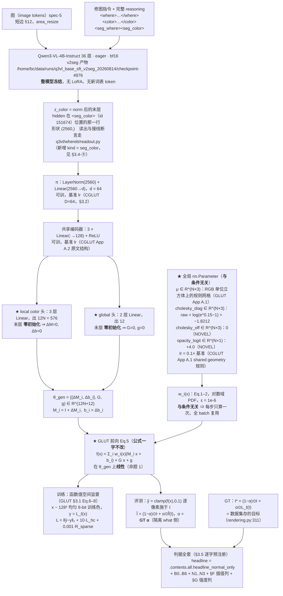

# 实验：仿射-only 条件生成（EPR-025）

**标题**：仿射-only 条件生成 —— `{μ, Σ, o}` 全局共享，条件只产 `{M_i, b_i, G, g}`

状态：提案（待 grill-me + 用户定稿）。本臂是 **P1 臂**，同时是 P2 的前置。

**本提案是新建实现。** what 侧仓库现有代码（`q3vl/what/`、`model/glut_repro/`、`gpu_render/`）与
任何 what 侧实验记录**一律不参照、不引用**（用户 2026-08-14 判定为污染源）。接入点只写「需要什么」。
where 侧 `q3vl/whereb/readout.py` 与 EPR-018~023 的接口可引用（本周新建）。

外部行号 / 数字以 **2026-08-15 当日 `curl` 打开的原始来源**为准（清单见文末）；本仓库
`file:line` 与数据统计以当日工作区 / 只读挂载实测为准，命令与数字见 §1「数据」。

---

## 跨臂冻结口径（EPR-024 ~ EPR-029 六份逐字一致；2026-08-15 主 agent 裁定）

> 本块在六份提案里**逐字相同**。正文任何一处与本块冲突，**以本块为准**。
> 表内实测数字均为本轮（2026-08-15）在只读挂载 / 工作区现场跑出，命令与出处逐条列在右列。

| 项 | 冻结值 | 依据 |
|---|---|---|
| **训练集** | `split == "train"` 且 `winner_confidence == "normal"`，**n = 93934**（style 51182 / local 42752） | 战役数据纪律「`winner_confidence=low` 不进主训与评测 GT」。本轮实测 `/mnt/nfs-ro/bc/data/datasets/sft2seg-20260804/splits/train.index.jsonl`：159215 = normal **93934** + low **65281** |
| **每步批组织** | **B = 32 样本 × Q = 256 色点 = 8192 色 / 步** | CGLUT 的**色** batch 8192 口径不变（GLUT App A.1 原句 "CGLUT is trained for 40 epochs with a batch size of 8192"），本块只固定 (B, Q) 拆分。裁定理由（形式事实）：同一步内每条 LUT 被采到的色点数从 128 变成 256（翻倍），同时一步内出现的不同 LUT 条数从 64 变成 32（减半）。`B=64 × Q=128` 降为 **EPR-024 的一条消融行**，其余五臂不再各出一次 |
| **步 / epoch** | `ceil(93934 / 32)` = **2936** | 算术（本轮 `python3` 复算） |
| **总步数** | 2936 × **40 epoch** = **117,440** | 40 epoch 照抄 GLUT App A.1；这是 U4 步数匹配的公共基准，六份全部行都对齐到它 |
| **GLUT 前向 clamp** | **双裁**；旗标 `--clamp {two,one}`，**默认 `two`**：全局分支 `Gx+g` 先单独 clamp（`glut_editor.html:574-579`），末端 `local + global` 整体再 clamp（`:606-610`） | 官方 demo 是**唯一可执行的官方参考实现**，且内嵌 **7 份训练好的 GLUT-32 权重**（`glut_editor.html:429` 的 `const EMBEDDED_MODELS`；本轮 JSON 解析：7 个模型，每个的 `cholesky_diag` 长度 = 32），实现可逐点对拍；论文 Eq.5 只写末端 clamp，**未排除**中间 clamp。「论文单裁」（`--clamp one`）降为**共用消融行**，只在 **EPR-024 §4** 出一次，其余五臂引用该行 |
| **`L_hc` 在 `C→0` 处** | `h = (a, b) / max(C, ε_C)`，**且**整项乘硬 mask `1[C ≥ ε_C]`，`ε_C = 1e-3`；被 mask 的点数每步落盘 `n_hc_masked` | GLUT Eq.7 未给保护，该处理属 **NOVEL 数值**。六份统一取本档。「不 mask、只加 ε」降为 **EPR-024 的一条消融行**（`--no-hc-mask`），其余五臂不再各出一次 |
| **headline 图像形成式** | **`Î_i = (1 − α_i) ⊙ I_i + α_i ⊙ f̂_i(I_i)`**，六份统一 | 判据 §B 逐字。跨臂配对 Δ 必须在**同一个量**上算；任何臂的其他形成式一律降为**诊断列**，并在列名旁写明与 headline 的差异 |
| **where 分支输出的消费口径** | 场来源统一为 where 臂的 **`m_pix`**；重采样算子统一为 `q3vl/where/upsample.py:54-62` 的 `area_resize`（下采 `mode="area"`、上采 `bilinear`），各臂采到自己载体需要的分辨率并把该分辨率写进 `run_config`、在 §E 表脚逐行印出。判据 §E 的三分层掩码**一律用 GT α 在短边 512 上算**，与场来源无关 | 三套口径（短边 512 / `m_low (gh,gw)` / 未指定）会让 §E 的四行在不同尺度上算、跨臂不可比。分层掩码固定在 GT α / 短边 512，保证 `E_in / E_band / E_out` 六份同尺 |
| **新建包落点** | 全部落在 **`q3vl/whatb/`**（镜像 where 侧 `q3vl/whereb/` 的「本周新建、可信」命名）。共同依赖——GLUT Eq.1-5 前向、CGLUT 生成器、CIELab / ΔE00、判据函数——**只写一份**，六臂共用；各臂自己的新模块放 `q3vl/whatb/<epr 名>/` 子包 | 避免出现两份并行的 GLUT 前向实现（口径必然漂移）。`q3vl/what2/` 这一命名作废 |
| **预注册判据键名** | `headline_normal_only`, `B0_identity`, `B1_libmean`, `B2_librandom`, `B3_bucket_retrieval`, `B4_oracle`, `N1_shuffle_delta`, `N1_shuffle_M`, `N2_irrelevant_delta`, `N2_irrelevant_M`, `N3_const_delta`, `N3_const_M` | 统一为 EPR-024 一套并补齐三负控制（原先四套写法）。键名不统一时，任一处拼写差异会让该列**静默缺席**而 `assert_criteria_ran` 仍然通过 |
| **`<seg_color>` 的 color span 编码** | 在本 EPR 的新命名空间里**自带一份实现**，**不 import `q3vl/what/` 的任何模块**；配启动断言（下方逐字） | `q3vl/whereb/readout.py:475-476` 的 `ReadoutBuilder.needs_color` 对 `("color_close", "im_end", "seg_where", "qtok")` 返回 True，`:478-487` 的 `color_ids_from_text` 在 **`:484`** 执行 `from q3vl.what.context import encode_color_span`。`q3vl/what/` 是本轮判定的污染源树，六份**一行未读、不 import** |

**`<seg_color>` 读出的启动断言（六份逐字一致）**：入口在建 dataloader **之前**，用本次基座
`checkpoint-4976` 的 tokenizer，对本 split 随机抽 **256** 条样本的 `color` 文本 `t` 逐条执行

```
ids_self = <本 EPR 自带的 color span 编码>(tok, t)     # 新命名空间，无 q3vl.what 导入
ids_ref  = tok(f"<color>{t}</color>", add_special_tokens=False).input_ids
assert len(ids_self) == len(ids_ref)                   # 先断长度
assert all(a == b for a, b in zip(ids_self, ids_ref))  # 再逐位断 token id
```

任一条不等即 `AssertionError`、拒绝开训；抽样条数与不等条数写进 `run_setup.json`。
该断言**只调用 tokenizer**，不 import 污染源树里的任何符号。

**B3 桶级检索基线（列名 `B3_bucket_retrieval`，六份逐字一致）**

- **定义**：对评测样本取其 **record 自带的 `minor`**，在 **train 里同 `minor` 桶的 lut_id 池**中
  **均匀随机取一条** `ℓ'`，预测 `f̂ = L_{ℓ'}`；R = 8 次重复，报 mean ± std，与 arm **同样本配对**。
- **不使用 `tools/data_splits/splits_presets.csv`**。本轮实测该 CSV：3522 条，`major` 由
  `minor.rsplit("_", 1)[0]` **机械**得来（**0 例外**）⇒ `"{major} / {minor}"` 只有 **77** 个不同字符串，
  单串最多被 **363** 个 lut_id 共用；且该 CSV 的 `major` 与 record 自带的 `major` 在抽样 800 条里
  **706 条不一致**。
- **定义依据（必须原样写进 RESULT 的方法节）**：**1-of-77 的桶只能给出桶判定，给不出 lut_id 的
  argmax**，所以本列**按定义是桶级下界，不是精确检索**；任何关于「检索这条路能到哪」的上界
  一律看 **B4 oracle**，不看 B3。
- **桶池实测（本轮遍历 `/mnt/nfs-ro/bc/data/datasets/sft2seg-20260804/records/shards/shard-00000.tar`
  的全部 162,359 条 record）**：record 自带 `major` **10** 类；train 的 `minor` **77** 类、
  `(major, minor)` **85** 对；record 的 `major == minor.rsplit("_",1)[0]` 只在
  **17,176 / 162,359** 条成立。train 的 77 个 minor 桶，lut_id 池大小 **min 1 / 中位 17 / max 285**，
  合计 **3149**。V_what normal-only 567 条的 `minor` **全部**被 train 桶覆盖，GT lut_id **全部**落在
  对应桶池内，桶内均匀取一条命中 GT lut_id 的期望比例 = **0.108**（61.38 / 567）；
  T_lut_unseen normal-only 252 条的 `minor` 也全部被覆盖，但 GT lut_id 落在 train 桶池内的条数
  **构造性为 0**（该 split 的 lut_id 与 train 交集为 0）。
- **另一个标签事实（写进方法节；三负控制会连带替换它）**：`instruction` 是英文句子里内嵌一个
  **中文风格名**（例：`"Please apply the 明亮活力彩 style across the photograph, …"`）。本轮抽
  train 前 6000 条：**6000/6000** 条含该中文风格名，抽样内 **1382** 个不同风格名，其中 **173** 个
  跨多个 `minor`。它与 record 的 77 个 `minor`、10 个 `major` 是**三套互不相同**的标签词表。

---

## 1. 任务

### 1.1 本实验测试的那一个结构改动（一句话）

把 CGLUT 参数生成器里随条件变化的参数组从 **22N+12** 缩到 **12N+12** —— 移除 `μ` / `Σ` / `o`
三个参数头，改成三组与条件无关的全局 `nn.Parameter`，条件只生成 `{M_i, b_i}_{i=1}^{N} ∪ {G, g}`，
使「生成参数 → 函数值」的映射变成**线性**。**除这一处外，前向公式、损失、采样、优化器、步数、
判据一律不动。**

### 1.2 数据（数据集 + n + 切分；全部本轮从只读挂载实测）

只读挂载 `/mnt/nfs-ro/bc/data/datasets/sft2seg-20260804/splits/*.index.jsonl`，
逐行 `json.loads` 统计（单次运行，无采样）：

| 集合 | n | style | local | normal | low | normal-only n | normal-only style / local | uniq lut_id | uniq source |
|---|---|---|---|---|---|---|---|---|---|
| **V_what**（唯一选型集） | 897 | 489 | 408 | 567 | 330 | **567** | 321 / 246 | 531 | 163 |
| T_final（终测，LUT 见过） | 918 | 494 | 424 | 533 | 385 | 533 | 317 / 216 | 577 | 201 |
| **T_lut_unseen**（终测，LUT-id 不相交） | 433 | 235 | 198 | 252 | 181 | **252** | 144 / 108 | 259 | 212 |
| train | 159215 | 83671 | 75544 | 93934 | 65281 | —（93934） | —（51182 / 42752） | 3149 | 27104 |

本轮同时核的三项：

- `set(train.lut_id) ∩ set(T_lut_unseen.lut_id)` = **0**；`T_final ∩ train` = 577、`V_what ∩ train` = 531；
  四个 split 的 lut_id 并集 = 3408。
- 同图配对差分可用样本：V_what normal-only 有 **138** 个 source，其中 **120 个 source ≥ 2 个样本**
  （最多 12）；T_lut_unseen normal-only 有 157 个 source，只有 **67 个 ≥ 2 个样本**（最多 6）。
- preset 库总量 **3522**（`tools/data_splits/splits_presets.csv`，`csv.DictReader` 计数：
  train **3172** / val **175** / test **175**；`major` 唯一值 **40**、`minor` 唯一值 **77**）。

复核命令（原样可重跑）：

```bash
cd /mnt/nfs-ro/bc/data/datasets/sft2seg-20260804/splits/
python3 -c 'import json,collections
for n in ["V_what","T_final","T_lut_unseen","train"]:
    rows=[json.loads(l) for l in open(f"{n}.index.jsonl")]
    print(n,len(rows),collections.Counter(r["task_type"] for r in rows),
          collections.Counter(r["winner_confidence"] for r in rows),
          len({r["lut_id"] for r in rows}),len({r["source_image_id"] for r in rows}))'
python3 -c 'import csv,collections
rows=list(csv.DictReader(open("/home/bc/VeraRetouch/tools/data_splits/splits_presets.csv")))
print(len(rows),collections.Counter(r["split"] for r in rows),
      len({r["major"] for r in rows}),len({r["minor"] for r in rows}))'
```

**切分纪律**：V_what 是唯一选型集；T_final / T_lut_unseen 每个 arm 只跑一次；
`winner_confidence == "low"` 不进主训与评测 GT；headline 一律 normal-only。

**数据的生成律（本仓库代码事实，不是假设）** ——
`dataset_build/src/construct/rendering.py:301-313`（当日打开逐行确认）：

```
mask is None            -> output = edited                                   # task_type = style（全局）
mask is not None        -> mixed  = before*(1-alpha) + edited*alpha           # :311
                           output = where(alpha==0, before,
                                    where(alpha==1, edited, mixed))           # :313
edited = LUT 三线性求值(before)                                                # :390-405，axis_order = "bgr"
```

即目标的空间变化色彩变换恰为

$$F^\ast(x,p)=(1-\alpha(p))\,x+\alpha(p)\,L_\ell(x)\tag{GT}$$

style 样本 $\alpha\equiv1$。真值 soft alpha 由 `.cgt` 提供
（`dataset_build/src/construct/canonical_masks.py:90-123` 的 `raster_geometry`：
`circulargradient` / `gradient` 两族，末尾 `α²(3−2α)` smoothstep + `Flipped` 取反；
落盘见 `rendering.py:431-437` 的 `save_cgt_png`）。

### 1.3 参考工作（逐条本轮打开原始来源核实；打不开的已弃用，见 §5「弃用清单」）

#### (a) GLUT / CGLUT，arXiv **2605.19889**（Xue, Serrano-Lozano, Su, Vazquez-Corral；CVC-UAB；2026/05/19）

- **§3.1 前向（Eq.1–5）**，原文形式：
  $p_i(x)=\frac{1}{\sqrt{(2\pi)^3|\Sigma_i|}}\exp(-\tfrac12 d_i(x))$，
  $d_i(x)=(x-\mu_i)^\top\Sigma_i^{-1}(x-\mu_i)$ (Eq.1)；
  $w_i(x)=\frac{p_i(x)o_i}{\sum_j p_j(x)o_j+\epsilon}$ (Eq.2)；
  $f_i(x)=M_ix+b_i$ (Eq.3)；$f_{\text{global}}(x)=Gx+g$ (Eq.4)；
  $f(x)=\sum_i w_i(x)f_i(x)+f_{\text{global}}(x)$ (Eq.5)，$\hat y=\mathrm{clamp}(f(x),0,1)$。
  参数化原句：$\Sigma_i=L_iL_i^\top$，$L_i$ 下三角，**对角元由 Softplus 保正**，每个协方差 6 个可学参数；
  $o_i\in[0,1]$；单 LUT 一个全局仿射 $\{G,g\}$。
  参数总量 $22N+12$ 与论文 Table 9 的 `#Params` 逐格吻合（N=32 → $22\cdot32+12=716$ = 表内 716）。
- **§3.1 损失（Eq.6–8）**：$\mathcal{L}_{\text{rec}}=\|\hat y-y\|_1$；
  $\mathcal{L}_{hc}=C\cdot(1-\langle\hat h,h\rangle)$（CIELab，$C=\sqrt{a^2+b^2}$，$h=(a/C,b/C)$）；
  $\mathcal{R}_{\text{sparse}}=-\frac1N\sum_i[o_i\log(o_i+\epsilon)+(1-o_i)\log(1-o_i+\epsilon)]$；
  $\mathcal{L}_{\text{total}}=\mathcal{L}_{\text{rec}}+\lambda_{hc}\mathcal{L}_{hc}+\lambda_{\text{sparse}}\mathcal{R}_{\text{sparse}}$。
- **§4.1 Implementation Details 原句数值**：PyTorch，**Adam** 优化器，单张 RTX 4090；
  **cosine annealing，起始 $10^{-3}$，贯穿全程**；GLUT 20 epoch / batch 1024，
  **CGLUT 40 epoch / batch 8192**；$\lambda_{hc}=10$、$\lambda_{\text{sparse}}=0.001$。
  数据集：300 条 LUT（225 条 $33^3$/$32^3$ + 75 条 $64^3$），7 条 LUT 取自 CNILUT。
- **§3.2 CGLUT**：条件 = 可学习嵌入矩阵 $E\in\mathbb{R}^{L\times D}$ 的第 $l$ 行 $e_l$；
  生成器 $\mathcal{G}$ = 共享编码器 + 多个参数专属头；训练目标与 §3.1 完全相同；
  混合口径 $e^\alpha_{l_1l_2}=(1-\alpha)e_{l_1}+\alpha e_{l_2}$ 喂进生成器。
  **Shared Geometry 原句**：共享的是空间属性 $\{\mu_i,\Sigma_i\}_{i=1}^N$，
  **生成的是** $\{o_{i,l},M_{i,l},b_{i,l},G_l,g_l\}_{i=1}^N$ —— 即 **$o$ 仍由条件生成**。
  → **本臂在此之外再共享 $o$，是 NOVEL 的一格**（GLUT 论文全文无此配置）。
- **App A.1 初始化原句**：Gaussian means 在 $[0,1]^3$ RGB 立方体上**均匀规则网格**分布；
  协方差**各向同性初始化，尺度 $\sigma=0.15$，经 logarithmic Cholesky 参数**；
  **opacity 初值 1.0**；**仿射色彩变换初始化为单位矩阵 + 零偏置**。
- **App A.1 CGLUT 训练原句**：**style embedding 与 shared geometry 参数用 0.1× 基准 lr**，
  生成器（共享特征编码器 + 参数头）用基准 lr $10^{-3}$；Eq.2 与 Eq.8 的 $\epsilon=10^{-6}$。
  硬样本挖掘：epoch **5→20**，最高 $L_1$ 误差样本的挖掘比例从 **10% 线性升到 40%**。
  采样：8-bit RGB 空间均匀采 **$128^3$** 作训练集，**其余颜色留作评测**。
- **App A.2 生成器结构原句**：64 维 style embedding → 共享编码器 = **3 个 linear 层，各 128 隐单元
  （"small" 配置 64）** → 分支进多个参数头。**mean 头 = 2 个 linear 层**（首层 128 单元，输出层维度由
  $N$ 决定，例如 $3N$）；**其余参数头同为 2 层，唯独 local color 头是 3 层**；
  **global affine 头输出 12（9 矩阵 + 3 偏置）**；所有中间层夹 ReLU。
  **Shared Geometry 配置下，mean 头与 covariance 头被一组全局可学习参数替换**，
  只有 opacity 与色彩变换动态生成。
- **App B.3 Table 7（7-LUT 插值，$C_7^2=21$ 对，MIT5K 100 张自然图）PSNR 原始数字**：

  | 方法 | α=0 | 0.2 | 0.4 | 0.6 | 0.8 | 1 |
  |---|---|---|---|---|---|---|
  | CGLUT-32L (Full) | 48.67 | 35.44 | **31.16** | 31.33 | 34.64 | 47.95 |
  | CGLUT-32L (Shared Geo.) | 47.36 | 38.46 | **34.67** | 34.47 | 37.60 | 46.18 |

  同表 $\Delta E_{00}$：Full 0.59 / 3.08 / **4.48** / 4.70 / 3.23 / 0.56；
  Shared Geo. 0.66 / 2.11 / **3.19** / 2.96 / 1.94 / 0.68。
  原文另注：训练时**未施加任何混合相关的额外约束**。
- **App B.3 Table 8（多 LUT 拟合，† = Shared Geometry）225-LUT 列 PSNR 原始数字**：
  CGLUT-32†(Small) **41.97** vs CGLUT-32(Small) **46.68**；
  CGLUT-64†(Large) **47.54** vs CGLUT-64(Large) **52.41**。
  7-LUT 列：49.35 vs 50.76（32 Small）、52.62 vs 55.10（64 Large）；
  75-LUT 列：43.55 vs 45.66（32 Small）、47.13 vs 49.37（64 Large）。
- **App B.4.1 Table 9（GLUT-32，75-LUT Hald）**：N = 8/16/32/64/128 → PSNR
  37.01 / 41.50 / **45.47** / 48.42 / 50.31，`#Params` 188/364/716/1420/2828。
  **格点里没有 48**；本项目的 N=48 是算术外推。
- **App B.4.3 Table 10(b)（GLUT-32，75-LUT Hald）原始数字**：

  | 配置 | PSNR | ΔE00 | ΔE76 | #Params |
  |---|---|---|---|---|
  | w/o weight normalization（$w_i=p_io_i$） | 45.17 | 0.419 | 0.776 | 716 |
  | **w/o Opacity（$w_i=p_i/(\sum_j p_j+\epsilon)$）** | **45.43** | 0.415 | 0.774 | 684 |
  | w/o Global（$f=\sum_i w_if_i(x)+x$） | **45.28** | 0.419 | 0.776 | 704 |
  | w/o Global w/o Residual（$f=\sum_i w_if_i(x)$） | **40.54** | 0.661 | 1.273 | 704 |
  | Full Model（Eq.5） | **45.47** | 0.414 | 0.770 | 716 |

- **App B.4.4/B.4.5/B.4.6 Table 11**：loss 消融 45.36（仅 $\mathcal{L}_{rec}$）→ 45.38（+$\mathcal{L}_{hc}$）
  → 45.47（+$\mathcal{R}_{sparse}$）；硬挖掘 45.13（无）→ 45.4x（有）；
  Mean 初始化 random vs uniform，原文记「uniform 略优，取为默认」。
- **官方交互 demo（GitHub 仓库无代码，这是唯一可核实的官方实现）**：
  `https://color.cvc.uab.cat/assets/html/glut_editor.html`（本轮 `curl -k` → HTTP 200，
  157,922 字节，1,217 行）。逐行取证：
  - `:441` `this.epsilon = 1e-6`；`:442` `log2pi`
  - `:451-455` `sigmoid(x)`
  - `:457-465` `buildCholeskyMatrix` = `[[softplus(d0),0,0],[off0,softplus(d1),0],[off1,off2,softplus(d2)]]`
    —— **对角过 Softplus、非对角原样**（与 §3.1 一致）；权重按 `cholesky_diag`(3)/`cholesky_off`(3) 分存
  - `:520-522` 协方差三个对角元各加 `epsilon` 抖动；`:525-526` 预存精度矩阵与 `log det`
  - `:527` `opacities.push(sigmoid(params.opacities_logit[g][0]))` —— **$o$ 由 logit 过 sigmoid**
  - `:542-546` `gaussianPDF` 走**对数域**：`logPdf = -0.5*(mahalSq + logDet + 3*log2pi)`
  - `:556-566` `computeWeights` = `pdf*opacity` 求和后 `w/(weightSum + epsilon)`（Eq.2）
  - `:574-579` **全局分支 `G·x+g` 先被单独裁到 [0,1]**（论文 Eq.4/Eq.5 无此步）
  - `:596-604` `residual` 开关：真 → `rgbGlobal + localTransform`，假 → 只有 `localTransform`
  - `:606-610` 总和再裁一次 —— **demo 共裁两次，论文只裁一次**

#### (b) StatLUT，arXiv **2607.08227**（Wang, Hao, Wang, Zhu；2026/07/09）

**§3.2 "Attention-Guided Residual LUT Generation via MR-Mapper"** 原文：
$Q=W_q(\mathrm{LUT}_{id})+(PE_R\oplus PE_G\oplus PE_B)$，$K=W_k(M)$，$V=W_v(M)$ (Eq.2)；
$\Delta C=\mathrm{FFN}(\mathrm{Softmax}(QK^\top/\sqrt{d_k})V)$ (Eq.3)；
$\mathrm{LUT}_{pred}=\mathrm{Clamp}(\mathrm{LUT}_{id}+\Delta C,0,1)$ (Eq.4)。
**紧随 Eq.4 的原句**："To ensure training stability, we zero-initialize the final FFN projection
layer. This guarantees an initial identity mapping ($\Delta C=0$), preventing early-stage color
distortion." → 本臂借鉴的机制：**末层零初始化 + 恒等残差**。

#### (c) SA-LUT，arXiv **2506.13465**（Gong, Wu, Tao, Li, Loy；2025/06/16）

**§3.1.2 LUT Fusion Eq.3**：$\mathrm{LUT}_{\text{fused}}=\mathrm{LUT}_{\text{identity}}+\sum_{i=1}^{N}\alpha_i\cdot\mathrm{LUT}_i$，
原文注 $\mathrm{LUT}_{\text{identity}}$ 作残差连接，$\alpha\to0$ 时保持输入；结果裁到 $[0,1]$。
原仓库 `github.com/Ry3nG/SA-LUT`，`SA-LUT/core/module/clut4d.py`（本轮 raw 取回，7,307 字节）：
`:5-25` `identity4d_tensor(dim, num_context_bins=2)`；`:42` 默认 `num_context_bins=2`；
`:54-56` 基 LUT 为 `nn.Parameter(zeros(...))` 再 `uniform_(-0.1, 0.1)`；
`:82` `fused_lut = fused_lut + identity_lut.unsqueeze(0)`；`:84` `clamp(fused_lut, 0, 1)`。

#### (d) Zeng et al.，arXiv **2009.14468**（Learning Image-adaptive 3D LUTs；2020/09/30）

**§III-E "Final training losses and implementation"** 原句：
"Among the $N$ 3D LUTs to be learned, **the first one is initialized as an identity map while the
others are initialized as zero maps. The bias of the FC layer is set to 1** which makes the initially
predicted weight approach to 1. Such an initialization ensures that the initial output of our model
is not far away from the input and thus increases the training speed."

#### (e) DNI，arXiv **1811.10515**（Wang, Yu, Dong, Tang, Loy；2018/11/26）

**§3.1 假设原句**："We assume that their parameters $\theta_A$ and $\theta_B$ have a 'strong
correlation' with each other, i.e., **the filter orders and filter patterns in the same position** of
$G^A$ and $G^B$ **are similar** … This assumption provides the possibility for meaningful
interpolation."；**§3.2 "Understanding Network Interpolation"** 给出三条经验观察，
第一条为「fine-tuning 促成不同网络参数间的高相关性，从而使插值有意义」。
→ 与本臂的关系：高斯基元**可置换**（permutation-invariant），正是 DNI 所要求的「同位置顺序/pattern
相关」被破坏的自由度；本臂把 $\{\mu,\Sigma,o\}$ 钉成全局共享 = 直接消掉该自由度。

### 1.4 解决什么问题（形式化命题，只陈述可证内容）

沿用形式化记号：$\varphi(c,I)=\pi(z_{\text{color}}(c,I))\in\mathbb{R}^d$，
$G_\vartheta:\mathbb{R}^d\to\Theta$，$f_\theta:[0,1]^3\to[0,1]^3$，
$\theta_{\text{gen}}=(\{M_i\},\{b_i\},G,g)\in\mathbb{R}^{12N+12}$。

**命题 1（仿射-only 线性化）**：若 $\{\mu_i,\Sigma_i,o_i\}_{i=1}^N$ 与条件无关，则 Eq.1–2 的
$w_i(x)$ 与条件无关，于是

$$f_\theta(x)=\sum_i w_i(x)(M_ix+b_i)+Gx+g$$

在 $\theta_{\text{gen}}$ 上**线性**，故对任意 $\alpha$：

$$f_{(1-\alpha)\theta^a_{\text{gen}}+\alpha\theta^b_{\text{gen}}}(x)\;=\;(1-\alpha)f_{\theta^a}(x)+\alpha f_{\theta^b}(x)\qquad\forall x\ (\text{clamp 前逐点严格相等})$$

即**参数空间路径 $f^{\text{par}}$ 与函数空间路径 $f^{\text{fun}}$ 恒等**。
注：GLUT 的 Shared Geometry 只共享 $\{\mu,\Sigma\}$，$o$ 仍由条件生成（§3.2 原句），
**不满足**该命题的前提（$o$ 进 Eq.2 的分子与分母，$w_i$ 对 $o$ 非线性）。
注：条件空间路径 $f^{\text{cond}}=f_{G((1-\alpha)z_a+\alpha z_b)}$ **不在**命题 1 的结论内
（$G_\vartheta$ 是 MLP，对 $z$ 非线性）。

**命题 2（恒等的精确可表示性）**：$\varepsilon=0$ 时 $\sum_i w_i(x)=1$，取
$M_i=I,\ b_i=0,\ G=0,\ g=0$ 得 $f_\theta(x)=x$。
$\varepsilon=10^{-6}$ 时 $\sum_i w_i(x)=1-\delta(x)$，$\delta(x)=\varepsilon/(\sum_j p_j(x)o_j+\varepsilon)$，
于是 $f_\theta(x)=(1-\delta(x))\,x$ —— 在 $\sum_j p_jo_j$ 很小的色域角落 $\delta$ 不可忽略。
**执行线**：判据 §F 的「退化权重率 $\Pr_x[\sum_j p_jo_j<\tau]$」列每板必出（$\tau$ 见 §3.5）。

**命题 3（对生成律 (GT) 的精确包含性）**：设 $L_\ell$ 在给定的共享 $\{\mu,\Sigma,o\}$ 下可被某
$\theta_L\in\mathbb{R}^{12N+12}$ 精确表示。令 $\theta_{\mathrm{id}}=(I,0,0,0)$（命题 2）。则
**逐像素参数插值** $\theta(p)=(1-\alpha(p))\theta_{\mathrm{id}}+\alpha(p)\theta_L$ 由命题 1 给出

$$f_{\theta(p)}(x)=(1-\alpha(p))\,x+\alpha(p)\,L_\ell(x)=F^\ast(x,p)\qquad(\text{clamp 前逐点})$$

即**仿射-only 参数化 + 逐像素参数插值精确包含数据生成律**（`rendering.py:311`）。
在 Full Generation 下同一构造给出的是 $f_{(1-\alpha)\theta_{\mathrm{id}}+\alpha\theta_L}$，
其 $\mu,\Sigma,o$ 被一并插值，$w_i$ 随之改变，**一般 $\neq F^\ast$**。
（前提的可满足性本身不由本命题保证；它由 §4 的拟合精度列实测。）

**因此本臂在设计空间里的位置 = D4 的第三格**（其余格全部按 EPR-024 的冻结值不动）：

| D4 选项 | 生成维度（N=48，算术） | 出处 |
|---|---|---|
| ① Full Generation（全 22N+12） | **1068** | CGLUT 默认；= EPR-024 |
| ② Shared Geometry（共享 μ,Σ） | 13N+12 = **636** | GLUT §3.2 / App A.2 原生 |
| ③ **仿射-only（共享 μ,Σ,o）** | 12N+12 = **588** | **NOVEL**；满足命题 1 |
| ④ 只生成全局仿射 | **12** | GLUT B.4.3 的「去掉局部」对照 |

N=32 时：① 716（= GLUT Table 9 表内值）/ ② 428 / ③ **396** / ④ 12。
全局（不随条件变）的 $\{\mu,\Sigma,o\}$ 另计 **10N**（μ3 + Cholesky 6 + opacity logit 1）：
N=48 → 480，N=32 → 320。

### 1.5 通俗三段（增加了什么 / 在哪里加的 / 加了什么）

**第一段——现在的读出长什么样。** CGLUT 的生成器吃一个条件向量，过 3 层共享 MLP，然后分叉成 5 个头：
mean 头吐 3N 个数（每个高斯在 RGB 立方体里的中心），covariance 头吐 6N 个数（每个高斯的形状），
opacity 头吐 N 个数（每个高斯的权重强度），local color 头吐 12N 个数（每个高斯自己的 3×3 矩阵 + 3 维偏置），
global 头吐 12 个数。换一个条件，这 22N+12 个数**全部**跟着换 —— 包括「RGB 立方体被切成哪些块」。

**第二段——本实验在哪里动。** 只动生成器的头清单：**mean / covariance / opacity 三个头整个删掉**，
换成三张与条件无关的全局参数表（`nn.Parameter`，形状 `(N,3)` / `(N,6)` / `(N,1)`，
照 CGLUT 对 shared geometry 的规矩用 0.1× 学习率训）。生成器只剩两个头：local color 头（3 层，出 12N）
与 global 头（2 层，出 12）。前向公式 Eq.1–5 一个字符不改。

**第三段——这样改之后算术上发生了什么。** 「RGB 立方体切成哪些块」`w_i(x)` 不再随条件变，
于是输出 $f(x)=\sum_i w_i(x)(M_ix+b_i)+Gx+g$ 对生成出来的那 12N+12 个数**是一次线性函数**。
两个条件各生成一套数，把两套数按 α 线性混合再喂进前向，得到的函数值**等于**两个函数值按同样的 α
线性混合（clamp 前逐点相等，命题 1）。数据集里 local 样本的目标恰好就是
`before*(1-alpha) + edited*alpha`（`rendering.py:311`）这种线性混合，命题 3 给出了它的精确包含。

---

## 2. 模型

### 2.1 模型图（灰 = 冻结一字不改；★ = 本次改动挂点）



### 2.2 模型伪代码

```python
# ---------------- 冻结：整个 Qwen3-VL（v2seg checkpoint-4976） ----------------
# ---------------- 可训：以下全部 -------------------------------------------
N, d, H = 48, 64, 128          # N: 高斯数（项目自定值）；d: CGLUT D=64；H: CGLUT App A.2 "large"

# (A) 与条件无关的全局参数（本次改动：原来是三个头，现在是三张表）
mu            = nn.Parameter(uniform_grid_4x4x3())          # (N,3)   GLUT App A.1
chol_diag     = nn.Parameter(full((N,3), -1.8212))          # (N,3)   softplus(-1.8212) = 0.15
chol_off      = nn.Parameter(zeros(N,3))                    # (N,3)   NOVEL
opa_logit     = nn.Parameter(full((N,1), 4.0))              # (N,1)   sigmoid(4)=0.98201, NOVEL
# lr(mu, chol_diag, chol_off, opa_logit) = 0.1 * base_lr     （CGLUT App A.1）

# (B) 条件路径（生成器）
proj   = nn.Sequential(nn.LayerNorm(2560), nn.Linear(2560, d))                    # π
enc    = nn.Sequential(nn.Linear(d,H), nn.ReLU(), nn.Linear(H,H), nn.ReLU(),
                       nn.Linear(H,H), nn.ReLU())                                 # CGLUT App A.2：3 层
head_local  = nn.Sequential(nn.Linear(H,H), nn.ReLU(), nn.Linear(H,H), nn.ReLU(),
                            nn.Linear(H, 12*N))            # 3 层（App A.2 原文：local color 头 3 层）
head_global = nn.Sequential(nn.Linear(H,H), nn.ReLU(), nn.Linear(H, 12))          # 2 层
nn.init.zeros_(head_local[-1].weight);  nn.init.zeros_(head_local[-1].bias)       # StatLUT §3.2
nn.init.zeros_(head_global[-1].weight); nn.init.zeros_(head_global[-1].bias)

def geometry():                      # 与条件无关 -> 每个 step 只算一次
    L = tril_from(softplus(chol_diag), chol_off)            # demo :457-465
    Sigma = L @ L.transpose(-1,-2) + 1e-6*eye(3)            # demo :520-522
    return precision(Sigma), logdet(Sigma), sigmoid(opa_logit)   # demo :525-527

def weights(x, prec, logdet, o):                            # Eq.1-2，对数域（demo :542-546）
    mah   = einsum('...i,nij,...j->...n', x-mu, prec, x-mu)
    logp  = -0.5*(mah + logdet + 3*log(2*pi))
    infl  = exp(logp) * o.squeeze(-1)
    return infl / (infl.sum(-1, keepdim=True) + 1e-6)       # demo :556-566

def generate(z_color):                                      # z_color: (B,2560)
    h  = enc(proj(z_color))
    dM = head_local(h)[..., :9*N].reshape(-1,N,3,3)
    db = head_local(h)[..., 9*N:].reshape(-1,N,3)
    Gg = head_global(h)
    M  = eye(3) + dM                                        # 恒等锚定：残差参数化
    b  = db
    return M, b, Gg[..., :9].reshape(-1,3,3), Gg[..., 9:]   # θ_gen ∈ R^(12N+12)

def forward(x, z_color):                                    # x: (B,P,3) 颜色查询
    prec, logdet, o = geometry()
    w = weights(x, prec, logdet, o)                         # 与 z_color 无关
    M, b, G, g = generate(z_color)
    local  = einsum('bpn,bnij,bpj->bpi', w, M, x) + einsum('bpn,bni->bpi', w, b)
    return local + einsum('bij,bpj->bpi', G, x) + g[:,None,:]   # Eq.5，clamp 在外面
```

### 2.3 冻结 / 可训清单与参数量（逐项算术）

| 组件 | 状态 | lr | 参数量（N=48, d=64, H=128） | 依据 |
|---|---|---|---|---|
| Qwen3-VL-4B v2seg checkpoint-4976（视觉塔 + 语言塔 + embedding） | **冻结** | — | 0 | 本战役共同约束 |
| `mu` (N,3) / `chol_diag` (N,3) / `chol_off` (N,3) / `opa_logit` (N,1) | **可训，全局共享** | **0.1× base** | 144+144+144+48 = **480** | CGLUT App A.1「shared geometry 用 0.1× lr」；**本臂把 o 纳入该组属 NOVEL** |
| `proj` = LayerNorm(2560) + Linear(2560→64) | 可训 | base | 5,120 + 163,904 = **169,024** | 记号表 π；LISA 式 seg-token 读出接缝 |
| `enc` = 3 × Linear(→128) | 可训 | base | 8,320 + 16,512 + 16,512 = **41,344** | CGLUT App A.2 |
| `head_local` = 3 层，出 12N=576 | 可训，**末层零初始化** | base | 16,512 + 16,512 + 74,304 = **107,328** | CGLUT App A.2（local color 头 3 层）+ StatLUT §3.2（零初始化） |
| `head_global` = 2 层，出 12 | 可训，**末层零初始化** | base | 16,512 + 1,548 = **18,060** | 同上 |
| **合计新增可训参数** | | | **336,236 ≈ 33.6 万** | |

**被删掉的三个头**（相对 Full Generation 的差）：mean 头 2 层出 3N、covariance 头 2 层出 6N、
opacity 头 2 层出 N —— 其参数与生成维度一并从 22N+12 降到 12N+12。

显存增量：颜色查询是 `(B,P,3)`，中间张量 `w` 为 `(B,P,N)`；B=32 / P=256 / N=48 时
`w` = 393,216 个 fp32 ≈ 1.5 MB。冻结基座前向的显存与 EPR-018~023 同档。

---

## 3. 数学公式、优化器、接入

### 3.1 前向（照抄 GLUT §3.1 Eq.1–5，一个字符不改）

$$d_i(x)=(x-\mu_i)^\top\Sigma_i^{-1}(x-\mu_i),\qquad
p_i(x)=\frac{1}{\sqrt{(2\pi)^3|\Sigma_i|}}\exp\!\left(-\tfrac12 d_i(x)\right)\tag{1}$$

$$w_i(x)=\frac{p_i(x)\,o_i}{\sum_{j=1}^{N} p_j(x)\,o_j+\varepsilon},\qquad \varepsilon=10^{-6}\tag{2}$$

$$f_i(x)=M_ix+b_i,\qquad f_{\text{global}}(x)=Gx+g\tag{3,4}$$

$$f(x)=\sum_{i=1}^{N} w_i(x)f_i(x)+f_{\text{global}}(x),\qquad \hat y=\mathrm{clamp}(f(x),0,1)\tag{5}$$

$\Sigma_i=L_iL_i^\top$，$L_i$ 下三角、对角过 Softplus、非对角原样（§3.1 + demo `:457-465`）；
$o_i=\sigma(\text{logit}_i)$（demo `:527`）；$p_i$ 走对数域（demo `:542-546`）。

**本臂的唯一形式差别**：$\{\mu_i,\Sigma_i,o_i\}$ 不是 $G_\vartheta(z)$ 的输出，而是
`nn.Parameter`。因此 $w_i(x)$ **与 $z$ 无关**，$f$ 在 $\theta_{\text{gen}}$ 上线性（命题 1）。

**clamp 次数（跨臂冻结口径，本臂不再自设默认）**：**双裁**，`--clamp two`（默认）——
全局分支 `Gx+g` 先单独 clamp（`glut_editor.html:574-579`），末端 `local + global` 整体再 clamp
（`:606-610`）。裁定依据见跨臂冻结口径块（demo 是唯一可执行的官方参考实现且内嵌 7 份训练好的
GLUT-32 权重，实现可对拍；论文 Eq.5 只写末端 clamp、未排除中间 clamp）。
「论文单裁」（`--clamp one`）是**六臂共用消融行，只在 EPR-024 §4 出一次**，本臂引用该行、不另出。
原「保守默认跟论文」与「待决策项 Q3」作废。

### 3.2 损失函数（照抄 GLUT §3.1 Eq.6–8 + §4.1 权重）

在**函数值空间**监督（GLUT App A.1 的采样口径）：每步对每个样本 $i$（其 lut_id 为 $\ell_i$）
从 $128^3$ 均匀 8-bit 训练色集中抽 $P$ 个颜色 $x$，目标 $y=L_{\ell_i}(x)$（三线性求值，
`rendering.py:390-405`，`axis_order = "bgr"`）：

$$\mathcal{L}_{\text{rec}}=\|\hat y-y\|_1\tag{6}$$

$$\mathcal{L}_{hc}=C\cdot\big(1-\langle\hat h,h\rangle\big),\quad C=\sqrt{a^2+b^2},\ h=(a/C,\,b/C)\ \text{（CIELab，取自 } y\text{）}\tag{7}$$

$$\mathcal{R}_{\text{sparse}}=-\frac1N\sum_{i=1}^{N}\big[o_i\log(o_i+\varepsilon)+(1-o_i)\log(1-o_i+\varepsilon)\big]\tag{8}$$

$$\mathcal{L}_{\text{total}}=\mathcal{L}_{\text{rec}}+\lambda_{hc}\mathcal{L}_{hc}+\lambda_{\text{sparse}}\mathcal{R}_{\text{sparse}},
\qquad \lambda_{hc}=10,\ \lambda_{\text{sparse}}=0.001$$

| 项 | 值 | 出处 |
|---|---|---|
| $\lambda_{hc}$ | **10** | GLUT §4.1 原文 |
| $\lambda_{\text{sparse}}$ | **0.001** | GLUT §4.1 原文 |
| $\varepsilon$（Eq.2 与 Eq.8） | **$10^{-6}$** | GLUT App A.1 原文；demo `:441` |
| $\mathcal{L}_{hc}$ 在 $C\to0$ 处 | $h=(a,b)/\max(C,\varepsilon_C)$ **且**整项乘硬 mask $\mathbb{1}[C\ge\varepsilon_C]$，$\varepsilon_C=10^{-3}$；被 mask 点数每步落盘 `n_hc_masked` | 跨臂冻结口径块（GLUT Eq.7 未给保护，属 NOVEL 数值；六份统一取本档）。「不 mask、只加 ε」是 EPR-024 §4 的六臂共用消融行 |
| 训练采样 | $128^3$ 均匀 8-bit 色，**其余颜色留评测** | GLUT App A.1 原文 |
| 硬样本挖掘 | epoch **5→20**，比例 **10%→40%**（按 $L_1$ 误差） | GLUT App A.1 原文 |

**$\mathcal{R}_{\text{sparse}}$ 的作用对象在本臂变了**：GLUT / CGLUT 里 $o$ 是逐 LUT 的
（单 GLUT 可学、CGLUT 由条件生成），本臂的 $o$ 是**一组全局参数**，$\mathcal{R}_{\text{sparse}}$
每步只有一项、不随 batch 变。**NOVEL 说明**，Eq.8 公式一字不改。备选（$\lambda_{\text{sparse}}=0$）
列为消融行 ⑨。

### 3.3 优化器参数

| 项 | GLUT / CGLUT 原文值 | 本臂取值 | 说明 |
|---|---|---|---|
| 优化器 | **Adam**（§4.1 原句 "optimized using the Adam optimizer"） | **Adam** | 照抄。**不改成 AdamW**——原文写的是 Adam |
| 基准 lr | **$10^{-3}$** | **$10^{-3}$** | 照抄 |
| schedule | **cosine annealing，贯穿全程** | **cosine annealing，贯穿全程** | 照抄；无 warmup（原文未提） |
| 共享几何 lr | **0.1× 基准**（App A.1，作用于 style embedding + shared geometry） | **0.1× 基准**，作用于 `mu` / `chol_diag` / `chol_off` / `opa_logit` | **把 o 纳入该组属 NOVEL**（GLUT 的 shared geometry 不含 o）；消融行 ⑤ 给 1.0× |
| π（`proj`）的 lr | 原文无对应物（CGLUT 的条件是可学 embedding，本臂的条件是冻结 hidden 的投影） | **基准 lr** | **NOVEL 归属**：π 是生成器路径的一部分，不是「共享几何」。**待决策项 Q5** |
| batch | CGLUT **8192**（颜色数） | **B=32 样本 × Q=256 颜色 = 8192**（本文的 $P$ 即跨臂口径的 $Q$） | 拆分由**跨臂冻结口径块**定死（六份一致），乘积照抄 8192。原「待决策项 Q6」作废 |
| 训练集 | — | `train` 且 `winner_confidence == "normal"`，**n = 93934** | 跨臂冻结口径块；`low` 的 65281 条不进主训与评测 GT |
| epoch / 步数 | CGLUT **40 epoch** | **40 epoch；`ceil(93934/32) = 2936` 步/epoch，总 117,440 步**（与 EPR-024 逐位一致，U4 步数匹配） | 跨臂冻结口径块的公共基准，六份共用；不再有「EPR-024 未定稿前待填」这一状态 |
| weight decay | 原文未提 | **0** | Adam 默认；原文未提即不加 |
| 梯度裁剪 | 原文未提 | **不裁** | 原文未提即不加。**偏离若发生须诚实登记** |
| 精度 | 原文未提 | **fp32**（头侧） | 冻结基座前向走 bf16；**头侧与判据侧一律 fp32** —— §3.6 的 1e-5 断言在 bf16 下必然失败（bf16 机器精度 ≈ 7.8e-3） |
| seed | — | **20260810** | 本仓库统一 |
| checkpoint 选择 | 原文无此概念 | **quick-eval 硬门 + `.contexts.all.headline_normal_only` 择优，永不读 val loss** | 本战役红线 |

### 3.4 改动怎么接进来（新建实现；只写「需要什么」）

| 项 | 内容 |
|---|---|
| **① 新增模块：共享几何** | 新文件 **`q3vl/whatb/epr025/geometry.py`**（落点由跨臂冻结口径块定死；`q3vl/what2/` 作废；**不 import 任何 `q3vl/what/` 代码**）：`SharedGeometry(nn.Module)` 持有 `mu (N,3)` / `chol_diag (N,3)` / `chol_off (N,3)` / `opa_logit (N,1)` 四个 `nn.Parameter`，`forward()` 返回 `(precision (N,3,3), logdet (N,), o (N,))`。Cholesky 装配照 demo `:457-465`（对角 Softplus、非对角原样）；协方差对角加 `1e-6` 抖动照 demo `:520-522`；`logdet` 与精度矩阵预算照 demo `:525-526`。**该模块的 `forward()` 不接受任何条件参数**——这是「共享确实接了线」的类型级保证。 |
| **② 前向（不新增，直接复用）** | GLUT Eq.1-5 的前向**不在本臂重写**，一律 import `q3vl/whatb/glut.py`（六臂唯一一份实现，clamp 默认 `two`）。本臂只在 `q3vl/whatb/epr025/forward.py` 里做参数装配的薄封装：`glut_weights(x, geom)` 实现 Eq.1–2（对数域，demo `:542-546` / `:556-566`），`glut_apply(x, w, M, b, G, g)` 实现 Eq.3–5。两个函数都**不 import** 生成器，保证 Eq.1–5 与参数来源解耦。 |
| **③ 新增模块：生成器** | 同目录 `generator.py`：`AffineOnlyGenerator(nn.Module)` = `proj`(LayerNorm+Linear 2560→d) + `enc`(3×Linear→H) + `head_local`(3 层→12N) + `head_global`(2 层→12)，末层零初始化；`forward(z)` 返回 `(M, b, G, g)`，其中 `M = eye(3) + dM`。**结构照 CGLUT App A.2**（共享编码器 3 层 / local color 头 3 层 / global 头 2 层 / 中间层 ReLU）。 |
| **④ 恒等锚定** | 残差参数化 $M_i=I+\Delta M_i$、$b_i=\Delta b_i$，`head_local` / `head_global` **末层 weight 与 bias 全零初始化**。step0 时 $\Delta M=\Delta b=G=g=0$，由命题 2 得 $f(x)=(1-\delta(x))x$。**形式说明**：$M_i=I+\Delta M_i$ 与自由 $M_i$ 是同一函数族的**重参数化（双射）**，差别只在初值与优化几何；它是「CGLUT 生成器形态下实现 GLUT App A.1『仿射初始化为单位阵 + 零偏置』」的唯一方式。三条先例：StatLUT §3.2（末层 FFN 零初始化保证 $\Delta C=0$）、SA-LUT `clut4d.py:82-84`（identity 残差 + clamp）、Zeng §III-E（首条基 LUT 恒等、其余为零、FC bias = 1）。 |
| **⑤ μ 初始化** | GLUT App A.1 原文 = 「$[0,1]^3$ 上均匀规则网格」。**N=48 不是完全立方数**，原文未给非立方 N 的规则。保守默认：**4×4×3 轴对齐规则网格**，第 $k$ 个格心 $=\frac{2k+1}{2n_{\text{axis}}}$，轴序 R=4 / G=4 / B=3。**NOVEL，理由**：这是「均匀规则网格」在 N=48 下的直接实例化；随机初始化档（GLUT B.4.6 的对照）与 N=64（4³ 完全立方，且是 Table 9 的格点）分别列为消融行 ⑧ / ⑦。**待决策项 Q1。** |
| **⑥ Σ 初始化** | GLUT App A.1 原文 = 各向同性、$\sigma=0.15$。**参数化口径在原文内部不一致**：§3.1 与官方 demo `:457-465` 用 **Softplus**，App A.1 写的是 "logarithmic Cholesky parameters"。保守默认**跟 §3.1 + demo（Softplus，两处一致）**：`chol_diag` raw $=\log(e^{0.15}-1)=\mathbf{-1.8212}$（`python3 -c "import math;print(math.log(math.exp(0.15)-1))"` → `-1.821182660604379`）。若改跟 A.1 的对数口径则 raw $=\log(0.15)=-1.8971$。`chol_off` **初始化 0**（各向同性 $\Sigma=\sigma^2I$ 下非对角只能为 0；论文与 demo 均未给非对角初值，**NOVEL 记录**）。**待决策项 Q2。** |
| **⑦ o 初始化** | GLUT App A.1 原文 = opacity 初值 **1.0**。demo `:527` 的 $o=\sigma(\text{logit})$ **取不到 1.0**。保守默认：`opa_logit = +4.0` ⇒ $o=0.98201$。**NOVEL，理由**：sigmoid 参数化下 1.0 不可达，+4.0 把 $o$ 放到距 1.0 不到 0.02 且 sigmoid 梯度未饱和的位置。**形式事实（不是判断）**：Eq.2 中若全部 $o_i$ 相等，$o$ 在分子分母同时约掉，$w_i(x)$ 与 $o$ 的取值无关（仅 $\varepsilon$ 项受影响），故 logit=0（$o=0.5$）与 logit=+4 在 step0 给出的 $w$ 逐点相同，差别只在 Eq.8 的初值。**待决策项 Q4。** |
| **⑧ lr 分组** | 优化器建两组：`{mu, chol_diag, chol_off, opa_logit}` 用 `0.1 × 1e-3 = 1e-4`；其余（π + enc + 两个头）用 `1e-3`。分组表与实际 param 名单落盘 `run_config.json`，启动时断言「共享组的参数张量数 == 4 且总元素数 == 10N」。 |
| **⑨ 读出接缝（需要什么）** | 需要 `q3vl/whereb/readout.py` 的 `READOUT_KINDS`（`readout.py:90-92`，现为 6 档 `seg_where` / `where_span_pool` / `where_close` / `color_close` / `im_end` / `qtok`）**新增第 7 档 `seg_color`**：reply 序列 = where span + color span + `<seg_where>` + `<seg_color>`，读出切片取 **`<seg_color>`（id 151674）单行**，`expected_ids = (151674,)`，并列入 `READOUT_NEEDS_V2SEG`（`readout.py:97`，现只有 `seg_where`）。token id 由 `q3vl/train/constants.py:16-23` 注册（`SEG_WHERE_TOK` 151673 / `SEG_COLOR_TOK` 151674，追加在 151669..151672 之后）；`readout.py:179-208` 的 `SegmentIds` 已带 `seg_color` 字段与 `has_seg` 判定，`readout.py:346` 已有 `[seg_where, seg_color]` 的 tail 拼法，**不需要新的解析逻辑**。运行时接线校验直接复用 `verify_plan`（`readout.py:365-394`：「recorded index really carries the token it claims」，不符即 `AssertionError`）与 `readout_vector`（`readout.py:417-425`，返回 `(2560,)`；`:396` 是 `readout_hidden`，不是它）。**color span 编码自带一份**：该档必然要拼 `<color>{text}</color>`，而 `ReadoutBuilder.needs_color`（`readout.py:475-476`）走的 `color_ids_from_text`（`:478-487`）在 **`:484`** `from q3vl.what.context import encode_color_span` —— `q3vl/what/` 是污染源树，本臂**一行未读、不 import**，改在 `q3vl/whatb/colorspan.py` 自带一份实现，配启动断言（逐字见跨臂冻结口径块：tokenizer 直接对拍、先断长度再逐位断 token id、256 条抽样）。 |
| **⑩ 条件缓存** | 三个负控制（N1/N2/N3）与主流程的 reasoning 需分别生成并缓存；缓存 schema **必须携带 `checkpoint` 字段**，启动时断言与本次基座路径一致（形制照 `q3vl/whereb/gencontext.py:122, 168` —— `checkpoint: str` 为必填形参、写进落盘记录）。基座 = `/home/bc/data/runs/q3vl_base_sft_v2seg_20260814/checkpoint-4976`（当日 `ls` 确认存在，同目录另有 checkpoint-2488/3500/4000/4500）。 |
| **⑪ 不变（明确列出没动的部分）** | 冻结基座全套（Qwen3-VL-4B v2seg，eager，`requires_grad_(False)`，无 LoRA，无新词表 token）；GLUT 前向 Eq.1–5 与其全部数值处理（对数域 PDF、协方差抖动、$\varepsilon=10^{-6}$、Softplus 对角）；损失 Eq.6–8 与 $\lambda_{hc}=10$ / $\lambda_{\text{sparse}}=0.001$；$128^3$ 训练色采样与「其余颜色留评测」；硬挖掘 epoch 5→20 / 10%→40%；Adam + cosine + base lr 1e-3；共享几何 0.1× lr 规则；生成器共享编码器 3 层 / local color 头 3 层 / global 头 2 层 / ReLU；条件维 d=64；N=48；数据切分与 low 排除；判据 §A–§I **一列不改**。 |
| **⑫ 入口旗标（不选 = 不影响任何其他臂）** | `--arm AFFINE_ONLY`（新值）。配套旗标全部写进 `run_config.json` / `criteria_preregistration.json`，源码 sha256 冻结：<br>• `--share {none,geo,geo_opacity}`（默认 **`geo_opacity`** = 本臂；`none` = ① Full Generation = EPR-024；`geo` = ② GLUT 原生 Shared Geometry）<br>• `--global-affine {affine,residual,none}`（默认 **`affine`** = Eq.5；`residual` = ④ 换成 $+x$；`none` = ④′ 两者都去）<br>• `--shared-lr-scale`（默认 **0.1**，CGLUT App A.1；消融 1.0）<br>• `--cond-dim`（默认 **64**，CGLUT §3.2；消融 256 / 28）<br>• `--num-gauss`（默认 **48**；消融 32 / 64）<br>• `--mu-init {grid,random}`（默认 **grid**，GLUT App A.1；消融 random = B.4.6 对照）<br>• `--zero-init-heads / --no-zero-init-heads`（默认 **on**，StatLUT §3.2）<br>• `--lambda-hc`（默认 **10**）、`--lambda-sparse`（默认 **0.001**）—— 列出来是为了让预注册文件里有它们的**记录**，不是给调的 |

### 3.5 判据（预注册，逐字，与 EPR-024 同口径；本 EPR 一列不改，另加 §F 全套）

> 以下 §A–§I 逐字取自本战役 what 侧判据表，随 baseline 冻结。

#### A. 评测集与 n（全部本轮从 `/mnt/nfs-ro/bc/data/datasets/sft2seg-20260804/splits/*.index.jsonl` 实测）

| 集合 | n | style(全局) | local | normal | low | normal-only n | normal-only style / local | uniq lut_id | uniq source |
|---|---|---|---|---|---|---|---|---|---|
| **V_what**（唯一选型集） | 897 | 489 | 408 | 567 | 330 | **567** | 321 / 246 | 531 | 163 |
| T_final（终测，LUT 见过） | 918 | 494 | 424 | 533 | 385 | 533 | 317 / 216 | 577 | 201 |
| **T_lut_unseen**（终测，LUT-id 不相交） | 433 | 235 | 198 | 252 | 181 | **252** | 144 / 108 | 259 | 212 |
| train | 159215 | 83671 | 75544 | 93934 | 65281 | — | — | 3149 | 27104 |

- `train ∩ T_lut_unseen` 的 lut_id 交集 = **0**（本轮核）。preset 库总量 3522（`tools/data_splits/splits_presets.csv`，train 3172/val 175/test 175，40 major / 77 minor）。
- 同图配对差分的可用样本：V_what normal-only 有 138 个 source，其中 **120 个 source ≥2 个样本**（最多 12、中位 4）；T_lut_unseen normal-only 只有 67 个 source ≥2 个样本（中位 1）——**T_lut_unseen 上不做同图配对差分，只做同图负控制**。
- 选型只允许用 V_what；T_final / T_lut_unseen 每个 arm 只跑一次。

#### B. Headline 定义（单一标量，供 checkpoint 选优；禁 val loss）

对样本 $i$：$\hat I_i=(1-\alpha_i)\odot I_i+\alpha_i\odot \hat f_i(I_i)$，$I_i^\ast=(1-\alpha_i)\odot I_i+\alpha_i\odot L_i(I_i)$（后者 = 数据集存的目标，`rendering.py:311`）。

$$E_i=\frac{1}{|\Omega|}\sum_{p}\Delta E_{00}\big(\hat I_i(p),\,I_i^\ast(p)\big),\qquad
\textbf{H}=\frac{1}{|S|}\sum_{i\in S}E_i,\quad S=\text{V\_what}\cap\{\text{normal}\}$$

落盘键：`.contexts.style.headline_normal_only` / `.contexts.local.headline_normal_only` / `.contexts.all.headline_normal_only`；**选优只读 `.contexts.all.headline_normal_only`，禁用顶层 pooled**（混 low 少算约 0.031，CLAUDE.md）。
`α` 的口径：headline 用 **GT α**（隔离 what 侧）；预测 α 单列 `.contexts.*.headline_predalpha`。分辨率固定（短边 512，area_resize），写进 run_config。

**函数值空间并排列（不参与选优，必出）**

$$\mathcal{E}^{\text{grid}}_i=\frac{1}{17^3}\sum_{x\in\mathcal{X}_{\text{grid}}}\Delta E_{00}\big(\hat f_i(x),L_i(x)\big),\qquad
\mathcal{E}^{\text{img}}_i=\sum_{c}h^{(i)}_c\,\Delta E_{00}\big(\hat f_i(c),L_i(c)\big)$$

$\mathcal{X}_{\text{grid}}$=17³ 均匀 sRGB 网格；$h^{(i)}$=$I_i$ 的 5-bit/通道量化直方图（取前 4096 色）。两列尺度差别很大（实测：GT LUT 相对 identity 在 17³ 网格上 mean $\Delta E_{76}$=40.3、p10=21.3、p90=61.1），**任何单列都不足以定档**。
另设 GLUT 原生的**未见颜色**列：训练采 128³ 均匀色，评测在其补集上算（GLUT App A.1）。

#### C. 平凡基线列（每条与 arm **同样本配对**，报 $\Delta$ + 95% bootstrap CI + Wilcoxon p；缺一不出板）

| 列 | 定义 | 本轮实测地板（协议见下） |
|---|---|---|
| **B0 identity** | $\hat f=\mathrm{id}$ ⇒ $\hat I=I$ | 259 条 unseen LUT 上 mean $\Delta E_{76}$ = **32.79**（p50 31.24） |
| **B1 训练集平均变换** | $\bar L(x)=\frac{1}{|\text{Lib}_{tr}|}\sum_\ell L_\ell(x)$（逐点均值仍是合法映射） | mean **25.33**（p50 23.54） |
| **B2 库内随机** | $\ell'\sim U(\text{Lib}_{tr})$，R=8 次取均值 ± std | mean **35.37** |
| **B3 最近邻检索** | (a) 纯文本：指令 embedding vs LUT `major/minor` 标签文本；(b) 同投影 $\pi$ 的 image+text embedding | 未测（须在提案里定死检索器） |
| **B4 oracle 库内最优** | $\ell^\ast=\arg\min_\ell D_{\mathcal{X}}(L_\ell,L_i)$，$\ell$ 遍历 $\text{Lib}_{tr}$ | mean **9.93**（p10 4.18 / p50 9.59 / p90 15.66 / max 41.42）= **任何检索式方案的天花板** |
| **B5 分解诊断** | (GT LUT, 预测 α) 与 (预测 LUT, GT α) 两行 | — |
| **B6 库内自身填充密度** | train LUT → 最近的另一条 train LUT | mean **10.17**（p50 10.01 / p90 16.88） |

> **实测协议（必须原样写进 RESULT 的方法节）**：9³ 均匀 sRGB 网格；每色转 CIELab（D65，sRGB EOTF）后取 L2（**$\Delta E_{76}$，非 $\Delta E_{00}$**）再对色求均值；$\text{Lib}_{tr}$ = 从 train index 随机采 2500 行得到的 **1137 个 lut_id**（非全部 3149），$T_{\text{lut\_unseen}}$ = 全部 259 个；单次运行，无方差。库几何：1137 条 LUT 在该 2187 维空间做 PCA，累计方差 90%/95%/99% 需 **15/28/99** 维。
>
> B4 与 B0/B1/B2 的量级差是本判据集的核心刻度：任何「生成优于检索」的主张必须出示 arm 相对 **B4** 的配对 Δ，而不是相对 B0/B2。

**失效模式**：B0 在 α 质量小的 local 样本上很强（必须按 $\bar\alpha=\text{mean}(\alpha)$ 分层报，分层 n 一并给）；B1 是一条与指令完全无关的固定曲线，CSRNet 的 20.47 vs 23.69 说明这条地板可以很高；B2 的 std 必须报（单次抽样噪声大）；B4 在 T_lut_unseen 上严格 >0，其值本身就是「3149 条离散 LUT 覆盖连续空间到什么程度」的答案。

#### D. 指令条件性三负控制（同图配对差分）

对每个样本构造三个扰动条件，**扰动后必须重新生成 reasoning 再读出 `<seg_color>`**（teacher-forced 原 reasoning 会让控制失效）：

| 控制 | 构造 | 输出两列 |
|---|---|---|
| N1 shuffle | 同 split 内换一条**同 task_type、不同 lut_id** 的指令 | $\Delta_{\text{shuffle}}=\mathbf{H}(\text{ctrl})-\mathbf{H}(\text{true})$；$M_{\text{shuffle}}=\mathbb{E}_i D_{\mathcal{X}_{\text{grid}}}(\hat f_i^{\text{true}},\hat f_i^{\text{ctrl}})$ |
| N2 无关词 | 换成等长的非色彩英文句（图像 caption） | $\Delta_{\text{irrel}}$、$M_{\text{irrel}}$ |
| N3 固定短语 | 全体用同一句 `Please edit this photo.` | $\Delta_{\text{const}}$、$M_{\text{const}}$ |

两列缺一不可：只报 $\Delta$ 会被「无视指令」的模型（$\Delta\approx0$ 但 $M\approx0$）与「乱动」的模型同时污染；只报 $M$ 会被参数噪声刷高（T2ONet Table 4：采样宽度 h 0→0.1 使 σ 0.7190→2.1482 而 L1 从 0.0784 劣化到 0.0979）。
统计：n=567（V_what normal-only）配对，10k bootstrap + Wilcoxon 符号秩。每个消融行都必须带 $\Delta_{\text{const}}/\Delta_{\text{shuffle}}$（CLAUDE.md 硬规定）。
另设 **条件置零列**（$z=0$）与 **训练集均值条件列**（$z=\bar z_{\text{train}}$），它们是 B1 在模型内部的对应物。

#### E. 局部性列（P2/P3 必出，三分层 + 场消费四行）

分层（按 GT α）：

$$\mathcal{E}_{\text{in}}=\underset{\alpha(p)\ge0.9}{\mathrm{mean}}\ \Delta E_{00}(\hat I,I^\ast),\quad
\mathcal{E}_{\text{band}}=\underset{0.05<\alpha(p)<0.9}{\mathrm{mean}}\ \Delta E_{00}(\hat I,I^\ast),\quad
\mathcal{E}_{\text{out}}=\underset{\alpha(p)\le0.05}{\mathrm{mean}}\ \Delta E_{00}(\hat I,I)$$

场消费四行（同 checkpoint、同步数）：**GT α / where 臂预测场 / 常数场（= 该样本 $\bar\alpha$）/ 打乱场（他样本的 α）**。
按 mask 面积 $\bar\alpha$ 分层（例如 <0.1 / 0.1–0.3 / 0.3–0.6 / >0.6）与按 mask_type（radial / band / linear / semantic）分层报，**每层给 n**。

**失效模式**：$\mathcal{E}_{\text{out}}$ 在 $\mathcal{F}_1$（mask 混合）下构造性为 0（`rendering.py:311` 的 `out[alpha==0]=before` 同构），跨族比较必须三列同看；全图 $\Delta E$ 对小面积编辑近乎失明（PPR10K 造 $\Delta E^{HC}$ 的原因）；本族现有工作对空间场**没有任何量化指标**（SA-LUT Γ / 4D LUT C / SA-3DLUT A 全是定性图），无量表可抄。

#### F. 插值质量列（P1 必出）

**协议 IP-A（有 GT）**：取同一 source 下的两条 LUT $L_a,L_b$（V_what normal-only 有 120 个 source 可用），$\alpha\in\{0,0.2,0.4,0.6,0.8,1\}$（GLUT App B.3 同格点）。GT = 函数空间线性混合 $(1-\alpha)L_a+\alpha L_b$（与「图像空间直接混合」逐点等价）。
必出四列：`ΔE00_blend(α)`（arm）、**`输出混合` 平凡列** $(1-\alpha)\hat f_a+\alpha\hat f_b$、`ΔE00(端点)`、`GLUT 外部参照`（CGLUT-32L Full α=0.4 → PSNR 31.16；Shared Geo. → 34.67；端点 48.67/47.95）。
**协议 IP-B（无 GT，指令对）**：只报形式化 §1.3 的六个路径量：$\mathcal{L}$、$\mathcal{L}_0$、$\rho$、$\bar\sigma$、$J$（不裁分位，并列出 p50/p95/p99/max）、$\mathrm{Mono}$（**并列 0.5 随机地板**）、$d_{\text{lib}}(\alpha)$、越界率 $A(\alpha)$、退化权重率。

**失效模式**：$\bar\sigma$ / ISTD 的满分解是塌缩（必须并列 $\mathcal{L}$）；$J$ 的满分解是常数生成器；$d_{\text{lib}}$ 的满分解是不动；`输出混合` 列在该口径下会大幅跑赢条件插值（按定义，误差介于端点误差与端点误差+3 dB 之间），**不出示这一列的插值结论无效**；GLUT App B.3 明写训练时不加任何混合约束，其数字是「表示本身的固有行为」。

#### G. 强度列（P1）

**不可用的做法（本轮已实测否定）**：按指令里第一个出现的程度副词分桶，与 GT LUT 幅度不分离——V_what normal-only 前 260 条（208 个唯一 LUT，17³ 网格，$\Delta E_{76}$）：`strongly` n=47 → 43.94；`restrained` n=89 → 40.26；`moderately` n=39 → 36.55；`slightly` n=5 → 43.97；`none` n=67 → 38.98；整体 mean 40.3 / p10 21.3 / p90 61.1。
**可用的构造协议**：合成强度目标 $y_u(x)=(1-u)x+u L_\ell(x)$，$u\in\{0,0.25,0.5,0.75,1\}$，报
(a) `ΔE00(f̂_u, y_u)`；(b) 幅度单调率 $\Pr[\,\|\hat f_{u_{k+1}}-\mathrm{id}\|>\|\hat f_{u_k}-\mathrm{id}\|\,]$（**并列 0.5 地板**）；(c) 幅度标定 Spearman$(\|\hat f_u-\mathrm{id}\|,u)$，并列**随机置换地板**；(d) $u$ 超出 [0,1] 外推到 $\{-0.5,1.5,2\}$ 的越界率与 $d_{\text{lib}}$。

#### H. 统计与运行时纪律

- 一切主张走**同样本配对 Δ**：10,000 次 bootstrap 的 95% CI + Wilcoxon 符号秩 p；绝对值只作附录。
- 分层必给 n；T_lut_unseen local normal-only 只有 **108** 条，不得再切分层。
- 比较必须**步数匹配**（U4）；不同 arm 用同一 quick-eval 硬门 + headline 选优，禁 val loss。
- **预注册判据必须有运行时断言**：`assert_criteria_ran` 的 required 表按 arm 列出必须被调用且 n>0 的判据函数键——所有 arm 必含 `{headline_normal_only, B0..B2, B4, N1..N3(Δ 与 M 各一)}`；P1 arm 追加 `{interp_grid, path_len, mono_rate, oob_rate}`；P2/P3 arm 追加 `{loc_in, loc_band, loc_out, field_const, field_shuffle, field_gt}`。任一为 0 → 拒绝出板。
- 三个负控制的 reasoning 重生成缓存必须记 `checkpoint` 字段并在启动时断言与本次基座一致（照 `q3vl/whereb/gencontext.py:122, 168`）。

#### I. 禁用清单（见到即 blocker）

AUC（任何形式）；把 SSIM / CLIP-score / H-Corr / LPIPS 单列当 headline；顶层 pooled（混 low）headline；逐图 min-max 或 softmax 归一化后再算判据；PPL 式的分位裁剪均值；用 `vrmeta.region` 当方向标签（82% 为退化值 "center"）；用 IoU 当优化目标；跨步数比较。

### 3.6 本臂特有的运行时断言（三条，缺一拒绝出板）

**断言 1（共享确实是同一张表）**：随机抽 64 个条件 $z$，对每个 $z$ 走一次完整前向，收集
`geometry()` 返回的 `(precision, logdet, o)`。断言这 64 组张量**逐位相同**
（`torch.equal`，不是 `allclose`）。不同 = `μ/Σ/o` 仍在条件路径上。

**断言 2（命题 1 的数值验证）**：随机抽 **64 个条件对** $(z_a,z_b)$ × **5 个** $\alpha\in\{0.1,0.3,0.5,0.7,0.9\}$，
在 $17^3$ 网格上算

$$\max_{x}\Big|f_{\theta_\alpha}(x)-\big((1-\alpha)f_{\theta_a}(x)+\alpha f_{\theta_b}(x)\big)\Big| < 10^{-5}\quad(\text{clamp 前})$$

其中 $\theta_\alpha=(1-\alpha)\theta_{\text{gen}}^a+\alpha\theta_{\text{gen}}^b$（**参数空间插值**，不是条件空间插值）。
**必须在 fp32 下跑**（bf16 机器精度 ≈ 7.8e-3，1e-5 在 bf16 下必然失败）。
该恒等式不成立 ⇒ 共享没接线（命题 1 的前提不满足），**拒绝出板**。

**断言 3（判据 §F 的内部一致性）**：IP-A 的 `f^par` 列与 `输出混合 f^fun` 平凡列在 clamp 前必须**数字相同**
（命题 1）。两列出现差异 = 共享没接线，或 clamp 在 IP-A 的实现里提前生效。

**运行时判据表**（`assert_criteria_ran` 的 `required`，本臂 = **P1 arm**）：

```
{  # 六份逐字同一张公共表（键名见跨臂冻结口径块）
 "headline_normal_only",
 "B0_identity", "B1_libmean", "B2_librandom", "B3_bucket_retrieval", "B4_oracle",
 "N1_shuffle_delta", "N1_shuffle_M",
 "N2_irrelevant_delta", "N2_irrelevant_M",
 "N3_const_delta", "N3_const_M",
 # P1 追加
 "interp_grid", "path_len", "mono_rate", "oob_rate",
 # 本臂追加（断言 1 / 断言 2）
 "shared_geom_identical", "affine_linearity_maxdev",
 # 命题 2 的执行线，τ = 1e-3
 "degenerate_weight_rate"}
```

任一键缺失或 n=0 → 拒绝出板。「定义了没接线」本战役已三次。

---

## 4. 结果（做完补，消融行全填这里）

口径：headline = `.contexts.all.headline_normal_only`（V_what normal-only，**n = 567**，GT α，
短边 512 area_resize，$\Delta E_{00}$）；逐样本配对 + 10k bootstrap 95% CI + Wilcoxon 符号秩；
与所有对照行**步数匹配**（U4）。**拟合精度**与**插值质量**两列同时出示，不做取舍陈述。

口径补充：训练集 = train normal-only **n = 93934**；`B=32 × Q=256 = 8192 色/步`；
`2936 步/epoch × 40 epoch = 117,440 步`；图像形成式 `Î = (1−α)⊙I + α⊙f̂(I)`；clamp 默认 `two`。

**平凡基线对照行（本轮实测，9³ 网格 / $\Delta E_{76}$ / T_lut_unseen 259 条 unseen LUT，协议见 §3.5-C）**：
B0 identity **32.79** / B1 训练集平均 **25.33** / B2 库内随机 **35.37** /
B4 oracle 库内最优 **9.93** / B6 库内填充密度 **10.17**。

**headline 口径（ΔE00 / 短边 512 / GT α）下的平凡基线表（缺一不出板；与主臂同样本配对）**：

| 列 | V_what normal-only (n=567) | T_final normal-only (n=533) | T_lut_unseen normal-only (n=252) |
|---|---|---|---|
| `B0_identity` | `___` | `___` | `___` |
| `B1_libmean` | `___` | `___` | `___` |
| `B2_librandom`（R=8，mean ± std） | `___` | `___` | `___` |
| `B3_bucket_retrieval`（R=8，mean ± std；**桶级下界，非精确检索**，定义见跨臂冻结口径块） | `___` | `___` | `___` |
| `B4_oracle` | `___` | `___` | `___` |
| B5 分解诊断（GT LUT + 预测 α）/（预测 LUT + GT α） | `___` / `___` | `___` / `___` | `___` / `___` |
| B6 库内自身填充密度 | `___` | — | — |

**外部参照（GLUT 原文数字，不同数据集不同协议，只作量级参照，禁与本仓库数字混表）**：
Table 8（225-LUT 拟合，PSNR）Shared Geo. **41.97** vs Full **46.68**（CGLUT-32 Small）、
**47.54** vs **52.41**（CGLUT-64 Large）；
Table 7（7-LUT 插值，PSNR）α=0.4 时 Shared Geo. **34.67** vs Full **31.16**，
Full 端点 **48.67 / 47.95**、Shared Geo. 端点 **47.36 / 46.18**；
Table 10(b)（GLUT-32 单 LUT 拟合，PSNR）Full **45.47** / w/o Opacity **45.43** /
w/o Global **45.28** / w/o Global w/o Residual **40.54**。

### 4.1 主表（叠加式；每行只改一处）

| 行 | 配置 | 生成维度（N=48） | headline ↓ | 配对 Δ vs 上一行 | p | $\mathcal{E}^{\text{grid}}$ | $\mathcal{E}^{\text{img}}$ | 未见色列 | $\Delta_{\text{const}}$ | $\Delta_{\text{shuffle}}$ |
|---|---|---|---|---|---|---|---|---|---|---|
| ① | Full Generation（= EPR-024，基线） | 1068 | `___` | — | — | `___` | `___` | `___` | `___` | `___` |
| ② | ①**增加**「共享 $\{\mu,\Sigma\}$」（GLUT 原 Shared Geometry） | 636 | `___` | `___` | `___` | `___` | `___` | `___` | `___` | `___` |
| ③ | ②**增加**「再共享 $o$」（**本臂主臂**） | **588** | `___` | `___` | `___` | `___` | `___` | `___` | `___` | `___` |
| ④ | ③**消融掉**全局仿射（$Gx+g\to{+}x$；局部改 $M_i=\Delta M_i$ 保持 step0 恒等） | 576 | `___` | `___` | `___` | `___` | `___` | `___` | `___` | `___` |
| ④′ | ④**再消融掉**恒等残差（$f=\sum_i w_i(M_ix+b_i)$，$M_i=I+\Delta M_i$，无 $+x$、无 $Gx+g$） | 576 | `___` | `___` | `___` | `___` | `___` | `___` | `___` | `___` |

④ / ④′ 与 GLUT Table 10(b) 行的对应关系（形式对齐，非数字比较）：
④ = "w/o Global"（$f=\sum_i w_if_i(x)+x$，原文 45.28）；
④′ = "w/o Global w/o Residual"（$f=\sum_i w_if_i(x)$，原文 40.54）；
③ = "Full Model"（Eq.5，原文 45.47）。

### 4.2 插值质量列（判据 §F，主臂 ③ 与基线 ① 各一套）

**IP-A（有 GT；120 个 source，$\alpha\in\{0,0.2,0.4,0.6,0.8,1\}$，17³ 网格 $\Delta E_{00}$）**：

| 路径 | α=0 | 0.2 | 0.4 | 0.6 | 0.8 | 1 |
|---|---|---|---|---|---|---|
| ① Full `f^cond` | `___` | `___` | `___` | `___` | `___` | `___` |
| ① Full `f^par` | `___` | `___` | `___` | `___` | `___` | `___` |
| ③ 本臂 `f^cond`（条件空间插值） | `___` | `___` | `___` | `___` | `___` | `___` |
| ③ 本臂 `f^par`（参数空间插值） | `___` | `___` | `___` | `___` | `___` | `___` |
| **`输出混合` 平凡列** $(1-\alpha)\hat f_a+\alpha\hat f_b$ | `___` | `___` | `___` | `___` | `___` | `___` |
| 端点 `ΔE00(f̂_a, L_a)` / `ΔE00(f̂_b, L_b)` | `___` | | | | | `___` |

**断言 3 见证**：③ 的 `f^par` 行与 `输出混合` 行必须数字相同 → 实测 max 差 = `___`（阈 1e-5）。

**IP-B（无 GT，指令对；$K=20$）**：$\mathcal{L}$ = `___` / $\mathcal{L}_0$ = `___` / $\rho$ = `___` /
$\bar\sigma$ = `___` / $J$（p50 / p95 / p99 / max）= `___` / `___` / `___` / `___` /
$\mathrm{Mono}$ = `___`（随机地板 0.5）/ $d_{\text{lib}}(\alpha)$ = `___` /
越界率 $A(\alpha)$ = `___` / 退化权重率 $\Pr_x[\sum_j p_jo_j<10^{-3}]$ = `___`。

### 4.3 强度列（判据 §G，主臂 ③）

$y_u(x)=(1-u)x+uL_\ell(x)$，$u\in\{0,0.25,0.5,0.75,1\}$：
(a) `ΔE00(f̂_u, y_u)` = `___` / `___` / `___` / `___` / `___`；
(b) 幅度单调率 = `___`（随机地板 0.5）；
(c) Spearman = `___`（随机置换地板 `___`）；
(d) $u\in\{-0.5,1.5,2\}$ 的越界率 = `___` / `___` / `___`，$d_{\text{lib}}$ = `___` / `___` / `___`。

### 4.4 其余消融行（每行只改一处，基线 = ③）

- ⑤ 共享 $\{\mu,\Sigma,o\}$ 的 lr：**0.1×**（CGLUT App A.1）→ **1.0×**：headline = `___`（配对 Δ = `___`，p = `___`）
- ⑥ 条件维 d：**64**（CGLUT §3.2）→ **256**（Neural Preset $16^2$）/ **28**（本仓库 PCA 95%）：`___` / `___`
- ⑦ 高斯数 N：**48**（项目自定）→ **32**（GLUT 默认）/ **64**（Table 9 格点，4³ 完全立方）：`___` / `___`
- ⑧ μ 初始化：**规则网格**（App A.1）→ **随机**（B.4.6 对照）：`___`
- ⑨ $\lambda_{\text{sparse}}$：**0.001** → **0**（全局共享 $o$ 下 Eq.8 每步只有一项）：`___`
- ⑩ 末层零初始化：**开**（StatLUT §3.2）→ **关**（默认随机初始化，step0 不再是恒等）：`___`

每一行同样必带 $\Delta_{\text{const}}$ / $\Delta_{\text{shuffle}}$（CLAUDE.md 硬规定）与 B0/B4 配对 Δ。

### 4.5 终测（每个 arm 只跑一次）

| 集合 | n（normal-only） | headline | 配对 Δ vs B0 | 配对 Δ vs B4 | p |
|---|---|---|---|---|---|
| T_final | 533 | `___` | `___` | `___` | `___` |
| T_lut_unseen | 252 | `___` | `___` | `___` | `___` |

T_lut_unseen local normal-only 仅 **108** 条，不再切分层（判据 §H）。

---

## 5. 弃用清单（本轮打不开或核不实的外部事实）

本轮任务卡列出的 5 条参考工作**全部打开原始来源核实通过**，无弃用项。
下列为核实过程中发现的**口径分歧**，已在正文逐条标注、未静默采用其一：

1. GLUT App A.1 写 Σ 初始化用 "logarithmic Cholesky parameters"，而 §3.1 与官方 demo `:457-465`
   用 **Softplus**。→ §3.4-⑥，待决策 Q2。
2. GLUT 论文 Eq.5 只在最后 clamp 一次；官方 demo 在全局分支后先裁一次（`:574-579`）、总和再裁一次
   （`:606-610`）。→ **已裁定：六份统一走 demo 双裁（`--clamp two` 默认），「论文单裁」是
   EPR-024 §4 的六臂共用消融行**（跨臂冻结口径块）。原「待决策 Q3」作废。
3. GLUT App A.1 写 opacity 初值 **1.0**，而 demo 的 $o=\sigma(\text{logit})$（`:527`）取不到 1.0。
   → §3.4-⑦，待决策 Q4。
4. GLUT 官方 GitHub 仓库（`github.com/CVC-Color/glut`）无代码；唯一可核实的官方实现是项目页
   交互 demo `glut_editor.html`（本轮 HTTP 200，157,922 字节，1,217 行）。
5. **~~EPR-024 尚未落盘~~（已作废）**：EPR-024 ~ EPR-029 六份是**同批同日落盘**，
   `experiments/prs/EPR-024_instr-cglut-carrier/PROPOSAL.md` 已存在。本提案里所有
   「与 EPR-024 同」的项（**监督空间 / 优化器 / 训练集 n / (B,Q) / 步数 / low 过滤 / clamp /
   headline 形成式 / 预注册键名 / `seg_color` 读出方案**）一律由**跨臂冻结口径块**定死并已写进正文，
   不再处于「未冻结、待填」状态。

---

## 来源清单（2026-08-15 当日打开的原始文件；arXiv 号已开原文核对）

- `https://arxiv.org/abs/2605.19889` + `https://arxiv.org/html/2605.19889v1`
  —— GLUT / CGLUT 全文；§3.1 Eq.1–8、§3.2 Shared Geometry、§4.1 Implementation Details、
  App A.1 / A.2、App B.3 Table 7/8、App B.4.1 Table 9、App B.4.3 Table 10、
  App B.4.4–B.4.6 Table 11 当日逐句/逐格核对
- `https://color.cvc.uab.cat/assets/html/glut_editor.html`
  —— GLUT 官方交互 demo（HTTP 200，157,922 字节，1,217 行），
  行号 `:441 :442 :451-455 :457-465 :520-522 :525-527 :542-546 :556-566 :574-579 :596-604 :606-610`
- `https://arxiv.org/abs/2607.08227` + `https://arxiv.org/html/2607.08227v1`
  —— StatLUT；§3.2 Eq.1–4 与「zero-initialize the final FFN projection layer」原句
- `https://arxiv.org/abs/2506.13465` + `https://arxiv.org/html/2506.13465v1`
  —— SA-LUT；§3.1.2 LUT Fusion Eq.3
- `https://raw.githubusercontent.com/Ry3nG/SA-LUT/main/SA-LUT/core/module/clut4d.py`
  —— 7,307 字节；`:5-25` `:42` `:54-56` `:82` `:84`
- `https://arxiv.org/abs/2009.14468` + `https://ar5iv.labs.arxiv.org/html/2009.14468`
  —— Zeng et al.；§III-E 初始化原句
- `https://arxiv.org/abs/1811.10515` + `https://arxiv.org/html/1811.10515v1`
  —— DNI；§3.1 "strong correlation" 假设原句 + §3.2 Understanding Network Interpolation
- 本仓库 / 只读挂载（当日逐个打开或实测）：
  `/mnt/nfs-ro/bc/data/datasets/sft2seg-20260804/splits/{V_what,T_final,T_lut_unseen,train}.index.jsonl`；
  `tools/data_splits/splits_presets.csv`；
  `dataset_build/src/construct/rendering.py:301-313, 390-405, 431-437`；
  `dataset_build/src/construct/canonical_masks.py:90-123`；
  `q3vl/train/constants.py:10-26`；
  `q3vl/whereb/readout.py:33-52, 63, 90-97, 107, 179-208, 346, 365-397`；
  `q3vl/whereb/gencontext.py:122, 168`；
  `/home/bc/data/runs/q3vl_base_sft_v2seg_20260814/checkpoint-4976`（`ls` 确认存在）
- 上游调研报告（本仓库，可引用）：`docs/RESEARCH_what-cglut-supervision_2026-08-14.md`
