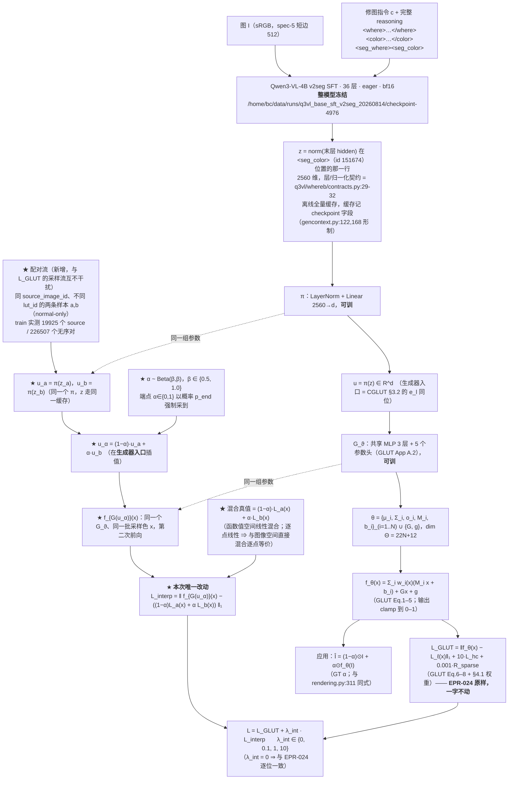

# 实验：插值一致性监督 —— 同图 LUT 对的条件线性插值对齐函数空间混合（EPR-026）

状态：提案（待 grill-me + 用户定稿）。

**结构基线 = EPR-024**（what 侧条件生成器基线臂，另一执行线在写）。本臂对 EPR-024 的
**唯一改动是在总损失里加一项** `λ_int · L_interp`；生成器结构、条件读出、监督空间、
优化器、步数、数据管线一律取 EPR-024 的定稿值，一处不动。`λ_int = 0` 时本臂与 EPR-024
逐位一致，这就是 §4 的第一行。

外部行号与论文原句以 2026-08-15 当日 `curl` 打开的 raw 文件 / arXiv HTML 全文为准
（清单见文末）。本仓库数据事实以当日 `jq` 直接数 splits 索引为准，命令与数字写在 §1「数据」。

---

## 跨臂冻结口径（EPR-024 ~ EPR-029 六份逐字一致；2026-08-15 主 agent 裁定）

> 本块在六份提案里**逐字相同**。正文任何一处与本块冲突，**以本块为准**。
> 表内实测数字均为本轮（2026-08-15）在只读挂载 / 工作区现场跑出，命令与出处逐条列在右列。

| 项 | 冻结值 | 依据 |
|---|---|---|
| **训练集** | `split == "train"` 且 `winner_confidence == "normal"`，**n = 93934**（style 51182 / local 42752） | 战役数据纪律「`winner_confidence=low` 不进主训与评测 GT」。本轮实测 `/mnt/nfs-ro/bc/data/datasets/sft2seg-20260804/splits/train.index.jsonl`：159215 = normal **93934** + low **65281** |
| **每步批组织** | **B = 32 样本 × Q = 256 色点 = 8192 色 / 步** | CGLUT 的**色** batch 8192 口径不变（GLUT App A.1 原句 "CGLUT is trained for 40 epochs with a batch size of 8192"），本块只固定 (B, Q) 拆分。裁定理由（形式事实）：同一步内每条 LUT 被采到的色点数从 128 变成 256（翻倍），同时一步内出现的不同 LUT 条数从 64 变成 32（减半）。`B=64 × Q=128` 降为 **EPR-024 的一条消融行**，其余五臂不再各出一次 |
| **步 / epoch** | `ceil(93934 / 32)` = **2936** | 算术（本轮 `python3` 复算） |
| **总步数** | 2936 × **40 epoch** = **117,440** | 40 epoch 照抄 GLUT App A.1；这是 U4 步数匹配的公共基准，六份全部行都对齐到它 |
| **GLUT 前向 clamp** | **双裁**；旗标 `--clamp {two,one}`，**默认 `two`**：全局分支 `Gx+g` 先单独 clamp（`glut_editor.html:574-579`），末端 `local + global` 整体再 clamp（`:606-610`） | 官方 demo 是**唯一可执行的官方参考实现**，且内嵌 **7 份训练好的 GLUT-32 权重**（`glut_editor.html:429` 的 `const EMBEDDED_MODELS`；本轮 JSON 解析：7 个模型，每个的 `cholesky_diag` 长度 = 32），实现可逐点对拍；论文 Eq.5 只写末端 clamp，**未排除**中间 clamp。「论文单裁」（`--clamp one`）降为**共用消融行**，只在 **EPR-024 §4** 出一次，其余五臂引用该行 |
| **`L_hc` 在 `C→0` 处** | `h = (a, b) / max(C, ε_C)`，**且**整项乘硬 mask `1[C ≥ ε_C]`，`ε_C = 1e-3`；被 mask 的点数每步落盘 `n_hc_masked` | GLUT Eq.7 未给保护，该处理属 **NOVEL 数值**。六份统一取本档。「不 mask、只加 ε」降为 **EPR-024 的一条消融行**（`--no-hc-mask`），其余五臂不再各出一次 |
| **headline 图像形成式** | **`Î_i = (1 − α_i) ⊙ I_i + α_i ⊙ f̂_i(I_i)`**，六份统一 | 判据 §B 逐字。跨臂配对 Δ 必须在**同一个量**上算；任何臂的其他形成式一律降为**诊断列**，并在列名旁写明与 headline 的差异 |
| **where 分支输出的消费口径** | 场来源统一为 where 臂的 **`m_pix`**；重采样算子统一为 `q3vl/where/upsample.py:54-62` 的 `area_resize`（下采 `mode="area"`、上采 `bilinear`），各臂采到自己载体需要的分辨率并把该分辨率写进 `run_config`、在 §E 表脚逐行印出。判据 §E 的三分层掩码**一律用 GT α 在短边 512 上算**，与场来源无关 | 三套口径（短边 512 / `m_low (gh,gw)` / 未指定）会让 §E 的四行在不同尺度上算、跨臂不可比。分层掩码固定在 GT α / 短边 512，保证 `E_in / E_band / E_out` 六份同尺 |
| **新建包落点** | 全部落在 **`q3vl/whatb/`**（镜像 where 侧 `q3vl/whereb/` 的「本周新建、可信」命名）。共同依赖——GLUT Eq.1-5 前向、CGLUT 生成器、CIELab / ΔE00、判据函数——**只写一份**，六臂共用；各臂自己的新模块放 `q3vl/whatb/<epr 名>/` 子包 | 避免出现两份并行的 GLUT 前向实现（口径必然漂移）。`q3vl/what2/` 这一命名作废 |
| **预注册判据键名** | `headline_normal_only`, `B0_identity`, `B1_libmean`, `B2_librandom`, `B3_bucket_retrieval`, `B4_oracle`, `N1_shuffle_delta`, `N1_shuffle_M`, `N2_irrelevant_delta`, `N2_irrelevant_M`, `N3_const_delta`, `N3_const_M` | 统一为 EPR-024 一套并补齐三负控制（原先四套写法）。键名不统一时，任一处拼写差异会让该列**静默缺席**而 `assert_criteria_ran` 仍然通过 |
| **`<seg_color>` 的 color span 编码** | 在本 EPR 的新命名空间里**自带一份实现**，**不 import `q3vl/what/` 的任何模块**；配启动断言（下方逐字） | `q3vl/whereb/readout.py:475-476` 的 `ReadoutBuilder.needs_color` 对 `("color_close", "im_end", "seg_where", "qtok")` 返回 True，`:478-487` 的 `color_ids_from_text` 在 **`:484`** 执行 `from q3vl.what.context import encode_color_span`。`q3vl/what/` 是本轮判定的污染源树，六份**一行未读、不 import** |

**`<seg_color>` 读出的启动断言（六份逐字一致）**：入口在建 dataloader **之前**，用本次基座
`checkpoint-4976` 的 tokenizer，对本 split 随机抽 **256** 条样本的 `color` 文本 `t` 逐条执行

```
ids_self = <本 EPR 自带的 color span 编码>(tok, t)     # 新命名空间，无 q3vl.what 导入
ids_ref  = tok(f"<color>{t}</color>", add_special_tokens=False).input_ids
assert len(ids_self) == len(ids_ref)                   # 先断长度
assert all(a == b for a, b in zip(ids_self, ids_ref))  # 再逐位断 token id
```

任一条不等即 `AssertionError`、拒绝开训；抽样条数与不等条数写进 `run_setup.json`。
该断言**只调用 tokenizer**，不 import 污染源树里的任何符号。

**B3 桶级检索基线（列名 `B3_bucket_retrieval`，六份逐字一致）**

- **定义**：对评测样本取其 **record 自带的 `minor`**，在 **train 里同 `minor` 桶的 lut_id 池**中
  **均匀随机取一条** `ℓ'`，预测 `f̂ = L_{ℓ'}`；R = 8 次重复，报 mean ± std，与 arm **同样本配对**。
- **不使用 `tools/data_splits/splits_presets.csv`**。本轮实测该 CSV：3522 条，`major` 由
  `minor.rsplit("_", 1)[0]` **机械**得来（**0 例外**）⇒ `"{major} / {minor}"` 只有 **77** 个不同字符串，
  单串最多被 **363** 个 lut_id 共用；且该 CSV 的 `major` 与 record 自带的 `major` 在抽样 800 条里
  **706 条不一致**。
- **定义依据（必须原样写进 RESULT 的方法节）**：**1-of-77 的桶只能给出桶判定，给不出 lut_id 的
  argmax**，所以本列**按定义是桶级下界，不是精确检索**；任何关于「检索这条路能到哪」的上界
  一律看 **B4 oracle**，不看 B3。
- **桶池实测（本轮遍历 `/mnt/nfs-ro/bc/data/datasets/sft2seg-20260804/records/shards/shard-00000.tar`
  的全部 162,359 条 record）**：record 自带 `major` **10** 类；train 的 `minor` **77** 类、
  `(major, minor)` **85** 对；record 的 `major == minor.rsplit("_",1)[0]` 只在
  **17,176 / 162,359** 条成立。train 的 77 个 minor 桶，lut_id 池大小 **min 1 / 中位 17 / max 285**，
  合计 **3149**。V_what normal-only 567 条的 `minor` **全部**被 train 桶覆盖，GT lut_id **全部**落在
  对应桶池内，桶内均匀取一条命中 GT lut_id 的期望比例 = **0.108**（61.38 / 567）；
  T_lut_unseen normal-only 252 条的 `minor` 也全部被覆盖，但 GT lut_id 落在 train 桶池内的条数
  **构造性为 0**（该 split 的 lut_id 与 train 交集为 0）。
- **另一个标签事实（写进方法节；三负控制会连带替换它）**：`instruction` 是英文句子里内嵌一个
  **中文风格名**（例：`"Please apply the 明亮活力彩 style across the photograph, …"`）。本轮抽
  train 前 6000 条：**6000/6000** 条含该中文风格名，抽样内 **1382** 个不同风格名，其中 **173** 个
  跨多个 `minor`。它与 record 的 77 个 `minor`、10 个 `major` 是**三套互不相同**的标签词表。

---

## 1. 任务

### 1.1 数据（数据集 / n / 切分，全部本轮实测）

统计口径：`/mnt/nfs-ro/bc/data/datasets/sft2seg-20260804/splits/*.index.jsonl`，
每行字段 `sample_id / source_image_id / lut_id / task_type / winner_confidence / split`。

```bash
cd /mnt/nfs-ro/bc/data/datasets/sft2seg-20260804/splits/
jq -s '{n: length,
        style:  ([.[]|select(.task_type=="style")]|length),
        local:  ([.[]|select(.task_type=="local")]|length),
        normal: ([.[]|select(.winner_confidence=="normal")]|length),
        low:    ([.[]|select(.winner_confidence=="low")]|length),
        uniq_lut:    ([.[]|.lut_id]|unique|length),
        uniq_source: ([.[]|.source_image_id]|unique|length)}' V_what.index.jsonl
```

| 集合 | n | style | local | normal | low | normal-only n | normal-only style / local | uniq lut_id | uniq source |
|---|---|---|---|---|---|---|---|---|---|
| **V_what**（唯一选型集） | 897 | 489 | 408 | 567 | 330 | **567** | 321 / 246 | 531 | 163 |
| T_final（终测，LUT 见过） | 918 | 494 | 424 | 533 | 385 | 533 | 317 / 216 | 577 | 201 |
| **T_lut_unseen**（终测，LUT-id 不相交） | 433 | 235 | 198 | 252 | 181 | **252** | 144 / 108 | 259 | 212 |
| train | 159215 | 83671 | 75544 | 93934 | 65281 | — | — | 3149 | 27104 |

本轮另核（命令同上，用 `comm -12` 对 `sort -u` 后的 lut_id / source_image_id 求交）：

- `train ∩ T_lut_unseen` 的 lut_id 交集 = **0**（train 3149 条、T_lut_unseen 259 条）。
- `V_what` 的 531 条 lut_id **全部**出现在 train（交集 531）；`V_what` 的 163 个
  source_image_id 与 train 的 27104 个交集 = **0**。即 V_what = **未见图 × 见过的 LUT**。
- preset 库总量 **3522**（`tools/data_splits/splits_presets.csv`，`tail -n +2 | wc -l`；
  按第 4 列计 train 3172 / val 175 / test 175；major 40 类 / minor 77 类）。

**本臂新增的配对统计**（`group_by(.source_image_id)` 后数组内 `unique` lut_id ≥ 2 的组）：

| 集合 | 分组口径 | 有 ≥2 条不同 lut_id 样本的 source 数 | 无序对总数 | 组内样本数 中位 / 最大 |
|---|---|---|---|---|
| train（全部） | 全量 | 24772 / 27104 | 554401 | 6 / 20 |
| **train（normal-only）** | 训练用 | **19925 / 22740** | **226507** | 4 / — |
| **V_what（normal-only）** | IP-A 评测用 | **120 / 138** | **1311** | 4 / 12 |
| T_lut_unseen（normal-only） | 附录列 | 67 / 157 | 137 | 1 / — |

切分纪律：V_what 是**唯一选型集**；T_final / T_lut_unseen 每个 arm 只跑一次；
`winner_confidence == "low"` 不进主训与评测 GT。

### 1.2 测试什么方法（通俗三段）

**第一段——现在的训练目标长什么样。** EPR-024 的监督全部落在「单条指令 → 单条 LUT」上：
一条样本给出一个条件向量 `z`，生成器把它变成一组 GLUT 参数 `θ`，再拿 `f_θ(x)` 去逼近那条
LUT 在采样色 `x` 上的真值 `L_ℓ(x)`。训练集里出现过的变换只有 3149 条离散 LUT，**两条 LUT
之间的那些变换从来没有被任何一项损失约束过**。

**第二段——参考工作在这件事上做过什么。** GLUT 论文附录 B.3 把「不加约束时混合会长成什么样」
量出来了：`C(7,2)=21` 对风格 × MIT5K 100 张图，α 走 `{0,.2,.4,.6,.8,1}`，真值取
**图像空间直接混合**；原文写明 *"no additional constraints were applied to optimize
blending during the training of all models; thus, these results reflect the inherent
blending capabilities of different LUT representations."* LUT 域里唯一一次**主动训练混合**
的先例在 NILUT 附录：*"Once the CNILUT is trained, we can further fine-tune it to perform
blending by yielding random condition vector weights (i.e. softmax weights) and the
corresponding blended outputs"*——只在 3 个风格上做过，量化结果是一个数（权重
`[0.33,0.33,0.33]` 下 PSNR 40.05dB），发布的 ckpt `nilutx3style.pt` 用的是**固定等权
basis**（notebook cell 5 markdown 原句：*"a blending basis that consists on the average of
the three sytles (i.e. each style * 0.333)"*；`dataloader.py:123` 硬编码
`np.array([0.33, 0.33, 0.33])`），**混合微调的训练脚本没有发布**（仓库里只有单 LUT 拟合的
`fit.py`）。半监督侧的同形制目标函数是 ICT 的 Eq.1：在两点的插值位置上，要求模型输出等于
两点输出的同系数插值，`λ ~ Beta(α,α)`。

**第三段——本实验做什么。** 在 EPR-024 的损失后面加一项：从训练集里取**同一张图、不同 LUT**
的两条样本 `a,b`，把它们各自的条件向量在**生成器入口**处线性插值成 `u_α`，要求
`f_{G(u_α)}(x)` 等于两端 LUT 在**函数值空间**的同系数混合 `(1−α)L_a(x) + α L_b(x)`。
`α` 从 `Beta(β,β)` 采。除了这一项损失，什么都不改。判据把插值质量（判据 §F 的 IP-A 四列
+ IP-B 六量）与拟合精度（headline / `E^grid` / `E^img`）**并排**出数字。

### 1.3 参考工作（当日逐条打开原始来源核实）

- **GLUT**，arXiv **2605.19889**（`https://arxiv.org/html/2605.19889v1`，当日打开全文）。
  - §3.1 Eq.1–5 前向；Eq.6 `L_rec = ‖ŷ − y‖₁`；Eq.7
    `L_hc = C·(1 − ⟨ĥ, h⟩)`（CIELab，`C = √(a²+b²)`，`h = (a/C, b/C)`）；Eq.8
    `R_sparse = −(1/N)Σ_i[o_i log(o_i+ε) + (1−o_i)log(1−o_i+ε)]`；
    原文 **Total loss**：`L_total = L_rec + λ_hc·L_hc + λ_sparse·R_sparse`。
  - §4.1 Implementation Details 原句：*"optimized using the Adam optimizer … cosine
    annealing learning rate schedule, starting from 1e−3 … GLUT is trained for 20 epochs
    with a batch size of 1024, while **CGLUT is trained for 40 epochs with a batch size of
    8192**. The loss weights are empirically set to **λ_hc = 10** and **λ_sparse = 0.001**."*
  - §3.2 Condition Embedding / LUT Blending 原句：`E ∈ R^{L×D}`，`e_l ∈ R^D`；
    **`e^α_{l1l2} = (1−α)·e_{l1} + α·e_{l2}`，`α ∈ [0,1]`，插值后的 embedding 喂进生成器**
    —— 这就是本臂 `u_α` 的同位物（差别只在 `e_l` 可训闭集 vs 本项目 `u = π(z)` 开放集，
    见 §1.5）。Shared Geometry 配置：`{μ_i, Σ_i}` 跨风格共享，只有 `o_i` 与色彩变换参数
    随条件生成。
  - App A.1 原句：*"we apply a lower learning rate (**0.1×** the base rate) to the style
    embeddings and shared geometry parameters, while the generator … uses the base learning
    rate of 1e−3. We set **ε = 1e−6** …"*；*"from **epoch 5 to 20**, the mining ratio of
    samples with the highest L1 errors is linearly increased from **10% to 40%**"*；
    *"We uniformly sample the full 8-bit RGB space to construct a **128³ training set,
    reserving the remaining colors for evaluation** to verify that the model learns a
    continuous representation."*
  - App A.2：共享 encoder = 3 层线性、128 隐（small 档 64）；各参数头 2 层，
    **局部色彩头 3 层**；全局仿射头输出 12；层间 ReLU。
  - **App B.3 Blending LUTs**（本臂的外部参照，逐字核）：*"we evaluate `C²₇ = 21` unique
    style pairs, with metrics averaged over **100 test images from the MIT-Adobe FiveK
    dataset**"*；*"**no additional constraints were applied to optimize blending during the
    training of all models**; thus, these results reflect the inherent blending capabilities
    of different LUT representations."* Figure 8 caption：对照真值是
    *"direct image-space blending (ground-truth)"*。**Table 7（α = 0 / .2 / .4 / .6 / .8 / 1）**：

    | 方法 | 指标 | 0 | 0.2 | 0.4 | 0.6 | 0.8 | 1 |
    |---|---|---|---|---|---|---|---|
    | CNILUT (128×3) | PSNR↑ | 39.97 | 26.80 | 23.37 | 23.99 | 27.71 | 40.27 |
    | CNILUT (256×3) | PSNR↑ | 44.30 | 29.02 | 26.06 | 25.92 | 29.31 | 44.17 |
    | ENNELUT (L₂) | PSNR↑ | 48.29 | 33.50 | 30.29 | 30.62 | 34.35 | 47.56 |
    | **CGLUT-32L (Full)** | PSNR↑ | **48.67** | 35.44 | **31.16** | 31.33 | 34.64 | **47.95** |
    | **CGLUT-32L (Shared Geo.)** | PSNR↑ | 47.36 | 38.46 | **34.67** | 34.47 | 37.60 | 46.18 |
    | CGLUT-32L (Full) | ΔE00↓ | 0.59 | 3.08 | 4.48 | 4.70 | 3.23 | 0.56 |
    | CGLUT-32L (Shared Geo.) | ΔE00↓ | 0.66 | 2.11 | 3.19 | 2.96 | 1.94 | 0.68 |
    | CGLUT-32L (Full) | ΔE76↓ | 0.79 | 4.03 | 5.86 | 6.03 | 4.06 | 0.73 |
    | CGLUT-32L (Shared Geo.) | ΔE76↓ | 0.86 | 2.62 | 3.93 | 3.69 | 2.46 | 0.87 |
    | CGLUT-32L (Full) | LPIPS↓ | 0.003 | 0.026 | 0.049 | 0.054 | 0.035 | 0.008 |
    | CGLUT-32L (Shared Geo.) | LPIPS↓ | 0.004 | 0.011 | 0.025 | 0.024 | 0.014 | 0.007 |

  - App B.4.1 Table 9（`#Gaussian → #Params`）：8→188 / 16→364 / 32→716 / 64→1420 /
    128→2828，即 `22N+12`；**格点只有 8/16/32/64/128**，`N = 48 ⇒ 22·48+12 = 1068` 是
    **算术外推**，不是论文里的行。

- **NILUT / CNILUT**，arXiv **2306.11920**（AAAI-24；`https://arxiv.org/html/2306.11920v3`
  当日打开全文）+ github `mv-lab/nilut`。
  - **Appendix A 原句（本臂的 LUT 域唯一先例）**：*"For training the conditional NILUT we
    use three/five different 3D LUTs, at each step we feed the three/five condition vector
    and RGB map into the network and accumulate the three/five different loss terms (one for
    each learned LUT). … Once the CNILUT is trained, **we can further fine-tune it to perform
    blending by yielding random condition vector weights (i.e. softmax weights) and the
    corresponding blended outputs**; these represent plausible convex combinations of the
    three basis 3D LUTs."* 同节：*"trained using fixed learning rate **1e−3** and **Adam**
    optimizer until convergence (e.g. **5000 steps**, ~4 minutes)"*；训练用
    `2048×1024×3` 的 reduced map（`128³` 个值）。
  - §4.1 **Blending Styles** 原句（该论文关于混合的**全部**量化结果）：*"We analyze the
    output of blending the test images with weights `[0.33,0.33,0.33]`, and compare with the
    linear interpolation of the real processed 2D RGB images, the **PSNR is 40.05dB**"*。
  - `dataloader.py:76` `class EvalMultiLUTBlending`，docstring **:79** 原句：
    *"The order of the target images must be: ground-truth 3D LUT outputs (the first
    `<nluts>` elements in the list), following by gt blending results."*；
    **:118–123** 的条件向量构造 —— `idx < nluts` 时 one-hot，否则
    **`style_vector = np.array([0.33, 0.33, 0.33])`（硬编码等权，不是随机 softmax）**。
  - `nilut-multiblend.ipynb` **cell 5（markdown）** 原句：*"We load a simple model
    `nilutx3style.pt` with 3 styles and a simple blending basis (interpolation of the 3
    styles with equal weights). The model was trained during a few minutes on three different
    3D LUTs and **a blending basis that consists on the average of the three sytles (i.e.
    each style * 0.333)**."* —— **与附录写的「随机 softmax 权重」口径不同，本提案两处都照录**。
  - `fit.py`：仓库内**唯一**的训练脚本，是**单 LUT 拟合**（无 style、无 blending）；
    **:78** `loss = torch.mean(torch.abs(model_output - ground_truth))  # more stable than L2`；
    **:152** `torch.optim.Adam(lr=1e-3, ...)`。仓库根目录清单（GitHub API `git/trees/main`
    当日拉取）：`dataloader.py / fit.py / hald.py / models/archs.py / models/nilutx3style.pt /
    nilut.ipynb / nilut-multiblend.ipynb / utils.py` —— **无 CNILUT 训练脚本、无混合微调脚本**。

- **ICT（Interpolation Consistency Training）**，arXiv **1903.03825**
  （abs 页当日打开；正文经 `r.jina.ai` 取 v1 PDF 文本核对）。
  - `Mix_λ(a, b) = λ·a + (1 − λ)·b`。
  - 总目标：`L = L_S + w(t)·L_US`，`w(t)` 是 ramp 函数。
  - **Eq.1 原式**：
    `L_US = E_{u_j,u_k ~ P(X)} E_{λ ~ Beta(α,α)} ℓ( f_θ(Mix_λ(u_j, u_k)), Mix_λ(f_θ'(u_j), f_θ'(u_k)) )`，
    其中 `θ'` 是 `θ` 的滑动平均（mean-teacher）。
  - 常数（§3.3 原句）：consistency coefficient `w(t)` **从 0 ramp 到最大值，在总 epoch 数的
    1/4 处到顶**，用 Tarvainen & Valpola 的 sigmoid schedule；一致性项用 **MSE**；
    mean-teacher **decay = 0.999**；超参搜索格点 —— 最大 consistency coefficient
    `{1.0, 10.0, 20.0, 50.0, 100.0}`，`Beta(α,α)` 的 `α` **`{0.1, 0.2, 0.5, 1.0}`**；
    CIFAR-10 1000/2000/4000 标签下选中的 `α` 分别是 0.2 / 1.0 / 1.0，SVHN 全部是 0.1。

- **ACAI**（备选行 (a)），arXiv **1807.07543** + github `brain-research/acai`。
  - 论文 §2 原句：*"In order to resolve the ambiguity between predicting `α` and `1−α`,
    we constrain `α` to the range `[0, 0.5]` when feeding `x̂_α` to the critic. In contrast,
    the autoencoder is trained to fool the critic to think that `α` is always zero."*
  - **Eq.1**：`L_d = ‖d_ω(x̂_α) − α‖² + ‖d_ω(γx + (1−γ)g_φ(f_θ(x)))‖²`；
    **Eq.2**：`L_{f,g} = ‖x − g_φ(f_θ(x))‖² + λ‖d_ω(x̂_α)‖²`；
    `x̂_α = g_φ(α f_θ(x_1) + (1−α) f_θ(x_2))`。
  - 论文原句：*"For the regularization coefficients `λ` and `γ` we found values of **0.5**
    and **0.2** to achieve good results, though the performance was not very sensitive to
    these hyperparameters."*
  - `acai.py`：**:62–63** `alpha = tf.random_uniform(...,0,1)` → `alpha = 0.5 - tf.abs(alpha - 0.5)`
    （注释 `# Make interval [0, 0.5]`）；**:64** `encode_mix = alpha*encode + (1-alpha)*encode[::-1]`；
    **:67–68** `loss_disc = mean((disc(decode_mix) - alpha)²)`；
    **:69** `loss_disc_real = mean(disc(ae + reg*(x - ae))²)`；
    **:70** `loss_ae_disc = mean(disc(decode_mix)²)`；
    **:89** `train_ae` 最小化 `loss_ae + advweight*loss_ae_disc`；
    **:151** `advweight` 默认 **0.5**；**:153** `reg` 默认 **0.2**。

- **Smooth Diffusion**（备选行 (b)），arXiv **2312.04410**（abs 页当日打开，标题
  *"Smooth Diffusion: Crafting Smooth Latent Spaces in Diffusion Models"*）+ github
  `SHI-Labs/Smooth-Diffusion`。
  - `train_smooth_diffusion.py:306` `def step_regularize(fake_img, latents,
    mean_reg_variation, sqrt_one_minus_alpha_prod, **decay=0.01**)`；
    **:313–315** `grad, = autograd.grad(outputs=(fake_img*noise).sum(), inputs=latents,
    create_graph=True)`；**:317** `reg_variations = sqrt(grad.pow(2).sum(3).sum(2).sum(1))`；
    **:319** `variation_mean = mean_reg_variation + decay*(reg_variations.mean() -
    mean_reg_variation)`（**EMA，不是压到 0**）；**:321**
    `variation_penalty = (reg_variations - variation_mean).pow(2).mean()`。
  - **:221** `--lambda_reg` 默认 **1.0**；**:742** `loss_total = loss + args.lambda_reg *
    reg_loss`；`train.sh` 实跑值 `--lambda_reg 1`。

### 1.4 解决什么问题（只陈述已核实事实）

- 本项目 train 侧只有 **3149 条**离散 lut_id（本轮实测）；`T_lut_unseen` 的 259 条与之
  **交集 0**。目标变换空间是连续的：数据生成律
  `F*(x,p) = (1−α(p))·x + α(p)·L_ℓ(x)`（`dataset_build/src/construct/rendering.py:301-313`，
  `mask is None → output = edited`；否则 `mixed = before*(1−alpha) + edited*alpha`，
  且 `alpha == 0 → before`、`alpha == 1 → edited`；`edited` 由
  `_apply_lut`（`rendering.py:390-405`，`grid_sample` 三线性、`axis_order = "bgr"`）产出）
  本身就是以 `{id, L_ℓ}` 为端点的线段上的取点。
- GLUT App B.3 明写训练时**不加任何混合约束**，Table 7 的数字是「表示本身的固有行为」。
- LUT 域里唯一一次对混合加监督的先例（NILUT 附录）：3 个风格、量化结果 1 个数（40.05dB）、
  发布 ckpt 用固定等权 basis、训练脚本未发布。
- 本臂把该形制扩到 **3149 条 LUT 的条件对**上（train normal-only 19925 个 source /
  226507 个无序对，本轮实测），并按判据 §F 出量化插值列。

### 1.5 与 CGLUT 的形式差别（必须随任何提案出现）

CGLUT 的条件是 `e_l = E[l]`，`E ∈ R^{L×64}` **可训**、`l` 取自**闭集** `{1..L}`，
`L ∈ {7, 75, 225}`；本项目的条件 `φ(c, I) = π(z_color(c, I))` 由**冻结**网络给出、
条件源不可训、**开放集**、且**同时依赖图像**。CGLUT 全文无 held-out 风格实验
（其 held-out 是**颜色**：App A.1 的 128³ 训练 / 其余颜色评测）。

---

## 2. 模型

### 2.1 模型图（★ = 本次唯一改动；灰底 = 冻结）



### 2.2 伪代码（一步训练）

```python
# 冻结：整个 Qwen3-VL（z 走离线缓存，训练期不前向 VLM）
# 可训：π（LayerNorm+Linear 2560→d）、G_ϑ（共享 MLP 3 层 + 5 个参数头）
#       —— 与 EPR-024 完全相同的两组参数，本臂不增不减任何模块

def train_step(batch_fit, batch_pair, x_colors, w):
    # ---- 1) 拟合项：EPR-024 原样 ----------------------------------------
    u   = pi(batch_fit.z)                      # (B, d)
    th  = G(u)                                 # (B, 22N+12)
    y   = glut_forward(th, x_colors)           # (B, |X|, 3)
    L_glut = l1(y, batch_fit.lut_gt) \
           + w.hc     * hue_chroma(y, batch_fit.lut_gt) \
           + w.sparse * opacity_entropy(th)    # GLUT Eq.6/7/8, λ=10 / 0.001

    # ---- 2) ★ 插值项：本次唯一新增 --------------------------------------
    a, b = batch_pair.a, batch_pair.b          # 同 source_image_id、不同 lut_id
    alpha = sample_alpha(P)                    # (P, 1)  Beta(beta,beta) + p_end 端点原子
    u_mix = (1 - alpha) * pi(a.z) + alpha * pi(b.z)          # 生成器入口插值
    y_mix = glut_forward(G(u_mix), x_colors)                 # 同一批采样色 x
    with torch.no_grad():                                     # 真值是常量
        gt_mix = (1 - alpha) * a.lut_gt + alpha * b.lut_gt    # 函数值空间线性混合
    L_interp = l1(y_mix, gt_mix)

    # ---- 3) 总损失 -------------------------------------------------------
    loss = L_glut + w.interp * L_interp        # w.interp = λ_int
    log_step({"L_glut": ..., "L_interp": float(L_interp), "alpha_mean": ...})
    return loss
```

`x_colors` **与拟合项共用同一批采样色**（GLUT App A.1 的 128³ 训练色集）。这一条是硬约束：
若插值项在训练色集之外取色，GLUT App A.1 的「未见颜色」评测列即失效。

`a.lut_gt` / `b.lut_gt` = 两条 LUT 在同一批 `x_colors` 上的三线性求值结果
（口径同 `rendering.py:390-405`，`axis_order = "bgr"`），可与 `z` 一同离线缓存。

### 2.3 冻结 / 可训清单

| 组件 | 状态 | 依据 |
|---|---|---|
| Qwen3-VL-4B v2seg SFT 全部（视觉塔 + 语言塔 + embedding） | **冻结** | 本战役共同约束；`z` 离线缓存后训练期不前向 VLM |
| `π`（LayerNorm + Linear 2560→d） | 可训 | EPR-024 原样，本臂不改形状、不改初始化 |
| `G_ϑ`（共享 MLP + 5 个参数头） | 可训 | EPR-024 原样（结构照 GLUT App A.2） |
| 共享几何参数（若 EPR-024 取 Shared Geometry 档） | 可训，**0.1× lr** | GLUT App A.1 原句 |
| 新增可训参数 | **0 个** | 本臂只加一项损失，不加任何模块 |

**新增显存**：每步多一次 `G` 前向 + 一次 GLUT 求值（P 个混合条件 × `|X|` 个采样色）。
按 CGLUT 的 batch 8192 色档，P 与拟合 batch 同量级时激活增量与拟合项同量级，
落在「已占 + 新任务峰值 < 65GB」的共存规则内（实测值随 EPR-024 定稿的 `N`/`d` 补）。

---

## 3. 数学公式、优化器与接入

### 3.1 损失函数

记 `X` = 本步采样色集合（= 拟合项同一批），`u = π(z)`，`θ = G_ϑ(u)`，
`f_θ` 为 GLUT 前向（Eq.1–5）。

**拟合项（EPR-024 原样，照抄 GLUT Eq.6–8 + §4.1 权重，本臂一字不改）**：

```
L_rec    = ‖ f_θ(x) − L_ℓ(x) ‖₁                                        (GLUT Eq.6)
L_hc     = C · (1 − ⟨ĥ, h⟩)        # CIELab, C=√(a²+b²), h=(a/C, b/C)   (GLUT Eq.7)
R_sparse = −(1/N) Σ_i [ o_i log(o_i+ε) + (1−o_i) log(1−o_i+ε) ]        (GLUT Eq.8)
L_GLUT   = L_rec + 10 · L_hc + 0.001 · R_sparse                        (GLUT §4.1)
```

**★ 插值项（本次唯一新增）**：

```
u_α       = (1−α) · u_a + α · u_b ,     α ~ Beta(β,β)  （端点以 p_end 概率强制）
L_interp  = E_{(a,b), α, x∈X}  ‖ f_{G_ϑ(u_α)}(x) − ( (1−α)·L_a(x) + α·L_b(x) ) ‖₁
```

**总损失**：

```
L = L_GLUT + λ_int · L_interp ,        λ_int ∈ {0, 0.1, 1, 10}
```

| 项 | 值 | 出处 |
|---|---|---|
| `λ_hc` | **10** | GLUT §4.1 原文 |
| `λ_sparse` | **0.001** | GLUT §4.1 原文 |
| `ε`（Eq.2 / Eq.8） | **1e−6** | GLUT App A.1 原文 |
| 插值项的距离 | **L1** | 与 GLUT Eq.6 的 `ℓ1` 同族；NILUT `fit.py:78` 同选（原注释 *"more stable than L2"*）。ICT Eq.1 用的 `ℓ` 是 MSE ⇒ 进消融行 ④ |
| 插值真值 | **函数值空间线性混合** `(1−α)L_a + αL_b` | NILUT 附录 *"the corresponding blended outputs"*；GLUT App B.3 的 GT = *"direct image-space blending"*，逐点线性 ⇒ 两者逐点等价 |
| 插值位置 | **生成器入口**（`u_α = (1−α)u_a + αu_b`） | CGLUT §3.2 `e^α_{l1l2} = (1−α)e_{l1} + αe_{l2}` 喂进生成器；`π` 含 LayerNorm 是非线性，「先插值再 π」与「先 π 再插值」不等价 ⇒ 前者进消融行 ⑤ |
| `β`（`Beta(β,β)`） | **{0.5, 1.0}** | ICT §3.3 的搜索格点 `{0.1, 0.2, 0.5, 1.0}` 的子集；`β = 1.0` 即 `U(0,1)` |
| `p_end`（端点原子概率） | **1/3**，**NOVEL** | 无原文可抄。理由：GLUT App B.3 的评测 α 格点 6 个里有 2 个端点，取同比例。ICT Eq.1 / NILUT 附录**都不强制端点** ⇒ `p_end = 0` 进消融行 ③ |
| `λ_int` 扫描格点 | **{0, 0.1, 1, 10}**，**NOVEL** | ICT 的 `w(t)` 最大值搜索格点是 `{1,10,20,50,100}`，但其 `L_S` 是 CE、一致性是 MSE，单位不可比；本臂 `L_GLUT` 与 `L_interp` 都是 `[0,1]³` 上的 L1，`λ_int = 1` 即等权。Smooth Diffusion 的 `λ_reg` 默认与实跑值都是 **1**（`:221` / `train.sh`） |
| ramp 权重 `w(t)` | **不用**（`λ_int` 全程常数） | ICT §3.3 用 sigmoid ramp（1/4 总 epoch 到顶）；NILUT 附录是**训完再微调**的两阶段、无 ramp。两者不同 ⇒ 都进消融行（⑥ ramp / ⑦ 两阶段），主臂取「常数权重、联合训」这一最简形式，**NOVEL 选择** |
| mean-teacher | **不用**（真值取 GT LUT 混合） | ICT Eq.1 的目标是 `Mix_λ(f_θ'(u_j), f_θ'(u_k))`（EMA 伪标签）；本项目在两端**有真值**（`L_a`、`L_b` 是数据集里的 `.cube`），故主臂取 NILUT 附录的**有监督**口径。ICT 原式（`θ'` EMA，decay **0.999**，MSE）进消融行 ⑧ |

### 3.2 配对采样与 α 采样（协议写死）

```
候选池 = train 索引里 winner_confidence == "normal" 的行，按 source_image_id 分组，
         保留「组内至少 2 个不同 lut_id」的组
         → 19925 个 source / 226507 个无序对（本轮 jq 实测；含 low 时 24772 / 554401）

每步：均匀采 P 个 source（有放回）→ 每个 source 内均匀采一个无序对 (a, b)
      α_p ~ Beta(β, β)；以概率 p_end 改为从 {0, 1} 等概率取
      配对流的样本 **不进** L_GLUT；L_GLUT 的采样流保持 EPR-024 原样不动
```

这条设计使 `λ_int = 0` 时 `L_GLUT` 的样本分布与 EPR-024 逐位一致——「唯一改动是加一项损失」
在采样层面也成立。

`P`（每步配对数）**NOVEL**，无原文可抄；保守默认 `P = 拟合流的样本数`（一比一），
写进 `run_config`，进 NOTES 待拍板。

### 3.3 优化器参数（取 EPR-024 定稿值 = GLUT/CGLUT 原文；本臂一个字都不改）

| 项 | 值 | 出处 |
|---|---|---|
| 优化器 | **Adam** | GLUT §4.1 原文 |
| 学习率 | **1e−3**，**cosine annealing** 覆盖整个训练 | GLUT §4.1 原文 |
| 低学习率组 | style embedding 与 shared geometry 参数 **0.1×** base | GLUT App A.1 原文 |
| epoch / batch（CGLUT 档） | **40 epoch / 色 batch 8192 = B 32 样本 × Q 256 色点** | GLUT §4.1 原文 + 跨臂冻结口径块的 (B,Q) 拆分 |
| 训练集 | `train` 且 `winner_confidence == "normal"`，**n = 93934** | 跨臂冻结口径块；`low` 的 65281 条不进主训与评测 GT |
| 硬样本挖掘 | epoch **5→20**，比例 **10%→40%** 线性上升 | GLUT App A.1 原文 |
| `L_hc` 在 `C→0` 处 | `h=(a,b)/max(C,1e-3)` 且整项乘硬 mask `1[C ≥ 1e-3]`，落盘 `n_hc_masked` | 跨臂冻结口径块（六份统一；「不 mask、只加 ε」是 EPR-024 的六臂共用消融行） |
| GLUT 前向 clamp | **双裁**，`--clamp two`（默认） | 跨臂冻结口径块；「论文单裁」是 EPR-024 §4 的六臂共用消融行 |
| `ε` | **1e−6** | GLUT App A.1 原文 |
| 训练采样色 | 8-bit RGB 均匀采 **128³**，其余颜色留评测 | GLUT App A.1 原文 |
| 步数 | **`ceil(93934/32) = 2936` 步/epoch × 40 epoch = 117,440 步**（与 EPR-024 逐位一致，U4） | 跨臂冻结口径块的公共基准 |
| checkpoint 选择 | **quick-eval 硬门 + headline 选优，禁 val loss** | 本战役硬纪律 |
| seed / 精度 | 取 EPR-024 定稿值 | — |

### 3.4 接入表（逐条可确认；本臂是新建实现，只写「需要什么」）

| 项 | 内容 |
|---|---|
| **改哪里** | ① **配对索引（新增数据侧产物）**：一张 `source_image_id → [(sample_id, lut_id)]` 的表，只收 `split == "train"` 且 `winner_confidence == "normal"` 且组内 ≥2 个不同 `lut_id` 的组（19925 组）。落盘一次，随 `run_setup.json` 记 sha256。② **条件缓存复用**：`z_a` / `z_b` 直接读 `<seg_color>` 的离线缓存，**不新增 VLM 前向**；缓存 schema 必须带 `checkpoint` 字段并在启动时断言与本次基座路径一致（形制照 `q3vl/whereb/gencontext.py:122, 168`）。③ **LUT 真值缓存**：`L_ℓ(x)` 在训练色集 `X` 上的求值结果按 `lut_id` 缓存（三线性求值口径同 `dataset_build/src/construct/rendering.py:390-405`，`axis_order = "bgr"`）；插值真值 `(1−α)L_a + αL_b` 在 `no_grad` 下现算。④ **新增一项损失**：`L_interp`（§3.1 式），权重字段 `interp: float = 0.0`；**`interp == 0` 时整条配对流短路不构造**，与 EPR-024 逐位一致。⑤ **新增 per-step 统计**：`L_interp`、`alpha_mean`、`n_pairs`，写进 `steps.jsonl`。⑥ **新增评测列**：判据 §F 的 IP-A 四列与 IP-B 六量 + `d_lib(α)` + 越界率 + 退化权重率，board key 前缀 `interp_*`。⑦ **读出接缝**：需要一个 `seg_color` 读出档 —— 现有 `q3vl/whereb/readout.py:90-92` 的 `READOUT_KINDS` 是 `("seg_where","where_span_pool","where_close","color_close","im_end","qtok")`，**不含 `seg_color`**；本臂需要的是「reply = where span + color span + `<seg_where>` + `<seg_color>`，读最后一行」，token id 151674 已在 `readout.py:107` 的 `KNOWN_IDS` 与 `q3vl/train/constants.py:23` 里。该档的 `expected_ids` 断言（`verify_plan`，`readout.py:365`）必须一并接上。**color span 编码自带一份**：`ReadoutBuilder.needs_color`（`readout.py:475-476`）走的 `color_ids_from_text`（`:478-487`）在 **`:484`** `from q3vl.what.context import encode_color_span`；`q3vl/what/` 是污染源树，本臂**一行未读、不 import**，改在 `q3vl/whatb/colorspan.py` 自带一份实现，配启动断言（逐字见跨臂冻结口径块：tokenizer 直接对拍、先断长度再逐位断 token id、256 条抽样）。⑧ **落点**：本臂新代码落 `q3vl/whatb/epr026/`，GLUT 前向 / CGLUT 生成器 / ΔE00 / 判据函数一律 import `q3vl/whatb/` 的公共实现，不另写（跨臂冻结口径块）。 |
| **不变（明确列出没动的部分）** | `π` 与 `G_ϑ` 的结构、维度 `d`、高斯个数 `N`、参数分组档（D4：Full / Shared Geometry / 仿射-only / 只全局）、监督空间（函数值空间）、`L_GLUT` 三项及其权重（1 / 10 / 0.001）、优化器与调度、训练色集 `128³`、硬样本挖掘曲线、batch、步数、seed、精度、checkpoint 选择规则、数据管线与切分、三负控制的构造、评测器的每一列——**全部取 EPR-024 定稿值，一处不动**。 |
| **初始化 / step0 等价性** | 本臂不新增任何参数，`π` / `G_ϑ` 的初始化与 EPR-024 逐位相同。`λ_int = 0` 时 forward、loss、梯度、采样流**全部逐位等价**；`λ_int > 0` 时 step0 的 `L_GLUT` 值与 EPR-024 逐位相同（配对流不进 `L_GLUT`），差别只在总 loss 多出一项。 |
| **入口旗标（关掉 = EPR-024 逐位一致）** | `--interp-weight`（`λ_int`，默认 **0.0** = 关；扫描 `{0, 0.1, 1, 10}`）<br>`--interp-alpha {beta0.5, uniform, endpoints}`（默认 `beta0.5`；`uniform` = `Beta(1,1)`；`endpoints` = 只采 `{0,1}`）<br>`--interp-p-end`（默认 **1/3**；消融取 0）<br>`--interp-where {post_pi, pre_pi}`（默认 `post_pi` = 生成器入口插值；`pre_pi` = 在 2560 维 `z` 上插值再过 `π`）<br>`--interp-dist {l1, mse}`（默认 `l1`；`mse` = ICT Eq.1 的 `ℓ`）<br>`--interp-target {gt_mix, ema_teacher}`（默认 `gt_mix` = NILUT 附录口径；`ema_teacher` = ICT Eq.1 原式，附 `--interp-ema-decay` 默认 **0.999**）<br>`--interp-ramp {const, sigmoid}`（默认 `const`；`sigmoid` = ICT 的 1/4 总 epoch 到顶）<br>`--interp-stage {joint, finetune}`（默认 `joint`；`finetune` = NILUT 附录的两阶段）<br>`--interp-pairs-per-step`（`P`，默认 = 拟合流样本数）<br>`--interp-hc`（默认 **off**；on = 插值项也加 `10·L_hc`）<br>备选行（互斥，不与主项同时上）：`--interp-acai`（附 `--acai-lambda` 默认 **0.5**、`--acai-gamma` 默认 **0.2**、critic 输入 α 限 `[0,0.5]`）／`--interp-jacobian`（附 `--jac-decay` 默认 **0.01**、`--jac-lambda` 默认 **1.0**）<br>全部旗标写进 `run_setup.json` / `loss_preregistration.json`，源码 sha256 冻结。 |
| **运行时断言** | (i) **首个 micro-batch** 落盘的 `steps.jsonl` 第一行必须同时含 `L_glut` 与 **`L_interp`** 两个键，缺任一 → `AssertionError`，拒绝开训（`λ_int = 0` 的基线行例外，该行必须**不含** `L_interp` 键，两侧都断言）。(ii) 评测器 `assert_criteria_ran` 的 `required` 表 = **六份公共表**（`headline_normal_only`, `B0_identity`, `B1_libmean`, `B2_librandom`, `B3_bucket_retrieval`, `B4_oracle`, `N1_shuffle_delta`, `N1_shuffle_M`, `N2_irrelevant_delta`, `N2_irrelevant_M`, `N3_const_delta`, `N3_const_M`；键名逐字见跨臂冻结口径块）**加**本臂追加的 `{interp_grid, path_len, mono_rate, oob_rate}`（形制照 `q3vl/whereb/amort/evaluate.py:335`），任一键缺失或 `n = 0` → **拒绝出板**。(iii) 三个负控制的 reasoning 重生成缓存必须记 `checkpoint` 字段并在启动时断言与本次基座一致。(iv) 插值路径的定义在训练与评测两侧必须同源：`--interp-where` 的值写进 board，评测器读该值构造 `f^cond_α`，不一致即拒绝出板。 |

### 3.5 判据（预注册，逐字；本 EPR 一列不改）

> 以下整节为本战役 what 侧预注册判据，逐字写入，不作删改。

#### A. 评测集与 n（全部本轮从 `/mnt/nfs-ro/bc/data/datasets/sft2seg-20260804/splits/*.index.jsonl` 实测）

| 集合 | n | style(全局) | local | normal | low | normal-only n | normal-only style / local | uniq lut_id | uniq source |
|---|---|---|---|---|---|---|---|---|---|
| **V_what**（唯一选型集） | 897 | 489 | 408 | 567 | 330 | **567** | 321 / 246 | 531 | 163 |
| T_final（终测，LUT 见过） | 918 | 494 | 424 | 533 | 385 | 533 | 317 / 216 | 577 | 201 |
| **T_lut_unseen**（终测，LUT-id 不相交） | 433 | 235 | 198 | 252 | 181 | **252** | 144 / 108 | 259 | 212 |
| train | 159215 | 83671 | 75544 | 93934 | 65281 | — | — | 3149 | 27104 |

- `train ∩ T_lut_unseen` 的 lut_id 交集 = **0**（本轮核）。preset 库总量 3522（`tools/data_splits/splits_presets.csv`，train 3172/val 175/test 175，40 major / 77 minor）。
- 同图配对差分的可用样本：V_what normal-only 有 138 个 source，其中 **120 个 source ≥2 个样本**（最多 12、中位 4）；T_lut_unseen normal-only 只有 67 个 source ≥2 个样本（中位 1）——**T_lut_unseen 上不做同图配对差分，只做同图负控制**。
- 选型只允许用 V_what；T_final / T_lut_unseen 每个 arm 只跑一次。

#### B. Headline 定义（单一标量，供 checkpoint 选优；禁 val loss）

对样本 $i$：$\hat I_i=(1-\alpha_i)\odot I_i+\alpha_i\odot \hat f_i(I_i)$，$I_i^\ast=(1-\alpha_i)\odot I_i+\alpha_i\odot L_i(I_i)$（后者 = 数据集存的目标，`rendering.py:311`）。
$$E_i=\frac{1}{|\Omega|}\sum_{p}\Delta E_{00}\big(\hat I_i(p),\,I_i^\ast(p)\big),\qquad
\textbf{H}=\frac{1}{|S|}\sum_{i\in S}E_i,\quad S=\text{V\_what}\cap\{\text{normal}\}$$
落盘键：`.contexts.style.headline_normal_only` / `.contexts.local.headline_normal_only` / `.contexts.all.headline_normal_only`；**选优只读 `.contexts.all.headline_normal_only`，禁用顶层 pooled**（混 low 少算约 0.031，CLAUDE.md）。
`α` 的口径：headline 用 **GT α**（隔离 what 侧）；预测 α 单列 `.contexts.*.headline_predalpha`。分辨率固定（短边 512，area_resize），写进 run_config。

**函数值空间并排列（不参与选优，必出）**
$$\mathcal{E}^{\text{grid}}_i=\frac{1}{17^3}\sum_{x\in\mathcal{X}_{\text{grid}}}\Delta E_{00}\big(\hat f_i(x),L_i(x)\big),\qquad
\mathcal{E}^{\text{img}}_i=\sum_{c}h^{(i)}_c\,\Delta E_{00}\big(\hat f_i(c),L_i(c)\big)$$
$\mathcal{X}_{\text{grid}}$=17³ 均匀 sRGB 网格；$h^{(i)}$=$I_i$ 的 5-bit/通道量化直方图（取前 4096 色）。两列尺度差别很大（实测：GT LUT 相对 identity 在 17³ 网格上 mean $\Delta E_{76}$=40.3、p10=21.3、p90=61.1），**任何单列都不足以定档**。
另设 GLUT 原生的**未见颜色**列：训练采 128³ 均匀色，评测在其补集上算（GLUT App A.1）。

#### C. 平凡基线列（每条与 arm **同样本配对**，报 $\Delta$ + 95% bootstrap CI + Wilcoxon p；缺一不出板）

| 列 | 定义 | 本轮实测地板（协议见下） |
|---|---|---|
| **B0 identity** | $\hat f=\mathrm{id}$ ⇒ $\hat I=I$ | 259 条 unseen LUT 上 mean $\Delta E_{76}$ = **32.79**（p50 31.24） |
| **B1 训练集平均变换** | $\bar L(x)=\frac{1}{|\text{Lib}_{tr}|}\sum_\ell L_\ell(x)$（逐点均值仍是合法映射） | mean **25.33**（p50 23.54） |
| **B2 库内随机** | $\ell'\sim U(\text{Lib}_{tr})$，R=8 次取均值 ± std | mean **35.37** |
| **B3 最近邻检索** | (a) 纯文本：指令 embedding vs LUT `major/minor` 标签文本；(b) 同投影 $\pi$ 的 image+text embedding | 未测（须在提案里定死检索器） |
| **B4 oracle 库内最优** | $\ell^\ast=\arg\min_\ell D_{\mathcal{X}}(L_\ell,L_i)$，$\ell$ 遍历 $\text{Lib}_{tr}$ | mean **9.93**（p10 4.18 / p50 9.59 / p90 15.66 / max 41.42）= **任何检索式方案的天花板** |
| **B5 分解诊断** | (GT LUT, 预测 α) 与 (预测 LUT, GT α) 两行 | — |
| **B6 库内自身填充密度** | train LUT → 最近的另一条 train LUT | mean **10.17**（p50 10.01 / p90 16.88） |

> **实测协议（必须原样写进 RESULT 的方法节）**：9³ 均匀 sRGB 网格；每色转 CIELab（D65，sRGB EOTF）后取 L2（**$\Delta E_{76}$，非 $\Delta E_{00}$**）再对色求均值；$\text{Lib}_{tr}$ = 从 train index 随机采 2500 行得到的 **1137 个 lut_id**（非全部 3149），$T_{\text{lut\_unseen}}$ = 全部 259 个；单次运行，无方差。库几何：1137 条 LUT 在该 2187 维空间做 PCA，累计方差 90%/95%/99% 需 **15/28/99** 维。
>
> B4 与 B0/B1/B2 的量级差是本判据集的核心刻度：任何「生成优于检索」的主张必须出示 arm 相对 **B4** 的配对 Δ，而不是相对 B0/B2。

**失效模式**：B0 在 α 质量小的 local 样本上很强（必须按 $\bar\alpha=\text{mean}(\alpha)$ 分层报，分层 n 一并给）；B1 是一条与指令完全无关的固定曲线，CSRNet 的 20.47 vs 23.69 说明这条地板可以很高；B2 的 std 必须报（单次抽样噪声大）；B4 在 T_lut_unseen 上严格 >0，其值本身就是「3149 条离散 LUT 覆盖连续空间到什么程度」的答案。

#### D. 指令条件性三负控制（同图配对差分）

对每个样本构造三个扰动条件，**扰动后必须重新生成 reasoning 再读出 `<seg_color>`**（teacher-forced 原 reasoning 会让控制失效）：

| 控制 | 构造 | 输出两列 |
|---|---|---|
| N1 shuffle | 同 split 内换一条**同 task_type、不同 lut_id** 的指令 | $\Delta_{\text{shuffle}}=\mathbf{H}(\text{ctrl})-\mathbf{H}(\text{true})$；$M_{\text{shuffle}}=\mathbb{E}_i D_{\mathcal{X}_{\text{grid}}}(\hat f_i^{\text{true}},\hat f_i^{\text{ctrl}})$ |
| N2 无关词 | 换成等长的非色彩英文句（图像 caption） | $\Delta_{\text{irrel}}$、$M_{\text{irrel}}$ |
| N3 固定短语 | 全体用同一句 `Please edit this photo.` | $\Delta_{\text{const}}$、$M_{\text{const}}$ |

两列缺一不可：只报 $\Delta$ 会被「无视指令」的模型（$\Delta\approx0$ 但 $M\approx0$）与「乱动」的模型同时污染；只报 $M$ 会被参数噪声刷高（T2ONet Table 4：采样宽度 h 0→0.1 使 σ 0.7190→2.1482 而 L1 从 0.0784 劣化到 0.0979）。
统计：n=567（V_what normal-only）配对，10k bootstrap + Wilcoxon 符号秩。每个消融行都必须带 $\Delta_{\text{const}}/\Delta_{\text{shuffle}}$（CLAUDE.md 硬规定）。
另设 **条件置零列**（$z=0$）与 **训练集均值条件列**（$z=\bar z_{\text{train}}$），它们是 B1 在模型内部的对应物。

#### E. 局部性列（P2/P3 必出，三分层 + 场消费四行）

分层（按 GT α）：
$$\mathcal{E}_{\text{in}}=\underset{\alpha(p)\ge0.9}{\mathrm{mean}}\ \Delta E_{00}(\hat I,I^\ast),\quad
\mathcal{E}_{\text{band}}=\underset{0.05<\alpha(p)<0.9}{\mathrm{mean}}\ \Delta E_{00}(\hat I,I^\ast),\quad
\mathcal{E}_{\text{out}}=\underset{\alpha(p)\le0.05}{\mathrm{mean}}\ \Delta E_{00}(\hat I,I)$$
场消费四行（同 checkpoint、同步数）：**GT α / where 臂预测场 / 常数场（= 该样本 $\bar\alpha$）/ 打乱场（他样本的 α）**。
按 mask 面积 $\bar\alpha$ 分层（例如 <0.1 / 0.1–0.3 / 0.3–0.6 / >0.6）与按 mask_type（radial / band / linear / semantic）分层报，**每层给 n**。

**失效模式**：$\mathcal{E}_{\text{out}}$ 在 $\mathcal{F}_1$（mask 混合）下构造性为 0（`rendering.py:311` 的 `out[alpha==0]=before` 同构），跨族比较必须三列同看；全图 $\Delta E$ 对小面积编辑近乎失明（PPR10K 造 $\Delta E^{HC}$ 的原因）；本族现有工作对空间场**没有任何量化指标**（SA-LUT Γ / 4D LUT C / SA-3DLUT A 全是定性图），无量表可抄。

#### F. 插值质量列（P1 必出）

**协议 IP-A（有 GT）**：取同一 source 下的两条 LUT $L_a,L_b$（V_what normal-only 有 120 个 source 可用），$\alpha\in\{0,0.2,0.4,0.6,0.8,1\}$（GLUT App B.3 同格点）。GT = 函数空间线性混合 $(1-\alpha)L_a+\alpha L_b$（与「图像空间直接混合」逐点等价）。
必出四列：`ΔE00_blend(α)`（arm）、**`输出混合` 平凡列** $(1-\alpha)\hat f_a+\alpha\hat f_b$、`ΔE00(端点)`、`GLUT 外部参照`（CGLUT-32L Full α=0.4 → PSNR 31.16；Shared Geo. → 34.67；端点 48.67/47.95）。
**协议 IP-B（无 GT，指令对）**：只报形式化 §1.3 的六个路径量：$\mathcal{L}$、$\mathcal{L}_0$、$\rho$、$\bar\sigma$、$J$（不裁分位，并列出 p50/p95/p99/max）、$\mathrm{Mono}$（**并列 0.5 随机地板**）、$d_{\text{lib}}(\alpha)$、越界率 $A(\alpha)$、退化权重率。

**失效模式**：$\bar\sigma$ / ISTD 的满分解是塌缩（必须并列 $\mathcal{L}$）；$J$ 的满分解是常数生成器；$d_{\text{lib}}$ 的满分解是不动；`输出混合` 列在该口径下会大幅跑赢条件插值（按定义，误差介于端点误差与端点误差+3 dB 之间），**不出示这一列的插值结论无效**；GLUT App B.3 明写训练时不加任何混合约束，其数字是「表示本身的固有行为」。

#### G. 强度列（P1）

**不可用的做法（本轮已实测否定）**：按指令里第一个出现的程度副词分桶，与 GT LUT 幅度不分离——V_what normal-only 前 260 条（208 个唯一 LUT，17³ 网格，$\Delta E_{76}$）：`strongly` n=47 → 43.94；`restrained` n=89 → 40.26；`moderately` n=39 → 36.55；`slightly` n=5 → 43.97；`none` n=67 → 38.98；整体 mean 40.3 / p10 21.3 / p90 61.1。
**可用的构造协议**：合成强度目标 $y_u(x)=(1-u)x+u L_\ell(x)$，$u\in\{0,0.25,0.5,0.75,1\}$，报
(a) `ΔE00(f̂_u, y_u)`；(b) 幅度单调率 $\Pr[\,\|\hat f_{u_{k+1}}-\mathrm{id}\|>\|\hat f_{u_k}-\mathrm{id}\|\,]$（**并列 0.5 地板**）；(c) 幅度标定 Spearman$(\|\hat f_u-\mathrm{id}\|,u)$，并列**随机置换地板**；(d) $u$ 超出 [0,1] 外推到 $\{-0.5,1.5,2\}$ 的越界率与 $d_{\text{lib}}$。

#### H. 统计与运行时纪律

- 一切主张走**同样本配对 Δ**：10,000 次 bootstrap 的 95% CI + Wilcoxon 符号秩 p；绝对值只作附录。
- 分层必给 n；T_lut_unseen local normal-only 只有 **108** 条，不得再切分层。
- 比较必须**步数匹配**（U4）；不同 arm 用同一 quick-eval 硬门 + headline 选优，禁 val loss。
- **预注册判据必须有运行时断言**：`assert_criteria_ran` 的 required 表按 arm 列出必须被调用且 n>0 的判据函数键——所有 arm 必含 `{headline_normal_only, B0..B2, B4, N1..N3(Δ 与 M 各一)}`；P1 arm 追加 `{interp_grid, path_len, mono_rate, oob_rate}`；P2/P3 arm 追加 `{loc_in, loc_band, loc_out, field_const, field_shuffle, field_gt}`。任一为 0 → 拒绝出板。
- 三个负控制的 reasoning 重生成缓存必须记 `checkpoint` 字段并在启动时断言与本次基座一致（照 `q3vl/whereb/gencontext.py:122, 168`）。

#### I. 禁用清单（见到即 blocker）

AUC（任何形式）；把 SSIM / CLIP-score / H-Corr / LPIPS 单列当 headline；顶层 pooled（混 low）headline；逐图 min-max 或 softmax 归一化后再算判据；PPL 式的分位裁剪均值；用 `vrmeta.region` 当方向标签（82% 为退化值 "center"）；用 IoU 当优化目标；跨步数比较。

### 3.6 本臂对判据 §F 的执行细则（不改判据，只写执行参数）

- **IP-A 的 n**：V_what normal-only 同 source 无序对 **1311** 个，落在 **120** 个 source 上
  （本轮 `jq` 实测）。α 走 GLUT App B.3 的 6 个格点。V_what 的 531 条 lut_id **全部在 train
  里出现过**、163 个 source **全部不在 train 里**（本轮实测）——即 IP-A 量的是
  **未见图 × 见过的两条 LUT 之间的插值**，这一句必须写进 RESULT 的方法节。
- **T_lut_unseen 的 IP-A**：normal-only 只有 **67** 个 source 有 ≥2 条不同 lut_id 的样本、
  共 **137** 个无序对（本轮实测）。**只作附录列，不作 headline，不再切分层。**
- **IP-B 的 K**：`α_k = k/K`，`K = 20`（形式化 §1.3）。`J` **不做分位裁剪**。
- **`输出混合` 平凡列**：`(1−α)·f̂_a + α·f̂_b`，与 arm 同样本配对。**本臂的训练目标与
  IP-A 的 GT 是同一个式子**，这一列与端点误差列必须同时出示，缺一不出板。
- **`GLUT 外部参照`**：CGLUT-32L Full α=0.4 → PSNR 31.16；Shared Geo. → 34.67；
  端点 48.67 / 47.95（GLUT App B.3 Table 7，本节 §1.3 已逐格抄录）。该参照的评测集是
  MIT5K 100 张 × 21 对 7-LUT，**与本项目不同数据、不同 LUT 库，只作量级参照，不作配对比较**。
- **反向列（必出）**：拟合精度三列 —— headline（`.contexts.all.headline_normal_only`）、
  `E^grid`（17³ 均匀网格）、`E^img`（5-bit 直方图前 4096 色），外加 GLUT 原生的
  **未见颜色**列（训练采 128³，评测在补集上）。加插值项后拟合精度是否变动**只列数字**。

---

## 4. 结果（做完补，消融行全填这里）

口径：headline = `.contexts.all.headline_normal_only`（V_what normal-only，**n = 567**，
GT α，短边 512 area_resize）；一切主张走同样本配对 Δ + 10k bootstrap 95% CI + Wilcoxon 符号秩 p；
与 EPR-024 **步数匹配**：train normal-only n = 93934、`B=32 × Q=256 = 8192 色/步`、
`2936 步/epoch × 40 epoch = 117,440 步`；图像形成式 `Î = (1−α)⊙I + α⊙f̂(I)`；clamp 默认 `two`。
每一行都必须同时带 `Δ_const` / `Δ_shuffle`（CLAUDE.md 硬规定）。

### 4.1 主表（叠加式读法：基线 = EPR-024；增加 L_interp，指标变动是 ___）

| 行 | 配置 | headline↓ | E^grid↓ | E^img↓ | 未见色↓ | IP-A ΔE00 α=0.4↓ | IP-A 输出混合列 α=0.4↓ | IP-A 端点↓ | IP-B ρ | IP-B σ̄ | IP-B J (p50/p95/p99/max) | Mono (地板 0.5) | d_lib(0.5)↓ | 越界率 | 退化权重率 | Δ_const | Δ_shuffle |
|---|---|---|---|---|---|---|---|---|---|---|---|---|---|---|---|---|---|
| 0 | **EPR-024 基线**（`λ_int = 0`） | ___ | ___ | ___ | ___ | ___ | ___ | ___ | ___ | ___ | ___ | ___ | ___ | ___ | ___ | ___ | ___ |
| 1 | **+ L_interp，λ_int = 1**（主臂） | ___ | ___ | ___ | ___ | ___ | ___ | ___ | ___ | ___ | ___ | ___ | ___ | ___ | ___ | ___ | ___ |

平凡基线列（与主臂同样本配对，缺一不出板）：B0 identity ___ ／ B1 训练集平均变换 ___ ／
B2 库内随机 `B2_librandom` ___（± std）／ **B3 桶级检索 `B3_bucket_retrieval` ___（± std，R=8；
桶级下界、非精确检索，定义逐字见跨臂冻结口径块）** ／ B4 oracle 库内最优 `B4_oracle` ___ ／
B5 分解诊断（GT LUT + 预测 α）___ ／（预测 LUT + GT α）___ ／ B6 库内自身填充密度 ___。
条件置零列（`z = 0`）___ ／ 训练集均值条件列（`z = z̄_train`）___。

IP-A 全 α 格点（六列，主臂 + 输出混合平凡列 + 端点列，外部参照见 §3.6）：

| α | 0 | 0.2 | 0.4 | 0.6 | 0.8 | 1 |
|---|---|---|---|---|---|---|
| 主臂 ΔE00 | ___ | ___ | ___ | ___ | ___ | ___ |
| 输出混合平凡列 ΔE00 | ___ | ___ | ___ | ___ | ___ | ___ |
| EPR-024 基线 ΔE00 | ___ | ___ | ___ | ___ | ___ | ___ |

分层（每层给 n）：按 `task_type`（style / local）、按 `ᾱ`（<0.1 / 0.1–0.3 / 0.3–0.6 / >0.6）、
按 mask_type（radial / band / linear / semantic）。

### 4.2 消融行（全部相对主臂单改一项；每行同样出全套判据列）

| 行 | 改动 | 出处 / 说明 | headline | 配对 Δ vs 主臂 | p | IP-A α=0.4 | Δ_const | Δ_shuffle |
|---|---|---|---|---|---|---|---|---|
| ① | `λ_int` = **0.1** | 扫描格点 | ___ | ___ | ___ | ___ | ___ | ___ |
| ② | `λ_int` = **10** | 扫描格点 | ___ | ___ | ___ | ___ | ___ | ___ |
| ③-a | α 采样 `Beta(1,1)` = `U(0,1)` | ICT §3.3 搜索格点内 | ___ | ___ | ___ | ___ | ___ | ___ |
| ③-b | α 采样**只端点** `{0,1}` | 判据要求的口径消融 | ___ | ___ | ___ | ___ | ___ | ___ |
| ③-c | `p_end = 0`（不强制端点） | ICT Eq.1 / NILUT 附录原口径 | ___ | ___ | ___ | ___ | ___ | ___ |
| ④ | 插值项距离 L1 → **MSE** | ICT Eq.1 的 `ℓ` | ___ | ___ | ___ | ___ | ___ | ___ |
| ⑤ | 插值位置 `post_pi` → **`pre_pi`**（2560 维 `z` 上插值） | `π` 含 LayerNorm，两者不等价 | ___ | ___ | ___ | ___ | ___ | ___ |
| ⑥ | 常数 `λ_int` → **sigmoid ramp**（1/4 总 epoch 到顶） | ICT §3.3 | ___ | ___ | ___ | ___ | ___ | ___ |
| ⑦ | 联合训 → **两阶段**（先只 `L_GLUT` 训完，再加 `L_interp` 微调） | NILUT 附录原口径 | ___ | ___ | ___ | ___ | ___ | ___ |
| ⑧ | 真值 GT 混合 → **mean-teacher 伪标签**（`θ'` EMA decay 0.999，MSE） | ICT Eq.1 原式 | ___ | ___ | ___ | ___ | ___ | ___ |
| ⑨ | 插值项**加 `10·L_hc`** | GLUT Eq.7 权重 | ___ | ___ | ___ | ___ | ___ | ___ |
| ⑩ | D4 档 Full → **Shared Geometry** × `λ_int ∈ {0, 1}`（2×2） | GLUT §3.2 / App B.3；命题 1 的前提在 Shared Geometry 下**不**满足（`o` 仍随条件生成） | ___ | ___ | ___ | ___ | ___ | ___ |

### 4.3 备选行（互斥，与 §4.2 的插值一致性项**不同时上**）

| 行 | 机制 | 常数（照抄原仓库/原文） | headline | IP-A α=0.4 | IP-B ρ / σ̄ / J | Δ_const | Δ_shuffle |
|---|---|---|---|---|---|---|---|
| (a) **ACAI 对抗式** | critic `d_ω` 从 `f_α` 的函数值向量回归 `α`；生成器被训成让 critic 输出 0 | `α` 喂 critic 前限 `[0, 0.5]`（`acai.py:62-63`）；`λ = 0.5`（`:151`）；`γ = 0.2`（`:153`）；`L_d` / `L_{f,g}` 照 Eq.1 / Eq.2 | ___ | ___ | ___ | ___ | ___ |
| (b) **雅可比恒定化** | `u` 为函数值空间随机单位向量，`L_reg = (‖J_z^T u‖₂ − a)²`，`a` 走 EMA | `decay = 0.01`（`train_smooth_diffusion.py:306`）；`λ_reg = 1.0`（`:221`、`train.sh`）；一次 `autograd.grad(create_graph=True)`（`:313-315`） | ___ | ___ | ___ | ___ | ___ |

### 4.4 终测（每个 arm 只跑一次，选型定稿后）

| 集合 | n（normal-only） | headline | IP-A（附录） | 备注 |
|---|---|---|---|---|
| T_final | 533 | ___ | ___ | LUT 见过 |
| T_lut_unseen | 252 | ___ | ___（67 source / 137 对，附录列） | LUT-id 与 train 交集 0 |

---

## NOTES（假设与待用户决策；保守默认已在上文写死，未静默拍板）

1. **EPR-024 的定稿值尚未落盘**。本臂全部「取 EPR-024 定稿值」的条目（`d`、`N`、D4 档、
   batch、步数、seed、精度、`z` 缓存路径）在 EPR-024 的 PROPOSAL 定稿前是空位。
   保守默认 = **等 EPR-024 定稿后再冻结本臂的 `run_setup.json`**，不先起跑。
2. **插值位置（`post_pi` vs `pre_pi`）**。保守默认 = `post_pi`（生成器入口），依据 CGLUT §3.2
   的 `e^α` 是喂进生成器的那一层。`π` 含 LayerNorm ⇒ 两者不等价，`pre_pi` 是消融行 ⑤。
   任务卡里的公式 `f_{G((1−α)z_a + α z_b)}` 字面上是 `pre_pi`，两读法都成立，请拍板。
3. **`p_end = 1/3` 的来源**。**NOVEL**，无原文可抄；理由 = GLUT App B.3 的 6 个 α 格点里
   有 2 个端点，取同比例。ICT Eq.1 与 NILUT 附录**都不强制端点**（`p_end = 0`，消融行 ③-c）。
   另一个可选默认 = 0（因为端点已由 `L_GLUT` 在同一批里监督）。请拍板。
4. **每步配对数 `P`**。**NOVEL**，无原文可抄。保守默认 = 与拟合流样本数一比一。
   备选 = 固定小常数（降开销）。
5. **`λ_int` 的扫描格点 `{0, 0.1, 1, 10}`**。**NOVEL**。ICT 的 `w(t)` 格点是
   `{1,10,20,50,100}`，但其两项损失单位不可比；本臂两项都是 `[0,1]³` 上的 L1。
   若首轮 `λ_int = 1` 与 `λ_int = 10` 的方向一致，是否加跑 `30 / 100`，请拍板。
6. **插值项是否带 `L_hc`**。保守默认 = **不带**（照任务卡公式只用 L1）。带的版本是消融行 ⑨。
7. **配对流是否进 `L_GLUT`**。保守默认 = **不进**（保证 `λ_int = 0` 与 EPR-024 逐位一致）。
   备选 = 配对流的两端样本同时计入 `L_GLUT`（省一次前向，但改变拟合项的样本分布）。
8. **`seg_color` 读出档（已定案）**。`q3vl/whereb/readout.py:90-92` 的 `READOUT_KINDS` 目前
   不含 `seg_color`；六份需要的都是「reply = where span + color span + `<seg_where>` +
   `<seg_color>`，读最后一行」。定案 = **由 EPR-024 §3.6-① 统一新增这一档**（六臂用同一档，
   否则不构成配对比较），本臂只消费、不重复新增。该档所需的 `<color>{text}</color>` token 编码
   由 `q3vl/whatb/colorspan.py` **自带一份实现**（不 import `q3vl/what/`，该树为污染源），
   启动断言逐字见跨臂冻结口径块（tokenizer 直接对拍、先断长度再逐位断 token id、256 条抽样）。
9. **IP-A 的 T_lut_unseen 列**。保守默认 = 只作附录（67 source / 137 对），不作 headline、
   不再分层。是否要加跑「跨 source 配对」（放宽同图约束、允许 `z_a`、`z_b` 来自不同图）
   作为额外附录列，请拍板 —— 放宽后插值路径的两端不再共享图像条件，与本臂训练分布不一致。
10. **NILUT 两处口径不一致，本提案两处都照录**：附录写「随机 softmax 权重」，
    notebook cell 5 + `dataloader.py:123` 是「固定等权 `[0.33,0.33,0.33]`」。
    本臂主臂取「随机 α」（附录口径）；固定等权（只在 α=0.5 上训）是否加一条消融行，请拍板。
11. **显存与排卡**。本臂每步多一次 `G` 前向 + 一次 GLUT 求值；实际峰值需在 EPR-024 定稿的
    `N` / `d` / batch 下压测后才能填。同卡禁双训练臂（破坏步数匹配）。

---

## 来源清单（2026-08-15 当日打开的原始来源；行号以当日 raw 文件为准）

外部：

- `https://arxiv.org/html/2605.19889v1` —— GLUT: 3D Gaussian Lookup Table for Continuous
  Color Transformation（arXiv:2605.19889v1 [cs.GR] 19 May 2026）。当日核对：§3.1 Eq.1–8 与
  Total loss、§3.2 Condition Embedding / Gaussian Parameter Generation / LUT Blending /
  Shared Geometry、§4.1 Implementation Details（Adam / cosine 1e−3 / CGLUT 40 epoch ×
  batch 8192 / λ_hc=10 / λ_sparse=0.001）、App A.1（0.1× lr / ε=1e−6 / 硬样本挖掘 5→20 与
  10%→40% / 128³ 训练色）、App A.2（3 层共享 encoder + 参数头，局部色彩头 3 层）、
  **App B.3 + Table 7 全表**、App B.4.1 Table 9（8/16/32/64/128 → 188/364/716/1420/2828）。
- `https://arxiv.org/html/2306.11920v3` —— NILUT: Conditional Neural Implicit 3D Lookup
  Tables for Image Enhancement（AAAI-24）。当日核对：**Appendix A 的混合微调原句**、
  Adam / lr 1e−3 / ~5000 steps / 128³ reduced map、§4.1 Blending Styles 的
  `[0.33,0.33,0.33]` → PSNR 40.05dB。
- `https://raw.githubusercontent.com/mv-lab/nilut/main/dataloader.py` ——
  `class EvalMultiLUTBlending`（**:76**，docstring **:79**，条件向量 **:118-123**，
  硬编码 `np.array([0.33, 0.33, 0.33])` 在 **:123**）。
- `https://raw.githubusercontent.com/mv-lab/nilut/main/nilut-multiblend.ipynb` ——
  **cell 5（markdown）** 的「固定等权 basis」原句；cell 4 的 `CNILUT` 定义；
  cell 7 载入 `models/nilutx3style.pt`。
- `https://raw.githubusercontent.com/mv-lab/nilut/main/fit.py` —— 仓库内唯一训练脚本，
  单 LUT 拟合；**:78** L1 loss 与注释、**:149** `opt = torch.optim.Adam(lr=1e-3, params=lut_model.parameters())`（本轮重取 raw 文件 6,194 B 复核，行号是 :149 不是 :152）。
- `https://api.github.com/repos/mv-lab/nilut/git/trees/main` —— 仓库根目录文件清单
  （据以确认 CNILUT 训练脚本与混合微调脚本未发布）。
- `https://arxiv.org/abs/1903.03825` + 经 `r.jina.ai` 取 `https://arxiv.org/pdf/1903.03825v1`
  —— Interpolation Consistency Training。当日核对：`Mix_λ(a,b)` 定义、`L = L_S + w(t)·L_US`、
  **Eq.1 原式**、mean-teacher decay 0.999、consistency 用 MSE、ramp 在 1/4 总 epoch 到顶、
  超参搜索格点 `{1,10,20,50,100}` 与 `Beta(α,α)` 的 `α ∈ {0.1,0.2,0.5,1.0}`。
- `https://ar5iv.labs.arxiv.org/html/1807.07543` —— ACAI。当日核对：`α` 限 `[0,0.5]` 原句、
  **Eq.1 / Eq.2**、`λ=0.5` 与 `γ=0.2` 原句。
- `https://raw.githubusercontent.com/brain-research/acai/master/acai.py` ——
  **:62-63 / :64 / :67-70 / :89 / :151 / :153**。
- `https://arxiv.org/abs/2312.04410` —— Smooth Diffusion（标题与摘要当日核对）。
- `https://raw.githubusercontent.com/SHI-Labs/Smooth-Diffusion/main/train_smooth_diffusion.py`
  —— **:221（`--lambda_reg` 默认 1.0）/ :306（`decay=0.01`）/ :313-315（`autograd.grad`,
  `create_graph=True`）/ :317 / :319（EMA）/ :321 / :742（`loss + λ_reg·reg_loss`）**。
- `https://raw.githubusercontent.com/SHI-Labs/Smooth-Diffusion/main/train.sh` ——
  `--lambda_reg 1`。

本仓库（当日 `jq` / `ls` / `sed` 直接打开）：

- `/mnt/nfs-ro/bc/data/datasets/sft2seg-20260804/splits/{train,V_what,T_final,T_lut_unseen}.index.jsonl`
  —— §1.1 的每一个数字（含配对统计与 lut_id / source_image_id 交集）。
- `tools/data_splits/splits_presets.csv` —— 3522 行（train 3172 / val 175 / test 175，
  major 40 / minor 77）。
- `dataset_build/src/construct/rendering.py:301-313`（数据生成律）、`:390-405`
  （`_apply_lut` 三线性、`axis_order = "bgr"`）、`:133`（LUT loader）。
- `dataset_build/src/construct/canonical_masks.py:90-123`（`raster_geometry`）。
- `q3vl/train/constants.py:11-14, 21-27`（`<seg_where>` **:22** / `<seg_color>` **:23**，
  id 151673 / 151674 的注册顺序见 **:21** 与 **:27**）。
- `q3vl/whereb/contracts.py:29-32`（`SEGMENT_HIDDEN_LAYER = -1` /
  `SEGMENT_HIDDEN_FINAL_NORM = True`，及 D-B2 裁定原文）。
- `q3vl/whereb/readout.py:6, 90-92, 107, 180-208, 336-360, 365, 396-423`
  （读出契约、`READOUT_KINDS` 现有六档不含 `seg_color`、`KNOWN_IDS`、`verify_plan`）。
- `q3vl/whereb/gencontext.py:115-130, 160-175`（缓存 schema 的 `checkpoint` 字段）。
- `q3vl/whereb/amort/evaluate.py:335`（`assert_criteria_ran` 的运行时断言形制）。
- `/home/bc/data/runs/q3vl_base_sft_v2seg_20260814/checkpoint-4976` —— 当日 `ls` 确认存在。
