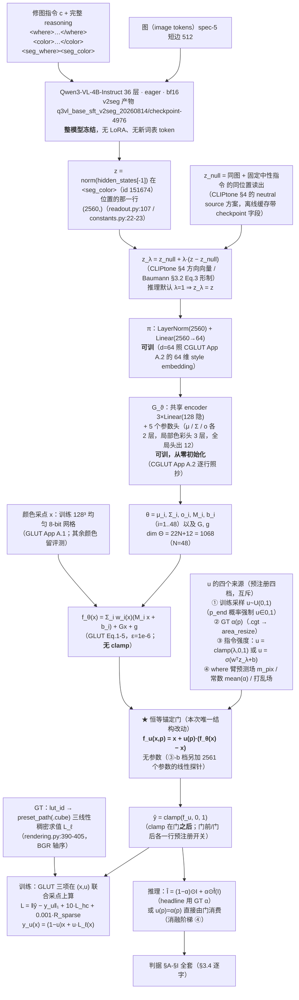

# 实验：恒等锚定强度门（EPR-027）

状态：提案（待 grill-me + 用户定稿）。**新建实现**（what 侧现有代码判为不可信、不参照；
接入点只写「需要什么」）。where 侧 `q3vl/whereb/readout.py` 与 EPR-018..023 的接口可引用。

一句话：在 GLUT 前向**外面**加一层恒等锚定门 `f_u(x,p) = x + u(p)·(f_θ(x) − x)`，
`u` 训练期按 `U(0,1)` 采样并配 `y_u(x) = (1−u)x + u·L_ℓ(x)` 目标，推理期由指令强度 `λ`
或空间场 `α(p)` 驱动。**θ 不依赖 u**（θ 依赖 u 的版本是 EPR-028/029 的入口，本臂不做）。

外部行号 / 公式 / 数值以 **2026-08-15 当日 `curl` 打开的原始文件与 arXiv HTML 全文**为准
（清单见文末）；本仓库 file:line 与数据统计以当日工作区 / 只读挂载现场跑命令为准，命令与
数字逐条写在 §1「数据」。

---

## 跨臂冻结口径（EPR-024 ~ EPR-029 六份逐字一致；2026-08-15 主 agent 裁定）

> 本块在六份提案里**逐字相同**。正文任何一处与本块冲突，**以本块为准**。
> 表内实测数字均为本轮（2026-08-15）在只读挂载 / 工作区现场跑出，命令与出处逐条列在右列。

| 项 | 冻结值 | 依据 |
|---|---|---|
| **训练集** | `split == "train"` 且 `winner_confidence == "normal"`，**n = 93934**（style 51182 / local 42752） | 战役数据纪律「`winner_confidence=low` 不进主训与评测 GT」。本轮实测 `/mnt/nfs-ro/bc/data/datasets/sft2seg-20260804/splits/train.index.jsonl`：159215 = normal **93934** + low **65281** |
| **每步批组织** | **B = 32 样本 × Q = 256 色点 = 8192 色 / 步** | CGLUT 的**色** batch 8192 口径不变（GLUT App A.1 原句 "CGLUT is trained for 40 epochs with a batch size of 8192"），本块只固定 (B, Q) 拆分。裁定理由（形式事实）：同一步内每条 LUT 被采到的色点数从 128 变成 256（翻倍），同时一步内出现的不同 LUT 条数从 64 变成 32（减半）。`B=64 × Q=128` 降为 **EPR-024 的一条消融行**，其余五臂不再各出一次 |
| **步 / epoch** | `ceil(93934 / 32)` = **2936** | 算术（本轮 `python3` 复算） |
| **总步数** | 2936 × **40 epoch** = **117,440** | 40 epoch 照抄 GLUT App A.1；这是 U4 步数匹配的公共基准，六份全部行都对齐到它 |
| **GLUT 前向 clamp** | **双裁**；旗标 `--clamp {two,one}`，**默认 `two`**：全局分支 `Gx+g` 先单独 clamp（`glut_editor.html:574-579`），末端 `local + global` 整体再 clamp（`:606-610`） | 官方 demo 是**唯一可执行的官方参考实现**，且内嵌 **7 份训练好的 GLUT-32 权重**（`glut_editor.html:429` 的 `const EMBEDDED_MODELS`；本轮 JSON 解析：7 个模型，每个的 `cholesky_diag` 长度 = 32），实现可逐点对拍；论文 Eq.5 只写末端 clamp，**未排除**中间 clamp。「论文单裁」（`--clamp one`）降为**共用消融行**，只在 **EPR-024 §4** 出一次，其余五臂引用该行 |
| **`L_hc` 在 `C→0` 处** | `h = (a, b) / max(C, ε_C)`，**且**整项乘硬 mask `1[C ≥ ε_C]`，`ε_C = 1e-3`；被 mask 的点数每步落盘 `n_hc_masked` | GLUT Eq.7 未给保护，该处理属 **NOVEL 数值**。六份统一取本档。「不 mask、只加 ε」降为 **EPR-024 的一条消融行**（`--no-hc-mask`），其余五臂不再各出一次 |
| **headline 图像形成式** | **`Î_i = (1 − α_i) ⊙ I_i + α_i ⊙ f̂_i(I_i)`**，六份统一 | 判据 §B 逐字。跨臂配对 Δ 必须在**同一个量**上算；任何臂的其他形成式一律降为**诊断列**，并在列名旁写明与 headline 的差异 |
| **where 分支输出的消费口径** | 场来源统一为 where 臂的 **`m_pix`**；重采样算子统一为 `q3vl/where/upsample.py:54-62` 的 `area_resize`（下采 `mode="area"`、上采 `bilinear`），各臂采到自己载体需要的分辨率并把该分辨率写进 `run_config`、在 §E 表脚逐行印出。判据 §E 的三分层掩码**一律用 GT α 在短边 512 上算**，与场来源无关 | 三套口径（短边 512 / `m_low (gh,gw)` / 未指定）会让 §E 的四行在不同尺度上算、跨臂不可比。分层掩码固定在 GT α / 短边 512，保证 `E_in / E_band / E_out` 六份同尺 |
| **新建包落点** | 全部落在 **`q3vl/whatb/`**（镜像 where 侧 `q3vl/whereb/` 的「本周新建、可信」命名）。共同依赖——GLUT Eq.1-5 前向、CGLUT 生成器、CIELab / ΔE00、判据函数——**只写一份**，六臂共用；各臂自己的新模块放 `q3vl/whatb/<epr 名>/` 子包 | 避免出现两份并行的 GLUT 前向实现（口径必然漂移）。`q3vl/what2/` 这一命名作废 |
| **预注册判据键名** | `headline_normal_only`, `B0_identity`, `B1_libmean`, `B2_librandom`, `B3_bucket_retrieval`, `B4_oracle`, `N1_shuffle_delta`, `N1_shuffle_M`, `N2_irrelevant_delta`, `N2_irrelevant_M`, `N3_const_delta`, `N3_const_M` | 统一为 EPR-024 一套并补齐三负控制（原先四套写法）。键名不统一时，任一处拼写差异会让该列**静默缺席**而 `assert_criteria_ran` 仍然通过 |
| **`<seg_color>` 的 color span 编码** | 在本 EPR 的新命名空间里**自带一份实现**，**不 import `q3vl/what/` 的任何模块**；配启动断言（下方逐字） | `q3vl/whereb/readout.py:475-476` 的 `ReadoutBuilder.needs_color` 对 `("color_close", "im_end", "seg_where", "qtok")` 返回 True，`:478-487` 的 `color_ids_from_text` 在 **`:484`** 执行 `from q3vl.what.context import encode_color_span`。`q3vl/what/` 是本轮判定的污染源树，六份**一行未读、不 import** |

**`<seg_color>` 读出的启动断言（六份逐字一致）**：入口在建 dataloader **之前**，用本次基座
`checkpoint-4976` 的 tokenizer，对本 split 随机抽 **256** 条样本的 `color` 文本 `t` 逐条执行

```
ids_self = <本 EPR 自带的 color span 编码>(tok, t)     # 新命名空间，无 q3vl.what 导入
ids_ref  = tok(f"<color>{t}</color>", add_special_tokens=False).input_ids
assert len(ids_self) == len(ids_ref)                   # 先断长度
assert all(a == b for a, b in zip(ids_self, ids_ref))  # 再逐位断 token id
```

任一条不等即 `AssertionError`、拒绝开训；抽样条数与不等条数写进 `run_setup.json`。
该断言**只调用 tokenizer**，不 import 污染源树里的任何符号。

**B3 桶级检索基线（列名 `B3_bucket_retrieval`，六份逐字一致）**

- **定义**：对评测样本取其 **record 自带的 `minor`**，在 **train 里同 `minor` 桶的 lut_id 池**中
  **均匀随机取一条** `ℓ'`，预测 `f̂ = L_{ℓ'}`；R = 8 次重复，报 mean ± std，与 arm **同样本配对**。
- **不使用 `tools/data_splits/splits_presets.csv`**。本轮实测该 CSV：3522 条，`major` 由
  `minor.rsplit("_", 1)[0]` **机械**得来（**0 例外**）⇒ `"{major} / {minor}"` 只有 **77** 个不同字符串，
  单串最多被 **363** 个 lut_id 共用；且该 CSV 的 `major` 与 record 自带的 `major` 在抽样 800 条里
  **706 条不一致**。
- **定义依据（必须原样写进 RESULT 的方法节）**：**1-of-77 的桶只能给出桶判定，给不出 lut_id 的
  argmax**，所以本列**按定义是桶级下界，不是精确检索**；任何关于「检索这条路能到哪」的上界
  一律看 **B4 oracle**，不看 B3。
- **桶池实测（本轮遍历 `/mnt/nfs-ro/bc/data/datasets/sft2seg-20260804/records/shards/shard-00000.tar`
  的全部 162,359 条 record）**：record 自带 `major` **10** 类；train 的 `minor` **77** 类、
  `(major, minor)` **85** 对；record 的 `major == minor.rsplit("_",1)[0]` 只在
  **17,176 / 162,359** 条成立。train 的 77 个 minor 桶，lut_id 池大小 **min 1 / 中位 17 / max 285**，
  合计 **3149**。V_what normal-only 567 条的 `minor` **全部**被 train 桶覆盖，GT lut_id **全部**落在
  对应桶池内，桶内均匀取一条命中 GT lut_id 的期望比例 = **0.108**（61.38 / 567）；
  T_lut_unseen normal-only 252 条的 `minor` 也全部被覆盖，但 GT lut_id 落在 train 桶池内的条数
  **构造性为 0**（该 split 的 lut_id 与 train 交集为 0）。
- **另一个标签事实（写进方法节；三负控制会连带替换它）**：`instruction` 是英文句子里内嵌一个
  **中文风格名**（例：`"Please apply the 明亮活力彩 style across the photograph, …"`）。本轮抽
  train 前 6000 条：**6000/6000** 条含该中文风格名，抽样内 **1382** 个不同风格名，其中 **173** 个
  跨多个 `minor`。它与 record 的 77 个 `minor`、10 个 `major` 是**三套互不相同**的标签词表。

---

## 1. 任务

### 数据

**切分与 n（本轮当日实测，命令逐条给出）**

```
cd /mnt/nfs-ro/bc/data/datasets/sft2seg-20260804/splits
jq -s '{n:length, style:([.[]|select(.task_type=="style")]|length), ...}' V_what.index.jsonl
```

| 集合 | n | style(全局) | local | normal | low | normal-only n | normal-only style / local | uniq lut_id | uniq source |
|---|---|---|---|---|---|---|---|---|---|
| **V_what**（唯一选型集） | 897 | 489 | 408 | 567 | 330 | **567** | 321 / 246 | 531 | 163 |
| T_final（终测，LUT 见过） | 918 | 494 | 424 | 533 | 385 | 533 | 317 / 216 | 577 | 201 |
| **T_lut_unseen**（终测，LUT-id 不相交） | 433 | 235 | 198 | 252 | 181 | **252** | 144 / 108 | 259 | 212 |
| train | 159215 | 83671 | 75544 | 93934 | 65281 | — | — | 3149 | 27104 |

- **训练用切分**：`train` 且 `winner_confidence == "normal"` ⇒ **n = 93934**
  （style 51182 / local 42752；uniq lut_id 3081 / uniq source 22740）。
  `low` 不进主训与评测 GT（CLAUDE.md 数据纪律）。**上一稿写的「local 的 42752 与
  `q3vl/whereb/scripts/run_amort_arm.py:343-350` 的同口径数字一致（交叉核对通过）」是陈引用，
  本轮复核为假**：该文件 `:330-352` 全是 argparse 定义，`rg 42752` 在该文件**零命中**
  （全仓命中在 `q3vl/where/preflight.py:398`、`q3vl/where/tests/test_calibrate.py:358,361`、
  `q3vl/whereb/amort/segsam.py:1170`）。数字 **42752 本身经本轮直接数 `train.index.jsonl` 复核为真**
  （train ∩ normal ∩ local）；该句已删去「交叉核对通过」的结论。
- **lut_id 交集（当日实测）**：`train ∩ T_lut_unseen = 0`；`train ∩ V_what = 531`；
  `train ∩ T_final = 577`；`V_what ∩ T_lut_unseen = 0`。
- **preset 库总量**：`tools/data_splits/splits_presets.csv` 共 **3522** 行
  （`train 3172 / val 175 / test 175`；`major` 40 类 / `minor` 77 类）。
- **同图配对差分可用量（当日实测）**：V_what normal-only 有 138 个 source，其中 **120 个
  source ≥ 2 个样本**（最多 12、中位 4）；T_lut_unseen normal-only 有 157 个 source，其中
  只有 **67 个 ≥ 2 个样本**（最多 6、中位 1）—— **T_lut_unseen 上不做同图配对差分，只做
  同图负控制**。
- 选型只允许用 V_what；T_final / T_lut_unseen 每个 arm 只跑一次。

**每条样本可用的构造侧真值（rec.json 字段，当日打开 `records/shards/shard-00000.tar`
的第一条确认）**：`lut_id`、`preset_path`（例：`/home/bc/data/datasets/recipes/quandian/
quandian_011428.cube`，目录当日 `ls` 确认存在）、`render_mode`（global / local）、
`mask_id`、`task_type`、`instruction`、`major` / `minor`、`winner_confidence`。

**GT 空间场 α**：`.cgt.png`（原始短边 1024，maskmeta 的 `mask_w=1024`）；已发布投影
`maskviews/<split>/` 里的 `.maskhi.png`（`mask_hi_shape` 例 `[640,512]`，短边 512）、
`.masklow.npy`、`.maskmeta.json`。**V_what 目录 `sample_count = 408`**（当日
`jq .sample_count maskviews/V_what/manifest.json`）＝ V_what 的 local 条数 408，逐条覆盖。
只读挂载路径 `/mnt/nfs-ro/bc/data/datasets/where_a-20260805/maskviews/`。
style 样本 `α ≡ 1`。

**数据的生成律（本仓库代码事实，不是假设）**：`dataset_build/src/construct/rendering.py:301-313`

```
mask is None            -> out = edited                        # task_type = style（全局）
mask is not None        -> mixed = before*(1-alpha) + edited*alpha
                           out = where(alpha==0, before, where(alpha==1, edited, mixed))
edited = LUT_trilinear(before)                                  # rendering.py:390-405（grid_sample，BGR 轴序）
```

CPU 侧同式在 `rendering.py:62-74`（`composite_srgb`，`mixed[weight==0]=base`、
`mixed[weight==1]=complete`）。即目标的空间变化色彩变换恰为

$$\boxed{\;F^\ast(x,p)=(1-\alpha(p))\,x+\alpha(p)\,L_\ell(x)\;}\tag{GT}$$

`α` 的解析渲染在 `dataset_build/src/construct/canonical_masks.py:90-123`
（`circulargradient` / `gradient` 两族，末尾 `α²(3−2α)` smoothstep，`Flipped` 取 `1−α`）。

### 测试什么方法（通俗三段：增加了什么 / 在哪里加的 / 加了什么）

**第一段——增加了什么。** 在色彩变换的最后加一个**单标量（或单通道场）旋钮 `u`**：
`u=0` 时输出原图颜色一动不动，`u=1` 时输出模型算出来的完整变换，中间连续过渡。这个旋钮
不改变换本身长什么样，只改「往变换那边走多远」。

**第二段——在哪里加的。** 加在 GLUT 前向的**最外层**，在 clamp 之前：

```
y_raw = f_theta(x)                     # GLUT Eq.1-5，theta 由 <seg_color> 条件生成
y_gate = x + u * (y_raw - x)           # ★ 本次唯一结构改动
y_hat  = clamp(y_gate, 0, 1)           # clamp 在门之后（门前/门后各一行预注册开关）
```

`theta` 的计算路径**一个字符都不动**，`u` 不进生成器、不进 `theta`。

**第三段——加了什么（训练与推理各一句）。** 训练期：每个样本除了采颜色 `x`，再采一个
`u ~ U(0,1)`，把目标从「LUT 的输出 `L(x)`」换成「原色与 LUT 输出之间按 `u` 的混合
`(1−u)x + u·L(x)`」，损失仍是 GLUT 的三项，只是采点从 `x` 变成 `(x,u)` 二元组。
推理期：`u` 有四个来源档（GT α / where 臂预测场 / 指令强度 λ / 常数），四档全部预注册。

**这一改动同时落在两条轴上（形式事实，不是主张）**：把 `u` 当逐图标量就是**强度轴**
`y_u(x)=(1−u)x+u L_ℓ(x)`；把 `u` 当逐像素场 `u(p)=α(p)` 就是**空间轴**，两者在数学上是
同一族。取 `u(p)=α(p)` 且 `f_θ = L_ℓ` 时，`f_u(x,p)` 与 (GT) **逐点相等**
（形式化命题 3：族 $\mathcal{F}_1$ 精确包含数据生成族）。

### 参考工作（当日逐个打开原始文件 / arXiv HTML 全文核实）

- **CLIPtone: Unsupervised Learning for Text-based Image Tone Adjustment**，arXiv **2404.01123**。
  - **§4 Eq.(2)**（当日 HTML 原句）：`θ̂ = θ ⊗ (1 + s·Δθ)`，"`s` is a scaling factor that
    controls the degree of adjustment, and `⊗` denotes Hadamard product."
    —— **推理期自由标量**，训练里没有它的 GT。
  - **§4 方向向量**：text adapter 先把目标描述 `T̂` 与**固定源描述** `T` 编码进 CLIP 空间，
    取差 `E_T(T̂) − E_T(T)` 作方向向量，喂两层 MLP 出 `Δθ`；`T` **固定为 "normal photo"**。
  - **§4 三种 source 描述方案**原文对比：text-dependent（取反义词）/ image-dependent
    （用图像 CLIP 嵌入）/ neutral（固定中性描述）；原文选 **neutral**，并写明
    "we have evaluated different neutral descriptions, e.g., 'ordinary photo' and 'photo',
    and empirically found that 'normal photo' yields the best results."
  - **§5 Eq.(5)** `L_interval`：惩罚 AdaInt 采样坐标间过窄的间隔；
    `L_LUT = λ_weight·L_weight + λ_interval·L_interval`，**λ_weight = 1e-4、λ_interval = 0.5**；
    间隔惩罚的指数 **α = 0.7**（原文："In our experiments, we set α to 0.7."）。
  - **Fig.9**：`s ∈ {0,1,2}`，"A result with the default scaling factor `s = 1` is shown in
    the middle."
- **Continuous, Subject-Specific Attribute Control in T2I Models by Identifying Semantic
  Directions**（Baumann et al.），arXiv **2403.17064**；仓库 `github.com/CompVis/attribute-control`。
  - **§3.2 Eq.(2)**：`Δe_{A_i} = (E_CLIP(P_+) − E_CLIP(P))_[S]`（对比 prompt 的 token 差）。
  - **§3.2 Eq.(3)**：`e'(e, λ_i·Δe_{A_i})_[S_j] = e_[S_j] + λ_i·Δe_{A_i}`，
    "`λ_i` is a scalar controlling the magnitude of the modulation."
  - **§3.3 Eq.(4)**：训练目标里 `λ_i` 与 `ε`、`t` 一起进期望，"To capture the full scale of
    potential changes, including fine-grained ones, we **randomly vary λ_i**."
  - **Algorithm 1**：`λ_i ~ U([−5,5] \ (−0.1,0.1))`；附录原文
    "we sample **four** values for `λ_i` … values for `λ_i` very close to zero were not
    particularly useful for the training process."
  - 仓库 `learn_delta.py`（当日 raw 文件，共 **124 行**）：
    - `learn_delta.py:48-49` —— `scale_min, scale_max = cfg.scale_range` /
      `randomize_scale_sign: bool = cfg.randomize_scale_sign`。
    - `learn_delta.py:85` —— `scale = (((torch.rand(...) > .5).float() * 2 - 1) if
      randomize_scale_sign else False) * ((scale_max - scale_min) * torch.rand(...) + scale_min)`
      —— **训练期随机采 λ 且随机取符号**。
    - `learn_delta.py:87` —— `eps_target = eps_t + scale.view(...) * (eps_p - eps_n)`。
    - `learn_delta.py:95` —— `loss = F.mse_loss(eps_delta, eps_target.detach())`。
    - `configs/learn_delta.yaml`：`scale_batch_size: 4`、`scale_range: [.1, 5]`、
      `randomize_scale_sign: true`、`optim_class: torch.optim.AdamW`、
      `lr: 0.1 / betas: [0.5, 0.8] / weight_decay: 0.333`、`max_steps: 1000`、
      `grad_accum_steps: 10`。
    - `attribute_control/base.py:52` —— `tokenwise_delta` **零初始化**；
      `base.py:67` —— `t_embs + alpha * token_mask * self.tokenwise_delta[k]`（即 Eq.3 的实现）。
  - **Fig.2 caption**（当日 HTML 原句）："The tokenwise CLIP text embedding space is not
    globally smooth. We linearly interpolate between the embeddings of two prompts while
    keeping the noise seed fixed. Near the original embeddings, changes are smooth and
    semantically interpretable, but strong phase transitions exist between substantially
    different subjects (e.g., 'car' vs. 'frog')."
- **SA-LUT: Spatial Adaptive 4D Look-Up Table for Photorealistic Style Transfer**，
  arXiv **2506.13465**；仓库 `github.com/Ry3nG/SA-LUT`。
  - **§3.1.2 Eq.(3)**：`LUT_fused = LUT_identity + Σ_{i=1..N} α_i · LUT_i`，原文
    "where `LUT_identity` serves as a residual connection ensuring that **when α approaches
    zero, the transformation preserves the original input**. The resulting fused LUT is
    clamped to `[0,1]`."
  - 仓库 `SA-LUT/core/module/clut4d.py`（当日 raw 文件，共 182 行）：
    `:54` `self.LUTs = nn.Parameter(torch.zeros(num, 3, num_context_bins, dim, dim, dim))`；
    `:56` `nn.init.uniform_(self.LUTs, -0.1, 0.1)`；
    **`:82` `fused_lut = fused_lut + identity_lut.unsqueeze(0)`**、
    **`:84` `fused_lut = torch.clamp(fused_lut, 0, 1)`**、`:85` `return fused_lut`；
    `:42` `def __init__(self, num, dim=17, num_context_bins=2)` —— **context bin 只有 2 个**。
- **Multimodal 3D LUT Generation via StatLUT …**，arXiv **2607.08227**。
  - **§3.2 Eq.(4)**：`LUT_pred = Clamp(LUT_id + ΔC, 0, 1)`；原文紧接一句
    "To ensure training stability, we **zero-initialize the final FFN projection layer**.
    This guarantees an **initial identity mapping (ΔC = 0)**, preventing early-stage color
    distortion."
  - §3.2 Eq.(2)：`Q = W_q(LUT_id) + (PE_R ⊕ PE_G ⊕ PE_B), K = W_k(M), V = W_v(M)`。
- **GLUT: 3D Gaussian Lookup Table for Continuous Color Transformation**，arXiv **2605.19889**
  （本臂的载体与损失全部照抄它）。
  - **§3.1 Eq.(1)-(5)**：`d_i(x) = (x−μ_i)ᵀ Σ_i⁻¹ (x−μ_i)`；
    `w_i(x) = p_i(x)o_i / (Σ_j p_j(x)o_j + ε)`（Eq.2）；`f_i(x) = M_i x + b_i`（Eq.3）；
    `f_global(x) = Gx + g`（Eq.4）；`f(x) = Σ_i w_i(x) f_i(x) + f_global(x)`（Eq.5）；
    原文紧接："The value of `ŷ = f(x)` is **clamped to [0,1]³** to ensure valid RGB values."
  - **§3.1 Eq.(6)-(8) 训练目标**：`L_rec = ‖ŷ − y‖₁`（Eq.6）；
    `L_hc = C·(1 − ⟨ĥ, h⟩)`，其中 CIELab 下 `C = √(a²+b²)`、`h = (a/C, b/C)`，
    **权重取的是目标色的 chroma**（Eq.7）；
    `R_sparse = −(1/N) Σ_i [o_i log(o_i+ε) + (1−o_i) log(1−o_i+ε)]`（Eq.8）；
    `L_total = L_rec + λ_hc·L_hc + λ_sparse·R_sparse`。
  - **§4.1 实现**：Adam，**cosine annealing 从 1e-3**；GLUT 20 epoch / batch 1024，
    **CGLUT 40 epoch / batch 8192**；**λ_hc = 10、λ_sparse = 0.001**。
  - **App A.1**：`We uniformly sample the full 8-bit RGB space to construct a 128³ training
    set, **reserving the remaining colors for evaluation** to verify that the model learns a
    continuous representation.`
  - **App A.2**：CGLUT 生成器 = 64 维 style embedding → 共享 encoder（3 层线性，128 隐；
    "small" 为 64）→ 多个参数专属头；μ 头 2 层（128 → 3N），其余头同构，**局部色彩头 3 层**，
    全局仿射头输出 **12**（9 矩阵 + 3 偏置）。
    **`e_l` 与共享几何用 0.1× 基础学习率，生成器用基础 1e-3**；`ε = 1e-6`（Eq.2 与 Eq.8）。
  - **§4.2 / Table 1**：`22N+12` 参数；`N=32` 的典型配置共 716 参数。
  - **App B.3 / Table 7**（100 张 MIT5K 自然图，混合 α 的 PSNR；原文注明
    "no additional constraints were applied to optimize blending during the training of all
    models"）：CGLUT-32L **Full**：α=0 → **48.67**、0.2 → 35.44、**0.4 → 31.16**、
    0.6 → 31.33、0.8 → 34.64、α=1 → **47.95**；CGLUT-32L **Shared Geo.**：
    47.36 / 38.46 / **34.67** / 34.47 / 37.60 / 46.18。
- **NILUT / CNILUT**，arXiv **2306.11920**；仓库 `mv-lab/nilut`。
  发布的 `dataloader.py`（当日 raw 文件，共 136 行）里 `class EvalMultiLUTBlending`（`:76`）
  的 style vector 只有两种取值：单 LUT 时 one-hot（`:121` `style_vector[idx] = 1.`）、
  混合时**固定等权** `:123` `np.array([0.33, 0.33, 0.33])`。
  —— 发布代码里**没有**训练期随机混合权重的路径；本臂的随机 `u` 采样不引用它作先例。

### 解决什么问题（只陈述已核实事实，不作解释）

1. **数据生成律与强度轴同族（可证）**：(GT) 的 `F*(x,p) = (1−α(p))x + α(p)L_ℓ(x)`
   与强度目标 `y_u(x) = (1−u)x + u·L_ℓ(x)` 是同一个双参数族在 `u = α(p)` / `u = 标量`
   两种取法下的两个切片（`rendering.py:301-313`）。
2. **恒等在 GLUT 参数空间里是精确点（可证）**：Eq.5 取 `M_i = I, b_i = 0, G = 0, g = 0` 得
   `f_θ(x) = (Σ_i w_i(x))·x`；由 Eq.2，`Σ_i w_i(x) = 1 − ε/(Σ_j p_j o_j + ε)`，
   `ε = 1e-6`（**App A.1**「Training of CGLUT」段原句 "We set ϵ=10⁻⁶ in Equation 2 and Equation 8"）⇒ `f_θ(x) = x` 在 `ε → 0` 意义下成立（形式化命题 2；
   ε 项使等式为近似而非逐位精确，本文按此写，不含糊）。
3. **本仓库现有的「强度」候选轴已实测不可用**：按指令里第一个出现的程度副词分桶，
   与 GT LUT 幅度不分离——V_what normal-only 前 260 条（208 个唯一 LUT，17³ 网格，ΔE₇₆）：
   `strongly` n=47 → **43.94**；`restrained` n=89 → **40.26**；`moderately` n=39 → **36.55**；
   `slightly` n=5 → **43.97**；`none` n=67 → **38.98**；整体 mean **40.3** /
   p10 **21.3** / p90 **61.1**。**本臂的强度轴一律用合成 `y_u`，不用副词分桶。**
4. **参考工作里的强度标量都没有 GT**：CLIPtone 的 `s`（§4 Eq.2）是推理期自由标量；
   Baumann 的 `λ_i`（§3.2 Eq.3）在训练期随机采样、随机取符号（`learn_delta.py:85`），
   目标由 `Δε̃` 的线性外推给出（`learn_delta.py:87`）。本仓库的
   `y_u(x) = (1−u)x + u·L_ℓ(x)` 是**有 GT** 的强度轴（因为 `L_ℓ` 逐条已知）。
5. **恒等残差在 LUT 族里有两条独立先例**：SA-LUT `LUT_fused = LUT_identity + Σα_i LUT_i`
   （§3.1.2 Eq.3；`clut4d.py:82-84`）与 StatLUT `LUT_pred = Clamp(LUT_id + ΔC, 0, 1)`
   + 末层 FFN 零初始化（§3.2 Eq.4）。两者都是**加性恒等锚**；本臂是**乘性插值锚**
   （`x + u(f_θ(x) − x)`），把锚的强度暴露成一个可从外部驱动的标量/场。

---

## 2. 模型

### 2.1 模型图（★ = 本次唯一结构改动；灰 = 冻结，一字不改）



### 2.2 模型伪代码

```python
# ---- 冻结：整个 Qwen3-VL（v2seg checkpoint-4976）。可训：以下全部，从零初始化。 ----
pi   = Sequential(LayerNorm(2560), Linear(2560, 64))          # 169,024 参数
G    = CGLUTGenerator(d=64, hidden=128, N=48)                 # 278,188 参数（明细见 §2.4）
gate = LinearProbe(2560)          # 仅 ③-b 档：w (2560) + b (1)，w 零初始化，b=0

def forward(x, z, z_null, u=None, lam=1.0):
    # 1) 条件（不动）
    z_lam = z_null + lam * (z - z_null)        # lam=1 时 z_lam == z，逐位
    theta = G(pi(z_lam))                       # theta 不依赖 u

    # 2) GLUT 前向（GLUT Eq.1-5，照抄，无 clamp）
    y_raw = glut_forward(theta, x)

    # 3) ★ 恒等锚定门（唯一改动）
    if u is None:                              # ③-b 档
        u = sigmoid(gate(z_lam))               # 标量
    y_gate = x + u * (y_raw - x)               # u 可为标量或 (H,W,1) 场

    # 4) clamp 在门之后
    return clamp(y_gate, 0.0, 1.0)

# ---- 训练一步 ----
def train_step(batch):
    x  = sample_colors(batch)                  # 128^3 均匀 8-bit 网格上采点（GLUT App A.1）
    u  = sample_u()                            # U(0,1)，以 p_end 概率强制 u ∈ {0,1}
    y_u = (1 - u) * x + u * L_lut(batch.lut_id, x)     # 合成强度目标
    y_hat = forward(x, batch.z, batch.z_null, u=u, lam=u)
    return glut_loss(y_hat, y_u, theta.o)      # L_rec + 10*L_hc + 0.001*R_sparse
```

### 2.3 门带来的五条恒等式（形式事实，必须与结果并排出示）

设 `f_u(x) = x + u(f_θ(x) − x)`、`y_u(x) = (1−u)x + u L_ℓ(x)`，clamp 之前：

| 编号 | 恒等式 | 后果（对判据的影响，必须写进出板说明） |
|---|---|---|
| **G1** | `f_u(x) − y_u(x) = u·(f_θ(x) − L_ℓ(x))` | `L_rec(u) = u·L_rec(1)`；`E_{u~U(0,1)}[L_rec(u)] = 0.5·L_rec(1)`。**加门后 L_rec 的期望等于不加门时的 0.5 倍**，即相对 `λ_hc=10` 的比值从 10:1 变成 10:0.5。§4 因此必须有一行「无门 + `L_rec` 权重 ×0.5」的配平对照（行 ①′），否则 ①→② 的差里混着这个纯缩放。 |
| **G1′**（本轮补） | 门下 `L_hc` 的彩度权重从 `C(L_ℓ(x))` 换成 `C(y_u)`；由 `y_u = (1−u)x + u·L_ℓ(x)` 与 CIELab 的非线性，**`C(y_u)` 不是 `u·C(L_ℓ(x))`，无闭式缩放**（`u=0` 时 `C(y_0)=C(x)`，一般 ≠ 0），故 `10·L_hc` 项在 ①→② 之间的**权重变化没有解析配平量**，①′ 的 `L_rec ×0.5` 配不了它 | ⇒ §4.1 追加行 **①″「无门 + `L_rec` 权重 ×0.5 + `L_hc` 的彩度权重改取 `C(y_u)`（`u` 按同一分布采、只用于算权重，不进门）」**：①″ 与 ② 之间只差「门这一行乘加」本身，`L_rec` 缩放与 `L_hc` 权重换式两处都已配平。**①→② 的 Δ 一律不作单变量解读**，必须与 ①′、①″ 三行并排。每步落盘 `chroma_weight_src`（`gt_lut` / `y_u`）与 `mean_C_weight`，作为「配平行确实换了权重口径」的运行时见证。 |
| **G2** | `‖f_u(x) − x‖ = u·‖f_θ(x) − x‖` | 判据 §G(b) 幅度单调率与 §G(c) Spearman 在**以 u 为自变量**时**构造性 = 1**（只要 `f_θ ≠ id`），不是学出来的。⇒ 本臂的 §G(b)(c) 必须**以 λ 为自变量**报（③ 档），并把「以 u 为自变量 = 1.000（构造）」原样并排列出。 |
| **G3** | `u = 0` ⇒ `y_0 = x = f_0` ⇒ `L_rec = 0`；且 `L_hc = C(x)·(1 − ⟨h(x), h(x)⟩) = 0` | `u=0` 的采点对 `θ` 的梯度**恒为 0**（`R_sparse` 只依赖 `o_i`，与 `u` 无关，照常回传）。`p_end` 里强制到 `u=0` 的那一半是空转采点，必须计数并在 `steps.jsonl` 落一列 `u0_frac`。 |
| **G4** | 取 `u(p) = α(p)` 且 `f_θ = L_ℓ` ⇒ `f_u(x,p) = (1−α(p))x + α(p)L_ℓ(x) = F*(x,p)` | 形式化命题 3：族 $\mathcal{F}_1$ **精确包含** (GT)。同时 `α(p)=0` 处 `f_u = x` ⇒ 判据 §E 的 `E_out` **构造性 = 0**，`E_out` 单列不可用于跨族比较（必须与 `E_in`、`Δ_field` 三列同看）。 |
| **G5** | `u ∈ [0,1]` 且**先 clamp 再门**时，`f_u` 是 `[0,1]³` 内两点的凸组合 ⇒ 越界率 `A(u) ≡ 0` | 判据 §G(d) 的越界率列在「clamp 在门前」那一档**构造性退化为 0**。主臂取 **clamp 在门后**，`A(u)` 才非退化；`u ∉ [0,1]` 的外推档（`{−0.5, 1.5, 2}`）两档都非退化。 |

### 2.4 冻结 / 可训清单与参数量

| 组件 | 状态 | 依据 |
|---|---|---|
| Qwen3-VL-4B-Instruct 全部（视觉塔 + 语言塔 + embedding） | **冻结** | 本战役全部实验的共同约束；产物 `/home/bc/data/runs/q3vl_base_sft_v2seg_20260814/checkpoint-4976`（当日 `ls` 确认存在） |
| `π`（LayerNorm + Linear 2560→64） | **可训，从零** | 新增。`d=64` 照 CGLUT App A.2 的 64 维 style embedding |
| `G_ϑ`（共享 encoder + 5 个参数头） | **可训，从零** | CGLUT App A.2 逐行照抄结构 |
| **★ 恒等锚定门本体** | **无参数** | `f_u = x + u(f_θ(x) − x)`，`u` 由外部给 |
| ③-b 档的 `u` 线性探针（`w ∈ R^2560`, `b`） | **可训**，`w` 零初始化、`b = 0` | 零初始化形制照 StatLUT §3.2「zero-initialize the final FFN projection layer」与 Baumann `base.py:52` 的 `torch.zeros` delta |
| `z_null` 缓存 | **离线、冻结** | 与 `z` 同一次冻结前向产出；缓存行必须带 `checkpoint` 字段（形制照 `q3vl/whereb/gencontext.py:122, 168`） |

参数量（按上表逐项算，N=48）：

```
pi          : LayerNorm(2560) 5,120 + Linear(2560→64) 163,904            = 169,024
G shared    : 64→128 8,320 + 128→128 16,512 + 128→128 16,512             =  41,344
G head mu   : 16,512 + (128→3N=144) 18,576                               =  35,088
G head Sigma: 16,512 + (128→6N=288) 37,152                               =  53,664
G head o    : 16,512 + (128→N=48)    6,192                               =  22,704
G head local: 16,512 + 16,512 + (128→12N=576) 74,304                     = 107,328
G head glob : 16,512 + (128→12)      1,548                               =  18,060
gate probe  : 2560 + 1                                                    =   2,561
--------------------------------------------------------------------------------
合计（③-b 档）                                                            ≈ 449,773
```

`θ` 本体 `22N+12 = 1068`（N=48；GLUT §4.2 给的是 `22N+12` 与 `N=32 → 716`，
**N=48 是本战役自定值**，`22·48+12 = 1068` 为算术外推，GLUT 原文无 N=48 这一格）。

显存增量：门本身零参数、零激活（一次 fused 乘加）；`z_null` 使冻结前向的缓存条数翻倍
（离线一次性生成，不占训练显存）。

---

## 3. 数学公式与优化器 + 改动怎么接进来

### 3.1 损失函数（逐条照抄 GLUT §3.1 Eq.6-8，不增不减；唯一变化是采点从 `x` 变成 `(x,u)`）

对一个样本（`lut_id = ℓ`）、一个颜色采点 `x ∈ [0,1]³`、一个强度采点 `u`：

```
y_u   = (1 − u)·x + u·L_ℓ(x)                       # 合成强度目标（与 (GT) 同族）
y_raw = f_θ(x)                                      # GLUT Eq.1-5，θ = G_ϑ(π(z_λ))
ŷ     = clamp(x + u·(y_raw − x), 0, 1)             # ★ 门 + clamp（门后）

L_rec    = ‖ŷ − y_u‖₁                                                        # GLUT Eq.6
(L*,a*,b*)   = Lab(ŷ) ;  (L,a,b) = Lab(y_u)
C        = √(a² + b²) ;  h = (a/C, b/C) ;  ĥ = (a*/Ĉ, b*/Ĉ)
L_hc     = C·(1 − ⟨ĥ, h⟩)                                                    # GLUT Eq.7（权重取目标色 chroma）
R_sparse = −(1/N)·Σ_i [ o_i·log(o_i+ε) + (1−o_i)·log(1−o_i+ε) ]              # GLUT Eq.8，ε = 1e-6
L        = L_rec + 10·L_hc + 0.001·R_sparse                                  # GLUT §4.1 的 λ_hc / λ_sparse
```

③-b 档额外一项（**无原文可抄，标 NOVEL**）：

```
L_gate = | σ(wᵀ z_{λ=u} + b) − u |          # 让线性探针把强度标量从条件向量上读回来
L      = L_rec + 10·L_hc + 0.001·R_sparse + w_gate·L_gate        # w_gate 默认 0.1（NOVEL）
```

| 项 | 值 | 出处 |
|---|---|---|
| `λ_hc` | **10** | GLUT §4.1 原句 "The loss weights are empirically set to λ_hc = 10 and λ_sparse = 0.001." |
| `λ_sparse` | **0.001** | 同上 |
| `ε`（Eq.2 与 Eq.8） | **1e-6** | GLUT **App A.1**「Training of CGLUT」段原句 "We set ϵ=10⁻⁶ in Equation 2 and Equation 8 for numerical stability."（本轮全文复核：该句与 0.1× lr、硬样本挖掘同段，均在 A.1；A.2 是 "CGLUT Architecture"） |
| `L_rec` 形式 | **L1** | GLUT Eq.6 |
| `L_hc` 的 chroma 权重取谁 | **目标色 `y_u` 的 chroma** | GLUT Eq.7 原文 "weighted by the **target** chroma"。**门下的 NOVEL 说明**：目标从 `L_ℓ(x)` 换成 `y_u(x)`，权重随之取 `C(y_u)`；`u→0` 时 `y_u→x`，`L_hc→0`（恒等式 G3） |
| 颜色采点 | **128³ 均匀 8-bit RGB 网格训练，其余颜色留评测** | GLUT App A.1 原句 |
| `u` 采样分布 | **`u ~ U(0,1)`；以概率 `p_end = 0.2` 强制 `u ∈ {0,1}`（各半）** | 分布本体 = 任务卡指定；`p_end` 数值**无原文，NOVEL**。参考对照：Baumann Algorithm 1 是 `λ_i ~ U([−5,5]\(−0.1,0.1))`，即**排除近零带**而非强制端点；该口径作消融行 |
| 每样本采几个 `u` | **4** | Baumann 附录原句 "we sample **four** values for λ_i … at little overhead cost"（`learn_delta.py` 的 `scale_batch_size: 4`）。**NOVEL 移植说明**：那里的 4 个 scale 共享同一次昂贵的图像采样；这里 4 个 `u` 共享同一次 `θ = G(π(z))` 计算，成本结构同型 |
| `L_gate` 的形式与权重 | **L1，`w_gate = 0.1`** | **NOVEL**，无原文。理由：本仓库无强度 GT 以外的锚，`u` 在训练期已知，最小形式即回归；权重取比 `λ_hc=10` 低两个量级，使其不与 `L_rec` 争梯度。列为待拍板 |
| clamp 位置 | **门之后**（默认） | GLUT Eq.5 后原句 "The value of ŷ = f(x) is clamped to [0,1]³"；本臂门在 GLUT 前向**外面**，故 clamp 顺延到门后。门前 clamp 档见恒等式 G5 与消融行 |

**明确不加的项**（写出来是为了 `loss_preregistration.json` 里有记录）：
CLIPtone 的 `L_interval`（§5 Eq.5，`λ_interval = 0.5`、`α = 0.7`）不加——那是 AdaInt
采样坐标的正则，本臂无 AdaInt 模块，无可施加对象；4D LUT 的四方向 TV / 单调正则不加——
本臂的 `u` 不是 LUT 的第四条索引轴，`θ` 里没有 context 维。

### 3.2 优化器参数（照抄 GLUT §4.1 + **App A.1**「Training of CGLUT」段）

| 项 | GLUT/CGLUT 原文值 | 本臂取值 | 说明 |
|---|---|---|---|
| 优化器 | **Adam** | **Adam** | GLUT §4.1 原句 "optimized using the Adam optimizer"（未给 betas，取 PyTorch 默认 (0.9, 0.999)，**诚实登记为偏离**） |
| lr schedule | **cosine annealing，起点 1e-3，覆盖整个训练** | **同** | GLUT §4.1 原句 |
| 分组 lr | **style embedding 与共享几何 0.1×，生成器 1×** | **π 用 0.1×（1e-4），`G_ϑ` 用 1×（1e-3）** | CGLUT **App A.1** 原句（原文顺序：A.1 的 Initialization → **Training of CGLUT**（0.1× lr / ε=1e-6 / 硬样本挖掘）→ 自然图评测 → **A.2 CGLUT Architecture**；本轮全文复核）。**NOVEL 对应关系**：本臂没有可学习 `e_l`（条件由冻结 VLM 给），与 `e_l` 位置对应的可训件是投影 `π`，故 0.1× 落在 `π` 上；本臂**无**共享几何（Full Generation 档）。备选（π 也用 1×）列为消融行 |
| ③-b 探针 lr | — | **1e-4（= 0.1× 档）** | **NOVEL**，与 `π` 同组（同为条件侧线性件） |
| 训练集 | — | `train` 且 `winner_confidence == "normal"`，**n = 93934** | 跨臂冻结口径块；`low` 的 65281 条不进主训与评测 GT |
| epoch / batch | **CGLUT 40 epoch / batch 8192** | **40 epoch；色 batch 8192 = B 32 样本 × Q 256 色点；`ceil(93934/32) = 2936` 步/epoch，总 117,440 步**（与 EPR-024 逐位一致，U4） | GLUT §4.1 原句 + 跨臂冻结口径块的 (B,Q) 与步数基准。`K_u = 4` 的额外 `u` 采点算进每步 batch、**不**算进步数（NOTES 12） |
| `L_hc` 在 `C→0` 处 | 原文未给保护 | `h=(a,b)/max(C,1e-3)` 且整项乘硬 mask `1[C ≥ 1e-3]`，落盘 `n_hc_masked` | 跨臂冻结口径块（六份统一；「不 mask、只加 ε」是 EPR-024 的六臂共用消融行） |
| GLUT 前向 clamp | 论文 Eq.5 只写末端 | **双裁 `--clamp two`（默认）**；本臂的门在 GLUT 前向**外面**，门后另有一次 `clamp(y,0,1)`（`--gate-clamp after`） | 跨臂冻结口径块。注意这与 `--gate-clamp` 是两个独立旋钮：`--clamp` 管 GLUT 前向内部（全局分支预裁 + 末端裁），`--gate-clamp` 管门相对 clamp 的先后 |
| weight decay | GLUT 原文**未提** | **0**（Adam 默认） | 诚实登记：原文无值，不自造 |
| 梯度裁剪 | 原文**未提** | **不加** | 诚实登记 |
| 精度 | 原文未提 | **bf16**（本仓库统一） | 偏离，诚实列出 |
| seed | — | **20260810**（本仓库统一） | — |
| 硬样本挖掘 | **App A.1「Training of CGLUT」段原句**："Hard Sample Mining. We employ a curriculum hard-mining strategy to guide the model toward learning complex and high-error color transformations. Specifically, **from epoch 5 to 20, the mining ratio of samples with the highest $L_1$ errors is linearly increased from 10% to 40%**." | **启用**：`r` 在 epoch 5→20 线性 0.10→0.40，epoch<5 取 0.10、epoch>20 取 0.40；实现口径（批内 top-r 色点重采样、无跨步状态）与 EPR-024 §3.3 逐位一致；每步落盘 `mining_ratio` / `n_hard_colors` | **本轮自己重取 `https://arxiv.org/html/2605.19889v1`（HTTP 200，438,746 B），剥标签后全文检索 `mining ratio` 命中该句**，它在 **App A.1 的正文行文**里（紧接 `ε=10⁻⁶` 那句之后、`Datasets.` 那句之前），**不在 Table 11(b) 里**。上一稿「HTML 表格未渲染出数值 ⇒ 不启用」的判断为误，已订正；`dropped_unverified` 里的该条同步删除。启用后本臂与其余五臂同课程，①→② 的配对 Δ 不再混入训练课程差异 |
| checkpoint 选择 | GLUT 无此概念 | **quick-eval 硬门 + `.contexts.all.headline_normal_only` 择优，永不读 val loss** | 本战役红线 |

### 3.3 改动怎么接进来（逐条可确认；新建实现，不与 what 侧现有代码对照）

| 项 | 内容 |
|---|---|
| **改哪里** | ① **新增门模块**：变换载体的 forward 末端加一行 `y = x + u * (y_raw - x)`，随后 `clamp(y, 0, 1)`。门是**纯函数**，无参数、无状态；`u` 以显式形参传入（`float` 标量 或 `(B,1,H,W)` 场），**不允许有默认值**（缺省即报错，避免「门没接上但跑通了」）。② **新增 `u` 采样器**：训练侧 dataloader 每个样本多产 `K_u = 4` 个 `u`（`U(0,1)`，以 `p_end=0.2` 强制端点），与 `x` 一起组成 `(x,u)` 采点；`y_u = (1−u)x + u·L_ℓ(x)` 在同一处算，`L_ℓ` 走 `.cube` 三线性稠密求值（口径 = `dataset_build/src/construct/rendering.py:390-405` 的 `grid_sample` + **BGR 轴序**，CPU 参照实现 `rendering.py:77-109`）。③ **新增 `<seg_color>` 读出档**：`q3vl/whereb/readout.py:90-92` 的 `READOUT_KINDS` 目前是 6 档 `("seg_where","where_span_pool","where_close","color_close","im_end","qtok")`，**没有 `seg_color`**；本臂需增第 7 档 `"seg_color"`（reply 序列 = where span + color span + `<seg_where>` + `<seg_color>`，读出取最后一行，`expected_ids=(151674,)`），并把 `"seg_color"` 加进 `READOUT_NEEDS_V2SEG`（`readout.py:97`）；**该档由 EPR-024 §3.6-① 统一新增，本臂只消费**。**color span 编码自带一份**：`ReadoutBuilder.needs_color`（`readout.py:475-476`）走的 `color_ids_from_text`（`:478-487`）在 **`:484`** `from q3vl.what.context import encode_color_span`，`q3vl/what/` 是污染源树，本臂**一行未读、不 import**，改用 `q3vl/whatb/colorspan.py` 的自带实现 + 启动断言（逐字见跨臂冻结口径块：tokenizer 直接对拍、先断长度再逐位断 token id、256 条抽样）。`verify_plan`（`readout.py:365-394`，位置断言在 `:388-393`）与 `readout_vector`（`readout.py:417-423`）的断言机制原样复用——**这就是「读出旗标接线了」的运行时证据**。④ **新增 `z_null` 缓存**：固定中性指令 + 同一张图跑一次冻结前向，**reasoning 必须重新生成**（不得 teacher-force 原 reasoning，口径同判据 §D），缓存行带 `checkpoint` 字段并在启动时断言与本次基座一致（形制照 `q3vl/whereb/gencontext.py:122, 168`）。⑤ **新增空间档的场消费**：`u(p)` 来自 `.cgt`（`maskviews/<split>/*.maskhi.png` → `area_resize` 到工作分辨率）或 where 臂 `m_pix`；**算子写死为 `q3vl/where/upsample.py:54-62` 的 `area_resize`**（下采 `mode="area"`、上采 `bilinear`），与 where 侧 EPR-021 PROPOSAL.md:276 的口径同一函数。⑥ **新增落盘列**：per-step `u_mean` / `u0_frac`（恒等式 G3 的空转计数）/ `L_rec` / `L_hc` / `L_sparse`（③-b 档另加 `L_gate`、`gate_u_mae`）；per-sample `gate_u`（实际用的 `u`）、`strength_dE_u`（`ΔE00(f̂_u, y_u)` 五点）、`mono_rate_lambda`、`oob_rate_u`、`dlib_u`。⑦ **新增运行时断言**：见 §3.4 末段。 |
| **不变（明确列出没动的部分）** | **冻结基座全套**：Qwen3-VL-4B-Instruct、eager attention、bf16、全参 `requires_grad_(False)`；`<seg_color>` 的层与归一化契约 = `norm(hidden_states[-1])` 单行（与 where 侧 `q3vl/whereb/contracts.py:28-40` 的 `SEGMENT_HIDDEN_LAYER=-1` / `SEGMENT_HIDDEN_FINAL_NORM=True` 同口径）。**GLUT 前向按 demo 参考实现口径、跨臂一致**（Eq.1-5、`Σ_i = L_i L_iᵀ` 对角 Softplus、`o_i = σ(logit)`、`ε=1e-6`、对数域 PDF、**双裁 `--clamp two`**、N=48；逐条见跨臂冻结口径块），本臂在其**外面**加门，前向内部一行不动。**生成器 `G_ϑ` 与投影 `π` 一个字符不动**（门在它们**外面**，`θ` 不依赖 `u`）。**损失三项的形式与权重不动**（`L1 + 10·L_hc + 0.001·R_sparse`）。**采点口径不动**（128³ 均匀训练色 / 其余色留评测）。**判据 §A-§I 一列不改**（§3.4 逐字）。**λ=1 时 `z_λ = z` 逐位相等**，故 λ 通路在主臂默认档下是恒等旁路。**AUC 全战役禁用**；禁逐图 min-max / softmax；checkpoint 选择禁 val loss；IoU 禁当优化目标；比较必须步数匹配。 |
| **初始化（step0 与 baseline 等价性）** | 门本体**无参数**。① 档（`--no-gate`）：不进门分支，`ŷ = clamp(f_θ(x),0,1)`，与 EPR-024 **逐位一致** —— 本轮复核该主张成立所依赖的条件已全部对齐：训练集 n=93934、`B=32×Q=256`、117,440 步、clamp 默认 `two`、`L_hc` 的 `C→0` 档、**硬样本挖掘同课程（epoch 5→20 / 10%→40%，本轮从 App A.1 原文复核后启用）**；`--no-gate` 下 `u` 采样器与 `K_u=4` 分支**整条不构造**，采点数与 EPR-024 逐位相同。② / ④ 档（`u` 由外部给）：step0 的 `θ` 与 ① 档同一份随机初始化，输出差别**只来自门这一行乘加**，可逐位复算校验（校验脚本：同 seed 下 `u=1` 时 `f_u ≡ f_θ`，断言 `max|f_u − f_θ| == 0`，这是「门接对了」的第一条运行时断言）。③-b 档：`w` **零初始化**、`b = 0` ⇒ step0 恒有 `u = σ(0) = 0.5`，**与 ① 档不逐位等价**，诚实登记；`u = 1` 的严格 step0 等价档在 sigmoid 参数化下不可达（`σ(b)=1` 需 `b=∞`），需要严格等价请走 ③-a 档（`u = clamp(λ,0,1)`，λ=1 ⇒ `u=1` ⇒ 与 ① 档逐位一致）。零初始化形制的出处：StatLUT §3.2「zero-initialize the final FFN projection layer … guarantees an initial identity mapping (ΔC = 0)」、Baumann `base.py:52` 的 `torch.zeros` delta。 |
| **入口（旗标；`--no-gate` = 与 EPR-024 逐位一致）** | 全部旗标写进 `run_config` / `loss_preregistration.json`，源码 sha256 冻结：<br>• `--gate / --no-gate`（默认 **on**；off = 消融行 ①）<br>• `--gate-u-source {sample,gt_alpha,lambda,zhead,const,shuffle}`（训练固定 `sample`；评测按消融阶梯取）<br>• `--gate-clamp {after,before}`（默认 **after**；before = 恒等式 G5 那一档）<br>• `--gate-p-end`（默认 **0.2**，NOVEL）、`--gate-ku`（默认 **4**，Baumann 附录 / `learn_delta.yaml` 的 `scale_batch_size: 4`）<br>• `--gate-u-dist {uniform01,excl_band}`（`excl_band` = `U([0,1]\(0,0.1))`，Baumann Algorithm 1 的排除近零带口径）<br>• `--gate-lambda-sign {fixed,random}`（`random` = `learn_delta.py:85` 的随机符号档；此档 `u = clamp(λ,0,1)`）<br>• `--gate-null-prompt {keep,cliptone}`（`keep` = `Please keep the colors of this photo unchanged.`（默认，**NOVEL**）；`cliptone` = 字面 `normal photo`（CLIPtone §4 原文））<br>• `--gate-zhead {none,linear}`（默认 `none` = ③-a；`linear` = ③-b）、`--gate-zhead-weight`（默认 0.1，NOVEL）<br>• `--gate-field-src {gt,pred,const,shuffle}`（判据 §E 的场消费四行）<br>• `--gate-u-eval`（外推评测点，默认 `-0.5,0,0.25,0.5,0.75,1,1.5,2`） |

### 3.4 判据（预注册，逐字；本 EPR 一列不改，仅在末段追加本臂专属的运行时断言键与恒等式标注）

#### A. 评测集与 n（全部本轮从 `/mnt/nfs-ro/bc/data/datasets/sft2seg-20260804/splits/*.index.jsonl` 实测）

| 集合 | n | style(全局) | local | normal | low | normal-only n | normal-only style / local | uniq lut_id | uniq source |
|---|---|---|---|---|---|---|---|---|---|
| **V_what**（唯一选型集） | 897 | 489 | 408 | 567 | 330 | **567** | 321 / 246 | 531 | 163 |
| T_final（终测，LUT 见过） | 918 | 494 | 424 | 533 | 385 | 533 | 317 / 216 | 577 | 201 |
| **T_lut_unseen**（终测，LUT-id 不相交） | 433 | 235 | 198 | 252 | 181 | **252** | 144 / 108 | 259 | 212 |
| train | 159215 | 83671 | 75544 | 93934 | 65281 | — | — | 3149 | 27104 |

- `train ∩ T_lut_unseen` 的 lut_id 交集 = **0**（本轮核）。preset 库总量 3522
  （`tools/data_splits/splits_presets.csv`，train 3172/val 175/test 175，40 major / 77 minor）。
- 同图配对差分的可用样本：V_what normal-only 有 138 个 source，其中 **120 个 source ≥2 个样本**
  （最多 12、中位 4）；T_lut_unseen normal-only 只有 67 个 source ≥2 个样本（中位 1）——
  **T_lut_unseen 上不做同图配对差分，只做同图负控制**。
- 选型只允许用 V_what；T_final / T_lut_unseen 每个 arm 只跑一次。

#### B. Headline 定义（单一标量，供 checkpoint 选优；禁 val loss）

对样本 $i$：$\hat I_i=(1-\alpha_i)\odot I_i+\alpha_i\odot \hat f_i(I_i)$，
$I_i^\ast=(1-\alpha_i)\odot I_i+\alpha_i\odot L_i(I_i)$（后者 = 数据集存的目标，`rendering.py:311`）。

$$E_i=\frac{1}{|\Omega|}\sum_{p}\Delta E_{00}\big(\hat I_i(p),\,I_i^\ast(p)\big),\qquad
\textbf{H}=\frac{1}{|S|}\sum_{i\in S}E_i,\quad S=\text{V\_what}\cap\{\text{normal}\}$$

落盘键：`.contexts.style.headline_normal_only` / `.contexts.local.headline_normal_only` /
`.contexts.all.headline_normal_only`；**选优只读 `.contexts.all.headline_normal_only`，
禁用顶层 pooled**（混 low 少算约 0.031，CLAUDE.md）。
`α` 的口径：headline 用 **GT α**（隔离 what 侧）；预测 α 单列 `.contexts.*.headline_predalpha`。
分辨率固定（短边 512，area_resize），写进 run_config。

**函数值空间并排列（不参与选优，必出）**

$$\mathcal{E}^{\text{grid}}_i=\frac{1}{17^3}\sum_{x\in\mathcal{X}_{\text{grid}}}\Delta E_{00}\big(\hat f_i(x),L_i(x)\big),\qquad
\mathcal{E}^{\text{img}}_i=\sum_{c}h^{(i)}_c\,\Delta E_{00}\big(\hat f_i(c),L_i(c)\big)$$

$\mathcal{X}_{\text{grid}}$=17³ 均匀 sRGB 网格；$h^{(i)}$=$I_i$ 的 5-bit/通道量化直方图
（取前 4096 色）。两列尺度差别很大（实测：GT LUT 相对 identity 在 17³ 网格上
mean $\Delta E_{76}$=40.3、p10=21.3、p90=61.1），**任何单列都不足以定档**。
另设 GLUT 原生的**未见颜色**列：训练采 128³ 均匀色，评测在其补集上算（GLUT App A.1）。

#### C. 平凡基线列（每条与 arm **同样本配对**，报 $\Delta$ + 95% bootstrap CI + Wilcoxon p；缺一不出板）

| 列 | 定义 | 本轮实测地板（协议见下） |
|---|---|---|
| **B0 identity** | $\hat f=\mathrm{id}$ ⇒ $\hat I=I$ | 259 条 unseen LUT 上 mean $\Delta E_{76}$ = **32.79**（p50 31.24） |
| **B1 训练集平均变换** | $\bar L(x)=\frac{1}{|\text{Lib}_{tr}|}\sum_\ell L_\ell(x)$（逐点均值仍是合法映射） | mean **25.33**（p50 23.54） |
| **B2 库内随机** | $\ell'\sim U(\text{Lib}_{tr})$，R=8 次取均值 ± std | mean **35.37** |
| **B3 最近邻检索** | (a) 纯文本：指令 embedding vs LUT `major/minor` 标签文本；(b) 同投影 $\pi$ 的 image+text embedding | 未测（须在提案里定死检索器） |
| **B4 oracle 库内最优** | $\ell^\ast=\arg\min_\ell D_{\mathcal{X}}(L_\ell,L_i)$，$\ell$ 遍历 $\text{Lib}_{tr}$ | mean **9.93**（p10 4.18 / p50 9.59 / p90 15.66 / max 41.42）= **任何检索式方案的天花板** |
| **B5 分解诊断** | (GT LUT, 预测 α) 与 (预测 LUT, GT α) 两行 | — |
| **B6 库内自身填充密度** | train LUT → 最近的另一条 train LUT | mean **10.17**（p50 10.01 / p90 16.88） |

> **实测协议（必须原样写进 RESULT 的方法节）**：9³ 均匀 sRGB 网格；每色转 CIELab（D65，sRGB
> EOTF）后取 L2（**$\Delta E_{76}$，非 $\Delta E_{00}$**）再对色求均值；$\text{Lib}_{tr}$ =
> 从 train index 随机采 2500 行得到的 **1137 个 lut_id**（非全部 3149），
> $T_{\text{lut\_unseen}}$ = 全部 259 个；单次运行，无方差。库几何：1137 条 LUT 在该 2187 维
> 空间做 PCA，累计方差 90%/95%/99% 需 **15/28/99** 维。
>
> B4 与 B0/B1/B2 的量级差是本判据集的核心刻度：任何「生成优于检索」的主张必须出示 arm 相对
> **B4** 的配对 Δ，而不是相对 B0/B2。

**失效模式**：B0 在 α 质量小的 local 样本上很强（必须按 $\bar\alpha=\text{mean}(\alpha)$
分层报，分层 n 一并给）；B1 是一条与指令完全无关的固定曲线，CSRNet 的 20.47 vs 23.69 说明
这条地板可以很高；B2 的 std 必须报（单次抽样噪声大）；B4 在 T_lut_unseen 上严格 >0，
其值本身就是「3149 条离散 LUT 覆盖连续空间到什么程度」的答案。

#### D. 指令条件性三负控制（同图配对差分）

对每个样本构造三个扰动条件，**扰动后必须重新生成 reasoning 再读出 `<seg_color>`**
（teacher-forced 原 reasoning 会让控制失效）：

| 控制 | 构造 | 输出两列 |
|---|---|---|
| N1 shuffle | 同 split 内换一条**同 task_type、不同 lut_id** 的指令 | $\Delta_{\text{shuffle}}=\mathbf{H}(\text{ctrl})-\mathbf{H}(\text{true})$；$M_{\text{shuffle}}=\mathbb{E}_i D_{\mathcal{X}_{\text{grid}}}(\hat f_i^{\text{true}},\hat f_i^{\text{ctrl}})$ |
| N2 无关词 | 换成等长的非色彩英文句（图像 caption） | $\Delta_{\text{irrel}}$、$M_{\text{irrel}}$ |
| N3 固定短语 | 全体用同一句 `Please edit this photo.` | $\Delta_{\text{const}}$、$M_{\text{const}}$ |

两列缺一不可：只报 $\Delta$ 会被「无视指令」的模型（$\Delta\approx0$ 但 $M\approx0$）与「乱动」的
模型同时污染；只报 $M$ 会被参数噪声刷高（T2ONet Table 4：采样宽度 h 0→0.1 使 σ 0.7190→2.1482
而 L1 从 0.0784 劣化到 0.0979）。
统计：n=567（V_what normal-only）配对，10k bootstrap + Wilcoxon 符号秩。每个消融行都必须带
$\Delta_{\text{const}}/\Delta_{\text{shuffle}}$（CLAUDE.md 硬规定）。
另设 **条件置零列**（$z=0$）与 **训练集均值条件列**（$z=\bar z_{\text{train}}$），它们是 B1 在
模型内部的对应物。

#### E. 局部性列（P2/P3 必出，三分层 + 场消费四行）

分层（按 GT α）：

$$\mathcal{E}_{\text{in}}=\underset{\alpha(p)\ge0.9}{\mathrm{mean}}\ \Delta E_{00}(\hat I,I^\ast),\quad
\mathcal{E}_{\text{band}}=\underset{0.05<\alpha(p)<0.9}{\mathrm{mean}}\ \Delta E_{00}(\hat I,I^\ast),\quad
\mathcal{E}_{\text{out}}=\underset{\alpha(p)\le0.05}{\mathrm{mean}}\ \Delta E_{00}(\hat I,I)$$

场消费四行（同 checkpoint、同步数）：**GT α / where 臂预测场 / 常数场（= 该样本 $\bar\alpha$）/
打乱场（他样本的 α）**。
按 mask 面积 $\bar\alpha$ 分层（例如 <0.1 / 0.1–0.3 / 0.3–0.6 / >0.6）与按 mask_type
（radial / band / linear / semantic）分层报，**每层给 n**。

**失效模式**：$\mathcal{E}_{\text{out}}$ 在 $\mathcal{F}_1$（mask 混合）下构造性为 0
（`rendering.py:311` 的 `out[alpha==0]=before` 同构），跨族比较必须三列同看；全图 $\Delta E$
对小面积编辑近乎失明（PPR10K 造 $\Delta E^{HC}$ 的原因）；本族现有工作对空间场**没有任何量化
指标**（SA-LUT Γ / 4D LUT C / SA-3DLUT A 全是定性图），无量表可抄。

#### F. 插值质量列（P1 必出）

**协议 IP-A（有 GT）**：取同一 source 下的两条 LUT $L_a,L_b$（V_what normal-only 有 120 个
source 可用），$\alpha\in\{0,0.2,0.4,0.6,0.8,1\}$（GLUT App B.3 同格点）。GT = 函数空间线性
混合 $(1-\alpha)L_a+\alpha L_b$（与「图像空间直接混合」逐点等价）。
必出四列：`ΔE00_blend(α)`（arm）、**`输出混合` 平凡列** $(1-\alpha)\hat f_a+\alpha\hat f_b$、
`ΔE00(端点)`、`GLUT 外部参照`（CGLUT-32L Full α=0.4 → PSNR 31.16；Shared Geo. → 34.67；
端点 48.67/47.95）。
**协议 IP-B（无 GT，指令对）**：只报形式化 §1.3 的六个路径量：$\mathcal{L}$、$\mathcal{L}_0$、
$\rho$、$\bar\sigma$、$J$（不裁分位，并列出 p50/p95/p99/max）、$\mathrm{Mono}$（**并列 0.5
随机地板**）、$d_{\text{lib}}(\alpha)$、越界率 $A(\alpha)$、退化权重率。

**失效模式**：$\bar\sigma$ / ISTD 的满分解是塌缩（必须并列 $\mathcal{L}$）；$J$ 的满分解是
常数生成器；$d_{\text{lib}}$ 的满分解是不动；`输出混合` 列在该口径下会大幅跑赢条件插值
（按定义，误差介于端点误差与端点误差+3 dB 之间），**不出示这一列的插值结论无效**；
GLUT App B.3 明写训练时不加任何混合约束，其数字是「表示本身的固有行为」。

#### G. 强度列（P1）

**不可用的做法（本轮已实测否定）**：按指令里第一个出现的程度副词分桶，与 GT LUT 幅度不分离
——V_what normal-only 前 260 条（208 个唯一 LUT，17³ 网格，$\Delta E_{76}$）：
`strongly` n=47 → 43.94；`restrained` n=89 → 40.26；`moderately` n=39 → 36.55；
`slightly` n=5 → 43.97；`none` n=67 → 38.98；整体 mean 40.3 / p10 21.3 / p90 61.1。

**可用的构造协议**：合成强度目标 $y_u(x)=(1-u)x+u L_\ell(x)$，$u\in\{0,0.25,0.5,0.75,1\}$，报
(a) `ΔE00(f̂_u, y_u)`；(b) 幅度单调率
$\Pr[\,\|\hat f_{u_{k+1}}-\mathrm{id}\|>\|\hat f_{u_k}-\mathrm{id}\|\,]$（**并列 0.5 地板**）；
(c) 幅度标定 Spearman$(\|\hat f_u-\mathrm{id}\|,u)$，并列**随机置换地板**；
(d) $u$ 超出 [0,1] 外推到 $\{-0.5,1.5,2\}$ 的越界率与 $d_{\text{lib}}$。

#### H. 统计与运行时纪律

- 一切主张走**同样本配对 Δ**：10,000 次 bootstrap 的 95% CI + Wilcoxon 符号秩 p；绝对值只作附录。
- 分层必给 n；T_lut_unseen local normal-only 只有 **108** 条，不得再切分层。
- 比较必须**步数匹配**（U4）；不同 arm 用同一 quick-eval 硬门 + headline 选优，禁 val loss。
- **预注册判据必须有运行时断言**：`assert_criteria_ran` 的 required 表按 arm 列出必须被调用且
  n>0 的判据函数键——所有 arm 必含
  `{headline_normal_only, B0..B2, B4, N1..N3(Δ 与 M 各一)}`；P1 arm 追加
  `{interp_grid, path_len, mono_rate, oob_rate}`；P2/P3 arm 追加
  `{loc_in, loc_band, loc_out, field_const, field_shuffle, field_gt}`。任一为 0 → 拒绝出板。
- 三个负控制的 reasoning 重生成缓存必须记 `checkpoint` 字段并在启动时断言与本次基座一致
  （照 `q3vl/whereb/gencontext.py:122, 168`）。

#### I. 禁用清单（见到即 blocker）

AUC（任何形式）；把 SSIM / CLIP-score / H-Corr / LPIPS 单列当 headline；顶层 pooled（混 low）
headline；逐图 min-max 或 softmax 归一化后再算判据；PPL 式的分位裁剪均值；用 `vrmeta.region`
当方向标签（82% 为退化值 "center"）；用 IoU 当优化目标；跨步数比较。

#### 本臂专属追加（不改上面任何一列，只加断言键与恒等式标注）

**本臂横跨 P1 与 P2，`assert_criteria_ran` 的 required 表取并集**：

```
required["WHAT_GATE"] = [
  # 六份逐字同一张公共表（键名见跨臂冻结口径块）
  "headline_normal_only",
  "B0_identity", "B1_libmean", "B2_librandom", "B3_bucket_retrieval", "B4_oracle",
  "N1_shuffle_delta", "N1_shuffle_M",
  "N2_irrelevant_delta", "N2_irrelevant_M",
  "N3_const_delta",   "N3_const_M",
  # P1 追加
  "interp_grid", "path_len", "mono_rate", "oob_rate",
  # P2/P3 追加
  "loc_in", "loc_band", "loc_out", "field_const", "field_shuffle", "field_gt",
  # 本臂专属
  "gate_identity_check",   # u=1 时 max|f_u − f_θ| == 0（门接对了）
  "gate_u_hist",           # 训练期实际用过的 u 的直方图，n>0
  "strength_dE_u",         # ΔE00(f̂_u, y_u)，u ∈ {0,.25,.5,.75,1}
  "dlib_u",                # u ∈ {−0.5,0,…,1,1.5,2} 的库内最近距离
]
# 任一键缺失或 n == 0 → 拒绝出板。
```

**恒等式标注（出板时必须与数字并排印在表脚，见 §2.3）**：

- §G(b)(c) **以 `u` 为自变量时构造性 = 1.000**（恒等式 G2）。本臂的 §G(b)(c)
  **必须以 `λ` 为自变量报**（③ 档），并把「以 u 为自变量 = 1.000（构造）」原样列出。
- §G(d) 的越界率在 `--gate-clamp before` 档、且 `u ∈ [0,1]` 时**构造性 = 0**（恒等式 G5）。
- §E 的 `E_out` 在 `u(p) = α(p)` 档、`α = 0` 处**构造性 = 0**（恒等式 G4）。
- §B 的 headline 在 `--gate-u-source gt_alpha` 与 `.contexts.*.headline_normal_only` 的
  GT α 合成之间存在**双重使用同一个 α**：门内用一次、判据合成用一次。
  ⇒ 该档必须**同时**报 `--gate-u-source lambda`（`u` 为逐图标量、`α` 只在判据侧合成）
  那一行，两行并排，否则该档的 headline 与 B0 不可区分口径。

---

## 4. 结果（做完补，消融行全填这里）

口径：headline = `.contexts.all.headline_normal_only`（V_what normal-only，**n = 567**；
style 321 / local 246），图像形成式 `Î = (1−α)⊙I + α⊙f̂(I)`（GT α），短边 512，`area_resize`；
逐样本配对 + 10k bootstrap 95% CI + Wilcoxon 符号秩。所有行**步数匹配**：train normal-only
n = 93934、`B=32 × Q=256 = 8192 色/步`、`2936 步/epoch × 40 epoch = 117,440 步`、
同 seed 20260810、clamp 默认 `two`（与 EPR-024 逐位一致）。

**平凡基线行（同样本配对，来自判据 §C；单位 = 9³ 网格 $\Delta E_{76}$，T_lut_unseen 259 条 LUT）**：
B0 identity **32.79**（p50 31.24）/ B1 训练集平均变换 **25.33**（p50 23.54）/
B2 库内随机 **35.37** / B4 oracle 库内最优 **9.93**（p10 4.18 / p50 9.59 / p90 15.66 /
max 41.42）/ B6 库内自身填充密度 **10.17**（p50 10.01 / p90 16.88）。

**headline 口径（ΔE00 / 短边 512 / GT α）下的平凡基线表（缺一不出板；与主臂同样本配对）**：

| 列 | V_what normal-only (n=567) | T_final normal-only (n=533) | T_lut_unseen normal-only (n=252) |
|---|---|---|---|
| `B0_identity` | `___` | `___` | `___` |
| `B1_libmean` | `___` | `___` | `___` |
| `B2_librandom`（R=8，mean ± std） | `___` | `___` | `___` |
| `B3_bucket_retrieval`（R=8，mean ± std；**桶级下界，非精确检索**，定义见跨臂冻结口径块） | `___` | `___` | `___` |
| `B4_oracle` | `___` | `___` | `___` |
| B5 分解诊断（GT LUT + 预测 α）/（预测 LUT + GT α） | `___` / `___` | `___` / `___` | `___` / `___` |
| B6 库内自身填充密度 | `___` | — | — |

**外部参照行（GLUT App B.3 / Table 7，MIT5K 100 图，PSNR，非本仓库口径）**：
CGLUT-32L Full α=0 / 0.4 / 1 = **48.67 / 31.16 / 47.95**；
CGLUT-32L Shared Geo. α=0 / 0.4 / 1 = **47.36 / 34.67 / 46.18**。

### 4.1 主表（消融阶梯，叠加式）

| 行 | 形态 | headline（V_what normal-only） | 配对 Δ vs ① | p | $\Delta_{\text{const}}$ | $\Delta_{\text{shuffle}}$ | $\mathcal{E}^{\text{grid}}$ | $\mathcal{E}^{\text{img}}$ |
|---|---|---|---|---|---|---|---|---|
| ① | **无门**（= EPR-024 形态，`--no-gate`） | `___` | — | — | `___` | `___` | `___` | `___` |
| ①′ | 无门 + `L_rec` 权重 ×0.5（**恒等式 G1 的配平对照**） | `___` | `___` | `___` | `___` | `___` | `___` | `___` |
| ①″ | ①′ **再加**「`L_hc` 的彩度权重改取 `C(y_u)`」（**恒等式 G1′ 的配平对照；`u` 只用于算权重，不进门**） | `___` | `___` | `___` | `___` | `___` | `___` | `___` |
| ② | 门 + `u` 由 **GT** 给（上界档，`--gate-u-source gt_alpha`） | `___` | `___` | `___` | `___` | `___` | `___` | `___` |
| ②′ | 门 + `u` 由 GT 给，但 `u` 是逐图标量（`--gate-u-source lambda`，λ=1） | `___` | `___` | `___` | `___` | `___` | `___` | `___` |
| ③-a | 门 + `u = clamp(λ,0,1)`（无参数，λ 来自 `z_λ` 通路） | `___` | `___` | `___` | `___` | `___` | `___` | `___` |
| ③-b | 门 + `u = σ(wᵀz_λ+b)`（线性探针 + `L_gate`） | `___` | `___` | `___` | `___` | `___` | `___` | `___` |
| ④ | 门 + `u(p)` 空间场（`u(p) = α(p)`，GT 场） | `___` | `___` | `___` | `___` | `___` | `___` | `___` |

### 4.2 强度列（判据 §G，只在有门的行上有定义）

| 行 | `ΔE00(f̂_u,y_u)` u=0 / .25 / .5 / .75 / 1 | 单调率（以 **λ** 为自变量） | 0.5 随机地板 | Spearman（以 λ） | 随机置换地板 | 越界率 A(u) u=−0.5 / 1.5 / 2 | `d_lib(u)` u=−0.5 / 0 / 1 / 2 |
|---|---|---|---|---|---|---|---|
| ② | `___` | 以 u 为自变量 = **1.000（构造，恒等式 G2）** | 0.5 | 以 u = **1.000（构造）** | `___` | `___` | `___` |
| ③-a | `___` | `___` | 0.5 | `___` | `___` | `___` | `___` |
| ③-b | `___` | `___` | 0.5 | `___` | `___` | `___` | `___` |
| ④ | `___` | `___` | 0.5 | `___` | `___` | `___` | `___` |

### 4.3 局部性列（判据 §E，场消费四行；只在 ④ 档有定义）

| 场来源 | $\mathcal{E}_{\text{in}}$ (α≥0.9) | $\mathcal{E}_{\text{band}}$ | $\mathcal{E}_{\text{out}}$ (α≤0.05) | n |
|---|---|---|---|---|
| GT α | `___` | `___` | **0（构造，恒等式 G4）** | 246 |
| where 臂预测 `m_pix` | `___` | `___` | `___` | 246 |
| 常数场 `mean(α)` | `___` | `___` | `___` | 246 |
| 打乱场（他样本 α） | `___` | `___` | `___` | 246 |

按 $\bar\alpha$ 分层（<0.1 / 0.1–0.3 / 0.3–0.6 / >0.6）与按 mask_type
（radial / band / linear / semantic）分层，**每层给 n**：`___`

### 4.4 插值列（判据 §F，IP-A，V_what normal-only 120 个 source）

| 行 | `ΔE00_blend` α=0 / .2 / .4 / .6 / .8 / 1 | 「输出混合」平凡列 | 端点 `ΔE00` | $\mathcal{L}$ / $\mathcal{L}_0$ / $\rho$ / $\bar\sigma$ / $J$(p50,p95,p99,max) |
|---|---|---|---|---|
| ① | `___` | `___` | `___` | `___` |
| ② | `___` | `___` | `___` | `___` |
| ④ | `___` | `___` | `___` | `___` |

### 4.5 附加消融行（每行只改一项，其余与主臂 ② 相同；每行必带 $\Delta_{\text{const}}$ / $\Delta_{\text{shuffle}}$）

- **⑤ clamp 位置**：门后（主臂）→ 门前（`--gate-clamp before`）：headline `___`
  （配对 Δ `___`，p `___`）；越界率列该档**构造性 = 0**（恒等式 G5）
- **⑥ `u` 采样分布**：`U(0,1)` + `p_end=0.2` 端点强制（主臂）→ `U([0,1]\(0,0.1))`
  排除近零带（Baumann Algorithm 1 口径，`--gate-u-dist excl_band`）：headline `___`；
  `u0_frac` 主臂 `___` / 该档 0
- **⑦ `p_end`**：0.2（主臂）→ 0 / 0.5：headline `___` / `___`
- **⑧ 每样本 `u` 个数 `K_u`**：4（Baumann 附录 / `learn_delta.yaml` 的 `scale_batch_size: 4`）
  → 1 / 8：headline `___` / `___`
- **⑨ λ 符号随机化**：固定 λ≥0（主臂）→ 随机符号（`learn_delta.py:85` 口径，
  `--gate-lambda-sign random`，`u = clamp(λ,0,1)`）：headline `___`；
  外推越界率 A(u=−0.5) `___`
- **⑩ 中性指令 `z_null`**：`Please keep the colors of this photo unchanged.`（主臂，NOVEL）
  → 字面 `normal photo`（CLIPtone §4 原文）：headline `___`；`‖z − z_null‖₂` 分布 `___`
- **⑪ `π` 的分组 lr**：0.1×（CGLUT **App A.1** 对 `e_l` 的口径）→ 1×：headline `___`
- **⑫ `L_gate` 权重**（仅 ③-b）：0.1（NOVEL）→ 0 / 1.0：headline `___` / `___`；
  `gate_u_mae` `___` / `___`

### 4.6 终测（每个 arm 只跑一次）

| 集合 | n（normal-only） | headline | 配对 Δ vs B0 | p | 配对 Δ vs B4 | p |
|---|---|---|---|---|---|---|
| T_final | 533 | `___` | `___` | `___` | `___` | `___` |
| T_lut_unseen | 252 | `___` | `___` | `___` | `___` | `___` |

T_lut_unseen 上**只做同图负控制、不做同图配对差分**（判据 §A：只有 67 个 source ≥2 样本）。
T_lut_unseen local normal-only 只有 **108** 条，不再切分层（判据 §H）。

---

## NOTES（假设与待用户决策；保守默认已在上文写死，未静默拍板）

1. **与 EPR-024 的关系（本臂的唯一外部依赖）**。本提案的 §2 基座（冻结 v2seg →
   `<seg_color>` → `π` → CGLUT 生成器 → GLUT N=48）是按任务卡与 GLUT/CGLUT 原文自撰的
   自洽描述。**若 EPR-024 的定稿形态与之不一致，以 EPR-024 为准并同步本文**；两臂必须
   同 seed、同步数、同数据切分，否则 ①→② 的配对 Δ 不成立。请确认 EPR-024 定稿口径。
2. **`p_end = 0.2` 无出处（NOVEL）**。保守默认 = 任务卡写法（以 `p_end` 概率强制
   `u ∈ {0,1}`，各半）。已知形式事实：`u = 0` 的采点梯度恒为 0（恒等式 G3），
   即 `p_end` 的一半是空转。备选 = 只强制 `u = 1`，或改用 Baumann Algorithm 1 的
   排除近零带 `U([0,1]\(0,0.1))`（消融行 ⑥ 已排）。请拍板。
3. **③-b 的 `L_gate` 无原文可抄（NOVEL）**。保守默认 = `|σ(wᵀz_{λ=u}+b) − u|`，权重 0.1。
   形式事实：`z_λ = z_null + λ(z − z_null)` 是一条直线，故
   `σ(wᵀz_λ+b) = σ(λ·wᵀ(z−z_null) + (wᵀz_null+b))`，探针学的是**逐图斜率**。
   备选 = 不训探针，只用 ③-a 的 `u = clamp(λ,0,1)`。请拍板要不要跑 ③-b。
4. **中性指令的字面（NOVEL）**。CLIPtone 的 neutral source 是**描述** "normal photo"
   （§4 原文，并比过 "ordinary photo" / "photo"）；本仓库的条件是**指令**。
   保守默认 = `Please keep the colors of this photo unchanged.`；
   备选 = 字面照抄 `normal photo`（消融行 ⑩ 已排）。请拍板主臂取哪句。
5. **`z_null` 的生成成本**。每张图要多跑一次冻结 VLM 前向 + reasoning 重生成
   （不得 teacher-force）。V_what 163 个 source / T_lut_unseen 212 个 source /
   train 22740 个 source（normal-only）。若 train 侧全量生成成本不可接受，
   备选 = 训练期 `λ ≡ u`、`z_λ` 直接取 `z`（即训练期不走 `z_null` 通路，只在评测期用），
   代价是 ③ 档的探针只在评测分布上见过 `z_λ`。请拍板。
6. **`N = 48` 无原文**。GLUT §4.2 给的是 `22N+12` 与 `N=32 → 716 参数`；`N=48` 是本战役
   自定值，`22·48+12 = 1068` 为算术外推。保守默认 = 沿用战役常数 48。是否改回 32
   （有原文默认值背书）请拍板。
7. **Adam 的 betas / weight decay / 梯度裁剪**。GLUT §4.1 只写了 "Adam" 与
   "cosine annealing from 1e-3"，没给 betas、wd、clip。保守默认 = PyTorch 默认
   (0.9, 0.999)、wd=0、不裁剪，**诚实登记为偏离而非照抄**。
8. **硬样本挖掘（上一稿判断有误，已订正，不再是待决策）**。本轮自己重取
   `https://arxiv.org/html/2605.19889v1`（HTTP 200，438,746 B）并剥标签全文检索，原句
   **逐字存在于 App A.1「Training of CGLUT」段的正文行文里**（不在 Table 11(b) 里）：
   "Hard Sample Mining. We employ a curriculum hard-mining strategy … Specifically, from epoch 5
   to 20, the mining ratio of samples with the highest $L_1$ errors is linearly increased from
   10% to 40%."
   ⇒ 本臂**启用**该课程，实现口径与 EPR-024 §3.3 逐位一致；`dropped_unverified` 里的该条已删除。
9. **`<seg_color>` 读出档（已定案：由 EPR-024 统一新增）**。`q3vl/whereb/readout.py:90-92` 的
   `READOUT_KINDS` 当前 6 档里**没有** `seg_color`；该档由 **EPR-024 §3.6-①** 统一新增并加进
   `READOUT_NEEDS_V2SEG`（`readout.py:97`），六臂共用同一档；本臂只消费、不重复新增。
   该档所需的 `<color>{text}</color>` token 编码由 `q3vl/whatb/colorspan.py` **自带一份实现**
   （不 import `q3vl/what/`），启动断言逐字见跨臂冻结口径块。该改动会被 where 侧 EPR-018..023 六臂共享（它们的
   NOTES 10 明写「`<seg_color>` 归 what 分支使用，本批六臂不消费」）。
   加档本身不改任何现有档的行为（新增分支），但**改的是六臂共用的模块**，
   是否要为 what 侧另建一份 readout（复制而非扩展）请拍板。
10. **`u(p)` 的工作分辨率**。保守默认 = 与 where 侧同口径：`.cgt` / `maskhi` →
    `area_resize`（`q3vl/where/upsample.py:54-62`）到 headline 的短边 512 网格。
    where 臂预测场是 `m_low (gh,gw)` 或 `m_pix (4gh,4gw)`（EPR-021 PROPOSAL.md:135, 276），
    上采到 512 用同一个 `area_resize`（上采分支走 bilinear）。是否要在
    `m_pix` 原生分辨率上做门（而不是先上采）请拍板。
11. **②（`u=α(p)` GT 场）与 headline 的 α 双重使用**。判据 §B 的 headline 用 GT α 合成
    `Î = (1−α)I + α f̂(I)`；②档的门里又用了一次同一个 α。保守默认 = ② 与 ②′
    （`u` 为逐图标量、α 只在判据侧）**两行必须同时出**，已写进 §3.4 末段与 §4.1。
12. **步数与 batch（已由跨臂冻结口径块定死）**。CGLUT 原文是 40 epoch / batch 8192 色采点；
    本臂的「一个 epoch」因为多了 `u` 维（每样本 `K_u=4` 个 `u`）而不再与原文同义。定案 =
    **按优化步数与 EPR-024 对齐**：train normal-only n=93934、`B=32 × Q=256 = 8192 色/步`、
    `2936 步/epoch × 40 epoch = 117,440 步`；`K_u` 的额外采点**算进每步的 batch、不算进步数**
    （即本臂每步实际吃 `8192 × 4` 个 `(x,u)` 对，优化步数与 EPR-024 逐位相同，U4 成立）。
    该额外倍数写进 `run_config` 的 `n_pairs_per_step` 并每步落盘。

---

## 来源清单（2026-08-15 当日打开的原始文件 / arXiv HTML 全文）

外部：

- https://arxiv.org/abs/2404.01123 与 https://arxiv.org/html/2404.01123v1
  （CLIPtone；§4 Eq.2 `θ̂ = θ ⊗ (1+s·Δθ)`、方向向量 `E_T(T̂) − E_T(T)`、源描述三方案与
  "normal photo"、§5 Eq.5 `L_interval` 与 `λ_interval=0.5` / `λ_weight=1e-4` / `α=0.7`、
  Fig.9 `s ∈ {0,1,2}` 默认 1 —— 逐句当日核对）
- https://arxiv.org/abs/2403.17064 与 https://arxiv.org/html/2403.17064
  （Baumann et al.；§3.2 Eq.2/Eq.3、§3.3 Eq.4、Algorithm 1 的
  `λ_i ~ U([−5,5]\(−0.1,0.1))`、附录「四个 λ 值」、Fig.2 caption 的局部平滑 / 全局相变原句）
- https://raw.githubusercontent.com/CompVis/attribute-control/main/learn_delta.py
  （共 124 行；`:48-49` scale 配置、`:85` 随机符号 + 随机幅度、`:87` `eps_target`、
  `:95` MSE loss）
- https://raw.githubusercontent.com/CompVis/attribute-control/main/configs/learn_delta.yaml
  （`scale_batch_size: 4`、`scale_range: [.1, 5]`、`randomize_scale_sign: true`、
  AdamW `lr 0.1 / betas [0.5,0.8] / wd 0.333`、`max_steps 1000`、`grad_accum_steps 10`）
- https://raw.githubusercontent.com/CompVis/attribute-control/main/attribute_control/base.py
  （`:52` delta 零初始化、`:67` `e + α·mask·Δe` 的实现）
- https://arxiv.org/abs/2506.13465 与 https://arxiv.org/html/2506.13465v1
  （SA-LUT；§3.1.2 Eq.3 identity 残差与 "when α approaches zero … preserves the original
  input" 原句）
- https://raw.githubusercontent.com/Ry3nG/SA-LUT/main/SA-LUT/core/module/clut4d.py
  （共 182 行；`:42` `num_context_bins=2`、`:54/:56` 零初始化 + `uniform_(-0.1,0.1)`、
  **`:82` identity 残差**、**`:84` clamp**）
- https://arxiv.org/abs/2607.08227 与 https://arxiv.org/html/2607.08227v1
  （StatLUT；§3.2 Eq.2、**Eq.4 `LUT_pred = Clamp(LUT_id + ΔC,0,1)`** 与「zero-initialize
  the final FFN projection layer … initial identity mapping (ΔC = 0)」原句）
- https://arxiv.org/abs/2605.19889 与 https://arxiv.org/html/2605.19889v1
  （GLUT；§3.1 Eq.1-8 全式、§4.1 的 Adam / cosine 1e-3 / CGLUT 40 epoch batch 8192 /
  λ_hc=10 / λ_sparse=0.001、App A.1 的 128³ 采点与留出色、**App A.1「Training of CGLUT」段的
  0.1× lr / ε=1e-6 / 硬样本挖掘 epoch 5→20 比例 10%→40%（本轮剥标签全文检索 `mining ratio` 命中）**、
  App A.2 的生成器结构 /
  0.1× lr / ε=1e-6、§4.2 的 `22N+12` 与 `N=32 → 716`、**App B.3 Table 7 的混合 PSNR**）
- https://raw.githubusercontent.com/mv-lab/nilut/main/dataloader.py
  （共 136 行；`:76` `EvalMultiLUTBlending`、`:121` one-hot、`:123` 固定等权
  `[0.33,0.33,0.33]` —— 发布代码无训练期随机混合路径）

本仓库（当日工作区逐个打开确认）：

- `dataset_build/src/construct/rendering.py:62-74`（`composite_srgb`）、
  `:301-313`（GPU 侧 mask 混合 + `alpha==0/1` 的硬赋值）、
  `:390-405`（`_apply_lut`，`grid_sample` 三线性，`axis_order: bgr`）、
  `:77-109`（CPU 三线性参照实现）
- `dataset_build/src/construct/canonical_masks.py:90-123`（`raster_geometry`，
  `circulargradient` / `gradient`、`α²(3−2α)` smoothstep、`Flipped`）
- `q3vl/whereb/readout.py:90-92`（`READOUT_KINDS` 六档，**无 `seg_color`**）、
  `:97`（`READOUT_NEEDS_V2SEG`）、`:104-110`（`KNOWN_IDS`，`<seg_color>` = **151674**，在 `:107`）、
  `:187-202`（`SegTokenIds.from_tokenizer`）、`:327-343`（`seg_where` 档的 `ReplyPlan`）、
  `:365-394`（`verify_plan`；位置断言在 `:388-393`）、`:396-423`（`readout_hidden` / `readout_vector`）
- `q3vl/train/constants.py:11-14, 22-28`（四个 tag token 151669..151672；
  `<seg_where>` / `<seg_color>` 追加在词表末尾 = 151673 / 151674）
- `q3vl/where/upsample.py:54-62`（`area_resize`：下采 `mode="area"`、上采 `bilinear`）
- `q3vl/whereb/gencontext.py:122, 168`（生成缓存的 `checkpoint` 形参与落盘字段）
- `experiments/prs/EPR-021_implicit-coord-head/PROPOSAL.md:135, 276`（场分辨率与
  `area_resize` 口径）
- `tools/data_splits/splits_presets.csv`（3522 行；train 3172 / val 175 / test 175；
  40 major / 77 minor）
- 只读挂载 `/mnt/nfs-ro/bc/data/datasets/sft2seg-20260804/splits/*.index.jsonl`
  （§1 与判据 §A 的全部 n、交集、source 分布，命令与数字见 §1）
- 只读挂载 `/mnt/nfs-ro/bc/data/datasets/where_a-20260805/maskviews/`
  （V_what `sample_count = 408`；`.maskmeta.json` 的 `mask_w = 1024` / `mask_hi_shape = [640,512]`）
- 基座 `/home/bc/data/runs/q3vl_base_sft_v2seg_20260814/checkpoint-4976`（当日 `ls` 确认存在）
- LUT 目录 `/home/bc/data/datasets/recipes/`（当日 `ls` 确认存在，含 `e18` / `quandian`）
