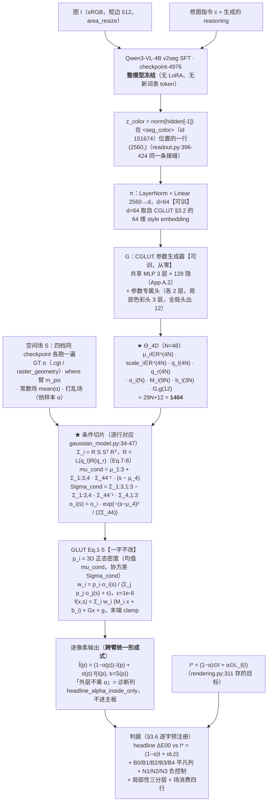

# 实验：高斯基元升到 4D，空间标量作第 4 维，Schur 补条件切片出 3D 颜色高斯（EPR-028）

> **R0，2026-08-16 起部分作废。实施依据是同目录 `PROPOSAL_R1.md`。**
> 本文仍然有效的只有：跨臂冻结口径块、§1.2 数据计数、§4 的外部事实核验
> （4DGS / GLUT / demo 的行号、sha256、引文）。
> **§1.1 单变量声明、§2.2 伪代码、§2.3 参数表、§3.1 公式、§3.2 损失、§3.3 优化器、
> §3.4 数值纪律、§3.5 五模式表、以及冻结块里那条 headline 形成式，全部作废**
> （double-α 协议错误、双四元数+Schur、非对数域前向、七变量同改；见 R1 §0）。

状态：R0（已被 R1 部分替代）。

本提案属 **P2（3D 色彩变换如何扩展空间维）** 分支，在六族表里占 **F3b 4D-GAUSS（联合）** 一格，
并在同一份提案里同时给出 **可分离（块对角 = 不透明度门控，F4/STG 形制）** 的对照档——这一对
（联合 vs 可分离）**复刻 Yang et al. 自家 Table 3 的 No-4DRot 对照设计**（原文 30.79 vs Full 31.62，
本轮 HTML 全文逐字复核）。

外部行号与原文引文，以 **2026-08-15 当日 `curl` 打开的 raw 文件 / arXiv HTML** 为准（清单见文末）；
本仓库 file:line 与数据集计数以当日工作区、当日实跑命令为准。**what 侧既有实现代码未读、不参照**
（本提案是新建实现，接入点只写「需要什么」）。

---

## 跨臂冻结口径（EPR-024 ~ EPR-029 六份逐字一致；2026-08-15 主 agent 裁定）

> 本块在六份提案里**逐字相同**。正文任何一处与本块冲突，**以本块为准**。
> 表内实测数字均为本轮（2026-08-15）在只读挂载 / 工作区现场跑出，命令与出处逐条列在右列。

| 项 | 冻结值 | 依据 |
|---|---|---|
| **训练集** | `split == "train"` 且 `winner_confidence == "normal"`，**n = 93934**（style 51182 / local 42752） | 战役数据纪律「`winner_confidence=low` 不进主训与评测 GT」。本轮实测 `/mnt/nfs-ro/bc/data/datasets/sft2seg-20260804/splits/train.index.jsonl`：159215 = normal **93934** + low **65281** |
| **每步批组织** | **B = 32 样本 × Q = 256 色点 = 8192 色 / 步** | CGLUT 的**色** batch 8192 口径不变（GLUT App A.1 原句 "CGLUT is trained for 40 epochs with a batch size of 8192"），本块只固定 (B, Q) 拆分。裁定理由（形式事实）：同一步内每条 LUT 被采到的色点数从 128 变成 256（翻倍），同时一步内出现的不同 LUT 条数从 64 变成 32（减半）。`B=64 × Q=128` 降为 **EPR-024 的一条消融行**，其余五臂不再各出一次 |
| **步 / epoch** | `ceil(93934 / 32)` = **2936** | 算术（本轮 `python3` 复算） |
| **总步数** | 2936 × **40 epoch** = **117,440** | 40 epoch 照抄 GLUT App A.1；这是 U4 步数匹配的公共基准，六份全部行都对齐到它 |
| **GLUT 前向 clamp** | **双裁**；旗标 `--clamp {two,one}`，**默认 `two`**：全局分支 `Gx+g` 先单独 clamp（`glut_editor.html:574-579`），末端 `local + global` 整体再 clamp（`:606-610`） | 官方 demo 是**唯一可执行的官方参考实现**，且内嵌 **7 份训练好的 GLUT-32 权重**（`glut_editor.html:429` 的 `const EMBEDDED_MODELS`；本轮 JSON 解析：7 个模型，每个的 `cholesky_diag` 长度 = 32），实现可逐点对拍；论文 Eq.5 只写末端 clamp，**未排除**中间 clamp。「论文单裁」（`--clamp one`）降为**共用消融行**，只在 **EPR-024 §4** 出一次，其余五臂引用该行 |
| **`L_hc` 在 `C→0` 处** | `h = (a, b) / max(C, ε_C)`，**且**整项乘硬 mask `1[C ≥ ε_C]`，`ε_C = 1e-3`；被 mask 的点数每步落盘 `n_hc_masked` | GLUT Eq.7 未给保护，该处理属 **NOVEL 数值**。六份统一取本档。「不 mask、只加 ε」降为 **EPR-024 的一条消融行**（`--no-hc-mask`），其余五臂不再各出一次 |
| **headline 图像形成式** | **`Î_i = (1 − α_i) ⊙ I_i + α_i ⊙ f̂_i(I_i)`**，六份统一 | 判据 §B 逐字。跨臂配对 Δ 必须在**同一个量**上算；任何臂的其他形成式一律降为**诊断列**，并在列名旁写明与 headline 的差异 |
| **where 分支输出的消费口径** | 场来源统一为 where 臂的 **`m_pix`**；重采样算子统一为 `q3vl/where/upsample.py:54-62` 的 `area_resize`（下采 `mode="area"`、上采 `bilinear`），各臂采到自己载体需要的分辨率并把该分辨率写进 `run_config`、在 §E 表脚逐行印出。判据 §E 的三分层掩码**一律用 GT α 在短边 512 上算**，与场来源无关 | 三套口径（短边 512 / `m_low (gh,gw)` / 未指定）会让 §E 的四行在不同尺度上算、跨臂不可比。分层掩码固定在 GT α / 短边 512，保证 `E_in / E_band / E_out` 六份同尺 |
| **新建包落点** | 全部落在 **`q3vl/whatb/`**（镜像 where 侧 `q3vl/whereb/` 的「本周新建、可信」命名）。共同依赖——GLUT Eq.1-5 前向、CGLUT 生成器、CIELab / ΔE00、判据函数——**只写一份**，六臂共用；各臂自己的新模块放 `q3vl/whatb/<epr 名>/` 子包 | 避免出现两份并行的 GLUT 前向实现（口径必然漂移）。`q3vl/what2/` 这一命名作废 |
| **预注册判据键名** | `headline_normal_only`, `B0_identity`, `B1_libmean`, `B2_librandom`, `B3_bucket_retrieval`, `B4_oracle`, `N1_shuffle_delta`, `N1_shuffle_M`, `N2_irrelevant_delta`, `N2_irrelevant_M`, `N3_const_delta`, `N3_const_M` | 统一为 EPR-024 一套并补齐三负控制（原先四套写法）。键名不统一时，任一处拼写差异会让该列**静默缺席**而 `assert_criteria_ran` 仍然通过 |
| **`<seg_color>` 的 color span 编码** | 在本 EPR 的新命名空间里**自带一份实现**，**不 import `q3vl/what/` 的任何模块**；配启动断言（下方逐字） | `q3vl/whereb/readout.py:475-476` 的 `ReadoutBuilder.needs_color` 对 `("color_close", "im_end", "seg_where", "qtok")` 返回 True，`:478-487` 的 `color_ids_from_text` 在 **`:484`** 执行 `from q3vl.what.context import encode_color_span`。`q3vl/what/` 是本轮判定的污染源树，六份**一行未读、不 import** |

**`<seg_color>` 读出的启动断言（六份逐字一致）**：入口在建 dataloader **之前**，用本次基座
`checkpoint-4976` 的 tokenizer，对本 split 随机抽 **256** 条样本的 `color` 文本 `t` 逐条执行

```
ids_self = <本 EPR 自带的 color span 编码>(tok, t)     # 新命名空间，无 q3vl.what 导入
ids_ref  = tok(f"<color>{t}</color>", add_special_tokens=False).input_ids
assert len(ids_self) == len(ids_ref)                   # 先断长度
assert all(a == b for a, b in zip(ids_self, ids_ref))  # 再逐位断 token id
```

任一条不等即 `AssertionError`、拒绝开训；抽样条数与不等条数写进 `run_setup.json`。
该断言**只调用 tokenizer**，不 import 污染源树里的任何符号。

**B3 桶级检索基线（列名 `B3_bucket_retrieval`，六份逐字一致）**

- **定义**：对评测样本取其 **record 自带的 `minor`**，在 **train 里同 `minor` 桶的 lut_id 池**中
  **均匀随机取一条** `ℓ'`，预测 `f̂ = L_{ℓ'}`；R = 8 次重复，报 mean ± std，与 arm **同样本配对**。
- **不使用 `tools/data_splits/splits_presets.csv`**。本轮实测该 CSV：3522 条，`major` 由
  `minor.rsplit("_", 1)[0]` **机械**得来（**0 例外**）⇒ `"{major} / {minor}"` 只有 **77** 个不同字符串，
  单串最多被 **363** 个 lut_id 共用；且该 CSV 的 `major` 与 record 自带的 `major` 在抽样 800 条里
  **706 条不一致**。
- **定义依据（必须原样写进 RESULT 的方法节）**：**1-of-77 的桶只能给出桶判定，给不出 lut_id 的
  argmax**，所以本列**按定义是桶级下界，不是精确检索**；任何关于「检索这条路能到哪」的上界
  一律看 **B4 oracle**，不看 B3。
- **桶池实测（本轮遍历 `/mnt/nfs-ro/bc/data/datasets/sft2seg-20260804/records/shards/shard-00000.tar`
  的全部 162,359 条 record）**：record 自带 `major` **10** 类；train 的 `minor` **77** 类、
  `(major, minor)` **85** 对；record 的 `major == minor.rsplit("_",1)[0]` 只在
  **17,176 / 162,359** 条成立。train 的 77 个 minor 桶，lut_id 池大小 **min 1 / 中位 17 / max 285**，
  合计 **3149**。V_what normal-only 567 条的 `minor` **全部**被 train 桶覆盖，GT lut_id **全部**落在
  对应桶池内，桶内均匀取一条命中 GT lut_id 的期望比例 = **0.108**（61.38 / 567）；
  T_lut_unseen normal-only 252 条的 `minor` 也全部被覆盖，但 GT lut_id 落在 train 桶池内的条数
  **构造性为 0**（该 split 的 lut_id 与 train 交集为 0）。
- **另一个标签事实（写进方法节；三负控制会连带替换它）**：`instruction` 是英文句子里内嵌一个
  **中文风格名**（例：`"Please apply the 明亮活力彩 style across the photograph, …"`）。本轮抽
  train 前 6000 条：**6000/6000** 条含该中文风格名，抽样内 **1382** 个不同风格名，其中 **173** 个
  跨多个 `minor`。它与 record 的 77 个 `minor`、10 个 `major` 是**三套互不相同**的标签词表。

---

## 1. 任务

### 1.1 本实验测试的那一个结构改动（一句话）

把 GLUT 的高斯基元维度从 **3 维（RGB）升到 4 维（RGB + 空间标量 s）**：
`μ_i ∈ R⁴`、`Σ_i ∈ R^{4×4}`（4 个 scale + 两个单位四元数），
给定像素的空间标量 `s` 后按 **Schur 补条件切片**得到一枚 3D 颜色高斯，
不透明度再乘上该基元在 s 处的**边缘一维高斯**；切片之后原样走 GLUT Eq.1–5。
**主臂只含这两处不可分割的改动**：(a) **载体**——高斯基元 3D→4D + Schur 补条件切片；
(b) **目标换式**——`L_rec` 的目标从 `L_ℓ(x)` 换成 `(1−s)x + s·L_ℓ(x)`（`s` 就是新加的第 4 维，
不换目标这一维没有监督信号，故与 (a) 同属载体语义，不可拆）。
**除此之外一律照旧**：条件读出、生成器骨架、局部/全局仿射、`L_rec + 10·L_hc + 0.001·R_sparse`
三项损失及其权重、优化器、训练集 / (B,Q) / 步数 / clamp / headline 形成式（跨臂冻结口径块）。
`L_s`、`L_m`、`L_img` 三项**全部移出主臂、默认关**（`--alpha-s 0` / `--alpha-m 0` / `--w-img 0`），
各自是 §4.2 的一条叠加式消融行（消融行取值 α_s=1e-4 / α_m=10 / w=1.0）。

### 1.2 数据（本轮实测，命令与数字并列）

计数命令（当日执行，只读挂载）：

```bash
cd /mnt/nfs-ro/bc/data/datasets/sft2seg-20260804/splits && python3 - <<'EOF'
import json, collections
for name in ['V_what','T_final','T_lut_unseen','train']:
    n=0; tt=collections.Counter(); wc=collections.Counter(); nl=collections.Counter()
    luts=set(); srcs=set(); nsrc=collections.Counter()
    for line in open(f'{name}.index.jsonl'):
        d=json.loads(line); n+=1
        tt[d['task_type']]+=1; wc[d['winner_confidence']]+=1
        luts.add(d['lut_id']); srcs.add(d['source_image_id'])
        if d['winner_confidence']=='normal':
            nl[d['task_type']]+=1; nsrc[d['source_image_id']]+=1
    print(name, n, dict(tt), dict(wc), sum(nl.values()), dict(nl), len(luts), len(srcs),
          len(nsrc), sum(1 for v in nsrc.values() if v>=2))
EOF
```

| 集合 | n | style | local | normal | low | normal-only n | normal-only style / local | uniq lut_id | uniq source | normal-only source ≥2 样本 |
|---|---|---|---|---|---|---|---|---|---|---|
| train | 159215 | 83671 | 75544 | 93934 | 65281 | 93934 | 51182 / 42752 | 3149 | 27104 | — |
| **V_what**（唯一选型集） | 897 | 489 | 408 | 567 | 330 | **567** | 321 / 246 | 531 | 163 | 120 / 138（最多 12） |
| T_final（终测，LUT 见过） | 918 | 494 | 424 | 533 | 385 | 533 | 317 / 216 | 577 | 201 | 122 / 168（最多 10） |
| **T_lut_unseen**（终测，LUT-id 不相交） | 433 | 235 | 198 | 252 | 181 | **252** | 144 / 108 | 259 | 212 | 67 / 157（最多 6） |

- `train ∩ T_lut_unseen` 的 lut_id 交集 = **0**（本轮实跑 `set&set` 得 0）；`train ∩ V_what` = 531、
  `train ∩ T_final` = 577（即这两个集合的 LUT 都在 train 里出现过）。
- LUT 预设库总量 **3522**（`/home/bc/VeraRetouch/tools/data_splits/splits_presets.csv`，
  本轮 `csv.DictReader` 统计：`train 3172 / val 175 / test 175`，`major` 40 类、`minor` 77 类）。
- **训练取 normal-only**：train normal 93934（style 51182 / local 42752），`winner_confidence=low`
  的 65281 条不进主训、不进评测 GT（CLAUDE.md 数据纪律）。
- 选型只允许用 V_what；T_final / T_lut_unseen 每个 arm 只跑一次。

数据的生成律（本仓库代码事实，`dataset_build/src/construct/rendering.py:301-313`，当日逐行打开）：

```
mask is None  -> output = edited                                   # task_type = style（全局）
mask 非空     -> mixed  = before*(1-alpha) + edited*alpha           # :311
                 output = where(alpha==0, before, where(alpha==1, edited, mixed))   # :312-313
edited = LUT 三线性求值（grid_sample bilinear，axis_order "bgr"）    # :390-405
```

即目标的空间变化色彩变换恰为

$$F^\ast(x,p)=(1-\alpha(p))\,x+\alpha(p)\,L_\ell(x)\tag{GT}$$

style 样本 `α ≡ 1`。真值 α 由 `.cgt` 给出（解析族 `raster_geometry`：`circulargradient` /
`gradient`，`dataset_build/src/construct/canonical_masks.py:90-123`，末尾 `α²(3−2α)` smoothstep 与 `Flipped`
处理在 `:120-123`；语义族走语义 mask）。

### 1.3 测试什么方法（通俗三段）

**第一段——现在的载体长什么样。** GLUT 把一条 LUT 表示成 N 枚 **3 维高斯**：每枚有一个 RGB 空间
里的中心 `μ_i`、一个椭球 `Σ_i`、一个不透明度 `o_i`，外加自己的局部仿射 `M_i x + b_i`；给定一个颜色
`x`，各枚高斯按密度 × 不透明度归一化成权重，把各自的仿射结果加权平均，再加一个全局仿射
`Gx+g`。整条 LUT 就是 `22N+12` 个数（N=48 → 1068）。**这个载体只吃颜色，不吃位置**。

**第二段——参考工作怎么把高斯升维。** 动态场景那一侧有两条已发表、代码可核的做法：
(i) **Yang et al.（ICLR 2024，arXiv:2310.10642）** 把 3D 高斯直接升成 **4D 高斯**（第 4 维是时间），
`Σ = R S Sᵀ Rᵀ`，`S = diag(s_x,s_y,s_z,s_t)`，`R = L(q_l)·R(q_r)`（4 维旋转分解成左右两个四元数）；
渲染某一时刻时，用多元高斯的条件分布公式把 4D 高斯**切成一枚 3D 高斯**（均值平移 + 协方差做
Schur 补收缩），再乘上时间轴上的**边缘一维高斯**当作可见度。
(ii) **STG（CVPR 2024，arXiv:2312.16812）** 不做联合协方差，只给每枚 3D 高斯挂一个一维时间高斯
去乘不透明度 `σ_i(t) = σ_i^s exp(−s_i^τ|t−μ_i^τ|²)`——这正是 (i) 论文里被称作 **No-4DRot** 的
「空间与时间独立」退化档（原文 Table 3：No-4DRot 30.79，Full 31.62）。

**第三段——本实验做什么。** 把 (i) 整套搬到颜色域：第 4 维不是时间，而是**像素的空间标量
`s = S(p)`**（真值档 `s = α(p)`）。生成器一次性生成 N 枚 4D 高斯；到了每个像素，先用该像素的 `s`
把每枚 4D 高斯**条件切片**成 3D 颜色高斯（均值平移 + Schur 补协方差 + 不透明度乘边缘一维高斯），
然后**原封不动**走 GLUT 的 Eq.1–5 出颜色。可分离档（(ii) 的形制）作为同提案内的对照档，
与 (i) 自家的 No-4DRot 对照同构。

### 1.4 解决什么问题（只陈述已核实事实）

- 本族（SA-LUT / 4D LUT / SA-3DLUT / PPR / StatLUT）无一采用**高斯混合**参数化：
  SA-LUT 的 4D 是 `LUT_i ∈ R^{3×2×D×D×D}` 的**离散网格 + 2 个 context bin**
  （`clut4d.py:42`、论文 §3.1.2 原文 "The choice of two context bins (representing two 3D LUT
  'slices')"）；4D LUT 是 `N_bin = 33` 的离散网格 + 四线性插值（§III-B4 Eq.8-11、§IV-A）。
  这两条是本轮**逐行/逐句打开核实过的**；SA-3DLUT / PPR / StatLUT 本轮只核了 arXiv 标题，
  未复核其内部参数化，故本提案**不主张「全族无高斯参数化」这一负命题**，只陈述：
  本臂要移植的 4D 高斯参数化，其可核实原始来源全部在 4D 高斯泼溅一侧
  （Eq.7 / Eq.8 / Eq.9-10 + 官方代码 `gaussian_model.py:34-47, 230-242`）。
- BGU（SIGGRAPH Asia 2016）在**同一问题**上给出过否决记录：正文 §3（Local Properties of
  Imaging Operators，"Affine color model" 段）原句——"To handle color inputs and outputs, we could
  use a 5D bilateral grid, which stores a 3 × 4 affine matrix from input to output color at each
  (x, y, r, g, b) cell. However, this space is too large: even with a low-resolution grid, **each cell
  would not have enough data to adequately fit an affine transformation.** Instead, we found that a
  hybrid color model works well. We use a 3D grid, where the z coordinate corresponds to luminance,
  but within each cell, we store a 3 × 4 affine matrix"。
  **订正**：任务卡把该段记作 §4，本轮 `pdftotext` 复核为 **§3**（§3 起于 "Local Properties of
  Imaging Operators"，§4 "Algorithm" 起于该段之后）。该否决是对**离散网格**的容量论证；
  本臂的载体是 48 枚连续高斯基元（1404 个数），不是网格单元，两者不构成同口径的直接引用，
  只作为「4 维/5 维联合索引在本族里被显式否决过一次」的记录列出。
- 本仓库 what 侧现有实现被判为污染源、本提案不参照；**本提案是新建实现**。

### 1.5 参考工作（当日逐条打开原始来源核实）

- **Yang et al., "Real-time Photorealistic Dynamic Scene Representation and Rendering with 4D
  Gaussian Splatting"，arXiv:2310.10642**（abs 页 Comments 栏当日读到 "ICLR 2024"）。
  - §3.2 Eq.7：`Σ = R S Sᵀ Rᵀ`，`S = diag(s_x,s_y,s_z,s_t)`。
  - §3.2 Eq.8：`R = L(q_l) R(q_r)`，两个四元数 `q_l=(a,b,c,d)`、`q_r=(p,q,r,s)`，
    原文给出两个 4×4 矩阵的显式元素（左乘矩阵第一行 `a −b −c −d`，右乘矩阵第一行 `p −q −r −s`）。
    **符号分歧（本轮重取 raw 文件核对）**：官方代码 `utils/general_utils.py:127` 的 `M_r` 第一行是
    **`p, q, r, s`**（全正号），与论文 Eq.8 写的 `p −q −r −s` 不一致；`M_l` 第一行 `a,-b,-c,-d`
    （`:123`）两边一致。该符号约定决定第 4 维（空间轴）在旋转下的指向。
    **本臂取值：跟论文 Eq.8（`p −q −r −s`）**，旗标 `--glut4d-rot-sign {paper,code}` 默认 `paper`；
    `code` 档（`p q r s`）是 §4.2 的一条对照行，与 `--glut4d-rot-flip` 分开出、不合并。
  - §3.2 Eq.9：`μ_{xyz|t} = μ_{1:3} + Σ_{1:3,4} Σ_{4,4}^{-1} (t − μ_t)`；
    `Σ_{xyz|t} = Σ_{1:3,1:3} − Σ_{1:3,4} Σ_{4,4}^{-1} Σ_{4,1:3}`。
  - §3.2 Eq.10：`p(t) = N(t; μ_4, Σ_{4,4})`。
  - §3.2 Eq.6：`I(u,v,t) = Σ_i p_i(t) p_i(u,v|t) α_i c_i(d) Π_j (1 − p_j(t) p_j(u,v|t) α_j)`
    ——**边缘概率与条件概率相乘**的因子分解。
  - §3.2 原文（No-4DRot 的定义）："A natural solution is that we adopt a distinct perspective for
    space and time, that is, considering (x,y,z) and t are independent of each other, i.e.,
    `p_i(x,y,z|t) = p_i(x,y,z)`. Under this assumption, equation 6 can be implemented by adding an
    extra 1D Gaussian `p_i(t)` into the original 3D Gaussians … or weighting down its opacity when
    the rendering timestep is away from the expectation of `p_i(t)`."
  - Table 3（原文表注："'No-4DRot' denotes restricting the space and time independent of each
    other"）：Average PSNR **No-4DRot 30.79 / No-4DSH 31.38 / No-Time split 30.25 / Full 31.62**
    （SSIM 均 0.96–0.97）。
- **官方实现 `github.com/fudan-zvg/4d-gaussian-splatting`**（当日 raw 逐行）：
  - `scene/gaussian_model.py:34-47` `build_covariance_from_scaling_rotation_4d`：
    `L = build_scaling_rotation_4d(...)`；`actual_covariance = L @ L.transpose(1,2)`（L36）；
    `cov_11 = [:, :3,:3]`（L37）、`cov_12 = [:, 0:3, 3:4]`（L38）、`cov_t = [:, 3:4, 3:4]`（L39）；
    `current_covariance = cov_11 − cov_12 @ cov_12ᵀ / cov_t`（L40）；
    `mean_offset = cov_12/cov_t * dt`（L46）。
  - `scene/gaussian_model.py:230-242`：`get_cov_t` 取 `actual_covariance[:,3,3]`（L232-234）；
    `get_marginal_t` 返回 `torch.exp(-0.5*(self.get_t-timestamp)**2/sigma)`（L242），
    **该行行尾注释掉了归一化常数 `/ torch.sqrt(2*torch.pi*sigma)`**（代码事实，见 §3.4 与 NOTES 3）。
  - `utils/general_utils.py:113-133` `build_rotation_4d`：`q_l`、`q_r` 各自 `normalize` 后拼 `M_l`、
    `M_r`，`A = M_l @ M_r`（L131），**`A = A.flip(1,2)`（L132）**——论文 Eq.8 无此翻转（见 NOTES 2）。
  - `utils/general_utils.py:135-145` `build_scaling_rotation_4d`：`L = zeros(n,4,4)`，
    `L[:,0,0]=s0 … L[:,3,3]=s3`（L139-142），`L = R @ L`（L144）。
  - 激活与初始化：`scaling_activation = torch.exp`（`gaussian_model.py:49`）、
    `rotation_activation = F.normalize`（`:60`）、`opacity_activation = sigmoid`（`:57`）；
    `create_from_pcd`：`rots_r[:,0] = 1`（`:283-284`，单位四元数）、
    `fused_times = (rand*1.2 − 0.1)*(t_max−t_min) + t_min`（`:268`）、
    `dist_t = (t_max−t_min)/5`、`scales_t = log(sqrt(dist_t))`（`:280-281`）。
- **STG，"Spacetime Gaussian Feature Splatting for Real-Time Dynamic View Synthesis"，
  arXiv:2312.16812**（abs 页 Comments 当日读到 "Accepted to CVPR 2024"）。
  - §4.1 Eq.7：`σ_i(t) = σ_i^s exp(−s_i^τ |t − μ_i^τ|²)`（`μ_i^τ` 时间中心、`s_i^τ` 时间尺度、
    `σ_i^s` 与时间无关的空间不透明度）。
  - §4.1 Eq.8：`μ_i(t) = Σ_{k=0..n_p} b_{i,k}(t−μ_i^τ)^k`，原文 "we use `n_p = 3`"。
  - §4.1 Eq.9：`q_i(t) = Σ_{k=0..n_q} c_{i,k}(t−μ_i^τ)^k`，原文 "We set `n_q = 1`"；
    紧接一句 "we keep the scaling matrix `S_i` in Eq. (2) to be **time-independent**"。
  - 官方实现 `github.com/oppo-us-research/SpacetimeGaussians`：
    `thirdparty/gaussian_splatting/scene/oursfull.py`——`_omega` 4 维（L217-218）、
    `_motion` 9 维（L222-223，注释 `x1,x2,x3, y1,y2,y3, z1,z2,z3`）、`_trbf_center` 1 维（L229）、
    `_trbf_scale` 1 维（L230）；`get_rotation(delta_t) = normalize(_rotation + delta_t*_omega)`
    （L124-127）；`get_scaling` 与 t 无关（L121-122）。
    `helper_train.py:390-391`：`def trbfunction(x): return torch.exp(-1*x.pow(2))`。
    `thirdparty/gaussian_splatting/renderer/__init__.py:74-82`：
    `trbfdistance = (t·pointtimes − trbfcenter)/exp(trbfscale)`；`opacity = pointopacity * trbfoutput`。
- **SA-LUT，arXiv:2506.13465**（abs 页当日打开，标题 "SA-LUT: Spatial Adaptive 4D Look-Up Table
  for Photorealistic Style Transfer"）。
  - §3.1.2：`LUT_i ∈ R^{3×2×D×D×D}`；Eq.3 `LUT_fused = LUT_identity + Σ_i α_i · LUT_i`，
    原文 "The choice of two context bins (representing two 3D LUT 'slices') balances between
    expressive power and efficiency"，且 fused LUT "is clamped to [0,1]"。
  - §3.3 Eq.5：`I_p^{RGB} = Quad(LUT_fused, [Γ, I_c^{LOG}])`，原文 "computes a weighted average of
    the 16 nearest grid points in the 4D space"。
  - 官方实现 `github.com/Ry3nG/SA-LUT`（本轮 GitHub API 复核仓库存在；检索引擎给出的
    `ImJeongho/SA-LUT` 经 API 复核为 **404，已弃用**）：`SA-LUT/core/module/clut4d.py`——
    `def __init__(self, num, dim=17, num_context_bins=2)`（L42）、
    `LUTs = nn.Parameter(zeros(num,3,num_context_bins,dim,dim,dim))`（L54）、
    `fused_lut = fused_lut + identity_lut.unsqueeze(0)`（L82）、`clamp(fused_lut,0,1)`（L84）；
    `class TV_4D`（L105-152）：`dif_context = lut[:,:,:-1] − lut[:,:,1:]`（L133），
    `mn` 项含 `relu(dif_context)`（L147），`num_context_bins>1` 时**再加**
    `tv += mean(dif_context²·weight_c)`（L151）与 `mn += mean(relu(dif_context))`（L152）
    ——即 context 轴的单调项在 `num_context_bins>1` 时被累加两次（代码事实，L147 + L152）。
- **4D LUT，arXiv:2209.01749**（ar5iv 全文当日打开）。
  - §III-B4 Eq.8-11：`I_output = QI_Ψ̂(Concat(I_input, C))`（Eq.8）；`i=⌊x⌋, j=⌊y⌋, k=⌊z⌋, l=⌊u⌋`（Eq.9）；
    `o_x = x−i, …`（Eq.10）；Eq.11 = 16 项四线性求和；原文 "we first locate the nearest **16**
    adjacent elements around the input index"。
  - §III-C1 Eq.12：4D 平滑 = 沿 4 个方向（含 context 轴 `l`）的一阶差分平方和。
  - §III-C2 Eq.15：4D 单调 = 四方向 `g(·)`（ReLU 型）负差分惩罚。
  - §III-C4 Eq.17：`L_total = L_r + α_s L_s + α_m L_m`；§IV-A 原文 "We empirically set `α_s` and
    `α_m` as **0.0001** and **10**"；`N_bin = 33`、`N_lut = 3`。
  - Table IV（MIT-Adobe-5K-UPE）：Base **22.64**/0.895，Base+CE **23.30**/0.897，
    Base+PE **24.65**/0.920，Base+CE+PE **24.96**/0.924。
- **GLUT / CGLUT，arXiv:2605.19889**（arXiv HTML 全文当日打开）+ **官方交互 demo**
  `https://color.cvc.uab.cat/assets/html/glut_editor.html`（当日 `curl -k`，HTTP 200，157,922 字节，
  1,217 行；GitHub 仓库无代码，demo 是唯一可核实的官方实现）。
  - §3.1 Eq.1-5（前向）、Eq.6-8（L_rec / L_hc / R_sparse）；正文 "For a GLUT model with N Gaussian
    primitives, the total parameter count is `22N+12`"（N=32 → 716）。
  - §4.1：CGLUT "trained for **40 epochs** with a batch size of **8192**"；
    "cosine annealing learning rate schedule, starting from **10⁻³**"；
    "`λ_hc = 10` and `λ_sparse = 0.001`"。
  - App A.1：初始化——"Gaussian means are initialized by distributing them uniformly on a regular
    grid covering the RGB cube"；"Covariances are initialized isotropically with a scale of
    **σ = 0.15** via logarithmic Cholesky parameters"；"Opacities are initially set to **1.0**, and
    the affine color transforms are initialized as identity matrices with zero bias"；
    训练采样——"We uniformly sample the full 8-bit RGB space to construct a **128³** training set,
    reserving the remaining colors for evaluation"；
    CGLUT 训练——"we apply a lower learning rate (**0.1×** the base rate) to the style embeddings and
    shared geometry parameters, while the generator … uses the base learning rate of 10⁻³"；
    "We set `ε = 10⁻⁶` in Equation 2 and Equation 8"；
    硬样本挖掘——"from **epoch 5 to 20**, the mining ratio of samples with the highest L1 errors is
    linearly increased from **10% to 40%**"。
  - App A.2：生成器——64 维 style embedding → 共享编码器 "three linear layers with **128**
    (64 for 'small' setup) hidden units each" → 多个参数专属头；均值头 "two linear layers"，
    输出维 `3N`；全局仿射头输出 **12**；"All the parameter heads have the same structure as the mean
    head with two linear layers, **except for the local color head, which has three linear layers**"；
    "All intermediate layers are interleaved with ReLU activations"。
    Shared Geometry 档："the mean and covariance heads are replaced by a set of globally learnable
    parameters … while only the opacities and color transformations are dynamically generated"。
  - App B.3 Table 7（21 个风格对、MIT5K 100 张，α = 0 / .2 / .4 / .6 / .8 / 1）PSNR：
    CGLUT-32L (Full) **48.67 / 35.44 / 31.16 / 31.33 / 34.64 / 47.95**；
    CGLUT-32L (Shared Geo.) **47.36 / 38.46 / 34.67 / 34.47 / 37.60 / 46.18**；
    原文 "no additional constraints were applied to optimize blending during the training of all
    models"。
  - demo 参考实现（行号取自当日下载文件）：
    `:441` `this.epsilon = 1e-6`；`:442` `log2pi`；
    `:457-465` `buildCholeskyMatrix` = `[[softplus(d0),0,0],[off0,softplus(d1),0],[off1,off2,
    softplus(d2)]]`；`:493-496` `inverse3x3`，`if (Math.abs(det) < this.epsilon) return 单位阵`；
    `:517-528` 建协方差时 `cov[0][0]+=eps; cov[1][1]+=eps; cov[2][2]+=eps`（`:520-522`），
    `logDets.push(log(max(det, eps)))`（`:526`），`opacities.push(sigmoid(opacities_logit))`（`:527`）；
    `:542-545` `gaussianPDF` 走对数域 `logPdf = −0.5(mahalSq + logDet + 3·log2π)`；
    `:556-566` `computeWeights` = `pdf·o / (Σ + eps)`；
    `:568-611` `forward`：全局分支 `Gx+g` **先单独裁到 [0,1]**（`:574-579`），
    与局部混合相加后**再裁一次**（`:606-610`）。
- **BGU**，`https://people.csail.mit.edu/jiawen/bgu/bgu.pdf`（当日下载 27,887,483 字节，
  `pdftotext` 抽取）：§3 "Affine color model" 段的 5D 否决原句见 §1.4。
- 六族表里未在本轮重新逐行核实的三条，只保留 arXiv 号与**当日 abs 页标题核对**结果，
  不引用其内部公式编号：SA-3DLUT arXiv:2108.08697（"Real-time Image Enhancer via Learnable
  Spatial-aware 3D Lookup Tables"，HTTP 200）、4D-GS arXiv:2310.08528（"4D Gaussian Splatting for
  Real-Time Dynamic Scene Rendering"，HTTP 200）、HDRNet arXiv:1707.02880（"Deep Bilateral Learning
  for Real-Time Image Enhancement"，HTTP 200）。

### 1.6 语言条件读出（与 where 侧同一条接缝）

```
z_color = norm(hidden_states[-1]) 在 <seg_color> token 位置上的那一行，形状 (2560,)
```

- `<seg_color>` id **151674**、`<seg_where>` id 151673，追加在词表末尾
  （`q3vl/train/constants.py:22-27`，注释原文「They MUST stay at the END of SPECIAL_TOKENS」`:19`；
  `q3vl/whereb/readout.py:107` 的 `KNOWN_IDS` 交叉核对，且该模块坚持「用 tokenizer 拿 id，
  KNOWN_IDS 只做 cross-check」`readout.py:101-103`）。
- 读出实现直接复用 where 侧本周新建的 `q3vl/whereb/readout.py`：
  `ReadoutBuilder.plan_for(...)` → `readout_vector(h_where, plan)`（`readout.py:396-424`），
  六档读出口径（`seg_where` / `where_span_pool` / `where_close` / `color_close` / `im_end` / `qtok`）
  在 `readout.py:33-46` 的文档表里逐档写死；**本臂固定 `<seg_color>` 档**（该档需在 `ReadoutSpec`
  的 kind 枚举里追加一个 `seg_color`，机制与 `seg_where` 逐位相同，只换位置索引）。
- 基座 = 冻结的 `/home/bc/data/runs/q3vl_base_sft_v2seg_20260814/checkpoint-4976`；
  条件向量离线全量缓存，缓存 schema 逐条记 `checkpoint` 字段（形制照
  `q3vl/whereb/gencontext.py:122, 168`），启动时断言缓存 checkpoint == 本次基座路径。

---

## 2. 模型

### 2.1 模型图（★ = 本次改动挂点；灰 = 冻结）



### 2.2 模型伪代码

```python
# 冻结：整个 Qwen3-VL。可训：π、G（含全部参数头）。基元本身不是自由参数，由 G 生成。
pi  = nn.Sequential(nn.LayerNorm(2560), nn.Linear(2560, 64))          # 可训
G   = CGLUTGenerator(d=64, hidden=128, n_gauss=48, heads=[...])       # 可训，App A.2 结构

def forward_transform(z_color, x, s):
    """x: (...,3) 颜色；s: (...,) 空间标量；返回 (...,3)。"""
    th = G(pi(z_color))                    # Θ_4D：见 §2.3 的逐项维度

    # ---- ★ 4D 基元 → 条件切片（gaussian_model.py:34-47 / 论文 Eq.7-10）----
    S4 = torch.exp(th.log_scale)                     # (N,4)  scaling_activation = exp（:49）
    ql = F.normalize(th.q_l, dim=-1)                 # (N,4)  rotation_activation（:60）
    qr = F.normalize(th.q_r, dim=-1)                 # (N,4)
    R  = build_rotation_4d(ql, qr)                   # (N,4,4) 论文 Eq.8（不加 code 的 flip，NOTES 2）
    L  = R @ torch.diag_embed(S4)                    # general_utils.py:135-145
    Sg = L @ L.transpose(-1, -2)                     # Σ = R S Sᵀ Rᵀ（Eq.7；code L36）

    c11 = Sg[..., :3, :3]                            # cov_11   （:37）
    c12 = Sg[..., :3, 3:4]                           # cov_12   （:38）
    c44 = Sg[..., 3:4, 3:4].clamp_min(SIGMA44_FLOOR) # cov_t    （:39）+ 下界（§3.4）
    ds  = (s - th.mu[..., 3])                        # s − μ_4

    mu_c    = th.mu[..., :3] + (c12 / c44).squeeze(-1) * ds[..., None]     # Eq.9 上式（:46）
    Sig_c   = c11 - c12 @ c12.transpose(-1, -2) / c44                      # Eq.9 下式（:40）
    Sig_c   = Sig_c + EPS * torch.eye(3)             # 对角抖动（glut_editor.html:520-522）
    marg    = torch.exp(-0.5 * ds**2 / c44.squeeze((-1, -2)))              # Eq.10（:242）
    o_s     = torch.sigmoid(th.opacity_logit) * marg                       # 不透明度乘边缘一维高斯

    # ---- 以下逐行 = GLUT Eq.1-5，一个字符都不改 ----
    logp = -0.5 * (mahalanobis_sq(x, mu_c, Sig_c) + logdet(Sig_c) + 3 * LOG2PI)   # demo :544
    p    = torch.exp(logp)
    w    = p * o_s / (p * o_s).sum(-1, keepdim=True).add(1e-6)                    # Eq.2 / demo :556-566
    loc  = (w[..., None] * (x @ th.M.transpose(-1, -2) + th.b)).sum(-2)           # Eq.3/Eq.5
    glo  = (x @ th.Gm.T + th.g)                                                   # Eq.4
    return (loc + glo).clamp(0, 1)                                                # demo :606-610

def apply_to_image(z_color, I, S_field):
    """逐像素：s 取该像素的场值；style 样本 S_field ≡ 1。"""
    return forward_transform(z_color, I, S_field)          # (H,W,3)
```

### 2.3 参数计数（算术，N = 48）

| 档 | 每基元 | 生成维（含全局 12） | 与主臂差 |
|---|---|---|---|
| GLUT/CGLUT 3D 基线（对照） | μ3 + Cholesky6 + o1 + M9 + b3 = **22** | 22·48 + 12 = **1068** | — |
| **主臂 F3b 联合（本提案）** | μ4 + scale4 + q_l4 + q_r4 + o1 + M9 + b3 = **29** | 29·48 + 12 = **1404** | +336 |
| 消融① 可分离（块对角 = STG 形制） | 22 + μ^s1 + s^τ1 = **24** | 24·48 + 12 = **1164** | −240 |
| 消融② F3a 2 锚点参数插值（SA-LUT 2-bin 等价） | 2 × 22 = **44** | 2·(22·48+12) = **2136** | +732 |
| 消融③ F1 恒等锚定门（EPR-027 档） | **22** | 1068 + 场 | −336 |
| 消融④ 局部仿射也吃 s（3×4 → 3×5） | 29 + 3 = **32** | 32·48 + 12 = **1548** | +144 |

`Σ ∈ R^{4×4}` 的自由度核对：对称正定 4×4 有 **10** 个自由度；本参数化用 4 个 scale + 2 个四元数
共 12 个数，减去 2 个单位范数约束 = **10**，与 Cholesky 的 10 参一致（超参 2 个由 `F.normalize`
吸收，`gaussian_model.py:60`）。

### 2.4 冻结 / 可训清单

| 组件 | 状态 | 依据 |
|---|---|---|
| Qwen3-VL-4B v2seg SFT 全部（视觉塔 + 语言塔 + embedding） | **冻结** | 本战役共同约束；`<seg_color>` 读出走 `readout.py` 的 no_grad 前向 |
| 条件投影 π（LayerNorm + Linear 2560→64） | **可训，从零** | 本项目条件不是可学查表 embedding（CGLUT §3.2 的 `e_ℓ = E[ℓ]` 是闭集查表），必须有一层投影；**NOVEL**，理由：CGLUT 无对应物 |
| 生成器 G（共享 MLP 3×128 + 各参数头） | **可训，从零** | CGLUT App A.2 结构照抄；新增 scale / q_l / q_r 三个头（见 §3.5 改动表） |
| 4D 基元本身（μ、Σ、o、M、b、G、g） | **不是自由参数**，由 G 生成 | CGLUT §3.2 的 Full Generation 档 |
| 空间场 S | **本臂不训练场**；四档全部外部给定 | GT α 来自 `.cgt`；where 臂预测场来自 EPR-018..023 产物 |

P3 自由度固定在 **(a) 档**：`θ = G(z)`，空间场 **只在 apply 期进入**；(b) `G(z, pool(S))` 与
(c) `θ(p) = G(z, S(p))` 两档归 EPR-029，不在本臂出现。

---

## 3. 数学公式、优化器与接入

### 3.1 前向（逐行对应已核来源）

记条件 `z = π(z_color(c, I)) ∈ R^64`，`θ = G(z)`，空间标量 `s ∈ R`，颜色 `x ∈ [0,1]³`。

**4D 基元（Yang et al. Eq.7-8；`general_utils.py:135-145`）**

$$\Sigma_i=R_iS_iS_i^\top R_i^\top,\quad S_i=\mathrm{diag}(s_1,s_2,s_3,s_4),\quad R_i=L(q_l)R(q_r)$$

`s_k = exp(·)`（`gaussian_model.py:49`），`q_l, q_r` 过 `F.normalize`（`:60`）。

**条件切片（Eq.9-10；`gaussian_model.py:37-46, 242`）**

$$\mu^{(i)}_{rgb\mid s}=\mu^{(i)}_{1:3}+\Sigma^{(i)}_{1:3,4}\big(\Sigma^{(i)}_{44}\big)^{-1}\big(s-\mu^{(i)}_4\big)$$
$$\Sigma^{(i)}_{rgb\mid s}=\Sigma^{(i)}_{1:3,1:3}-\Sigma^{(i)}_{1:3,4}\big(\Sigma^{(i)}_{44}\big)^{-1}\Sigma^{(i)}_{4,1:3}$$
$$o_i(s)=o_i\cdot\exp\!\Big(-\tfrac{(s-\mu^{(i)}_4)^2}{2\,\Sigma^{(i)}_{44}}\Big)$$

**GLUT 前向（Eq.1-5，一字不改）**

$$d_i(x)=(x-\mu_{rgb\mid s}^{(i)})^\top\big(\Sigma^{(i)}_{rgb\mid s}\big)^{-1}(x-\mu^{(i)}_{rgb\mid s}),\qquad
p_i(x)=\frac{1}{\sqrt{(2\pi)^3\big|\Sigma^{(i)}_{rgb\mid s}\big|}}e^{-\frac12 d_i(x)}$$
$$w_i(x,s)=\frac{p_i(x)\,o_i(s)}{\sum_j p_j(x)\,o_j(s)+\varepsilon},\quad\varepsilon=10^{-6};\qquad
f_\theta(x,s)=\sum_i w_i(x,s)\,(M_ix+b_i)+Gx+g$$

末端 `clamp(·, 0, 1)`（GLUT §3.1；demo `:606-610`）。

**形式事实 A（两种读法等价）**：把边缘一维高斯写进密度（`p_i(x,s) = p_i(x|s)p_i(s)`，Eq.6 的因子
分解）与写进不透明度（`o_i(s) = o_i p_i(s)`，Yang et al. §3.2 原文 "weighting down its opacity"）
在 Eq.2 的**归一化权重**下逐位相同：分子分母同乘同一个 `p_i(s)` 结构。

**形式事实 B（marginal 同时下溢时的极限）**：Eq.2 的分母有 `+ε`。当所有 `p_i(s) → 0` 时
`Σ_j p_j o_j → 0`，`w_i → 0`，`f_θ(x,s) → Gx + g`（clamp 前）。该极限由 Eq.2 的 ε 结构决定，
本臂把 `Σ_j p_j o_j < τ` 的像素计数落盘（§3.4）。

**形式事实 C（消融① 是主臂参数空间的一个约束子集）**：取 `q_l = q_r = (1,0,0,0)`，
按论文 Eq.8 得 `R = I`，`Σ = S Sᵀ` 为对角阵，`Σ_{1:3,4} = 0`，于是 `μ_{rgb|s} = μ_{1:3}`、
`Σ_{rgb|s} = Σ_{1:3,1:3}`，只剩不透明度门控——即 STG Eq.7 的形制。

**形式事实 D（可分离档能表示到什么程度，纯推导）**：设把 N 枚基元按几何两两复制成
（identity 组，`M=I, b=0`）与（LUT 组，`M_i,b_i`）两组，两组共享 `μ_{1:3}, Σ_{1:3,1:3}, o_i`，
只有边缘高斯不同（`m_a(s)`、`m_b(s)`）。则由 Eq.2

$$\sum_{i\in\text{id}}w_i(x,s)=\frac{m_a(s)}{m_a(s)+m_b(s)}=:\lambda(s)\quad(\text{与 }x\text{ 无关}),\qquad
f=\lambda(s)\,x+(1-\lambda(s))\,\tilde L(x)$$

而 `λ(s) = sigmoid(Δ(s))`，`Δ(s)` 是 `s` 的二次多项式（两个一维高斯对数之差）。目标 (GT) 要求
`λ(s) = 1−s`，其在 `s∈{0,1}` 取值 `1` 与 `0`；`sigmoid` 的值域是开区间 `(0,1)`。故该构造
**不能**逐点精确等于 (GT)；这一构造还需要 2N 枚基元（N=48 时可用的颜色基元数减半为 24）。

**命题 3（族包含性，写进本提案的形式判据）**：设 `L_ℓ` 可被某 `θ_L` 精确表示，则
- `F₁ MASKBLEND`：取 `f_θ = L_ℓ, m = α` ⇒ **精确包含** `F*`。
- `F₂ LUTMIX`（M=2，`f_{θ₁}=id`，`a=(1−α,α)`）⇒ **精确包含**。
- `F₃a CTX-ANCHOR`（B=2，锚点 `θ_id, θ_L`）：一般给出 `f_{(1−α)θ_id + αθ_L} ≠ (1−α)id + αL_ℓ`；
  **当且仅当**满足命题 1 的前提（`μ, Σ, o` 与条件无关，即仿射-only 线性化）时精确相等。
- `F₃b`（本臂主档）、`F₄`（消融①）、`F₅`：**不保证**精确包含（形式事实 D 给出可分离档在一种
  自然构造下的确切偏差来源）。

因此本臂测的是两件互不相同的事：**(i) 族是否包含目标（可证，上式）**；
**(ii) 同一监督、同步数下哪种族把 `α` 与 `L` 联合估计得更准（须实测，§4）**。

### 3.2 监督与损失

**四维函数值空间监督集**（由 (GT) 直接得到，不需要任何图像即可训空间轴）：

$$\mathcal{D}_{\text{4D}}=\Big\{\big((x,s),\ (1-s)x+s\,L_\ell(x)\big)\ :\ x\sim\mathcal{X}_{\text{train}},\ s\sim U(0,1)\Big\}$$

`X_train` = 全 8-bit RGB 空间均匀采 **128³**，其余颜色留评测（GLUT App A.1 原文照抄）。

**损失（GLUT §3.1 Eq.6-8 三项 + 4D LUT §III-C 两项 + 图像项）**

| 项 | 公式 | 权重 | 出处 |
|---|---|---|---|
| L_rec | `‖ŷ − y‖₁`，`ŷ = f_θ(x,s)`，`y = (1−s)x + sL_ℓ(x)` | 1 | GLUT Eq.6（**目标从 `L_ℓ(x)` 换成 `(1−s)x+sL_ℓ(x)`，NOVEL**，理由：本仓库的生成律 (GT) 就是这条线段） |
| L_hc | `C·(1 − ⟨ĥ, h⟩)`，CIELab 色相余弦、目标彩度加权 | **10** | GLUT Eq.7 + §4.1 `λ_hc = 10` |
| R_sparse | 不透明度二元熵，`ε = 1e-6` | **0.001** | GLUT Eq.8 + §4.1 `λ_sparse = 0.001`；作用在 `o_i`（**不含** `marg`，见 NOTES 4） |
| L_s（4D 平滑）**【主臂默认关，α_s = 0】** | 沿 4 个方向（R/G/B/**s**）的一阶差分平方和，在 `17⁴` 评估网格上算 | 主臂 **0**；消融行取 **α_s = 1e-4** | 4D LUT Eq.12 + §IV-A "0.0001"；**离散网格 → 连续基元的采样化为 NOVEL**（见 §3.5）。移出主臂：主臂只改载体 + 目标换式（每行只改一处） |
| L_m（4D 单调）**【主臂默认关，α_m = 0】** | 四方向 ReLU 负差分惩罚，同一网格 | 主臂 **0**；消融行取 **α_m = 10** | 4D LUT Eq.15 + §IV-A "10"；SA-LUT `clut4d.py:151-152` 同样对 context 轴加正则。移出主臂，理由同上 |
| L_img **【主臂默认关，w = 0】** | `‖Î − I*‖₁`，`Î(p) = (1−α(p))·I(p) + α(p)·f_θ(I(p), s=α(p))`（**与 headline 同一形成式**，跨臂冻结口径块） | 主臂 **0**；消融行取 **w = 1.0（NOVEL）** | 图像项在 GLUT 里只用于评测（App A.1 原句 "we do not use these natural images for training"）。权重 1.0 为**适配值**，与 L_rec 同量级。移出主臂，理由同上 |

**主臂**：`L_total = L_rec + 10·L_hc + 0.001·R_sparse`（三项与 EPR-024 逐字相同，只有 `L_rec` 的
目标换成 `(1−s)x + s·L_ℓ(x)`）。
**消融行**（叠加式，每行只在主臂上加一项）：`+ 1e-4·L_s` / `+ 10·L_m` / `+ 1.0·L_img`。

**s 的采样**：`D_4D` 里 `s ~ U(0,1)`（覆盖整条线段）；`L_img` 里 `s = α(p)`（GT 场）。
style 样本 `α ≡ 1`，其 `L_img` 与 `s=1` 的函数值项同源。

### 3.3 优化器（照抄 CGLUT §4.1 + App A.1）

| 项 | CGLUT 原文值 | 本臂取值 | 说明 |
|---|---|---|---|
| 优化器 | Adam | **Adam** | 照抄（§4.1 "optimized using the Adam optimizer"） |
| lr / 调度 | cosine annealing，起点 **10⁻³**，全程 | **同** | 照抄 |
| 训练集 | — | `train` 且 `winner_confidence == "normal"`，**n = 93934** | 跨臂冻结口径块；`low` 的 65281 条不进主训与评测 GT |
| epoch / 步数 | CGLUT **40** | **40 epoch；`ceil(93934/32) = 2936` 步/epoch，总 117,440 步**（与 EPR-024 逐位一致，U4） | 跨臂冻结口径块的公共基准，全部消融行与它步数匹配 |
| batch | **8192**（颜色样本） | **8192 = B 32 样本 × Q 256 个 `(x,s)` 对** | 照抄总数；(B,Q) 拆分由跨臂冻结口径块定死 |
| `L_hc` 在 `C→0` 处 | 原文未给保护 | `h=(a,b)/max(C,1e-3)` 且整项乘硬 mask `1[C ≥ 1e-3]`，落盘 `n_hc_masked` | 跨臂冻结口径块（六份统一） |
| 低 lr 组 | style embedding 与 shared geometry 取 **0.1×** | π 取 **0.1×**，其余生成器取 1× | **NOVEL 对应**：本项目无可学 style embedding（条件来自冻结 VLM），π 是其位置上的唯一可训件；Shared Geometry 档本臂不启用 |
| ε | **10⁻⁶**（Eq.2 与 Eq.8） | **10⁻⁶** | 照抄；与 demo `:441` 同值 |
| λ_hc / λ_sparse | **10 / 0.001** | 同 | 照抄 |
| 硬样本挖掘 | epoch **5→20**，比例 **10%→40%** 线性 | 同 | 照抄（App A.1）；挖掘的误差量按 `L1(ŷ, y)` 逐 `(x,s)` 对算 |
| 初始化（3D 分量） | μ 均匀网格；Σ 各向同性 σ=0.15；o=1.0；仿射 = 单位阵 + 零偏置 | 同 | 照抄 App A.1（`o=1.0` 与 sigmoid 参数化的张力见 NOTES 5） |
| 初始化（新增 4D 分量） | 无对应 | `μ^s ~ U(−0.1, 1.1)`；`log s_4 = log√0.2`；`q_l = q_r = (1,0,0,0)` | 照抄 4DGS `gaussian_model.py:268, 280-281, 283-284`，把 `[t_min,t_max]` 代成 `[0,1]` |
| 生成器头初始化 | App A.2 未给 | 末层权重零初始化 + bias 承载上表初值 | **NOVEL**，理由：参数是生成的，只有让 step0 的生成值等于上述初值，才与单 GLUT 的初始化同口径 |
| 精度 / seed / 梯度裁剪 | 未给 | bf16 / 20260810 / `max_grad_norm=1.0` | **偏离，诚实列出**：三项均非原文，取本战役统一值 |
| checkpoint 选择 | 无此概念 | **quick-eval 硬门 + `.contexts.all.headline_normal_only` 择优，禁 val loss** | 本战役红线 |

### 3.4 数值纪律（禁静默，全部落盘计数）

| 项 | 做法 | 出处 / 标记 |
|---|---|---|
| `Σ_{rgb|s}` 对角抖动 | `+ ε·I₃`，`ε = 1e-6` | 照抄 demo `:520-522`（GLUT 3D 档同款） |
| 3×3 求逆退化兜底 | `|det| < ε` 时返回单位阵，并计数 `slice_det_fallback` | 照抄 demo `:496`（原实现直接返回单位阵、不计数；**计数为本臂追加**） |
| `Σ_44` 下界 | `Σ_44 ← max(Σ_44, 1e-6)`，越界计数 `sigma44_floor_hits` | **NOVEL**：4DGS 无此下界（其 `prefilter_var` 是另一用途，`gaussian_model.py:240-241`）；Schur 补分母为 0 会直接 NaN |
| Schur 补正定性 | 每步抽样断言 `min eig(Σ_{rgb|s}) > 0`（数学上 Σ ≻ 0 ⇒ Schur 补 ≻ 0），违例计数 `schur_pd_violations` | **NOVEL**（数值断言） |
| `|Σ_{rgb|s}|` 下界 | `logdet` 取 `log(max(det, ε))`，越界计数 `logdet_floor_hits` | 照抄 demo `:526` 的 `Math.max(det, eps)` |
| 权重分母下溢 | 计数 `Σ_j p_j o_j < τ`（`τ = 1e-12`）的 `(x,s)` 比例 → `weight_underflow_frac` | 形式事实 B；判据 §F 的「退化权重率」同一口径 |
| 两次 clamp | 全局分支先裁 `[0,1]` 再与局部相加、末端再裁一次 | demo `:574-579` / `:606-610`；**论文 Eq.4/Eq.5 只有末端一次**，两档在 §4 各出一行（见 NOTES 6） |
| marginal 归一化常数 | 保守默认 **保留**完整 4D 归一化（= 3D 条件归一化 × 1D 边缘归一化） | 4DGS 代码把 `/√(2πσ)` 注释掉（`gaussian_model.py:242`），GLUT Eq.1 保留 `1/√((2π)³|Σ|)`；两者不同，见 NOTES 3 |

上述 6 个计数列必须出现在 `steps.jsonl` 首行，缺任一即拒绝出板（与 §3.6 的运行时断言并列）。

### 3.5 改动怎么接进来（逐条可确认）

| 项 | 内容 |
|---|---|
| **改哪里** | ① **新增 4D 基元模块**（新文件，what 侧新建实现）：`build_rotation_4d(q_l, q_r)`（照抄 `utils/general_utils.py:113-133` 的两个 4×4 矩阵，**不加 `:132` 的 `A.flip(1,2)`**，见 NOTES 2）、`build_scaling_rotation_4d(s, q_l, q_r)`（照抄 `:135-145`）、`conditional_slice(mu, Sigma, s)`（照抄 `scene/gaussian_model.py:34-47` 的 `cov_11 / cov_12 / cov_t / current_covariance / mean_offset` 五个量，逐名对应）、`marginal(s)`（照抄 `:238-242`）。② **生成器头改形**：CGLUT App A.2 的「均值头 3N」→ **4N**；「协方差头 6N（Cholesky）」→ **拆成三个头：scale 4N、q_l 4N、q_r 4N**（**NOVEL**，理由：4D 的忠实参数化是 scale + 双四元数【Eq.7-8】，不是 4×4 Cholesky；头的层数、宽度、ReLU 位置一律照 App A.2 的「两层」规格，局部色彩头仍是三层）。③ **不透明度改形**：`o_i → o_i(s)`，乘 `marginal(s)`；`R_sparse` 仍作用在与 s 无关的 `o_i` 上（NOTES 4）。④ **前向签名**：`f(x)` → `f(x, s)`；`GLUT Eq.1-5` 的代码路径逐位不动，只是喂进去的 `μ, Σ, o` 变成切片后的量。⑤ **新增 4D 正则（主臂默认关）**：`L_s / L_m` 在 `17⁴` 评估网格上按四方向一阶差分算（4D LUT Eq.12/Eq.15 是网格上的和，本臂的载体是连续基元，故**在固定网格上采样求值再做差分**，标 **NOVEL 适配**；消融行取 `α_s=1e-4 / α_m=10`，照抄 4D LUT §IV-A；**主臂 `α_s = α_m = 0`，整条正则分支不构造**）。⑥ **场消费接口**：`apply_to_image(z, I, S)`，`S` 四档由外部传入；style 样本 `S ≡ 1`。**场的口径写死（跨臂冻结口径块）**：`pred` 档取 where 臂的 `m_pix`，用 `q3vl/where/upsample.py:54-62` 的 `area_resize`（下采 `mode="area"`、上采 `bilinear`）采到 headline 的**短边 512** 网格再喂进载体；`gt` 档同分辨率；分辨率写进 `run_config` 并在 §E 表脚印出。判据 §E 的三分层掩码一律用 **GT α / 短边 512**，与场来源无关。⑦ **图像形成**：`Î = (1−α)⊙I + α⊙f_θ(I, s=S(p))`（跨臂统一式）；「外层不乘 α」是诊断列 `headline_alpha_inside_only`（§3.6 本臂口径 1）。⑧ **落点**：本臂新代码落 `q3vl/whatb/epr028/`，GLUT 前向 / ΔE00 / 判据函数一律 import `q3vl/whatb/` 的公共实现，不另写（跨臂冻结口径块）。⑨ **运行时断言与读出列**：见 §3.6 末的追加清单。 |
| **不变（明确列出没动的部分）** | GLUT 前向 Eq.1-5 的每一行（密度、归一化权重、局部仿射混合、全局仿射、末端 clamp）；`ε = 1e-6`；对数域 PDF；生成器骨架（共享 MLP 3 层 × 128 + 参数专属头 + ReLU，App A.2）；条件读出接缝（`readout.py:396-425` 与 `ReadoutBuilder`）；冻结基座与其 `checkpoint` 缓存断言（`gencontext.py:122, 168` 形制）；数据切分与 `low` 排除；判据全套（§3.6 逐字，一列不改）。 |
| **初始化（step0 状态）** | 生成器末层零权重 + bias 承载 §3.3 的初值 ⇒ step0 的 48 枚 4D 基元 = 「μ 在 RGB 网格上、`Σ_{1:3,1:3}` 各向同性 σ=0.15、s 轴 σ_s=√0.2、`q_l=q_r=` 单位四元数（⇒ `Σ_{1:3,4}=0`，切片退化为不做平移、不收缩）、`M=I, b=0, G=0, g=0`」。由 `Σ w_i = 1` 得 step0 的 `f(x,s) ≡ x`（命题 2：identity 是参数空间的精确点）。**四个消融档的 step0 同样是恒等**，故 step0 不构成任何档间差异。 |
| **入口（旗标；不选 = 不进任何新分支）** | `--carrier glut4d`（默认 `glut3d`）：<br>• `--glut4d-mode {joint,blockdiag,anchor2,maskblend,affine_s}`（对应主臂 / 消融① / ② / ③ / ④）<br>• `--glut4d-field {gt,pred,const,shuffle}`（场消费四行，评测期各跑一遍，训练固定 `gt`）<br>• `--glut4d-n 48`（基元数；GLUT Table 9 的原生格点只有 8/16/32/64/128，48 是本项目自定值）<br>• `--glut4d-marg-norm {full,drop}`（默认 `full`，见 NOTES 3）<br>• `--clamp {two,one}`（默认 `two` = demo 双裁，**跨臂冻结口径块统一旗标名**；原 `--glut4d-clamp` 作废；`one` 是 EPR-024 §4 的六臂共用消融行）<br>• `--glut4d-rot-flip`（默认关；开 = 复现 `general_utils.py:132` 的 `A.flip(1,2)`，NOTES 2）<br>• `--glut4d-rot-sign {paper,code}`（默认 **`paper`** = 论文 Eq.8 的 `p −q −r −s`；`code` = `general_utils.py:127` 的 `p q r s`，§4.2 消融行 ⑥，与 `--glut4d-rot-flip` 分开出行）<br>• `--w-img 0.0`（**默认 0 = 关**；消融行取 1.0）/ `--alpha-s 0.0`（**默认 0 = 关**；消融行取 1e-4）/ `--alpha-m 0.0`（**默认 0 = 关**；消融行取 10）/ `--lam-hc 10` / `--lam-sparse 0.001`（后两个列出来是为了让 `loss_preregistration.json` 里有记录，不是给调的）<br>全部旗标 + 基座路径 + 缓存 `checkpoint` 字段 + 源码 sha256 写进 `run_setup.json`。 |

### 3.6 判据（预注册，逐字；本 EPR 一列不改）

> **What 侧判据（预注册；本战役把指标调研列为最重要一步）** —— 以下 §A–§I 六份逐字一致。

#### A. 评测集与 n（全部本轮从 `/mnt/nfs-ro/bc/data/datasets/sft2seg-20260804/splits/*.index.jsonl` 实测）

| 集合 | n | style(全局) | local | normal | low | normal-only n | normal-only style / local | uniq lut_id | uniq source |
|---|---|---|---|---|---|---|---|---|---|
| **V_what**（唯一选型集） | 897 | 489 | 408 | 567 | 330 | **567** | 321 / 246 | 531 | 163 |
| T_final（终测，LUT 见过） | 918 | 494 | 424 | 533 | 385 | 533 | 317 / 216 | 577 | 201 |
| **T_lut_unseen**（终测，LUT-id 不相交） | 433 | 235 | 198 | 252 | 181 | **252** | 144 / 108 | 259 | 212 |
| train | 159215 | 83671 | 75544 | 93934 | 65281 | — | — | 3149 | 27104 |

- `train ∩ T_lut_unseen` 的 lut_id 交集 = **0**（本轮核）。preset 库总量 3522（`tools/data_splits/splits_presets.csv`，train 3172/val 175/test 175，40 major / 77 minor）。
- 同图配对差分的可用样本：V_what normal-only 有 138 个 source，其中 **120 个 source ≥2 个样本**（最多 12、中位 4）；T_lut_unseen normal-only 只有 67 个 source ≥2 个样本（中位 1）——**T_lut_unseen 上不做同图配对差分，只做同图负控制**。
- 选型只允许用 V_what；T_final / T_lut_unseen 每个 arm 只跑一次。

#### B. Headline 定义（单一标量，供 checkpoint 选优；禁 val loss）

对样本 $i$：$\hat I_i=(1-\alpha_i)\odot I_i+\alpha_i\odot \hat f_i(I_i)$，$I_i^\ast=(1-\alpha_i)\odot I_i+\alpha_i\odot L_i(I_i)$（后者 = 数据集存的目标，`rendering.py:311`）。
$$E_i=\frac{1}{|\Omega|}\sum_{p}\Delta E_{00}\big(\hat I_i(p),\,I_i^\ast(p)\big),\qquad
\textbf{H}=\frac{1}{|S|}\sum_{i\in S}E_i,\quad S=\text{V\_what}\cap\{\text{normal}\}$$
落盘键：`.contexts.style.headline_normal_only` / `.contexts.local.headline_normal_only` / `.contexts.all.headline_normal_only`；**选优只读 `.contexts.all.headline_normal_only`，禁用顶层 pooled**（混 low 少算约 0.031，CLAUDE.md）。
`α` 的口径：headline 用 **GT α**（隔离 what 侧）；预测 α 单列 `.contexts.*.headline_predalpha`。分辨率固定（短边 512，area_resize），写进 run_config。

**函数值空间并排列（不参与选优，必出）**
$$\mathcal{E}^{\text{grid}}_i=\frac{1}{17^3}\sum_{x\in\mathcal{X}_{\text{grid}}}\Delta E_{00}\big(\hat f_i(x),L_i(x)\big),\qquad
\mathcal{E}^{\text{img}}_i=\sum_{c}h^{(i)}_c\,\Delta E_{00}\big(\hat f_i(c),L_i(c)\big)$$
$\mathcal{X}_{\text{grid}}$=17³ 均匀 sRGB 网格；$h^{(i)}$=$I_i$ 的 5-bit/通道量化直方图（取前 4096 色）。两列尺度差别很大（实测：GT LUT 相对 identity 在 17³ 网格上 mean $\Delta E_{76}$=40.3、p10=21.3、p90=61.1），**任何单列都不足以定档**。
另设 GLUT 原生的**未见颜色**列：训练采 128³ 均匀色，评测在其补集上算（GLUT App A.1）。

#### C. 平凡基线列（每条与 arm **同样本配对**，报 $\Delta$ + 95% bootstrap CI + Wilcoxon p；缺一不出板）

| 列 | 定义 | 本轮实测地板（协议见下） |
|---|---|---|
| **B0 identity** | $\hat f=\mathrm{id}$ ⇒ $\hat I=I$ | 259 条 unseen LUT 上 mean $\Delta E_{76}$ = **32.79**（p50 31.24） |
| **B1 训练集平均变换** | $\bar L(x)=\frac{1}{|\text{Lib}_{tr}|}\sum_\ell L_\ell(x)$（逐点均值仍是合法映射） | mean **25.33**（p50 23.54） |
| **B2 库内随机** | $\ell'\sim U(\text{Lib}_{tr})$，R=8 次取均值 ± std | mean **35.37** |
| **B3 最近邻检索** | (a) 纯文本：指令 embedding vs LUT `major/minor` 标签文本；(b) 同投影 $\pi$ 的 image+text embedding | 未测（须在提案里定死检索器） |
| **B4 oracle 库内最优** | $\ell^\ast=\arg\min_\ell D_{\mathcal{X}}(L_\ell,L_i)$，$\ell$ 遍历 $\text{Lib}_{tr}$ | mean **9.93**（p10 4.18 / p50 9.59 / p90 15.66 / max 41.42）= **任何检索式方案的天花板** |
| **B5 分解诊断** | (GT LUT, 预测 α) 与 (预测 LUT, GT α) 两行 | — |
| **B6 库内自身填充密度** | train LUT → 最近的另一条 train LUT | mean **10.17**（p50 10.01 / p90 16.88） |

> **实测协议（必须原样写进 RESULT 的方法节）**：9³ 均匀 sRGB 网格；每色转 CIELab（D65，sRGB EOTF）后取 L2（**$\Delta E_{76}$，非 $\Delta E_{00}$**）再对色求均值；$\text{Lib}_{tr}$ = 从 train index 随机采 2500 行得到的 **1137 个 lut_id**（非全部 3149），$T_{\text{lut\_unseen}}$ = 全部 259 个；单次运行，无方差。库几何：1137 条 LUT 在该 2187 维空间做 PCA，累计方差 90%/95%/99% 需 **15/28/99** 维。
>
> B4 与 B0/B1/B2 的量级差是本判据集的核心刻度：任何「生成优于检索」的主张必须出示 arm 相对 **B4** 的配对 Δ，而不是相对 B0/B2。

**失效模式**：B0 在 α 质量小的 local 样本上很强（必须按 $\bar\alpha=\text{mean}(\alpha)$ 分层报，分层 n 一并给）；B1 是一条与指令完全无关的固定曲线，CSRNet 的 20.47 vs 23.69 说明这条地板可以很高；B2 的 std 必须报（单次抽样噪声大）；B4 在 T_lut_unseen 上严格 >0，其值本身就是「3149 条离散 LUT 覆盖连续空间到什么程度」的答案。

#### D. 指令条件性三负控制（同图配对差分）

对每个样本构造三个扰动条件，**扰动后必须重新生成 reasoning 再读出 `<seg_color>`**（teacher-forced 原 reasoning 会让控制失效）：
| 控制 | 构造 | 输出两列 |
|---|---|---|
| N1 shuffle | 同 split 内换一条**同 task_type、不同 lut_id** 的指令 | $\Delta_{\text{shuffle}}=\mathbf{H}(\text{ctrl})-\mathbf{H}(\text{true})$；$M_{\text{shuffle}}=\mathbb{E}_i D_{\mathcal{X}_{\text{grid}}}(\hat f_i^{\text{true}},\hat f_i^{\text{ctrl}})$ |
| N2 无关词 | 换成等长的非色彩英文句（图像 caption） | $\Delta_{\text{irrel}}$、$M_{\text{irrel}}$ |
| N3 固定短语 | 全体用同一句 `Please edit this photo.` | $\Delta_{\text{const}}$、$M_{\text{const}}$ |

两列缺一不可：只报 $\Delta$ 会被「无视指令」的模型（$\Delta\approx0$ 但 $M\approx0$）与「乱动」的模型同时污染；只报 $M$ 会被参数噪声刷高（T2ONet Table 4：采样宽度 h 0→0.1 使 σ 0.7190→2.1482 而 L1 从 0.0784 劣化到 0.0979）。
统计：n=567（V_what normal-only）配对，10k bootstrap + Wilcoxon 符号秩。每个消融行都必须带 $\Delta_{\text{const}}/\Delta_{\text{shuffle}}$（CLAUDE.md 硬规定）。
另设 **条件置零列**（$z=0$）与 **训练集均值条件列**（$z=\bar z_{\text{train}}$），它们是 B1 在模型内部的对应物。

#### E. 局部性列（P2/P3 必出，三分层 + 场消费四行）

分层（按 GT α）：
$$\mathcal{E}_{\text{in}}=\underset{\alpha(p)\ge0.9}{\mathrm{mean}}\ \Delta E_{00}(\hat I,I^\ast),\quad
\mathcal{E}_{\text{band}}=\underset{0.05<\alpha(p)<0.9}{\mathrm{mean}}\ \Delta E_{00}(\hat I,I^\ast),\quad
\mathcal{E}_{\text{out}}=\underset{\alpha(p)\le0.05}{\mathrm{mean}}\ \Delta E_{00}(\hat I,I)$$
场消费四行（同 checkpoint、同步数）：**GT α / where 臂预测场 / 常数场（= 该样本 $\bar\alpha$）/ 打乱场（他样本的 α）**。
按 mask 面积 $\bar\alpha$ 分层（例如 <0.1 / 0.1–0.3 / 0.3–0.6 / >0.6）与按 mask_type（radial / band / linear / semantic）分层报，**每层给 n**。

**失效模式**：$\mathcal{E}_{\text{out}}$ 在 $\mathcal{F}_1$（mask 混合）下构造性为 0（`rendering.py:311` 的 `out[alpha==0]=before` 同构），跨族比较必须三列同看；全图 $\Delta E$ 对小面积编辑近乎失明（PPR10K 造 $\Delta E^{HC}$ 的原因）；本族现有工作对空间场**没有任何量化指标**（SA-LUT Γ / 4D LUT C / SA-3DLUT A 全是定性图），无量表可抄。

#### F. 插值质量列（P1 必出）

**协议 IP-A（有 GT）**：取同一 source 下的两条 LUT $L_a,L_b$（V_what normal-only 有 120 个 source 可用），$\alpha\in\{0,0.2,0.4,0.6,0.8,1\}$（GLUT App B.3 同格点）。GT = 函数空间线性混合 $(1-\alpha)L_a+\alpha L_b$（与「图像空间直接混合」逐点等价）。
必出四列：`ΔE00_blend(α)`（arm）、**`输出混合` 平凡列** $(1-\alpha)\hat f_a+\alpha\hat f_b$、`ΔE00(端点)`、`GLUT 外部参照`（CGLUT-32L Full α=0.4 → PSNR 31.16；Shared Geo. → 34.67；端点 48.67/47.95）。
**协议 IP-B（无 GT，指令对）**：只报形式化 §1.3 的六个路径量：$\mathcal{L}$、$\mathcal{L}_0$、$\rho$、$\bar\sigma$、$J$（不裁分位，并列出 p50/p95/p99/max）、$\mathrm{Mono}$（**并列 0.5 随机地板**）、$d_{\text{lib}}(\alpha)$、越界率 $A(\alpha)$、退化权重率。

**失效模式**：$\bar\sigma$ / ISTD 的满分解是塌缩（必须并列 $\mathcal{L}$）；$J$ 的满分解是常数生成器；$d_{\text{lib}}$ 的满分解是不动；`输出混合` 列在该口径下会大幅跑赢条件插值（按定义，误差介于端点误差与端点误差+3 dB 之间），**不出示这一列的插值结论无效**；GLUT App B.3 明写训练时不加任何混合约束，其数字是「表示本身的固有行为」。

#### G. 强度列（P1）

**不可用的做法（本轮已实测否定）**：按指令里第一个出现的程度副词分桶，与 GT LUT 幅度不分离——V_what normal-only 前 260 条（208 个唯一 LUT，17³ 网格，$\Delta E_{76}$）：`strongly` n=47 → 43.94；`restrained` n=89 → 40.26；`moderately` n=39 → 36.55；`slightly` n=5 → 43.97；`none` n=67 → 38.98；整体 mean 40.3 / p10 21.3 / p90 61.1。
**可用的构造协议**：合成强度目标 $y_u(x)=(1-u)x+u L_\ell(x)$，$u\in\{0,0.25,0.5,0.75,1\}$，报
(a) `ΔE00(f̂_u, y_u)`；(b) 幅度单调率 $\Pr[\,\|\hat f_{u_{k+1}}-\mathrm{id}\|>\|\hat f_{u_k}-\mathrm{id}\|\,]$（**并列 0.5 地板**）；(c) 幅度标定 Spearman$(\|\hat f_u-\mathrm{id}\|,u)$，并列**随机置换地板**；(d) $u$ 超出 [0,1] 外推到 $\{-0.5,1.5,2\}$ 的越界率与 $d_{\text{lib}}$。

#### H. 统计与运行时纪律
- 一切主张走**同样本配对 Δ**：10,000 次 bootstrap 的 95% CI + Wilcoxon 符号秩 p；绝对值只作附录。
- 分层必给 n；T_lut_unseen local normal-only 只有 **108** 条，不得再切分层。
- 比较必须**步数匹配**（U4）；不同 arm 用同一 quick-eval 硬门 + headline 选优，禁 val loss。
- **预注册判据必须有运行时断言**：`assert_criteria_ran` 的 required 表按 arm 列出必须被调用且 n>0 的判据函数键——所有 arm 必含 `{headline_normal_only, B0..B2, B4, N1..N3(Δ 与 M 各一)}`；P1 arm 追加 `{interp_grid, path_len, mono_rate, oob_rate}`；P2/P3 arm 追加 `{loc_in, loc_band, loc_out, field_const, field_shuffle, field_gt}`。任一为 0 → 拒绝出板。
- 三个负控制的 reasoning 重生成缓存必须记 `checkpoint` 字段并在启动时断言与本次基座一致（照 `q3vl/whereb/gencontext.py:122, 168`）。

#### I. 禁用清单（见到即 blocker）
AUC（任何形式）；把 SSIM / CLIP-score / H-Corr / LPIPS 单列当 headline；顶层 pooled（混 low）headline；逐图 min-max 或 softmax 归一化后再算判据；PPL 式的分位裁剪均值；用 `vrmeta.region` 当方向标签（82% 为退化值 "center"）；用 IoU 当优化目标；跨步数比较。

---

**本臂对上述判据的三处口径写死（不改判据，只写本族怎么代入）**

1. **α 的消费点（headline 一律走跨臂统一形成式）**：**headline 与 §4 主板的一切配对 Δ，
   本臂一律用与其余五份逐字相同的形成式**
   $$\hat I_i=(1-\alpha_i)\odot I_i+\alpha_i\odot\hat f_i\big(I_i,\,s{=}S(p)\big)$$
   即：4D 载体照常在内部吃 $s=S(p)$，**外层仍按 $\mathcal{F}_1$ 乘一次 α**（跨臂冻结口径块）。
   理由：跨臂配对 Δ 必须在同一个量上算，否则「载体换了」与「α 从哪进」两件事会混进同一个数字。
   $I^\ast$、$\Delta E_{00}$、聚合方式、`headline_normal_only` 键名与选优规则一字不改。
   **诊断列 `headline_alpha_inside_only`（本臂独有，不进主板、不参与任何跨臂配对 Δ）**：
   $\hat I_i(p)=\hat f_i\big(I(p),\,s{=}S(p)\big)$，**外层不乘 α**。它与 headline 的差别只有一处
   ——外层那次 α 混合在不在。该列与 headline 并排落盘、只在本臂内部对照，出板时表脚必须写明
   「与 headline 的差异 = 外层 α 混合」。
   **同理 §E 的三分层**：`E_in / E_band / E_out` 一律在 headline 形成式下算（分层掩码 = GT α /
   短边 512，跨臂冻结口径块）；`E_out` 在该形成式下对 $\mathcal{F}_1$ 与本族**同为构造性 0**
   （α=0 处 $\hat I = I$），两族因此可同表，判据 §E 失效模式要求的三列同看照旧执行。
   `headline_alpha_inside_only` 档下的 `E_out` 单出一列，标注为诊断。
2. **函数值空间列的 s 取值**：判据 §B 的 $\mathcal{E}^{\text{grid}}$ / $\mathcal{E}^{\text{img}}$
   对本臂在 **s = 1** 上求值（此时目标 = $L_i$，与其余族同口径）；另加 4D 扩展列
   $\mathcal{E}^{\text{grid}}(s)$，$s\in\{0,0.25,0.5,0.75,1\}$，目标 $(1-s)x+sL_i(x)$。
3. **s 轴与判据 §G 的强度轴 u 形式同式但不可互换**：$y_u(x)=(1-u)x+uL_\ell(x)$ 与本臂的 s 轴
   同形；**u 走条件向量（$z_\lambda$），s 走空间轴（$S(p)$）**，两组数字分开报，不得互相替代。

**`assert_criteria_ran` 的 required 表**（任一键缺失或 n=0 即拒绝出板）：

```
# 六份逐字同一张公共表（键名见跨臂冻结口径块）
"headline_normal_only",
"B0_identity", "B1_libmean", "B2_librandom", "B3_bucket_retrieval", "B4_oracle",
"N1_shuffle_delta", "N1_shuffle_M",
"N2_irrelevant_delta", "N2_irrelevant_M",
"N3_const_delta",   "N3_const_M",
# P2/P3 追加
"loc_in", "loc_band", "loc_out",
"field_gt", "field_pred", "field_const", "field_shuffle",
# 本臂追加
"grid_s0", "grid_s25", "grid_s50", "grid_s75", "grid_s100",
"headline_alpha_inside_only",     # 诊断列，只落盘、不进跨臂配对 Δ
```

`steps.jsonl` 首行必须同时携带 `{L_rec, L_hc, R_sparse,
slice_det_fallback, sigma44_floor_hits, schur_pd_violations, logdet_floor_hits,
weight_underflow_frac, n_pairs_s}`，缺任一即 `AssertionError`；
`L_s4d` / `L_m4d` / `L_img` **只在对应消融行出现**（主臂默认关，该三键在主臂首行
**必须不存在**，两侧都断言，避免「关了但仍在算」）。

---

## 4. 结果（做完补；只填数字，不写解读）

口径：headline = `.contexts.all.headline_normal_only`（ΔE00，越小越好），
选型集 V_what normal-only **n = 567**（style 321 / local 246）；
图像形成式 = 跨臂统一式 `Î = (1−α)⊙I + α⊙f̂(I, s=S(p))`（GT α，短边 512）；
逐样本配对 Δ + 10k bootstrap 95% CI + Wilcoxon p；全部行**步数匹配**：train normal-only
n = 93934、`B=32 × Q=256 = 8192 (x,s) 对/步`、`2936 步/epoch × 40 epoch = 117,440 步`、
clamp 默认 `two`。

### 4.1 主板（选型集 V_what normal-only）

**主板每行只改一处**（叠加式）；全部行同一图像形成式 `Î = (1−α)⊙I + α⊙f̂(·)`、同 117,440 步。

| 行 | 生成维 | headline(all) | headline(style) | headline(local) | Δ vs 上一行 | p | Δ_const | Δ_shuffle | M_const | M_shuffle |
|---|---|---|---|---|---|---|---|---|---|---|
| A｜EPR-024 载体臂（3D，无空间维；`L_rec` 目标 = `L_ℓ(x)`） | 1068 | ___ | ___ | ___ | — | — | ___ | ___ | ___ | ___ |
| A+B｜**主臂 F3b**：载体 3D→4D + Schur 切片，**且** `L_rec` 目标换成 `(1−s)x+s·L_ℓ(x)`（两处同属载体语义、不可拆，见 §1.1） | **1404** | ___ | ___ | ___ | ___ | ___ | ___ | ___ | ___ | ___ |

**并排对照行（不同族，不作单变量 Δ 解读，只并排列数字）**：

| 行 | 生成维 | headline(all) | headline(style) | headline(local) | Δ_const | Δ_shuffle |
|---|---|---|---|---|---|---|
| 对照 EPR-027 F1 恒等锚定门 | 1068+场 | ___ | ___ | ___ | ___ | ___ |

平凡基线列（与主臂同样本配对，缺一不出板；键名见跨臂冻结口径块）：

| 列 | V_what normal-only (n=567) |
|---|---|
| `B0_identity` | ___ |
| `B1_libmean` | ___ |
| `B2_librandom`（R=8，mean ± std） | ___ |
| `B3_bucket_retrieval`（R=8，mean ± std；**桶级下界，非精确检索**） | ___ |
| `B4_oracle` | ___ |
| B5 分解诊断（GT LUT + 预测 α）/（预测 LUT + GT α） | ___ / ___ |

条件置零列（z=0）___ / 训练集均值条件列（z=z̄）___。

**本臂诊断列（不进上表、不参与任何跨臂配对 Δ）**：
`headline_alpha_inside_only`（外层不乘 α，α 只在 4D 载体内部吃）= ___ ；
与 headline 的差异 = **外层那一次 α 混合**。

### 4.2 消融行（叠加式写法；基线 = 主臂 F3b 联合）

- **① 强制 Σ 块对角**（`Σ_{1:3,4} ≡ 0`，退化为 3D 高斯 × 1D 空间高斯的不透明度门控 = STG Eq.7
  形制，生成维 1164）：headline = ___（vs 主臂配对 Δ = ___，p = ___）；
  Δ_const = ___ / Δ_shuffle = ___
- **② 空间轴改 2 锚点参数插值** `θ(s) = (1−s)θ₁ + sθ₂`（F3a，SA-LUT `num_context_bins=2` 的连续
  等价档，生成维 2136）：headline = ___（Δ = ___，p = ___）；Δ_const = ___ / Δ_shuffle = ___
- **③ 换成 EPR-027 的恒等锚定门**（F1，数据生成律档，生成维 1068 + 外部场）：
  headline = ___（Δ = ___，p = ___）；Δ_const = ___ / Δ_shuffle = ___
- **④ 局部仿射也吃 s**（`M_i x + b_i` → `M_i' [x; s] + b_i`，3×4 → 3×5，生成维 1548）：
  headline = ___（Δ = ___，p = ___）；Δ_const = ___ / Δ_shuffle = ___
- **⑤（可选，实现忠实度）marginal 归一化常数丢弃**（复现 `gaussian_model.py:242` 的注释掉写法）：
  headline = ___（Δ = ___，p = ___）
- **⑥（实现忠实度）四元数右乘矩阵符号**：论文 Eq.8 的 `p −q −r −s`（主臂默认，
  `--glut4d-rot-sign paper`）→ 官方代码 `general_utils.py:127` 的 `p q r s`
  （`--glut4d-rot-sign code`）：headline = ___（Δ = ___，p = ___）
- **⑦（实现忠实度）`A.flip(1,2)`**（`general_utils.py:132`，论文 Eq.8 无此步）：
  headline = ___（Δ = ___，p = ___）。⑥ 与 ⑦ **分开出行，不合并**

**损失项叠加式消融（三项在主臂里默认关；每行只在主臂上加一项）**：

| 行 | 改动 | headline | 配对 Δ vs 主臂 | p | Δ_const | Δ_shuffle |
|---|---|---|---|---|---|---|
| 主臂 | `L_rec + 10·L_hc + 0.001·R_sparse`（目标 `(1−s)x+sL_ℓ(x)`） | ___ | — | — | ___ | ___ |
| 主臂 + `L_s` | 增加 `1e-4·L_s`（4D LUT Eq.12 / §IV-A 的 0.0001） | ___ | ___ | ___ | ___ | ___ |
| 主臂 + `L_m` | 增加 `10·L_m`（4D LUT Eq.15 / §IV-A 的 10） | ___ | ___ | ___ | ___ | ___ |
| 主臂 + `L_img` | 增加 `1.0·L_img`（NOVEL 权重，图像空间项进训练） | ___ | ___ | ___ | ___ | ___ |
| 主臂 + `L_s` + `L_m` + `L_img` | 三项全开（= 上一稿的主臂配方） | ___ | ___ | ___ | ___ | ___ |

`L_img` 的权重扫描（只在「主臂 + `L_img`」这一行上扫，其余固定）：w = **0.1** → ___ ；
w = **1.0** → ___ ；w = **10** → ___ 。

### 4.3 场消费四行（每档 × 四场，同 checkpoint、同步数）

| 档 | GT α | where 臂预测场 | 常数场 mean(α) | 打乱场 | Δ_field = 常数 − GT | Δ_shuf = 打乱 − GT |
|---|---|---|---|---|---|---|
| 主臂 F3b 联合 | ___ | ___ | ___ | ___ | ___ | ___ |
| ① 块对角 | ___ | ___ | ___ | ___ | ___ | ___ |
| ② F3a 2 锚点 | ___ | ___ | ___ | ___ | ___ | ___ |
| ③ F1 恒等锚定门 | ___ | ___ | ___ | ___ | ___ | ___ |
| ④ 仿射吃 s | ___ | ___ | ___ | ___ | ___ | ___ |

### 4.4 局部性三分层（每层给 n；按 ᾱ 与 mask_type 分层）

| 档 | E_in (α≥0.9) | E_band | E_out (α≤0.05) | ᾱ<0.1 (n=__) | 0.1–0.3 (n=__) | 0.3–0.6 (n=__) | >0.6 (n=__) | radial (n=__) | band (n=__) | linear (n=__) | semantic (n=__) |
|---|---|---|---|---|---|---|---|---|---|---|---|
| 主臂 | ___ | ___ | ___ | ___ | ___ | ___ | ___ | ___ | ___ | ___ | ___ |
| ① | ___ | ___ | ___ | ___ | ___ | ___ | ___ | ___ | ___ | ___ | ___ |
| ② | ___ | ___ | ___ | ___ | ___ | ___ | ___ | ___ | ___ | ___ | ___ |
| ③ | ___ | ___ | ___ | ___ | ___ | ___ | ___ | ___ | ___ | ___ | ___ |
| ④ | ___ | ___ | ___ | ___ | ___ | ___ | ___ | ___ | ___ | ___ | ___ |

### 4.5 函数值空间与 s 轴列（不参与选优）

| 档 | E_grid (s=1) | E_img (s=1) | 未见颜色列 | E_grid(s=0) | (s=0.25) | (s=0.5) | (s=0.75) | 强度单调率（地板 0.5） | Spearman（随机置换地板 ___） |
|---|---|---|---|---|---|---|---|---|---|
| 主臂 | ___ | ___ | ___ | ___ | ___ | ___ | ___ | ___ | ___ |
| ① | ___ | ___ | ___ | ___ | ___ | ___ | ___ | ___ | ___ |
| ② | ___ | ___ | ___ | ___ | ___ | ___ | ___ | ___ | ___ |
| ④ | ___ | ___ | ___ | ___ | ___ | ___ | ___ | ___ | ___ |

### 4.6 数值守卫列（禁静默）

| 档 | slice_det_fallback | sigma44_floor_hits | schur_pd_violations | logdet_floor_hits | weight_underflow_frac |
|---|---|---|---|---|---|
| 主臂 | ___ | ___ | ___ | ___ | ___ |
| ① | ___ | ___ | ___ | ___ | ___ |
| ④ | ___ | ___ | ___ | ___ | ___ |

### 4.7 终测（每个 arm 只跑一次；选型定档后）

| 集合 | n（normal-only） | 主臂 headline | ③ F1 | B0 | B4 | Δ 主臂 vs B4 | p |
|---|---|---|---|---|---|---|---|
| T_final | 533 | ___ | ___ | ___ | ___ | ___ | ___ |
| T_lut_unseen | 252（local 108，不再分层） | ___ | ___ | ___ | ___ | ___ | ___ |

---

## NOTES（假设与待用户决策；保守默认已在正文写死，未静默拍板）

1. **BGU 的节号订正**：任务卡记「BGU §4」，本轮 `pdftotext` 复核 5D 否决段落位于
   **§3（Local Properties of Imaging Operators）** 的 "Affine color model" 段（§4 "Algorithm" 起于
   其后）。正文已按 §3 写。若用户手上另有版本页码，请指出。
2. **`A.flip(1,2)` 跟论文还是跟代码**。`utils/general_utils.py:132` 在 `A = M_l @ M_r` 之后做了
   `A = A.flip(1,2)`，论文 Eq.8 无此步。翻转等价于左右各乘反序置换阵 `J`（4×4 的 `J` 是行列式 +1
   的正交阵），效果是把 4 个坐标轴整体反序——因为 `S` 与 `R` 同时可训，学到的族相同，但
   「第 4 分量 = 空间轴」这一约定会变成「第 1 分量」。**保守默认 = 按论文 Eq.8 不加 flip**
   （旗标 `--glut4d-rot-flip` 可开）。
   **另一处同源分歧（本轮补）**：`:127` 的 `M_r` 第一行代码是 `p, q, r, s`、论文 Eq.8 是
   `p −q −r −s`（本轮重取 `general_utils.py`，HTTP 200，5,977 B，逐行核对）。本臂默认跟论文
   （`--glut4d-rot-sign paper`），代码档作 §4.2 对照行。两处（flip 与符号）**分开出行，不合并**。
3. **marginal 的归一化常数**。GLUT Eq.1 的密度带 `1/√((2π)³|Σ|)`（demo `:544` 的 `logDet + 3·log2π`
   逐位实现）；4DGS 的 `get_marginal_t`（`gaussian_model.py:242`）把 `/√(2πσ)` **注释掉**。两者在
   Eq.2 的归一化里**不会互相抵消**（该常数逐基元不同）。**保守默认 = 保留完整 4D 归一化**
   （= 3D 条件归一化 × 1D 边缘归一化），丢弃档列为 §4.2 的可选行 ⑤。请拍板。
4. **`R_sparse` 作用在 `o_i` 还是 `o_i(s)`**。GLUT Eq.8 的二元熵作用在与输入无关的 `o_i` 上；
   本臂的 `o_i(s)` 依赖像素。**保守默认 = 作用在 `o_i`（与 s 无关的那一份）**，理由：Eq.8 是对
   「基元是否被启用」的正则，不是对「某像素处是否可见」的正则。备选（对逐 s 的 `o_i(s)` 求期望
   后再算熵）未采用。
5. **`o` 初始化 1.0 与 sigmoid 参数化的张力**。GLUT App A.1 写 "Opacities are initially set to 1.0"，
   而 demo 存 `opacities_logit` 并过 `sigmoid`（`:527`），`sigmoid` 取不到 1.0。**保守默认 =
   logit 初值取 `logit(0.99) ≈ 4.595`**（生成器末层 bias），并把该数值写进 `run_setup.json`。
   备选（直接存 `o` 并 clamp 到 (0,1]）未采用。请拍板。
6. **两次 clamp 还是一次（已由跨臂冻结口径块定死）**。demo 对全局分支先裁一次（`:574-579`）、
   末端再裁一次（`:606-610`）；论文 Eq.4/Eq.5 只有末端一次、**未排除**中间一次。
   六份统一 = **demo 双裁**，旗标名统一为 `--clamp two`（默认；原 `--glut4d-clamp` 作废）；
   `--clamp one` 是 **EPR-024 §4 的六臂共用消融行**，本臂引用该行、不另出。
   该中间裁剪在训练期对梯度的影响，论文与 demo 均未述。
7. **4D 平滑/单调正则的采样网格**。4D LUT 的 Eq.12/Eq.15 是**离散网格**上的差分和；本臂载体是
   连续基元，**保守默认 = 在固定 `17⁴` 网格上采样求值再做四方向差分**（`α_s=1e-4`、`α_m=10`
   照抄）。备选（对 `f` 求解析一阶导做惩罚）未采用。网格分辨率 17 取自 SA-LUT `clut4d.py:42`
   的 `dim=17`，不是 4D LUT 的 `N_bin=33`（33⁴ = 1.19M 个点，成本另算）——请拍板取 17 还是 33。
8. **`L_img` / `L_s` / `L_m` 三项的归属（已定案）**。GLUT/CGLUT 全程只在函数值空间训练，
   图像空间只用于评测（App A.1 原句 "we do not use these natural images for training"）。
   定案 = **三项全部移出主臂、默认关**（`--w-img 0` / `--alpha-s 0` / `--alpha-m 0`），
   各自是 §4.2 的一条叠加式消融行（主臂 + `L_s` / + `L_m` / + `L_img`），
   `L_img` 的权重扫描 `{0.1, 1.0, 10}` 排在它自己那一行内。
   1.0 / 1e-4 / 10 三个权重分别是**适配值 / 4D LUT §IV-A 原值 / 4D LUT §IV-A 原值**。
   这样 §4.1 主板恢复「每行只改一处」。
9. **消融① 的两种实现**。保守默认按任务卡取 **(a) 参数化退化档**：3D 块沿用 GLUT 的 6 参
   Cholesky + `μ^s`(1) + `s^τ`(1) = 24/基元 = 1164，形制与 STG Eq.7 逐位一致。
   备选 **(b) 约束档**：保持 29/基元 的参数化但冻结 `q_l = q_r =` 单位四元数（生成维 1020），
   此时 ① 是主臂参数空间的严格子集（形式事实 C），档间差只来自约束。两者不同口径，
   请拍板是否两条都跑。
10. **N = 48**。GLUT Table 9 的原生消融格点只有 8/16/32/64/128（默认 32），48 是本项目自定值；
    `22·48+12 = 1068` 与 `29·48+12 = 1404` 均为算术外推，不是原文数字。
11. **`<seg_color>` 读出档（已定案：由 EPR-024 统一新增）**。`q3vl/whereb/readout.py:90-92`
    的六档里没有 `seg_color`（where 侧不消费它，EPR-019 NOTES 10 明确「归 what 分支使用」）。
    定案 = 由 **EPR-024 §3.6-①** 追加 `seg_color` 一档（机制与 `seg_where` 逐位相同，只换位置
    索引，不改动 where 侧任何既有档的行为），六臂共用；本臂只消费、不重复新增。
    该档必然要拼 `<color>{text}</color>`，而 `ReadoutBuilder.needs_color`（`readout.py:475-476`）
    走的 `color_ids_from_text`（`:478-487`）在 **`:484`** `from q3vl.what.context import
    encode_color_span`；`q3vl/what/` 是污染源树，六份**一行未读、不 import**，改用
    `q3vl/whatb/colorspan.py` 的自带实现 + 启动断言（逐字见跨臂冻结口径块：tokenizer 直接对拍、
    先断长度再逐位断 token id、256 条抽样）。
12. **B3 检索器（已定死，不再留空）**。判据 §C 的 B3 行由**跨臂冻结口径块**定死为
    `B3_bucket_retrieval`（桶级检索：取评测样本 record 自带的 `minor`，在 train 同 `minor` 桶的
    lut_id 池里均匀随机取一条，R=8，与 arm 同样本配对），六份用同一份定义。
    该列**按定义是桶级下界、不是精确检索**（1-of-77 的桶给不出 lut_id 的 argmax），
    报表方法节必须原样写出这句；上界一律看 B4。已进 §4.1 的平凡基线表与
    `assert_criteria_ran` 的 required 表，不再留空。

---

## 来源清单（2026-08-15 当日打开的原始来源）

- https://arxiv.org/abs/2310.10642 （abs 页；Comments 栏 "ICLR 2024"）
- https://arxiv.org/html/2310.10642v3 （全文；§3.2 Eq.6-11、Table 3 的 No-4DRot 30.79 / Full 31.62
  逐字核对）
- https://raw.githubusercontent.com/fudan-zvg/4d-gaussian-splatting/main/scene/gaussian_model.py
  （L34-47 / L49 / L57 / L60 / L230-242 / L259-300）
- https://raw.githubusercontent.com/fudan-zvg/4d-gaussian-splatting/main/utils/general_utils.py
  （L113-133 / L135-145）
- https://arxiv.org/abs/2312.16812 （abs 页；Comments 栏 "Accepted to CVPR 2024"）
- https://arxiv.org/html/2312.16812v2 （全文；§4.1 Eq.7-9、`n_p=3` / `n_q=1` / S 与 t 无关）
- https://raw.githubusercontent.com/oppo-us-research/SpacetimeGaussians/main/thirdparty/gaussian_splatting/scene/oursfull.py
  （L121-127 / L205-241）
- https://raw.githubusercontent.com/oppo-us-research/SpacetimeGaussians/main/thirdparty/gaussian_splatting/renderer/__init__.py
  （L74-90）
- https://raw.githubusercontent.com/oppo-us-research/SpacetimeGaussians/main/helper_train.py
  （L390-391 `trbfunction`）
- https://arxiv.org/abs/2506.13465 · https://arxiv.org/html/2506.13465v1 （SA-LUT §3.1.2 Eq.3 /
  §3.3 Eq.5 / §3.4 Eq.6）
- https://api.github.com/repos/Ry3nG/SA-LUT （仓库存在，描述与论文标题一致）；
  https://raw.githubusercontent.com/Ry3nG/SA-LUT/main/SA-LUT/core/module/clut4d.py
  （L42 / L54 / L82-84 / L105-152）。**检索引擎给出的 `ImJeongho/SA-LUT` 经 GitHub API 复核为
  404，已弃用**
- https://ar5iv.labs.arxiv.org/html/2209.01749 （4D LUT §III-B4 Eq.8-11、§III-C1 Eq.12、
  §III-C2 Eq.15、§III-C4 Eq.17、§IV-A `α_s=0.0001 / α_m=10 / N_bin=33 / N_lut=3`、Table IV
  22.64 / 23.30 / 24.65 / 24.96）
- https://arxiv.org/html/2605.19889v1 （GLUT §3.1 Eq.1-8、§4.1 实现细节、App A.1 / A.2、
  App B.3 Table 7）
- https://color.cvc.uab.cat/assets/html/glut_editor.html （官方交互 demo，`curl -k`，HTTP 200，
  157,922 字节，1,217 行；L441-442 / L457-465 / L493-496 / L517-528 / L542-545 / L556-566 /
  L568-611）
- https://people.csail.mit.edu/jiawen/bgu/bgu.pdf （BGU，`pdftotext` 抽取；§3 "Affine color model"
  段的 5D 否决原句）
- https://arxiv.org/abs/2108.08697 · https://arxiv.org/abs/2310.08528 · https://arxiv.org/abs/1707.02880
  （SA-3DLUT / 4D-GS / HDRNet，**仅当日 abs 页标题核对**，本提案不引用其内部公式编号）
- 本仓库当日打开：`dataset_build/src/construct/rendering.py:301-313, 390-405`、
  `dataset_build/src/construct/canonical_masks.py:90-123`、`q3vl/train/constants.py:10-26`、
  `q3vl/whereb/readout.py:31-46, 101-108, 396-424`、`q3vl/whereb/gencontext.py:122, 168`、
  `tools/data_splits/splits_presets.csv`、
  `/mnt/nfs-ro/bc/data/datasets/sft2seg-20260804/splits/*.index.jsonl`（计数命令见 §1.2）
- 上游调研报告（可读、可引用）：`/home/bc/VeraRetouch/docs/RESEARCH_what-cglut-supervision_2026-08-14.md`
