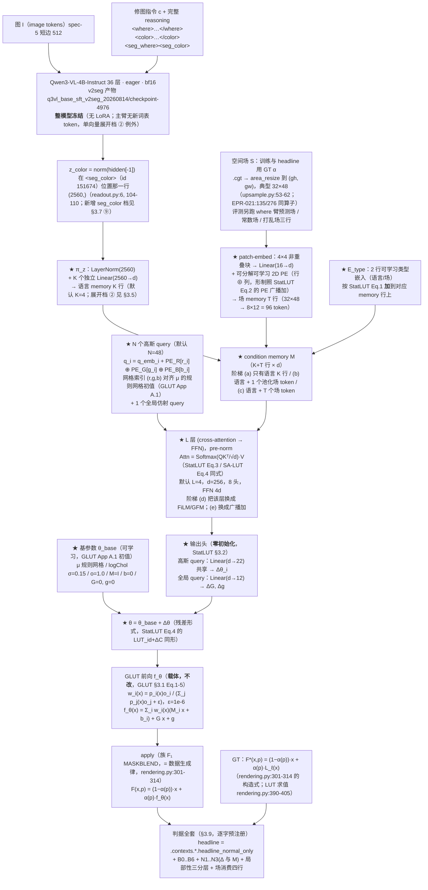

# 实验：高斯 Query 双条件解码器（EPR-029）

状态：提案（待 grill-me + 用户定稿）。**what 分支，P3。**

本提案是 **新建实现**：仓库内 what 侧现有实现（`q3vl/what/`、`model/glut_repro/`、`gpu_render/`）
与一切 what 侧实验记录/结论文档按用户 2026-08-14 判定为污染源，本提案**未读、不参照、不做对照叙事**。
接入点只写「需要什么」。where 侧的 `q3vl/whereb/readout.py` 与 EPR-018~023 提案为本周新建、可引用。

外部行号与原文数值以 **2026-08-15 当日** `curl` 打开的 arXiv HTML / GitHub raw 文件为准
（清单见文末「来源清单」）。本仓库 file:line 与数据统计均于当日工作区逐条打开/重跑确认，
统计命令原样写在 §1「数据」。

---

## 跨臂冻结口径（EPR-024 ~ EPR-029 六份逐字一致；2026-08-15 主 agent 裁定）

> 本块在六份提案里**逐字相同**。正文任何一处与本块冲突，**以本块为准**。
> 表内实测数字均为本轮（2026-08-15）在只读挂载 / 工作区现场跑出，命令与出处逐条列在右列。

| 项 | 冻结值 | 依据 |
|---|---|---|
| **训练集** | `split == "train"` 且 `winner_confidence == "normal"`，**n = 93934**（style 51182 / local 42752） | 战役数据纪律「`winner_confidence=low` 不进主训与评测 GT」。本轮实测 `/mnt/nfs-ro/bc/data/datasets/sft2seg-20260804/splits/train.index.jsonl`：159215 = normal **93934** + low **65281** |
| **每步批组织** | **B = 32 样本 × Q = 256 色点 = 8192 色 / 步** | CGLUT 的**色** batch 8192 口径不变（GLUT App A.1 原句 "CGLUT is trained for 40 epochs with a batch size of 8192"），本块只固定 (B, Q) 拆分。裁定理由（形式事实）：同一步内每条 LUT 被采到的色点数从 128 变成 256（翻倍），同时一步内出现的不同 LUT 条数从 64 变成 32（减半）。`B=64 × Q=128` 降为 **EPR-024 的一条消融行**，其余五臂不再各出一次 |
| **步 / epoch** | `ceil(93934 / 32)` = **2936** | 算术（本轮 `python3` 复算） |
| **总步数** | 2936 × **40 epoch** = **117,440** | 40 epoch 照抄 GLUT App A.1；这是 U4 步数匹配的公共基准，六份全部行都对齐到它 |
| **GLUT 前向 clamp** | **双裁**；旗标 `--clamp {two,one}`，**默认 `two`**：全局分支 `Gx+g` 先单独 clamp（`glut_editor.html:574-579`），末端 `local + global` 整体再 clamp（`:606-610`） | 官方 demo 是**唯一可执行的官方参考实现**，且内嵌 **7 份训练好的 GLUT-32 权重**（`glut_editor.html:429` 的 `const EMBEDDED_MODELS`；本轮 JSON 解析：7 个模型，每个的 `cholesky_diag` 长度 = 32），实现可逐点对拍；论文 Eq.5 只写末端 clamp，**未排除**中间 clamp。「论文单裁」（`--clamp one`）降为**共用消融行**，只在 **EPR-024 §4** 出一次，其余五臂引用该行 |
| **`L_hc` 在 `C→0` 处** | `h = (a, b) / max(C, ε_C)`，**且**整项乘硬 mask `1[C ≥ ε_C]`，`ε_C = 1e-3`；被 mask 的点数每步落盘 `n_hc_masked` | GLUT Eq.7 未给保护，该处理属 **NOVEL 数值**。六份统一取本档。「不 mask、只加 ε」降为 **EPR-024 的一条消融行**（`--no-hc-mask`），其余五臂不再各出一次 |
| **headline 图像形成式** | **`Î_i = (1 − α_i) ⊙ I_i + α_i ⊙ f̂_i(I_i)`**，六份统一 | 判据 §B 逐字。跨臂配对 Δ 必须在**同一个量**上算；任何臂的其他形成式一律降为**诊断列**，并在列名旁写明与 headline 的差异 |
| **where 分支输出的消费口径** | 场来源统一为 where 臂的 **`m_pix`**；重采样算子统一为 `q3vl/where/upsample.py:54-62` 的 `area_resize`（下采 `mode="area"`、上采 `bilinear`），各臂采到自己载体需要的分辨率并把该分辨率写进 `run_config`、在 §E 表脚逐行印出。判据 §E 的三分层掩码**一律用 GT α 在短边 512 上算**，与场来源无关 | 三套口径（短边 512 / `m_low (gh,gw)` / 未指定）会让 §E 的四行在不同尺度上算、跨臂不可比。分层掩码固定在 GT α / 短边 512，保证 `E_in / E_band / E_out` 六份同尺 |
| **新建包落点** | 全部落在 **`q3vl/whatb/`**（镜像 where 侧 `q3vl/whereb/` 的「本周新建、可信」命名）。共同依赖——GLUT Eq.1-5 前向、CGLUT 生成器、CIELab / ΔE00、判据函数——**只写一份**，六臂共用；各臂自己的新模块放 `q3vl/whatb/<epr 名>/` 子包 | 避免出现两份并行的 GLUT 前向实现（口径必然漂移）。`q3vl/what2/` 这一命名作废 |
| **预注册判据键名** | `headline_normal_only`, `B0_identity`, `B1_libmean`, `B2_librandom`, `B3_bucket_retrieval`, `B4_oracle`, `N1_shuffle_delta`, `N1_shuffle_M`, `N2_irrelevant_delta`, `N2_irrelevant_M`, `N3_const_delta`, `N3_const_M` | 统一为 EPR-024 一套并补齐三负控制（原先四套写法）。键名不统一时，任一处拼写差异会让该列**静默缺席**而 `assert_criteria_ran` 仍然通过 |
| **`<seg_color>` 的 color span 编码** | 在本 EPR 的新命名空间里**自带一份实现**，**不 import `q3vl/what/` 的任何模块**；配启动断言（下方逐字） | `q3vl/whereb/readout.py:475-476` 的 `ReadoutBuilder.needs_color` 对 `("color_close", "im_end", "seg_where", "qtok")` 返回 True，`:478-487` 的 `color_ids_from_text` 在 **`:484`** 执行 `from q3vl.what.context import encode_color_span`。`q3vl/what/` 是本轮判定的污染源树，六份**一行未读、不 import** |

**`<seg_color>` 读出的启动断言（六份逐字一致）**：入口在建 dataloader **之前**，用本次基座
`checkpoint-4976` 的 tokenizer，对本 split 随机抽 **256** 条样本的 `color` 文本 `t` 逐条执行

```
ids_self = <本 EPR 自带的 color span 编码>(tok, t)     # 新命名空间，无 q3vl.what 导入
ids_ref  = tok(f"<color>{t}</color>", add_special_tokens=False).input_ids
assert len(ids_self) == len(ids_ref)                   # 先断长度
assert all(a == b for a, b in zip(ids_self, ids_ref))  # 再逐位断 token id
```

任一条不等即 `AssertionError`、拒绝开训；抽样条数与不等条数写进 `run_setup.json`。
该断言**只调用 tokenizer**，不 import 污染源树里的任何符号。

**B3 桶级检索基线（列名 `B3_bucket_retrieval`，六份逐字一致）**

- **定义**：对评测样本取其 **record 自带的 `minor`**，在 **train 里同 `minor` 桶的 lut_id 池**中
  **均匀随机取一条** `ℓ'`，预测 `f̂ = L_{ℓ'}`；R = 8 次重复，报 mean ± std，与 arm **同样本配对**。
- **不使用 `tools/data_splits/splits_presets.csv`**。本轮实测该 CSV：3522 条，`major` 由
  `minor.rsplit("_", 1)[0]` **机械**得来（**0 例外**）⇒ `"{major} / {minor}"` 只有 **77** 个不同字符串，
  单串最多被 **363** 个 lut_id 共用；且该 CSV 的 `major` 与 record 自带的 `major` 在抽样 800 条里
  **706 条不一致**。
- **定义依据（必须原样写进 RESULT 的方法节）**：**1-of-77 的桶只能给出桶判定，给不出 lut_id 的
  argmax**，所以本列**按定义是桶级下界，不是精确检索**；任何关于「检索这条路能到哪」的上界
  一律看 **B4 oracle**，不看 B3。
- **桶池实测（本轮遍历 `/mnt/nfs-ro/bc/data/datasets/sft2seg-20260804/records/shards/shard-00000.tar`
  的全部 162,359 条 record）**：record 自带 `major` **10** 类；train 的 `minor` **77** 类、
  `(major, minor)` **85** 对；record 的 `major == minor.rsplit("_",1)[0]` 只在
  **17,176 / 162,359** 条成立。train 的 77 个 minor 桶，lut_id 池大小 **min 1 / 中位 17 / max 285**，
  合计 **3149**。V_what normal-only 567 条的 `minor` **全部**被 train 桶覆盖，GT lut_id **全部**落在
  对应桶池内，桶内均匀取一条命中 GT lut_id 的期望比例 = **0.108**（61.38 / 567）；
  T_lut_unseen normal-only 252 条的 `minor` 也全部被覆盖，但 GT lut_id 落在 train 桶池内的条数
  **构造性为 0**（该 split 的 lut_id 与 train 交集为 0）。
- **另一个标签事实（写进方法节；三负控制会连带替换它）**：`instruction` 是英文句子里内嵌一个
  **中文风格名**（例：`"Please apply the 明亮活力彩 style across the photograph, …"`）。本轮抽
  train 前 6000 条：**6000/6000** 条含该中文风格名，抽样内 **1382** 个不同风格名，其中 **173** 个
  跨多个 `minor`。它与 record 的 77 个 `minor`、10 个 `major` 是**三套互不相同**的标签词表。

---

## 1. 任务

### 1.1 本实验测试的那一个结构改动（一句话）

把参数生成器 $G_\vartheta$ 从「共享 MLP（3 层）+ 5 个参数专属头」（CGLUT App A.2 形制）
**换成「$N$ 个可学习高斯 query + $L$ 层 cross-attention 解码」**，使全局语言向量 $z_{\text{color}}$
与空间场 $S$ 进入**同一个 memory**、被同一组 query 同时消费，每个 query 出一组高斯参数。
载体（GLUT 前向）、监督空间、优化器、步数、判据一律不动。

### 1.2 数据（本轮实测；命令与数字逐条给出）

统计源：`/mnt/nfs-ro/bc/data/datasets/sft2seg-20260804/splits/*.index.jsonl`（只读挂载）。
复现命令（本提案落盘当日执行）：

```bash
cd /mnt/nfs-ro/bc/data/datasets/sft2seg-20260804/splits/
jq -r '[.split,.task_type,.winner_confidence,.lut_id,.source_image_id]|@tsv' V_what.index.jsonl > V_what.tsv
# 每个集合：wc -l 给 n；awk 分别按 task_type / winner_confidence 计数、对 lut_id / source_image_id 取唯一值
awk -F'\t' '{tt[$2]++; wc[$3]++; if($3=="normal"){n++; ntt[$2]++}; l[$4]=1; s[$5]=1} END{...}' V_what.tsv
```

| 集合 | n | style(全局) | local | normal | low | normal-only n | normal-only style / local | uniq lut_id | uniq source |
|---|---|---|---|---|---|---|---|---|---|
| **V_what**（唯一选型集） | 897 | 489 | 408 | 567 | 330 | **567** | 321 / 246 | 531 | 163 |
| T_final（终测，LUT 见过） | 918 | 494 | 424 | 533 | 385 | 533 | 317 / 216 | 577 | 201 |
| **T_lut_unseen**（终测，LUT-id 不相交） | 433 | 235 | 198 | 252 | 181 | **252** | 144 / 108 | 259 | 212 |
| train | 159215 | 83671 | 75544 | 93934 | 65281 | — | — | 3149 | 27104 |

lut_id 交集（`comm -12` 逐对求，本轮核）：`train ∩ T_lut_unseen` = **0**；
`train ∩ V_what` = 531（= V_what 全部）；`train ∩ T_final` = 577（= T_final 全部）。

preset 库（`tools/data_splits/splits_presets.csv`，`wc -l` = 3523 行含表头）：
总量 **3522**，`train 3172 / val 175 / test 175`，**40 major / 77 minor**。

同图配对可用样本（`source_image_id` 分组，只数 `winner_confidence == "normal"` 行）：
V_what normal-only 有 **138** 个 source，其中 **120** 个 ≥2 个样本（最多 **12**、中位 **4**）；
T_lut_unseen normal-only 有 157 个 source，其中只有 **67** 个 ≥2 个样本 ——
**T_lut_unseen 上不做同图配对差分，只做同图负控制**。

切分：V_what 是**唯一选型集**；T_final / T_lut_unseen 每个 arm **只跑一次**。
train 全量进训练（`winner_confidence == "low"` 的 65281 条**不进主训与评测 GT**，
本战役数据纪律；主训 n 与 low 过滤口径与 EPR-024 对齐，见 NOTES 1）。

### 1.3 测试什么方法（通俗三段）

**第一段——现在的生成器长什么样。** CGLUT（GLUT 论文 §3.2 + App A.2，当日 HTML 核实）的做法是：
一个 64 维的可学习 style embedding $e_\ell$ 进来，过一个 **3 层、128 隐单元的共享 MLP 编码器**，
出一个 latent 特征；这个特征再分头喂给 **5 个参数专属头**——$\mu$ 头（2 层，输出 $3N$）、
$\Sigma$ 头（2 层，输出 $6N$）、$o$ 头（2 层，输出 $N$）、局部色彩头（**3 层**，输出 $12N$）、
全局仿射头（2 层，输出 **12**）。整条路是「一个向量 → 一堆数字」，没有 query、没有注意力，
参数之间只通过共享编码器的那一个 latent 相互看见；**空间信息进不来**（CGLUT 的条件只有 $e_\ell$）。

**第二段——参考工作的 query 解码器长什么样。** StatLUT（arXiv:2607.08227 §3.2，当日 HTML 核实）
把 LUT 生成写成一个 Transformer 的 Seq2Seq：**identity LUT 的 $N=D^3$ 个格点当 Query**，
每个 Query 加上**可学习的 3D 位置编码** $PE_R \oplus PE_G \oplus PE_B$（$\oplus$ = 广播加）；
条件侧把三条支路的特征**加上类型嵌入 $E_{type}$ 后拼成一条 condition memory $M$**，$M$ 当 Key/Value；
每个格点通过 cross-attention 自己去 memory 里取自己需要的那份信息，出一个色彩残差
$\Delta C = \mathrm{FFN}(\mathrm{Softmax}(QK^\top/\sqrt{d_k})V)$；最后
$LUT_{pred} = \mathrm{Clamp}(LUT_{id} + \Delta C, 0, 1)$。**末层 FFN 投影零初始化**，
保证初始 $\Delta C = 0$、初始映射恰是恒等。它的 decoder 是 6 层、$d_{model}=512$、8 头。
条件映射模块的参数量对照（同文 Table 6）：Simple MLP **428.97 M** / Bottleneck MLP **5.24 M** /
MR-Mapper **0.38 M**。

**第三段——本实验做什么。** 把 StatLUT 的 query 解码机制**原样搬到 GLUT 的高斯基元上**：
**一个高斯 = 一个 query**（$N$ 个），query 的初始 embedding 加「色彩位置编码」并对齐到
$[0,1]^3$ 均匀规则网格上的 $\mu$ 初值（$\mu$ 初始化照 GLUT App A.1 原文，PE 照 StatLUT Eq.2）；
memory = 「语言向量 $z_{\text{color}}$ 展开出的 $K$ 行」⊕「空间场 patch-embed 出的 $T$ 个 token」，
两组各加自己的类型嵌入 $E_{type}$（StatLUT Eq.1 的加法形式）；过 $L$ 层
(cross-attention → FFN)；每个 query 末层出 **22 维**（$\mu$3 + Cholesky $\Sigma$6 + 不透明度1 +
局部仿射 $M$9 + $b$3），另设**一个额外 query** 出全局仿射 **12 维**；**末层输出投影零初始化**，
所以 step0 的生成量恰为 0、参数恰等于 GLUT App A.1 的初始化档（$\mu$ 在规则网格上、
$\Sigma$ 各向同性 $\sigma=0.15$、$o=1.0$、$M=I$、$b=0$），加上 $G=0,g=0$ 后 step0 前向恰是恒等映射。
在同一个生成器结构里，把「$\theta$ 是否依赖 $S$」这条 P3 的唯一自由度做成一条**可叠加的融合阶梯**
(a)→(e)，每行只改一处。

### 1.4 参考工作（当日逐条打开原始来源核实；数值原文照抄）

- **StatLUT**，arXiv **2607.08227**（abs 页标题当日核对：*Multimodal 3D LUT Generation via StatLUT
  with Statistical Features for Photorealistic Style Transfer*；正文取 `arxiv.org/html/2607.08227v1`）。
  - §3.2 Eq.1：$M=\mathrm{Concat}(F_{base},F_{res},F_{global})+E_{type}$ —— **$E_{type}$ 是加法**，
    不是额外拼一段。
  - §3.2 Eq.2：$Q=W_q(LUT_{id})+(PE_R\oplus PE_G\oplus PE_B),\; K=W_k(M),\; V=W_v(M)$；
    原文注："$W_q,W_k,W_v$ are linear projections, and $\oplus$ denotes broadcast addition"；
    "a 3D Identity LUT grid ($LUT_{id}\in\mathbb{R}^{N\times3}$, $N=D^3$) acts as the Query"；
    "To preserve color lattice topology, learnable 3D positional encodings … are added to $Q$"。
  - §3.2 Eq.3：$\Delta C=\mathrm{FFN}\left(\mathrm{Softmax}\left(\frac{QK^\top}{\sqrt{d_k}}\right)V\right)$。
  - §3.2 Eq.4：$LUT_{pred}=\mathrm{Clamp}(LUT_{id}+\Delta C,0,1)$。
  - §3.2 原句："To ensure training stability, we **zero-initialize the final FFN projection layer**.
    This guarantees an initial identity mapping ($\Delta C=0$), preventing early-stage color distortion."
  - 附录实现细节原句："The Transformer decoder features **6 layers** with a hidden dimension of
    $d_{model}=512$ and **8 attention heads**. The network is optimized using AdamW for 200 epochs.
    The learning rate is initialized at $3.0\times10^{-4}$ with a weight decay of 0.05, incorporating
    a 5-epoch linear warmup followed by a cosine annealing schedule decaying to $1.0\times10^{-7}$."；
    $\lambda_{lut}=1.0,\lambda_{img}=0.5,\lambda_{mono}=5.0,\lambda_{tv}=0.0001$；$D=16$。
  - Table 6（Condition Mapping Module）参数量：Simple MLP **428.97 M** / Bottleneck MLP **5.24 M** /
    MR-Mapper **0.38 M**（正文写作 "only 0.38 M"）。
- **SA-LUT**，arXiv **2506.13465**，官方仓库 `github.com/Ry3nG/SA-LUT`（**该地址取自 arXiv abs 页
  正文链接**；检索引擎当日给出的 `zyxElsa/SA-LUT` 经 `curl` 验证为 **404**，已弃用并记入
  dropped_unverified）。默认分支 `main`，末次 push `2025-11-10T03:46:29Z`。
  - 论文 §3.2 Eq.4：$\mathrm{Attn}(Q,K)=\mathrm{Softmax}\!\left(\frac{QK^\top}{\sqrt{d}}\right)$，
    content 特征当 $Q$、style 特征当 $K,V$；输出单通道 context map $\Gamma\in[0,1]^{H\times W}$。
  - 论文 §3.1.1 Eq.1-2：$\alpha=\mathrm{Softmax}(\mathrm{MLP}(f_{concat}))$，$f_{concat}$
    **只由 style 图的 VGG 四层特征**池化拼接而来。
  - `SA-LUT/core/module/model.py:75-253` `CrossAttentionContextGenerator`：
    `base_channels=32`、`attn_channels=64`（:81-83）；可学 attention temperature
    `self.attn_temperature = nn.Parameter(torch.tensor(1.0))`（**:128**）；
    `ChannelAttention` `reduction=8`（**:277**）；
    `dynamic_out = conv_out * modulation + feat_content_full`（**:240**）；
    `out_conv` 末端 `nn.Sigmoid()`（**:158-159**）；`return context_map`（:251）。
  - `model.py:455-460`：**代码里 $\alpha$ 的来源与论文 Eq.1-2 不一致** ——
    `fused2..fused5 = adaptive_instance_normalization(content_feats[·], style_feats[·])`
    先把 content 与 style 特征做 AdaIN 融合，池化拼接后才过 classifier
    （`weight = torch.softmax(weight, dim=1)`，**:479**），即代码的 $\alpha$ **同时依赖 content 与 style**，
    论文 Eq.1-2 只写 style。
  - `model.py:501` / `model.py:512`：`combined_input = torch.cat([context_map, content], dim=1)`
    —— 空间场与图像**只在四线性查表的坐标里相遇**（train 分支与 eval 分支各一处）。
  - `SA-LUT/core/module/clut4d.py:42` `num_context_bins=2`（默认值）；`:54`
    `self.LUTs = nn.Parameter(torch.zeros(num, 3, num_context_bins, dim, dim, dim))`；
    `:82` `fused_lut = fused_lut + identity_lut.unsqueeze(0)`；`:84` `torch.clamp(fused_lut, 0, 1)`。
  - Table 4（PST50）：`w/o Context Generator` LPIPS **0.14** / H-Corr **0.38**；
    `w/o Cross-Attention` **0.13** / **0.46**；`SA-LUT` **0.12** / **0.51**。
    （**表与正文不一致**：正文写 "reduces H-Corr to 0.37"，表里是 0.38；此处照表。）
- **CSRNet**，arXiv **2009.10390**（abs 标题：*Conditional Sequential Modulation for Efficient
  Global Image Retouching*），官方仓库 `github.com/hejingwenhejingwen/CSRNet`，
  `codes/models/archs/CSRNet_arch.py`（当日 raw 打开，全文 76 行）：
  - **:8-25** `class Condition`：`nf=32`，三层 stride-2 卷积 + ReLU，
    末尾 `out = torch.mean(conv3_out, dim=[2,3], keepdim=False)` → **32 维全局向量**。
  - **:38-44** 六个 `nn.Linear(cond_nf, ·)`：`cond_scale1/2/3` 与 `cond_shift1/2/3`，
    即 **3 组 scale/shift**（前两组 `base_nf=64` 维，第三组 3 维）。
  - **:66 / :71 / :75**
    `out = out * scale.view(...) + shift.view(...) + out` —— **代码比论文多一个残差项 `+ out`**，
    等价于 $(1+\gamma)x+\beta$。
- **HDRNet**，arXiv **1707.02880**（abs 标题：*Deep Bilateral Learning for Real-Time Image
  Enhancement*；正文取 ar5iv HTML）：
  - §3.1.4 Eq.2（**广播加**）：
    $F_c[x,y]=\sigma\!\big(b_c+\sum_{c'}w'_{cc'}G^{n_G}_{c'}+\sum_{c'}w_{cc'}L^{n_L}_{c'}[x,y]\big)$
    —— 全局向量经线性映射**广播加**到局部路的每个空间位置，再过 $\sigma$（ReLU）。
    紧接的 Eq.3 是逐点 $1\times1$ 线性预测：$A_c[x,y]=b_c+\sum_{c'}F_{c'}[x,y]w_{cc'}$。
    原文同段给出尺寸："This yields a $16\times16\times64$ array of features … to produce a
    $16\times16$ map with 96 channels"。Table 1（"Details of the network architecture"）当日在
    §3.1.4 正下方核对存在。
  - §3.4.1 Eq.6-7（guide 曲线）：
    $g[x,y]=b+\sum_{c=0}^{2}\rho_c(\bm{M}_c^\top\!\cdot\phi_c[x,y]+b'_c)$，
    $\rho_c(x)=\sum_{i=0}^{15}a_{c,i}\max(x-t_{c,i},0)$ —— **16 个带阈值 ReLU**；
    原文："$\bm{M}$ is initialized to the identity and $a$, $t$, $b$, and $b$' are initialized
    such each $\rho_c$ is an identity mapping over $[0,1]$, which is necessary to avoid learning a
    degenerate $g$."
- **GLUT / CGLUT**，arXiv **2605.19889**（abs 标题：*GLUT: 3D Gaussian Lookup Table for
  Continuous Color Transformation*；正文取 `arxiv.org/html/2605.19889v1`）：
  - §3.1：参数
    $\mathbf{p}=\{\bm{\mu}_i,\bm{\Sigma}_i,o_i,\mathbf{M}_i,\mathbf{b}_i\}_{i=1}^{N}\bigcup\{\mathbf{G},\mathbf{g}\}$；
    Eq.2 $w_i(\mathbf{x})=\dfrac{p_i(\mathbf{x})o_i}{\sum_j p_j(\mathbf{x})o_j+\epsilon}$；
    Eq.5 $f(\mathbf{x})=\sum_i w_i(\mathbf{x})f_i(\mathbf{x})+f_{\text{global}}(\mathbf{x})$；
    Eq.6 $\mathcal{L}_{rec}=\|\hat{\mathbf{y}}-\mathbf{y}\|_1$；
    Eq.7 $\mathcal{L}_{hc}=C\cdot(1-\langle\hat{\mathbf{h}},\mathbf{h}\rangle)$；
    Eq.8 $\mathcal{R}_{sparse}=-\frac1N\sum_i[o_i\log(o_i+\epsilon)+(1-o_i)\log(1-o_i+\epsilon)]$；
    总损失 $\mathcal{L}_{total}=\mathcal{L}_{rec}+\lambda_{hc}\mathcal{L}_{hc}+\lambda_{sparse}\mathcal{R}_{sparse}$。
  - §4.1 原句：Adam；cosine annealing from $10^{-3}$；GLUT 20 epoch / batch **1024**；
    **CGLUT 40 epoch / batch 8192**；$\lambda_{hc}=10$、$\lambda_{sparse}=0.001$。
  - **App A.1 Initialization 原句**："Gaussian means are initialized by **distributing them
    uniformly on a regular grid covering the RGB cube $[0,1]^3$**. Covariances are initialized
    isotropically with a scale of $\sigma=0.15$ via **logarithmic Cholesky** parameters.
    **Opacities are initially set to 1.0**, and the affine color transforms are **initialized as
    identity matrices with zero bias**."
  - App A.1 学习率原句：style embeddings 与 shared geometry 参数取 **0.1×** 基础学习率，
    生成器（shared feature encoder + parameter heads）取基础学习率 $10^{-3}$；$\epsilon=10^{-6}$。
  - App A.1 训练色采样原句："We uniformly sample the full 8-bit RGB space to construct a $128^3$
    training set, **reserving the remaining colors for evaluation**"。
  - App A.1 硬样本挖掘原句："from **epoch 5 to 20**, the mining ratio of samples with the highest
    $L_1$ errors is linearly increased from **10% to 40%**"。
  - **App A.2**（本臂要替换掉的那个结构）："a shared encoder, consisting of **three linear layers
    with 128 (64 for 'small' setup) hidden units** each … the head responsible for mean values
    $\bm\mu$ comprises **two linear layers** … the corresponding head outputs **12** parameters
    (9 for the matrix and 3 for the bias). All the parameter heads have the same structure as the
    mean head with two linear layers, **except for the local color head, which has three linear
    layers**."；条件 embedding $\mathbf{E}\in\mathbb{R}^{L\times D}$，$D=64$（§3.2）。
  - Table 9（高斯数消融）：#Gaussian **8/16/32/64/128** → #Params **188/364/716/1420/2828**
    （逐格与 $22N+12$ 相符：$22\cdot8+12=188$，$22\cdot128+12=2828$）。**格点里没有 48**，
    本项目的 $N=48\Rightarrow 22\cdot48+12=1068$ 是算术外推。
  - App B.3 Table 7（21 个 LUT 对、MIT5K 100 图，PSNR↑）：
    CGLUT-32L (Full) $\alpha=0$ **48.67** / $\alpha=0.4$ **31.16** / $\alpha=1$ **47.95**；
    CGLUT-32L (Shared Geo.) $\alpha=0$ 47.36 / $\alpha=0.4$ **34.67** / $\alpha=1$ 46.18。
    同节原句："**no additional constraints were applied to optimize blending during the training
    of all models**; thus, these results reflect the inherent blending capabilities of different
    LUT representations."
  - 全文检索 `permut` / `exchange`：**零命中** —— 论文对「$N$ 个高斯可互换 / query 与高斯的对应关系」
    无任何讨论（这是本臂特有诊断的动机，见 §3.6）。
- **DNI**，arXiv **1811.10515**（abs 标题：*Deep Network Interpolation for Continuous Imagery
  Effect Transition*；正文取 ar5iv HTML）：
  - §3 假设原句："We assume that their parameters $\theta_A$ and $\theta_B$ have a '**strong
    correlation**' with each other, i.e., the **filter orders and filter patterns in the same
    position** of $G^A$ and $G^B$ are similar. … This assumption provides the possibility for
    meaningful interpolation."
  - §3.2 原句："Fine-tuning, however, can help to maintain the filters's **order and pattern**. …
    The 'high correlation' between the parameters of these two networks provides the possibility
    for meaningful interpolation."（未微调时"filter orders among channels and filter patterns in
    the corresponding positions could be very different"）。
- **Neural Preset**，arXiv **2303.13511**（abs 标题：*Neural Preset for Color Style Transfer*；
  正文取 ar5iv HTML）：
  - Fig.8 说明原句："Building our two-stage pipeline via **two CNNs, e.g., two autoencoders (UNet)**,
    causes our SSL training to **converge to a trivial solution**, where the first stage can be any
    function, and the second stage is an **identity function w.r.t. the style image**."；
    正文 §消融原句："using DNCM instead of CNN for color mapping prevents our self-supervised
    training strategy from converging to a trivial solution."
  - 附录 A Eq.13：$\mathbf{I}_s=S_2^*(\phi,\mathbf{I}_s),\ \phi:=S_1(\mathbf{I}_c)$
    —— $S_2^*$ 直接输出 $\mathbf{I}_s$、完全忽略另一个输入 $\phi$。
- **本仓库 query 机制**（当日逐行打开）：`q3vl/whereb/amort/uniq4.py:76`
  `model.resize_token_embeddings(base_vocab + self.n_qtok + n_aux)`；`:79`
  `self.q_ids = tuple(range(base_vocab, base_vocab + self.n_qtok))`；`:105-113` embedding
  forward hook（`mask = ids >= base_vocab`，`emb.register_forward_hook(_hook)` 在 **:113**）；
  `:148` `items2 = [replace(it, where_ids=tuple(it.where_ids) + ids) for it in items]`
  —— query id **追加在完整回复之后**。同机制已被 EPR-021 PROPOSAL.md:339 与
  EPR-019 PROPOSAL.md:426-428 引作读出消融档。
- **本仓库读出接缝**（当日打开）：`q3vl/whereb/readout.py:6`
  `h_cond = norm(hidden_states[-1])[<position>]  # (2560,)`；`:104-110` `KNOWN_IDS`（
  `SEG_WHERE_TOK: 151673`、**`SEG_COLOR_TOK: 151674`**、`IM_END_TOKEN: 151645`）；
  `:180-208` `SegTokenIds.from_tokenizer`（用 tokenizer 现取、字面 id 只做交叉校验）；
  `:339-343` `seg_where` 计划（`seq = w + c + [seg_where]`，读最后一个位置）；
  `:354-362` `qtok` 计划（`seq = w + c + [seg_where]`，K 个 query id 由 wrapper 追加，
  `n_appended=k`）；`:369-380` `verify_plan` 运行时断言「记录的下标确实携带它声称的 token」；
  `:396-423` `readout_hidden` / `readout_vector`。
  **`READOUT_KINDS`（`:90-92`）当前是 `("seg_where","where_span_pool","where_close",
  "color_close","im_end","qtok")` —— 没有 `seg_color` 档**，本臂需要新增（见 §3.7 接入表 ⑨）。
- **本仓库数据生成律**（当日打开）：`dataset_build/src/construct/rendering.py:301-314`
  —— `mask is None → output = edited`；否则
  `mixed = before*(1-alpha) + edited*alpha`，再
  `torch.where(alpha==0, before, torch.where(alpha==1, edited, mixed))`；
  `rendering.py:390-405` `_apply_lut`：`.cube` 网格经 `grid_sample(mode="bilinear",
  padding_mode="border", align_corners=True)` 求值，返回 `{"axis_order": "bgr"}`。
- **本仓库场与算子**（当日打开）：`q3vl/where/fpre.py:45-49`
  `grid_from_geometry` → `(grid_h, grid_w) = (H/16, W/16)`（短边 512 → 典型 `32×48`）；
  `q3vl/where/upsample.py:53-62` `area_resize`：下采 `F.interpolate(mode="area")`、
  上采 `bilinear, align_corners=False`（EPR-021 PROPOSAL.md:135/276 的场读出与 GT 下采同用此算子）。
- **基座**：`/home/bc/data/runs/q3vl_base_sft_v2seg_20260814/checkpoint-4976`
  （当日 `ls` 确认存在；同目录另有 checkpoint-2488/3500/4000/4500）。

### 1.5 解决什么问题（P3；只陈述已核实事实，不下结论）

- **形式事实（P3 的唯一自由度）**：$\mathcal{G}:(z\in\mathbb{R}^d,\ S\in\mathbb{R}^{H'\times W'\times k})\to\Theta$，
  「$\Theta$ 是否依赖 $S$」写成三档：
  (a) $\theta=\mathcal{G}(z)$（$S$ 只在 apply 期进入）；(b) $\theta=\mathcal{G}(z,\mathrm{pool}(S))$；
  (c) $\theta(p)=\mathcal{G}(z,S(p))$。
- **已核实的四篇空间自适应工作里，全局条件与空间场是结构上解耦的两条路**：
  - SA-LUT：$\alpha$（基混合系数）由 style 特征给（论文 §3.1.1 Eq.1-2）；$\Gamma$（空间场）由
    content-style cross-attention 给（§3.2 Eq.4）；两者**第一次相遇是四线性插值本身**
    （`model.py:501/512` 的 `torch.cat([context_map, content])`）。
  - HDRNet：全局路与局部路在 §3.1.4 Eq.2 相遇，形式是**广播加**（全局向量线性映射后加到
    每个空间位置）——不是「全局向量生成空间分支的权重」。
  - CSRNet：条件向量只作用在**逐像素 $1\times1$ 卷积的 scale/shift** 上（`CSRNet_arch.py:66/71/75`），
    **无空间维**。
  - StatLUT：条件 memory 完全**空间无关**（Lab-Extractor 的统计特征，论文摘要原句
    "spatially-agnostic statistical features"）。
- **上述四篇里没有任何一篇的空间条件来自语言**（SA-LUT / HDRNet / CSRNet / StatLUT 的条件源分别是
  style 图、输入图、输入图、输入图统计量；StatLUT 的 H-Diffuser 由文本合成**统计特征**，
  合成对象仍是空间无关的 2304 维统计量，不是空间场）。
- **已核实的塌缩形制**：Neural Preset Fig.8 —— 把受限的 DNCM 换成两个 UNet 后，自监督训练塌成
  平凡解（第二阶段成为对 style 图的恒等函数、第一阶段可以是任意函数）。本臂据此设**塌缩守卫列**
  （§3.8）。
- **本臂在设计空间里的位置**：D3「条件→参数生成器结构」一行 —— 从
  「共享 MLP（3 层）+ 5 个参数专属头（CGLUT §3.2 + App A.2）」换到
  「Transformer decoder，格点/基元当 Query、条件当 K/V、末层 FFN 零初始化（StatLUT §3.2 Eq.2-4）」；
  同时在 D11「双条件融合算子」上把 cross-attention / FiLM-GFM / 广播加三个原语做成同结构下的
  阶梯行。D4（哪些参数组随条件变）、D5（监督空间）、D6（恒等锚定）、D12（正则族）、
  D13（训练课程）**全部与 EPR-024 对齐、本臂不动**。

---

## 2. 模型

### 2.1 模型图（★ = 本次唯一结构改动挂点；灰 = 冻结，一字不改）



### 2.2 模型伪代码

```python
# ── 冻结：整个 Qwen3-VL（v2seg checkpoint-4976）。可训：以下全部 ──────────────
N, d, L, K, H = 48, 256, 4, 4, 8          # 高斯数 / 宽度 / 层数 / 语言行数 / 头数
GRID = (4, 4, 3)                          # 4*4*3 = 48，μ 的规则网格因子分解（NOVEL，见 §3.4）

# --- query 侧 ---------------------------------------------------------------
q_emb   = Parameter(randn(N + 1, d) * 0.02)      # N 个高斯 query + 1 个全局仿射 query
PE_R, PE_G, PE_B = Parameter(zeros(4, d)), Parameter(zeros(4, d)), Parameter(zeros(3, d))
theta_base = GLUTBase(N)                          # μ/logChol/o_logit/M/b/G/g，GLUT App A.1 初值

# --- memory 侧 ---------------------------------------------------------------
ln_z    = LayerNorm(2560)
proj_z  = ModuleList([Linear(2560, d) for _ in range(K)])   # 展开档 ①（默认）
patch   = Linear(4 * 4, d)                                  # 场 patch-embed，4×4 非重叠块
PE_row, PE_col = Parameter(zeros(32, d)), Parameter(zeros(32, d))
E_type  = Parameter(zeros(2, d))                            # 0 = 语言行，1 = 场行

# --- 解码器 -------------------------------------------------------------------
layers  = ModuleList([XAttnFFN(d, H, ffn=4 * d) for _ in range(L)])  # pre-norm
head_g  = Linear(d, 22);  zeros_(head_g.weight); zeros_(head_g.bias)   # ★ 零初始化
head_a  = Linear(d, 12);  zeros_(head_a.weight); zeros_(head_a.bias)   # ★ 零初始化

def build_memory(z_color, S, rung):                 # rung ∈ {"a","b","c"}
    rows_z = stack([p(ln_z(z_color)) for p in proj_z])          # (K, d)
    rows_z = rows_z + E_type[0]
    if rung == "a":
        return rows_z
    if rung == "b":
        s = area_resize(S[None, None], (4, 4))[0, 0]            # 池化到 1 个 token 的输入
        rows_s = patch(s.reshape(1, 16)) + E_type[1]            # (1, d)
        return cat([rows_z, rows_s])
    P  = unfold_4x4(S)                                          # (T, 16), T = (gh/4)*(gw/4)
    rows_s = patch(P) + PE_row[r_idx] + PE_col[c_idx] + E_type[1]
    return cat([rows_z, rows_s])                                # (K + T, d)

def generator(z_color, S, rung="c"):
    q = q_emb.clone()
    q[:N] = q[:N] + PE_R[ri] + PE_G[gi] + PE_B[bi]              # StatLUT Eq.2 的广播加
    M = build_memory(z_color, S, rung)
    for lyr in layers:                                          # 阶梯 (d)/(e) 在这里换算子
        q = lyr(q, M)                                           # q ← q + FFN(XAttn(q, M))
    dtheta = head_g(q[:N])                                      # (N, 22)，step0 恒为 0
    dglob  = head_a(q[N])                                       # (12,)，step0 恒为 0
    return theta_base + (dtheta, dglob)                         # StatLUT Eq.4 的残差形式

def forward(image, instruction, S):
    z_color = frozen_vlm_readout(image, instruction, pos="<seg_color>")   # (2560,) 无梯度
    theta   = generator(z_color, S)
    f       = glut_forward(theta)                               # GLUT §3.1 Eq.1-5，载体不改
    return f
```

### 2.3 冻结 / 可训清单

| 组件 | 状态 | 依据 |
|---|---|---|
| Qwen3-VL-4B-Instruct 全部（视觉塔 + 语言塔 + embedding） | **冻结** | 本战役共同约束；条件向量 $z_{\text{color}}$ 离线全量缓存（形制照 `q3vl/whereb/gencontext.py:122, 168` 的缓存记 `checkpoint` 字段） |
| `q_emb`（$N{+}1$ 个 query）、`PE_R/PE_G/PE_B`、`theta_base` | **可训，0.1× 基础 lr** | CGLUT App A.1 原文对 "style embeddings and shared geometry parameters" 用 0.1× 基础 lr；本臂的 query embedding + 色彩 PE + $\theta_{base}$ 是唯一持有几何先验的非生成参数，取同一档 —— **NOVEL 映射**，理由见 §3.5 |
| `π_z`（`ln_z` + K 个 Linear）、`patch`、`PE_row/PE_col`、`E_type`、`layers`、`head_g`、`head_a` | **可训，基础 lr $10^{-3}$** | CGLUT App A.1：生成器（shared feature encoder + parameter heads）取基础 lr $10^{-3}$ |
| `head_g` / `head_a` 的 weight 与 bias | **零初始化** | StatLUT §3.2 原句 "zero-initialize the final FFN projection layer … guarantees an initial identity mapping" |
| where 臂（预测场来源） | **不训练、不进本臂梯度** | 主臂训练与 headline 用 **GT α**（隔离 what 侧，判据 §B）；预测场只在场消费四行的评测里出现 |

### 2.4 参数量（逐项算术，随提案冻结；与 EPR-024 的 MLP 生成器并排记录）

$N=48,\ K=4$。

| 档 | 逐项 | 合计 |
|---|---|---|
| **本臂 d=256, L=4**（默认） | q_emb 49·256=12,544；色彩 PE (4+4+3)·256=2,816；π_z LN 5,120 + 4·(2560·256+256)=2,622,464；patch 16·256+256=4,352；场 PE 64·256=16,384；E_type 512；每层 [attn 4·(256²+256)=263,168 + FFN 263,168+262,400 + 2·LN 1,024] = 789,760，×4 = 3,159,040；head_g 256·22+22=5,654；head_a 256·12+12=3,084；θ_base 22·48+12=1,068 | **≈ 5.83 M** |
| **本臂 d=128, L=2** | q_emb 6,272；色彩 PE 1,408；π_z 5,120+4·327,808=1,316,352；patch 2,176；场 PE 8,192；E_type 256；每层 198,272 ×2 = 396,544；head_g 2,838；head_a 1,548；θ_base 1,068 | **≈ 1.74 M** |
| **EPR-024 参照：CGLUT App A.2 MLP 生成器**（$D{=}64$，128 隐） | π LN 5,120 + Linear(2560→64) 163,904；共享编码器 3 层 (8,320+16,512+16,512)=41,344；μ 头 (16,512+18,576)=35,088；Σ 头 (16,512+37,152)=53,664；o 头 (16,512+6,192)=22,704；局部色彩头 3 层 (16,512+16,512+74,304)=107,328；全局头 (16,512+1,548)=18,060 | **≈ 0.45 M** |

倍数（分母 = EPR-024 主臂实测 **447,212**，本轮逐项重算两遍）：
$5{,}833{,}038/447{,}212 = \mathbf{13.04\times}$（d=256,L=4,K=4）、
$1{,}736{,}654/447{,}212 = \mathbf{3.88\times}$（d=128,L=2,K=4）。
其中 $\pi_z$（$2560\to K\cdot d$）单项就占 **2,627,584 / 1,316,352**。
$K{=}1$ 档：$\pi_z$ 降到 **660,736 / 332,928**，总参
**3,866,190 ≈ 3.87 M ⇒ 8.65×**（d=256,L=4）、**753,230 ≈ 0.75 M ⇒ 1.68×**（d=128,L=2）。
（上一稿把 d=256/L=4/K=1 的倍数写成 3.9×，那是 d=128/L=2/**K=4** 那一行的数；本轮已订正。）
**这三行数字必须与 EPR-024 的实测参数量、每步墙钟时间并排落盘**（U4 步数匹配；禁跨步数比较）。

---

## 3. 数学公式与优化器 + 改动怎么接进来

### 3.1 载体：GLUT 前向（不改，逐行照 GLUT §3.1 Eq.1-5）

$$d_i(\mathbf{x})=(\mathbf{x}-\bm{\mu}_i)^\top\bm{\Sigma}_i^{-1}(\mathbf{x}-\bm{\mu}_i),\qquad
p_i(\mathbf{x})=\frac{1}{\sqrt{(2\pi)^3|\bm{\Sigma}_i|}}e^{-\frac12 d_i(\mathbf{x})}$$
$$w_i(\mathbf{x})=\frac{p_i(\mathbf{x})\,o_i}{\sum_{j=1}^{N}p_j(\mathbf{x})\,o_j+\epsilon},\qquad \epsilon=10^{-6}\ \text{(App A.1)}$$
$$f_\theta(\mathbf{x})=\sum_{i=1}^{N}w_i(\mathbf{x})\,(\mathbf{M}_i\mathbf{x}+\mathbf{b}_i)
+\underbrace{\mathrm{clamp}(\mathbf{G}\mathbf{x}+\mathbf{g},0,1)}_{\text{全局分支先单独裁（demo :574-579）}},
\qquad \hat{\mathbf{y}}=\mathrm{clamp}(f_\theta(\mathbf{x}),0,1)\ \text{（末端再裁，demo :606-610）}$$

**默认双裁（`--clamp two`，跨臂冻结口径块）**；`--clamp one`（论文 Eq.4/5 的单裁）是
EPR-024 §4 的六臂共用消融行，本臂引用该行、不另出。

$\bm{\Sigma}_i=L_iL_i^\top$（下三角、对角过 softplus）、$o_i=\sigma(\text{logit})$、PDF 走对数域、
**双裁 clamp** —— 这四条来自 GLUT 官方交互 demo，**本轮自己重新打开并逐行核对**：
`https://color.cvc.uab.cat/assets/html/glut_editor.html` → **HTTP 200，157,922 字节 / 1,217 行**
（sha256 `863bb1cb…47c2`）。上一稿写的「打不开、`curl` 返回 000、记入 dropped_unverified」是**误判**：
该站点只发端实体证书、**不发中间证书**（`openssl s_client` 显示 `depth=0 CN=*.cvc.uab.es`，
签发者 `GEANT TLS RSA 1`），默认 CA 库因此 `unable to get local issuer certificate` ⇒ `curl` 返回 000；
本轮按 AIA 取回中间证书 `http://crt.harica.gr/HARICA-GEANT-TLS-R1.cer`（HTTP 200，1,545 B）
并入 CA bundle 后**完整校验通过**取回（不是 `-k` 跳过校验），站点从未下线。
逐行核对命中：`:429` `const EMBEDDED_MODELS`（内嵌 **7 份训练好的 GLUT-32 权重**，本轮 JSON 解析：
7 个模型、每个 `cholesky_diag` 长度 32）、`:441` `this.epsilon = 1e-6`、`:446-449` `softplus`、
`:457-465` `buildCholeskyMatrix`（对角 Softplus、非对角原样）、`:496` det 退化返单位阵、
`:520-522` Σ 对角抖动 `+ε`、`:526` `log(Math.max(det, eps))`、`:527` `sigmoid(opacities_logit)`、
`:544-545` 对数域 PDF、`:565` `w/(sum+eps)`、**`:574-579` 全局分支先单独 clamp**、
**`:606-610` 末端整体再 clamp**。
⇒ 这四条**作为本提案的独立外部事实**引用；原 `dropped_unverified` 里的该条已删除。
论文侧可核实的 Eq.1-5 数学形式与参数集合见 §1.4。

apply 期（族 $\mathcal{F}_1$ MASKBLEND，= 数据生成律本身）：
$$\hat F(\mathbf{x},p)=(1-\alpha(p))\,\mathbf{x}+\alpha(p)\,f_\theta(\mathbf{x}),\qquad
F^\ast(\mathbf{x},p)=(1-\alpha(p))\,\mathbf{x}+\alpha(p)\,L_\ell(\mathbf{x})$$
（`rendering.py:301-314`；style 样本 $\alpha\equiv1$。）

### 3.2 生成器（**本次唯一结构改动**）

**query 侧。** 令 $N=\prod_{k}n_k$，$(n_R,n_G,n_B)$ 是 $\mu$ 规则网格的因子分解
（$N{=}48\Rightarrow(4,4,3)$；$N{=}32\Rightarrow(4,4,2)$；$N{=}64\Rightarrow(4,4,4)$）。
第 $i$ 个高斯的网格索引记 $(r_i,g_i,b_i)$，其 $\mu$ 初值 = 该网格点在 $[0,1]^3$ 上的坐标
（GLUT App A.1 "uniformly on a regular grid covering the RGB cube"）。query：
$$q_i^{(0)}=\mathrm{emb}[i]+PE_R[r_i]\oplus PE_G[g_i]\oplus PE_B[b_i],\quad i=1..N;\qquad
q_{N+1}^{(0)}=\mathrm{emb}[N{+}1]$$
$\oplus$ = 广播加（StatLUT Eq.2 原文定义）。$q_{N+1}$ 是全局仿射 query，不加色彩 PE。

**memory 侧。** 语言行：$\;\mathbf{m}^z_k=W^{(k)}\,\mathrm{LN}(z_{\text{color}})+E_{type}[0],\ k=1..K$。
场行：$S$ 切 $4\times4$ 非重叠块得 $T$ 块，
$\;\mathbf{m}^s_t=W_p\,\mathrm{vec}(P_t)+PE_{row}[r_t]+PE_{col}[c_t]+E_{type}[1]$。
$$M=\big[\mathbf{m}^z_1;\dots;\mathbf{m}^z_K;\ \mathbf{m}^s_1;\dots;\mathbf{m}^s_T\big]\in\mathbb{R}^{(K+T)\times d}$$
（$E_{type}$ 用**加法**，照 StatLUT Eq.1 原式；不是额外拼一段。）

**解码。** $L$ 层，每层 pre-norm 的 (cross-attention → FFN)，残差：
$$q^{(l+\frac12)}=q^{(l)}+W_o\,\mathrm{Softmax}\!\left(\frac{(W_q\,\mathrm{LN}(q^{(l)}))(W_kM)^\top}{\sqrt{d/H}}\right)(W_vM),
\qquad q^{(l+1)}=q^{(l+\frac12)}+\mathrm{FFN}(\mathrm{LN}(q^{(l+\frac12)}))$$
（同式在 StatLUT Eq.3 与 SA-LUT §3.2 Eq.4 两处出现；SA-LUT 代码在分母上另乘一个可学 temperature，
`model.py:128/221` —— 该项列为消融行，主臂不带。）

**输出（残差 + 零初始化）。**
$$\Delta\theta_i=W_g\,q_i^{(L)}+b_g\ \ (i\le N),\qquad (\Delta\mathbf{G},\Delta\mathbf{g})=W_a\,q_{N+1}^{(L)}+b_a$$
$$\theta=\theta_{\text{base}}+\big(\{\Delta\theta_i\},\Delta\mathbf{G},\Delta\mathbf{g}\big),\qquad
W_g,b_g,W_a,b_a\ \textbf{全部零初始化}$$
形式与 StatLUT Eq.4 的 $LUT_{pred}=\mathrm{Clamp}(LUT_{id}+\Delta C,0,1)$ 同构：
**step0 恒有 $\Delta=0$**，$\theta=\theta_{\text{base}}$。$\theta_{\text{base}}$ 取 GLUT App A.1 初值
（$\mu$ 规则网格、$\Sigma$ 各向同性 $\sigma=0.15$ 的对数 Cholesky、$o=1.0$、$\mathbf{M}=I$、$\mathbf{b}=0$）
再加 $\mathbf{G}=0,\mathbf{g}=0$，于是 $\sum_i w_i=1\Rightarrow f_{\theta_{\text{base}}}(\mathbf{x})=\mathbf{x}$
（形式化命题 2）。**step0 前向恰是恒等映射，且与条件无关。**

> $\mathbf{G}=0,\mathbf{g}=0$ 是 **NOVEL**：GLUT App A.1 只写 "the affine color transforms are
> initialized as identity matrices with zero bias"，未区分局部仿射 $\mathbf{M}_i$ 与全局仿射
> $\mathbf{G}$；若 $\mathbf{G}=I$ 则 $f=2\mathbf{x}$，与「初始恒等」的残差形制矛盾。
> 理由：StatLUT 的零初始化机制要的是「初始 = 恒等」，$\mathbf{G}=0$ 是唯一满足它的取法。
> 记 NOTES 3。

### 3.3 融合阶梯（叠加式；每行只改一处；同步数并排）

| 行 | 改的那一处 | memory / 算子 | $\theta$ 与 $S$ 的关系（对形式化 §3.1 三档的映射） | 对照基准 |
|---|---|---|---|---|
| **(a)** | memory 只含语言 | $M=[\mathbf{m}^z_{1..K}]$，cross-attention | $\theta=\mathcal{G}(z)$ —— **§3.1 档 (a)** | EPR-024（MLP 生成器） |
| **(b)** | memory 加 1 个池化场 token | $M=[\mathbf{m}^z_{1..K};\mathbf{m}^s_{\text{pool}}]$，cross-attention | $\theta=\mathcal{G}(z,\mathrm{pool}(S))$ —— **§3.1 档 (b)** | (a) |
| **(c)** | memory 加 $T$ 个场 token（**本臂默认**） | $M=[\mathbf{m}^z_{1..K};\mathbf{m}^s_{1..T}]$，cross-attention | $\theta=\mathcal{G}(z,S)$ —— **每图仍只有一组 $\theta$**，是 §3.1 档 (b) 与 (c) 之间的一档（**不是** $\theta(p)$） | (b) |
| **(d)** | cross-attention 换 **FiLM / GFM** | $\bar m=\mathrm{mean}(M)$；$(\gamma,\beta)=\mathrm{MLP}(\bar m)$；$q\leftarrow(1+\gamma)\odot q+\beta$ | 与 (b) 同档（算子只吃单向量） | **(b)**，不是 (c) |
| **(e)** | cross-attention 换 **广播加** | $\bar m=\mathrm{mean}(M)$；$q\leftarrow\sigma\!\big(b+W'\bar m+Wq\big)$，$\sigma=$ ReLU | 与 (b) 同档 | **(b)**，不是 (c) |

- (d) 的形式照 **CSRNet `CSRNet_arch.py:66`** 的 `out * scale + shift + out`（= $(1+\gamma)x+\beta$
  的残差形式），$(\gamma,\beta)$ 由**两个独立 Linear** 从同一条件向量出（`:38-44` 的
  `cond_scale*` / `cond_shift*` 成对形制）。
- (e) 的形式照 **HDRNet §3.1.4 Eq.2**：全局项经 $W'$ 线性映射后**加**到局部项上，再过 $\sigma$。
  这里的「局部项」是 query 自身、「全局项」是池化后的 memory。
- **(d)/(e) 的对照基准写死为 (b)**：FiLM 与广播加两个算子的输入是单个条件向量，吃不了 token
  序列；若拿 (c) 作基准，一行就同时改了「算子」与「场粒度」两处，违反叠加式。这条**不是**
  对阶梯的解释，是对「每行只改一处」的记账约束。
- **形式事实（写明，供读数字时对照，不作预期）**：在族 $\mathcal{F}_1$ 与函数值空间监督
  （对 $\mathbf{x}$ 均匀采样）下，目标 $L_\ell$ 与 $\alpha$ **无关**；$\alpha$ 只在图像空间损失
  / 图像相关色彩查询集 $\mathcal{X}_{\text{img}}$ 里作为逐点权重出现
  （`rendering.py:311` 的同构）。两种采样分布在 §3.4 各占一行（主臂 = 均匀，与 EPR-024 逐位一致）。

### 3.4 损失函数（照抄 CGLUT，不增不减）

对每个样本 $i$（LUT $\ell_i$）与采样色 $\mathbf{x}$，$\hat{\mathbf{y}}=f_{\theta_i}(\mathbf{x})$、
$\mathbf{y}=L_{\ell_i}(\mathbf{x})$：

```
L_rec    = ‖ ŷ − y ‖₁                                                   # GLUT Eq.6
L_hc     = C · (1 − ⟨ĥ, h⟩)      ，C = √(a²+b²) 取目标色的彩度            # GLUT Eq.7
R_sparse = −(1/N) Σ_i [ o_i·log(o_i+ε) + (1−o_i)·log(1−o_i+ε) ]          # GLUT Eq.8
L_total  = L_rec + 10 · L_hc + 0.001 · R_sparse                          # GLUT §4.1
```

| 项 | 值 | 出处 |
|---|---|---|
| $\lambda_{hc}$ | **10** | GLUT §4.1 原文 |
| $\lambda_{sparse}$ | **0.001** | GLUT §4.1 原文 |
| $\epsilon$ | **$10^{-6}$** | GLUT App A.1 原文（Eq.2 与 Eq.8 共用） |
| 训练色采样 | 全 8-bit RGB 均匀采 **$128^3$** 作训练，其余色留评测 | GLUT App A.1 原文 |
| 硬样本挖掘 | epoch **5→20**，最高 $L_1$ 误差样本比例 **10%→40%** 线性上升 | GLUT App A.1 原文 |
| 监督空间 | **函数值空间**（图像空间只用于评测） | GLUT §3.1 / App A.1 |
| $C\to0$ 处 $\mathbf{h}$ 未定义 | 原文未给保护。**六份统一取 EPR-024 档**（跨臂冻结口径块）：$\mathbf{h}=(a,b)/\max(C,\varepsilon_C)$ **且**整项乘硬 mask $\mathbb{1}[C\ge\varepsilon_C]$，$\varepsilon_C=10^{-3}$，被 mask 点数每步落盘 `n_hc_masked` | **NOVEL 数值**；上一稿的「$C<10^{-6}$ 时取 $\mathbf{h}=(0,0)$、无 mask」作废，改与其余五臂同档（NOTES 5） |
| 图像相关采样档（消融行，不进主臂） | $\mathbf{x}$ 按 $\alpha(p)$ 加权的 5-bit/通道量化直方图采 | **NOVEL 消融**，理由见 §3.3 末条 |

**本臂不新增任何 loss 项。** 3D/4D TV、单调、插值一致性、雅可比正则、对抗项一律不加
（那些属 D7/D12，是别的 EPR 的变量）。

### 3.5 优化器参数（照抄 CGLUT App A.1 / §4.1；不可照搬处逐条标 NOVEL）

| 项 | CGLUT 原文值 | 本臂取值 | 说明 |
|---|---|---|---|
| 优化器 | Adam | **Adam** | 照抄（GLUT §4.1 "optimized using the Adam optimizer"） |
| 基础 lr | $10^{-3}$，cosine annealing 全程 | **$10^{-3}$，cosine** | 照抄 |
| 低 lr 参数组 | style embeddings 与 shared geometry 取 **0.1×** | **0.1× 施于 `q_emb` / `PE_R,PE_G,PE_B` / `theta_base`** | **NOVEL 映射**：本臂无 style embedding；这三组是唯一持有几何先验的非生成参数，与原文 "shared geometry parameters" 同角色。备选（全部 1× ）记 NOTES 4 |
| 训练集 | — | `train` 且 `winner_confidence == "normal"`，**n = 93934** | 跨臂冻结口径块；`low` 的 65281 条不进主训与评测 GT |
| epoch / batch | CGLUT **40 epoch / batch 8192**（batch 单位 = 色样本） | **40 epoch；$B{=}32$ 张图 × $Q{=}256$ 个色样本 $= 8192$ 色/步；`ceil(93934/32) = 2936` 步/epoch，总 117,440 步**（与 EPR-024 逐位一致） | **NOVEL 适配**：本臂一步吃多张图（每图一条 $z_{\text{color}}$），CGLUT 一步吃一个 LUT 的色样本；$B\cdot Q$ 对齐是最接近的类比。$(B,Q)$ 与步数由**跨臂冻结口径块**定死，不再「随 EPR-024 定」 |
| $\epsilon$（数值） | $10^{-6}$ | 同 | 照抄 |
| 硬样本挖掘 | epoch 5→20，10%→40% | 同（按步数比例保形） | 照抄形制；步数保形属 NOVEL 适配 |
| weight decay | GLUT/CGLUT **未给** | **0**（Adam 默认） | 诚实列出：原文未提；StatLUT 用 AdamW wd=0.05，属另一篇的配方，不混用 |
| warmup | GLUT/CGLUT **未给** | **无** | 同上；StatLUT 的 5-epoch 线性 warmup 属另一篇 |
| 梯度裁剪 | **未给** | 随 EPR-024（记录实测值） | 诚实列出 |
| 精度 | 未给 | **bf16** | 本仓库统一 |
| seed | 未给 | **20260810** | 本仓库统一 |
| checkpoint 选择 | CGLUT 无此概念 | **quick-eval 硬门 + `.contexts.all.headline_normal_only` 择优，永不读 val loss** | 本战役红线 |

**单向量展开（$z_{\text{color}}$ 是单条 (2560,)，扩成 $K$ 行）——两档各一行预注册：**

- **档 ①（默认）**：$K$ 个**独立** `Linear(2560→d)`，共享一个前置 `LayerNorm(2560)`。
  不需要重生成缓存。$K\in\{1,4,8\}$ 三格进消融。
- **档 ②**：追加 $K$ 个**可学习 query token 到 reply 末尾**、走 VLM 前向读出 $K$ 条 (2560,)，
  再各过同一个 `Linear(2560→d)`。机制照 `uniq4.py:76`（`resize_token_embeddings`）/ `:79`
  （`q_ids`）/ `:105-113`（embedding forward hook）/ `:148`（`where_ids + q_ids` 追加在完整回复之后）。
  **需重生成条件向量缓存**（缓存记 `checkpoint` 字段并在启动时断言与本次基座一致，
  形制照 `q3vl/whereb/gencontext.py:122, 168`）。
  **本臂的追加位置是 `<seg_color>` 之后**（`readout.py:354-362` 的 `qtok` 计划当前只追加到
  `<seg_where>` 之后），属 **NOVEL 适配**，理由：本臂消费的是颜色条件。

### 3.6 本臂特有诊断：query → 高斯的对应稳定性

**动机（已核实事实，不作推断）**：DNI §3 / §3.2 明写参数空间插值以「两网络在**相同位置**的
filter 顺序与 pattern 相关」为前提；GLUT 论文全文检索 `permut` / `exchange` **零命中**，
对「$N$ 个高斯是否可互换、query 索引与哪个高斯对应」无任何讨论。

**两条测量协议（均在 V_what normal-only，n=567；每条给 n 与分位）：**

1. **同条件重复前向漂移。** 固定 $(z_{\text{color}},S)$，重复前向 $R=8$ 次（bf16 归约非确定性；
   dropout 全程 0）。以 $\|\bm{\mu}^{(1)}_i-\bm{\mu}^{(r)}_j\|_2$ 为代价做匈牙利匹配，报
   $$\mathrm{drift}_r=\frac1N\#\{i:\ \mathrm{match}_r(i)\neq i\}$$
   与 $\max_i\|\bm{\mu}^{(1)}_i-\bm{\mu}^{(r)}_{\mathrm{match}(i)}\|_2$。
2. **沿条件插值路径的漂移。** $z_{\alpha_k}=(1-\alpha_k)z_a+\alpha_k z_b$，$\alpha_k=k/K$，$K=20$
   （与判据 §F 的 IP-B 同格点）。相邻两步做匈牙利匹配，报**逐步 drift**、**全路径累计 drift**
   $\sum_k\mathrm{drift}_k$，以及两列并排的位移：
   - 按索引（不匹配）：$\max_i\|\bm{\mu}_i(\alpha_{k+1})-\bm{\mu}_i(\alpha_k)\|_2$
   - 按匹配后：$\max_i\|\bm{\mu}_{\mathrm{match}(i)}(\alpha_{k+1})-\bm{\mu}_i(\alpha_k)\|_2$

   两列同时出示；只报其一无法区分「高斯真的动了」与「索引换了个位置」。

落盘键：`query_match_drift_repeat` / `query_match_drift_path` / `query_match_mu_shift_indexed` /
`query_match_mu_shift_hungarian`。**四列缺一不出板**（进 §3.9 的运行时断言 required 表）。

### 3.7 接入表（逐条可确认）

| 项 | 内容 |
|---|---|
| **改哪里** | ① **新增生成器模块**（新文件，what 侧新建目录，不 import 任何 what 侧现有文件）：内含 `GaussianQueryDecoder`（`q_emb` / `PE_R,PE_G,PE_B` / `patch` / `PE_row,PE_col` / `E_type` / `π_z` / $L$ 层 `XAttnFFN` / `head_g` / `head_a` / `theta_base`），forward 签名 `(z_color: (2560,), S: (gh,gw), rung: str) -> theta`。cross-attention 与 FFN 按 §3.2 的式子逐行实现；`head_g` / `head_a` 在 `__init__` 末尾显式 `nn.init.zeros_` 两次（weight 与 bias 各一次），并在构造后 `assert (head_g.weight.abs().max() == 0)`。② **GLUT 载体模块（不重写，直接复用）**：Eq.1-5 一律 import `q3vl/whatb/glut.py`（六臂唯一一份实现，跨臂冻结口径块）；`ε=1e-6`、`Σ` 走 Cholesky（softplus 对角）、`o` 走 sigmoid、PDF 走对数域、**双裁 clamp（`--clamp two` 默认）** —— 这四条本轮已重开官方 demo 逐行复核（行号见 §3.1，NOTES 6）。本臂新代码落 `q3vl/whatb/epr029/`。③ **条件读出**：`seg_color` 档由 **EPR-024 §3.6-① 统一新增**，本臂只消费（见本表 ⑨）；该档所需的 `<color>{text}</color>` token 编码由 `q3vl/whatb/colorspan.py` **自带一份实现**（`ReadoutBuilder.needs_color`（`readout.py:475-476`）走的 `color_ids_from_text`（`:478-487`）在 **`:484`** `from q3vl.what.context import encode_color_span`，`q3vl/what/` 是污染源树，本臂一行未读、不 import），配启动断言（逐字见跨臂冻结口径块：tokenizer 直接对拍、先断长度再逐位断 token id、256 条抽样）。④ **场输入管线（口径按跨臂冻结口径块）**：场来源统一为 where 臂的 **`m_pix`**（`gt` 档为 GT α 的同分辨率版本），重采样算子统一为 `q3vl/where/upsample.py:54-62` 的 `area_resize`（下采 `mode="area"`、上采 `bilinear`；与 where 侧、与 EPR-021:135/276 同算子、同调用形式），**采到本臂载体所需的 `(gh,gw)`**（由 `q3vl/where/fpre.py:45-49` 的 `grid_from_geometry` 给，短边 512 → 典型 32×48），该分辨率写进 `run_config` 并在 §E 表脚逐行印出。**判据 §E 的三分层掩码一律用 GT α 在短边 512 上算**，与场来源、与本臂内部的 `(gh,gw)` 无关 —— 这保证 `E_in / E_band / E_out` 与其余五臂同尺可比。⑤ **阶梯旗标**：`--rung {a,b,c,d,e}`，默认 **c**；(d)/(e) 分支在 `XAttnFFN` 里换算子，其余一字不改。⑥ **loss**：按 §3.4 三项，权重写死 10 / 0.001；`steps.jsonl` 每步落 `L_rec` / `L_hc` / `R_sparse` / `L_total` 四个键（首行缺任一即 `AssertionError`，见 ⑧）。⑦ **诊断列**：§3.6 的四个 `query_match_*` 键；另加 `zeroinit_step0_maxabs`（step0 时 $\max|\Delta\theta|$，必须 == 0）与 `ladder_row`（本 run 的阶梯行字面值）。⑧ **运行时断言**（"定义了没接线" 本战役已三次，不给第四次）：eval 启动时 `assert_criteria_ran` 的 required 表按 arm 列出必须被调用且 **n>0** 的判据函数键（清单见 §3.9 §H），任一为 0 → **拒绝出板**；训练第一步断言 `steps.jsonl` 首行同时含 `L_rec`/`L_hc`/`R_sparse`/`L_total`/`zeroinit_step0_maxabs`；`zeroinit_step0_maxabs != 0` 即 `AssertionError`（零初始化没接上，step0 不是恒等）。⑨ **读出接缝**：`q3vl/whereb/readout.py` 的 `READOUT_KINDS`（`:90-92`）**增加 `"seg_color"`**，计划构造与 `seg_where` 档（`:339-343`）同形，只把序列末尾改成 `seq = w + c + [seg_where, seg_color]`、读**最后一个**位置，`expected_ids=(tags.seg_color,)`；`verify_plan`（`:369-380`）的断言机制不动 —— 它就是"读出旗标确实指向它声称的 token"的运行时证据。`qtok` 档（`:354-362`）在本臂下把 query id 追加在 `seg_color` **之后**（新增分支，`seq.append(seg_color)`）。旗标 `--readout {seg_color,color_close,im_end,qtok}`、`--readout-qtok K`，值与解析下标一并写进 `run_setup.json`。⑩ **条件缓存**：$z_{\text{color}}$ 离线全量缓存，每条记 `checkpoint` 字段，启动时断言 == 本次基座路径（形制照 `q3vl/whereb/gencontext.py:122, 168`）。三个负控制（N1/N2/N3）的 reasoning **必须重新生成后再读出**，其缓存同样记 `checkpoint` 并断言。 |
| **不变（明确列出没动的部分）** | **载体**：GLUT 前向 Eq.1-5、$\epsilon=10^{-6}$、参数集合 $22N+12$、apply 期的 $\mathcal{F}_1$ 混合式。**监督**：函数值空间、$128^3$ 均匀训练色 / 其余色留评测、$L_{rec}+10L_{hc}+0.001R_{sparse}$、硬样本挖掘 5→20 / 10%→40%。**优化器**：Adam、cosine from $10^{-3}$、0.1× 低 lr 组的**存在性**（映射对象见 §3.5）。**数据**：切分（§1.2）、`winner_confidence=low` 不进主训与评测 GT、`train ∩ T_lut_unseen` lut_id 交集 0。**判据**：§3.9 一列不改；headline 只读 `.contexts.all.headline_normal_only`，**禁用顶层 pooled**。**基座**：Qwen3-VL v2seg checkpoint-4976 整模型冻结、无 LoRA、无新词表 token（展开档 ② 例外）。**where 侧**：`readout.py` 现有六个 kind 的行为、`verify_plan`、`readout_hidden` / `readout_vector` 逐位不动（只**新增** `seg_color` 分支）；`area_resize`、`grid_from_geometry` 一字不改。 |
| **初始化（step0 状态可预注册、可断言）** | `head_g` / `head_a` 的 weight 与 bias **全部零初始化**（StatLUT §3.2 机制）⇒ **step0 恒有 $\Delta\theta=0,\Delta\mathbf{G}=0,\Delta\mathbf{g}=0$**，$\theta=\theta_{\text{base}}$，且 $\theta$ **与 $z_{\text{color}}$、与 $S$、与阶梯行全部无关** —— 五个阶梯行 (a)…(e) 的 step0 输出**逐位相同**，且与 EPR-024（若其生成头同样零初始化）的 step0 也逐位相同。$\theta_{\text{base}}$ 取 GLUT App A.1 初值 + $\mathbf{G}=0,\mathbf{g}=0$ ⇒ $f_{\theta_{\text{base}}}=\mathrm{id}$（命题 2）⇒ **step0 的 headline 恰等于判据 §C 的 B0 identity 列**。这条是本臂最强的一条接线证据，写成断言 `zeroinit_step0_maxabs == 0` 且 `step0_headline == B0_headline`（逐样本，容差 0）。其余可训参数：`q_emb` 取 $\mathcal{N}(0,0.02^2)$（形制照 `uniq4.py:86` 的 `mean.cpu() + 0.02 * torch.randn(...)`（aux 那份在 `:98`；本轮重开文件复核，行号是 :86 不是 :88-91），本臂无词表均值可取，故只留 $0.02\cdot\mathrm{randn}$，属 **NOVEL**）；`PE_*` / `E_type` 全零初始化（零初始化的 PE 使 step0 的 query 只由 `q_emb` 决定，不引入未定尺度）；`π_z` / `patch` / `layers` 取 PyTorch 默认初始化（StatLUT 除末层 FFN 外未给其余层的初始化，不自造）。 |
| **入口（旗标；不选 = 不影响任何现有臂）** | 新 arm 名 + 新脚本（形制照 `q3vl/whereb/scripts/run_uniq4b_arm.py:29-144`：自己 `parse_known_args` 吃掉本臂旗标，把 `head_kwargs` 与 `setup.json`（含新模块与 wrapper 的 **sha256 冻结**）落进 `<out-root>/<run-name>/config/`）。**arm 名新、文件新**，任何现有臂一个字节不受影响。旗标（默认 = 主臂口径）：<br>• `--rung {a,b,c,d,e}`（默认 **c**）<br>• `--n-gauss 48`（默认 48；消融 32 / 64；网格因子分解随之 (4,4,2)/(4,4,4)）<br>• `--decoder-layers {2,4}`（默认 **4**）、`--decoder-width {128,256}`（默认 **256**）、`--decoder-heads 8`（StatLUT 附录原值）<br>• `--z-expand {proj,qtok}`（默认 **proj** = 档 ①）、`--z-expand-k {1,4,8}`（默认 **4**）<br>• `--field-source {m_low,m_pix}`（默认 **m_low**，patch 4×4；`m_pix` 档 patch 16×16，两档同为 T≈96 token）<br>• `--field-kind {gt,pred,const,shuffle}`（默认 **gt**；后三档只在评测的场消费四行里用）<br>• `--attn-temperature`（默认 **off**；on = SA-LUT `model.py:128/221` 的可学 temperature，消融行）<br>• `--zero-init-head / --no-zero-init-head`（默认 **on**；off 是消融行，同时关掉 step0 恒等断言）<br>• `--color-sampling {uniform,alpha_hist}`（默认 **uniform** = GLUT App A.1 原式）<br>• `--readout {seg_color,color_close,im_end,qtok}`（默认 **seg_color**）、`--readout-qtok K`<br>全部旗标 + 解析下标 + 基座路径 + 缓存 `checkpoint` 字段写进 `run_setup.json` 与 `loss_preregistration.json`。 |

### 3.8 塌缩守卫（Neural Preset Fig.8 形制）

**动机（已核实事实）**：Neural Preset Fig.8 记录的失败是「把受限形式换成两个 UNet 后，
自监督训练塌成平凡解：第二阶段成为对 style 图的恒等函数、第一阶段可以是任意函数」。
本臂的对应物是「生成器忽略条件」：$\theta$ 与 $z_{\text{color}}$ 无关。

**守卫列（每板必出，与判据 §D 的 N3 固定短语控制同源）**：
$$\Delta_{\text{const}}=\mathbf{H}(\text{ctrl})-\mathbf{H}(\text{true}),\qquad
M_{\text{const}}=\mathbb{E}_i\,D_{\mathcal{X}_{\text{grid}}}\big(\hat f_i^{\text{true}},\hat f_i^{\text{ctrl}}\big)$$
**判定**：$M_{\text{const}}<0.5$ **且** $|\Delta_{\text{const}}|<0.1$（两者同为 $\Delta E_{00}$ 单位）
$\Rightarrow$ 该 run 标记 `COLLAPSED=true`，**计数并落盘、板上照出、禁静默**，且该 run 不参与任何
配对 Δ 主张。两个阈值**无外部出处，属 NOVEL**（$\mathcal{X}_{\text{grid}}$ 上 GT LUT 相对 identity 的
实测 mean $\Delta E_{76}$ = 40.3，两阈值是该尺度的 ~1.2% / ~0.25%），记 NOTES 7 请用户拍板。
同一守卫对 $z=0$ 列与 $z=\bar z_{\text{train}}$ 列各出一份。

### 3.9 判据（**预注册，逐字**；本 EPR 一列不改）

> 以下 §A–§I 为本战役 what 侧预注册判据，逐字落盘。

> **What 侧判据（预注册；本战役把指标调研列为最重要一步）** —— 以下 §A–§I 六份逐字一致。

#### A. 评测集与 n（全部本轮从 `/mnt/nfs-ro/bc/data/datasets/sft2seg-20260804/splits/*.index.jsonl` 实测）

| 集合 | n | style(全局) | local | normal | low | normal-only n | normal-only style / local | uniq lut_id | uniq source |
|---|---|---|---|---|---|---|---|---|---|
| **V_what**（唯一选型集） | 897 | 489 | 408 | 567 | 330 | **567** | 321 / 246 | 531 | 163 |
| T_final（终测，LUT 见过） | 918 | 494 | 424 | 533 | 385 | 533 | 317 / 216 | 577 | 201 |
| **T_lut_unseen**（终测，LUT-id 不相交） | 433 | 235 | 198 | 252 | 181 | **252** | 144 / 108 | 259 | 212 |
| train | 159215 | 83671 | 75544 | 93934 | 65281 | — | — | 3149 | 27104 |

- `train ∩ T_lut_unseen` 的 lut_id 交集 = **0**（本轮核）。preset 库总量 3522（`tools/data_splits/splits_presets.csv`，train 3172/val 175/test 175，40 major / 77 minor）。
- 同图配对差分的可用样本：V_what normal-only 有 138 个 source，其中 **120 个 source ≥2 个样本**（最多 12、中位 4）；T_lut_unseen normal-only 只有 67 个 source ≥2 个样本（中位 1）——**T_lut_unseen 上不做同图配对差分，只做同图负控制**。
- 选型只允许用 V_what；T_final / T_lut_unseen 每个 arm 只跑一次。

#### B. Headline 定义（单一标量，供 checkpoint 选优；禁 val loss）

对样本 $i$：$\hat I_i=(1-\alpha_i)\odot I_i+\alpha_i\odot \hat f_i(I_i)$，$I_i^\ast=(1-\alpha_i)\odot I_i+\alpha_i\odot L_i(I_i)$（后者 = 数据集存的目标，`rendering.py:311`）。
$$E_i=\frac{1}{|\Omega|}\sum_{p}\Delta E_{00}\big(\hat I_i(p),\,I_i^\ast(p)\big),\qquad
\textbf{H}=\frac{1}{|S|}\sum_{i\in S}E_i,\quad S=\text{V\_what}\cap\{\text{normal}\}$$
落盘键：`.contexts.style.headline_normal_only` / `.contexts.local.headline_normal_only` / `.contexts.all.headline_normal_only`；**选优只读 `.contexts.all.headline_normal_only`，禁用顶层 pooled**（混 low 少算约 0.031，CLAUDE.md）。
`α` 的口径：headline 用 **GT α**（隔离 what 侧）；预测 α 单列 `.contexts.*.headline_predalpha`。分辨率固定（短边 512，area_resize），写进 run_config。

**函数值空间并排列（不参与选优，必出）**
$$\mathcal{E}^{\text{grid}}_i=\frac{1}{17^3}\sum_{x\in\mathcal{X}_{\text{grid}}}\Delta E_{00}\big(\hat f_i(x),L_i(x)\big),\qquad
\mathcal{E}^{\text{img}}_i=\sum_{c}h^{(i)}_c\,\Delta E_{00}\big(\hat f_i(c),L_i(c)\big)$$
$\mathcal{X}_{\text{grid}}$=17³ 均匀 sRGB 网格；$h^{(i)}$=$I_i$ 的 5-bit/通道量化直方图（取前 4096 色）。两列尺度差别很大（实测：GT LUT 相对 identity 在 17³ 网格上 mean $\Delta E_{76}$=40.3、p10=21.3、p90=61.1），**任何单列都不足以定档**。
另设 GLUT 原生的**未见颜色**列：训练采 128³ 均匀色，评测在其补集上算（GLUT App A.1）。

#### C. 平凡基线列（每条与 arm **同样本配对**，报 $\Delta$ + 95% bootstrap CI + Wilcoxon p；缺一不出板）

| 列 | 定义 | 本轮实测地板（协议见下） |
|---|---|---|
| **B0 identity** | $\hat f=\mathrm{id}$ ⇒ $\hat I=I$ | 259 条 unseen LUT 上 mean $\Delta E_{76}$ = **32.79**（p50 31.24） |
| **B1 训练集平均变换** | $\bar L(x)=\frac{1}{|\text{Lib}_{tr}|}\sum_\ell L_\ell(x)$（逐点均值仍是合法映射） | mean **25.33**（p50 23.54） |
| **B2 库内随机** | $\ell'\sim U(\text{Lib}_{tr})$，R=8 次取均值 ± std | mean **35.37** |
| **B3 最近邻检索** | (a) 纯文本：指令 embedding vs LUT `major/minor` 标签文本；(b) 同投影 $\pi$ 的 image+text embedding | 未测（须在提案里定死检索器） |
| **B4 oracle 库内最优** | $\ell^\ast=\arg\min_\ell D_{\mathcal{X}}(L_\ell,L_i)$，$\ell$ 遍历 $\text{Lib}_{tr}$ | mean **9.93**（p10 4.18 / p50 9.59 / p90 15.66 / max 41.42）= **任何检索式方案的天花板** |
| **B5 分解诊断** | (GT LUT, 预测 α) 与 (预测 LUT, GT α) 两行 | — |
| **B6 库内自身填充密度** | train LUT → 最近的另一条 train LUT | mean **10.17**（p50 10.01 / p90 16.88） |

> **实测协议（必须原样写进 RESULT 的方法节）**：9³ 均匀 sRGB 网格；每色转 CIELab（D65，sRGB EOTF）后取 L2（**$\Delta E_{76}$，非 $\Delta E_{00}$**）再对色求均值；$\text{Lib}_{tr}$ = 从 train index 随机采 2500 行得到的 **1137 个 lut_id**（非全部 3149），$T_{\text{lut\_unseen}}$ = 全部 259 个；单次运行，无方差。库几何：1137 条 LUT 在该 2187 维空间做 PCA，累计方差 90%/95%/99% 需 **15/28/99** 维。
>
> B4 与 B0/B1/B2 的量级差是本判据集的核心刻度：任何「生成优于检索」的主张必须出示 arm 相对 **B4** 的配对 Δ，而不是相对 B0/B2。

**失效模式**：B0 在 α 质量小的 local 样本上很强（必须按 $\bar\alpha=\text{mean}(\alpha)$ 分层报，分层 n 一并给）；B1 是一条与指令完全无关的固定曲线，CSRNet 的 20.47 vs 23.69 说明这条地板可以很高；B2 的 std 必须报（单次抽样噪声大）；B4 在 T_lut_unseen 上严格 >0，其值本身就是「3149 条离散 LUT 覆盖连续空间到什么程度」的答案。

#### D. 指令条件性三负控制（同图配对差分）

对每个样本构造三个扰动条件，**扰动后必须重新生成 reasoning 再读出 `<seg_color>`**（teacher-forced 原 reasoning 会让控制失效）：
| 控制 | 构造 | 输出两列 |
|---|---|---|
| N1 shuffle | 同 split 内换一条**同 task_type、不同 lut_id** 的指令 | $\Delta_{\text{shuffle}}=\mathbf{H}(\text{ctrl})-\mathbf{H}(\text{true})$；$M_{\text{shuffle}}=\mathbb{E}_i D_{\mathcal{X}_{\text{grid}}}(\hat f_i^{\text{true}},\hat f_i^{\text{ctrl}})$ |
| N2 无关词 | 换成等长的非色彩英文句（图像 caption） | $\Delta_{\text{irrel}}$、$M_{\text{irrel}}$ |
| N3 固定短语 | 全体用同一句 `Please edit this photo.` | $\Delta_{\text{const}}$、$M_{\text{const}}$ |

两列缺一不可：只报 $\Delta$ 会被「无视指令」的模型（$\Delta\approx0$ 但 $M\approx0$）与「乱动」的模型同时污染；只报 $M$ 会被参数噪声刷高（T2ONet Table 4：采样宽度 h 0→0.1 使 σ 0.7190→2.1482 而 L1 从 0.0784 劣化到 0.0979）。
统计：n=567（V_what normal-only）配对，10k bootstrap + Wilcoxon 符号秩。每个消融行都必须带 $\Delta_{\text{const}}/\Delta_{\text{shuffle}}$（CLAUDE.md 硬规定）。
另设 **条件置零列**（$z=0$）与 **训练集均值条件列**（$z=\bar z_{\text{train}}$），它们是 B1 在模型内部的对应物。

#### E. 局部性列（P2/P3 必出，三分层 + 场消费四行）

分层（按 GT α）：
$$\mathcal{E}_{\text{in}}=\underset{\alpha(p)\ge0.9}{\mathrm{mean}}\ \Delta E_{00}(\hat I,I^\ast),\quad
\mathcal{E}_{\text{band}}=\underset{0.05<\alpha(p)<0.9}{\mathrm{mean}}\ \Delta E_{00}(\hat I,I^\ast),\quad
\mathcal{E}_{\text{out}}=\underset{\alpha(p)\le0.05}{\mathrm{mean}}\ \Delta E_{00}(\hat I,I)$$
场消费四行（同 checkpoint、同步数）：**GT α / where 臂预测场 / 常数场（= 该样本 $\bar\alpha$）/ 打乱场（他样本的 α）**。
按 mask 面积 $\bar\alpha$ 分层（例如 <0.1 / 0.1–0.3 / 0.3–0.6 / >0.6）与按 mask_type（radial / band / linear / semantic）分层报，**每层给 n**。

**失效模式**：$\mathcal{E}_{\text{out}}$ 在 $\mathcal{F}_1$（mask 混合）下构造性为 0（`rendering.py:311` 的 `out[alpha==0]=before` 同构），跨族比较必须三列同看；全图 $\Delta E$ 对小面积编辑近乎失明（PPR10K 造 $\Delta E^{HC}$ 的原因）；本族现有工作对空间场**没有任何量化指标**（SA-LUT Γ / 4D LUT C / SA-3DLUT A 全是定性图），无量表可抄。

#### F. 插值质量列（P1 必出）

**协议 IP-A（有 GT）**：取同一 source 下的两条 LUT $L_a,L_b$（V_what normal-only 有 120 个 source 可用），$\alpha\in\{0,0.2,0.4,0.6,0.8,1\}$（GLUT App B.3 同格点）。GT = 函数空间线性混合 $(1-\alpha)L_a+\alpha L_b$（与「图像空间直接混合」逐点等价）。
必出四列：`ΔE00_blend(α)`（arm）、**`输出混合` 平凡列** $(1-\alpha)\hat f_a+\alpha\hat f_b$、`ΔE00(端点)`、`GLUT 外部参照`（CGLUT-32L Full α=0.4 → PSNR 31.16；Shared Geo. → 34.67；端点 48.67/47.95）。
**协议 IP-B（无 GT，指令对）**：只报形式化 §1.3 的六个路径量：$\mathcal{L}$、$\mathcal{L}_0$、$\rho$、$\bar\sigma$、$J$（不裁分位，并列出 p50/p95/p99/max）、$\mathrm{Mono}$（**并列 0.5 随机地板**）、$d_{\text{lib}}(\alpha)$、越界率 $A(\alpha)$、退化权重率。

**失效模式**：$\bar\sigma$ / ISTD 的满分解是塌缩（必须并列 $\mathcal{L}$）；$J$ 的满分解是常数生成器；$d_{\text{lib}}$ 的满分解是不动；`输出混合` 列在该口径下会大幅跑赢条件插值（按定义，误差介于端点误差与端点误差+3 dB 之间），**不出示这一列的插值结论无效**；GLUT App B.3 明写训练时不加任何混合约束，其数字是「表示本身的固有行为」。

#### G. 强度列（P1）

**不可用的做法（本轮已实测否定）**：按指令里第一个出现的程度副词分桶，与 GT LUT 幅度不分离——V_what normal-only 前 260 条（208 个唯一 LUT，17³ 网格，$\Delta E_{76}$）：`strongly` n=47 → 43.94；`restrained` n=89 → 40.26；`moderately` n=39 → 36.55；`slightly` n=5 → 43.97；`none` n=67 → 38.98；整体 mean 40.3 / p10 21.3 / p90 61.1。
**可用的构造协议**：合成强度目标 $y_u(x)=(1-u)x+u L_\ell(x)$，$u\in\{0,0.25,0.5,0.75,1\}$，报
(a) `ΔE00(f̂_u, y_u)`；(b) 幅度单调率 $\Pr[\,\|\hat f_{u_{k+1}}-\mathrm{id}\|>\|\hat f_{u_k}-\mathrm{id}\|\,]$（**并列 0.5 地板**）；(c) 幅度标定 Spearman$(\|\hat f_u-\mathrm{id}\|,u)$，并列**随机置换地板**；(d) $u$ 超出 [0,1] 外推到 $\{-0.5,1.5,2\}$ 的越界率与 $d_{\text{lib}}$。

#### H. 统计与运行时纪律
- 一切主张走**同样本配对 Δ**：10,000 次 bootstrap 的 95% CI + Wilcoxon 符号秩 p；绝对值只作附录。
- 分层必给 n；T_lut_unseen local normal-only 只有 **108** 条，不得再切分层。
- 比较必须**步数匹配**（U4）；不同 arm 用同一 quick-eval 硬门 + headline 选优，禁 val loss。
- **预注册判据必须有运行时断言**：`assert_criteria_ran` 的 required 表按 arm 列出必须被调用且 n>0 的判据函数键——所有 arm 必含 `{headline_normal_only, B0..B2, B4, N1..N3(Δ 与 M 各一)}`；P1 arm 追加 `{interp_grid, path_len, mono_rate, oob_rate}`；P2/P3 arm 追加 `{loc_in, loc_band, loc_out, field_const, field_shuffle, field_gt}`。任一为 0 → 拒绝出板。
- 三个负控制的 reasoning 重生成缓存必须记 `checkpoint` 字段并在启动时断言与本次基座一致（照 `q3vl/whereb/gencontext.py:122, 168`）。

#### I. 禁用清单（见到即 blocker）
AUC（任何形式）；把 SSIM / CLIP-score / H-Corr / LPIPS 单列当 headline；顶层 pooled（混 low）headline；逐图 min-max 或 softmax 归一化后再算判据；PPL 式的分位裁剪均值；用 `vrmeta.region` 当方向标签（82% 为退化值 "center"）；用 IoU 当优化目标；跨步数比较。

> **本 arm（P3）的 `assert_criteria_ran` required 表（逐字）**：
> ```
> "GQDEC": [
>   # 六份逐字同一张公共表（键名见跨臂冻结口径块）
>   "headline_normal_only",
>   "B0_identity", "B1_libmean", "B2_librandom", "B3_bucket_retrieval", "B4_oracle",
>   "N1_shuffle_delta", "N1_shuffle_M",
>   "N2_irrelevant_delta", "N2_irrelevant_M",
>   "N3_const_delta", "N3_const_M",
>   "loc_in", "loc_band", "loc_out",
>   "field_gt", "field_pred", "field_const", "field_shuffle",
>   "query_match_drift_repeat", "query_match_drift_path",
>   "query_match_mu_shift_indexed", "query_match_mu_shift_hungarian",
>   "ladder_row", "zeroinit_step0_maxabs",
> ]
> ```
> 任一键 n=0 → **拒绝出板**。`zeroinit_step0_maxabs` 额外要求数值 == 0（`--no-zero-init-head`
> 消融行例外，该行的 required 表去掉这一键并在板上注明）。

---

## 4. 结果（做完补，消融行全填这里）

口径：headline = `.contexts.all.headline_normal_only`（V_what normal-only，**n = 567**），
GT α，短边 512，area_resize；逐样本配对 Δ + 10k bootstrap 95% CI + Wilcoxon 符号秩 p。
**步数匹配（U4）**：全部行与 EPR-024 同步数 —— train normal-only n = 93934、
`B=32 × Q=256 = 8192 色/步`、`2936 步/epoch × 40 epoch = 117,440 步`、同 seed 20260810、
同 quick-eval 硬门、clamp 默认 `two`；图像形成式 `Î = (1−α)⊙I + α⊙f̂(I)`。
每一行必带 $\Delta_{\text{const}}$ / $\Delta_{\text{shuffle}}$ 与塌缩守卫标记。

**平凡基线行（判据 §C，与本臂同样本配对；键名见跨臂冻结口径块；缺一不出板）**：

| 列 | V_what normal-only (n=567) |
|---|---|
| `B0_identity` | `___` |
| `B1_libmean` | `___` |
| `B2_librandom`（R=8，mean ± std） | `___` |
| `B3_bucket_retrieval`（R=8，mean ± std；**桶级下界，非精确检索**） | `___` |
| `B4_oracle` | `___` |
| B5 分解诊断（GT LUT + 预测 α）/（预测 LUT + GT α） | `___` / `___` |
| B6 库内自身填充密度 | `___` |

**结构基线行（EPR-024：CGLUT App A.2 的共享 MLP + 5 头，$\theta=\mathcal{G}(z)$）**：
headline `___`；参数量 `___`；每步墙钟 `___` ms。

**本改动主臂（阶梯 (c)，$N$=48，$L$=4，$d$=256，$K$=4，$m\_low$ patch 4×4，零初始化头）**：

- headline = `___`（vs EPR-024 配对 Δ = `___`，95% CI `___`，p = `___`）
- vs **B4** 配对 Δ = `___`（p = `___`）；vs B0 = `___`；vs B1 = `___`
- $\mathcal{E}^{\text{grid}}$ = `___` / $\mathcal{E}^{\text{img}}$ = `___` / 未见颜色列 = `___`
- 三负控制：$\Delta_{\text{shuffle}}$ = `___` / $M_{\text{shuffle}}$ = `___`；
  $\Delta_{\text{irrel}}$ = `___` / $M_{\text{irrel}}$ = `___`；
  $\Delta_{\text{const}}$ = `___` / $M_{\text{const}}$ = `___`；
  $z=0$ 列 = `___`；$z=\bar z_{\text{train}}$ 列 = `___`；**塌缩守卫** = `___`
- 局部性三分层：$\mathcal{E}_{\text{in}}$ = `___` / $\mathcal{E}_{\text{band}}$ = `___` /
  $\mathcal{E}_{\text{out}}$ = `___`（按 $\bar\alpha$ 四档与 mask_type 四族分层，每层给 n：`___`）
- 场消费四行：GT α `___` / where 臂预测场 `___` / 常数场 `___` / 打乱场 `___`
- query→高斯对应稳定性：重复前向 drift `___`；路径累计 drift `___`；
  $\mu$ 位移（按索引）`___` vs（匈牙利匹配后）`___`
- 训练侧见证：`zeroinit_step0_maxabs` = `___`（须 0）；step0 headline vs B0 逐样本差 = `___`（须 0）；
  `L_rec` / `L_hc` / `R_sparse` 首行 = `___` / `___` / `___`
- 参数量 = `___`；每步墙钟 = `___` ms（与 EPR-024 并排）

**融合阶梯（叠加式读法；每行只改一处，基准列已写死）**：

| 行 | 改的那一处 | 基准 | headline | 配对 Δ | 95% CI | p | $\Delta_{\text{const}}$ | $\Delta_{\text{shuffle}}$ | 场消费四行 | 塌缩守卫 |
|---|---|---|---|---|---|---|---|---|---|---|
| (a) | memory 只含语言 | EPR-024 | ___ | ___ | ___ | ___ | ___ | ___ | ___ | ___ |
| (b) | 增加 1 个池化场 token | (a) | ___ | ___ | ___ | ___ | ___ | ___ | ___ | ___ |
| **(c)** | 池化场 token → T 个场 token | (b) | ___ | ___ | ___ | ___ | ___ | ___ | ___ | ___ |
| (d) | cross-attention → FiLM/GFM | **(b)** | ___ | ___ | ___ | ___ | ___ | ___ | ___ | ___ |
| (e) | cross-attention → 广播加 | **(b)** | ___ | ___ | ___ | ___ | ___ | ___ | ___ | ___ |

叠加式读法：基线 = EPR-024 的共享 MLP + 5 头；换成 query 解码器且 memory 只含语言（行 a），
指标变动是 ___；在 (a) 上增加 1 个池化场 token（行 b），是 ___；把池化场 token 换成 T 个场
token（行 c），是 ___；把 (b) 的 cross-attention 消融掉换成 FiLM/GFM（行 d），是 ___；
换成广播加（行 e），是 ___。

**规模与展开消融（全部以主臂 (c) 为基准，每行只改一处）**：

| 行 | 改的那一处 | headline | 配对 Δ | p | 参数量 | 每步 ms | $\Delta_{\text{const}}$ | $\Delta_{\text{shuffle}}$ |
|---|---|---|---|---|---|---|---|---|
| ① | 层数 $L$：4 → **2** | ___ | ___ | ___ | ___ | ___ | ___ | ___ |
| ② | 宽度 $d$：256 → **128** | ___ | ___ | ___ | ___ | ___ | ___ | ___ |
| ③ | 单向量展开 $K$：4 → **1** | ___ | ___ | ___ | ___ | ___ | ___ | ___ |
| ④ | 单向量展开 $K$：4 → **8** | ___ | ___ | ___ | ___ | ___ | ___ | ___ |
| ⑤ | 展开档 ① → **档 ②**（VLM 前向读出 K 个 query token，需重生成缓存） | ___ | ___ | ___ | ___ | ___ | ___ | ___ |
| ⑥ | 场源 `m_low`(patch 4×4) → **`m_pix`(patch 16×16)** | ___ | ___ | ___ | ___ | ___ | ___ | ___ |
| ⑦ | 零初始化头 **关**（step0 恒等断言随之关） | ___ | ___ | ___ | ___ | ___ | ___ | ___ |
| ⑧ | 加 SA-LUT 的可学 attention temperature（`model.py:128/221`） | ___ | ___ | ___ | ___ | ___ | ___ | ___ |
| ⑨ | 高斯数 $N$：48 → **32**（网格 4×4×2） | ___ | ___ | ___ | ___ | ___ | ___ | ___ |
| ⑩ | 高斯数 $N$：48 → **64**（网格 4×4×4） | ___ | ___ | ___ | ___ | ___ | ___ | ___ |
| ⑪ | 色彩 PE（$PE_R\oplus PE_G\oplus PE_B$）**去掉** | ___ | ___ | ___ | ___ | ___ | ___ | ___ |
| ⑫ | $E_{type}$ **去掉** | ___ | ___ | ___ | ___ | ___ | ___ | ___ |
| ⑬ | 色采样 `uniform` → **`alpha_hist`** | ___ | ___ | ___ | ___ | ___ | ___ | ___ |

**读出方式消融组**（骨干固定取本臂当前结果最好的模型形态，只改「颜色条件从哪里读」一处）：

| 行 | 读出口径 | 旗标 | headline | 配对 Δ | p | $\Delta_{\text{const}}$ | $\Delta_{\text{shuffle}}$ |
|---|---|---|---|---|---|---|---|
| ⑭ | `<seg_color>`（id 151674）单 token（**主臂默认**） | `--readout seg_color` | ___ | ___ | ___ | ___ | ___ |
| ⑮ | `</color>`（id 151672）单 token | `--readout color_close` | ___ | ___ | ___ | ___ | ___ |
| ⑯ | `<\|im_end\|>`（id 151645）单 token | `--readout im_end` | ___ | ___ | ___ | ___ | ___ |
| ⑰ | 可学习 query token（追加在 `<seg_color>` 之后），$K_q$ = 1 / 4 / 8 | `--readout qtok --readout-qtok {1,4,8}` | ___ | ___ | ___ | ___ | ___ |

**终测（每个 arm 只跑一次；主臂形态定稿后）**：
T_final normal-only（n = 533）headline = `___`；
T_lut_unseen normal-only（n = 252）headline = `___`（local 层 n = 108，不再切分层）。

---

## NOTES（假设与待用户决策；保守默认已在正文写死，未静默拍板）

1. **主训 n 与 low 过滤口径（已定死）**。训练集 = `train` 且 `winner_confidence == "normal"`，
   **n = 93934**（style 51182 / local 42752）；`low` 的 65281 条不进主训与评测 GT
   （跨臂冻结口径块，六份一致）。原写法「train 159215 全量」自相矛盾，已订正。
2. **步数 / batch 拆分（已定死）**。$B{=}32$ 张图 × $Q{=}256$ 个色样本 $= 8192$ 色/步；
   `ceil(93934/32) = 2936` 步/epoch × 40 epoch = **117,440 步**，与 EPR-024 逐位一致（U4）。
   `B=64 × Q=128` 是 **EPR-024 的一条消融行**（步/epoch 1468、40 epoch = 58,720 步，
   与主板不步数匹配），本臂不出该行。
3. **全局仿射的初值 $\mathbf{G}=0,\mathbf{g}=0$（NOVEL）**。GLUT App A.1 只写 "affine color
   transforms initialized as identity matrices with zero bias"，未区分 $\mathbf{M}_i$ 与
   $\mathbf{G}$。保守默认取 $\mathbf{G}=0,\mathbf{g}=0$（唯一能使 step0 恰为恒等的取法，命题 2）。
   备选 = $\mathbf{G}=I,\mathbf{g}=0$（此时 step0 是 $f=2x$，零初始化头的"初始恒等"性质失效）。请拍板。
4. **0.1× 低 lr 组的映射对象（NOVEL）**。保守默认 = `q_emb` / `PE_R,PE_G,PE_B` / `theta_base`
   三组取 0.1×（对应 CGLUT App A.1 的 "style embeddings and shared geometry parameters"）。
   备选 = 全部参数 1×（CGLUT 原文明确说了要 0.1×，故不设为默认）。请拍板。
5. **$L_{hc}$ 在 $C\to0$ 处未定义（已统一，不再是待决策）**。GLUT Eq.7 未给保护。
   六份统一取 EPR-024 档（**跨臂冻结口径块**）：$\mathbf{h}=(a,b)/\max(C,10^{-3})$ **且**
   整项乘硬 mask $\mathbb{1}[C\ge10^{-3}]$，被 mask 点数每步落盘 `n_hc_masked`。
   上一稿的「$C<10^{-6}$ 取 $\mathbf{h}=(0,0)$、无 mask」作废。
   「不 mask、只加 $\varepsilon$」是 **EPR-024 §4 的六臂共用消融行**，本臂引用该行、不另出。
6. **GLUT 前向的四条实现细节（已复核，不再是待决策）**。$\Sigma=LL^\top$ 的 softplus 对角、
   $o=\sigma(\text{logit})$、PDF 对数域、**双裁 clamp** —— 本轮自己重新打开
   `https://color.cvc.uab.cat/assets/html/glut_editor.html`（**HTTP 200，157,922 B / 1,217 行**）
   逐行核对全部命中（行号见 §3.1）。上一稿的「`curl` 返回 000 ⇒ 打不开 ⇒ 弃用」是误判：
   站点只发端实体证书、不发中间证书，默认 CA 库校验失败才返回 000；按 AIA 取回中间证书
   `http://crt.harica.gr/HARICA-GEANT-TLS-R1.cer`（HTTP 200，1,545 B）后完整校验通过。
   ⇒ 四条全部实现，**双裁为默认**（`--clamp two`，跨臂冻结口径块；`--clamp one` 是 EPR-024 §4
   的六臂共用消融行，本臂引用该行、不另出）。`dropped_unverified` 里的该条已删除。
7. **塌缩守卫的两个阈值（NOVEL）**。保守默认 = $M_{\text{const}}<0.5$ 且
   $|\Delta_{\text{const}}|<0.1$（$\Delta E_{00}$ 单位）同时成立才判塌缩。两个数字无外部出处，
   只是相对「GT LUT vs identity 在 $17^3$ 网格上 mean $\Delta E_{76}$ = 40.3」这一实测尺度的
   ~1.2% / ~0.25%。请拍板阈值，或改为「只落盘两列、不设自动判定」。
8. **阶梯 (c) 与形式化 §3.1 档 (c) 不是同一件事**。本臂 (c) 行的 $\theta$ 是**全场的泛函**、
   每图仍只有一组；形式化 §3.1 的 (c) 是**逐像素** $\theta(p)$。本臂**不含**逐像素档
   （那需要把 apply 期从 $\mathcal{F}_1$ 换成 $\mathcal{F}_{3a}/\mathcal{F}_{3b}$，是 P2 的变量，
   属另一个 EPR）。若需要在本臂内追加一行「query 逐位置复制 + 逐格 $\theta(p)$」，
   请拍板 —— 它会同时改动 apply 期，不满足「每行只改一处」。
9. **(d)/(e) 的对照基准是 (b) 而不是 (c)**。理由已写在 §3.3 末条。若要求 (d)/(e) 直接对 (c)，
   需要为 FiLM / 广播加定义「吃 token 序列」的形式（原文都没有），属自造，未拍板前不做。
10. **`seg_color` 读出档（已定案：由 EPR-024 统一新增）**。`READOUT_KINDS`（`:90-92`）当前六个
    档里没有 `seg_color`；定案 = 由 **EPR-024 §3.6-①** 新增该分支（只**增加**、不改任何现有档的
    行为），六臂共用，本臂只消费、不重复新增。where 侧 EPR-018~023 六臂的 `--readout` choices
    是否要同步暴露 `seg_color`（EPR-019 NOTES 10 把 `<seg_color>` 记为「归 what 分支使用、
    本批六臂不消费」），仍待用户确认 —— 但这不影响本臂：新增分支对现有六档零行为改变。
    该档所需的 `<color>{text}</color>` token 编码由 `q3vl/whatb/colorspan.py` **自带一份实现**
    （不 import `q3vl/what/`，该树为污染源），启动断言逐字见跨臂冻结口径块。
11. **~~EPR-024 / EPR-025 尚未落盘~~（已作废）**：EPR-024 ~ EPR-029 六份是**同批同日落盘**，
    `experiments/prs/EPR-024_instr-cglut-carrier/` 与 `EPR-025_affine-only-conditional-head/` 均已存在。
    本轮已逐条对齐并写进正文：**监督空间**（函数值空间）、**优化器**（Adam / cosine 1e-3 / 0.1× 组）、
    **训练集 n = 93934**、**(B,Q) = (32,256)**、**步数 117,440**、**low 过滤**、**clamp 双裁**、
    **headline 形成式**、**预注册键名表**、**`seg_color` 读出方案** —— 十项与 EPR-024 逐位一致
    （逐字见跨臂冻结口径块），§4 的配对 Δ 成立。
12. **场的训练来源 = GT α**。保守默认 = 训练与 headline 都喂 GT α 的 `m_low`（隔离 what 侧，
    与判据 §B 的 GT α 口径一致）；where 臂预测场只出现在评测的场消费四行。
    备选 = 训练期就喂预测场（消除训练/评测分布错配，但 what 侧不再隔离）。请拍板。
13. **场 PE 的 `Rmax/Cmax = 32`**。短边 512 → `grid = H/16` 典型 32×48，patch 4×4 后为 8×12；
    取 32 是留裕量。启动时断言实际 patch 网格不超过 32×32，超出即报错（不静默截断）。

---

## 来源清单（2026-08-15 当日 `curl` 打开的原始文件；arXiv 号已开 abs 页核对标题）

- https://arxiv.org/abs/2607.08227 · https://arxiv.org/html/2607.08227v1
  （StatLUT；§3.2 Eq.1-4 原式、零初始化末层 FFN 原句、decoder 6 层/512/8 头与训练配方、
  Table 6 的 428.97 M / 5.24 M / 0.38 M 当日逐句核对）
- https://arxiv.org/abs/2506.13465 · https://arxiv.org/html/2506.13465v1
  （SA-LUT；§3.1.1 Eq.1-2、§3.2 Eq.4、Table 4 的 0.14/0.38、0.13/0.46、0.12/0.51）
- https://github.com/Ry3nG/SA-LUT （**仓库地址取自 arXiv abs 页正文链接**；默认分支 `main`，
  末次 push 2025-11-10T03:46:29Z）
  - https://raw.githubusercontent.com/Ry3nG/SA-LUT/main/SA-LUT/core/module/model.py （537 行）
  - https://raw.githubusercontent.com/Ry3nG/SA-LUT/main/SA-LUT/core/module/clut4d.py
- https://arxiv.org/abs/2009.10390 （CSRNet，abs 页标题核对）
- https://raw.githubusercontent.com/hejingwenhejingwen/CSRNet/master/codes/models/archs/CSRNet_arch.py
  （76 行全文；`Condition` :8-25、六个 Linear :38-44、三处 `+ out` 残差 :66/:71/:75）
- https://arxiv.org/abs/1707.02880 · https://ar5iv.labs.arxiv.org/html/1707.02880
  （HDRNet；§3.1.4 Eq.2-3 与 Table 1、§3.4.1 Eq.6-7 与恒等初始化原句）
- https://arxiv.org/abs/2605.19889 · https://arxiv.org/html/2605.19889v1
  （GLUT/CGLUT；§3.1 Eq.2/5/6/7/8、§3.2、§4.1 超参、App A.1 初始化与硬样本挖掘与 0.1× lr、
  App A.2 生成器结构、Table 9、App B.3 Table 7；全文检索 `permut`/`exchange` 零命中）
- https://arxiv.org/abs/1811.10515 · https://ar5iv.labs.arxiv.org/html/1811.10515
  （DNI；§3 "strong correlation" 假设原句、§3.2 filter order/pattern 维持原句）
- https://arxiv.org/abs/2303.13511 · https://ar5iv.labs.arxiv.org/html/2303.13511
  （Neural Preset；Fig.8 说明原句、附录 A Eq.12-14 的平凡解形式）
- 本仓库 file:line 全部于当日工作区逐条打开确认：
  `q3vl/whereb/readout.py:6, 90-92, 104-110, 180-208, 339-343, 354-362, 369-380, 396-423`；
  `q3vl/whereb/amort/uniq4.py:76, 79, 105-113, 148`；
  `q3vl/where/upsample.py:53-62`；`q3vl/where/fpre.py:45-49`；
  `dataset_build/src/construct/rendering.py:301-314, 390-405`；
  `tools/data_splits/splits_presets.csv`（3523 行含表头）；
  只读挂载 `/mnt/nfs-ro/bc/data/datasets/sft2seg-20260804/splits/`（五个 index 当日重跑统计）；
  基座 `/home/bc/data/runs/q3vl_base_sft_v2seg_20260814/checkpoint-4976` 当日 `ls` 确认存在。
- `https://color.cvc.uab.cat/assets/html/glut_editor.html`（本轮 **HTTP 200，157,922 字节 /
  1,217 行**，sha256 `863bb1cb…47c2`）—— GLUT 官方交互 demo，**唯一可核实、可执行的官方实现**；
  `:429`（`const EMBEDDED_MODELS`，7 份 GLUT-32 权重，每个 32 枚高斯）、
  `:441 / :446-449 / :457-465 / :496 / :520-522 / :526 / :527 / :544-545 / :565 / :574-579 /
  :606-610` 本轮逐行打印核对。**TLS**：站点只发端实体证书、不发中间证书 ⇒ 默认 CA 库校验失败、
  `curl` 返回 000（上一稿据此误判「打不开」）；按 AIA 取
  `http://crt.harica.gr/HARICA-GEANT-TLS-R1.cer`（HTTP 200，1,545 B）并入 CA bundle 后
  完整校验通过取回（非 `-k`）。
  `https://color.cvc.uab.cat/glut/`（项目页）本轮同法取回 **HTTP 200，37,014 字节**。
- **检索引擎误报、已弃用**：`github.com/zyxElsa/SA-LUT`（`curl` 返回 **404**；正确地址见上）。
