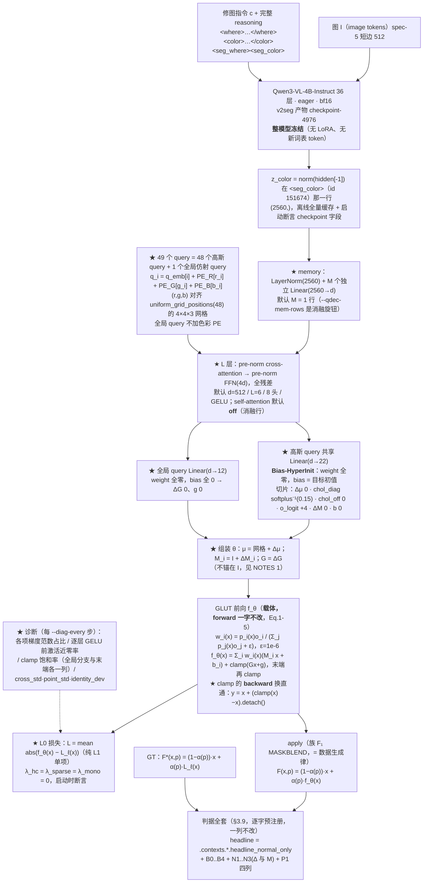

# 实验：共用 Query 主干 —— N+1 个 query 的 transformer decoder + 纯 L1 (EPR-030)

状态：提案（待 grill-me + 用户定稿）。**what 分支，P1。**

本提案是 **新建实现**：仓库内 what 侧现有实现（`q3vl/what/`、`model/glut_repro/`、`gpu_render/`）
与一切 what 侧实验记录/结论文档按用户 2026-08-14 判定为污染源，本提案**未读、不参照、不做对照叙事**
（`model/glut_repro/` 只取**代码事实**，其实验结论不引用）。

外部行号与原文数值以 **2026-08-15 / 2026-08-16 当日**用 `curl` 打开的原始文件为准
（清单见文末「来源清单」，本轮新开的四份标 ✔2026-08-16）。本仓库 file:line、参数量与
测试结果均为当日工作区**实测**（命令与数字逐条写在正文里，不估算）。

一句话：**把六臂共用的 CGLUT 参数生成器从「MLP encoder + 5 个参数专属头」换成
「N+1 个 query 的 transformer decoder」，并把损失换成纯 L1 单项。**


---

## 跨臂冻结口径（EPR-024 ~ EPR-029 六份逐字一致；2026-08-15 主 agent 裁定）

> 本块在六份提案里**逐字相同**。正文任何一处与本块冲突，**以本块为准**。
> 表内实测数字均为本轮（2026-08-15）在只读挂载 / 工作区现场跑出，命令与出处逐条列在右列。

| 项 | 冻结值 | 依据 |
|---|---|---|
| **训练集** | `split == "train"` 且 `winner_confidence == "normal"`，**n = 93934**（style 51182 / local 42752） | 战役数据纪律「`winner_confidence=low` 不进主训与评测 GT」。本轮实测 `/mnt/nfs-ro/bc/data/datasets/sft2seg-20260804/splits/train.index.jsonl`：159215 = normal **93934** + low **65281** |
| **每步批组织** | **B = 32 样本 × Q = 256 色点 = 8192 色 / 步** | CGLUT 的**色** batch 8192 口径不变（GLUT App A.1 原句 "CGLUT is trained for 40 epochs with a batch size of 8192"），本块只固定 (B, Q) 拆分。裁定理由（形式事实）：同一步内每条 LUT 被采到的色点数从 128 变成 256（翻倍），同时一步内出现的不同 LUT 条数从 64 变成 32（减半）。`B=64 × Q=128` 降为 **EPR-024 的一条消融行**，其余五臂不再各出一次 |
| **步 / epoch** | `ceil(93934 / 32)` = **2936** | 算术（本轮 `python3` 复算） |
| **总步数** | 2936 × **40 epoch** = **117,440** | 40 epoch 照抄 GLUT App A.1；这是 U4 步数匹配的公共基准，六份全部行都对齐到它 |
| **GLUT 前向 clamp** | **双裁**；旗标 `--clamp {two,one}`，**默认 `two`**：全局分支 `Gx+g` 先单独 clamp（`glut_editor.html:574-579`），末端 `local + global` 整体再 clamp（`:606-610`） | 官方 demo 是**唯一可执行的官方参考实现**，且内嵌 **7 份训练好的 GLUT-32 权重**（`glut_editor.html:429` 的 `const EMBEDDED_MODELS`；本轮 JSON 解析：7 个模型，每个的 `cholesky_diag` 长度 = 32），实现可逐点对拍；论文 Eq.5 只写末端 clamp，**未排除**中间 clamp。「论文单裁」（`--clamp one`）降为**共用消融行**，只在 **EPR-024 §4** 出一次，其余五臂引用该行 |
| **`L_hc` 在 `C→0` 处** | `h = (a, b) / max(C, ε_C)`，**且**整项乘硬 mask `1[C ≥ ε_C]`，`ε_C = 1e-3`；被 mask 的点数每步落盘 `n_hc_masked` | GLUT Eq.7 未给保护，该处理属 **NOVEL 数值**。六份统一取本档。「不 mask、只加 ε」降为 **EPR-024 的一条消融行**（`--no-hc-mask`），其余五臂不再各出一次 |
| **headline 图像形成式** | **`Î_i = (1 − α_i) ⊙ I_i + α_i ⊙ f̂_i(I_i)`**，六份统一 | 判据 §B 逐字。跨臂配对 Δ 必须在**同一个量**上算；任何臂的其他形成式一律降为**诊断列**，并在列名旁写明与 headline 的差异 |
| **where 分支输出的消费口径** | 场来源统一为 where 臂的 **`m_pix`**；重采样算子统一为 `q3vl/where/upsample.py:54-62` 的 `area_resize`（下采 `mode="area"`、上采 `bilinear`），各臂采到自己载体需要的分辨率并把该分辨率写进 `run_config`、在 §E 表脚逐行印出。判据 §E 的三分层掩码**一律用 GT α 在短边 512 上算**，与场来源无关 | 三套口径（短边 512 / `m_low (gh,gw)` / 未指定）会让 §E 的四行在不同尺度上算、跨臂不可比。分层掩码固定在 GT α / 短边 512，保证 `E_in / E_band / E_out` 六份同尺 |
| **新建包落点** | 全部落在 **`q3vl/whatb/`**（镜像 where 侧 `q3vl/whereb/` 的「本周新建、可信」命名）。共同依赖——GLUT Eq.1-5 前向、CGLUT 生成器、CIELab / ΔE00、判据函数——**只写一份**，六臂共用；各臂自己的新模块放 `q3vl/whatb/<epr 名>/` 子包 | 避免出现两份并行的 GLUT 前向实现（口径必然漂移）。`q3vl/what2/` 这一命名作废 |
| **预注册判据键名** | `headline_normal_only`, `B0_identity`, `B1_libmean`, `B2_librandom`, `B3_bucket_retrieval`, `B4_oracle`, `N1_shuffle_delta`, `N1_shuffle_M`, `N2_irrelevant_delta`, `N2_irrelevant_M`, `N3_const_delta`, `N3_const_M` | 统一为 EPR-024 一套并补齐三负控制（原先四套写法）。键名不统一时，任一处拼写差异会让该列**静默缺席**而 `assert_criteria_ran` 仍然通过 |
| **`<seg_color>` 的 color span 编码** | 在本 EPR 的新命名空间里**自带一份实现**，**不 import `q3vl/what/` 的任何模块**；配启动断言（下方逐字） | `q3vl/whereb/readout.py:475-476` 的 `ReadoutBuilder.needs_color` 对 `("color_close", "im_end", "seg_where", "qtok")` 返回 True，`:478-487` 的 `color_ids_from_text` 在 **`:484`** 执行 `from q3vl.what.context import encode_color_span`。`q3vl/what/` 是本轮判定的污染源树，六份**一行未读、不 import** |

**`<seg_color>` 读出的启动断言（六份逐字一致）**：入口在建 dataloader **之前**，用本次基座
`checkpoint-4976` 的 tokenizer，对本 split 随机抽 **256** 条样本的 `color` 文本 `t` 逐条执行

```
ids_self = <本 EPR 自带的 color span 编码>(tok, t)     # 新命名空间，无 q3vl.what 导入
ids_ref  = tok(f"<color>{t}</color>", add_special_tokens=False).input_ids
assert len(ids_self) == len(ids_ref)                   # 先断长度
assert all(a == b for a, b in zip(ids_self, ids_ref))  # 再逐位断 token id
```

任一条不等即 `AssertionError`、拒绝开训；抽样条数与不等条数写进 `run_setup.json`。
该断言**只调用 tokenizer**，不 import 污染源树里的任何符号。

**B3 桶级检索基线（列名 `B3_bucket_retrieval`，六份逐字一致）**

- **定义**：对评测样本取其 **record 自带的 `minor`**，在 **train 里同 `minor` 桶的 lut_id 池**中
  **均匀随机取一条** `ℓ'`，预测 `f̂ = L_{ℓ'}`；R = 8 次重复，报 mean ± std，与 arm **同样本配对**。
- **不使用 `tools/data_splits/splits_presets.csv`**。本轮实测该 CSV：3522 条，`major` 由
  `minor.rsplit("_", 1)[0]` **机械**得来（**0 例外**）⇒ `"{major} / {minor}"` 只有 **77** 个不同字符串，
  单串最多被 **363** 个 lut_id 共用；且该 CSV 的 `major` 与 record 自带的 `major` 在抽样 800 条里
  **706 条不一致**。
- **定义依据（必须原样写进 RESULT 的方法节）**：**1-of-77 的桶只能给出桶判定，给不出 lut_id 的
  argmax**，所以本列**按定义是桶级下界，不是精确检索**；任何关于「检索这条路能到哪」的上界
  一律看 **B4 oracle**，不看 B3。
- **桶池实测（本轮遍历 `/mnt/nfs-ro/bc/data/datasets/sft2seg-20260804/records/shards/shard-00000.tar`
  的全部 162,359 条 record）**：record 自带 `major` **10** 类；train 的 `minor` **77** 类、
  `(major, minor)` **85** 对；record 的 `major == minor.rsplit("_",1)[0]` 只在
  **17,176 / 162,359** 条成立。train 的 77 个 minor 桶，lut_id 池大小 **min 1 / 中位 17 / max 285**，
  合计 **3149**。V_what normal-only 567 条的 `minor` **全部**被 train 桶覆盖，GT lut_id **全部**落在
  对应桶池内，桶内均匀取一条命中 GT lut_id 的期望比例 = **0.108**（61.38 / 567）；
  T_lut_unseen normal-only 252 条的 `minor` 也全部被覆盖，但 GT lut_id 落在 train 桶池内的条数
  **构造性为 0**（该 split 的 lut_id 与 train 交集为 0）。

---

## 跨臂冻结口径的**变更清单**（本 EPR 动了哪几项，动了之后哪些旧数字作废）

> 上面那张表是 EPR-024 ~ EPR-029 六份逐字一致的块，本节逐条说明 EPR-030 与它的差异。
> **只列改了什么与影响范围，不下结论。**

**本 EPR 相对冻结口径一共动了五项**：① 参数生成器结构、② 条件宽度 `cond_dim` 64 → 512、
③ 损失配方、④ 训练集 n 与总步数（93,934 / 117,440 → **119,828 / 149,800**）、
⑤（2026-08-16 用户裁定）**每步色批从 8192 放开**，`--batch-split` 不再钉死 `B×Q = 8192`。
其余（clamp forward、headline 形成式、12 个预注册键、colorspan 断言、
评测集与判据列）逐字不变。

**因此作废的旧数字**（不可与本臂的行并列）：

- **CARRIER 7.895**（EPR-024 全量 headline）与 **IDGATE 10.149**（EPR-027 全量 headline）
  —— 这两条是在「n = 93,934 / 117,440 步 / `L_rec + 10·L_hc + 0.001·R_sparse` / cond_dim 64 /
  MLP 生成器」下跑出来的，本臂四项全动，**跨臂 Δ 不成立**，作废。
- **因第 ⑤ 项（每步色批放开）作废的本臂旧数字**（都跑在 `B×Q = 8192`、
  3,745 步/epoch、149,800 总步上；色批一改，步/epoch、总步数、cosine 区间全变，
  与新数字**不同步数、不可比**）：
  - §4.4 全量行：`E030_P4_MLP` **headline 4.7338**、`E030_P4_MLP_SEED2` **headline 4.6254**
    （连同其配套的 B0 Δ −3.6672 / B1 Δ −3.0032 / B3 Δ −1.5367 / Δ_shuffle 4.7846 与
    「两 seed 差 0.1084」这条 run-to-run 方差）；`E030_P4_MLP_NOL8` / `_R2` 的 NaN 轨迹；
  - §4.3 消融表 **全部 15 行短程行**（P2/P3 扫描，3,745 步档第 1~13 行与 2,936 步档第 14/15 行），
    含 6.7449 / 6.6681 / 6.5865 / 6.9714 / 6.1781 / 6.9081 / 6.6171 / 6.9595 / 6.8051 /
    6.3070 / 6.9242 与四条 NaN 行的 NaN 起点；
  - §4.2 的每步墙钟（qdec d=512 约 158 ms、mlp 约 125 ms、全量 mlp 约 2.6 h）。
  - **基准需在新色批下重跑**（用户 2026-08-16 已知悉并裁定接受）。
- **未作废**：五条平凡基线 `B0_identity` 8.293 / `B1_libmean` 7.632 / `B2_librandom` 10.099 /
  `B3_bucket_retrieval` 6.155 / `B4_oracle` 0.825 —— 它们不含任何被训练的参数，只由
  V_what normal-only 567 条与 preset bank 决定，**不随训练集、步数与色批变**，本轮未动其
  定义与总体，**仍是要打的线**。
- **未作废但需并排注明**：判据列定义、headline 形成式、12 个预注册键、evaluation split，
  与六臂逐字相同。

| 冻结项 | EPR-024~029 | EPR-030 | 旧数字是否作废 |
|---|---|---|---|
| **训练集** | train ∩ normal，n = **93,934** | **改**：`--data v2seg+l8`（默认）= sft2seg train∩normal **93,934** + L8 `l8_train` ∩normal **25,894** = **119,828**；`--data v2seg` 保留为配对消融行 | **CARRIER 7.895 / IDGATE 10.149 作废**（训练总体不同）。五条平凡基线不作废（不随训练变） |
| **每步批组织（色批）** | B=32 × Q=256 = **8192 色/步**（`assert b*q == COLORS_PER_STEP`） | **改（2026-08-16 用户裁定）**：断言删除，`B×Q` 不再钉死；`--batch-split` 每档的 `colours_per_step = B×Q` 按档**记录**进 `run_setup.json`（`frozen_block.colours_per_step` / `batch_split` / `batch_samples` / `queries_per_sample`）。默认仍是 `32x256`；`32x256` 与 `64x128` 的行为**逐位不变**（见下）。已标定并放开的新档见下表 | **§4.3 全部 15 行 + §4.4 的 4.7338 / 4.6254 作废**（步数与 cosine 区间都变）。五条平凡基线不作废 |
| **步/epoch、总步数** | 2936 / 117,440 | **改**：`steps_per_epoch = ceil(n_train / B)`，随 `--data` 与 `--batch-split` 同时变。`v2seg+l8` + `32x256` ⇒ **3,745 / 149,800**；`v2seg` + `32x256` 仍是 2,936 / 117,440；新色批档的取值见下表 | 与上两行同因作废。**跨 `--data`、跨 `--batch-split` 档比较一律用固定步数**，禁按 epoch 比 |
| **条件宽度 `cond_dim`** | π: 2560 → **64**，MLP encoder 宽 128 | **改**：qdec 档不用 π；z 经 `mem_proj` 投到 **`--qdec-dim` = 512** 的 memory 行（`--backbone mlp` 对照行仍走 64/128） | 与生成器结构同一处改动，同上作废 |
| GLUT 前向 clamp（**forward**） | 双裁 `two` | **不变，逐位相同** | — |
| GLUT 前向 clamp（**backward**） | 硬 clamp：饱和点回传**精确零** | **新增开关 `--clamp-grad {st,hard}`，本臂默认 `st`**（直通估计：`y = x + (clamp(x)−x).detach()`，forward 逐位不变、backward 为恒等） | **不作废**。`glut.py` 的模块级默认仍是 `hard`（`glut_forward(..., clamp_grad="hard")`、`GlutCarrier(clamp_grad="hard")`），EPR-024~029 的梯度行为一字未动；`st` 只在 EPR-030 的入口显式打开。跨臂配对 Δ 里必须并排印出这一列的取值 |
| `L_hc` 的 `C→0` 处理 | `h=(a,b)/max(C,1e-3)` + 硬 mask | **不变**（λ_hc = 0 时该项不参与损失；λ_hc≠0 的消融行仍走这一档） | — |
| **损失配方** | `L_rec + 10·L_hc + 0.001·R_sparse` | **`L = mean abs(f(x) − L_l(x))` 单项**（λ_hc = λ_sparse = λ_mono = 0） | **不作废，但不可混读**：headline / 判据 / 评测口径一字未改，所以配对 Δ 在**同一个量**上仍然成立；但两侧不是同一个目标函数训出来的，任何跨臂行都必须在表里写明 loss 配方列 |
| **参数生成器结构** | CGLUT App A.2：`π → 3 层 MLP encoder → 5 个头` | **`N+1` 个 query → L 层 (cross-attn → FFN) → 共享 22 维头 + 全局 12 维头** | 同上：这是本 EPR 的实验变量；`--backbone mlp` 档把生成器换回 EPR-024 的原件作对照行 |
| headline 图像形成式 | `Î=(1−α)⊙I+α⊙f̂(I)` | **不变** | — |
| 12 个预注册键 | 同一张表 | **不变，逐字沿用**（`q3vl/whatb/criteria.py:79-85` 的 `PREREGISTERED_KEYS`） | — |
| colorspan 自带实现 + 启动断言 | 自带 + 256 条逐位对拍 | **不变**（入口复用同一份 `q3vl/whatb/colorspan.py` 与同一道断言） | — |
| 新建包落点 | `q3vl/whatb/` | **不变**：新增 `qdecoder.py` / `losses_l0.py` / `scripts/run_epr030_arm.py`，GLUT 前向、CIELab/ΔE00、判据函数、z 缓存、评测数据仍是**同一份**共用实现 | — |

**色批放开后的显存标定表**（2026-08-16 实测，只列数字）

- 硬件：1 × NVIDIA H100，`memory.total` = 97,871 MiB = **95.58 GiB**，标定时卡上无其他进程。
- 构型：`--backbone qdec --qdec-dim 256 --head-init zero --qdec-head-lr-scale 0.01
  --data v2seg+l8 --loss l0`（`--precision auto` ⇒ CUDA 上 bf16 autocast），`n_gauss = 48`，
  `qdec_layers = 6`，mining 开。
- 方法：每档一个独立子进程，`run_epr030_arm.train_step` 真实调用 **20 步**；两个相位各 20 步
  （mining `r = 0.10` 的 epoch-0 相位、`r = 0.40` 的 epoch≥20 相位），显存与墙钟取两相位的较大者；
  墙钟去掉每相位第 1 步（含 CUDA 预热）。`z` 用 `randn(B, 2560)` 代替 z 缓存（形状/dtype 与
  真实 z 相同，(B,2560) fp32 在 B=1024 时为 10 MB，不进反传图）。LUT bank、采样器、mining、
  carrier、优化器全部是真件。**17 档全部未 OOM。**
- `步/epoch` 按 `--data v2seg+l8` 的 `n = 119,828` 算：`ceil(119828 / B)`；`40 ep 总步 = 步/epoch × 40`。

| `--batch-split` | 色/步 `B×Q` | `max_memory_allocated` GiB | `max_memory_reserved` GiB | s/步 | 步/epoch | 40 ep 总步 | 40 ep 预计 h | 探针峰值 RSS GB |
|---|---|---|---|---|---|---|---|---|
| `32x256`（默认，冻结档） | 8,192 | 0.44 | 0.48 | 0.108 | 3,745 | 149,800 | 4.50 | 1.71 |
| `64x128`（冻结档） | 8,192 | 0.54 | 0.62 | 0.148 | 1,873 | 74,920 | 3.08 | 1.70 |
| `32x2048` | 65,536 | 0.60 | 0.83 | 0.108 | 3,745 | 149,800 | 4.49 | 1.72 |
| `64x4096` | 262,144 | 1.34 | 1.85 | 0.173 | 1,873 | 74,920 | 3.60 | 1.72 |
| `128x4096` | 524,288 | 2.57 | 3.40 | 0.312 | 937 | 37,480 | 3.25 | 1.71 |
| `128x8192` | 1,048,576 | 4.67 | 5.83 | 0.415 | 937 | 37,480 | 4.33 | 1.75 |
| `256x8192` | 2,097,152 | 9.29 | 11.46 | 0.823 | 469 | 18,760 | 4.29 | 1.80 |
| `256x16384` | 4,194,304 | 17.67 | 22.40 | 1.373 | 469 | 18,760 | 7.16 | 1.85 |
| `256x24576` | 6,291,456 | 26.06 | **33.36** | 1.983 | 469 | 18,760 | 10.33 | 1.89 |
| `512x12288` | 6,291,456 | 26.60 | **33.55** | 2.809 | 235 | 9,400 | 7.33 | 1.90 |
| `256x32768` | 8,388,608 | 34.44 | 44.29 | 2.522 | 469 | 18,760 | 13.14 | 1.97 |
| `512x16384` | 8,388,608 | 34.98 | 44.49 | 3.326 | 235 | 9,400 | 8.69 | 1.97 |
| `1024x8192` | 8,388,608 | 36.21 | 44.91 | 4.503 | 118 | 4,720 | 5.90 | 1.98 |
| `512x24576` | 12,582,912 | 51.75 | 66.41 | 4.444 | 235 | 9,400 | 11.60 | 2.11 |
| `512x28672` | 14,680,064 | 60.13 | **77.36** | 5.008 | 235 | 9,400 | 13.08 | 2.18 |
| `512x32768` | 16,777,216 | 68.51 | **88.29** | 5.534 | 235 | 9,400 | 14.45 | 2.25 |
| `1024x16384` | 16,777,216 | 69.74 | **88.70** | 6.684 | 118 | 4,720 | 8.76 | 2.25 |

同一色批下改 `B`（8,388,608 色/步三行、16,777,216 色/步两行）：`max_memory_reserved`
在 44.29→44.91（+0.62）与 88.29→88.70（+0.41）；s/步在 2.522→3.326→4.503 与 5.534→6.684。

**生产档取值待主 agent 裁定**（本任务只出标定数字，不拍板）；两套候选：
① 单进程/卡 ≥70 GiB：`512x28672`（reserved 77.36 GiB，余量 18.2 GiB）；
② 两进程/卡各 ~35 GiB：`256x24576`（33.36）或 `512x12288`（33.55）。
选定后本节表头的「新值」与 §4 的口径行需一并改写，§4.3/§4.4 的旧行按上面的作废清单清空重跑。

**共用文件的改动只有三处，都是纯增量**（`q3vl/whatb/` 整树在 git 里是未跟踪状态，
`git diff --stat` 对它为空；改动按符号逐条列在这里与 §3.7）：

1. `q3vl/whatb/glut.py`：新增 `clamp_grad` 形参（默认 `"hard"`）、新增公开函数 `grid_axis_sizes()`
   （把 `uniform_grid_positions` 用的网格因子分解暴露出来，供 query 的色彩 PE 索引；返回值与
   私有 `_factor_triple` 同一实现，不存在第二份网格）。**forward 逐位不变**：
   `tests/test_glut_forward.py` 的全部既有断言（含官方 demo 逐点对拍）未改一行仍全过。
2. `q3vl/whatb/scripts/run_carrier_arm.py`：`main()` / `build_parser()` / `evaluate_and_publish()` /
   `selection_board()` / `open_z_caches()` / `load_eval_samples()` 增加一个 `arm=<模块>` 形参，
   函数体内原先写死的 `A.xxx` 改成 `arm.xxx`，**默认值就是 EPR-024 的 carrier 模块**。
   EPR-030 用 `R.main(argv, arm=<本模块>)` 复用整条管线，**不复制第二份 runner**。
   既有测试 `test_carrier.py::test_runner_*`（调用签名、旗标面、选优只读 headline）未改一行仍全过。
3. `q3vl/whatb/arms/carrier.py`（2026-08-16，第 ⑤ 项）：删掉
   `assert all(b * q == COLORS_PER_STEP for b, q in BATCH_SPLITS.values())`，改为
   ① 新常量 `FROZEN_BATCH_SPLITS = ("32x256", "64x128")` 与 `BATCH_SPLIT_COLORS = {档: B*Q}`；
   ② 保留断言 `BATCH_SPLIT_COLORS[档] == COLORS_PER_STEP for 档 in FROZEN_BATCH_SPLITS`
   与 `BATCH_SPLITS["32x256"] == (32, 256) and BATCH_SPLITS["64x128"] == (64, 128)`，
   再加一条「档名必须等于 `f"{B}x{Q}"`」；③ `BATCH_SPLITS` 增列 15 个已标定的新档；
   ④ `run_setup_record` 的 `frozen_block` 增记 `batch_split` / `batch_samples` /
   `queries_per_sample` / `colours_per_step` / `colors_per_step` /
   `batch_split_step_matched_to_epr024`（`steps_per_epoch` / `total_steps` 原本就在）。
   `--batch-split` 默认仍是 `32x256`；`run_carrier_arm.py` 里
   `steps_per_epoch == ceil(len(train_rows) / cfg.batch_samples)` 的运行时断言未改一行，
   `B` 变它跟着变。**`32x256` / `64x128` 两档的训练步逐位不变**：同 seed 同 bank 跑 3 步
   `train_step`，改动前后 `steps.jsonl` 行的 JSON 逐字节相同
   （sha256 `1a5df5f2…` / `5901c664…`）。`pytest q3vl/whatb/tests -q` = **701 passed**，
   与改动前同一数字。

唯一被改动的既有测试是 `tests/test_glut_forward.py` 里 `GlutCarrier.config` 的**逐字典相等**断言
（多了 `"clamp_grad": "hard"` 这一个记录字段）；断言值本身仍是 EPR-024~029 的行为。

---

## 1. 任务

### 1.1 本实验测试的那一个结构改动（一句话）

把参数生成器 $G_\vartheta$ 从「共享 3 层 MLP encoder + 5 个参数专属头」（CGLUT App A.2 形制）
**换成「$N$ 个高斯 query + 1 个全局仿射 query，经 $L$ 层 (cross-attention → FFN) 解码」**，
每个 query 出一组参数；同时把损失从 `L_rec + 10·L_hc + 0.001·R_sparse` 换成**纯 L1 单项**。
载体（GLUT 前向）、监督空间、批组织、步数、判据一律不动。

### 1.2 数据（数据集 + n + 切分）

训练集 = **两个来源的并集**（`--data v2seg+l8`，入口默认）：

| 来源 | 原始 n | normal | low（**不进训练**） | 训练用 n |
|---|---|---|---|---|
| `sft2seg-20260804` `split == "train"` | 159,215 | **93,934** | 65,281 | **93,934** |
| L8 `prod-l8-local400k-20260812` → `l8_train.manifest.jsonl` | 46,129 | **25,894** | 20,235 | **25,894** |
| **合计（`--data v2seg+l8`）** | — | — | — | **119,828** |
| 对照档 `--data v2seg` | — | — | — | **93,934** |

评测集（一律 normal-only，四份**逐字不动**）：

| 集合 | n | normal-only n | 用途 |
|---|---|---|---|
| **V_what** | 897 | **567** | 唯一选型集（headline / 全部判据列） |
| V_where | 896 | 515 | 不进本臂 |
| T_final | 918 | 533 | 终测，LUT 见过；每个 arm 只跑一次 |
| T_lut_unseen | 433 | 252 | 终测，lut_id 与 train 交集 **0**；每个 arm 只跑一次 |

**每来源的实测数（`run_setup.json` 的 `split_facts.train_sources`，2026-08-16 CPU dry-run）**：

| 来源 | n_normal | uniq lut_id | uniq source_image_id |
|---|---|---|---|
| v2seg | 93,934 | 3,081 | 22,740 |
| l8 | 25,894 | 2,785 | 11,776 |
| 合计 | **119,828** | — | — |

- **n 与步数是实测的，不是写死的**：`q3vl/whatb/splits.py::train_normal_rows()` 逐来源清点，
  v2seg 部分对 `TRAIN_NORMAL_N = 93934`（冻结块第 1 条）断言、L8 部分对该来源**自己的**
  `l8_train.manifest.report.json`（`n_manifest = 46129`、`counts.usable_final_normal = 25894`）断言，
  不符即 `raise`。**合并后的 119,828 没有写进任何一处代码**（写死的数字会在下一次加数据时同处再炸一次）。
  入口另有运行时断言：`steps_per_epoch == ceil(n_train / batch_samples)`，以及
  `len(train_rows) == cfg.train_n`。
- z 缓存（两个根，**都过 `ZCache.assert_belongs_to`**，由 `q3vl/whatb/zcache.py::MultiZCache` 合成
  一个条件，按 `sample_id` 派发；`sample_id` 跨来源重复直接 `raise`）：
  - `/home/bc/data/runs/whatb/zcache_v2seg/`：`train.generated.none`（n=93,934）
    + `V_what.generated.{none,shuffle,irrelevant,const}`
  - `/home/bc/data/runs/whatb/zcache_l8/<context>/l8_train__none/`：n=46,129，
    `generated` 与 `teacher` 两档各一份（本臂 `--context generated`）。
    实测断言记录：`n_verify_plan = 461`（1% 抽样逐条重放 `verify_plan`，461/461 通过）。
- L8 的 `where` / `color` 分段**不在本 EPR 里重新转换**：`l8_train.manifest.jsonl` 的这两个字段就是
  缓存生产者用 `q3vl/data/twoseg.py::convert()`（spec 4.2：`where` = region_scope 正文，
  `color` = 其余六段按原序）转好的（z 缓存 `meta.dataset.where_color_source` 记录了这一点），
  索引行直接内联携带；`q3vl/data/scan.py::scan_batch`、`q3vl/data/headers.py::geometry_for`、
  `q3vl/data/lengths.py`、`q3vl/train/imageproc.py::prepare_image` 同样是生产阶段调用的，本轮不复制第二份。
  colorspan 启动断言因此对**合并后的**总体抽样：实测 `n_sampled = 256`，`n_mismatch = 0`。
- 基座：`/home/bc/data/runs/q3vl_base_sft_v2seg_20260814/checkpoint-4976`，**整模型冻结**，eager attn；
  条件向量离线全量缓存，入口启动时断言缓存的 `checkpoint` 字段 == 本次基座路径（两个根各断言一次）。
- 每步批组织：`--batch-split` 决定 `(B 样本, Q 色点)`，`colours_per_step = B×Q`。
  默认（也是已作废的旧行所用）**`32x256` = 8192 色/步**：`--data v2seg+l8` ⇒ **3,745 步/epoch**、
  **总 149,800 步**（40 epoch）；`--data v2seg` ⇒ **2,936 步/epoch**、**总 117,440 步**。
  2026-08-16 起 `B×Q` 不再钉死 8192，可选档与各档实测步数见「跨臂冻结口径的变更清单」；
  一律 `steps_per_epoch = ceil(n_train / B)`，入口启动时对实际载入的总体再断言一次。
- 平凡基线 B1/B2/B3/B4 的总体（`Lib_tr` 1137 个 lut_id、B3 的 77 个桶 / 3149 个 id）
  仍定义在**整份 sft2seg train index**（含 low）上，与本臂训练什么无关，本轮未动。

#### 1.2.1 评测污染复核（本轮**独立**重跑，不引用缓存生产者的数字）

命令（`/home/bc/envs/q3vl_sft/bin/python`，读 `/mnt/nfs-ro` 的四份 `*.index.jsonl`
与 `/home/bc/data/runs/whatb/zcache_l8/l8_train.manifest.jsonl`）：

```python
train = {v2seg train ∩ normal} ∪ {l8 manifest ∩ normal}      # 93,934 + 25,894 = 119,828
for ev in ("V_where", "V_what", "T_final", "T_lut_unseen"):
    len({r["sample_id"]       for r in train} & {r["sample_id"]       for r in ev_rows})
    len({r["source_image_id"] for r in train} & {r["source_image_id"] for r in ev_rows})
```

同一份复核已接成回归测试：`q3vl/whatb/tests/test_epr030_data.py::
test_merged_training_set_is_disjoint_from_every_eval_split`（四个评测集参数化，
挂载缺失时 skip）。

| 评测集 | 评测集 n | `sft_id` ∩ 合并训练集 | `source_image_id` ∩ 合并训练集 | `sft_id` ∩ v2seg 部分 | `sft_id` ∩ L8 部分 | `source_image_id` ∩ L8 部分 | `lut_id` ∩ L8 部分 |
|---|---|---|---|---|---|---|---|
| V_where | 896 | **0** | **0** | 0 | 0 | 0 | 527 |
| V_what | 897 | **0** | **0** | 0 | 0 | 0 | 527 |
| T_final | 918 | **0** | **0** | 0 | 0 | 0 | 571 |
| T_lut_unseen | 433 | **0** | **0** | 0 | 0 | 0 | **0** |

其余实测数（同一次复核）：合并训练集 `sft_id` 去重 119,828（两来源交集 **0**）、
`source_image_id` 去重 24,751；L8 normal 的 2,785 个 `lut_id` 全部命中 preset bank
（`/var/cache/veradata/preset_bank_full/luts_meta.json`，4,051 条，缺失 **0**）。
`lut_id ∩ T_lut_unseen = 0` 与 v2seg train 侧同值（v2seg train 亦为 0）。

### 1.3 测试什么方法（通俗三段：增加了什么、在哪里加的、加了什么）

**第一段——现在的生成器长什么样，哪里坏了。** 现行生成器（`q3vl/whatb/generator.py`）是
「一个向量 → 一堆数字」：`z ∈ R^2560` 过 `LayerNorm+Linear` 变成 64 维，过 **3 层 128 宽的共享
MLP encoder**，再分给 5 个参数专属头（μ 头 / Σ 头 / o 头 / 局部色彩头 3 层 / 全局仿射头）。
两条已实测的事实：(a) EPR-025 里唯一的条件通路 `head_color` 末层隐层的 **ReLU 全局死亡率**
从 0.469(step0) 爬到 **1.0000(step1300)**，之后整个批的输出逐位相同、梯度精确为 0；
(b) GLUT 全局分支的硬 `clamp(0,1)` 从 step 50 起 **100% 查询点被裁**，该分支回传**精确零梯度**。

**第二段——在哪里加、加了什么。** 在**同一个位置**（`z → θ`，即 GLUT 载体的输入端）把 MLP 主干
整个换掉：**一个高斯 = 一个 query**（N=48 个），外加**一个全局仿射 query**，一共 49 个 query；
每个 query 的初值是「可学 embedding + 色彩位置编码 $PE_R\oplus PE_G\oplus PE_B$」，位置编码按该高斯
**μ 初值所在的规则网格格点**索引（N=48 → 4×4×3）；条件 `z` 过 `LayerNorm(2560)+Linear(2560→d)`
成为 cross-attention 的 memory（默认 **M=1 行**）；过 **L=6 层 (pre-norm cross-attention → pre-norm FFN)**，
FFN 宽 4d，激活 **GELU**；最后**所有高斯 query 共享一个 `Linear(d→22)`**、全局 query 走 `Linear(d→12)`。

**第三段——三个「加了什么」的细节，每个都对着一个已实测的失败。**
① 输出头用 **Bias-HyperInit**（weight 全零 + **bias = 各参数组的目标初值**），不是「末层全零」：
step0 生成的是**一份合法的初始参数**（μ 在规则网格、σ=0.15、o 的 logit=+4、M=I、b=0、G=0、g=0），
`f ≡ identity`，而不是一堆 0；
② clamp 换成**直通估计**（forward 逐位等于硬 clamp，backward 为恒等），饱和点不再回传精确零；
③ 损失换成**纯 L1 单项**，去掉了等效权重约 325× 的 `10·L_hc`（实测 mean C = 32.5）。
每 200 步落盘四组诊断：各 loss 项的梯度范数占比、decoder 每层 GELU **前**激活的近零率、
被 clamp 饱和的查询点比例、`cross_std / point_std / identity_dev`。

### 1.4 参考工作（逐条打开原始来源核实；数值原文照抄）

| 工作 | 标题 / 编号 | 本实验借鉴的**具体机制** | 打开的原始文件 |
|---|---|---|---|
| **StatLUT** | *Multimodal 3D LUT Generation via StatLUT with Statistical Features for Photorealistic Style Transfer*，arXiv **2607.08227** | §3.2 Eq.2：query = 格点 + **可学 3D 位置编码** $PE_R\oplus PE_G\oplus PE_B$（$\oplus$ = 广播加）；Eq.3：$\Delta C=\mathrm{FFN}(\mathrm{Softmax}(QK^\top/\sqrt{d_k})V)$；Eq.4 的残差形式 $LUT_{id}+\Delta C$；**decoder 6 层 / $d_{model}$=512 / 8 头**（附录发布配置）；"zero-initialize the final FFN projection layer" | `arxiv.org/html/2607.08227v1`（EPR-029 §1.4 当日逐句核对） |
| **Bias-HyperInit** | Beck et al., *Hypernetworks in Meta-Reinforcement Learning*（PMLR v205） | 输出头 **weight 全零 + bias 非零**：$\phi_{init}=Wx+b=\phi_{shared}$，与条件无关，等于一份按标准方案采样的参数 | `proceedings.mlr.press/v205/beck23a/beck23a.pdf` |
| **Text-to-LoRA** | arXiv **2506.06105**，SakanaAI/text-to-lora | 同一形制的可运行实现：`nn.init.zeros_(head.weight)`（**:535**）+ `head.bias.copy_(torch.cat(init_bias))`（**:541**），`init_bias` 来自 `get_init_peft_weights` | ✔2026-08-16 `raw.githubusercontent.com/SakanaAI/text-to-lora/main/src/hyper_llm_modulator/hyper_modulator.py`（HTTP 200，39,354 B） |
| **Splatter Image** | `szymanowiczs/splatter-image` | `get_splits_and_inits`：输出通道**逐参数组**给 gain 与 bias（`scale_inits` / `bias_inits`，如 opacity bias −2.0、scale bias `log(0.02)`），而不是整层一个初始化 | `raw.githubusercontent.com/szymanowiczs/splatter-image/main/scene/gaussian_predictor.py` |
| **NILUT / CNILUT** | AAAI 2024 | Eq.(6) `L = Σ_i ‖Φ(x_i) − φ(x_i)‖₁` —— **RGB 函数值空间的 L1**，与本项目 B×Q 采样监督口径同构；实现 `fit.py`：`loss = torch.mean(torch.abs(model_output - ground_truth)) # more stable than L2` | ✔2026-08-16 `raw.githubusercontent.com/mv-lab/nilut/main/fit.py`（HTTP 200，6,194 B；上引一行逐字抄自该文件） |
| **GELU** | Hendrycks & Gimpel，arXiv **1606.08415** | `GELU(x) = x·Φ(x)`；原文对 ReLU 的刻画 "weights inputs by their value, rather than gates inputs by their sign" | `ar5iv.labs.arxiv.org/html/1606.08415` |
| **Dying ReLU** | Lu et al., arXiv **1903.06733v3** | Theorem 3.4：参数落入 BD 集合后，**对任意损失、任意基于梯度的方法**，网络被优化成一个常数函数 | `arxiv.org/pdf/1903.06733v3` |
| **GradNorm** | Chen et al., ICML 2018 | `G_W^(i)(t) = ‖∇_W w_i(t)L_i(t)‖₂` —— 本实验**只当监控量落盘，不拿来调权重** | `proceedings.mlr.press/v80/chen18a/chen18a.pdf` |
| **CLUT-Net** | ACM MM 2022 | 方向项与 l1 **并列权重各 1**（`utils/losses.py:24-25`，`sum(loss_ls).backward()` 无缩放）—— 本实验 `--lambda-hc 1.0` 消融行的权重出处 | `raw.githubusercontent.com/Xian-Bei/CLUT/main/utils/losses.py` |
| **Image-Adaptive 3D LUT** | TPAMI 2020 | `mn_cons = mean(ReLU(dif))` 单调性项、`sparse/weights_norm` —— 本实验两个可叠加项的权重族值 **monotonicity = 10**、**sparse = 1e-4** 的出处（AdaInt / SepLUT / 4D LUT 同值） | `raw.githubusercontent.com/HuiZeng/Image-Adaptive-3DLUT/master/image_adaptive_lut_train_paired.py` |
| **VeraRetouch** | arXiv **2604.27375v2** | 参数量对照物（**不是**方法借鉴）：Retouch Renderer = `ConditionalMLPDecoder(latent_dim=896, hidden_dims=[128,256,512], cond_method='add')` | ✔2026-08-16 `raw.githubusercontent.com/OpenVeraTeam/VeraRetouch/main/configs/renderer_config.py`（HTTP 200，16,729 B）+ `.../model/colormlp_v2.py`（HTTP 200，23,481 B） |
| **本仓库代码事实** | `q3vl/whereb/amort/uniq4.py:164-214` | `RefineLayer` 的 pre-norm 形制（post-norm 下 `LayerNorm(q+0) ≠ q`，零初始化构不成恒等）；本实验的 `QueryDecoderLayer` 与它同形 | 当日工作区 |
| **归档代码事实** | `model/glut_repro/train_rdg.py` | `loss_main = (render(p,x) - y).abs().mean()` —— 上一战役 transformer backend **用的就是纯 L1**（**只引代码事实，其实验结论不可信**） | 当日工作区 |

### 1.5 解决什么问题（只陈述已核实事实，不下结论）

本轮的四条实测事实，逐条对应本 EPR 的一处改动：

1. `EPR-025 AFFONLY` 在 step 2935 被退化解守卫拦下：32 个样本的预测变换**逐位相同**
   （`cross_std = 0.000000e+00`），整个 epoch 的 `L_rec` 0.1756 → 0.185。
2. `head_color` 末层隐层 ReLU 全局死亡率 0.469(s0) → 0.938(s500) → **1.0000(s1300)**；到 1.0 后
   该头只剩末层 bias。
3. `glut.py` 全局分支 `clamp(0,1)` 从 step 50 起 **100%** 查询点被裁，该分支梯度精确为 0。
4. `L_hc` 的 chroma 未归一化（实测 mean C = 32.5）⇒ `10·L_hc` 等效约 **325×** `L_rec`；
   CARRIER 全量 117,399 步的 `L_hc` 25.42 → 2.106（−92%），`L_rec` 0.5596 → 0.1770，
   而**恒等变换 f≡identity 的 L_rec = 0.1756**。

已跑完两臂的 headline（ΔE00，越小越好）与五条平凡基线：CARRIER **7.895** / IDGATE **10.149**；
`B0_identity` 8.293、`B1_libmean` 7.632、`B2_librandom` 10.099、`B3_bucket_retrieval` 6.155、
`B4_oracle` 0.825。

> **本 EPR 的口径变更后**：CARRIER 7.895 与 IDGATE 10.149 是在 n=93,934 / 117,440 步 /
> 旧损失配方 / cond_dim 64 下跑出的，本臂四项全动，**已作废，不与本臂任何行并列**
> （见「跨臂冻结口径的变更清单」）。五条平凡基线不含被训练的参数，其定义与总体本轮未动，
> **仍然有效**。

---

## 2. 模型

### 2.1 模型图（★ = 本次改动挂点；灰 = 冻结，一字不改）



### 2.1.1 【必读】`M = 1` 时 cross-attention 是退化的（数值实证，2026-08-16）

`QueryDecoderLayer.forward` 走的是标准 `nn.MultiheadAttention(h, memory, memory)`
（`qdecoder.py`）。当 `--qdec-mem-rows 1`（**默认档**）时 memory 只有一行，
softmax 在单个 key 上**恒等于 1**，于是

```
cross_attn(h, memory, memory) = W_o · W_v · z        # 与 query 内容无关
```

——**对全部 N+1 = 49 个 query 给出同一个向量**。数值验证（fp32，5 个不同 query）：

| memory 行数 | 5 个 query 的 attention 输出彼此最大偏差 |
|---|---|
| `M = 1` | **2.98e-08**（= float32 噪声） |
| `M = 4` | 2.58e-01 |

**因此默认档的实际结构不是 attention 解码器**，而是：49 条**共享权重**的 FFN 栈，
每条带自己的可学初始 embedding（`q_emb[i] + PE_R + PE_G + PE_B`），
每层收一个**对所有 query 相同**的加性条件向量 `c_ℓ(z)`。
query 之间的唯一区分来自残差流里的 embedding 与 PE；`--qdec-self-attn` 默认关，
所以 query 之间也无交互。该形态与 VeraRetouch 的 `ConditionalMLPDecoder`
（`cond_method='add'`，条件加进每个隐层）同型。

`qdecoder.py` 的 docstring 记录了同一事实：
`with one condition vector the queries have nothing to coordinate through the memory`。

**对读表的影响**：§4.3 里除 `E030_MEM4` / `E030_MEM8` 外的所有 qdec 行都跑在 `M = 1`，
即都是退化档；而这两个非退化档**都 NaN、无板**（step≈1099 / ≈849）。
⇒ **本 EPR 至今没有一次成功测到「非退化 cross-attention」的 qdec。**
把 §4.3 的 qdec 行当作「transformer 主干」的代表来与 `E030_MLP` 对比时，此事实必须一并写出。

### 2.2 模型伪代码

```python
# ── 冻结：整个 Qwen3-VL（v2seg checkpoint-4976）。可训：以下全部 ──────────────
N, d, L, H, M = 48, 512, 6, 8, 1        # 高斯数 / 宽度 / 层数 / 头数 / memory 行数
GRID = grid_axis_sizes(N)               # (4, 4, 3)，与 uniform_grid_positions(N) 同一实现

# --- query 侧 ---------------------------------------------------------------
q_emb = Parameter(randn(N + 1, d) * 0.02)                  # N 个高斯 query + 1 个全局 query
PE_R, PE_G, PE_B = Parameter(zeros(4, d)), Parameter(zeros(4, d)), Parameter(zeros(3, d))
mu_base = uniform_grid_positions(N)                        # buffer，非参数

# --- memory 侧 ---------------------------------------------------------------
norm_z   = LayerNorm(2560)
mem_proj = ModuleList([Linear(2560, d) for _ in range(M)])

# --- 解码器（pre-norm，cross-attn → FFN；self-attn 默认关）------------------
layers = ModuleList([QueryDecoderLayer(d, H, ffn=4 * d, act="gelu") for _ in range(L)])

# --- 输出头（Bias-HyperInit：weight 全零 + bias = 目标初值）------------------
head_g = Linear(d, 22); zeros_(head_g.weight); head_g.bias.copy_(gauss_bias())
head_a = Linear(d, 12); zeros_(head_a.weight); zeros_(head_a.bias)
# gauss_bias() = [0,0,0 | s,s,s | 0,0,0 | 4.0 | 0×9 | 0,0,0]，s = softplus⁻¹(0.15) = −1.8212…

def generator(z):                                          # z: (B, 2560)
    mem = stack([p(norm_z(z)) for p in mem_proj], dim=1)    # (B, M, d)
    q   = q_emb.clone()
    q[:N] += PE_R[ri] + PE_G[gi] + PE_B[bi]                 # StatLUT Eq.2 的广播加
    q    = q.expand(B, N + 1, d)
    for lyr in layers:
        q = lyr(q, mem)      # q += XAttn(LN(q), mem);  q += FFN(LN(q))
    o22, o12 = head_g(q[:, :N]), head_a(q[:, N])
    return GlutParams(mu        = mu_base + o22[..., 0:3],  # 残差
                      chol_diag = o22[..., 3:6],
                      chol_off  = o22[..., 6:9],
                      opacity_logit = o22[..., 9],
                      m_local   = I + o22[..., 10:19].reshape(B, N, 3, 3),   # 残差
                      b_local   = o22[..., 19:22],
                      g_matrix  = o12[:, 0:9].reshape(B, 3, 3),              # 不锚在 I
                      g_bias    = o12[:, 9:12])

def forward(image, instruction):
    z     = frozen_vlm_readout(image, instruction, pos="<seg_color>")   # (2560,) 无梯度，读缓存
    theta = generator(z)
    return glut_forward(x, theta, clamp="two", clamp_grad="st")         # 载体 forward 不改

def loss(f, y):
    return (f - y).abs().mean()          # L0：纯 L1 单项，无第二项
```

### 2.3 冻结 / 可训清单

| 组件 | 状态 | 依据 |
|---|---|---|
| Qwen3-VL-4B-Instruct 全部（视觉塔 + 语言塔 + embedding） | **冻结** | 本战役共同约束；$z_{color}$ 离线全量缓存，启动断言缓存的 `checkpoint` 字段 == 本次基座 |
| `q_emb`（49 个 query）、`PE_R/PE_G/PE_B`（30,720 参数） | **可训，0.1× 基础 lr** | CGLUT App A.1 对 "style embeddings and shared geometry parameters" 用 0.1×；本臂无 style embedding，query 与其色彩 PE 是唯一持有几何先验（按 μ 网格索引）的参数 —— **NOVEL 映射**，与 EPR-029 §3.5 同档，`--qdec-prior-lr-scale 1.0` 是消融 |
| `head_gauss` / `head_global`（17,442 参数） | **可训，0.1× 基础 lr** | 同一句原文的另一半：Bias-HyperInit 下**头的 bias 就是 shared geometry**（μ 网格残差基、σ=0.15、o logit +4、M=I），即 EPR-029 里放进 0.1× 组的 `theta_base`。**该默认由实测定**（见 §3.5 末的轨迹表）：头留在 1e-3 时 **step 80 起 NaN**。`--qdec-head-lr-scale 1.0` 是消融行 |
| `norm_z` + M 个 `mem_proj`、L 层 decoder（20,230,656 参数） | **可训，基础 lr $10^{-3}$，cosine 全程** | CGLUT App A.1：生成器取基础 lr $10^{-3}$ |
| `head_gauss` / `head_global` 的 **weight** | **零初始化** | Bias-HyperInit（Beck et al.）/ Text-to-LoRA `:535` |
| `head_gauss` / `head_global` 的 **bias** | **= 各参数组目标初值**（不是 0） | 同上 `:541`；Splatter Image 逐组 bias |
| GLUT 载体 | **零参数**（`GlutCarrier` 只有一个非持久 3×3 buffer） | 载体不学 |
| where 分支 | **不训练、不进本臂梯度** | 本臂是 P1，headline 用 GT α |

### 2.4 参数量对照表（**全部 `sum(p.numel())` 实测**，2026-08-16 当日跑出，不估算）

复现命令：`GlutQueryDecoder(**kw)` 后 `sum(p.numel() for p in d.parameters())`；
闭式 `qdecoder_param_count(**kw)` 与实测**逐档相等**（`tests/test_qdecoder.py` 逐档断言）。

| 档 | 构型 | **实测参数量** | ÷ MLP 生成器 | ÷ Retouch Renderer |
|---|---|---|---|---|
| **主构型** | qdec d=512 L=6 M=1 gelu bias 无 self-attn | **20,278,818** | 45.34× | 7.87× |
| 容量-d | d=128（L=6, M=1） | **1,534,626** | 3.43× | 0.60× |
| 容量-d | d=256（L=6, M=1） | **5,423,394** | 12.13× | 2.10× |
| 容量-L | L=2（d=512, M=1） | **7,669,282** | 17.15× | 2.98× |
| 容量-L | L=4（d=512, M=1） | **13,974,050** | 31.25× | 5.42× |
| 条件注入宽度 | M=4 | **24,212,514** | 54.14× | 9.39× |
| 条件注入宽度 | M=8 | **29,457,442** | 65.87× | 11.43× |
| 激活 | relu（其余同主构型） | **20,278,818** | 45.34× | 7.87× |
| 输出头初始化 | zero（其余同主构型） | **20,278,818** | 45.34× | 7.87× |
| self-attention | on（其余同主构型） | **26,588,706** | 59.45× | 10.31× |
| **对照行** | `--backbone mlp` = π + `CGLUTGenerator`（d=64, H=128, N=48） | **447,212**（π 169,024 + 生成器 278,188） | 1.00× | 0.17× |
| **外部参照** | VeraRetouch Retouch Renderer | **2,577,795** | 5.76× | 1.00× |

主构型逐项（合计 20,278,818，与实测逐位相等）：
`q_emb` 49·512 = 25,088；色彩 PE (4+4+3)·512 = 5,632；`LayerNorm(2560)` 5,120；
`mem_proj` 1·(2560·512+512) = 1,311,232；每层 [2·LN 1,024 + cross-attn (3·512²+3·512+512²+512)=1,050,624
+ 2·LN 1,024 + FFN (512·2048+2048)+(2048·512+512)=2,099,712] = 3,152,384，×6 = 18,914,304；
`head_gauss` 512·22+22 = 11,286；`head_global` 512·12+12 = 6,156。

Retouch Renderer 的 2,577,795 为**本轮实测复算**（✔2026-08-16 拉取两份原文件后按
`ConditionalMLPDecoder(latent_dim=896, hidden_dims=[128,256,512], cond_method='add')` 逐层求和）：
逐像素 MLP `3→128→256→512` 165,120 + 输出层 1,539 = **166,659**；
`z_projs` = 3 个 `Linear(896·3 → h)`，h ∈ {128,256,512} = **2,409,344**；3 个 LayerNorm = **1,792**。

**默认构型 d=512/L=6 实测 20,278,818 ≥ 2,577,795**（判据要求已满足，倍数 7.87×）。
`d=128` 那一档（1,534,626）**低于** 2,577,795，出板时必须在该行旁标注。

---

## 3. 数学公式与优化器 + 改动怎么接进来

### 3.1 载体：GLUT 前向（forward 不改，逐行照 Eq.1-5 与官方 demo 数值）

$$d_i(\mathbf{x})=(\mathbf{x}-\bm{\mu}_i)^\top\bm{\Sigma}_i^{-1}(\mathbf{x}-\bm{\mu}_i),\qquad
p_i(\mathbf{x})=\frac{1}{\sqrt{(2\pi)^3|\bm{\Sigma}_i|}}e^{-\frac12 d_i(\mathbf{x})}$$
$$w_i(\mathbf{x})=\frac{p_i(\mathbf{x})\,o_i}{\sum_{j=1}^{N}p_j(\mathbf{x})\,o_j+\epsilon},\qquad \epsilon=10^{-6}$$
$$f_\theta(\mathbf{x})=\sum_{i=1}^{N}w_i(\mathbf{x})\,(\mathbf{M}_i\mathbf{x}+\mathbf{b}_i)
+\underbrace{\mathrm{clamp}(\mathbf{G}\mathbf{x}+\mathbf{g},0,1)}_{\text{全局分支先单独裁}},\qquad
\hat{\mathbf{y}}=\mathrm{clamp}(f_\theta(\mathbf{x}),0,1)$$

$\bm{\Sigma}_i=L_iL_i^\top$（下三角、对角过 softplus）、$o_i=\sigma(\text{logit})$、PDF 走对数域、
**双裁 clamp** —— 四条来自官方 demo，实现由 `tests/test_glut_demo_parity.py` 对内嵌的 7 份
GLUT-32 权重逐点对拍。**本 EPR 一个字节都没改这四条的 forward。**

### 3.2 生成器（**本次结构改动**）

**query 侧。** 令 $(n_R,n_G,n_B)=\texttt{grid\_axis\_sizes}(N)$（$N{=}48\Rightarrow(4,4,3)$），
第 $i$ 个高斯的网格索引 $(r_i,g_i,b_i)$ 满足 $\bm{\mu}_i^{(0)}=\big((r_i{+}\tfrac12)/n_R,\ldots\big)$
= `uniform_grid_positions(N)[i]`。
$$q_i^{(0)}=\mathrm{emb}[i]+PE_R[r_i]+PE_G[g_i]+PE_B[b_i]\ (i\le N),\qquad q_{N+1}^{(0)}=\mathrm{emb}[N{+}1]$$

**memory 侧。** $\ \mathbf{m}_k=W^{(k)}\,\mathrm{LN}(z_{\text{color}}),\ k=1..M$，$M$ 个**独立** `Linear(2560→d)`
共享一个前置 `LayerNorm(2560)`；$M=1$ 为默认，$M\in\{1,4,8\}$ 进消融。

**解码。** $L$ 层，每层 pre-norm 的 (cross-attention → FFN)，全残差：
$$q^{(l+\frac12)}=q^{(l)}+W_o\,\mathrm{Softmax}\!\left(\frac{(W_q\mathrm{LN}(q^{(l)}))(W_kM)^\top}{\sqrt{d/H}}\right)(W_vM),
\qquad q^{(l+1)}=q^{(l+\frac12)}+W_2\,\mathrm{GELU}\big(W_1\mathrm{LN}(q^{(l+\frac12)})\big)$$
`--qdec-self-attn` 打开时在两式之间插入一层 pre-norm 的 query self-attention（默认关，是消融行）。

**输出（Bias-HyperInit）。** $\ \theta_i^{(22)}=W_g q_i^{(L)}+b_g,\quad (\Delta\mathbf{G},\mathbf{g})=W_a q_{N+1}^{(L)}+b_a$，
其中 $W_g,W_a$ **全零**，$b_g,b_a$ **= 目标初值**：

| 切片 | 维 | bias 初值 | 语义 |
|---|---|---|---|
| $\Delta\bm{\mu}$ | 3 | 0.0 | $\bm{\mu}=\texttt{uniform\_grid\_positions}(N)+\Delta\bm{\mu}$（残差） |
| `chol_diag` | 3 | $\mathrm{softplus}^{-1}(0.15)=-1.8212\ldots$ | 与 `SharedGeometry` 一致 |
| `chol_off` | 3 | 0.0 | 同上 |
| `opacity_logit` | 1 | **+4.0** | 同上（$\sigma(4)=0.98201$） |
| $\Delta\mathbf{M}$ | 9 | 0.0 | $\mathbf{M}=I+\Delta\mathbf{M}$（残差） |
| $\mathbf{b}$ | 3 | 0.0 | — |
| $\Delta\mathbf{G}$ | 9 | 0.0 | $\mathbf{G}=\Delta\mathbf{G}$（**不锚在 $I$**，见 NOTES 1） |
| $\mathbf{g}$ | 3 | 0.0 | — |

于是 **step0 的输出与条件无关**，$\theta$ 逐元素等于 `SharedGeometry` 的初值 + $\mathbf{M}=I$、
$\mathbf{b}=\mathbf{G}=\mathbf{g}=0$，$\sum_i w_i \to 1 \Rightarrow f_{\theta}\equiv\mathrm{id}$。

**运行时断言（构造后立刻，真前向，失败直接 raise，不 warning）**
`GlutQueryDecoder.assert_step0_identity()`：
① 8 个 `GlutParams` 字段与「头的 bias 所编码的参数集」**逐元素相等**（偏差 != 0 即 raise）；
② `head_init="bias"` 时该参数集与 `GlutParams.identity(sigma=0.15, opacity_logit=4.0)` **逐元素相等**；
③ 在 $17^3$ 网格上 `max|f(x) − x| ≤ atol`，`atol = 1e-6`。
**实测（N=48, d=512, L=6）：8 个字段偏差全 0，`max|f(x)−x| = 4.172e-07`。**
③ 的地板取 `max(atol, 载体自身在恒等点的偏差)`：Eq.2 分母的 `+ε` 使
$\sum_i w_i = 1-\epsilon/(\sum_j p_jo_j+\epsilon) < 1$ **恒成立**，该偏差属于载体不属于 decoder，
两者分列（`carrier_eps_dev`）。N=48 时二者都是 4.172e-07，在 1e-6 之内。

### 3.3 损失（**本次损失改动**）

主臂损失 **L0 = 纯 L1 单项**，在 RGB 函数值空间、对颜色与通道取均值：
$$\mathcal{L}=\frac{1}{BQ\cdot 3}\sum_{b,q,c}\big|\,f_{\theta_b}(\mathbf{x}_{bq})_c-L_{\ell_b}(\mathbf{x}_{bq})_c\,\big|$$

出处：NILUT Eq.(6)（唯一与本项目 B×Q 函数值监督口径同构的先例）+ 其实现 `fit.py` 的
`loss = torch.mean(torch.abs(model_output - ground_truth)) # more stable than L2`；
归档 `model/glut_repro/train_rdg.py` 的 `loss_main = (render(p,x) - y).abs().mean()`（代码事实）。

**三个可叠加的备选项（默认全 0，只做实现不默认启用；每个是独立的一条消融行）**

| 旗标 | 值 | 形式 | 权重出处 |
|---|---|---|---|
| `--lambda-sparse` | 1e-4 | $+\lambda\cdot R_{sparse}(o)$，$R_{sparse}$ = GLUT Eq.8 的不透明度二值熵 | 族内 sparse 稳定值 1e-4（3DLUT / AdaInt / SepLUT 的 `sparse_factor`）；现行六臂用的是 0.001 |
| `--lambda-hc 1.0 --hc-cnorm` | 1.0 | $+\lambda\cdot\mathrm{mean}\big((C/C.\mathrm{detach}().\mathrm{mean}())\cdot(1-\cos\Delta h)\big)$ | 权重 1 对齐 CLUT-Net 方向项（`utils/losses.py:24-25`）；C 归一化是本项目已实证的唯一有效档 |
| `--lambda-mono` | 10.0 | $+\lambda\cdot\mathrm{mean}\big(\mathrm{relu}(v_i-v_{i+1})\big)$，沿采样 $n^3$ 网格三个轴 | 族内 monotonicity 稳定值 10（3DLUT `mn_cons`；AdaInt / 4D LUT 同值） |

`L_hc` 的 `C→0` 处理**照抄跨臂冻结口径**（`h=(a,b)/max(C,1e-3)` + 硬 mask `1[C≥1e-3]`，
落盘 `n_hc_masked`），只有加权方式换成 C 归一化。

**两道运行时断言**（"定义了没接线" 已发生三次）：
- `assert_l0_pure(lambda_hc, lambda_sparse, lambda_mono, loss="l0")`：`--loss l0` 时三个权重
  必须**恰为 0**，否则在第一步之前 `AssertionError`；结果写进 `run_setup.json` 的 `epr030.l0_purity_check`。
- `assert_l0_ran()`：`l0_losses()` 每次调用把进程内计数器 +1，**首次 quick eval** 断言计数器 > 0，
  否则抛 `L0NotCalled`；计数值落盘为 quick-eval 行的 `l0_calls`。

### 3.4 直通 clamp（`--clamp-grad {st,hard}`，默认 `st`）

```python
y = x.clamp(0.0, 1.0)
y = x + (y - x).detach()      # forward 逐位等于 hard clamp，backward 为恒等
```

**forward 逐位不变**（`tests/test_qdecoder.py` 对 `clamp ∈ {two, one}` 各断一次
`torch.equal(hard, st)`，不是 `allclose`）；只改 backward。同一测试并排断言：饱和参数下
`hard` 档 `g_bias.grad` / `g_matrix.grad` 的 `abs().max()` **精确等于 0**，`st` 档 **> 0**。
两档都保留，`hard` 是消融行。`glut.py` 的模块级默认仍是 `hard`（EPR-024~029 的梯度行为不动）。

### 3.5 优化器参数

| 项 | 取值 | 说明 |
|---|---|---|
| 优化器 | **Adam**，betas = (0.9, 0.999) | betas 是 PyTorch 默认（原文未给），逐条申报 |
| 基础 lr | **$10^{-3}$**，`CosineAnnealingLR` 全程（`T_max` = 总步数） | CGLUT App A.1 |
| 低 lr 组 | **0.1×** 施于 `q_emb` / `PE_R,PE_G,PE_B`（30,720）**与 `head_gauss` / `head_global`（17,442）**；其余 20,230,656 参数走 1× | NOVEL 映射（App A.1 的 "style embeddings and shared geometry parameters"）：query + 色彩 PE 是几何先验，输出头的 **bias 就是 shared geometry**（Bias-HyperInit）。两档消融：`--qdec-prior-lr-scale 1.0` / `--qdec-head-lr-scale 1.0`。**头那一档的默认值由实测定，轨迹见下表** |
| weight decay | **0** | 原文未给；StatLUT 的 AdamW wd=0.05 属另一篇配方，不混用 |
| warmup | **无** | 同上 |
| 梯度裁剪 | `max_grad_norm = 1.0`（仓库约定，非原文），每步落盘 `gnorm` | 已实证「每步都触发的裁剪对 Adam 等于没做」，故只作记录量 |
| 精度 | **bf16 autocast**（仅生成器；载体自己关 autocast，Eq.1 的行列式与 `exp(logpdf)` 恒在 fp32） | 仓库统一 |
| seed | **20260810** | 仓库统一 |
| 硬样本挖掘 | epoch 5→20，比例 10%→40%（批内 per-sample top-r 重采样，无跨步状态） | 照 GLUT App A.1 形制 |
| checkpoint 选择 | **quick-eval 硬门 + `.contexts.all.headline_normal_only` 择优，永不读 val loss** | 战役红线 |
| 训练集 / 批 / 步数 | `--data v2seg+l8`：n = **119,828**（实测）；B=32 × Q=256；**3,745 步/epoch × 40 = 149,800**。`--data v2seg` 档：n = 93,934；2,936 步/epoch × 40 = 117,440 | 训练集与步数是本 EPR 改动的第 ④ 项，见「变更清单」 |

**输出头 lr 的实测轨迹（定默认值的依据；只列数字）**

协议：`scratchpad/probe_epr030.py`，CPU、**真 z 缓存 + 真 LUT bank**、fp32、`B=32 × Q=256`、
seed 20260810、d=512 / L=6 / M=1、clamp-grad st、L0 纯 L1、Adam lr 1e-3 + cosine（T_max=300）、
`max_grad_norm=1.0`；探针 = train 前 16 条样本在 $9^3$ 网格上的 `measure_degeneracy`。
`f ≡ identity` 时 `L_rec = 0.1756`。

| step | 头 1.0×：L_rec / gnorm / point_std / cross_std | 头 0.1×：L_rec / gnorm / point_std / cross_std |
|---|---|---|
| 0 | 0.1897 / 2.85 / 0.0447 / 2.84e-4 | 0.1897 / 2.85 / 0.2997 / 4.84e-4 |
| 10 | 0.4849 / 137.79 / 0.1289 / 6.31e-3 | 0.2349 / 46.67 / 0.2155 / 1.45e-3 |
| 20 | 0.4901 / 252.39 / 0.1585 / 3.70e-3 | 0.1702 / 47.87 / 0.2118 / 4.98e-3 |
| 30 | 0.5776 / 195.80 / 0.4215 / 5.82e-3 | 0.1666 / 16.44 / 0.2333 / 2.86e-3 |
| 40 | 0.3510 / 74.34 / 0.2277 / 7.57e-3 | 0.1573 / 18.60 / 0.2269 / 4.42e-3 |
| 50 | 0.3336 / 56.01 / 0.1913 / 1.32e-2 | 0.1651 / 28.49 / 0.2128 / 4.14e-3 |
| 60 | 0.3629 / 131.82 / **0.0000** / **0.000e+00** | 0.1594 / 11.05 / 0.2633 / 1.11e-2 |
| 70 | 0.3437 / 93.42 / 0.4068 / 6.00e-3 | 0.2393 / 87.09 / 0.3152 / 8.79e-3 |
| 80 | **NaN** | 0.2587 / 111.13 / 0.2354 / 1.28e-2 |
| 90–140 | **NaN**（逐个探针点） | 0.1632–0.1417 / 7.80–28.26 / 0.2159–0.2304 / 1.01e-2–3.48e-2 |
| 150–160 | — | 0.1488 / 0.1606；7.80 / 13.31；0.2226 / 0.2559；1.33e-2 / 3.13e-2 |

同一协议下 `--backbone mlp` 对照（EPR-024 的生成器 + 本臂的 L0 与 st clamp）跑满 300 步：
step 200 `L_rec` 0.1580 / gnorm 0.288 / point_std 0.2584 / cross_std 9.04e-3；
step 299 `L_rec` 0.1420 / gnorm 0.105 / point_std 0.2469 / cross_std 1.03e-2。

**落盘默认（头 0.1×）复跑 250 步确认**（cosine T_max=250）：step 230 `L_rec` 0.1385 /
gnorm 8.37 / point_std 0.2458 / cross_std 5.79e-2；step 249 0.1523 / 9.34 / 0.2443 / 5.76e-2；
`l0_calls = 250`（每步都调用了 L0）；墙钟 96.2 s / 250 步（CPU 10 线程）。
**以上全部是 CPU 探针数字，不是 headline，不构成任何关于本臂效果的主张。**

### 3.6 诊断量（新增，每 `--diag-every` 步落进 `steps.jsonl`，默认 200）

| 键 | 量 | 出处 / 动机 |
|---|---|---|
| `grad_shares.<项>.grad_norm` / `.share` | $\|\nabla_\theta(\lambda_iL_i)\|/\sum_j\|\nabla_\theta(\lambda_jL_j)\|$ | GradNorm 的 $G_W^{(i)}$，**只当监控，不调权重** |
| `act_nearzero_l{0..L-1}` | 每层 FFN **GELU 前**激活的 $\|x\|<10^{-6}$ 比例 | `head_color` 的 ReLU 死亡率 0.469→1.0000 当时没人在看 |
| `act_dead_l{0..L-1}` / `act_*_max` | 激活**后**恰为 0 的比例 / 逐层最大值 | 同上 |
| `clamp_sat_global` | $Gx+g$ 落在 $[0,1]$ 之外的查询点比例 | 实测 step 50 起 100% |
| `clamp_sat_final` | 末端 clamp 前落在 $[0,1]$ 之外的比例（`GlutAux.oob_mask`） | 同上 |
| `point_std` / `identity_dev` / `cross_std` | 沿用 `guards.measure_degeneracy`，在 $9^3$ 网格上算 | 与退化守卫同一实现，跨步跨臂可比 |

### 3.7 接入表（逐条可确认：改哪里 / 不变 / 初始化 / step0 是否与 baseline 相同 / 入口命令逐字差异）

| 项 | 内容 |
|---|---|
| **改哪里（新增文件）** | ① `q3vl/whatb/qdecoder.py`（**新**，620 行）：`GlutQueryDecoder` + `QueryDecoderLayer` + `qdecoder_param_count` + `GAUSS_SLICES/GLOBAL_SLICES` + `assert_step0_identity` + `capture_activations`。② `q3vl/whatb/losses_l0.py`（**新**，358 行）：`l0_losses` / `L0Weights` / `L0Output` / `hue_chroma_term(cnorm)` / `monotonicity_hinge` / `opacity_entropy` / `assert_l0_pure` / `assert_l0_ran` / `term_grad_norm_shares`。③ `q3vl/whatb/scripts/run_epr030_arm.py`（**新**，632 行）：`Epr030Config`（继承 `CarrierConfig`）/ `Epr030Model`（继承 `CarrierModel`）/ `train_step` / `quick_eval` / `build_optimizer` / `build_arm_board` / `publish_board` / `run_setup_record` / `loss_preregistration`。④ `q3vl/whatb/tests/test_qdecoder.py`（**新**，511 行，26 个测试函数、其中一个 7 档参数化 ⇒ 33 个用例）。 |
| **改哪里（共用文件，纯增量）** | ⑤ `q3vl/whatb/glut.py`：`clamp_grad` 形参（默认 `"hard"`）+ `_clamp01` 私有帮助函数 + 公开 `grid_axis_sizes()`；`GlutCarrier.config` 多记一个 `clamp_grad` 字段。⑥ `q3vl/whatb/scripts/run_carrier_arm.py`：六个函数加 `arm=<模块>` 形参（默认 = EPR-024 的 carrier 模块），函数体 `A.xxx → arm.xxx`。⑦ `q3vl/whatb/tests/test_glut_forward.py`：`GlutCarrier.config` 的逐字典相等断言多一个键。 |
| **不变（明确列出没动的部分）** | **载体**：GLUT 前向 Eq.1-5 的 **forward**、$\epsilon=10^{-6}$、参数集合 $22N+12$、双裁语义、apply 期的 $\mathcal{F}_1$ 混合式。**监督**：函数值空间、B=32×Q=256、硬样本挖掘 5→20 / 10%→40%。**数据**：切分规则、`low` 不进主训与评测 GT、四个评测集逐字不动（训练集 n 是本 EPR 改动的第 ④ 项）。**判据**：§3.9 一列不改；headline 只读 `.contexts.*.headline_normal_only`，禁用顶层 pooled。**基座**：checkpoint-4976 整模型冻结、无 LoRA、无新词表 token。**共用实现**：`criteria.py` / `colorimetry.py` / `zcache.py` / `evaldata.py` / `guards.py` / `publish.py` / `lutdata.py` / `colorspan.py` / `queries.py` **一行未改**。**其余五臂**：`arms/*.py` 与 `scripts/run_{affonly,interpc,idgate,g4d,qdual}_arm.py` **一行未改**。 |
| **初始化** | `head_gauss` / `head_global`：**weight 全零**，**bias = 目标初值**（表见 §3.2）。`q_emb` ~ $\mathcal{N}(0,0.02^2)$（形制照 `uniq4.py:86`；本臂无词表均值可取，故只留 $0.02\cdot\mathrm{randn}$，属 NOVEL）。`PE_R/PE_G/PE_B` **全零**（step0 的 query 只由 `q_emb` 决定，不引入未定尺度）。`norm_z` / `mem_proj` / decoder 各层取 PyTorch 默认（StatLUT 除末层外未给，不自造）。`--head-init zero` 是消融行：weight 与 bias **都**为 0，此时 `chol_diag=0`⇒σ=softplus(0)=0.693、`o_logit=0`⇒o=0.5，$f$ **仍是恒等**（$\sum_i w_i\to1$ 与几何无关），但参数集**不等于** `SharedGeometry` 初值。 |
| **step0 是否与 baseline 相同** | **不同，且是可断言的不同。** EPR-024 主臂取 PyTorch 默认初始化，step0 **不是**恒等（其 `step0_maxabs_f_minus_id` 是板上的见证列）；本臂 step0 **恰是恒等**（实测 `4.172e-07`，8 个参数字段与 `SharedGeometry` 初值偏差全 0），因此 **step0 的 headline 恰等于判据 §C 的 `B0_identity` 列**。`--backbone mlp` 对照行沿用 EPR-024 的初始化（默认初始化、无恒等锚定），所以那一行的 step0 与 EPR-024 逐位相同，与本臂主行不同 —— 这一点必须写在结果表脚。 |
| **入口命令与 baseline 的逐字差异** | baseline（EPR-024 全量）：<br>`python -m q3vl.whatb.scripts.run_carrier_arm --out-root R --run-name N --checkpoint C --bank-dir B --zcache-root Z --device cuda:0 --readout seg_color --context generated --cond-dim 64 --n-gauss 48 --gen-width 128 --loss-level 3 --clamp two --batch-split 32x256 --lut-resample none --precision auto --epochs 40 --eval-every 0 --log-every 50 --select-samples 64 --quick-samples 32 --select-interp-pairs 8 --interp-pairs 120 --lib-size 1137`<br>本臂（EPR-030 全量）：**同一串**，只有以下逐字差异 ——<br>• 模块 `run_carrier_arm` → **`run_epr030_arm`**<br>• **删** `--cond-dim 64 --gen-width 128`（qdec 档不用 π 与 MLP 宽度；`--backbone mlp` 档保留）<br>• `--loss-level 3` → **`--loss-level 1`**（本臂把梯级钉死在 1，配方由 `--loss` 选）<br>• **增** `--data v2seg+l8 --zcache-root-l8 /home/bc/data/runs/whatb/zcache_l8`（训练集 93,934 → 119,828，步/epoch 2,936 → 3,745，总步数 117,440 → 149,800）<br>• **增** `--backbone qdec --qdec-dim 512 --qdec-layers 6 --qdec-heads 8 --qdec-mem-rows 1 --qdec-act gelu --head-init bias --qdec-prior-lr-scale 0.1 --qdec-head-lr-scale 0.1 --clamp-grad st --loss l0 --lambda-hc 0 --lambda-sparse 0 --lambda-mono 0 --diag-every 200`<br>其余（批组织、eval 频率口径 `--eval-every 0` = 一个 epoch、选优口径、seed、精度）**逐字相同**；数据与步数见上一条。 |
| **运行时断言（本臂共五道，全部必经）** | ① `<seg_color>` colorspan 逐位对拍（256 条，建 dataloader 之前）；② z 缓存断言：训练侧两个根（`zcache_v2seg/train` + `zcache_l8/generated/l8_train`）各一次、评测侧四份各一次的 `checkpoint` / `readout_kind` / `context_source` / `control_tag` 断言 + 1% `verify_plan` 回放；另有 `train_normal_rows()` 的逐来源计数断言与 `steps_per_epoch == ceil(n_train / B)` 断言；③ `assert_step0_identity()`（构造时，真前向）；④ `assert_l0_pure()`（第一步之前）；⑤ 首次 quick eval：三条退化解断言（`point_std` 1e-3 / `identity_dev` 1e-3 / `cross_std` **1e-4**，阈值一字不改，binding 时机 = 首次 quick eval，全量档落在 **step 3,745**（= 一个 epoch，`--eval-every 0`））+ `assert_l0_ran()`；出板时 `assert_criteria_ran`（12 键 + P1 四列，n=0 即拒绝出板）+ `assert_first_step_columns`。 |

### 3.8 塌缩守卫

沿用共用实现 `q3vl/whatb/guards.py`，阈值**一字不改**：`point_std > 1e-3`、`identity_dev > 1e-3`、
`cross_std > 1e-4`，任一不过即 `SystemExit(2)` 并打印三个实测值与地板。binding 时机 = **首次
quick eval**（EPR-026/027/028/029 已统一到这一口径）。全量档首次 quick eval 在 **step 3,745**
（`--eval-every 0` = 一个 epoch = `ceil(119828/32)`；`--data v2seg` 档为 step 2,936）。
本臂 step0 结构上就是恒等（`identity_dev ≈ 0`、`cross_std = 0`），所以**冒烟档不能把首次 quick eval
放在极早期**：冒烟取 `--max-steps 20 --eval-every 10`（CPU 实测第 3 步已过三条地板，仍留到第 10 步）。

### 3.9 判据（**预注册，逐字**；本 EPR 一列不改）

> 以下 A–J 与 EPR-024 §3.7 **逐字相同**（连同 J 的 B3 检索器定义），**一列未改、一个数未动**。
> 本臂的 `assert_criteria_ran` required 表 = 12 个公共键 + P1 的四列
> （`interp_grid` / `path_len` / `mono_rate` / `oob_rate`），由 `axes=("P1",)` 显式传入，
> 不依赖 `criteria.ARM_AXES` 里是否登记了 `EPR-030`（**共用表未改**）。


#### A. 评测集与 n（全部本轮从 `/mnt/nfs-ro/bc/data/datasets/sft2seg-20260804/splits/*.index.jsonl` 实测）

| 集合 | n | style(全局) | local | normal | low | normal-only n | normal-only style / local | uniq lut_id | uniq source |
|---|---|---|---|---|---|---|---|---|---|
| **V_what**（唯一选型集） | 897 | 489 | 408 | 567 | 330 | **567** | 321 / 246 | 531 | 163 |
| T_final（终测，LUT 见过） | 918 | 494 | 424 | 533 | 385 | 533 | 317 / 216 | 577 | 201 |
| **T_lut_unseen**（终测，LUT-id 不相交） | 433 | 235 | 198 | 252 | 181 | **252** | 144 / 108 | 259 | 212 |
| train | 159215 | 83671 | 75544 | 93934 | 65281 | — | — | 3149 | 27104 |

- `train ∩ T_lut_unseen` 的 lut_id 交集 = **0**（本轮核）。preset 库总量 3522（`tools/data_splits/splits_presets.csv`，train 3172/val 175/test 175，40 major / 77 minor）。
- 同图配对差分的可用样本：V_what normal-only 有 138 个 source，其中 **120 个 source ≥2 个样本**（最多 12、中位 4）；T_lut_unseen normal-only 只有 67 个 source ≥2 个样本（中位 1）——**T_lut_unseen 上不做同图配对差分，只做同图负控制**。
- 选型只允许用 V_what；T_final / T_lut_unseen 每个 arm 只跑一次。

#### B. Headline 定义（单一标量，供 checkpoint 选优；禁 val loss）

对样本 $i$：$\hat I_i=(1-\alpha_i)\odot I_i+\alpha_i\odot \hat f_i(I_i)$，$I_i^\ast=(1-\alpha_i)\odot I_i+\alpha_i\odot L_i(I_i)$（后者 = 数据集存的目标，`rendering.py:311`）。
$$E_i=\frac{1}{|\Omega|}\sum_{p}\Delta E_{00}\big(\hat I_i(p),\,I_i^\ast(p)\big),\qquad
\textbf{H}=\frac{1}{|S|}\sum_{i\in S}E_i,\quad S=\text{V\_what}\cap\{\text{normal}\}$$
落盘键：`.contexts.style.headline_normal_only` / `.contexts.local.headline_normal_only` / `.contexts.all.headline_normal_only`；**选优只读 `.contexts.all.headline_normal_only`，禁用顶层 pooled**（混 low 少算约 0.031，CLAUDE.md）。
`α` 的口径：headline 用 **GT α**（隔离 what 侧）；预测 α 单列 `.contexts.*.headline_predalpha`。分辨率固定（短边 512，area_resize），写进 run_config。

**函数值空间并排列（不参与选优，必出）**
$$\mathcal{E}^{\text{grid}}_i=\frac{1}{17^3}\sum_{x\in\mathcal{X}_{\text{grid}}}\Delta E_{00}\big(\hat f_i(x),L_i(x)\big),\qquad
\mathcal{E}^{\text{img}}_i=\sum_{c}h^{(i)}_c\,\Delta E_{00}\big(\hat f_i(c),L_i(c)\big)$$
$\mathcal{X}_{\text{grid}}$=17³ 均匀 sRGB 网格；$h^{(i)}$=$I_i$ 的 5-bit/通道量化直方图（取前 4096 色）。两列尺度差别很大（实测：GT LUT 相对 identity 在 17³ 网格上 mean $\Delta E_{76}$=40.3、p10=21.3、p90=61.1），**任何单列都不足以定档**。
另设 GLUT 原生的**未见颜色**列：训练采 128³ 均匀色，评测在其补集上算（GLUT App A.1）。

#### C. 平凡基线列（每条与 arm **同样本配对**，报 $\Delta$ + 95% bootstrap CI + Wilcoxon p；缺一不出板）

| 列 | 定义 | 本轮实测地板（协议见下） |
|---|---|---|
| **B0 identity** | $\hat f=\mathrm{id}$ ⇒ $\hat I=I$ | 259 条 unseen LUT 上 mean $\Delta E_{76}$ = **32.79**（p50 31.24） |
| **B1 训练集平均变换** | $\bar L(x)=\frac{1}{|\text{Lib}_{tr}|}\sum_\ell L_\ell(x)$（逐点均值仍是合法映射） | mean **25.33**（p50 23.54） |
| **B2 库内随机** | $\ell'\sim U(\text{Lib}_{tr})$，R=8 次取均值 ± std | mean **35.37** |
| **B3 最近邻检索** | (a) 纯文本：指令 embedding vs LUT `major/minor` 标签文本；(b) 同投影 $\pi$ 的 image+text embedding | 未测（须在提案里定死检索器） |
| **B4 oracle 库内最优** | $\ell^\ast=\arg\min_\ell D_{\mathcal{X}}(L_\ell,L_i)$，$\ell$ 遍历 $\text{Lib}_{tr}$ | mean **9.93**（p10 4.18 / p50 9.59 / p90 15.66 / max 41.42）= **任何检索式方案的天花板** |
| **B5 分解诊断** | (GT LUT, 预测 α) 与 (预测 LUT, GT α) 两行 | — |
| **B6 库内自身填充密度** | train LUT → 最近的另一条 train LUT | mean **10.17**（p50 10.01 / p90 16.88） |

> **实测协议（必须原样写进 RESULT 的方法节）**：9³ 均匀 sRGB 网格；每色转 CIELab（D65，sRGB EOTF）后取 L2（**$\Delta E_{76}$，非 $\Delta E_{00}$**）再对色求均值；$\text{Lib}_{tr}$ = 从 train index 随机采 2500 行得到的 **1137 个 lut_id**（非全部 3149），$T_{\text{lut\_unseen}}$ = 全部 259 个；单次运行，无方差。库几何：1137 条 LUT 在该 2187 维空间做 PCA，累计方差 90%/95%/99% 需 **15/28/99** 维。
>
> B4 与 B0/B1/B2 的量级差是本判据集的核心刻度：任何「生成优于检索」的主张必须出示 arm 相对 **B4** 的配对 Δ，而不是相对 B0/B2。

**失效模式**：B0 在 α 质量小的 local 样本上很强（必须按 $\bar\alpha=\text{mean}(\alpha)$ 分层报，分层 n 一并给）；B1 是一条与指令完全无关的固定曲线，CSRNet 的 20.47 vs 23.69 说明这条地板可以很高；B2 的 std 必须报（单次抽样噪声大）；B4 在 T_lut_unseen 上严格 >0，其值本身就是「3149 条离散 LUT 覆盖连续空间到什么程度」的答案。

#### D. 指令条件性三负控制（同图配对差分）

对每个样本构造三个扰动条件，**扰动后必须重新生成 reasoning 再读出 `<seg_color>`**（teacher-forced 原 reasoning 会让控制失效）：

| 控制 | 构造 | 输出两列 |
|---|---|---|
| N1 shuffle | 同 split 内换一条**同 task_type、不同 lut_id** 的指令 | $\Delta_{\text{shuffle}}=\mathbf{H}(\text{ctrl})-\mathbf{H}(\text{true})$；$M_{\text{shuffle}}=\mathbb{E}_i D_{\mathcal{X}_{\text{grid}}}(\hat f_i^{\text{true}},\hat f_i^{\text{ctrl}})$ |
| N2 无关词 | 换成等长的非色彩英文句（图像 caption） | $\Delta_{\text{irrel}}$、$M_{\text{irrel}}$ |
| N3 固定短语 | 全体用同一句 `Please edit this photo.` | $\Delta_{\text{const}}$、$M_{\text{const}}$ |

两列缺一不可：只报 $\Delta$ 会被「无视指令」的模型（$\Delta\approx0$ 但 $M\approx0$）与「乱动」的模型同时污染；只报 $M$ 会被参数噪声刷高（T2ONet Table 4：采样宽度 h 0→0.1 使 σ 0.7190→2.1482 而 L1 从 0.0784 劣化到 0.0979）。
统计：n=567（V_what normal-only）配对，10k bootstrap + Wilcoxon 符号秩。每个消融行都必须带 $\Delta_{\text{const}}/\Delta_{\text{shuffle}}$（CLAUDE.md 硬规定）。
另设 **条件置零列**（$z=0$）与 **训练集均值条件列**（$z=\bar z_{\text{train}}$），它们是 B1 在模型内部的对应物。

#### E. 局部性列（P2/P3 必出，三分层 + 场消费四行）

分层（按 GT α）：
$$\mathcal{E}_{\text{in}}=\underset{\alpha(p)\ge0.9}{\mathrm{mean}}\ \Delta E_{00}(\hat I,I^\ast),\quad
\mathcal{E}_{\text{band}}=\underset{0.05<\alpha(p)<0.9}{\mathrm{mean}}\ \Delta E_{00}(\hat I,I^\ast),\quad
\mathcal{E}_{\text{out}}=\underset{\alpha(p)\le0.05}{\mathrm{mean}}\ \Delta E_{00}(\hat I,I)$$
场消费四行（同 checkpoint、同步数）：**GT α / where 臂预测场 / 常数场（= 该样本 $\bar\alpha$）/ 打乱场（他样本的 α）**。
按 mask 面积 $\bar\alpha$ 分层（例如 <0.1 / 0.1–0.3 / 0.3–0.6 / >0.6）与按 mask_type（radial / band / linear / semantic）分层报，**每层给 n**。

**失效模式**：$\mathcal{E}_{\text{out}}$ 在 $\mathcal{F}_1$（mask 混合）下构造性为 0（`rendering.py:311` 的 `out[alpha==0]=before` 同构），跨族比较必须三列同看；全图 $\Delta E$ 对小面积编辑近乎失明（PPR10K 造 $\Delta E^{HC}$ 的原因）；本族现有工作对空间场**没有任何量化指标**（SA-LUT Γ / 4D LUT C / SA-3DLUT A 全是定性图），无量表可抄。

#### F. 插值质量列（P1 必出）

**协议 IP-A（有 GT）**：取同一 source 下的两条 LUT $L_a,L_b$（V_what normal-only 有 120 个 source 可用），$\alpha\in\{0,0.2,0.4,0.6,0.8,1\}$（GLUT App B.3 同格点）。GT = 函数空间线性混合 $(1-\alpha)L_a+\alpha L_b$（与「图像空间直接混合」逐点等价）。
必出四列：`ΔE00_blend(α)`（arm）、**`输出混合` 平凡列** $(1-\alpha)\hat f_a+\alpha\hat f_b$、`ΔE00(端点)`、`GLUT 外部参照`（CGLUT-32L Full α=0.4 → PSNR 31.16；Shared Geo. → 34.67；端点 48.67/47.95）。
**协议 IP-B（无 GT，指令对）**：只报形式化 §1.3 的六个路径量：$\mathcal{L}$、$\mathcal{L}_0$、$\rho$、$\bar\sigma$、$J$（不裁分位，并列出 p50/p95/p99/max）、$\mathrm{Mono}$（**并列 0.5 随机地板**）、$d_{\text{lib}}(\alpha)$、越界率 $A(\alpha)$、退化权重率。

**失效模式**：$\bar\sigma$ / ISTD 的满分解是塌缩（必须并列 $\mathcal{L}$）；$J$ 的满分解是常数生成器；$d_{\text{lib}}$ 的满分解是不动；`输出混合` 列在该口径下会大幅跑赢条件插值（按定义，误差介于端点误差与端点误差+3 dB 之间），**不出示这一列的插值结论无效**；GLUT App B.3 明写训练时不加任何混合约束，其数字是「表示本身的固有行为」。

#### G. 强度列（P1）

**不可用的做法（本轮已实测否定）**：按指令里第一个出现的程度副词分桶，与 GT LUT 幅度不分离——V_what normal-only 前 260 条（208 个唯一 LUT，17³ 网格，$\Delta E_{76}$）：`strongly` n=47 → 43.94；`restrained` n=89 → 40.26；`moderately` n=39 → 36.55；`slightly` n=5 → 43.97；`none` n=67 → 38.98；整体 mean 40.3 / p10 21.3 / p90 61.1。
**可用的构造协议**：合成强度目标 $y_u(x)=(1-u)x+u L_\ell(x)$，$u\in\{0,0.25,0.5,0.75,1\}$，报
(a) `ΔE00(f̂_u, y_u)`；(b) 幅度单调率 $\Pr[\,\|\hat f_{u_{k+1}}-\mathrm{id}\|>\|\hat f_{u_k}-\mathrm{id}\|\,]$（**并列 0.5 地板**）；(c) 幅度标定 Spearman$(\|\hat f_u-\mathrm{id}\|,u)$，并列**随机置换地板**；(d) $u$ 超出 [0,1] 外推到 $\{-0.5,1.5,2\}$ 的越界率与 $d_{\text{lib}}$。

#### H. 统计与运行时纪律

- 一切主张走**同样本配对 Δ**：10,000 次 bootstrap 的 95% CI + Wilcoxon 符号秩 p；绝对值只作附录。
- 分层必给 n；T_lut_unseen local normal-only 只有 **108** 条，不得再切分层。
- 比较必须**步数匹配**（U4）；不同 arm 用同一 quick-eval 硬门 + headline 选优，禁 val loss。
- **预注册判据必须有运行时断言**：`assert_criteria_ran` 的 required 表按 arm 列出必须被调用且 n>0 的判据函数键——所有 arm 必含 `{headline_normal_only, B0..B2, B4, N1..N3(Δ 与 M 各一)}`；P1 arm 追加 `{interp_grid, path_len, mono_rate, oob_rate}`；P2/P3 arm 追加 `{loc_in, loc_band, loc_out, field_const, field_shuffle, field_gt}`。任一为 0 → 拒绝出板。
- 三个负控制的 reasoning 重生成缓存必须记 `checkpoint` 字段并在启动时断言与本次基座一致（照 `q3vl/whereb/gencontext.py:122, 168`）。

#### I. 禁用清单（见到即 blocker）

AUC（任何形式）；把 SSIM / CLIP-score / H-Corr / LPIPS 单列当 headline；顶层 pooled（混 low）headline；逐图 min-max 或 softmax 归一化后再算判据；PPL 式的分位裁剪均值；用 `vrmeta.region` 当方向标签（82% 为退化值 "center"）；用 IoU 当优化目标；跨步数比较。

#### J.（本提案补写）B3 检索器的定死定义

判据 §C 的 B3 行写明「未测（须在提案里定死检索器）」。本提案按跨臂冻结口径块的
**`B3_bucket_retrieval`（桶级检索基线）** 定死，**不可在出数时改**；六份提案用同一份定义。

- **`B3_bucket_retrieval`（平凡地板列，arm-independent）**：见跨臂冻结口径块的逐字定义 ——
  取评测样本 record 自带的 `minor`，在 train 同 `minor` 桶的 lut_id 池里均匀随机取一条作预测，
  R=8 重复报 mean ± std，与 arm 同样本配对。
  **本列按定义是桶级下界、不是精确检索**（1-of-77 的桶给不出 lut_id 的 argmax），报表方法节
  必须原样写出这句；检索路线的上界一律看 **B4 oracle**。
  本轮实测的桶池统计（77 桶 / 池 min 1・中位 17・max 285 / V_what normal-only 桶内均匀取一条命中
  GT lut_id 的期望比例 0.108 / T_lut_unseen 构造性 0）见跨臂冻结口径块。
- **原「B3(a) 纯文本检索」作废**：其检索池文本 `"{major} / {minor}"` 取自
  `tools/data_splits/splits_presets.csv`，本轮实测该 CSV 的 `major` 是 `minor.rsplit("_",1)[0]`
  机械得来（3522 条 0 例外）⇒ 只有 77 个不同字符串、单串最多被 363 个 lut_id 共用，
  对 lut_id 的 top-1 argmax **未定义**；且该 CSV 的 `major` 与 record 自带的 `major`
  在抽样 800 条里 706 条不一致。该定义按判据 §C 的「缺一不出板」会直接卡死出板，故弃用。
- **`B3pi_arm_dependent`（诊断列，不进平凡基线表）**：对每个 `lut_id` $\ell\in\text{Lib}_{tr}$，
  取它在 train 里全部样本的 $\pi(z)$ 均值 $\bar u_\ell\in\mathbb{R}^d$；查询 = 评测样本的 $\pi(z)$；
  余弦 top-1。**该列依赖本臂训出来的 π**，列名带 `_arm_dependent` 后缀，
  **单独一张表**、不与 `B0/B1/B2/B3_bucket_retrieval/B4` 并列，也不进 `assert_criteria_ran` 的
  required 表。
- **`B3z_arm_independent`（诊断列）**：同上但在**原始 2560 维 $z$ 空间**（不过 π）做，
  与 `B3pi_arm_dependent` 同表并列。

---

## 4. 结果（做完补，消融行全填这里）

口径：headline = `.contexts.*.headline_normal_only`（**ΔE00，越小越好**），V_what normal-only
**n = 567**，GT α，短边 512，`area_resize`；逐样本配对 Δ + 10k bootstrap 95% CI + Wilcoxon 符号秩 p。
**禁用顶层 pooled `.baselines`。**
**步数匹配（U4）**：本臂全部行的公共口径 —— `--data v2seg+l8`，train normal-only
**n = 119,828**、`B=32 × Q=256 = 8192 色/步`、**3,745 步/epoch**、同 seed 20260810、
同 quick-eval 硬门、clamp forward 默认 `two`、图像形成式 `Î=(1−α)⊙I+α⊙f̂(I)`。
**主构型跑满 149,800 步（40 epoch）；消融扫描每档只跑 1 epoch = 3,745 步，只与同为 3,745 步的
行比较，禁与 149,800 步的行并列。**
**跨 `--data` 档（第 14/15 行）的两行 epoch 长度不同，一律按固定 2,936 步比，禁按 epoch 比。**
每一行必带 $\Delta_{\text{const}}$ / $\Delta_{\text{shuffle}}$。

> **⚠ 2026-08-16 口径变更后，§4.2 / §4.3 / §4.4 的全部 headline 与墙钟数字均在
> `B=32 × Q=256 = 8192 色/步` 下取得，已按「跨臂冻结口径的变更清单」作废，等新色批档定下后
> 整表重跑。§4.1 的五条平凡基线不作废。本节上面这段「公共口径」里的 `8192 色/步` /
> `3,745 步/epoch` / `149,800 步` 三个数字只对已作废的旧行成立。**

### 4.1 平凡基线行（判据 §C，与本臂同样本配对；键名见跨臂冻结口径块；缺一不出板）

本臂每块板都自算一次基线，取值在所有已出板的行之间逐位一致。

| 列 | V_what normal-only (n=567) 实测 | 已知参照值（EPR-024/027 板上） |
|---|---|---|
| `B0_identity` | **8.2926** | 8.293 |
| `B1_libmean` | **7.6323** | 7.632 |
| `B2_librandom`（R=8） | **10.0989** | 10.099 |
| `B3_bucket_retrieval`（R=8；**桶级下界，非精确检索**） | **6.1553** | 6.155 |
| `B4_oracle` | **0.8253** | 0.825 |

### 4.2 主构型（全量 **149,800** 步 = 40 × 3,745；`--data v2seg+l8`；qdec d=512 / L=6 / M=1 / GELU / bias-init / clamp-grad st / L0）

**该构型的全量未取到板**：`E030_P4_QDEC`（d=256 / head-init zero，149,800 步）在
**首次 quick eval @step3745 三个见证全为 nan**，rc=2 被守卫拦下（elapsed 379 s）。
成因见 §4.5 的 lr 轨迹表。

**取到全量板的是 `--backbone mlp` 对照行**，列在 §4.4。

- 参数量 = **20,278,818**（实测）
- 训练侧见证（`E030_P4_QDEC` 与 P2 行共有）：`step0_maxabs_f_minus_id` = **4.172e-07**
  （d=512 档）/ **8.345e-07**（d=256 + head-init zero 档），均 ≤ 1e-6；
  `l0_calls` @首次 quick eval = **10**（冒烟档，> 0）；
  `grad_shares.L_rec.share` = **1.0**（L0 纯 L1 档结构上恒为 1.0，实测吻合）
- 冒烟档诊断：`act_dead_max` = **0.0**、`clamp_sat_global` = **0.0**、`clamp_sat_final` = **0.0**、
  `cross_std` @step10 = **1.5111e-3**（地板 1e-4）
- 每步墙钟：qdec d=512 约 **158 ms**（3,745 步 / 589 s）；`--backbone mlp` 约 **125 ms**
  （3,745 步 / 468 s）；全量 mlp 149,800 步 / 约 2.6 h

### 4.3 消融行（**叠加式写法**；每档 1 epoch = **3,745** 步，同步数比较）

基线行 = 第 1 行（`E030_D512L6`），即主构型在 **3,745 步**处的同步数快照。
第 14/15 行是 `--data` 的配对行，两档 epoch 长度不同（2,936 vs 3,745），**只按固定 2,936 步比**，
不与第 1~13 行（3,745 步）并列。

**`--lambda-hc` / `--lambda-sparse` / `--lambda-mono` 三个旗标本轮不排作业**：实现保留、
`assert_l0_pure` 断言保留、默认全部为 0（loss 不是本臂的变量）。

> **本表全部行都跑在 `--epochs 1` 下 —— cosine 按总步数退火，因此这批行的 lr 在 3,745 步内
> 就退到约 3.6e-7，与全量（40 epoch）区间不是同一个东西。行与行之间可比（共用同一压缩调度、
> 步数匹配），与 §4.6 的全量行不可并列。** 证据见 §4.6 的 lr 轨迹表。
>
> **基底不统一**：行 1–6 各自即其构型；行 7–15 的基底是 **行 2（d=256 L=6）**，不是行 1。
>
> **除行 7 / 8 外的全部 qdec 行都跑在 `M = 1`，其 cross-attention 是退化的（见 §2.1.1，
> 数值实证 2.98e-08）；而行 7 / 8 这两个非退化档都 NaN、无板。把 qdec 行当作
> 「transformer 主干」与行 6（`--backbone mlp`）对比时，必须连同此事实一起读。**

| 行 | 作业名 | 变量 | 基底 | 步数 | headline | B3 Δ | $\Delta_{\text{shuffle}}$ | $\Delta_{\text{irrel}}$ | $\Delta_{\text{const}}$ | 参数量（实测） |
|---|---|---|---|---|---|---|---|---|---|---|
| 1 | `E030_D512L6` | d=512 L=6 | 自身 | 3,745 | **6.7449** | +0.5896 (p=2.6e-4) | 2.868 | 2.048 | 1.917 | 20,278,818 |
| 2 | `E030_D256L6` | d=256 L=6 | 自身 | 3,745 | **6.6681** | +0.5128 | 2.261 | 2.094 | 2.211 | 5,423,394 |
| 3 | `E030_D128L6` | d=128 L=6 | 自身 | 3,745 | **6.5865** | +0.4311 | 2.407 | 2.169 | 2.706 | **1,534,626**（**低于 VeraRetouch Retouch Renderer 的 2,577,795**） |
| 4 | `E030_D512L4` | d=512 L=4 | 自身 | 3,745 | **6.9714** | +0.8160 | 2.455 | 2.364 | 2.486 | 13,974,050 |
| 5 | `E030_D512L2` | d=512 L=2 | 自身 | 3,745 | **NaN**（无板，rc=2） | — | — | — | — | 7,669,282 |
| 6 | `E030_MLP` | `--backbone mlp` 对照 | 自身 | 3,745 | **6.1781** | **+0.0228** | 2.225 | 1.840 | 2.139 | 447,212 |
| 7 | `E030_MEM4` | `--qdec-mem-rows 4` | 行 2 | 3,745 | **NaN**（无板，rc=2） | — | — | — | — | 24,212,514 |
| 8 | `E030_MEM8` | `--qdec-mem-rows 8` | 行 2 | 3,745 | **NaN**（无板，rc=2） | — | — | — | — | 29,457,442 |
| 9 | `E030_RELU` | `--qdec-act relu` | 行 2 | 3,745 | **6.9081** | +0.7528 | — | — | — | 5,423,394 |
| 10 | `E030_HZERO` | `--head-init zero` | 行 2 | 3,745 | **6.6171** | +0.4618 | — | — | — | 5,423,394 |
| 11 | `E030_CHARD` | `--clamp-grad hard` | 行 2 | 3,745 | **6.9595** | +0.8042 | — | — | — | 5,423,394 |
| 12 | `E030_SATTN` | `--qdec-self-attn` | 行 2 | 3,745 | **6.8051** | +0.6497 | — | — | — | 26,588,706 |
| 13 | `E030_HLR1` | `--qdec-head-lr-scale 1.0` | 行 2 | 3,745 | **NaN**（无板，rc=2） | — | — | — | — | 5,423,394 |
| 14 | `E030_L8OUT` | `--data v2seg`（n = 93,934） | 行 2 | **2,936** | **6.3070** | +0.1517 | — | — | — | 5,423,394 |
| 15 | `E030_L8IN` | `--data v2seg+l8`（n = 119,828） | 行 2 | **2,936** | **6.9242** | +0.7689 | — | — | — | 5,423,394 |

**NaN 行的轨迹（全部同型：gnorm 尖峰后转 NaN，随后被守卫在 quick eval 拦下 rc=2）**

| 行 | NaN 起点 | 崩前 gnorm |
|---|---|---|
| 8 `E030_MEM8` | ≈849 | 222.4 (s749) → 338.0 (s799) |
| 13 `E030_HLR1` | ≈799 | 7.2 (s699) → 107.4 (s749) |
| 7 `E030_MEM4` | ≈1099 | 100.8 (s999) → 163.5 (s1049) |
| 5 `E030_D512L2` | ≈1549 | 48.3 (s1449) → 350.0 (s1499) |

**行 9（ReLU）的激活死亡率**（`--diag-every` 落盘）：`act_dead_max` 在 step 2999–3599
稳定在 **0.8398–0.8555**；同步数的 GELU 基底（行 2）`act_dead_max` = **6.2e-07**。

叠加式读法（**只列数字，不写解读**）。

容量轴（行 1–6，各自构型，3,745 步）：基线 = qdec d=512 L=6 M=1 + GELU + Bias-HyperInit +
直通 clamp + 纯 L1 + `--data v2seg+l8`，headline **6.7449**；
把 d 从 512 降到 256，指标变动是 **−0.0768**（6.6681）；再降到 128，是 **−0.1584**（6.5865）；
把 L 从 6 降到 4，是 **+0.2265**（6.9714）；降到 2，是 **NaN**；
把主干消融掉换回 MLP（行 6，447,212 参数），是 **−0.5668**（6.1781）。
同 3,745 步下这六行的 headline 与参数量的对应关系：
447,212 → 6.1781 ／ 1,534,626 → 6.5865 ／ 5,423,394 → 6.6681 ／ 7,669,282 → NaN ／
13,974,050 → 6.9714 ／ 20,278,818 → 6.7449。

结构轴（行 7–13，基底 = 行 2 的 6.6681，3,745 步）：
把条件注入从 1 行加到 4 行，是 **NaN**；加到 8 行，是 **NaN**；
把 GELU 换成 ReLU，是 **+0.2400**（6.9081）；把 Bias-HyperInit 换成全零头，是 **−0.0510**（6.6171）；
把直通 clamp 换回硬 clamp，是 **+0.2914**（6.9595）；增加 self-attention，是 **+0.1370**（6.8051）；
把输出头从 0.1× 组挪回基础 lr（行 13），是 **NaN**（CPU 探针在该档 step 80 起 NaN，见 §3.5；
GPU 上是 step ≈799）。

数据行（固定 2,936 步，唯一变量是训练集）：消融掉 L8（行 14，n=93,934）headline **6.3070**
→ 增加 L8（行 15，n=119,828），指标变动是 **+0.6172**（6.9242）。

**每行必附的诊断三列**（与 headline 同表脚）：`act_dead_max` / `clamp_sat_global` / `grad_shares`。

### 4.4 全量行（149,800 步 = 40 epoch；`--data v2seg+l8` n=119,828 除非另注）

| 作业名 | 构型 | 步数 | 结果 |
|---|---|---|---|
| `E030_P4_MLP` | `--backbone mlp`（447,212） | 149,800 | **headline 4.7338**（干净，全程 0 NaN） |
| `E030_P4_MLP_SEED2` | 同上，seed 20260816 | 149,800 | **headline 4.6254**（干净，全程 0 NaN） |
| `E030_P4_MLP_NOL8` | `--backbone mlp`，`--data v2seg`（n=93,934，≈51 epoch） | 149,800 | **NaN @ 131,049**；板为假象（见下） |
| `E030_P4_MLP_NOL8_R2` | 同上，复跑 | 149,800 | **NaN，与上一次逐位相同** |
| `E030_P4_QDEC` | qdec d=256 / head-init zero / head-lr 0.1 | 149,800 | **NaN @ quick_eval 3,745**，rc=2 |
| `E030_P4_QDEC_HLR001` | qdec d=256 / head-init zero / **head-lr 0.01** | 149,800 | 越过 step 3,745 守卫，跑到 step 26,849（L_rec 0.1309 / gnorm 14.3）后**因口径变更被人为终止**，未出板 |
| `E030_P4_QDEC_HLR001_BIAS` | 同上但 `--head-init bias` | 149,800 | 跑到 step 10,899 后**因口径变更被人为终止**，未出板 |

**`E030_P4_MLP` 的完整判据板（n_eval = 567）**

| 列 | mean | 配对 Δ（臂 − 基线） | p_wilcoxon |
|---|---|---|---|
| **headline_normal_only** | **4.7338** | — | — |
| `B0_identity` | 8.2926 | **−3.5587** | 1.2e-82 |
| `B1_libmean` | 7.6323 | **−2.8985** | 1.3e-70 |
| `B2_librandom` | 10.0989 | −5.3651 | 5.1e-94 |
| `B3_bucket_retrieval` | 6.1553 | **−1.4215** | 3.5e-28 |
| `B4_oracle` | 0.8253 | +3.9085 | 1.3e-82 |

三负控制：$\Delta_{\text{shuffle}}$ = **4.4937**（p=2.2e-81）／$\Delta_{\text{irrel}}$ = **3.4245**
（p=2.2e-77）／$\Delta_{\text{const}}$ = **3.4903**（p=2.7e-79）。
选优：headline 3.8979 @ step 112,350（选优子集）。
`E030_P4_MLP_SEED2` 同表：B0 Δ −3.6672／B1 Δ −3.0032／B3 Δ −1.5367／$\Delta_{\text{shuffle}}$ 4.7846。

**run-to-run 方差**：同配置两个 seed 的 headline 差 **0.1084**（4.7338 vs 4.6254）。
参照尺度：§4.3 行 10 与行 2 差 0.0510（落在该尺度内）；对 `B3_bucket_retrieval` 的领先
1.4215–1.5367（在该尺度外）。

#### 4.4.1 PSNR（额外诊断，不在 12 个预注册键内）

口径与 §4.4 同一条路径：同一批 V_what normal-only **n = 567**、GT α、短边 512、同一形成式
$\hat I=(1-\alpha)\odot I+\alpha\odot\hat f(I)$（复用 `q3vl.whatb.criteria.compose_hat`），
两个 run 各自加载自己的 `best.pt`。**PSNR 不进判据板**：12 个预注册键、五条平凡基线、
三负控制、headline 定义、`criteria.py` / `publish.py` / `guards.py` 一列一行未改，
两个 run 的 `metrics.json` 未改。产物：`experiments/prs/EPR-030_shared-query-backbone/psnr_diagnostic.json`。

`psnr_definition`（逐字）：`PSNR = 10 * log10(1 / mse); mse 在 sRGB [0,1] 上逐像素逐通道算, 对 (3,H,W) 全部元素取均值.`

| 列 | `E030_P4_MLP` PSNR mean / p50（n） | `E030_P4_MLP_SEED2` PSNR mean / p50（n） |
|---|---|---|
| **arm** | **28.0184 / 27.8731**（567） | **28.2344 / 27.6621**（567） |
| `B0_identity` | 22.6101 / 22.2634（567） | 22.6101 / 22.2634（567） |
| `B1_libmean` | 23.1583 / 23.0342（567） | 23.1507 / 23.0795（567） |
| `B2_librandom`（R=8） | 20.3989 / 20.0082（567） | 20.3835 / 20.0093（567） |
| `B3_bucket_retrieval`（R=8） | 23.7488 / 23.5402（**563**） | 23.7392 / 23.2778（**563**） |
| `B4_oracle` | 30.5835 / 29.7588（**122**） | 30.2286 / 29.0637（**114**） |

n < 567 的两列：mse = 0（$\hat I$ 与 $I^\*$ 逐元素相同，PSNR 无定义）的样本被计数并剔除，
不填替代值；这些行的 ΔE00 同为 0。计数：`B4_oracle` 445/567（SEED2 453/567）、
`B3_bucket_retrieval` 4/567（SEED2 4/567）。逐次抽样层面另有无定义次数：`B3` 477/4536
（SEED2 484/4536）、`B2` 2/4536（SEED2 4/4536）；`arm` / `B0` / `B1` 为 0/567。
`B3_bucket_missing` = 0（两个 run）。

**ΔE00 交叉验证**（同 checkpoint、同评测路径重算 vs 已发布 `metrics.json`；容差 1e-3）

| 列 | `E030_P4_MLP` 重算 = 板上 | 差 | `E030_P4_MLP_SEED2` 重算 = 板上 | 差 |
|---|---|---|---|---|
| `headline_normal_only` | 4.733836232446384 | **0.0** | 4.625357096430039 | **0.0** |
| `B0_identity` | 8.292563674987887 | 0.0 | 8.292563674987887 | 0.0 |
| `B1_libmean` | 7.632315628237142 | 0.0 | 7.628511414506737 | 0.0 |
| `B2_librandom` | 10.098934438865964 | 0.0 | 10.152930347390171 | 0.0 |
| `B3_bucket_retrieval` | 6.155323367312919 | 0.0 | 6.162072700097240 | 0.0 |
| `B4_oracle` | 0.825294505381001 | 0.0 | 0.808641659703625 | 0.0 |

对 §4.4 表里四位小数的 4.7338 / 4.6254，重算值之差为 3.62e-05 / 4.29e-05（四舍五入位）。
加载的 checkpoint：step 112,350（选优 headline 3.8979）／step 134,820（选优 headline 3.9029），
`load_state_dict(strict=True)` missing = unexpected = 0，参数量 447,212。

**外部数字（只记录，不与本表并列比较）**：`q3vl/whatb/arms/interpc.py` 记的 GLUT App B.3
Table 7 CGLUT-32L = `[48.67, 35.44, 31.16, 31.33, 34.64, 47.95]`（PSNR）。**不同数据集、
不同协议**，本节不做任何跨表比较或换算。

作业：`EPR030_PSNR`（pueue id 234，gpu1，rc = 0，elapsed 254 s）。

### 4.5 两条方法论事实（必须与数字一起读）

**(1) `--epochs 1` 的短程行与全量不在同一个 lr 区间。**
同配置（d=256 + head-init zero）、同步长、step 0 逐位相同（`L_rec` 0.19052164256572723、
`gnorm` 2.056837558746338），只因 `--epochs` 不同：

| step | `--epochs 1`（§4.3 行 10） | `--epochs 40`（`E030_P4_QDEC`） |
|---|---|---|
| 0 | 1.000e-3 | 1.000e-3 |
| 1,499 | 6.537e-4 | 9.998e-4 |
| 2,999 | 9.451e-5 | 9.990e-4 |
| 3,699 | 3.562e-7 | 9.985e-4 → **NaN** |

cosine 按**总步数**退火，`--epochs 1` 等于把 40 epoch 的 cosine 压进 3,745 步。
⇒ §4.3 全表的行间比较成立，**排序不得外推到 40 epoch**。

**(2) NaN 的全量会发布 `headline = 0.0` 且 `published=true`、rc=0。**
`E030_P4_MLP_NOL8` 在 step≈131,049 NaN，但板上
`headline_normal_only` = **0.0**（std 0、p10/p50/p90 全 0、n=567），三个负控制 Δ 全 0，
B0/B1/B3 的 Δ 恰等于 −基线值。成因两条叠加：退化解守卫**只绑首次 quick eval（step 3,745）**、
之后不复查；且 NaN 预测的 ΔE00 算出来是 0.0 而不是 NaN。
**采信任何全量板之前必须先查 `steps.jsonl` 末尾有无 `null`。**
已复查 `E030_P4_MLP`：末两步 `L_rec` 0.1114 / 0.1116，无 NaN。

### 4.6 终测（主构型定稿后，每个 arm 只跑一次）

**未跑**（主构型尚未定稿）。
T_final normal-only（n = 533）headline = `___`；
T_lut_unseen normal-only（n = 252）headline = `___`（local 层 n = 108，不再切分层）。

### 4.7 冒烟（全量的 gate；不是结果）

三次冒烟，全部 rc=0：

| 作业名 | pueue id | 内容 | 产物 |
|---|---|---|---|
| `EPR030_QDEC_SMOKE` | 178 | 首版（`--data v2seg`）。**首次 rc=1**：`assert_step0_identity` 在 `shared_geometry_dev_mu = 5.960e-08`（= 1 个 float32 ULP，2⁻²⁴）抛断言 —— `mu_base` 在 CPU 算后 `.to(cuda)`，参考量在设备上重算 `(i+0.5)/3`，CPU/CUDA 除法差 1 ULP，CPU 上结构性不可能暴露。改地板为 1 ULP 并补两条「真错误仍 raise」的回归测试后 retry rc=0（74 s） | `whatb_QDEC_smoke_20260816/` |
| `EPR030_QDEC_SMOKE_L8` | 179 | L8 接入后（`--data v2seg+l8`），rc=0（82 s）；`quick_eval@step10` 守卫 ok（`point_std` 0.2701 / `identity_dev` 0.06912 / `cross_std` 1.6228e-3）；`MultiZCache` 2 member 共 140,063 行；colorspan 256 抽样 0 mismatch | `whatb_QDEC_smoke_20260816L8/` |
| `EPR030_QDEC_SMOKE_L8B` | 180 | 修 `assert_l0_pure` 接线 + 直通 clamp 改 `autograd.Function` 后复跑，rc=0（88 s）；**`steps.jsonl` 与上一次逐字节相同**（`metrics.json` 只差 `wall_clock`），即两处修复在主路径上未改变任何数值 | `whatb_QDEC_smoke_20260816L8B/` |

产物内容均为 `metrics.json` / `steps.jsonl` / `run_setup.json` / `best.pt` /
`config/loss_preregistration.json`。

### 4.8 待办（未跑，等口径裁定）

用户 2026-08-16 裁定**加大每步色批**（现 `B=32 × Q=256` = 8192 色/步）。该改动落地后，
§4.1–§4.7 的全部 headline 与新口径不可比、需重跑基准；五条平凡基线（B0 8.2926 / B1 7.6323 /
B2 10.0989 / B3 6.1553 / B4 0.8253）不随训练变，不动。

**实现与标定已完成（2026-08-16）**：`BATCH_SPLITS` 已放开（`assert b*q == 8192` 删除，
按档记录 `colours_per_step`），17 档的 `max_memory_allocated` / `max_memory_reserved` /
s/步 / 步-epoch / 40 ep 总步实测表见「跨臂冻结口径的变更清单」一节。
**生产档取值未定**，等主 agent 在两套候选（单进程 `512x28672`：reserved 77.36 GiB；
双进程 `256x24576` / `512x12288`：reserved 33.36 / 33.55 GiB）之间裁定；本轮**未提交任何训练作业**。
20 步、首次 quick eval 在 step 10、`--eval-n 48`。

**第一次 rc = 1（23 s，训练前）**：`assert_step0_identity()` 在
`shared_geometry_dev_mu = 5.960e-08` 上抛断言。该数**恰是一个 float32 ULP**（$2^{-24}$）：
参考量 `GlutParams.identity` 在**当前设备**重算 `uniform_grid_positions`，而 `mu_base` 是构造时
在 CPU 上算完再 `.to(cuda)` 的，`(i+0.5)/3` 的 CPU 与 CUDA 除法差 1 ULP（3 格轴的 0.5 / 0.8333
两个格心）。CPU 上两边同源，所以只有 GPU 会暴露。**修法**：该项比较的地板改为一个 float32 ULP
（`_F32_ULP = 2**-24`，逐条落盘实测偏差），「参数与头 bias 逐元素相等」这一条**仍然要求恰为 0**；
并补了一条回归测试（把 σ 挪 1e-3 / 把一个格点挪 1e-4，两种真错误都仍然 raise）。

**第二次 rc = 0**（`q retry`，elapsed 74 s，ready 40 s）：
- step0（GPU 实测）：8 个 `init_dev_*` **全为 0**；`shared_geometry_dev_mu` = 5.960e-08（= 1 ULP），
  其余 6 项为 0；`step0_maxabs_f_minus_id` = **3.576e-07** = `carrier_eps_dev`（≤ 1e-6）；
- 首步行齐全（`L_rec` 0.18973 / `L_hc` 0.0 / `L_sparse` 0.0 / `n_colors` 8192 / `gnorm` 2.851 /
  `grad_shares.L_rec.share` = 1.0 / `act_dead_max` = 0.0 / `clamp_sat_global` = 0.0），
  三个 lr 组齐印（`lr_qdec` 9.938e-4、`lr_qdec_query_prior` 9.938e-5、`lr_qdec_head` 9.938e-5）；
- `quick_eval@step10`：退化守卫 **ok**（`point_std` 0.2802 / `identity_dev` 0.0682 /
  `cross_std` **1.5111e-3**，地板 1e-3 / 1e-3 / 1e-4）、`l0_calls` = 10；
- 出板：`published = true`，`n_rows = n_normal = 48`，**16 个 required 判据键全部 n > 0**，
  首步列来源 `disk`；`headline_normal_only` = 8.872（**48 条子集、20 步，只证明管线通，不是结果**）。

**CPU 预演（同一套旗标，`--device cpu --precision fp32`，rc = 0，产物在 scratchpad）**：
`quick_eval@step10` 的退化守卫 **ok**（`point_std` 0.2796 / `identity_dev` 0.0706 /
`cross_std` 1.4824e-3）；`l0_calls = 10`；16 个 required 键全部 n > 0；
`headline_normal_only` = 7.386（同样只证明管线通）。

#### 4.5.1 接入 L8 后重跑的冒烟（`--data v2seg+l8`，2026-08-16 03:01）

作业名 `EPR030_QDEC_SMOKE_L8`（gpu0，pueue id 179），**rc = 0**，elapsed **82 s**（ready 51 s）；
产物 `/home/bc/data/runs/what_b/whatb_QDEC_smoke_20260816L8/`
（`metrics.json` / `steps.jsonl` / `run_setup.json` / `best.pt` / `config/loss_preregistration.json`）。
旗标与上一次冒烟逐字相同，只多了 `--data v2seg+l8` 与 `--zcache-root-l8 /home/bc/data/runs/whatb/zcache_l8`。

数据侧落盘（`run_setup.json`）：

| 字段 | 值 |
|---|---|
| `frozen_block.data` | `v2seg+l8` |
| `frozen_block.train_normal_only_n` | **119,828**（实测） |
| `frozen_block.steps_per_epoch` | **3,745** |
| `epr030.total_steps`（全量口径） | **149,800** |
| `n_train_normal` / `n_train_with_z` | 119,828 / **119,828**（每条训练样本都有 z） |
| `split_facts.train_sources` | v2seg 93,934（lut 3,081 / src 22,740）；l8 25,894（lut 2,785 / src 11,776） |
| `z_caches.train.none` | `MultiZCache`，2 个 member，合计 140,063 行；member 1 = `zcache_v2seg/train.generated.none.zcache.pt`（n=93,934）、member 2 = `zcache_l8/generated/l8_train__none`（n=46,129，`n_verify_plan` 461/461） |
| `colorspan_check` | `n_sampled` 256 / `n_mismatch` **0**（抽自**合并后**总体） |

运行侧：
- 首步行齐全：`L_rec` 0.19052 / `L_hc` 0.0 / `L_sparse` 0.0 / `n_colors` 8192 /
  `n_luts_in_batch` 32 / `gnorm` 2.935 / `grad_shares.L_rec.share` 1.0 /
  `act_dead_max` 0.0 / `clamp_sat_global` 0.0；
- `quick_eval@step10`：退化守卫 **ok** —— `point_std` 0.2701 / `identity_dev` 0.06912 /
  `cross_std` **1.6228e-3**（地板 1e-3 / 1e-3 / 1e-4）；`l0_calls` = 10；
- 出板：`published = true`，**16 个 required 判据键全部 n > 0**，首步列来源 `disk`；
  `headline_normal_only` = 8.382（**48 条子集、20 步，只证明管线通，不是结果**）。

回归：`CUDA_VISIBLE_DEVICES="" pytest q3vl/whatb/tests -q` → **695 passed**
（接 L8 之前是 672；新增 23 条在 `tests/test_epr030_data.py`）。

---

## 来源清单（打开过的原始文件；✔2026-08-16 = 本轮新开并逐行核对）

- ✔2026-08-16 `https://raw.githubusercontent.com/mv-lab/nilut/main/fit.py`（HTTP 200，6,194 B）
  —— `loss = torch.mean(torch.abs(model_output - ground_truth)) # more stable than L2` 逐字抄自该文件。
- ✔2026-08-16 `https://raw.githubusercontent.com/SakanaAI/text-to-lora/main/src/hyper_llm_modulator/hyper_modulator.py`
  （HTTP 200，39,354 B）—— `:535 nn.init.zeros_(head.weight)`、`:541 head.bias.copy_(torch.cat(init_bias))`。
- ✔2026-08-16 `https://raw.githubusercontent.com/OpenVeraTeam/VeraRetouch/main/configs/renderer_config.py`
  （HTTP 200，16,729 B）—— `hidden_dims = [128, 256, 512]`、`latent_dim = 896`、`cond_method = "add"`。
- ✔2026-08-16 `https://raw.githubusercontent.com/OpenVeraTeam/VeraRetouch/main/model/colormlp_v2.py`
  （HTTP 200，23,481 B）—— `class ConditionalMLPDecoder`（`:162`）：`z_projs` 是
  `nn.Linear(latent_dim * 3, hid_dim)`（`:196`），`layer_norms`（`:197`），`out_layer`（`:184`）。
  由这两份文件复算得 **2,577,795**。
- `https://proceedings.mlr.press/v205/beck23a/beck23a.pdf`（Bias-HyperInit：`W:,i := 0`、`b := φ_shared`）。
- `https://arxiv.org/html/2607.08227v1`（StatLUT §3.2 Eq.1-4、零初始化末层 FFN 原句、decoder 6 层/512/8 头）。
- `https://raw.githubusercontent.com/szymanowiczs/splatter-image/main/scene/gaussian_predictor.py`
  （`get_splits_and_inits` 的逐组 gain/bias）。
- `https://ar5iv.labs.arxiv.org/html/1606.08415`（GELU）。
- `https://arxiv.org/pdf/1903.06733v3`（Dying ReLU，Theorem 3.4）。
- `http://proceedings.mlr.press/v80/chen18a/chen18a.pdf`（GradNorm，`G_W^(i)` 的定义）。
- `https://raw.githubusercontent.com/Xian-Bei/CLUT/main/utils/losses.py`（`:24-25` 方向项权重 1）。
- `https://raw.githubusercontent.com/HuiZeng/Image-Adaptive-3DLUT/master/image_adaptive_lut_train_paired.py`
  （`mse + 1e-4*(weights_norm + tv_cons) + 10.0*mn_cons`）。
- `https://color.cvc.uab.cat/assets/html/glut_editor.html`（GLUT 官方 demo，sha256 `863bb1cb…47c2`；
  本仓库 `q3vl/whatb/glut.py` 对它做逐点对拍，见 `tests/test_glut_demo_parity.py`）。
- 本仓库当日逐条打开：`q3vl/whatb/glut.py`、`generator.py`、`arms/carrier.py`、`guards.py`、
  `criteria.py:79-85`、`colorimetry.py:137-156`、`scripts/run_carrier_arm.py`、
  `q3vl/whereb/amort/uniq4.py:86, 164-214`；归档 `model/glut_repro/train_rdg.py`（仅代码事实）。
- 报告：`docs/RESEARCH_whatb_loss_arch_2026-08-15.md` §3.1 / §3.5 / §4.1 / §4.3.2 / §4.4 / §4.6，
  `docs/HANDOFF_whatb_loss_2026-08-15_evening.md` §一 / §三·五 / §四 / §六，
  `experiments/prs/EPR-029_.../PROPOSAL.md`、`experiments/prs/EPR-024_.../PROPOSAL.md`。

---

## E031 批全量结果（2026-08-17 出齐）

口径：18,760 步（40 epoch × 469），`--batch-split 256x8192` = 2,097,152 色/步，
`--data v2seg+l8`（除 NOL8 行），`--loss-level 1` 纯 L1，Adam + cosine，无 warmup，wd=0。
headline 取 `.contexts.all.headline_normal_only`（n=567，normal-only）。
每块板出板前均按采信纪律核对末尾 `L_rec` 为有限值。

| 主干 | 行 | lr | 变量 | headline |
|---|---|---|---|---|
| MLP | `E031_MLP_NOL8_L3` | 1e-3 | `--data v2seg`（无 L8） | 4.74702006932578 |
| MLP | `E031_MLP_CD256_L3` | 1e-3 | `--cond-dim 256` | 4.76147369361389 |
| MLP | `E031_MLP_CD512_L3` | 1e-3 | `--cond-dim 512` | 4.79186011341645 |
| MLP | `E031_MLP_LR1E3` | 1e-3 | 基准 | 4.83554912255699 |
| QDEC | `E031_QDEC_MEM4_LR3E4` | 3e-4 | `--qdec-mem-rows 4` | 5.57441821986090 |
| QDEC | `E031_QDEC_LR4E3` | 4e-3 | mem-rows 1（退化档） | 6.07744833481756 |

无板（训练中 NaN，已撤）：`E031_QDEC_LR1E3`（lr 1e-3，step≈5949）、
`E031_QDEC_MEM2_L3`（`--qdec-mem-rows 2`，step≈5649，L_rec 由 0.132@4099 升至 0.245@5599 后 NaN）。

三负控制 Δ：

| 行 | N1_shuffle | N2_irrelevant | N3_const |
|---|---|---|---|
| CD256_L3 | 4.60267891402059 | 3.53634355708996 | 3.50785767311654 |
| CD512_L3 | 4.56441843792192 | 3.37847151361550 | 3.41213284430917 |
| QDEC_LR4E3 | 4.05307134411362 | 2.24453187503932 | 2.32972162692254 |
| QDEC_MEM4_LR3E4 | 3.79299319982266 | 3.31648756427661 | 3.09624829132773 |

五条平凡基线在六块板上逐位一致：B0 8.29256367498789 / B1 7.63231562823714 /
B2 10.09893443886596 / B3 6.15532336731292 / B4 0.82529450538100 / B6 4.23445494369172。

分层与诊断列（CD256_L3）：`loc_in` 7.50569002313175（n=174）、
`loc_band` 4.15065438694101（n=246）、`loc_out` 0.02176938415745（n=246）、
`grid_error` 10.83032957481539、`img_error` 6.77557245953373、
`unseen_color_error` 10.73726872140558、`interp_grid` 10.10971599386798（n=120）。

叠加式读数：

- 基线 `v2seg+l8` + cond-dim 默认 + lr 1e-3 + MLP = 4.83554912255699。
- 换掉 L8（`--data v2seg`），指标变动 −0.08852905323121。
- cond-dim 默认 → 256，指标变动 −0.07407542894310；默认 → 512，变动 −0.04368900914054。
- MLP → QDEC：同 `v2seg+l8`，QDEC 最低行（lr 3e-4）5.57441821986090，
  与 MLP 最低行（lr 1e-3）4.76147369361389 相差 +0.81294452624701。
  **该对比 lr 未匹配**：QDEC 在 lr 1e-3 的行 NaN 无板。

参照量：同臂双 seed 的 run-to-run 方差（旧色批口径实测）为 0.1084
（`E030_P4_MLP` 4.7338 / `E030_P4_MLP_SEED2` 4.6254）。MLP 四行极差 0.08853。
